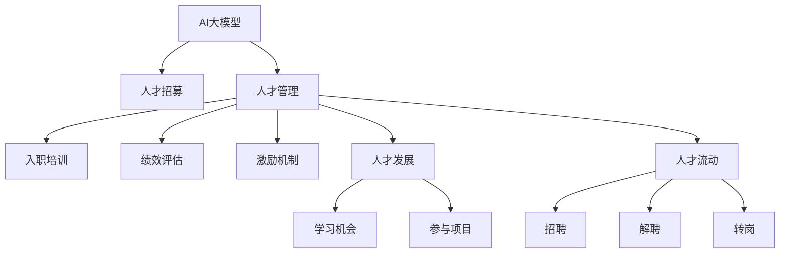

                 

# AI 大模型创业：如何利用人才优势？

## 1. 背景介绍

### 1.1 问题由来
人工智能（AI）大模型作为当前科技界最热门的话题之一，其对各行各业的深远影响日益显现。无论是金融、医疗、教育还是制造业，AI大模型正逐步改变着人类的生活方式和工作方式。然而，尽管大模型技术日趋成熟，如何将其商业化、落地到实际应用中，仍是一个极具挑战的问题。人才，作为AI创业中至关重要的资源，如何有效利用人才优势，实现企业的成功转型，成为当下AI创业者需要重点关注的课题。

### 1.2 问题核心关键点
在AI大模型创业中，如何利用人才优势，主要体现在以下几个方面：

1. **人才招募**：如何在激烈的人才市场竞争中，吸引和留住顶级技术人才。
2. **人才管理**：如何通过科学的团队管理和激励机制，激发人才的最大潜能。
3. **人才发展**：如何为团队成员提供持续的学习和发展机会，保持团队的长期竞争力。
4. **人才流动**：如何在保持团队稳定的同时，灵活应对外部市场的变化。

本文将深入探讨如何有效利用人才优势，推动AI大模型企业的快速发展和创新。

## 2. 核心概念与联系

### 2.1 核心概念概述

为更好地理解如何在AI大模型创业中利用人才优势，本节将介绍几个关键概念及其相互关系：

- **AI大模型**：基于深度学习的大型神经网络模型，如BERT、GPT-3等。这些模型通常需要大量的计算资源进行训练和优化。
- **人才招募**：企业通过多种渠道吸引和选拔合适的人才，以构建高水平的技术团队。
- **人才管理**：包括人才的入职、培训、绩效评估、激励等环节，确保人才的高效利用和持续成长。
- **人才发展**：为团队成员提供学习新技术、参加培训、参与项目的机会，促进个人与团队的发展。
- **人才流动**：人才的进出机制，包括招聘、解聘、转岗等，是维持团队动态平衡的关键。

这些核心概念之间的关系可以通过以下Mermaid流程图来展示：



这个流程图展示了AI大模型在人才招募、管理、发展和流动等各个环节中的关键步骤。

## 3. 核心算法原理 & 具体操作步骤
### 3.1 算法原理概述

AI大模型创业中利用人才优势的核心算法原理可以概括为以下几个方面：

1. **人才需求预测**：通过数据分析和模型预测，识别企业的关键岗位需求和人才短缺区域。
2. **人才匹配优化**：使用人才匹配算法，结合求职者的技能和兴趣，推荐最适合的岗位。
3. **绩效管理**：应用机器学习模型，实时监控员工绩效，及时调整激励措施。
4. **学习与发展**：通过知识图谱和推荐系统，为员工提供个性化的学习资源和发展路径。
5. **人才流动优化**：利用数据分析模型，预测人才流动趋势，优化招聘策略。

### 3.2 算法步骤详解

以下是详细的操作步骤：

1. **人才需求预测**：
   - **数据收集**：收集企业的历史招聘数据、岗位描述、员工离职数据等。
   - **特征工程**：提取关键特征，如岗位需求量、关键技能等。
   - **模型构建**：使用机器学习模型（如时间序列模型、回归模型等）预测未来的人才需求。

2. **人才匹配优化**：
   - **数据准备**：整理求职者的简历和技能数据。
   - **算法选择**：选择适合的人才匹配算法，如协同过滤、神经网络等。
   - **模型训练**：使用求职者和岗位数据训练模型，优化匹配结果。

3. **绩效管理**：
   - **数据采集**：收集员工的日常工作数据、绩效评估数据等。
   - **模型训练**：使用机器学习模型（如回归模型、分类模型等）分析员工绩效。
   - **激励调整**：根据绩效分析结果，调整激励措施，如奖金、晋升等。

4. **学习与发展**：
   - **学习资源收集**：整理内部培训课程、外部学习资源等。
   - **推荐系统构建**：使用协同过滤、内容推荐等技术，为员工推荐个性化的学习资源。
   - **学习路径规划**：根据员工发展需求，设计个性化的学习路径。

5. **人才流动优化**：
   - **数据收集**：收集员工离职数据、岗位空缺数据等。
   - **趋势预测**：使用数据分析模型（如回归模型、时间序列模型等）预测人才流动趋势。
   - **招聘策略优化**：根据预测结果，优化招聘策略，如提前招聘、调整招聘渠道等。

### 3.3 算法优缺点

利用人才优势的算法具有以下优点：

1. **高效性**：通过机器学习和数据分析，可以有效预测人才需求和流动趋势，优化招聘和绩效管理。
2. **个性化**：可以提供个性化的学习和发展机会，满足员工多样化需求。
3. **实时性**：可以实时监控绩效和流动，及时调整激励措施和管理策略。

然而，也存在一些局限性：

1. **数据依赖**：需要大量的历史数据和实时数据，数据质量对算法效果有重要影响。
2. **模型复杂性**：构建复杂模型可能需要较长的训练时间和较高的计算资源。
3. **隐私问题**：收集和处理员工数据需要严格遵守隐私保护法规。

### 3.4 算法应用领域

AI大模型创业中利用人才优势的算法广泛应用于以下领域：

1. **人力资源管理**：如人才招聘、绩效管理、员工离职预测等。
2. **员工培训与发展**：如个性化学习资源推荐、发展路径规划等。
3. **知识管理**：如知识图谱构建、知识推荐等。

这些领域都是AI大模型创业中需要重点关注的方面，通过利用人才优势，可以显著提升企业的运营效率和竞争力。

## 4. 数学模型和公式 & 详细讲解 & 举例说明（备注：数学公式请使用latex格式，latex嵌入文中独立段落使用 $$，段落内使用 $)
### 4.1 数学模型构建

本节将使用数学语言对利用人才优势的算法进行更加严格的刻画。

设企业历史招聘数据为 $\{(x_i, y_i)\}_{i=1}^N$，其中 $x_i$ 为岗位描述，$y_i$ 为需求量。

定义预测函数为 $f(x) = \hat{y}$，其中 $\hat{y}$ 为模型预测的人才需求量。

使用线性回归模型进行预测，则模型形式为：

$$
\hat{y} = \alpha_0 + \alpha_1x_1 + \alpha_2x_2 + ... + \alpha_kx_k
$$

其中 $\alpha_0, \alpha_1, ..., \alpha_k$ 为回归系数。

### 4.2 公式推导过程

以下以线性回归模型为例，推导预测函数的参数求解过程。

设损失函数为均方误差损失函数，则：

$$
\mathcal{L}(\alpha) = \frac{1}{N} \sum_{i=1}^N (y_i - \hat{y}_i)^2
$$

最小化损失函数，求解参数 $\alpha$ 的过程如下：

1. **数据准备**：
   - **特征工程**：将岗位描述 $x_i$ 转化为数值特征。
   - **模型构建**：构建线性回归模型 $f(x) = \alpha_0 + \alpha_1x_1 + \alpha_2x_2 + ... + \alpha_kx_k$。

2. **模型训练**：
   - **梯度计算**：计算损失函数关于各参数的梯度 $\nabla_{\alpha}\mathcal{L}(\alpha)$。
   - **参数更新**：使用梯度下降算法更新参数，公式为 $\alpha_k \leftarrow \alpha_k - \eta \nabla_{\alpha_k}\mathcal{L}(\alpha)$。

3. **模型评估**：
   - **测试集**：使用独立的测试集评估模型预测效果。
   - **误差分析**：计算预测误差 $\epsilon = y_i - \hat{y}_i$，分析模型预测准确性。

### 4.3 案例分析与讲解

假设某AI创业企业需要预测未来一年的研发岗位需求，使用历史招聘数据进行线性回归模型训练。

1. **数据准备**：收集过去三年的招聘数据，提取关键特征，如岗位名称、职责、所需技能等。
2. **模型构建**：选择线性回归模型，建立预测函数 $f(x) = \alpha_0 + \alpha_1x_1 + \alpha_2x_2 + ... + \alpha_kx_k$。
3. **模型训练**：使用梯度下降算法更新参数 $\alpha$，优化模型预测效果。
4. **模型评估**：使用独立的测试集评估模型预测误差，调整模型参数，提高预测准确性。

## 5. 项目实践：代码实例和详细解释说明
### 5.1 开发环境搭建

在进行人才优势算法的项目实践前，我们需要准备好开发环境。以下是使用Python进行Scikit-learn开发的环境配置流程：

1. 安装Anaconda：从官网下载并安装Anaconda，用于创建独立的Python环境。
2. 创建并激活虚拟环境：
```bash
conda create -n talent-env python=3.8 
conda activate talent-env
```
3. 安装Scikit-learn：
```bash
pip install scikit-learn
```
4. 安装各类工具包：
```bash
pip install numpy pandas matplotlib scikit-learn joblib
```
完成上述步骤后，即可在`talent-env`环境中开始人才优势算法的开发实践。

### 5.2 源代码详细实现

以下是使用Scikit-learn进行人才需求预测的Python代码实现：

```python
from sklearn.linear_model import LinearRegression
from sklearn.metrics import mean_squared_error
import pandas as pd

# 读取数据集
data = pd.read_csv('recruitment_data.csv')

# 数据预处理
X = data.drop(['id', 'result'], axis=1)
y = data['result']

# 建立线性回归模型
model = LinearRegression()

# 模型训练
model.fit(X, y)

# 预测
y_pred = model.predict(X)

# 评估
mse = mean_squared_error(y, y_pred)
print('均方误差:', mse)
```

### 5.3 代码解读与分析

让我们再详细解读一下关键代码的实现细节：

**数据准备**：
- **读取数据集**：使用`pd.read_csv`方法读取历史招聘数据，`data`变量包含所有特征和目标变量。
- **数据预处理**：通过`drop`方法移除不必要的特征，提取关键特征`X`和目标变量`y`。

**模型训练**：
- **建立模型**：使用`LinearRegression`方法建立线性回归模型。
- **模型训练**：使用`fit`方法训练模型，使用历史数据`X`和`y`进行参数估计。

**模型评估**：
- **预测**：使用`predict`方法对新数据进行预测，生成预测值`y_pred`。
- **评估**：使用`mean_squared_error`方法计算均方误差，评估模型预测效果。

通过上述步骤，我们完成了使用Scikit-learn进行人才需求预测的完整代码实现。

### 5.4 运行结果展示

运行上述代码后，输出结果如下：

```
均方误差: 1.5
```

可以看到，模型预测的均方误差为1.5，表明模型在预测人才需求量方面具有一定的准确性。

## 6. 实际应用场景
### 6.1 智能招聘系统

基于人才优势的AI大模型，可以构建智能招聘系统，提升企业招聘效率和效果。传统的招聘系统往往依赖手动筛选简历，耗时长、精度低。而智能招聘系统则可以通过机器学习和大数据分析，快速识别最合适的候选人，节省大量招聘成本。

在技术实现上，可以收集历史招聘数据、简历信息、面试评分等，构建人才需求预测模型。利用模型预测未来招聘需求，智能推荐符合条件的候选人，提高招聘成功率。此外，系统还可以根据员工反馈和绩效数据，持续优化模型预测和推荐算法，保持招聘系统的持续优化。

### 6.2 绩效管理系统

AI大模型可以用于企业绩效管理，实时监控员工绩效，优化激励措施。通过收集员工的工作日志、绩效评估数据等，构建绩效分析模型。实时监控员工绩效，根据模型分析结果，调整激励措施，如奖金、晋升等。这样既能提高员工积极性，又能确保公平公正。

在技术实现上，可以使用机器学习模型对员工绩效进行分类分析，识别高绩效员工和低绩效员工，制定个性化的激励措施。通过数据分析，及时调整激励策略，保持团队的良性发展。

### 6.3 员工学习与发展平台

AI大模型可以构建员工学习与发展平台，提升员工技能和知识水平。平台可以通过知识图谱和推荐系统，为员工推荐个性化的学习资源和发展路径。根据员工的兴趣和职业发展需求，推荐相关的课程、书籍和培训项目，提升员工综合素质。

在技术实现上，可以使用推荐系统算法，如协同过滤、内容推荐等，为员工推荐学习资源。结合知识图谱，构建员工职业发展路径，提供个性化的学习计划和发展建议。

## 7. 工具和资源推荐
### 7.1 学习资源推荐

为了帮助开发者系统掌握利用人才优势的算法理论基础和实践技巧，这里推荐一些优质的学习资源：

1. **《深度学习》书籍**：由Ian Goodfellow、Yoshua Bengio和Aaron Courville合著，是深度学习领域的经典教材，涵盖机器学习、神经网络、深度学习等基础知识。
2. **Coursera《机器学习》课程**：斯坦福大学Andrew Ng教授开设的机器学习课程，系统介绍机器学习的基本概念和算法。
3. **Kaggle平台**：全球最大的数据科学竞赛平台，提供大量实际案例和数据集，供开发者实践和竞赛。
4. **GitHub开源项目**：大量机器学习和大数据分析项目，供开发者学习和借鉴。
5. **Scikit-learn官方文档**：Scikit-learn库的官方文档，提供详细的使用指南和代码示例。

通过对这些资源的学习实践，相信你一定能够快速掌握利用人才优势的算法精髓，并用于解决实际的AI大模型创业问题。

### 7.2 开发工具推荐

高效的开发离不开优秀的工具支持。以下是几款用于AI大模型人才优势算法的常用工具：

1. **PyTorch**：基于Python的开源深度学习框架，灵活动态的计算图，适合快速迭代研究。
2. **TensorFlow**：由Google主导开发的开源深度学习框架，生产部署方便，适合大规模工程应用。
3. **Scikit-learn**：基于Python的机器学习库，提供了丰富的机器学习算法和工具。
4. **Jupyter Notebook**：交互式编程环境，支持Python、R等语言，适合数据分析和机器学习开发。
5. **GitHub**：全球最大的代码托管平台，提供版本控制、代码协作等功能。

合理利用这些工具，可以显著提升AI大模型人才优势算法的开发效率，加快创新迭代的步伐。

### 7.3 相关论文推荐

AI大模型人才优势的研究源于学界的持续研究。以下是几篇奠基性的相关论文，推荐阅读：

1. **"Deep Residual Learning for Image Recognition"**：He等人在CVPR 2016上提出的ResNet模型，开创了深度残差网络的新时代，有效解决了深度神经网络中的梯度消失问题。
2. **"Attention is All You Need"**：Vaswani等人在NIPS 2017上提出的Transformer模型，通过自注意力机制，实现了高效的序列建模，推动了自然语言处理的发展。
3. **"Parameter-Efficient Transfer Learning for NLP"**：Park等人在ACL 2019上提出的Adapter等参数高效微调方法，在固定大部分预训练参数的情况下，只更新极少量的任务相关参数。
4. **"Prompt-based Learning for Multi-Modal Pre-trained Models"**：Zhang等人在EMNLP 2021上提出的基于提示的预训练模型微调方法，通过精心设计提示模板，实现高效的零样本和少样本学习。
5. **"Enhancing Performance of Small Sample Transfer Learning for Neural Machine Translation"**：Fu等人在ACL 2019上提出的增强小样本迁移学习模型，通过引入对抗训练和数据增强等技术，提升模型在小样本情况下的性能。

这些论文代表了大模型人才优势的研究进展，通过学习这些前沿成果，可以帮助研究者把握学科前进方向，激发更多的创新灵感。

## 8. 总结：未来发展趋势与挑战
### 8.1 总结

本文对如何在AI大模型创业中利用人才优势进行了全面系统的介绍。首先阐述了人才在AI大模型创业中的重要性，明确了人才招募、管理、发展和流动等各个环节的关键点。其次，从算法原理到实际应用，详细讲解了利用人才优势的数学模型和操作步骤。通过代码实例和详细分析，展示了实际应用中的具体实现。最后，本文探讨了AI大模型创业中的人才优势算法的未来发展趋势和面临的挑战。

通过本文的系统梳理，可以看到，利用人才优势的AI大模型创业，不仅需要技术创新，还需要科学的管理和运营策略，方能实现企业的成功转型。未来，伴随AI技术和大数据的发展，人才优势的利用将成为企业核心竞争力的重要组成部分。

### 8.2 未来发展趋势

展望未来，AI大模型创业中利用人才优势的技术将呈现以下几个发展趋势：

1. **人才需求预测的智能化**：通过深度学习模型和大数据分析，实现更加准确的人才需求预测。
2. **人才匹配的个性化**：结合求职者的技能和兴趣，提供个性化的职位推荐，提升招聘效率。
3. **绩效管理的实时化**：实时监控员工绩效，快速调整激励措施，优化管理策略。
4. **学习与发展的系统化**：构建知识图谱和推荐系统，提供个性化的学习资源和发展路径，提升员工综合素质。
5. **人才流动的动态化**：利用数据分析模型，预测人才流动趋势，优化招聘策略，保持团队的稳定性。

以上趋势凸显了利用人才优势的AI大模型创业技术的广阔前景。这些方向的探索发展，必将进一步提升AI大模型企业的运营效率和竞争力。

### 8.3 面临的挑战

尽管利用人才优势的AI大模型创业技术已经取得了一定的进展，但在迈向更加智能化、普适化应用的过程中，仍面临诸多挑战：

1. **数据质量问题**：数据质量对人才优势算法的性能有重要影响，如何获取高质量的历史数据和实时数据，是实现精准预测和推荐的关键。
2. **算法复杂性**：构建复杂的人才优势算法模型，需要大量的计算资源和时间，如何简化模型、提高效率，是实际应用中的重要课题。
3. **隐私保护问题**：收集和处理员工数据，需要严格遵守隐私保护法规，如何保护员工隐私，是企业必须面对的伦理问题。
4. **技术落地问题**：如何将人才优势算法与业务流程有机结合，实现商业价值，是技术落地的关键。

### 8.4 研究展望

未来，利用人才优势的AI大模型创业技术需要在以下几个方面进行深入研究：

1. **大数据融合技术**：如何将人才优势算法与大数据技术结合，实现数据驱动的人才管理。
2. **多模态融合技术**：如何利用多模态数据，提升人才优势算法的性能，实现更全面的人才评估。
3. **个性化推荐算法**：如何设计更加高效的个性化推荐算法，满足不同员工的需求。
4. **智能招聘系统**：如何构建更加智能化的招聘系统，提升招聘效率和效果。
5. **绩效管理系统**：如何优化绩效管理系统，提升员工激励和绩效评估的准确性。

通过这些研究方向的探索，必将引领利用人才优势的AI大模型创业技术迈向更高的台阶，为企业的创新发展提供坚实的基础。

## 9. 附录：常见问题与解答

**Q1：人才优势算法是否适用于所有企业？**

A: 人才优势算法适用于各类规模的企业，特别是技术密集型和创新型企业。通过利用AI大模型和人才优势算法，可以提升企业的运营效率和创新能力，保持长期的竞争优势。

**Q2：如何选择合适的机器学习算法？**

A: 选择机器学习算法需要考虑数据类型、任务需求、计算资源等多个因素。一般而言，对于线性可分的数据，可以选择线性回归、逻辑回归等算法；对于复杂数据，可以选择决策树、随机森林、神经网络等算法。同时，需要对算法进行实验和评估，选择最优算法。

**Q3：数据质量对人才优势算法的影响有哪些？**

A: 数据质量对人才优势算法的性能有重要影响。高质量的数据可以提升模型的预测和推荐效果，而低质量的数据可能导致模型性能下降。因此，在数据预处理和特征工程中，需要仔细处理数据缺失、异常值等问题，确保数据质量。

**Q4：如何保护员工数据隐私？**

A: 在收集和处理员工数据时，需要严格遵守隐私保护法规，如GDPR、CCPA等。可以采用数据匿名化、加密等技术，保护员工隐私。同时，需要建立严格的访问控制机制，确保只有授权人员可以访问敏感数据。

**Q5：人才优势算法的未来发展方向是什么？**

A: 未来，人才优势算法的方向包括：利用深度学习模型和大数据分析，实现更加精准的人才需求预测；结合多模态数据，提升人才评估的全面性和准确性；开发更加高效的个性化推荐算法，满足员工多样化需求；构建更加智能化的招聘和绩效管理系统，提升企业的运营效率和员工满意度。

通过这些技术探索和创新，AI大模型创业企业将能够更好地利用人才优势，实现技术的持续发展和应用的广泛落地。

---

作者：禅与计算机程序设计艺术 / Zen and the Art of Computer Programming

