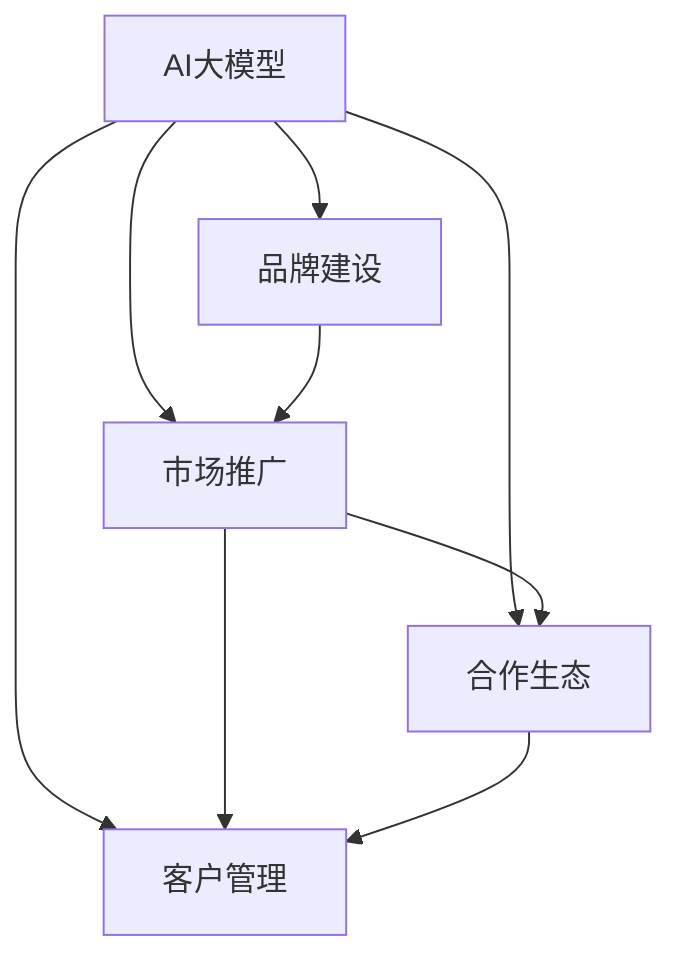

                 

# AI 大模型创业：如何利用品牌优势？

## 1. 背景介绍

### 1.1 问题由来

随着人工智能技术的迅猛发展，AI大模型已经成为众多创业项目的关键资源。这些模型拥有强大的数据处理和决策能力，在图像识别、自然语言处理、语音识别等诸多领域展现了卓越的性能。然而，一个优秀的AI大模型不仅需要强大的算法和数据，更需要卓越的品牌和市场推广能力。如何利用品牌优势，提升大模型的市场竞争力，是当前AI创业项目亟待解决的重要问题。

### 1.2 问题核心关键点

AI大模型的品牌优势主要体现在以下几个方面：

1. **用户信任度**：优秀的品牌形象能提升用户对模型的信任度，吸引更多客户使用。
2. **市场影响力**：品牌强大的市场号召力可以帮助模型快速覆盖更多客户，带来更大的市场份额。
3. **价格弹性**：知名品牌的大模型具有较高的议价能力，可以带来更高的利润率。
4. **生态系统**：知名品牌更容易吸引合作伙伴和开发者加入，形成良性循环的生态系统。

本文将从品牌建设、市场推广、客户管理、合作生态等多个维度，详细探讨如何利用品牌优势，推动AI大模型的成功创业。

## 2. 核心概念与联系

### 2.1 核心概念概述

为更好地理解利用品牌优势的AI大模型创业方法，本节将介绍几个关键概念：

- **AI大模型**：指基于深度学习技术，在图像、语音、文本等多个领域具备强大数据处理能力的模型，如BERT、GPT-3、ResNet等。
- **品牌建设**：指通过一系列市场营销手段，提升模型的知名度、美誉度和用户信任度的过程。
- **市场推广**：指通过多种渠道和方式，将模型推向市场，吸引潜在客户的过程。
- **客户管理**：指对模型用户进行细分和分析，制定相应的客户策略，提高客户满意度和忠诚度。
- **合作生态**：指通过与合作伙伴、开发者、学术机构等建立合作关系，形成稳定的合作关系网络。

这些概念之间的联系可以通过以下Mermaid流程图来展示：



这个流程图展示了大模型创业中各个概念的相互关系：

1. 大模型通过品牌建设提升知名度和用户信任度。
2. 通过市场推广将模型推向市场，吸引客户。
3. 客户管理通过细分和分析用户需求，提高客户满意度和忠诚度。
4. 合作生态形成稳定的合作关系网络，进一步扩大市场影响力。

## 3. 核心算法原理 & 具体操作步骤
### 3.1 算法原理概述

AI大模型的品牌优势构建，本质上是一个综合性的市场营销和客户管理过程。其核心思想是：通过一系列系统性的品牌建设和市场推广活动，提升模型的市场知名度和用户信任度，同时通过客户管理和合作生态建设，实现客户留存和市场扩展，从而实现商业价值最大化。

### 3.2 算法步骤详解

**Step 1: 品牌建设**

1. **市场调研**：对目标市场进行深入调研，了解用户的需求、痛点和竞争状况。
2. **品牌定位**：根据市场调研结果，确定品牌的核心价值主张和差异化特征。
3. **品牌设计**：设计品牌标识、口号、形象等元素，形成统一的视觉和语言风格。
4. **品牌传播**：通过线上线下多种渠道，如社交媒体、博客、发布会等，广泛传播品牌信息，提升知名度。

**Step 2: 市场推广**

1. **产品展示**：通过官网、白皮书、演示视频等多种方式，展示模型的核心功能和性能。
2. **客户案例**：收集和宣传客户使用案例，展示模型的实际应用效果。
3. **合作伙伴**：寻找和合作知名企业、学术机构，借助其影响力推广模型。
4. **市场活动**：举办线上线下活动，如培训、研讨会、黑客松等，增强与客户的互动。

**Step 3: 客户管理**

1. **客户细分**：根据客户使用模型的方式、场景和需求，进行分类和细分。
2. **客户反馈**：收集客户使用过程中的反馈和建议，及时优化模型和产品。
3. **客户服务**：建立专业的客户服务团队，提供技术支持、问题解答等服务。
4. **客户忠诚度**：通过积分、优惠券、独家资源等措施，提高客户忠诚度。

**Step 4: 合作生态**

1. **合作伙伴**：寻找技术合作伙伴、应用开发者、行业专家等，共同推广和应用模型。
2. **开源社区**：建立开源社区，吸引开发者和学术界贡献代码和研究成果。
3. **学术合作**：与知名大学和研究机构合作，推动前沿技术研究与应用。
4. **生态维护**：定期举办技术交流、合作活动，保持生态系统的活跃和稳定。

### 3.3 算法优缺点

利用品牌优势构建AI大模型创业，具有以下优点：

1. **市场快速覆盖**：通过品牌影响力，大模型可以快速吸引更多客户，提升市场份额。
2. **客户信任度高**：知名品牌的大模型往往具有更高的用户信任度，降低客户流失率。
3. **资源整合能力强**：知名品牌更容易吸引合作伙伴和开发者，形成稳定的合作关系网络。
4. **议价能力强**：品牌影响力强的大模型具有更高的议价能力，带来更高的利润率。

同时，该方法也存在以下局限性：

1. **成本高**：品牌建设、市场推广等需要大量资源投入，短期内难以见效。
2. **风险高**：品牌形象一旦受损，可能会影响模型商业价值的实现。
3. **竞争激烈**：AI大模型市场竞争激烈，品牌优势并非万能。

尽管存在这些局限性，但就目前而言，利用品牌优势仍是AI大模型创业的重要策略。未来相关研究的重点在于如何优化品牌建设和市场推广策略，降低成本风险，提高品牌影响力。

### 3.4 算法应用领域

利用品牌优势构建AI大模型创业，广泛应用于以下几个领域：

- **自然语言处理(NLP)**：利用品牌影响力，推动语言模型在翻译、问答、情感分析等任务上的应用。
- **计算机视觉(CV)**：通过品牌建设，促进图像识别、物体检测等模型在医疗、安防、自动驾驶等场景中的应用。
- **语音识别(Speech)**：借助品牌优势，加速语音识别模型在智能家居、智能客服、语音助手等领域的落地。
- **推荐系统**：通过品牌营销，推动个性化推荐模型在电商、新闻、音乐等平台中的应用。
- **医疗健康**：利用品牌影响力，推动医疗影像分析、基因组学等AI模型在医疗行业的应用。

此外，基于大模型微调的对话系统、知识图谱、虚拟助手等应用领域，品牌优势也起着关键作用。通过品牌建设，这些应用可以更好地满足用户需求，提升市场竞争力。

## 4. 数学模型和公式 & 详细讲解 & 举例说明（备注：数学公式请使用latex格式，latex嵌入文中独立段落使用 $$，段落内使用 $)
### 4.1 数学模型构建

品牌建设的目标是通过一系列市场营销活动，提升用户对AI大模型的信任度和满意度。其数学模型可以表示为：

$$
\text{Brand Impact} = f(\text{Marketing Effort}, \text{Customer Feedback}, \text{Competitor Impact})
$$

其中，$\text{Marketing Effort}$表示品牌建设投入的资源和努力，$\text{Customer Feedback}$表示客户对模型的反馈和评价，$\text{Competitor Impact}$表示竞争对手的市场影响力。

### 4.2 公式推导过程

为了优化品牌建设的效果，需要对上述公式进行进一步推导和分析。我们假设品牌影响力由品牌建设投入、客户反馈和竞争环境三个因素共同决定。则可以通过以下步骤进行推导：

1. **品牌建设投入**：品牌建设的效果与投入的资源成正比，即：

$$
\text{Brand Impact}_{\text{build}} = k_1 \cdot \text{Marketing Effort}
$$

其中，$k_1$为品牌建设效果的系数。

2. **客户反馈**：客户反馈与满意度成正比，满意度与品牌影响力成正比，即：

$$
\text{Brand Impact}_{\text{feedback}} = k_2 \cdot \text{Customer Feedback}
$$

其中，$k_2$为客户反馈效果的系数。

3. **竞争环境**：竞争对手的市场影响力越大，品牌建设的效果越差，即：

$$
\text{Brand Impact}_{\text{competitor}} = -k_3 \cdot \text{Competitor Impact}
$$

其中，$k_3$为竞争环境影响的系数。

将上述公式代入总体品牌影响力的计算公式中，得：

$$
\text{Brand Impact} = k_1 \cdot \text{Marketing Effort} + k_2 \cdot \text{Customer Feedback} - k_3 \cdot \text{Competitor Impact}
$$

### 4.3 案例分析与讲解

假设某AI大模型品牌建设投入的资源为$100万元，客户反馈评分为$4.5$，竞争对手的市场影响力为$0.8$。则品牌影响力计算如下：

1. **品牌建设投入**：

$$
\text{Brand Impact}_{\text{build}} = 100 \times k_1
$$

2. **客户反馈**：

$$
\text{Brand Impact}_{\text{feedback}} = 4.5 \times k_2
$$

3. **竞争环境**：

$$
\text{Brand Impact}_{\text{competitor}} = -0.8 \times k_3
$$

将上述计算结果代入总体品牌影响力公式中，得：

$$
\text{Brand Impact} = 100 \times k_1 + 4.5 \times k_2 - 0.8 \times k_3
$$

通过调整系数$k_1$、$k_2$和$k_3$，可以优化品牌建设的效果。例如，在模型发布初期，可以加大品牌建设投入，提升市场知名度；在客户使用过程中，应注重收集和反馈，提升客户满意度；在竞争激烈的市场环境中，应加强品牌建设和竞争应对策略，提升品牌竞争力。

## 5. 项目实践：代码实例和详细解释说明
### 5.1 开发环境搭建

在进行AI大模型品牌建设时，需要准备好开发环境。以下是使用Python进行品牌建设实践的环境配置流程：

1. 安装Anaconda：从官网下载并安装Anaconda，用于创建独立的Python环境。

2. 创建并激活虚拟环境：
```bash
conda create -n brand-env python=3.8 
conda activate brand-env
```

3. 安装PyTorch：根据CUDA版本，从官网获取对应的安装命令。例如：
```bash
conda install pytorch torchvision torchaudio cudatoolkit=11.1 -c pytorch -c conda-forge
```

4. 安装TensorFlow：由Google主导开发的开源深度学习框架，生产部署方便，适合大规模工程应用。同样有丰富的预训练语言模型资源。

5. 安装Flask：用于构建Web应用程序，支持Python，易于扩展。

6. 安装Scikit-learn：用于数据预处理和模型训练。

完成上述步骤后，即可在`brand-env`环境中开始品牌建设实践。

### 5.2 源代码详细实现

下面我们以一个简单的品牌建设实践为例，展示如何使用Flask构建Web应用程序，收集用户反馈并展示品牌信息。

```python
from flask import Flask, request, render_template
import pandas as pd
import numpy as np
from sklearn.model_selection import train_test_split

app = Flask(__name__)

# 品牌信息
brand_info = {
    'name': 'MyAIModel',
    'description': 'A leading AI language model for various NLP tasks',
    'customers': ['Company A', 'Company B', 'Company C']
}

# 用户反馈数据
feedback_data = pd.read_csv('feedback.csv')

# 展示品牌信息
@app.route('/')
def home():
    return render_template('home.html', brand_info=brand_info)

# 收集用户反馈
@app.route('/feedback', methods=['POST'])
def submit_feedback():
    name = request.form.get('name')
    email = request.form.get('email')
    feedback = request.form.get('feedback')
    feedback_data.append({'name': name, 'email': email, 'feedback': feedback})
    return 'Feedback submitted successfully!'

# 统计用户反馈
@app.route('/feedback_stats')
def feedback_stats():
    feedback_stats = feedback_data['feedback'].value_counts() / len(feedback_data)
    return render_template('feedback_stats.html', feedback_stats=feedback_stats)

if __name__ == '__main__':
    app.run(debug=True)
```

在上述代码中，我们通过Flask构建了一个简单的Web应用程序，展示了品牌信息，并提供了收集用户反馈的功能。用户可以通过提交表单，反馈对模型的使用体验和建议，我们将其存储在CSV文件中，并统计用户反馈的分布情况。

### 5.3 代码解读与分析

让我们再详细解读一下关键代码的实现细节：

**Flask框架**：
- `Flask`是Python中最流行的Web框架之一，使用简单，易于扩展。通过装饰器方式定义路由和视图函数。

**品牌信息**：
- `brand_info`字典中存储了品牌的基本信息，如名称、描述和客户列表。

**用户反馈**：
- `feedback_data` DataFrame存储了用户反馈的数据，包括姓名、邮箱和反馈内容。

**路由定义**：
- `/`路由展示品牌信息。
- `'/feedback'`路由收集用户反馈。
- `'/feedback_stats'`路由统计用户反馈分布。

**视图函数**：
- `home`函数展示品牌信息页面。
- `submit_feedback`函数收集用户反馈。
- `feedback_stats`函数统计用户反馈分布，并展示在页面上。

通过Flask框架，我们可以轻松地构建一个Web应用程序，收集用户反馈，并展示品牌信息。这对于品牌建设中的客户互动和用户管理非常有用。

## 6. 实际应用场景

### 6.1 自然语言处理(NLP)

AI大模型在自然语言处理领域的应用，离不开品牌建设和市场推广。通过品牌优势，NLP模型可以在问答、情感分析、机器翻译等任务上快速获得市场认可，推动大规模应用落地。

具体而言，可以通过以下方式利用品牌优势：

1. **品牌宣传**：在NLP相关行业会议、期刊、博客等平台上，广泛宣传模型的核心功能和技术优势。
2. **客户案例**：收集和宣传知名客户的应用案例，展示模型的实际效果。
3. **技术合作**：与知名公司、大学合作，推动前沿NLP技术的研究与应用。
4. **社区建设**：建立开源社区，吸引开发者和学术界贡献代码和研究成果。

### 6.2 计算机视觉(CV)

AI大模型在计算机视觉领域的应用，同样离不开品牌建设。通过品牌优势，CV模型可以在图像识别、物体检测等任务上快速获得市场认可，推动大规模应用落地。

具体而言，可以通过以下方式利用品牌优势：

1. **品牌宣传**：在CV相关行业会议、期刊、博客等平台上，广泛宣传模型的核心功能和技术优势。
2. **客户案例**：收集和宣传知名客户的应用案例，展示模型的实际效果。
3. **技术合作**：与知名公司、大学合作，推动前沿CV技术的研究与应用。
4. **社区建设**：建立开源社区，吸引开发者和学术界贡献代码和研究成果。

### 6.3 推荐系统

AI大模型在推荐系统中的应用，同样离不开品牌建设。通过品牌优势，推荐模型可以在电商、新闻、音乐等平台快速获得市场认可，推动大规模应用落地。

具体而言，可以通过以下方式利用品牌优势：

1. **品牌宣传**：在推荐系统相关行业会议、期刊、博客等平台上，广泛宣传模型的核心功能和技术优势。
2. **客户案例**：收集和宣传知名客户的应用案例，展示模型的实际效果。
3. **技术合作**：与知名公司、大学合作，推动前沿推荐系统技术的研究与应用。
4. **社区建设**：建立开源社区，吸引开发者和学术界贡献代码和研究成果。

## 7. 工具和资源推荐
### 7.1 学习资源推荐

为了帮助开发者系统掌握AI大模型品牌建设和市场推广的理论基础和实践技巧，这里推荐一些优质的学习资源：

1. **《品牌管理：理论与实践》系列博文**：由品牌管理专家撰写，深入浅出地介绍了品牌建设、市场推广等关键内容。

2. **Coursera《市场营销与数字战略》课程**：由知名大学开设的营销课程，提供系统性的营销理论知识，包括品牌建设、市场推广等。

3. **《数字营销入门》书籍**：详细介绍了数字营销的各个环节，包括品牌建设、市场推广、客户管理等。

4. **Google Analytics学院**：提供免费的数字营销培训课程，涵盖品牌建设、市场推广、客户管理等多个方面。

5. **HubSpot Academy**：提供免费的营销自动化培训课程，帮助企业掌握数字营销工具，提升品牌影响力和市场竞争力。

通过对这些资源的学习实践，相信你一定能够快速掌握AI大模型品牌建设的精髓，并用于解决实际的营销问题。

### 7.2 开发工具推荐

高效的开发离不开优秀的工具支持。以下是几款用于AI大模型品牌建设和市场推广开发的常用工具：

1. **Google Analytics**：提供丰富的数据分析工具，帮助品牌管理者了解用户行为，优化市场推广策略。

2. **Hootsuite**：社交媒体管理工具，支持多平台账号管理，提高品牌宣传效率。

3. **Mailchimp**：电子邮件营销平台，帮助品牌管理者构建客户邮件列表，进行精准营销。

4. **Canva**：在线设计工具，帮助品牌管理者设计品牌宣传材料，提升品牌形象。

5. **Adobe Creative Cloud**：全套设计工具，支持品牌宣传材料的高质量制作。

合理利用这些工具，可以显著提升AI大模型品牌建设和市场推广的效率，加快创新迭代的步伐。

### 7.3 相关论文推荐

品牌建设和技术创新的结合，成为当前学术界和工业界的热门话题。以下是几篇奠基性的相关论文，推荐阅读：

1. **《品牌建设与企业绩效：实证研究综述》**：综述了品牌建设对企业绩效的影响，提供了丰富的理论和实证分析。

2. **《数字营销的未来：基于区块链的品牌建设》**：探讨了数字营销的未来趋势，以及区块链技术在品牌建设中的应用。

3. **《AI技术在品牌管理中的应用》**：详细介绍了AI技术在品牌管理中的应用场景，包括品牌建设、市场推广等。

4. **《品牌建设与品牌传播：理论与实践》**：提供了品牌建设与传播的理论框架和实践指南，帮助品牌管理者制定系统性策略。

这些论文代表了大模型品牌建设的最新研究方向，通过学习这些前沿成果，可以帮助研究者把握学科前进方向，激发更多的创新灵感。

## 8. 总结：未来发展趋势与挑战

### 8.1 总结

本文对利用品牌优势构建AI大模型的创业方法进行了全面系统的介绍。首先阐述了品牌建设、市场推广、客户管理、合作生态等关键概念，明确了品牌优势在AI大模型创业中的独特价值。其次，从原理到实践，详细讲解了品牌建设和市场推广的数学模型和具体操作步骤，给出了品牌建设任务开发的完整代码实例。同时，本文还广泛探讨了品牌优势在NLP、CV、推荐系统等诸多领域的应用前景，展示了品牌优势的巨大潜力。

通过本文的系统梳理，可以看到，利用品牌优势构建AI大模型创业的方法，已经在诸多应用场景中取得了显著效果。未来，伴随品牌建设和市场推广策略的不断优化，AI大模型将具备更强的市场竞争力，带来更大的商业价值。

### 8.2 未来发展趋势

展望未来，AI大模型品牌建设将呈现以下几个发展趋势：

1. **品牌智能化**：借助AI技术，实现品牌建设的自动化、智能化，提高品牌管理效率。

2. **客户互动**：通过智能客服、推荐系统等技术，提升客户互动体验，增强品牌黏性。

3. **社交媒体**：利用社交媒体平台，广泛传播品牌信息，提升品牌知名度和美誉度。

4. **品牌联合**：与知名品牌联合推广，形成品牌联盟，提升市场竞争力。

5. **数据驱动**：利用大数据分析技术，深入了解客户需求和市场趋势，优化品牌建设策略。

以上趋势凸显了品牌建设的广阔前景。这些方向的探索发展，必将进一步提升AI大模型的市场竞争力，为AI创业项目带来新的发展机遇。

### 8.3 面临的挑战

尽管利用品牌优势构建AI大模型创业方法具有诸多优势，但在实际操作中，也面临诸多挑战：

1. **成本高**：品牌建设、市场推广等需要大量资源投入，短期内难以见效。

2. **风险高**：品牌形象一旦受损，可能会影响模型商业价值的实现。

3. **竞争激烈**：AI大模型市场竞争激烈，品牌优势并非万能。

尽管存在这些挑战，但就目前而言，利用品牌优势仍是AI大模型创业的重要策略。未来相关研究的重点在于如何优化品牌建设和市场推广策略，降低成本风险，提高品牌影响力。

### 8.4 研究展望

面对AI大模型品牌建设所面临的挑战，未来的研究需要在以下几个方面寻求新的突破：

1. **品牌智能化**：开发更加智能化的品牌管理工具，降低人工干预，提高品牌建设效率。

2. **客户互动优化**：通过智能客服、推荐系统等技术，优化客户互动体验，提升品牌黏性。

3. **社交媒体创新**：利用社交媒体平台，创新品牌宣传方式，提升品牌知名度和美誉度。

4. **数据驱动营销**：利用大数据分析技术，深入了解客户需求和市场趋势，优化品牌建设策略。

5. **品牌联合策略**：制定合理的品牌联合策略，提升市场竞争力，形成品牌联盟。

这些研究方向的探索，必将引领AI大模型品牌建设走向更高的台阶，为AI创业项目带来新的发展机遇。相信随着学界和产业界的共同努力，品牌建设技术将更加完善，AI大模型将具备更强的市场竞争力，带来更大的商业价值。

## 9. 附录：常见问题与解答

**Q1：AI大模型的品牌建设是否适用于所有领域？**

A: AI大模型的品牌建设虽然在一些领域具有广泛适用性，但在某些特定领域可能面临挑战。例如，医疗、法律等行业由于数据隐私和安全要求，品牌建设需要更加谨慎。此外，对于一些需要高度专业化的技术领域，品牌建设也需要更强的技术支持和专业知识。

**Q2：AI大模型的品牌建设需要多少投入？**

A: AI大模型的品牌建设需要根据具体情况确定投入规模。一般而言，品牌建设的初期投入较大，但随着品牌影响力的提升，后续的维护和优化成本会逐渐降低。建议从小规模开始尝试，逐步增加投入，形成稳定的品牌影响力。

**Q3：AI大模型的品牌建设效果如何衡量？**

A: AI大模型的品牌建设效果可以从多个维度进行衡量，如品牌知名度、客户满意度、市场份额、财务表现等。通过定期跟踪这些指标，可以评估品牌建设的效果，及时调整策略。

**Q4：AI大模型的品牌建设需要注意哪些问题？**

A: AI大模型的品牌建设需要注意以下几个问题：

1. **品牌定位**：明确品牌的核心价值主张和差异化特征。
2. **客户互动**：通过智能客服、推荐系统等技术，提升客户互动体验。
3. **数据隐私**：在品牌建设过程中，要严格遵守数据隐私和安全法规，保护用户隐私。
4. **竞争策略**：制定合理的品牌竞争策略，避免过度竞争。

这些问题的合理应对，可以提升AI大模型的品牌建设效果，实现商业价值的最大化。

**Q5：AI大模型的品牌建设如何与技术创新结合？**

A: AI大模型的品牌建设与技术创新可以紧密结合，形成良性循环。具体而言，可以通过以下方式结合：

1. **技术展示**：通过技术展示和演示，提升品牌形象。
2. **客户反馈**：收集和利用客户反馈，不断优化模型和技术。
3. **合作伙伴**：与知名公司和机构合作，推动技术创新和应用。
4. **开源社区**：建立开源社区，吸引开发者和学术界贡献代码和研究成果。

通过这些方式，可以将品牌建设和技术创新有机结合，推动AI大模型的快速发展和应用。

---

作者：禅与计算机程序设计艺术 / Zen and the Art of Computer Programming

