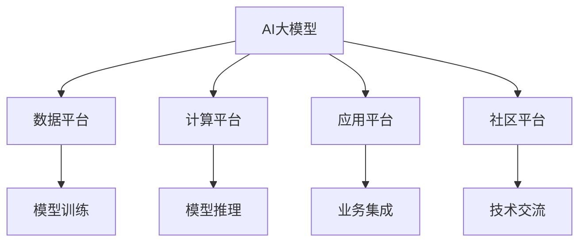

                 

## 1. 背景介绍

### 1.1 问题由来

随着人工智能技术的迅猛发展，AI大模型在各个行业中逐渐崭露头角，成为企业数字化转型的重要推动力。大模型的训练和部署成本相对较高，但其出色的泛化能力和表现，使其在自然语言处理(NLP)、计算机视觉(CV)、推荐系统等领域展现出巨大的潜力。越来越多的企业开始涉足AI大模型创业，希望通过其先进的技术和能力来推动业务增长。

然而，在实践中，大模型创业也面临着一系列挑战：技术门槛高、数据资源稀缺、应用场景狭窄等。这些问题不仅增加了创业成本，也限制了企业的创新能力。为解决这些问题，利用平台优势成为AI大模型创业的关键。

### 1.2 问题核心关键点

AI大模型创业利用平台优势主要体现在以下几个方面：

- **数据平台**：通过大规模数据平台，企业可以轻松获取海量数据资源，加快模型训练进程。
- **计算平台**：借助高性能计算平台，企业能够快速训练和部署大模型，大幅降低时间成本。
- **应用平台**：利用丰富的应用平台生态，企业可以将大模型快速集成到业务系统中，提升应用效率。
- **社区平台**：参与开源社区，利用社区资源共享，加速技术创新和应用推广。

这些平台优势使得AI大模型创业企业在数据、计算、应用等方面具有更强的竞争力，可以迅速开发出具备市场竞争力的AI应用。

### 1.3 问题研究意义

AI大模型创业利用平台优势，将极大提升企业的技术研发和应用能力，帮助企业在激烈的市场竞争中占据有利地位。具体来说：

1. **降低创业门槛**：利用平台资源，企业可以更快、更经济地开发出高性能的AI应用。
2. **提升应用效果**：平台资源能够帮助企业更高效地进行模型优化，提升应用表现。
3. **加速创新迭代**：平台生态支持下的开放交流，加速技术创新和应用升级。
4. **拓展市场应用**：平台化应用使企业能快速将AI应用集成到业务流程中，提升市场竞争力。

通过深入挖掘平台优势，AI大模型创业企业能够更高效、更灵活地开发和应用AI技术，加速业务创新和发展。

## 2. 核心概念与联系

### 2.1 核心概念概述

为更好地理解AI大模型创业利用平台优势的策略，本节将介绍几个关键概念：

- **AI大模型**：如BERT、GPT-3等，基于大规模数据进行预训练，具备出色泛化能力的人工智能模型。
- **平台优势**：企业通过数据、计算、应用、社区等平台资源，提升AI应用的开发效率和应用效果。
- **生态系统**：由技术、人才、资金等要素组成的综合环境，支持AI大模型的创新和应用。
- **开放API**：企业将AI模型封装为开放API，方便其他系统调用，提升模型应用灵活性。

这些概念之间的逻辑关系可以通过以下Mermaid流程图来展示：



这个流程图展示了大模型和各平台之间的关系：

1. 大模型通过数据平台获取训练数据，在计算平台进行模型训练。
2. 模型训练完成后，通过应用平台集成到业务系统中，借助社区平台进行技术交流和资源共享。
3. 利用平台优势，大模型创业企业可以快速开发和部署高性能的AI应用。

## 3. 核心算法原理 & 具体操作步骤

### 3.1 算法原理概述

AI大模型创业利用平台优势的核心在于通过各类平台资源进行资源整合，提升模型的训练效率和应用效果。这主要体现在以下几个方面：

- **数据平台**：利用数据平台的海量数据资源，加速模型训练，提升模型泛化能力。
- **计算平台**：借助高性能计算平台，提高模型训练和推理的速度，降低时间成本。
- **应用平台**：通过开放API，将模型快速集成到业务系统，提升应用效率。
- **社区平台**：参与开源社区，共享技术资源，加速技术创新。

这些平台资源整合和利用，能够显著提升AI大模型创业企业在技术研发和应用推广方面的竞争力。

### 3.2 算法步骤详解

AI大模型创业利用平台优势，主要步骤如下：

**Step 1: 选择合适的平台资源**
- 数据平台：利用谷歌云、亚马逊AWS等平台提供的云数据服务，获取海量标注数据。
- 计算平台：使用谷歌TPU、亚马逊EC2等高性能计算资源，加速模型训练和推理。
- 应用平台：依托微软Azure、阿里云等平台提供的云服务，快速集成模型到业务系统中。
- 社区平台：参与开源社区，利用GitHub、Kaggle等平台的开源资源和交流机会。

**Step 2: 模型训练与优化**
- 在数据平台上对大模型进行预训练和微调，利用计算平台进行大规模并行训练，优化模型参数。
- 在训练过程中，应用正则化技术如L2正则、Dropout等，避免过拟合。
- 利用平台提供的优化算法如AdamW、SGD等，调整学习率等超参数。

**Step 3: 模型部署与集成**
- 通过应用平台的开放API，将训练好的模型集成到业务系统中，实现快速部署。
- 根据应用需求，调整模型输入格式和输出格式，使其适应不同的应用场景。
- 利用平台提供的监控和日志服务，实时监测模型性能，及时进行调整和优化。

**Step 4: 社区交流与技术创新**
- 在社区平台上参与开源项目，贡献代码和资源，获取最新技术动态。
- 利用社区交流平台，如Stack Overflow、GitHub等，解决技术问题，获取反馈和建议。
- 参与技术竞赛和会议，展示企业技术实力，获取行业认可。

### 3.3 算法优缺点

利用平台优势进行AI大模型创业，具有以下优点：

1. **加速模型训练**：通过平台资源整合，能够快速获取大规模数据和计算资源，加速模型训练。
2. **提升应用效果**：平台优势能够提升模型性能，提高应用效率和效果。
3. **降低创业成本**：利用平台提供的资源和工具，降低模型训练和应用开发的成本。
4. **加速技术创新**：平台社区支持下的交流和资源共享，加速技术创新和应用升级。

然而，利用平台优势也存在以下缺点：

1. **数据隐私风险**：依赖平台获取数据，可能面临数据隐私和安全问题。
2. **技术依赖性强**：平台资源的依赖可能导致技术路径单一，难以灵活应对变化。
3. **社区参与门槛高**：参与开源社区需要一定的技术背景和资源，门槛较高。

尽管存在这些缺点，但平台优势在提高企业技术研发和应用能力方面，依然具有重要价值。

### 3.4 算法应用领域

利用平台优势进行AI大模型创业，已经在多个领域取得了显著成果。

- **自然语言处理**：利用数据平台和计算平台，快速开发出具备强大语言理解和生成能力的大模型，如BERT、GPT-3等。
- **计算机视觉**：通过高性能计算平台，训练出具备高识别率和高泛化能力的大模型，如ResNet、Inception等。
- **推荐系统**：借助数据平台和计算平台，训练出具备高精度的推荐模型，提升用户体验和系统性能。
- **医疗健康**：利用医疗数据平台和计算平台，训练出具备高临床应用价值的大模型，辅助医生诊断和治疗。
- **金融风控**：通过金融数据平台和计算平台，训练出具备高预测准确率的大模型，提升风险管理能力。

以上领域只是冰山一角，随着AI大模型和平台技术的不断进步，未来在更多场景中的应用前景将更加广阔。

## 4. 数学模型和公式 & 详细讲解 & 举例说明

### 4.1 数学模型构建

本节将使用数学语言对AI大模型创业利用平台优势的策略进行更加严格的刻画。

记AI大模型为 $M_{\theta}:\mathcal{X} \rightarrow \mathcal{Y}$，其中 $\mathcal{X}$ 为输入空间，$\mathcal{Y}$ 为输出空间，$\theta \in \mathbb{R}^d$ 为模型参数。假设企业从数据平台获取到标注数据集 $D=\{(x_i,y_i)\}_{i=1}^N$，在计算平台进行模型训练，优化目标是最小化经验风险：

$$
\mathcal{L}(\theta) = \frac{1}{N} \sum_{i=1}^N \ell(M_{\theta}(x_i),y_i)
$$

其中 $\ell$ 为损失函数，如交叉熵损失、均方误差损失等。在训练过程中，应用正则化技术如L2正则、Dropout等，避免过拟合。优化器如AdamW、SGD等，调整学习率等超参数。

### 4.2 公式推导过程

以二分类任务为例，推导交叉熵损失函数及其梯度的计算公式。

假设模型 $M_{\theta}$ 在输入 $x$ 上的输出为 $\hat{y}=M_{\theta}(x) \in [0,1]$，表示样本属于正类的概率。真实标签 $y \in \{0,1\}$。则二分类交叉熵损失函数定义为：

$$
\ell(M_{\theta}(x),y) = -[y\log \hat{y} + (1-y)\log (1-\hat{y})]
$$

将其代入经验风险公式，得：

$$
\mathcal{L}(\theta) = -\frac{1}{N}\sum_{i=1}^N [y_i\log M_{\theta}(x_i)+(1-y_i)\log(1-M_{\theta}(x_i))]
$$

根据链式法则，损失函数对参数 $\theta_k$ 的梯度为：

$$
\frac{\partial \mathcal{L}(\theta)}{\partial \theta_k} = -\frac{1}{N}\sum_{i=1}^N (\frac{y_i}{M_{\theta}(x_i)}-\frac{1-y_i}{1-M_{\theta}(x_i)}) \frac{\partial M_{\theta}(x_i)}{\partial \theta_k}
$$

其中 $\frac{\partial M_{\theta}(x_i)}{\partial \theta_k}$ 可进一步递归展开，利用自动微分技术完成计算。

### 4.3 案例分析与讲解

以图像分类为例，分析利用平台优势进行模型训练和优化的流程。

1. **数据平台获取数据**：通过云数据平台如谷歌云、亚马逊AWS等，获取大规模标注数据集，如ImageNet。
2. **计算平台训练模型**：利用高性能计算平台如谷歌TPU、亚马逊EC2等，并行训练大模型如ResNet、Inception等。
3. **正则化与超参数调整**：应用L2正则、Dropout等正则化技术，调整学习率、批大小等超参数，提升模型性能。
4. **模型部署与应用**：通过应用平台的开放API，将训练好的模型集成到业务系统中，实现快速部署。

通过以上流程，企业能够快速开发出具备高识别率和高泛化能力的AI应用，提升业务效率和竞争力。

## 5. 项目实践：代码实例和详细解释说明

### 5.1 开发环境搭建

在进行AI大模型创业项目实践前，我们需要准备好开发环境。以下是使用Python进行TensorFlow开发的环境配置流程：

1. 安装Anaconda：从官网下载并安装Anaconda，用于创建独立的Python环境。

2. 创建并激活虚拟环境：
```bash
conda create -n tf-env python=3.8 
conda activate tf-env
```

3. 安装TensorFlow：根据CUDA版本，从官网获取对应的安装命令。例如：
```bash
conda install tensorflow==2.6 -c conda-forge -c pypi
```

4. 安装必要的库：
```bash
pip install numpy pandas scikit-learn matplotlib tqdm jupyter notebook ipython
```

完成上述步骤后，即可在`tf-env`环境中开始项目实践。

### 5.2 源代码详细实现

下面以图像分类为例，给出使用TensorFlow对ResNet模型进行平台优势利用的PyTorch代码实现。

首先，定义模型结构：

```python
import tensorflow as tf
from tensorflow.keras import layers

def resnet_model(input_shape, num_classes):
    model = tf.keras.Sequential([
        layers.Conv2D(64, (3, 3), activation='relu', padding='same', input_shape=input_shape),
        layers.BatchNormalization(),
        layers.MaxPooling2D((2, 2), strides=(2, 2)),
        layers.Conv2D(64, (3, 3), activation='relu', padding='same'),
        layers.BatchNormalization(),
        layers.MaxPooling2D((2, 2), strides=(2, 2)),
        # 依次增加卷积层、池化层、全连接层等
        # ...
        layers.Dense(num_classes, activation='softmax')
    ])
    return model
```

然后，定义数据准备和训练函数：

```python
from tensorflow.keras.preprocessing.image import ImageDataGenerator

def load_data(input_path, batch_size):
    train_datagen = ImageDataGenerator(rescale=1./255)
    test_datagen = ImageDataGenerator(rescale=1./255)
    train_generator = train_datagen.flow_from_directory(
        input_path,
        target_size=(224, 224),
        batch_size=batch_size,
        class_mode='categorical',
        shuffle=True)
    test_generator = test_datagen.flow_from_directory(
        input_path,
        target_size=(224, 224),
        batch_size=batch_size,
        class_mode='categorical',
        shuffle=False)
    return train_generator, test_generator

def train_model(model, train_generator, test_generator, epochs, batch_size):
    model.compile(
        optimizer=tf.keras.optimizers.Adam(learning_rate=0.001),
        loss='categorical_crossentropy',
        metrics=['accuracy'])
    history = model.fit(
        train_generator,
        validation_data=test_generator,
        epochs=epochs,
        batch_size=batch_size)
    return history
```

最后，启动训练流程并评估模型：

```python
input_path = 'path/to/data'
num_classes = 10
batch_size = 32

model = resnet_model(input_shape=(224, 224, 3), num_classes=num_classes)

train_generator, test_generator = load_data(input_path, batch_size)

history = train_model(model, train_generator, test_generator, epochs=10, batch_size=batch_size)

test_loss, test_acc = model.evaluate(test_generator)
print(f'Test accuracy: {test_acc:.4f}')
```

以上就是使用TensorFlow对ResNet模型进行图像分类的完整代码实现。可以看到，利用平台资源，可以很方便地进行模型的训练和优化。

### 5.3 代码解读与分析

让我们再详细解读一下关键代码的实现细节：

**resnet_model函数**：
- 定义了一个包含卷积、池化、全连接等层的ResNet模型，能够对输入的图像进行分类。

**load_data函数**：
- 利用ImageDataGenerator对输入数据进行预处理，包括图像缩放、归一化等操作。
- 使用flow_from_directory方法从目录中加载训练集和测试集。

**train_model函数**：
- 定义了模型的编译过程，选择Adam优化器和交叉熵损失函数。
- 使用fit方法对模型进行训练，同时记录训练过程中的性能指标。

**训练流程**：
- 定义输入路径和分类数量。
- 定义模型结构，设置输入输出。
- 加载数据集，进行预处理。
- 训练模型，记录性能指标。
- 评估模型，输出测试准确率。

可以看出，利用平台资源，可以显著降低模型训练和优化的复杂度，快速获得高效的AI应用。

## 6. 实际应用场景

### 6.1 智能医疗

在智能医疗领域，利用平台优势进行AI大模型创业，能够大幅提升医疗诊断和治疗的效率和精度。

具体而言，可以构建基于大模型的医学影像分析系统、疾病预测模型等。利用数据平台获取海量医疗影像数据，在计算平台上训练ResNet等大模型，实现高精度的医学影像分割和识别。应用平台可以集成模型到医疗系统中，辅助医生进行诊断和治疗，提升医疗服务质量和效率。

### 6.2 智慧零售

智慧零售领域，AI大模型能够帮助企业提升商品推荐、库存管理、客户服务等环节的自动化水平。

利用数据平台获取电商平台的销售数据、用户行为数据，在计算平台上训练大模型如BERT等，实现精准的商品推荐和用户画像分析。应用平台可以集成模型到零售系统中，提升用户购物体验和商家运营效率。

### 6.3 智能制造

智能制造领域，AI大模型能够帮助企业提升生产效率、优化产品设计等。

利用数据平台获取生产数据、质量检测数据等，在计算平台上训练大模型如Inception等，实现高精度的质量检测和缺陷预测。应用平台可以集成模型到制造系统中，辅助企业进行生产优化和质量控制。

### 6.4 未来应用展望

随着AI大模型和平台技术的不断进步，基于平台优势的AI大模型创业将呈现更多应用场景：

1. **智慧城市**：AI大模型在城市管理、交通规划等领域具有广泛应用前景，如智能交通信号灯、城市安防监控等。
2. **智慧农业**：AI大模型能够提升农业生产的智能化水平，如智能气象预测、精准农业等。
3. **智能金融**：AI大模型在风险管理、金融市场预测等领域具有应用价值，如智能风控系统、投资决策支持等。
4. **智慧教育**：AI大模型能够辅助教育机构进行个性化教学、智能评测等，提升教育质量。
5. **智能物流**：AI大模型能够优化物流运输、仓储管理等环节，提升物流效率和精准度。

## 7. 工具和资源推荐

### 7.1 学习资源推荐

为了帮助开发者系统掌握AI大模型创业的理论基础和实践技巧，这里推荐一些优质的学习资源：

1. **深度学习与强化学习**：吴恩达教授的Coursera课程，涵盖深度学习和强化学习的核心内容，深入浅出，适合初学者。
2. **TensorFlow官方文档**：TensorFlow的官方文档，详细介绍了TensorFlow的使用方法和最佳实践。
3. **Hugging Face博客**：Hugging Face的博客，涵盖了NLP、CV等领域的最新研究和应用案例。
4. **GitHub开源项目**：GitHub上的开源项目，如TensorFlow、PyTorch等，提供了丰富的代码资源和社区交流平台。
5. **Kaggle数据集**：Kaggle上的数据集，提供了大量高质量的数据资源，适合进行数据驱动的模型训练。

通过对这些资源的学习实践，相信你一定能够快速掌握AI大模型创业的核心技能，并用于解决实际的AI应用问题。

### 7.2 开发工具推荐

高效的开发离不开优秀的工具支持。以下是几款用于AI大模型创业开发的常用工具：

1. **Jupyter Notebook**：一个免费的开源交互式笔记本环境，支持Python、R等编程语言，适合快速迭代开发和实验。
2. **TensorBoard**：TensorFlow的可视化工具，实时监测模型训练状态，提供丰富的图表呈现方式。
3. **Weights & Biases**：模型训练的实验跟踪工具，记录和可视化模型训练过程中的各项指标，方便对比和调优。
4. **GitHub**：一个全球最大的代码托管平台，支持版本控制和社区交流，适合进行代码共享和协作开发。
5. **Amazon SageMaker**：亚马逊推出的云机器学习服务，提供完整的模型训练、部署和监控功能，适合企业快速上线AI应用。

合理利用这些工具，可以显著提升AI大模型创业项目的开发效率，加快创新迭代的步伐。

### 7.3 相关论文推荐

AI大模型创业利用平台优势，在学术界也得到了广泛研究。以下是几篇奠基性的相关论文，推荐阅读：

1. **TensorFlow: A System for Large-Scale Machine Learning**：Google发布的TensorFlow论文，详细介绍了TensorFlow的架构和应用。
2. **BERT: Pre-training of Deep Bidirectional Transformers for Language Understanding**：BERT模型的原始论文，提出了一种基于掩码的自监督预训练任务。
3. **ResNet: Deep Residual Learning for Image Recognition**：ResNet模型的原始论文，提出了一种残差网络结构，有效解决了深度网络训练过程中的梯度消失问题。
4. **ImageNet Large Scale Visual Recognition Challenge**：ImageNet数据集和挑战赛，推动了计算机视觉领域的快速发展。
5. **Super Resolution with Deep Residual in Network**：SRGAN等超分辨率方法的论文，展示了基于大模型的高质量图像生成。

这些论文代表了大模型创业平台化的研究方向，深入理解这些论文将有助于全面掌握大模型创业的理论基础和实践技巧。

## 8. 总结：未来发展趋势与挑战

### 8.1 研究成果总结

本文对AI大模型创业利用平台优势的策略进行了全面系统的介绍。首先阐述了AI大模型创业利用平台优势的重要性，明确了平台资源在提升模型训练效率和应用效果方面的独特价值。其次，从原理到实践，详细讲解了平台优势的应用策略，给出了完整的代码实例和详细解读。同时，本文还探讨了平台优势在多个领域的应用前景，展示了其广阔的发展空间。

### 8.2 未来发展趋势

展望未来，AI大模型创业利用平台优势将呈现以下几个发展趋势：

1. **数据平台智能化**：未来的数据平台将更加智能化，能够自动发现和标注数据，提升数据获取效率。
2. **计算平台云化**：云平台将提供更强大、更灵活的计算资源，降低企业获取和部署计算资源的门槛。
3. **应用平台开源化**：更多的应用平台将支持开源API，方便企业快速集成和使用。
4. **社区平台多样化**：社区平台将更加多样化，涵盖技术、商业、政策等各个方面，加速技术和应用的交流与合作。
5. **多平台协同优化**：未来的平台将更加协同优化，实现数据、计算、应用、社区等资源的深度融合。

这些趋势将进一步提升AI大模型创业的开发效率和应用效果，加速AI技术在各领域的落地和应用。

### 8.3 面临的挑战

尽管平台优势在提升AI大模型创业能力方面具有重要价值，但在实际应用中，依然面临以下挑战：

1. **平台资源局限**：平台资源可能会存在一定的局限性，无法满足所有企业的所有需求。
2. **技术门槛高**：利用平台资源进行AI大模型创业，需要一定的技术背景和资源，门槛较高。
3. **数据隐私风险**：依赖平台获取数据，可能面临数据隐私和安全问题。
4. **技术路径单一**：平台资源整合可能导致技术路径单一，难以灵活应对变化。
5. **社区参与门槛高**：参与开源社区需要一定的技术背景和资源，门槛较高。

尽管存在这些挑战，但平台优势在提升AI大模型创业企业技术研发和应用能力方面，依然具有重要价值。

### 8.4 研究展望

面对平台优势利用中存在的挑战，未来的研究需要在以下几个方面寻求新的突破：

1. **多平台协同优化**：探索数据平台、计算平台、应用平台、社区平台等协同优化的新方法，提升资源利用效率和应用效果。
2. **开源平台建设**：推动更多的应用平台开源化，降低企业获取和使用平台的门槛，促进技术交流与合作。
3. **数据隐私保护**：研究数据隐私保护技术，提升平台资源获取和使用的安全性。
4. **技术路径多样化**：探索多种技术路径，提高技术灵活性和适应性。
5. **社区参与门槛降低**：通过简化参与流程，降低技术门槛，吸引更多开发者和企业参与开源社区。

这些研究方向的探索，将引领AI大模型创业平台化的进一步发展，推动AI技术在更多领域的应用和落地。

## 9. 附录：常见问题与解答

**Q1：AI大模型创业如何选择合适的平台？**

A: 选择合适的平台资源需要综合考虑企业的应用场景、数据需求、计算需求等因素。建议优先选择拥有丰富资源和良好社区支持的云平台，如谷歌云、亚马逊AWS等。

**Q2：平台资源如何与企业自身资源进行融合？**

A: 企业可以利用平台资源进行预训练和微调，然后在本地部署和优化。利用平台API进行模型集成和监控，确保应用效果和稳定性。

**Q3：平台资源如何提升模型性能？**

A: 利用平台资源进行大规模数据获取和计算，加速模型训练，提升模型泛化能力和性能。应用平台资源进行模型优化和部署，提升应用效果和效率。

**Q4：平台资源如何保障数据隐私和安全？**

A: 平台资源应严格遵守数据隐私保护法规，采用数据加密、访问控制等技术，保障数据安全和隐私。企业应评估平台资源的安全性，选择合适的平台进行数据处理和分析。

**Q5：平台资源如何降低技术门槛？**

A: 利用平台提供的开源工具和API，降低技术门槛，加速模型开发和应用部署。通过社区交流和培训，提升企业技术团队的技术水平和经验。

通过本文的系统梳理，可以看到，AI大模型创业利用平台优势，可以显著提升企业的技术研发和应用能力，加速业务创新和发展。未来，随着平台技术的不断进步，利用平台优势的AI大模型创业将迎来更加广阔的发展空间。

