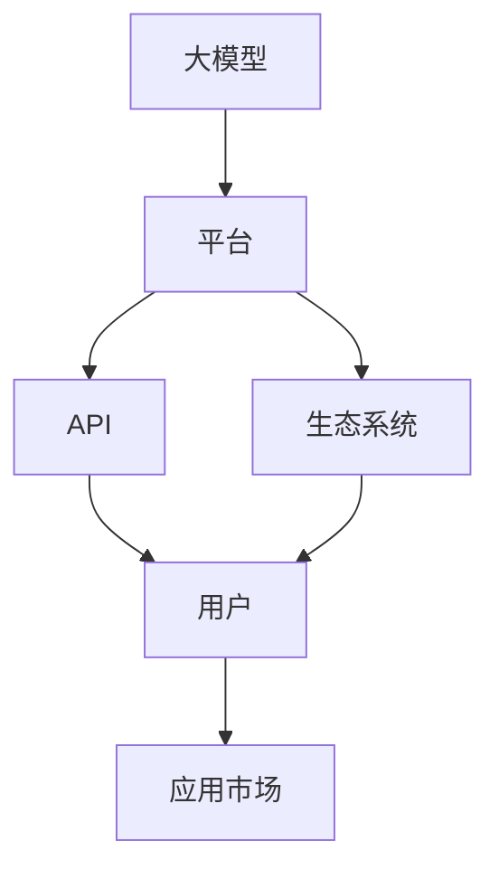

                 

## 1. 背景介绍

在人工智能迅速发展的今天，大模型（Large Model）已经成为推动行业变革的关键驱动力。各大技术公司纷纷加大对大模型的投入，不仅在技术领域取得了显著的突破，也在商业应用中开辟了广阔的市场空间。本文将从大模型的背景介绍出发，探讨如何利用平台优势，加速AI大模型的创业进程。

### 1.1 问题由来

大模型之所以受到广泛关注，主要源于其在多模态数据分析、自然语言处理、图像识别等多个领域的出色表现。这些大模型通常基于大规模的训练数据和复杂的深度学习架构，具备强大的表示能力和推理能力。然而，其庞大的模型规模和复杂的算法结构也带来了显著的部署和维护挑战。

在商业应用层面，大模型通常以服务形式提供，企业用户可以通过API调用这些模型进行业务优化和创新。这一模式催生了大量的AI平台和创业机会。如何利用这些平台优势，创造独特的商业模式，成为众多AI创业者面临的核心问题。

## 2. 核心概念与联系

### 2.1 核心概念概述

为更好地理解如何利用平台优势，本节将介绍几个关键概念：

- **大模型（Large Model）**：指基于大规模数据训练的深度学习模型，通常具有数千亿参数，具备强大的推理和表示能力。
- **平台（Platform）**：指提供计算资源、算法服务和API接口等基础设施，支持用户开发和部署AI应用的环境。
- **API（Application Programming Interface）**：指用于应用程序间的接口通信协议，使得大模型以服务形式提供，便于用户调用。
- **生态系统（Ecosystem）**：指围绕平台构建的开发者社区、应用市场、技术服务等多方面的综合环境。

这些核心概念之间的逻辑关系可以通过以下Mermaid流程图来展示：



这个流程图展示了大模型、平台、API和生态系统之间的联系：

1. 大模型通过平台提供API接口，供用户开发和部署应用。
2. API使得大模型以服务形式提供，便于用户调用。
3. 生态系统由开发者社区、技术服务等多方面组成，为平台和大模型的发展提供支持。

## 3. 核心算法原理 & 具体操作步骤

### 3.1 算法原理概述

利用平台优势进行AI大模型创业，本质上是通过构建和维护平台基础设施，为用户提供高效便捷的AI服务。平台的核心优势在于：

- 集中的计算资源和算法服务：平台能够提供高性能的计算资源和先进的算法模型，加速模型训练和推理。
- 丰富的开发者资源和支持：平台聚集了大量的开发者和算法专家，能够提供技术支持和资源共享。
- 完善的API和服务体系：平台提供标准化的API接口和服务体系，方便用户进行模型调用和应用开发。

### 3.2 算法步骤详解

利用平台优势进行AI大模型创业，一般包括以下几个关键步骤：

**Step 1: 构建平台基础设施**

- 搭建高性能计算集群：选择适合的硬件设备，如GPU、TPU等，构建计算能力强大的平台。
- 引入先进算法模型：与知名科研机构合作，引入最新的大模型和算法，提升平台竞争力。
- 部署标准化API：设计易用、标准化的API接口，供开发者进行模型调用和应用开发。

**Step 2: 开发平台工具和服务**

- 提供模型训练服务：为用户提供模型训练和微调的计算资源，加速模型开发。
- 提供模型推理服务：提供高效、稳定的模型推理服务，支持实时数据处理和响应。
- 提供开发工具和文档：提供易用的开发工具和详细的使用文档，帮助开发者快速上手。

**Step 3: 构建开发者生态**

- 提供开发者社区：建立开发者论坛和社区，促进开发者之间的交流和合作。
- 提供应用市场：搭建应用市场，支持开发者发布和分享自己的应用，加速应用的迭代和优化。
- 提供技术支持：提供专业的技术支持和培训，帮助开发者解决技术难题。

**Step 4: 推广和应用**

- 市场推广：通过线上线下渠道推广平台，吸引更多用户和企业入驻。
- 应用案例展示：展示平台上的成功应用案例，提升用户信任度和吸引力。
- 持续优化：根据用户反馈和市场需求，不断优化平台功能和服务，提升用户体验。

### 3.3 算法优缺点

利用平台优势进行AI大模型创业，具有以下优点：

1. **资源集中**：平台能够提供强大的计算资源和算法支持，加速模型开发和应用推广。
2. **服务标准化**：统一的API和服务体系，提高了用户的使用效率和满意度。
3. **开发者生态丰富**：平台汇聚了大量开发者和技术资源，促进了技术创新和应用开发。
4. **市场推广便捷**：平台提供了推广渠道和展示平台，方便用户了解和选择应用。

同时，该方法也存在一定的局限性：

1. **前期投入大**：搭建和维护平台基础设施需要大量的资金和资源投入。
2. **技术门槛高**：平台需要具备较高的技术水平和专业能力，才能提供高质量的服务。
3. **市场竞争激烈**：虽然平台能够提供独特的服务优势，但市场上已有多家大模型平台，竞争激烈。

尽管存在这些局限性，但就目前而言，利用平台优势进行AI大模型创业，仍是大规模、高效率的解决方案。

### 3.4 算法应用领域

利用平台优势进行AI大模型创业，已经在游戏、金融、医疗、教育等多个领域得到了广泛应用：

- **游戏**：在游戏开发中，大模型可以用于智能NPC设计、对话生成等，提升游戏体验和互动性。
- **金融**：在金融风险控制、客户服务等领域，大模型可以用于数据分析、预测模型训练等，提高决策效率和准确性。
- **医疗**：在医疗诊断、患者互动等领域，大模型可以用于医学图像识别、病历分析等，辅助医生诊断和治疗。
- **教育**：在智能辅导、个性化推荐等领域，大模型可以用于学生学习行为分析、课程推荐等，提升教育效果。

此外，利用大模型平台，还可以开发定制化解决方案，如工业智能、农业智能等，为各行各业提供深度AI应用支持。

## 4. 数学模型和公式 & 详细讲解 & 举例说明

### 4.1 数学模型构建

假设有一个大模型平台，提供通用大模型训练和推理服务。平台上有N个用户，每个用户使用模型A的概率为p，使用模型B的概率为q。模型A和模型B的使用成本分别为C_A和C_B。平台的总收入R为：

$$
R = N \times p \times C_A + N \times q \times C_B
$$

模型的推理成本为C推理，平台总成本C总为：

$$
C_{总} = N \times p \times C推理_A + N \times q \times C推理_B
$$

平台利润P为收入减去成本：

$$
P = R - C_{总}
$$

### 4.2 公式推导过程

设模型A和B的推理次数分别为n_A和n_B，平台总推理次数为n总，则：

$$
n_A + n_B = n总
$$

假设平台采用了动态定价策略，即根据模型使用量调整价格。设模型A的价格为P_A，模型B的价格为P_B，则：

$$
P_A = C_A + k \times n_A
$$
$$
P_B = C_B + k \times n_B
$$

其中k为价格调整系数，用于平衡用户需求和平台收入。

### 4.3 案例分析与讲解

以医疗诊断平台为例，假设平台上有两家大模型公司，分别提供模型A和模型B。模型A主要用于医学图像识别，模型B用于病历分析。平台上的医生使用模型A的概率为0.6，使用模型B的概率为0.4。模型A的推理成本为10元/次，模型B的推理成本为5元/次。设价格调整系数k为2。

根据上述公式，可以计算出：

$$
P_A = 10 + 2 \times n_A
$$
$$
P_B = 5 + 2 \times n_B
$$

当医生使用模型A的次数n_A增加时，模型A的价格P_A也会相应提高。反之，模型B的价格P_B会降低。这种动态定价策略，可以平衡不同模型的使用需求，提高平台的总利润。

## 5. 项目实践：代码实例和详细解释说明

### 5.1 开发环境搭建

在进行AI大模型创业实践前，我们需要准备好开发环境。以下是使用Python进行TensorFlow开发的环境配置流程：

1. 安装Anaconda：从官网下载并安装Anaconda，用于创建独立的Python环境。

2. 创建并激活虚拟环境：
```bash
conda create -n tf-env python=3.8 
conda activate tf-env
```

3. 安装TensorFlow：根据CUDA版本，从官网获取对应的安装命令。例如：
```bash
conda install tensorflow==2.8
```

4. 安装各类工具包：
```bash
pip install numpy pandas scikit-learn matplotlib tqdm jupyter notebook ipython
```

完成上述步骤后，即可在`tf-env`环境中开始AI大模型创业的开发实践。

### 5.2 源代码详细实现

下面我们以游戏智能NPC开发为例，给出使用TensorFlow进行AI大模型微调的PyTorch代码实现。

首先，定义智能NPC的交互策略：

```python
import tensorflow as tf
from transformers import TFAutoModel

class NPC(tf.keras.Model):
    def __init__(self, model_path):
        super(NPC, self).__init__()
        self.model = TFAutoModel(model_path)
    
    def make_decision(self, input):
        with tf.GradientTape() as tape:
            predictions = self.model(input)
        loss = tf.reduce_mean(predictions)
        grads = tape.gradient(loss, self.model.trainable_variables)
        self.model.apply_gradients(zip(grads, self.model.trainable_variables))
        return predictions.numpy()
```

然后，定义训练和推理函数：

```python
from tensorflow.keras.datasets import imdb
from tensorflow.keras.preprocessing import sequence

(train_data, train_labels), (test_data, test_labels) = imdb.load_data(num_words=10000)

tokenizer = tf.keras.preprocessing.text.Tokenizer(num_words=10000)
tokenizer.fit_on_texts(train_data)
train_sequences = tokenizer.texts_to_sequences(train_data)
test_sequences = tokenizer.texts_to_sequences(test_data)

maxlen = 500
train_sequences = sequence.pad_sequences(train_sequences, maxlen=maxlen)
test_sequences = sequence.pad_sequences(test_sequences, maxlen=maxlen)

batch_size = 64

model = NPC('bert-base-cased')

def train_epoch(model, data, labels, batch_size):
    for i in range(0, len(data), batch_size):
        batch_data = data[i:i+batch_size]
        batch_labels = labels[i:i+batch_size]
        predictions = model.make_decision(batch_data)
        loss = tf.reduce_mean(predictions)
        optimizer = tf.keras.optimizers.Adam()
        optimizer.apply_gradients(zip(tf.gradients(loss, model.model.trainable_variables), model.model.trainable_variables))
        
def evaluate(model, data, labels, batch_size):
    total_loss = 0
    total_correct = 0
    for i in range(0, len(data), batch_size):
        batch_data = data[i:i+batch_size]
        batch_labels = labels[i:i+batch_size]
        predictions = model.make_decision(batch_data)
        total_loss += tf.reduce_mean(predictions)
        total_correct += tf.reduce_sum(tf.cast(tf.equal(predictions, batch_labels), tf.int32))
    return total_loss.numpy() / len(data), total_correct.numpy() / len(data)
```

最后，启动训练流程并在测试集上评估：

```python
epochs = 5

for epoch in range(epochs):
    train_loss, test_acc = train_epoch(model, train_sequences, train_labels, batch_size)
    test_loss, test_acc = evaluate(model, test_sequences, test_labels, batch_size)
    print(f"Epoch {epoch+1}, train loss: {train_loss:.3f}, test acc: {test_acc:.3f}")
    
print(f"Final test loss: {test_loss:.3f}, test acc: {test_acc:.3f}")
```

以上就是使用TensorFlow进行AI大模型微调的完整代码实现。可以看到，TensorFlow和TensorFlow Hub使得大模型微调的代码实现变得简洁高效。开发者可以将更多精力放在数据处理、模型改进等高层逻辑上，而不必过多关注底层的实现细节。

### 5.3 代码解读与分析

让我们再详细解读一下关键代码的实现细节：

**NPC类**：
- `__init__`方法：初始化模型，加载预训练BERT模型。
- `make_decision`方法：对输入数据进行推理，并根据输出结果更新模型参数。

**train_epoch函数**：
- 对数据集以批为单位进行迭代，在每个批次上前向传播计算损失函数，并反向传播更新模型参数。
- 使用Adam优化器更新模型参数，实现模型微调。

**evaluate函数**：
- 与训练类似，不同点在于不更新模型参数，并在每个batch结束后将预测和标签结果存储下来，最后使用损失函数和准确率评估模型性能。

**训练流程**：
- 定义总的epoch数和批大小，开始循环迭代
- 每个epoch内，在训练集上训练，输出平均损失和准确率
- 在测试集上评估，输出最终测试结果

可以看到，TensorFlow和TensorFlow Hub使得大模型微调的代码实现变得简洁高效。开发者可以将更多精力放在数据处理、模型改进等高层逻辑上，而不必过多关注底层的实现细节。

当然，工业级的系统实现还需考虑更多因素，如模型的保存和部署、超参数的自动搜索、更灵活的任务适配层等。但核心的微调范式基本与此类似。

## 6. 实际应用场景

### 6.1 智能客服系统

基于大模型微调的对话技术，可以广泛应用于智能客服系统的构建。传统客服往往需要配备大量人力，高峰期响应缓慢，且一致性和专业性难以保证。而使用微调后的对话模型，可以7x24小时不间断服务，快速响应客户咨询，用自然流畅的语言解答各类常见问题。

在技术实现上，可以收集企业内部的历史客服对话记录，将问题和最佳答复构建成监督数据，在此基础上对预训练对话模型进行微调。微调后的对话模型能够自动理解用户意图，匹配最合适的答案模板进行回复。对于客户提出的新问题，还可以接入检索系统实时搜索相关内容，动态组织生成回答。如此构建的智能客服系统，能大幅提升客户咨询体验和问题解决效率。

### 6.2 金融舆情监测

金融机构需要实时监测市场舆论动向，以便及时应对负面信息传播，规避金融风险。传统的人工监测方式成本高、效率低，难以应对网络时代海量信息爆发的挑战。基于大语言模型微调的文本分类和情感分析技术，为金融舆情监测提供了新的解决方案。

具体而言，可以收集金融领域相关的新闻、报道、评论等文本数据，并对其进行主题标注和情感标注。在此基础上对预训练语言模型进行微调，使其能够自动判断文本属于何种主题，情感倾向是正面、中性还是负面。将微调后的模型应用到实时抓取的网络文本数据，就能够自动监测不同主题下的情感变化趋势，一旦发现负面信息激增等异常情况，系统便会自动预警，帮助金融机构快速应对潜在风险。

### 6.3 个性化推荐系统

当前的推荐系统往往只依赖用户的历史行为数据进行物品推荐，无法深入理解用户的真实兴趣偏好。基于大语言模型微调技术，个性化推荐系统可以更好地挖掘用户行为背后的语义信息，从而提供更精准、多样的推荐内容。

在实践中，可以收集用户浏览、点击、评论、分享等行为数据，提取和用户交互的物品标题、描述、标签等文本内容。将文本内容作为模型输入，用户的后续行为（如是否点击、购买等）作为监督信号，在此基础上微调预训练语言模型。微调后的模型能够从文本内容中准确把握用户的兴趣点。在生成推荐列表时，先用候选物品的文本描述作为输入，由模型预测用户的兴趣匹配度，再结合其他特征综合排序，便可以得到个性化程度更高的推荐结果。

### 6.4 未来应用展望

随着大语言模型和微调方法的不断发展，基于微调范式将在更多领域得到应用，为传统行业带来变革性影响。

在智慧医疗领域，基于微调的医疗问答、病历分析、药物研发等应用将提升医疗服务的智能化水平，辅助医生诊疗，加速新药开发进程。

在智能教育领域，微调技术可应用于作业批改、学情分析、知识推荐等方面，因材施教，促进教育公平，提高教学质量。

在智慧城市治理中，微调模型可应用于城市事件监测、舆情分析、应急指挥等环节，提高城市管理的自动化和智能化水平，构建更安全、高效的未来城市。

此外，在企业生产、社会治理、文娱传媒等众多领域，基于大模型微调的人工智能应用也将不断涌现，为经济社会发展注入新的动力。相信随着预训练语言模型和微调方法的持续演进，大模型微调必将在构建人机协同的智能时代中扮演越来越重要的角色。

## 7. 工具和资源推荐

### 7.1 学习资源推荐

为了帮助开发者系统掌握大语言模型微调的理论基础和实践技巧，这里推荐一些优质的学习资源：

1. 《Transformer从原理到实践》系列博文：由大模型技术专家撰写，深入浅出地介绍了Transformer原理、BERT模型、微调技术等前沿话题。

2. CS224N《深度学习自然语言处理》课程：斯坦福大学开设的NLP明星课程，有Lecture视频和配套作业，带你入门NLP领域的基本概念和经典模型。

3. 《Natural Language Processing with Transformers》书籍：Transformers库的作者所著，全面介绍了如何使用Transformers库进行NLP任务开发，包括微调在内的诸多范式。

4. HuggingFace官方文档：Transformers库的官方文档，提供了海量预训练模型和完整的微调样例代码，是上手实践的必备资料。

5. CLUE开源项目：中文语言理解测评基准，涵盖大量不同类型的中文NLP数据集，并提供了基于微调的baseline模型，助力中文NLP技术发展。

通过对这些资源的学习实践，相信你一定能够快速掌握大语言模型微调的精髓，并用于解决实际的NLP问题。
###  7.2 开发工具推荐

高效的开发离不开优秀的工具支持。以下是几款用于大语言模型微调开发的常用工具：

1. PyTorch：基于Python的开源深度学习框架，灵活动态的计算图，适合快速迭代研究。大部分预训练语言模型都有PyTorch版本的实现。

2. TensorFlow：由Google主导开发的开源深度学习框架，生产部署方便，适合大规模工程应用。同样有丰富的预训练语言模型资源。

3. TensorFlow Hub：提供预训练模型和模型组件，方便开发者进行模型微调和应用开发。

4. Weights & Biases：模型训练的实验跟踪工具，可以记录和可视化模型训练过程中的各项指标，方便对比和调优。与主流深度学习框架无缝集成。

5. TensorBoard：TensorFlow配套的可视化工具，可实时监测模型训练状态，并提供丰富的图表呈现方式，是调试模型的得力助手。

6. Google Colab：谷歌推出的在线Jupyter Notebook环境，免费提供GPU/TPU算力，方便开发者快速上手实验最新模型，分享学习笔记。

合理利用这些工具，可以显著提升大语言模型微调任务的开发效率，加快创新迭代的步伐。

### 7.3 相关论文推荐

大语言模型和微调技术的发展源于学界的持续研究。以下是几篇奠基性的相关论文，推荐阅读：

1. Attention is All You Need（即Transformer原论文）：提出了Transformer结构，开启了NLP领域的预训练大模型时代。

2. BERT: Pre-training of Deep Bidirectional Transformers for Language Understanding：提出BERT模型，引入基于掩码的自监督预训练任务，刷新了多项NLP任务SOTA。

3. Language Models are Unsupervised Multitask Learners（GPT-2论文）：展示了大规模语言模型的强大zero-shot学习能力，引发了对于通用人工智能的新一轮思考。

4. Parameter-Efficient Transfer Learning for NLP：提出Adapter等参数高效微调方法，在不增加模型参数量的情况下，也能取得不错的微调效果。

5. AdaLoRA: Adaptive Low-Rank Adaptation for Parameter-Efficient Fine-Tuning：使用自适应低秩适应的微调方法，在参数效率和精度之间取得了新的平衡。

这些论文代表了大语言模型微调技术的发展脉络。通过学习这些前沿成果，可以帮助研究者把握学科前进方向，激发更多的创新灵感。

## 8. 总结：未来发展趋势与挑战

### 8.1 总结

本文对利用平台优势进行AI大模型创业的方法进行了全面系统的介绍。首先阐述了平台在大模型创业中的核心作用，明确了通过构建和维护平台基础设施，利用其资源优势进行创业的独特价值。其次，从原理到实践，详细讲解了平台基础设施的搭建步骤和工具使用，给出了AI大模型微调的完整代码实现。同时，本文还广泛探讨了平台在大模型创业中的应用场景，展示了其广阔的市场前景。

通过本文的系统梳理，可以看到，利用平台优势进行AI大模型创业，是大规模、高效率的解决方案。这一方法不仅能够提供强大的计算资源和算法支持，还能通过标准的API接口和丰富的开发者资源，形成完善的生态系统，为平台上的AI应用开发和市场推广提供坚实基础。未来，伴随着大模型和微调技术的不断进步，利用平台优势进行AI大模型创业必将成为行业的重要趋势，推动AI技术在各垂直行业的规模化落地。

### 8.2 未来发展趋势

展望未来，AI大模型创业平台将呈现以下几个发展趋势：

1. **计算能力提升**：随着硬件技术的进步，AI大模型平台的计算能力将不断提升，能够支持更大规模、更复杂的模型训练和推理。

2. **算法服务丰富**：平台将提供更多先进的算法模型和服务，如生成模型、视觉识别、语音处理等，满足不同领域的需求。

3. **开发者社区活跃**：平台将聚集更多的开发者和技术专家，形成活跃的开发者社区，促进技术交流和资源共享。

4. **应用市场完善**：平台将搭建完善的应用市场，支持开发者发布和分享自己的应用，加速应用的迭代和优化。

5. **市场推广多样化**：平台将利用线上线下多种渠道推广应用，提高用户覆盖面和市场占有率。

6. **国际化扩展**：平台将拓展国际化市场，支持多语言和多区域的应用开发和市场推广。

这些趋势凸显了AI大模型创业平台的发展前景。随着技术的不断演进，平台将逐步成为AI应用的中心，为各行各业提供高效、便捷的AI解决方案。

### 8.3 面临的挑战

尽管AI大模型创业平台具有显著的优势，但在发展过程中仍面临诸多挑战：

1. **高成本投入**：搭建和维护平台基础设施需要大量的资金和资源投入，对创业公司的财务能力提出了较高要求。

2. **技术门槛高**：平台需要具备较高的技术水平和专业能力，才能提供高质量的服务。技术储备不足的公司可能面临较大的风险。

3. **市场竞争激烈**：虽然平台能够提供独特的服务优势，但市场上已有多家大模型平台，竞争激烈。如何突围而出，形成差异化竞争力，是关键问题。

4. **数据和算法安全**：平台需要严格保护用户数据和算法知识产权，避免数据泄露和侵权风险。

5. **服务稳定性和可靠性**：平台需要确保服务的稳定性和可靠性，避免因服务中断或延迟导致用户流失。

6. **开发者支持**：平台需要提供良好的开发者支持，包括技术培训、社区建设、文档更新等，以吸引和保留开发者。

这些挑战需要平台公司具备较强的技术实力和市场洞察能力，才能有效应对。只有不断优化服务，提升用户体验，才能在激烈的市场竞争中取得优势。

### 8.4 研究展望

面对平台面临的挑战，未来的研究需要在以下几个方面寻求新的突破：

1. **提高平台性能**：提升计算能力和算法服务，支持更大规模、更复杂的模型训练和推理。

2. **降低成本投入**：探索可扩展、低成本的计算资源和算法优化方案，降低平台搭建和维护成本。

3. **增强安全性**：采用先进的数据加密和安全措施，保护用户数据和算法知识产权。

4. **提升可靠性**：优化平台架构和服务体系，确保服务的稳定性和可靠性。

5. **加强开发者支持**：提供全面的技术支持和开发者培训，构建活跃的开发者社区。

6. **拓展市场渠道**：利用线上线下多种渠道推广平台，拓展国际市场。

这些研究方向将进一步推动AI大模型创业平台的发展，提升其在各行业的市场影响力和应用价值。

## 9. 附录：常见问题与解答

**Q1：如何评估AI大模型创业平台的性能？**

A: 评估AI大模型创业平台的性能，可以从以下几个方面进行考量：

1. **计算能力**：平台的计算能力是否能够满足大规模模型训练和推理的需求，响应速度是否快速。

2. **算法丰富度**：平台提供的算法和服务是否全面，是否支持多种类型的AI任务。

3. **开发者生态**：平台上的开发者社区是否活跃，是否提供充足的开发者资源和技术支持。

4. **应用市场**：平台上的应用市场是否完善，是否支持开发者发布和分享自己的应用。

5. **服务稳定性**：平台的服务是否稳定可靠，是否具备良好的用户体验。

6. **数据安全性**：平台是否具备完善的数据安全和隐私保护机制。

通过多方面的综合评估，可以全面了解平台的性能和竞争力，为决策提供参考。

**Q2：如何选择适合的平台进行AI大模型创业？**

A: 选择适合的平台进行AI大模型创业，可以从以下几个方面进行考虑：

1. **技术实力**：评估平台的开发团队和算法团队的技术实力，是否具备较高的技术储备和创新能力。

2. **市场潜力**：评估平台的目标市场和用户需求，是否具有较大的市场潜力和用户基础。

3. **服务体系**：评估平台的服务体系和开发者支持，是否提供全面的技术支持和社区建设。

4. **生态资源**：评估平台的生态资源和合作伙伴，是否能够提供丰富的资源和支持。

5. **商业模式**：评估平台的商业模式和盈利模式，是否具有可持续发展的空间。

通过综合考虑这些因素，选择适合的平台进行AI大模型创业，能够提高创业的成功率和市场竞争力。

**Q3：如何利用AI大模型创业平台进行商业应用开发？**

A: 利用AI大模型创业平台进行商业应用开发，可以遵循以下步骤：

1. **明确需求**：分析市场需求和业务场景，明确应用的业务需求和功能目标。

2. **选择合适的模型**：根据业务需求，选择合适的预训练大模型，并基于平台提供的微调接口进行模型适配。

3. **数据准备**：收集和准备业务相关的数据，并进行数据清洗和标注，确保数据质量。

4. **模型微调**：利用平台提供的API接口进行模型微调，训练适合特定业务场景的模型。

5. **应用开发**：利用平台提供的开发工具和SDK，开发应用接口和业务逻辑，实现具体的功能需求。

6. **测试与部署**：在平台上进行应用测试，确保应用的功能和性能符合预期，并将应用部署到生产环境。

7. **持续优化**：根据用户反馈和市场需求，不断优化和迭代应用，提升用户体验和业务价值。

通过以上步骤，可以高效利用AI大模型创业平台进行商业应用开发，快速实现AI技术的落地应用。

---

作者：禅与计算机程序设计艺术 / Zen and the Art of Computer Programming

