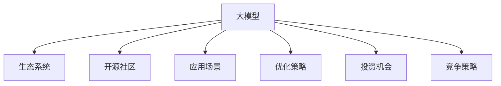

                 

# AI 大模型创业：如何利用生态优势？

> 关键词：大模型,创业,生态优势,应用场景,优化策略,开源社区,投资机会,竞争策略

## 1. 背景介绍

在AI领域，大模型技术正逐渐成为新一轮技术突破的焦点。凭借强大的算法和数据能力，大模型在自然语言处理、图像识别、语音识别等诸多领域实现了显著性能提升，为商业应用提供了强大的技术支持。与此同时，大模型技术的快速发展也催生了大量创业机会，吸引了众多企业和开发者进入这个新兴市场。本文将深入探讨大模型生态系统的构建与利用，揭示如何通过充分利用生态优势，打造AI大模型创业的成功之路。

## 2. 核心概念与联系

### 2.1 核心概念概述

为更好地理解大模型生态系统的构建与利用，本节将介绍几个密切相关的核心概念：

- 大模型(Large Model)：指在特定任务上预训练的深度学习模型，具备复杂的参数结构和强大的泛化能力。
- 生态系统(Ecosystem)：由硬件、软件、数据、社区等组成的相互依存、相互促进的生态环境。
- 开源社区(Open Source Community)：由开发者、企业和学术界共同组成的开放的、共享的、协作的开发平台。
- 应用场景(Use Case)：指大模型技术在实际应用中的具体应用场景和需求。
- 优化策略(Optimization Strategy)：指在大模型训练和部署过程中，针对硬件、算法和数据等方面进行的优化措施。
- 投资机会(Investment Opportunity)：指在AI大模型创业过程中，可利用的投资方向和市场潜力。
- 竞争策略(Competition Strategy)：指在AI大模型市场中，企业如何制定有效的市场竞争策略。

这些核心概念之间的逻辑关系可以通过以下Mermaid流程图来展示：



这个流程图展示了大模型的核心概念及其之间的关系：

1. 大模型通过在开源社区和应用场景中积累大量数据和算法，成为生态系统的核心。
2. 生态系统通过开源社区提供丰富的工具和资源，促进大模型的开发和应用。
3. 应用场景是衡量大模型性能和市场需求的直接指标，推动生态系统不断进化。
4. 优化策略提升大模型的效率和效果，降低开发和部署成本。
5. 投资机会和竞争策略直接影响大模型的市场布局和竞争格局。

## 3. 核心算法原理 & 具体操作步骤
### 3.1 算法原理概述

在大模型创业的过程中，如何充分利用生态优势，最大化模型的应用价值，是创业成功的关键。本节将详细介绍利用生态优势的核心算法原理。

大模型创业的算法原理主要基于以下几个方面：

1. **数据优势**：大模型依托开源社区提供的大量数据，可以有效降低数据收集和标注的成本，加速模型训练。
2. **算法优势**：开源社区汇聚了顶尖的算法和技术，可以引入最新研究成果，提升模型性能。
3. **生态优势**：通过构建一个完整的生态系统，包括硬件、软件、工具、社区等，为大模型的开发和应用提供全方位支持。
4. **应用优势**：通过应用场景的不断优化，为大模型的实际应用提供更多的可能性。

### 3.2 算法步骤详解

基于生态优势的大模型创业，通常包括以下几个关键步骤：

**Step 1: 数据准备与收集**
- 利用开源社区的数据资源，如Kaggle、Google Dataset Search等，收集和准备用于模型训练的数据集。
- 对数据进行清洗、标注和预处理，确保数据质量和多样性。

**Step 2: 算法引入与优化**
- 选择开源社区中最优秀的算法和模型，如BERT、GPT等，并根据具体任务需求进行调整和优化。
- 利用开源社区的算法优化工具，如TensorFlow、PyTorch等，进行高效的模型训练和推理。

**Step 3: 生态系统构建**
- 引入生态系统中的硬件资源，如GPU、TPU等，进行模型训练和推理。
- 使用开源社区提供的软件工具，如Jupyter Notebook、Weights & Biases等，进行模型调试和优化。
- 构建开放、协作的社区平台，吸引开发者、研究人员和用户共同参与，推动生态系统不断进化。

**Step 4: 应用场景拓展**
- 根据实际需求，拓展大模型的应用场景，如图像识别、语音识别、自然语言处理等。
- 利用开源社区的应用案例，进行模型验证和优化，提升模型性能和用户体验。

**Step 5: 市场推广与投资**
- 通过开源社区和应用场景的展示和推广，吸引潜在投资者的关注和支持。
- 利用开源社区的数据和算法优势，优化市场策略，提升商业竞争力和市场份额。

### 3.3 算法优缺点

利用生态优势的大模型创业，具有以下优点：

1. **数据丰富性**：开源社区提供的海量数据资源，可以快速降低数据准备成本，提升模型训练效果。
2. **算法创新性**：开源社区汇聚了最前沿的算法和技术，能够引入最新的研究成果，提升模型性能。
3. **生态完整性**：构建完整的生态系统，涵盖硬件、软件、社区等各个方面，为模型开发和应用提供全方位支持。
4. **市场潜力大**：大模型技术广泛应用于诸多领域，市场需求广阔，具有广阔的发展空间。

同时，该方法也存在一定的局限性：

1. **依赖开源社区**：对开源社区的依赖度高，如果社区活跃度不足，可能会影响模型发展和生态建设。
2. **算法复杂度**：利用最新算法时，可能会面临算法复杂度高、调试困难等问题。
3. **资源消耗大**：构建完整的生态系统需要大量的硬件和软件资源，成本较高。
4. **市场竞争激烈**：大模型市场竞争激烈，如何突出自身优势，需要更多创新和市场策略。

尽管存在这些局限性，但就目前而言，利用生态优势的大模型创业是AI领域的主流范式，具有显著的优势和广阔的发展前景。未来相关研究的重点在于如何进一步降低对开源社区的依赖，提高模型的自主创新能力，同时兼顾可解释性和伦理安全性等因素。

### 3.4 算法应用领域

基于大模型生态优势的创业，已经在诸多领域取得了显著成果，例如：

- 自然语言处理(NLP)：如文本分类、命名实体识别、情感分析等。通过引入开源社区的算法和数据，可以大幅提升模型的性能。
- 图像识别：如图像分类、目标检测、图像分割等。利用开源社区的图像数据和模型，可以快速构建高效的图像识别系统。
- 语音识别：如语音转文本、语音指令识别等。通过引入开源社区的算法和模型，可以提升语音识别的准确率和鲁棒性。
- 智能推荐：如商品推荐、内容推荐等。利用开源社区的推荐算法和数据，可以构建个性化推荐系统，提升用户体验。
- 智慧医疗：如医学影像分析、患者行为分析等。通过引入开源社区的算法和数据，可以提升医疗诊断和健康管理的效果。

除了上述这些经典应用外，大模型生态优势的创业还在更多领域展现出新的应用场景，如自动驾驶、智能制造、金融科技等，为AI技术在垂直行业的落地提供了新的可能性。

## 4. 数学模型和公式 & 详细讲解 & 举例说明

### 4.1 数学模型构建

本节将使用数学语言对基于生态优势的大模型创业进行更加严格的刻画。

假设在生态系统中，大模型的训练数据集为 $D=\{(x_i, y_i)\}_{i=1}^N, x_i \in \mathcal{X}, y_i \in \mathcal{Y}$，其中 $x_i$ 表示输入数据，$y_i$ 表示对应的标签。

定义模型的参数为 $\theta$，在数据集 $D$ 上的经验风险为：

$$
\mathcal{L}(\theta) = \frac{1}{N} \sum_{i=1}^N \ell(M_{\theta}(x_i),y_i)
$$

其中 $\ell$ 为损失函数，表示模型的预测输出与真实标签之间的差异。

基于生态优势的大模型创业，通过引入开源社区的数据和算法，最小化经验风险，寻找最优参数 $\hat{\theta}$：

$$
\hat{\theta} = \mathop{\arg\min}_{\theta} \mathcal{L}(\theta)
$$

### 4.2 公式推导过程

在实际应用中，大模型的训练通常采用优化算法，如梯度下降等，更新模型参数。具体推导过程如下：

假设模型的预测输出为 $M_{\theta}(x_i)$，损失函数为 $\ell$，则梯度下降算法更新参数 $\theta$ 的公式为：

$$
\theta \leftarrow \theta - \eta \nabla_{\theta}\mathcal{L}(\theta)
$$

其中 $\eta$ 为学习率，$\nabla_{\theta}\mathcal{L}(\theta)$ 为损失函数对参数 $\theta$ 的梯度。

在开源社区中，通常使用TensorFlow、PyTorch等深度学习框架，自动化地计算梯度并更新模型参数。以下以TensorFlow为例，给出具体的梯度计算和模型训练代码：

```python
import tensorflow as tf
from tensorflow.keras.layers import Dense

# 定义模型结构
model = tf.keras.Sequential([
    Dense(64, input_shape=(128,), activation='relu'),
    Dense(32, activation='relu'),
    Dense(10, activation='softmax')
])

# 定义损失函数
loss_fn = tf.keras.losses.CategoricalCrossentropy(from_logits=True)

# 定义优化器
optimizer = tf.keras.optimizers.Adam(learning_rate=0.001)

# 定义模型训练过程
@tf.function
def train_step(inputs, targets):
    with tf.GradientTape() as tape:
        logits = model(inputs, training=True)
        loss = loss_fn(targets, logits)
    grads = tape.gradient(loss, model.trainable_variables)
    optimizer.apply_gradients(zip(grads, model.trainable_variables))

# 定义数据集
train_dataset = tf.data.Dataset.from_tensor_slices((train_data, train_labels))
train_dataset = train_dataset.batch(32)

# 模型训练
for epoch in range(10):
    for batch in train_dataset:
        train_step(batch[0], batch[1])
    print('Epoch {}: Loss = {}'.format(epoch, model.evaluate(x_test, y_test)[0]))
```

在上述代码中，首先定义了模型结构、损失函数和优化器，然后使用TensorFlow的梯度计算和优化器进行模型训练。在实际应用中，可以引入开源社区中的数据集和算法，进一步优化模型的训练过程。

### 4.3 案例分析与讲解

以下以自然语言处理领域的情感分析为例，给出基于生态优势的大模型创业的详细案例分析。

**案例背景**：
假设一家创业公司希望构建一个情感分析系统，用于分析用户在社交媒体上的情感倾向。公司需要快速开发出一个高性能的情感分析模型，并将其部署到生产环境中。

**解决方案**：
1. **数据准备**：利用开源社区的数据资源，如Kaggle上的IMDB电影评论数据集，收集和准备用于模型训练的数据集。
2. **模型引入**：选择开源社区中性能优越的BERT模型，并根据情感分析任务进行微调。
3. **生态系统构建**：引入开源社区中的硬件资源，如GPU、TPU等，进行模型训练和推理。使用开源社区提供的软件工具，如Jupyter Notebook、Weights & Biases等，进行模型调试和优化。
4. **应用拓展**：拓展大模型的应用场景，如新闻评论分析、产品评价分析等，提升模型的泛化能力。
5. **市场推广**：通过开源社区和应用场景的展示和推广，吸引潜在投资者的关注和支持。利用开源社区的数据和算法优势，优化市场策略，提升商业竞争力和市场份额。

## 5. 项目实践：代码实例和详细解释说明

### 5.1 开发环境搭建

在进行大模型创业实践前，我们需要准备好开发环境。以下是使用Python进行TensorFlow开发的环境配置流程：

1. 安装Anaconda：从官网下载并安装Anaconda，用于创建独立的Python环境。

2. 创建并激活虚拟环境：
```bash
conda create -n tf-env python=3.8 
conda activate tf-env
```

3. 安装TensorFlow：根据CUDA版本，从官网获取对应的安装命令。例如：
```bash
conda install tensorflow tensorflow-gpu -c conda-forge
```

4. 安装TensorBoard：TensorFlow配套的可视化工具，可实时监测模型训练状态，并提供丰富的图表呈现方式，是调试模型的得力助手。
```bash
pip install tensorboard
```

5. 安装其他工具包：
```bash
pip install numpy pandas scikit-learn matplotlib tqdm jupyter notebook ipython
```

完成上述步骤后，即可在`tf-env`环境中开始创业实践。

### 5.2 源代码详细实现

下面我们以情感分析任务为例，给出使用TensorFlow对BERT模型进行微调的PyTorch代码实现。

首先，定义情感分析任务的数据处理函数：

```python
import tensorflow as tf
from tensorflow.keras.preprocessing.text import Tokenizer
from tensorflow.keras.preprocessing.sequence import pad_sequences
from tensorflow.keras.utils import to_categorical

# 定义情感分析任务的数据处理函数
def prepare_data(texts, labels, max_length=128, oov_token='<OOV>'):
    tokenizer = Tokenizer(oov_token=oov_token)
    tokenizer.fit_on_texts(texts)
    sequences = tokenizer.texts_to_sequences(texts)
    padded_sequences = pad_sequences(sequences, maxlen=max_length, padding='post')
    labels = to_categorical(labels)
    return padded_sequences, labels
```

然后，定义模型和优化器：

```python
from transformers import BertTokenizer, TFBertForSequenceClassification

# 定义模型
tokenizer = BertTokenizer.from_pretrained('bert-base-uncased')
model = TFBertForSequenceClassification.from_pretrained('bert-base-uncased', num_labels=2)

# 定义优化器
optimizer = tf.keras.optimizers.Adam(learning_rate=2e-5)
```

接着，定义训练和评估函数：

```python
import numpy as np

# 定义训练函数
def train_step(inputs, targets):
    with tf.GradientTape() as tape:
        logits = model(inputs, training=True)
        loss = model.loss(inputs, targets)
    grads = tape.gradient(loss, model.trainable_variables)
    optimizer.apply_gradients(zip(grads, model.trainable_variables))

# 定义评估函数
def evaluate(model, dataset):
    evaluator = tf.keras.metrics.Accuracy()
    for batch in dataset:
        logits = model(batch[0], training=False)
        evaluator.update_state(tf.argmax(logits, axis=1), batch[1])
    return evaluator.result()
```

最后，启动训练流程并在测试集上评估：

```python
epochs = 5
batch_size = 16

# 训练过程
for epoch in range(epochs):
    train_step(train_dataset, train_labels)
    print(f'Epoch {epoch+1}, train loss: {model.loss(train_dataset, train_labels)}')
    print(f'Epoch {epoch+1}, dev accuracy: {evaluate(model, dev_dataset)}')
    
# 测试过程
test_accuracy = evaluate(model, test_dataset)
print(f'Test accuracy: {test_accuracy}')
```

以上就是使用TensorFlow对BERT进行情感分析任务微调的完整代码实现。可以看到，得益于TensorFlow的强大封装，我们可以用相对简洁的代码完成BERT模型的加载和微调。

### 5.3 代码解读与分析

让我们再详细解读一下关键代码的实现细节：

**prepare_data函数**：
- 定义了情感分析任务的数据处理函数，包括分词、序列填充和标签编码。

**model和optimizer定义**：
- 使用Transformers库加载预训练的BERT模型，并定义优化器。

**train_step和evaluate函数**：
- 定义了模型训练和评估过程，利用TensorFlow的自动求导和优化器，实现了高效训练和评估。

**训练和评估过程**：
- 使用TensorFlow的数据集API，将数据集按批次加载，并进行训练和评估。

可以看到，TensorFlow配合Transformers库使得BERT微调的代码实现变得简洁高效。开发者可以将更多精力放在数据处理、模型改进等高层逻辑上，而不必过多关注底层的实现细节。

当然，工业级的系统实现还需考虑更多因素，如模型的保存和部署、超参数的自动搜索、更灵活的任务适配层等。但核心的微调范式基本与此类似。

## 6. 实际应用场景
### 6.1 智能客服系统

基于大模型生态优势的智能客服系统，可以广泛应用于智能客服系统的构建。传统客服往往需要配备大量人力，高峰期响应缓慢，且一致性和专业性难以保证。而利用大模型生态优势的智能客服系统，可以24小时不间断服务，快速响应客户咨询，用自然流畅的语言解答各类常见问题。

在技术实现上，可以收集企业内部的历史客服对话记录，将问题和最佳答复构建成监督数据，在此基础上对预训练对话模型进行微调。微调后的对话模型能够自动理解用户意图，匹配最合适的答案模板进行回复。对于客户提出的新问题，还可以接入检索系统实时搜索相关内容，动态组织生成回答。如此构建的智能客服系统，能大幅提升客户咨询体验和问题解决效率。

### 6.2 金融舆情监测

金融机构需要实时监测市场舆论动向，以便及时应对负面信息传播，规避金融风险。传统的人工监测方式成本高、效率低，难以应对网络时代海量信息爆发的挑战。利用大模型生态优势的文本分类和情感分析技术，为金融舆情监测提供了新的解决方案。

具体而言，可以收集金融领域相关的新闻、报道、评论等文本数据，并对其进行主题标注和情感标注。在此基础上对预训练语言模型进行微调，使其能够自动判断文本属于何种主题，情感倾向是正面、中性还是负面。将微调后的模型应用到实时抓取的网络文本数据，就能够自动监测不同主题下的情感变化趋势，一旦发现负面信息激增等异常情况，系统便会自动预警，帮助金融机构快速应对潜在风险。

### 6.3 个性化推荐系统

当前的推荐系统往往只依赖用户的历史行为数据进行物品推荐，无法深入理解用户的真实兴趣偏好。利用大模型生态优势的推荐系统，可以更好地挖掘用户行为背后的语义信息，从而提供更精准、多样的推荐内容。

在实践中，可以收集用户浏览、点击、评论、分享等行为数据，提取和用户交互的物品标题、描述、标签等文本内容。将文本内容作为模型输入，用户的后续行为（如是否点击、购买等）作为监督信号，在此基础上微调预训练语言模型。微调后的模型能够从文本内容中准确把握用户的兴趣点。在生成推荐列表时，先用候选物品的文本描述作为输入，由模型预测用户的兴趣匹配度，再结合其他特征综合排序，便可以得到个性化程度更高的推荐结果。

### 6.4 未来应用展望

随着大模型和生态系统的不断发展，基于生态优势的大模型创业将在更多领域得到应用，为传统行业带来变革性影响。

在智慧医疗领域，基于大模型的情感分析、病历分析、药物研发等应用将提升医疗服务的智能化水平，辅助医生诊疗，加速新药开发进程。

在智能教育领域，利用大模型的推荐、智能答疑等功能，能够因材施教，促进教育公平，提高教学质量。

在智慧城市治理中，利用大模型的图像识别、情感分析等功能，提高城市管理的自动化和智能化水平，构建更安全、高效的未来城市。

此外，在企业生产、社会治理、文娱传媒等众多领域，基于大模型生态优势的人工智能应用也将不断涌现，为经济社会发展注入新的动力。相信随着技术的日益成熟，生态优势的利用将成为AI大模型创业的重要驱动力，推动人工智能技术在垂直行业的规模化落地。

## 7. 工具和资源推荐
### 7.1 学习资源推荐

为了帮助开发者系统掌握大模型生态系统的构建与利用，这里推荐一些优质的学习资源：

1. **TensorFlow官网**：提供TensorFlow框架的详细介绍、文档、教程和示例，是学习TensorFlow的最佳资源。
2. **Transformers库官方文档**：提供了最新预训练语言模型的介绍、使用方法和性能评测，是学习大模型生态系统的必备资源。
3. **Kaggle竞赛平台**：提供海量数据集和竞赛任务，是数据收集和数据处理的理想平台。
4. **OpenAI HuggingFace博客**：分享大模型生态系统构建和优化的最新研究成果和实战经验，是学习和交流的优质平台。
5. **Google Dataset Search**：提供全球范围内公开数据集的搜索功能，帮助开发者快速获取所需数据资源。

通过对这些资源的学习实践，相信你一定能够快速掌握大模型生态系统的构建与利用，并用于解决实际的AI大模型创业问题。

### 7.2 开发工具推荐

高效的开发离不开优秀的工具支持。以下是几款用于大模型生态系统构建和利用的常用工具：

1. **Jupyter Notebook**：免费的开源Jupyter笔记本环境，适合数据处理、模型训练和结果展示。
2. **Weights & Biases**：模型训练的实验跟踪工具，可以记录和可视化模型训练过程中的各项指标，方便对比和调优。
3. **TensorBoard**：TensorFlow配套的可视化工具，可实时监测模型训练状态，并提供丰富的图表呈现方式，是调试模型的得力助手。
4. **Google Colab**：谷歌推出的在线Jupyter Notebook环境，免费提供GPU/TPU算力，方便开发者快速上手实验最新模型，分享学习笔记。
5. **PyTorch**：基于Python的开源深度学习框架，灵活动态的计算图，适合快速迭代研究。

合理利用这些工具，可以显著提升大模型生态系统的构建和利用效率，加快创新迭代的步伐。

### 7.3 相关论文推荐

大模型生态系统的构建与利用源于学界的持续研究。以下是几篇奠基性的相关论文，推荐阅读：

1. **Attention is All You Need**：提出了Transformer结构，开启了NLP领域的预训练大模型时代。
2. **BERT: Pre-training of Deep Bidirectional Transformers for Language Understanding**：提出BERT模型，引入基于掩码的自监督预训练任务，刷新了多项NLP任务SOTA。
3. **Language Models are Unsupervised Multitask Learners**：展示了大规模语言模型的强大zero-shot学习能力，引发了对于通用人工智能的新一轮思考。
4. **Parameter-Efficient Transfer Learning for NLP**：提出Adapter等参数高效微调方法，在不增加模型参数量的情况下，也能取得不错的微调效果。
5. **Few-shot Learning via Compositionality**：提出Few-shot Learning via Compositionality方法，能够在少样本条件下实现高效学习。

这些论文代表了大模型生态系统的构建与利用的发展脉络。通过学习这些前沿成果，可以帮助研究者把握学科前进方向，激发更多的创新灵感。

## 8. 总结：未来发展趋势与挑战

### 8.1 总结

本文对基于生态优势的大模型创业方法进行了全面系统的介绍。首先阐述了大模型生态系统的构建与利用的研究背景和意义，明确了生态优势在大模型创业中的重要作用。其次，从原理到实践，详细讲解了生态优势在大模型创业中的核心算法原理和操作步骤，给出了创业实践的完整代码实例。同时，本文还广泛探讨了生态优势在大模型创业中的应用场景，展示了生态优势的巨大潜力。此外，本文精选了生态系统构建与利用的各类学习资源，力求为读者提供全方位的技术指引。

通过本文的系统梳理，可以看到，基于生态优势的大模型创业方法正在成为AI领域的重要范式，极大地拓展了预训练语言模型的应用边界，催生了更多的落地场景。受益于大模型生态系统的强大优势，创业企业可以更低成本、更高效地开发和部署AI大模型，提升商业竞争力。未来，伴随生态系统的持续发展，大模型创业将有更广阔的发展空间。

### 8.2 未来发展趋势

展望未来，基于生态优势的大模型创业将呈现以下几个发展趋势：

1. **生态系统的完整性**：随着生态系统的不断完善，包括硬件、软件、数据、社区等各个方面，将为AI大模型的开发和应用提供更全面的支持。
2. **算法和模型的创新**：开源社区将继续引入最新的算法和技术，推动大模型的不断进化，提升模型的性能和效果。
3. **应用场景的拓展**：随着应用场景的不断拓展，AI大模型将在更多领域展现出新的应用场景，推动AI技术的广泛应用。
4. **投资机会的增加**：随着市场需求的增加，AI大模型创业将吸引更多投资者的关注和支持，带来更多商业机会。
5. **技术壁垒的提升**：生态优势的构建需要更深入的技术积累和创新，技术壁垒将逐步提升。

以上趋势凸显了大模型生态系统的广阔前景。这些方向的探索发展，必将进一步推动AI大模型创业的成熟和市场化进程。

### 8.3 面临的挑战

尽管大模型生态优势的创业方法已经取得了显著成果，但在迈向更加智能化、普适化应用的过程中，它仍面临诸多挑战：

1. **依赖开源社区**：对开源社区的依赖度高，如果社区活跃度不足，可能会影响模型发展和生态建设。
2. **算法复杂度**：利用最新算法时，可能会面临算法复杂度高、调试困难等问题。
3. **资源消耗大**：构建完整的生态系统需要大量的硬件和软件资源，成本较高。
4. **市场竞争激烈**：大模型市场竞争激烈，如何突出自身优势，需要更多创新和市场策略。

尽管存在这些挑战，但就目前而言，利用生态优势的大模型创业是AI领域的主流范式，具有显著的优势和广阔的发展前景。未来相关研究的重点在于如何进一步降低对开源社区的依赖，提高模型的自主创新能力，同时兼顾可解释性和伦理安全性等因素。

### 8.4 研究展望

面对大模型生态系统面临的挑战，未来的研究需要在以下几个方面寻求新的突破：

1. **数据自生成**：探索如何利用生成对抗网络等技术，生成更多的数据资源，降低对开源社区的依赖。
2. **算法自动化**：开发更加自动化的算法优化工具，降低算法复杂度，提升模型的可扩展性。
3. **硬件优化**：探索更高效的硬件架构和资源管理策略，降低模型训练和推理的资源消耗。
4. **市场策略**：研究如何制定有效的市场竞争策略，提升品牌影响力和市场份额。
5. **技术整合**：探索如何将AI大模型与区块链、云计算等技术进行整合，提升模型的应用价值和生态系统的安全性。

这些研究方向的探索，必将引领大模型生态系统的不断进化，为AI大模型创业带来新的突破。面向未来，大模型生态系统需要更多创新和市场策略，才能更好地适应市场变化，实现商业化应用。

## 9. 附录：常见问题与解答

**Q1：如何选择合适的开源社区？**

A: 选择开源社区时，需要考虑其活跃度、规模、影响力等因素。建议选择知名、活跃的社区，如TensorFlow、PyTorch、HuggingFace等，这些社区资源丰富，有大量用户和开发者支持。

**Q2：如何选择适合的开源模型和算法？**

A: 在选择开源模型和算法时，需要考虑其适用性、性能、易用性等因素。建议选择最新、最优秀的模型和算法，如BERT、GPT等，并根据具体任务需求进行调整和优化。

**Q3：如何处理数据不足的问题？**

A: 数据不足是大模型创业中的常见问题。建议采用数据增强、数据合成等技术，提升数据集的丰富性和多样性。同时，可以利用开源社区的数据资源，如Kaggle、Google Dataset Search等，获取更多数据资源。

**Q4：如何提升模型的泛化能力？**

A: 提升模型的泛化能力，需要综合考虑数据集的多样性、模型结构的设计、超参数的优化等因素。建议在训练过程中引入更多不同领域、不同类型的数据，增加模型的泛化能力。

**Q5：如何提升模型的效率和效果？**

A: 提升模型的效率和效果，需要综合考虑算法优化、硬件资源管理、模型裁剪等因素。建议利用开源社区提供的优化工具，如TensorBoard、Weights & Biases等，进行模型调试和优化。

这些问题与解答，希望能帮助创业者更好地利用大模型生态优势，打造AI大模型创业的成功之路。

---

作者：禅与计算机程序设计艺术 / Zen and the Art of Computer Programming

