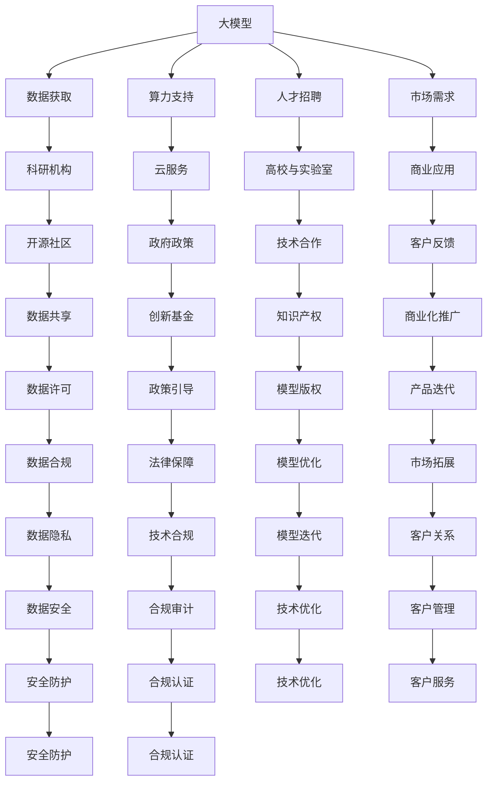

                 

# AI 大模型创业：如何利用社会优势？

> 关键词：大模型创业, 社会优势, 技术创业, 创业策略, 人工智能商业化

## 1. 背景介绍

随着人工智能技术的飞速发展，大模型（如GPT、BERT等）已经成为了行业内的热点。大模型凭借其强大的自监督学习和迁移学习能力，在自然语言处理、计算机视觉、语音识别等众多领域展现了卓越的表现。这些大模型不仅推动了基础科研的进展，还促进了诸多应用场景的技术落地，如智能客服、内容推荐、医疗诊断等。

然而，尽管大模型在技术上具备了诸多优势，但在商业化进程中，它们仍面临诸多挑战，包括但不限于数据、算力、人才等方面的瓶颈。如何有效利用社会优势，克服这些挑战，加速大模型的商业化，成为了广大AI创业者关注的焦点。

## 2. 核心概念与联系

### 2.1 核心概念概述

要探讨大模型创业如何利用社会优势，首先需要明确几个核心概念：

- **大模型（Large Models）**：指使用深度神经网络对大规模数据进行训练得到的庞大模型，如GPT、BERT等。它们能够处理复杂的自然语言和图像数据，具备广泛的迁移学习能力。

- **创业（Entrepreneurship）**：指创业者通过识别市场需求，整合资源，开发新技术，实现商业价值的过程。在大模型创业中，创业者需要整合技术、数据、算力、人才等资源，开发大模型应用，实现商业化。

- **社会优势（Social Advantages）**：指社会环境中存在的各类优势资源，如政府政策、科研机构、开源社区、市场需求等，这些优势资源能够为创业提供助力。

### 2.2 核心概念原理和架构的 Mermaid 流程图



## 3. 核心算法原理 & 具体操作步骤

### 3.1 算法原理概述

大模型创业的算法原理主要基于迁移学习（Transfer Learning）和大规模预训练（Large-Scale Pretraining）。迁移学习是指将在大规模数据集上预训练得到的模型，通过微调或迁移，适应新的特定任务或应用场景。大规模预训练则是指在大规模无标签数据上预训练模型，使其具备广泛的语言和图像知识。

大模型创业的核心在于如何将这些技术优势转化为商业价值。这需要创业者在技术研发、数据获取、算力支持、人才招聘、市场推广等各个环节进行有效整合，充分利用社会优势资源，加速商业化进程。

### 3.2 算法步骤详解

以下是大模型创业的主要步骤：

1. **需求分析**：创业者首先需要明确市场的需求，确定大模型的应用场景。这涉及到对行业现状、用户痛点、技术趋势等进行深入分析。

2. **技术研发**：在确定应用场景后，创业者需要开发大模型。这包括选择合适的模型架构、定义训练任务、获取和清洗数据、搭建训练环境等。

3. **数据获取**：大模型需要大量的数据进行预训练和微调。创业者需要获取高质量的数据集，包括公开数据集和定制数据集。同时，还需要确保数据的质量和隐私安全。

4. **算力支持**：训练和推理大模型需要强大的算力支持。创业者可以选择自建数据中心、租用云服务、或合作共建基础设施。

5. **人才招聘**：大模型创业需要具备丰富的AI技术背景和跨学科知识。创业者需要招聘数据科学家、算法工程师、架构师等高水平人才。

6. **市场推广**：创业者需要通过各种渠道推广大模型应用，包括建立官网、参加行业展会、撰写技术白皮书等。同时，还需要与行业客户建立合作关系。

### 3.3 算法优缺点

大模型创业的算法具有以下优点：

- **技术领先**：大模型在处理复杂任务上表现优异，能够显著提升应用性能。
- **应用广泛**：大模型可以应用于众多行业，包括自然语言处理、计算机视觉、语音识别等。
- **市场潜力**：大模型具有广阔的市场前景，能够满足不同用户需求。

然而，大模型创业也存在一些缺点：

- **成本高昂**：大模型的训练和部署需要高昂的算力和存储成本。
- **数据依赖**：大模型需要大量数据进行训练，数据获取和清洗工作量大。
- **人才稀缺**：大模型创业需要高水平人才，但AI人才供给有限。

### 3.4 算法应用领域

大模型创业主要应用于以下领域：

- **自然语言处理（NLP）**：如智能客服、内容推荐、情感分析等。
- **计算机视觉**：如图像识别、视频分析、人脸识别等。
- **语音识别**：如智能语音助手、自动语音识别等。
- **医疗诊断**：如疾病预测、医疗图像分析等。
- **金融分析**：如信用评估、投资分析等。
- **智能制造**：如智能监控、质量检测等。

## 4. 数学模型和公式 & 详细讲解 & 举例说明

### 4.1 数学模型构建

大模型创业的数学模型主要基于深度神经网络（如Transformer、CNN等）。以Transformer为例，其数学模型可以表示为：

$$
\mathcal{L} = \sum_{i=1}^{N} \ell(y_i, f(x_i; \theta))
$$

其中，$\ell$ 表示损失函数，$y_i$ 表示样本标签，$f(x_i; \theta)$ 表示输入样本 $x_i$ 通过神经网络模型 $f$ 计算得到的预测输出，$\theta$ 表示模型参数。

### 4.2 公式推导过程

以Transformer模型为例，其前向传播的数学推导如下：

$$
\mathcal{L} = \sum_{i=1}^{N} \ell(y_i, \sigma(\mathrm{softmax}(\mathrm{Attention}(\mathrm{FeedForward}(\mathrm{Encoder}(x_i)))))
$$

其中，$\mathrm{Encoder}$ 表示编码器，$\mathrm{FeedForward}$ 表示前馈层，$\mathrm{Attention}$ 表示注意力机制，$\sigma$ 表示激活函数，$\ell$ 表示交叉熵损失。

### 4.3 案例分析与讲解

以智能客服系统为例，分析大模型创业的实现过程。

1. **需求分析**：分析用户对话中的常见问题，确定智能客服系统的功能需求。

2. **技术研发**：选择Transformer模型作为基础模型，定义对话生成任务，训练模型。

3. **数据获取**：收集历史客服对话数据，清洗和标注数据集。

4. **算力支持**：使用云服务进行模型训练，保证算力需求。

5. **人才招聘**：招聘自然语言处理和计算机视觉领域的专家，组建研发团队。

6. **市场推广**：开发用户界面，参加行业展会，推广智能客服系统。

## 5. 项目实践：代码实例和详细解释说明

### 5.1 开发环境搭建

大模型创业的开发环境搭建主要包括以下步骤：

1. **选择开发语言**：Python是目前最流行的AI开发语言，拥有丰富的库和工具支持。

2. **安装依赖库**：使用pip或conda安装所需的依赖库，如TensorFlow、PyTorch、PaddlePaddle等。

3. **搭建训练环境**：选择适当的硬件环境，如GPU、TPU等，搭建训练环境。

4. **数据准备**：准备训练数据，包括数据清洗、标注、分批等操作。

5. **模型训练**：使用TensorFlow或PyTorch进行模型训练，监控训练进度。

6. **模型部署**：将训练好的模型部署到生产环境，进行实时推理。

### 5.2 源代码详细实现

以下是一个简单的智能客服系统代码实现：

```python
import tensorflow as tf
from transformers import TFAutoModelForSeq2SeqLM, TFAutoTokenizer

# 加载模型和分词器
model = TFAutoModelForSeq2SeqLM.from_pretrained('microsoft/DialoGPT-medium')
tokenizer = TFAutoTokenizer.from_pretrained('microsoft/DialoGPT-medium')

# 定义对话生成函数
def generate_response(input_text, max_length=150):
    inputs = tokenizer.encode(input_text, return_tensors='tf')
    outputs = model.generate(inputs, max_length=max_length, pad_token_id=tokenizer.eos_token_id)
    return tokenizer.decode(outputs, skip_special_tokens=True)

# 示例对话生成
input_text = "你好，我想查询一下账户余额。"
response = generate_response(input_text)
print(response)
```

### 5.3 代码解读与分析

上述代码实现了使用Transformer模型进行对话生成的过程。具体步骤包括：

1. **加载模型和分词器**：使用TFAutoModelForSeq2SeqLM和TFAutoTokenizer加载预训练模型和分词器。

2. **定义对话生成函数**：将用户输入文本进行编码，送入模型进行生成，最后将生成结果进行解码。

3. **示例对话生成**：输入一段用户对话，生成系统的回复。

## 6. 实际应用场景

大模型创业在实际应用场景中已经展现出了强大的商业潜力。以下是几个典型的应用场景：

### 6.1 智能客服系统

智能客服系统通过大模型进行对话生成，可以大大提升客服效率和用户体验。例如，阿里云的智能客服系统采用了BERT模型，可以处理复杂的用户请求，自动生成回复，减少人工客服的工作量。

### 6.2 内容推荐系统

内容推荐系统通过大模型进行用户兴趣预测，可以提供个性化的内容推荐。例如，Netflix使用Transformer模型进行电影推荐，通过分析用户的历史观看记录，预测用户的兴趣，推荐相似电影。

### 6.3 医疗诊断系统

医疗诊断系统通过大模型进行疾病预测和图像分析，可以辅助医生进行诊断。例如，IBM的Watson Health使用BERT模型分析医疗影像，辅助医生进行癌症诊断。

### 6.4 金融分析系统

金融分析系统通过大模型进行信用评估和投资分析，可以提供精准的风险评估和投资建议。例如，阿里云的金融分析系统使用LSTM模型进行信用评分，提高贷款审批效率。

### 6.5 智能制造系统

智能制造系统通过大模型进行质量检测和设备监控，可以提高生产效率和质量。例如，Siemens使用CNN模型进行工业图像分析，检测产品缺陷。

## 7. 工具和资源推荐

### 7.1 学习资源推荐

为了帮助创业者系统掌握大模型创业的理论基础和实践技巧，这里推荐一些优质的学习资源：

1. **《深度学习入门：基于Python的理论与实现》**：讲解深度学习的基本概念和实现方法，适合初学者入门。

2. **《TensorFlow实战》**：介绍TensorFlow的高级功能和最佳实践，适合有一定深度学习基础的开发者。

3. **《动手学深度学习》**：由清华大学团队编写，涵盖深度学习的理论基础和实践技巧，适合深入学习。

4. **《NLP实战指南》**：介绍自然语言处理的基本技术和方法，适合NLP方向创业者。

5. **《人工智能创业指南》**：介绍AI创业的各个环节和案例分析，适合创业者系统学习。

### 7.2 开发工具推荐

大模型创业需要多种开发工具的支持。以下是几款推荐的工具：

1. **Jupyter Notebook**：提供交互式的编程环境，方便代码调试和可视化。

2. **Git**：版本控制工具，方便代码管理和团队协作。

3. **Docker**：容器化技术，方便模型部署和应用管理。

4. **Kubernetes**：容器编排工具，支持大规模分布式训练和推理。

5. **TensorBoard**：模型可视化工具，方便监控训练过程和结果。

### 7.3 相关论文推荐

大模型创业涉及多个研究领域，以下是几篇相关论文，推荐阅读：

1. **《大规模预训练模型的迁移学习》**：介绍大规模预训练模型的迁移学习方法和效果评估。

2. **《Transformer模型及其应用》**：介绍Transformer模型的基本原理和应用场景。

3. **《深度学习在自然语言处理中的应用》**：介绍深度学习在自然语言处理中的各种技术和应用。

4. **《创业中的技术创新与管理》**：介绍AI创业的技术和管理策略。

## 8. 总结：未来发展趋势与挑战

### 8.1 研究成果总结

本文对大模型创业如何利用社会优势进行了系统总结，主要内容包括：

1. **技术研发**：介绍大模型创业的技术实现过程和关键步骤。
2. **数据获取**：分析大模型创业对数据的需求和获取策略。
3. **算力支持**：探讨大模型创业所需的算力和硬件环境。
4. **人才招聘**：讨论大模型创业需要的人才类型和招聘策略。
5. **市场推广**：分析大模型创业的市场推广和用户反馈机制。

### 8.2 未来发展趋势

大模型创业的未来发展趋势主要包括以下几个方面：

1. **技术革新**：大模型的技术将不断进步，新的模型架构和训练方法将不断涌现。

2. **数据扩展**：更多高质量的数据集将被收集和利用，提高模型的泛化能力和性能。

3. **市场扩展**：大模型将广泛应用于更多行业，产生更广泛的社会和经济效益。

4. **人才汇聚**：AI人才供给将不断增加，更多优秀人才将加入大模型创业行列。

5. **生态构建**：大模型创业将促进AI生态的建设，形成良性循环。

### 8.3 面临的挑战

大模型创业在发展过程中仍面临一些挑战：

1. **数据瓶颈**：高质量数据获取难度大，数据隐私和安全问题凸显。

2. **技术壁垒**：大模型训练和部署需要高水平的技术支持。

3. **市场竞争**：大模型创业竞争激烈，需要不断创新才能保持优势。

4. **成本压力**：大模型创业需要高昂的算力和存储成本。

5. **法律合规**：大模型应用涉及数据隐私和安全，需要严格遵守法律法规。

### 8.4 研究展望

未来大模型创业的研究方向主要包括以下几个方面：

1. **技术优化**：研究如何提高大模型的训练效率和性能。

2. **数据治理**：研究如何管理数据隐私和安全，保护用户权益。

3. **市场推广**：研究如何有效推广大模型应用，提升用户接受度。

4. **政策引导**：研究如何争取政策支持和资金扶持，促进大模型创业。

5. **生态合作**：研究如何与其他企业、机构合作，构建AI生态。

## 9. 附录：常见问题与解答

### 9.1 Q1：大模型创业是否适合所有行业？

A: 大模型创业虽然具有广泛的应用潜力，但并非所有行业都适合。需要根据行业特点和用户需求，选择合适的大模型进行创业。

### 9.2 Q2：大模型创业需要哪些资源？

A: 大模型创业需要数据、算力、人才、市场等多种资源，需要合理配置和管理这些资源。

### 9.3 Q3：大模型创业如何降低成本？

A: 可以通过优化模型架构、使用混合精度训练、共享计算资源等方法降低成本。

### 9.4 Q4：大模型创业有哪些难点？

A: 数据获取、技术研发、市场推广、法律合规等都是大模型创业的难点，需要综合考虑和解决。

### 9.5 Q5：大模型创业如何提升用户体验？

A: 可以通过个性化推荐、智能客服、自然语言交互等方式提升用户体验。

---

作者：禅与计算机程序设计艺术 / Zen and the Art of Computer Programming

