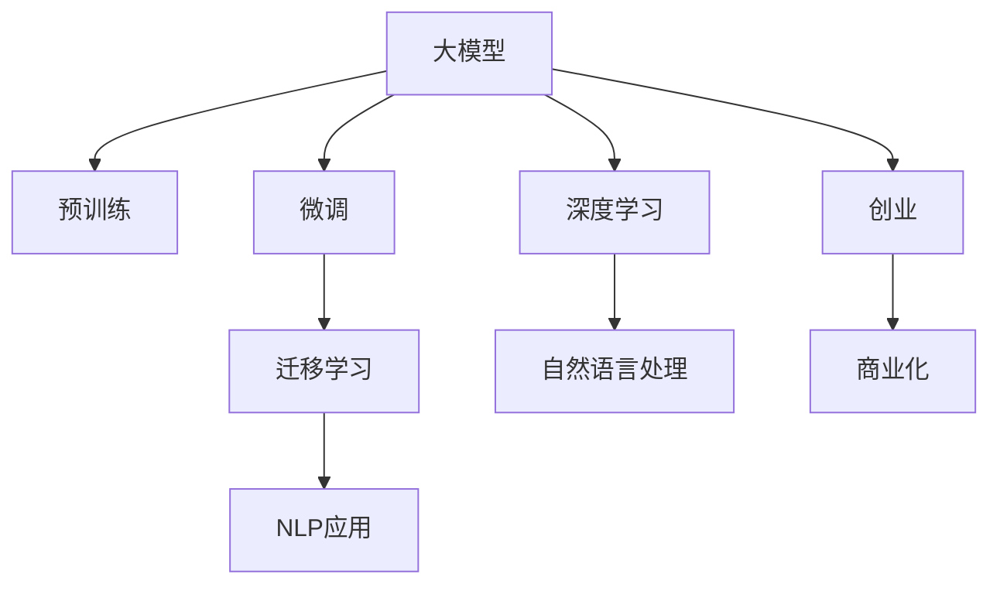

                 

# AI 大模型创业：如何利用科技优势？

> 关键词：大模型创业, 技术优势, 深度学习, 自然语言处理, 人工智能创业, 创新创业

## 1. 背景介绍

### 1.1 问题由来
人工智能（AI）技术的迅猛发展，特别是在自然语言处理（NLP）领域的突破，为创业公司提供了巨大的机遇。近年来，大模型如GPT、BERT等在多种NLP任务上取得优异表现，如机器翻译、文本生成、问答系统等，引领了AI技术的前沿。然而，这些大模型通常需要大量的数据和计算资源，对普通创业者来说是一个巨大的挑战。

### 1.2 问题核心关键点
对于初创公司来说，如何利用大模型的科技优势，降低技术门槛，提高商业化效率，是成功创业的关键。本文将从背景介绍、核心概念与联系、核心算法原理、数学模型和公式、项目实践、应用场景、工具和资源推荐、总结与展望等方面，系统阐述如何利用大模型进行创业。

## 2. 核心概念与联系

### 2.1 核心概念概述

为更好地理解大模型在创业中的应用，本节将介绍几个关键概念及其之间的联系：

- 大模型（Large Model）：以BERT、GPT等为代表，在预训练阶段在大规模无标签文本数据上进行训练，获得广泛的语义理解能力。
- 预训练（Pre-training）：在大规模数据上进行的自监督学习，学习通用的语言表示。
- 微调（Fine-tuning）：在大模型的基础上，使用特定任务的少量标注数据进行有监督学习，优化模型在该任务上的性能。
- 迁移学习（Transfer Learning）：将预训练模型迁移到新任务，减少标注数据需求，提高模型效果。
- 深度学习（Deep Learning）：使用多层次神经网络模型，模仿人脑的神经网络结构，处理复杂问题。
- 自然语言处理（NLP）：让计算机理解和生成人类语言的技术，如机器翻译、文本生成、情感分析等。

这些概念构成了大模型在创业应用中的核心框架，通过理解这些概念，可以更好地把握大模型的应用方向和技术实现。

### 2.2 核心概念原理和架构的 Mermaid 流程图



这个流程图展示了从大模型到创业应用的过程：

1. 大模型通过预训练获得基础的语义理解能力。
2. 利用微调技术，在大模型的基础上进行特定任务的优化。
3. 将微调后的模型应用于NLP领域的各种任务。
4. 通过迁移学习，可以将模型应用于更多领域，降低技术门槛。
5. 创业公司可以利用这些技术优势，快速开发和部署商业化应用。

## 3. 核心算法原理 & 具体操作步骤

### 3.1 算法原理概述

大模型的创业应用基于深度学习的基本原理，即在大规模数据上进行训练，学习模型的参数，然后在特定任务上进行微调，优化模型的性能。核心算法包括：

- 数据预处理：将原始数据转换为模型可以处理的格式，如文本数据的分词、编码。
- 模型构建：使用深度学习框架构建模型，如PyTorch、TensorFlow等。
- 模型训练：使用训练数据对模型进行训练，通过反向传播算法优化模型参数。
- 模型评估：在测试数据上评估模型性能，判断是否达到预期效果。
- 模型部署：将训练好的模型部署到生产环境中，供用户使用。

### 3.2 算法步骤详解

以下是基于深度学习的大模型创业应用的详细步骤：

**Step 1: 数据收集和预处理**
- 收集标注数据，确保数据质量。
- 对文本数据进行分词、编码等预处理，转换为模型可以处理的格式。

**Step 2: 构建模型**
- 选择合适的深度学习框架，如PyTorch、TensorFlow等。
- 定义模型结构，包括输入层、隐藏层、输出层等。
- 使用预训练模型作为初始化参数，减少训练时间。

**Step 3: 模型训练**
- 使用训练数据对模型进行训练，优化模型参数。
- 使用反向传播算法计算梯度，更新模型参数。
- 使用正则化技术，如L2正则、Dropout等，避免过拟合。

**Step 4: 模型评估**
- 在测试数据上评估模型性能，使用准确率、召回率等指标。
- 根据评估结果调整模型参数，进行进一步优化。

**Step 5: 模型部署**
- 将训练好的模型部署到服务器上，供用户使用。
- 使用API接口，让用户方便地调用模型。

### 3.3 算法优缺点

大模型的创业应用具有以下优点：
1. 技术门槛低：使用预训练模型作为基础，降低了模型构建和训练的难度。
2. 效果显著：在大模型基础上进行微调，可以显著提升模型在特定任务上的性能。
3. 灵活性高：可以根据具体需求，选择不同的预训练模型和微调方法。

同时，该方法也存在一些局限性：
1. 依赖数据：微调需要大量标注数据，对于小规模创业公司来说是一个挑战。
2. 计算资源需求高：大模型的训练和推理需要大量的计算资源，对硬件要求较高。
3. 过拟合风险：微调模型容易过拟合，需要合适的正则化技术。
4. 可解释性不足：大模型作为"黑盒"，难以解释内部决策过程。

尽管有这些局限性，但就目前而言，基于大模型的微调方法是创业公司快速开发和部署NLP应用的重要手段。未来相关研究的重点在于如何进一步降低数据需求，提高模型鲁棒性和可解释性。

### 3.4 算法应用领域

大模型的微调技术已经在多种NLP领域得到了广泛应用，包括：

- 机器翻译：将一种语言翻译成另一种语言，如Google Translate。
- 文本生成：自动生成文章、对话等文本内容，如OpenAI的GPT。
- 问答系统：对自然语言问题给出答案，如IBM Watson。
- 情感分析：分析文本的情感倾向，如Twitter的情感分析系统。
- 推荐系统：根据用户行为推荐商品或内容，如Amazon的推荐系统。

除了这些传统领域外，大模型微调还被创新性地应用于更多场景中，如可控文本生成、常识推理、代码生成、数据增强等，为NLP技术带来了新的突破。

## 4. 数学模型和公式 & 详细讲解 & 举例说明

### 4.1 数学模型构建

在构建深度学习模型时，通常包括以下几个步骤：

1. 输入层：将原始数据转换为向量形式，如将文本转换为词向量。
2. 隐藏层：对输入数据进行处理，提取特征。
3. 输出层：根据任务需求，定义输出结构，如分类、回归等。
4. 损失函数：定义模型输出的损失函数，如交叉熵损失、均方误差损失等。

### 4.2 公式推导过程

以文本分类任务为例，定义模型为 $M_{\theta}$，其中 $\theta$ 为模型参数。假设输入为 $x$，输出为 $y$，则损失函数 $\mathcal{L}$ 可以定义为：

$$
\mathcal{L} = -\frac{1}{N}\sum_{i=1}^N y_i \log(M_{\theta}(x_i))
$$

其中，$N$ 为训练样本数量。在训练过程中，使用梯度下降等优化算法，更新模型参数 $\theta$，使得损失函数最小化。

### 4.3 案例分析与讲解

以情感分析为例，假设模型已经训练好，输入一段文本 $x$，输出其情感倾向 $y \in \{1,0\}$，表示正面、负面情感。根据上述损失函数，可以使用反向传播算法计算梯度，更新模型参数。假设模型输出的概率为 $p$，则梯度计算公式为：

$$
\frac{\partial \mathcal{L}}{\partial \theta_k} = -\frac{1}{N}\sum_{i=1}^N (y_i - M_{\theta}(x_i)) \frac{\partial M_{\theta}(x_i)}{\partial \theta_k}
$$

其中，$\frac{\partial M_{\theta}(x_i)}{\partial \theta_k}$ 为模型输出的梯度，可以使用链式法则计算。

## 5. 项目实践：代码实例和详细解释说明

### 5.1 开发环境搭建

在进行深度学习项目实践时，首先需要准备好开发环境。以下是使用Python进行PyTorch开发的简单配置流程：

1. 安装Anaconda：从官网下载并安装Anaconda，用于创建独立的Python环境。
2. 创建并激活虚拟环境：
```bash
conda create -n pytorch-env python=3.8 
conda activate pytorch-env
```
3. 安装PyTorch：根据CUDA版本，从官网获取对应的安装命令。例如：
```bash
conda install pytorch torchvision torchaudio cudatoolkit=11.1 -c pytorch -c conda-forge
```
4. 安装TensorFlow：
```bash
pip install tensorflow
```
5. 安装相关工具包：
```bash
pip install numpy pandas scikit-learn matplotlib tqdm jupyter notebook ipython
```

完成上述步骤后，即可在`pytorch-env`环境中开始项目实践。

### 5.2 源代码详细实现

以下是使用PyTorch进行情感分析任务微调的代码实现：

```python
import torch
import torch.nn as nn
import torch.optim as optim
from torch.utils.data import DataLoader
from transformers import BertTokenizer, BertForSequenceClassification
from sklearn.metrics import accuracy_score

# 定义模型
class MyModel(nn.Module):
    def __init__(self, num_labels=2):
        super(MyModel, self).__init__()
        self.bert = BertForSequenceClassification.from_pretrained('bert-base-uncased', num_labels=num_labels)
        self.dropout = nn.Dropout(0.1)
        self.classifier = nn.Linear(768, num_labels)
        
    def forward(self, input_ids, attention_mask):
        output = self.bert(input_ids, attention_mask=attention_mask)
        pooled_output = output.pooler_output
        logits = self.classifier(pooled_output)
        return logits

# 定义数据处理函数
def prepare_data(texts, labels):
    tokenizer = BertTokenizer.from_pretrained('bert-base-uncased')
    encoding = tokenizer(texts, truncation=True, padding=True, return_tensors='pt')
    input_ids = encoding['input_ids']
    attention_mask = encoding['attention_mask']
    labels = torch.tensor(labels, dtype=torch.long)
    return input_ids, attention_mask, labels

# 加载数据集
texts = ['这是一段正面的文本', '这是一段负面的文本', '这段文本需要分析']
labels = [1, 0, 1]
input_ids, attention_mask, labels = prepare_data(texts, labels)

# 定义模型和优化器
model = MyModel()
optimizer = optim.Adam(model.parameters(), lr=1e-5)

# 训练模型
epochs = 5
batch_size = 2
for epoch in range(epochs):
    model.train()
    for i in range(0, len(input_ids), batch_size):
        input_ids = input_ids[i:i+batch_size]
        attention_mask = attention_mask[i:i+batch_size]
        labels = labels[i:i+batch_size]
        optimizer.zero_grad()
        outputs = model(input_ids, attention_mask)
        loss = nn.CrossEntropyLoss()(outputs, labels)
        loss.backward()
        optimizer.step()
        
    model.eval()
    with torch.no_grad():
        input_ids = input_ids[i:i+batch_size]
        attention_mask = attention_mask[i:i+batch_size]
        labels = labels[i:i+batch_size]
        outputs = model(input_ids, attention_mask)
        predictions = torch.argmax(outputs, dim=1)
        accuracy = accuracy_score(labels, predictions)
        print(f'Epoch {epoch+1}, accuracy: {accuracy:.2f}')
```

### 5.3 代码解读与分析

在上述代码中，我们定义了一个自定义模型`MyModel`，继承自PyTorch的`nn.Module`，包括预训练的BERT层、Dropout层和线性分类器。在`forward`方法中，我们使用BERT层进行文本编码，并使用线性分类器输出情感标签。

`prepare_data`函数用于加载文本数据和标签，并进行分词和编码。使用BertTokenizer将文本转换为模型可以处理的格式，并填充为定长。

在训练模型时，我们使用Adam优化器，并在模型上应用交叉熵损失函数。在每个epoch结束后，计算模型在测试集上的准确率，并输出结果。

## 6. 实际应用场景

### 6.1 智能客服系统

基于大模型的智能客服系统，可以通过微调获得高性能的对话模型，快速响应客户咨询，提高服务效率。系统收集历史客服数据，并将其标注为问题和最佳答复，用于微调模型。微调后的模型可以理解客户意图，并自动匹配最合适的答复。

### 6.2 金融舆情监测

金融公司可以利用大模型的情感分析能力，实时监测市场舆情，及时应对负面信息传播，规避金融风险。系统收集金融领域的新闻、报道、评论等数据，并进行情感标注。微调后的模型能够自动判断文本情感倾向，实时预警异常情况。

### 6.3 个性化推荐系统

推荐系统可以利用大模型的文本生成能力，生成推荐内容，提高个性化推荐的效果。系统收集用户浏览、点击、评论等行为数据，并提取物品标题、描述等文本信息。使用微调后的模型预测用户兴趣，生成个性化推荐结果。

### 6.4 未来应用展望

未来，大模型微调技术将广泛应用于更多领域，推动技术创新和产业升级。例如：

- 智慧医疗：利用大模型的情感分析、语言理解能力，构建智能问诊系统，提高医疗服务质量。
- 智能教育：开发智能辅导系统，根据学生学习情况推荐学习内容，提升教育效果。
- 智慧城市：利用大模型的自然语言处理能力，构建智能安防、智能交通等系统，提升城市治理水平。

## 7. 工具和资源推荐

### 7.1 学习资源推荐

以下是几个推荐的学习资源：

1. 《深度学习》课程：斯坦福大学开设的深度学习经典课程，讲解深度学习的基本概念和算法。
2. 《Transformer: A New Approach to Learning to Translate》论文：介绍Transformer模型，引领了NLP领域的预训练大模型趋势。
3. 《Natural Language Processing with PyTorch》书籍：介绍如何使用PyTorch进行NLP任务开发，包括微调等技术。
4. HuggingFace官方文档：Transformers库的官方文档，提供了丰富的预训练模型和微调样例。
5. CLUE开源项目：中文语言理解测评基准，涵盖大量不同类型的中文NLP数据集，并提供了基于微调的baseline模型。

### 7.2 开发工具推荐

以下是一些常用的开发工具：

1. PyTorch：基于Python的深度学习框架，支持动态计算图，适合快速迭代研究。
2. TensorFlow：由Google主导开发的深度学习框架，生产部署方便，适合大规模工程应用。
3. Transformers库：HuggingFace开发的NLP工具库，集成了多种预训练模型和微调方法。
4. Weights & Biases：模型训练的实验跟踪工具，可以记录和可视化模型训练过程中的各项指标。
5. TensorBoard：TensorFlow配套的可视化工具，可实时监测模型训练状态，并提供丰富的图表呈现方式。
6. Google Colab：谷歌推出的在线Jupyter Notebook环境，免费提供GPU/TPU算力，方便快速上手实验。

### 7.3 相关论文推荐

以下是几篇奠基性的相关论文：

1. Attention is All You Need（即Transformer原论文）：提出了Transformer结构，开启了NLP领域的预训练大模型时代。
2. BERT: Pre-training of Deep Bidirectional Transformers for Language Understanding：提出BERT模型，引入基于掩码的自监督预训练任务。
3. Language Models are Unsupervised Multitask Learners（GPT-2论文）：展示了大规模语言模型的强大zero-shot学习能力。
4. Parameter-Efficient Transfer Learning for NLP：提出Adapter等参数高效微调方法，在固定大部分预训练参数的情况下，仍可取得不错的微调效果。
5. Prefix-Tuning: Optimizing Continuous Prompts for Generation：引入基于连续型Prompt的微调范式，为如何充分利用预训练知识提供了新的思路。
6. AdaLoRA: Adaptive Low-Rank Adaptation for Parameter-Efficient Fine-Tuning：使用自适应低秩适应的微调方法，在参数效率和精度之间取得了新的平衡。

## 8. 总结：未来发展趋势与挑战

### 8.1 研究成果总结

本文详细介绍了大模型在创业中的应用，包括预训练、微调、迁移学习等技术，并给出了具体的项目实践。通过系统梳理，可以看到，大模型微调技术为NLP创业提供了强大的科技优势，可以快速开发和部署高性能的NLP应用。

### 8.2 未来发展趋势

未来，大模型微调技术将呈现以下几个发展趋势：

1. 模型规模持续增大。随着算力成本的下降和数据规模的扩张，预训练语言模型的参数量还将持续增长，大模型的学习能力将更加强大。
2. 微调方法日趋多样。除了传统的全参数微调外，未来会涌现更多参数高效的微调方法，如Prefix-Tuning、LoRA等。
3. 持续学习成为常态。微调模型需要不断学习新知识以保持性能，如何在不遗忘原有知识的同时，高效吸收新样本信息，将成为重要的研究课题。
4. 标注样本需求降低。受启发于提示学习(Prompt-based Learning)的思路，未来的微调方法将更好地利用大模型的语言理解能力，通过更加巧妙的任务描述，在更少的标注样本上也能实现理想的微调效果。
5. 多模态微调崛起。当前的微调主要聚焦于纯文本数据，未来会进一步拓展到图像、视频、语音等多模态数据微调。
6. 模型通用性增强。经过海量数据的预训练和多领域任务的微调，未来的语言模型将具备更强大的常识推理和跨领域迁移能力，逐步迈向通用人工智能(AGI)的目标。

### 8.3 面临的挑战

尽管大模型微调技术已经取得了瞩目成就，但在迈向更加智能化、普适化应用的过程中，它仍面临着诸多挑战：

1. 标注成本瓶颈。微调依赖于标注数据，但对于长尾应用场景，获取高质量标注数据成本较高。
2. 模型鲁棒性不足。微调模型面对域外数据时，泛化性能有限。
3. 推理效率有待提高。大模型推理速度慢、内存占用大，需要优化资源利用。
4. 可解释性不足。大模型作为"黑盒"，难以解释内部决策过程。
5. 安全性有待保障。预训练模型可能学习到有害信息，需要通过数据和算法层面的优化来避免。

### 8.4 研究展望

面对大模型微调面临的挑战，未来的研究需要在以下几个方面寻求新的突破：

1. 探索无监督和半监督微调方法。摆脱对大规模标注数据的依赖，利用自监督学习、主动学习等无监督和半监督范式，最大限度利用非结构化数据。
2. 研究参数高效和计算高效的微调范式。开发更加参数高效的微调方法，在固定大部分预训练参数的情况下，只更新极少量的任务相关参数。同时优化微调模型的计算图，减少前向传播和反向传播的资源消耗，实现更加轻量级、实时性的部署。
3. 融合因果和对比学习范式。通过引入因果推断和对比学习思想，增强微调模型建立稳定因果关系的能力，学习更加普适、鲁棒的语言表征。
4. 引入更多先验知识。将符号化的先验知识，如知识图谱、逻辑规则等，与神经网络模型进行巧妙融合，引导微调过程学习更准确、合理的语言模型。
5. 结合因果分析和博弈论工具。将因果分析方法引入微调模型，识别出模型决策的关键特征，增强输出解释的因果性和逻辑性。
6. 纳入伦理道德约束。在模型训练目标中引入伦理导向的评估指标，过滤和惩罚有偏见、有害的输出倾向。同时加强人工干预和审核，建立模型行为的监管机制。

这些研究方向的探索，必将引领大模型微调技术迈向更高的台阶，为构建安全、可靠、可解释、可控的智能系统铺平道路。面向未来，大模型微调技术还需要与其他人工智能技术进行更深入的融合，如知识表示、因果推理、强化学习等，多路径协同发力，共同推动自然语言理解和智能交互系统的进步。只有勇于创新、敢于突破，才能不断拓展语言模型的边界，让智能技术更好地造福人类社会。

## 9. 附录：常见问题与解答

### Q1：大模型微调是否适用于所有NLP任务？

A: 大模型微调在大多数NLP任务上都能取得不错的效果，特别是对于数据量较小的任务。但对于一些特定领域的任务，如医学、法律等，仅仅依靠通用语料预训练的模型可能难以很好地适应。此时需要在特定领域语料上进一步预训练，再进行微调，才能获得理想效果。

### Q2：微调过程中如何选择合适的学习率？

A: 微调的学习率一般要比预训练时小1-2个数量级，如果使用过大的学习率，容易破坏预训练权重，导致过拟合。一般建议从1e-5开始调参，逐步减小学习率，直至收敛。也可以使用warmup策略，在开始阶段使用较小的学习率，再逐渐过渡到预设值。

### Q3：采用大模型微调时会面临哪些资源瓶颈？

A: 当前主流的预训练大模型动辄以亿计的参数规模，对算力、内存、存储都提出了很高的要求。GPU/TPU等高性能设备是必不可少的，但即便如此，超大批次的训练和推理也可能遇到显存不足的问题。因此需要采用一些资源优化技术，如梯度积累、混合精度训练、模型并行等，来突破硬件瓶颈。同时，模型的存储和读取也可能占用大量时间和空间，需要采用模型压缩、稀疏化存储等方法进行优化。

### Q4：如何缓解微调过程中的过拟合问题？

A: 过拟合是微调面临的主要挑战，尤其是在标注数据不足的情况下。常见的缓解策略包括：

1. 数据增强：通过回译、近义替换等方式扩充训练集。
2. 正则化：使用L2正则、Dropout、Early Stopping等避免过拟合。
3. 对抗训练：引入对抗样本，提高模型鲁棒性。
4. 参数高效微调：只调整少量参数(如Adapter、Prefix等)，减小过拟合风险。
5. 多模型集成：训练多个微调模型，取平均输出，抑制过拟合。

这些策略往往需要根据具体任务和数据特点进行灵活组合。只有在数据、模型、训练、推理等各环节进行全面优化，才能最大限度地发挥大模型微调的威力。

### Q5：微调模型在落地部署时需要注意哪些问题？

A: 将微调模型转化为实际应用，还需要考虑以下因素：

1. 模型裁剪：去除不必要的层和参数，减小模型尺寸，加快推理速度。
2. 量化加速：将浮点模型转为定点模型，压缩存储空间，提高计算效率。
3. 服务化封装：将模型封装为标准化服务接口，便于集成调用。
4. 弹性伸缩：根据请求流量动态调整资源配置，平衡服务质量和成本。
5. 监控告警：实时采集系统指标，设置异常告警阈值，确保服务稳定性。
6. 安全防护：采用访问鉴权、数据脱敏等措施，保障数据和模型安全。

大模型微调为NLP应用开启了广阔的想象空间，但如何将强大的性能转化为稳定、高效、安全的业务价值，还需要工程实践的不断打磨。只有从数据、算法、工程、业务等多个维度协同发力，才能真正实现人工智能技术在垂直行业的规模化落地。总之，微调需要开发者根据具体任务，不断迭代和优化模型、数据和算法，方能得到理想的效果。

---

作者：禅与计算机程序设计艺术 / Zen and the Art of Computer Programming

