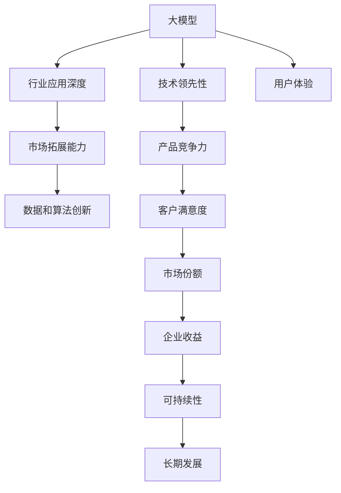

                 

# AI 大模型创业：如何利用竞争优势？

## 1. 背景介绍

### 1.1 问题由来
人工智能(AI)技术在近年来飞速发展，尤其在自然语言处理(NLP)、计算机视觉(CV)、语音识别(SR)等领域取得显著进展。大模型（Large Models）作为AI技术的核心载体，因其强大的语言、视觉、声音理解和生成能力，迅速成为各行各业数字化转型的重要驱动力。越来越多的公司、初创企业乃至个人开发者都在寻求基于大模型的创业机会。

大模型凭借其先进的技术、庞大的数据和庞大的计算资源，有望成为未来科技创新的关键引擎。但与此同时，大模型创业也面临许多挑战，如市场竞争、技术复杂性、数据隐私等。如何在激烈的竞争中脱颖而出，构建可持续发展的AI大模型创业企业，成为业界关注的焦点。

### 1.2 问题核心关键点
本文将围绕AI大模型创业展开讨论，重点分析如何利用其竞争优势，包括技术领先性、行业应用深度、市场拓展能力、数据和算法创新等，为有意进入该领域的创业者和企业提供指导。

## 2. 核心概念与联系

### 2.1 核心概念概述

为更好地理解如何利用大模型的竞争优势，本节将介绍几个关键概念及其相互联系：

- **大模型(Large Model)**：指在深度学习框架下训练的大规模、高精度模型，如GPT-3、BERT等。这些模型通常具备自回归、自编码等特性，能够处理复杂的语言、视觉和语音数据。

- **竞争优势(Competitive Advantage)**：指企业在市场中相比对手具有的独特优势，如技术领先、成本控制、创新能力等。

- **技术领先性(Technological Superiority)**：通过采用最新的技术，提高模型的精度和效率，优化模型架构，使产品具备技术上的绝对优势。

- **行业应用深度(Industry Application Depth)**：将大模型应用于特定行业，深度挖掘行业需求，提供专业化的解决方案。

- **市场拓展能力(Market Expansion Capability)**：通过战略规划和市场推广，将产品推向更广泛的市场，扩大用户群体。

- **数据和算法创新(Data & Algorithm Innovation)**：通过创新算法和数据处理技术，提升模型性能和应用场景的多样性。

这些概念共同构成了大模型创业的核心要素，其相互作用和联系如图示：



这个流程图展示了各个要素之间的逻辑关系，帮助理解如何通过大模型的不同优势构建竞争优势。

## 3. 核心算法原理 & 具体操作步骤

### 3.1 算法原理概述

AI大模型创业的核心在于利用大模型的竞争优势，这些优势包括但不限于技术领先性、行业应用深度、市场拓展能力和数据算法创新。

- **技术领先性**：通过不断优化模型架构，采用最新的深度学习算法，提升模型的精度和效率。例如，Transformer架构的引入极大地提升了自然语言处理的效率和准确性。

- **行业应用深度**：深入研究特定行业的需求，设计符合行业特点的解决方案。如医疗领域的大模型可以用于疾病诊断、治疗方案推荐等。

- **市场拓展能力**：通过精准的市场定位和有效的市场推广策略，将产品推向更广泛的市场。如通过案例展示和行业合作，提升产品的市场认知度和接受度。

- **数据和算法创新**：持续进行数据挖掘和算法优化，使模型能够适应更多应用场景。如利用迁移学习、自监督学习等技术提升模型泛化能力。

### 3.2 算法步骤详解

基于大模型的AI创业可以分为以下几个关键步骤：

**Step 1: 定义业务场景和需求**
- 确定目标行业及业务场景，如医疗健康、金融、教育等。
- 收集行业数据，分析用户需求，确定大模型的应用方向。

**Step 2: 选择合适的预训练模型**
- 根据业务需求，选择适合的大模型，如GPT、BERT、ViT等。
- 考虑模型的规模、精度、训练成本等因素，选择合适的预训练模型。

**Step 3: 定制化微调和优化**
- 在大模型的基础上进行微调，适应特定行业需求。
- 对模型架构、超参数进行优化，提升模型性能。

**Step 4: 部署和应用**
- 将训练好的模型部署到服务器或云平台，提供API接口。
- 在实际应用中不断优化模型，提升用户体验。

**Step 5: 市场推广和反馈**
- 制定市场推广计划，通过案例展示、合作推广等方式提升产品认知度。
- 收集用户反馈，进行迭代优化，不断提升产品竞争力。

### 3.3 算法优缺点

利用大模型进行AI创业，具有以下优点：

1. **技术领先性**：凭借大模型的规模和复杂度，可以轻易超越市场上传统的方法和算法。
2. **行业应用深度**：通过行业深度定制，可以提供专业化的解决方案，满足特定行业需求。
3. **市场拓展能力**：借助大模型的竞争力，快速进入新市场，抢占市场份额。
4. **数据和算法创新**：持续进行数据挖掘和算法优化，保持技术领先。

同时，也存在一些挑战：

1. **数据隐私和合规性**：在处理大量数据时，需要严格遵守数据隐私法律法规，避免数据泄露。
2. **高昂的计算和存储成本**：大模型训练和部署需要大量计算资源和存储资源，成本较高。
3. **技术门槛高**：需要具备深厚的AI技术背景和经验，才能有效利用大模型。
4. **市场竞争激烈**：AI大模型领域竞争激烈，市场份额争夺战难以避免。

### 3.4 算法应用领域

大模型在多个领域具有广泛应用，例如：

- **医疗健康**：通过大模型进行疾病诊断、治疗方案推荐、药物研发等，提升医疗服务水平。
- **金融服务**：利用大模型进行风险评估、信用评分、客户情感分析等，优化金融决策。
- **教育培训**：通过自然语言处理和大数据分析，提供个性化学习方案和智能化评估系统。
- **智能客服**：应用大模型进行智能对话、问题解答、情绪识别等，提升客户服务质量。
- **智能制造**：利用大模型进行设备维护预测、生产调度优化、供应链管理等，提高制造业效率。

## 4. 数学模型和公式 & 详细讲解  
### 4.1 数学模型构建

在AI大模型创业过程中，数学模型和算法起着至关重要的作用。以自然语言处理为例，常见的数学模型包括：

- **语言模型**：如n-gram模型、神经网络语言模型等，用于预测文本序列。
- **注意力机制**：如Transformer中的自注意力机制，用于处理文本中的长期依赖关系。
- **序列标注模型**：如CRF、BiLSTM-CRF等，用于实体识别、命名实体识别等任务。

### 4.2 公式推导过程

以自然语言处理中的Transformer为例，其核心公式包括：

$$
Attention(Q, K, V) = \text{Softmax}(\frac{QK^T}{\sqrt{d_k}})
$$

其中，$Q$、$K$、$V$分别为查询、键和值向量，$\text{Softmax}$为归一化函数。该公式表示了Transformer中注意力机制的计算过程，用于对输入序列的每个位置计算注意力权重。

### 4.3 案例分析与讲解

以医疗健康领域的疾病诊断为例，通过大模型进行疾病诊断的数学模型可以包括：

- **分类模型**：如随机森林、SVM等，用于判断患者是否患病。
- **回归模型**：如线性回归、神经网络等，用于预测疾病严重程度。
- **序列标注模型**：如CRF、BiLSTM-CRF等，用于标注病历中的症状和体征。

## 5. 项目实践：代码实例和详细解释说明
### 5.1 开发环境搭建

为了进行AI大模型的创业实践，需要搭建开发环境，建议使用Python、PyTorch、TensorFlow等深度学习框架。以下是具体步骤：

1. 安装Python：从官网下载并安装Python 3.8或以上版本。
2. 安装PyTorch：通过conda或pip安装，如`conda install pytorch torchvision torchaudio -c pytorch -c conda-forge`。
3. 安装TensorFlow：从官网下载并安装相应版本，并添加至PATH环境变量中。
4. 安装相关库：如Pandas、NumPy、Scikit-Learn等，通过pip安装。

### 5.2 源代码详细实现

以下是一个简单的自然语言处理代码实例，使用PyTorch实现词嵌入和分类器：

```python
import torch
import torch.nn as nn
from torchtext.datasets import AG_NEWS
from torchtext.data import Field, BucketIterator

TEXT = Field(tokenize='spacy', lower=True)
LABEL = Field(sequential=False, use_vocab=False, to_lower=False)

train_data, test_data = AG_NEWS.splits(TEXT, LABEL)

TEXT.build_vocab(train_data, max_size=25000)
LABEL.build_vocab(train_data)

train_iterator, test_iterator = BucketIterator.splits(
    (train_data, test_data),
    batch_size=64,
    device='cuda')

class RNN(nn.Module):
    def __init__(self, input_dim, embedding_dim, hidden_dim, output_dim):
        super().__init__()
        self.embedding = nn.Embedding(input_dim, embedding_dim)
        self.rnn = nn.RNN(embedding_dim, hidden_dim)
        self.fc = nn.Linear(hidden_dim, output_dim)
    
    def forward(self, text):
        embedded = self.embedding(text)
        output, hidden = self.rnn(embedded)
        return self.fc(hidden.squeeze(0))
```

### 5.3 代码解读与分析

以上代码实现了基于循环神经网络(RNN)的文本分类器，核心步骤如下：

1. 定义文本和标签的预处理函数，使用Spacy分词，并构建词汇表。
2. 加载新闻数据集，使用`BucketIterator`进行批次处理。
3. 定义RNN模型，包含嵌入层、RNN层和全连接层。
4. 在模型前向传播时，先对输入进行嵌入处理，再通过RNN层，最后通过全连接层输出分类结果。

## 6. 实际应用场景
### 6.1 医疗健康

在医疗健康领域，大模型可以用于疾病诊断、治疗方案推荐、药物研发等，具有广泛应用前景。例如：

- **疾病诊断**：通过大模型分析患者病历和检查结果，自动生成疾病诊断报告。
- **治疗方案推荐**：根据患者病情和历史数据，生成个性化的治疗方案。
- **药物研发**：利用大模型分析化合物数据库，预测药物效果和副作用。

### 6.2 金融服务

金融服务领域，大模型可以用于风险评估、信用评分、客户情感分析等，提升金融决策的准确性和效率。例如：

- **风险评估**：利用大模型分析客户行为和财务数据，预测贷款违约风险。
- **信用评分**：根据客户的信用历史和行为数据，生成信用评分。
- **客户情感分析**：分析社交媒体和客户反馈，评估客户满意度。

### 6.3 教育培训

在教育培训领域，大模型可以用于个性化学习方案和智能化评估系统，提升教育质量和效率。例如：

- **个性化学习方案**：根据学生的学习行为和知识掌握情况，推荐个性化的学习资源。
- **智能化评估系统**：通过自然语言处理和大数据分析，自动评估学生的学习效果。

## 7. 工具和资源推荐
### 7.1 学习资源推荐

为了帮助开发者系统掌握大模型的创业理论基础和实践技巧，这里推荐一些优质的学习资源：

1. **《深度学习》书籍**：由Ian Goodfellow等人合著，全面介绍了深度学习的基本理论和算法。
2. **《自然语言处理综论》书籍**：由Daniel Jurafsky和James H. Martin合著，介绍了NLP的各个方面。
3. **CS231n课程**：斯坦福大学开设的计算机视觉课程，涵盖了深度学习在计算机视觉中的应用。
4. **Coursera课程**：提供大量免费和付费的AI和NLP相关课程，涵盖从基础到高级的内容。
5. **arXiv论文**：搜索相关领域的最新论文，跟踪前沿技术进展。

### 7.2 开发工具推荐

高效的开发离不开优秀的工具支持。以下是几款用于大模型创业开发的常用工具：

1. **Jupyter Notebook**：免费的交互式编程环境，支持多种编程语言和库。
2. **GitHub**：代码托管平台，便于团队协作和代码共享。
3. **Google Colab**：免费的云平台，支持多种编程语言和库，适合科研和教学使用。
4. **AWS SageMaker**：亚马逊云服务，提供丰富的深度学习工具和基础设施。
5. **TensorBoard**：TensorFlow配套的可视化工具，可实时监测模型训练状态，提供丰富的图表呈现方式。

### 7.3 相关论文推荐

大模型和创业技术的发展源于学界的持续研究。以下是几篇奠基性的相关论文，推荐阅读：

1. **Attention is All You Need**：提出了Transformer架构，开启了NLP领域的预训练大模型时代。
2. **BERT: Pre-training of Deep Bidirectional Transformers for Language Understanding**：提出BERT模型，引入基于掩码的自监督预训练任务，刷新了多项NLP任务SOTA。
3. **AlphaGo**：AlphaGo在围棋比赛中获胜，标志着深度学习在复杂决策问题上的突破。
4. **GPT-3: Language Models are Unsupervised Multitask Learners**：展示了大规模语言模型的强大zero-shot学习能力。

这些论文代表了大模型创业技术的发展脉络。通过学习这些前沿成果，可以帮助研究者把握学科前进方向，激发更多的创新灵感。

## 8. 总结：未来发展趋势与挑战

### 8.1 总结

本文对AI大模型创业进行了全面系统的介绍，重点分析了如何利用其竞争优势。首先阐述了AI大模型创业的背景和意义，明确了技术领先性、行业应用深度、市场拓展能力和数据算法创新等核心要素。其次，从原理到实践，详细讲解了创业过程的各个环节，包括业务场景定义、模型选择、微调和优化、市场推广等。最后，本文对大模型创业的未来发展趋势和面临的挑战进行了展望。

通过本文的系统梳理，可以看到，利用大模型进行创业具有广阔的前景，可以显著提升企业在市场中的竞争力。但要实现这一目标，还需要在数据隐私、技术创新和市场推广等多个方面进行不断优化和改进。

### 8.2 未来发展趋势

展望未来，AI大模型创业将呈现以下几个发展趋势：

1. **数据驱动的决策**：通过深度学习和大数据分析，实现数据驱动的决策支持，提升企业运营效率和决策质量。
2. **多模态融合**：将自然语言处理、计算机视觉、语音识别等技术融合，提供更全面、更智能的产品和服务。
3. **端到端解决方案**：构建端到端的大模型应用系统，提升用户体验和系统稳定性。
4. **开源和协作**：推动大模型的开源和协作，形成社区共同进步，加速技术迭代。
5. **伦理和隐私保护**：重视AI技术带来的伦理和隐私问题，保障数据安全和用户隐私。

以上趋势凸显了AI大模型创业的广阔前景。这些方向的探索发展，必将进一步提升企业竞争力和技术创新能力，推动AI技术在更多领域的广泛应用。

### 8.3 面临的挑战

尽管AI大模型创业具有广阔前景，但在迈向更加智能化、普适化应用的过程中，它仍面临诸多挑战：

1. **高昂的开发和运营成本**：AI大模型创业需要大量的数据、计算资源和人力资源，成本较高。
2. **技术复杂性和创新性**：大模型的开发和优化需要深厚的AI技术背景和持续的创新。
3. **数据隐私和合规性**：在处理大量数据时，需要严格遵守数据隐私法律法规，避免数据泄露。
4. **市场竞争激烈**：AI大模型领域竞争激烈，市场份额争夺战难以避免。
5. **用户接受度和认可度**：如何提升用户对AI产品的接受度和认可度，还需进一步努力。

### 8.4 研究展望

面对AI大模型创业面临的种种挑战，未来的研究需要在以下几个方面寻求新的突破：

1. **数据和算法的优化**：持续进行数据挖掘和算法优化，提升模型的精度和泛化能力。
2. **跨领域技术融合**：推动多模态技术融合，提供更全面、更智能的产品和服务。
3. **用户反馈和产品迭代**：通过用户反馈进行产品迭代优化，提升用户体验和满意度。
4. **伦理和隐私保护**：重视AI技术带来的伦理和隐私问题，保障数据安全和用户隐私。
5. **市场推广和合作**：通过有效的市场推广和行业合作，提升产品认知度和市场份额。

这些研究方向的探索，必将引领AI大模型创业走向更高的台阶，为构建安全、可靠、可解释、可控的智能系统铺平道路。面向未来，AI大模型创业需要与其他人工智能技术进行更深入的融合，多路径协同发力，共同推动自然语言理解和智能交互系统的进步。只有勇于创新、敢于突破，才能不断拓展大模型的边界，让智能技术更好地造福人类社会。

## 9. 附录：常见问题与解答

**Q1：大模型创业需要哪些关键技术和资源？**

A: 大模型创业需要以下关键技术和资源：

1. **深度学习框架**：如TensorFlow、PyTorch等。
2. **大规模数据集**：如自然语言语料、图像数据、音频数据等。
3. **高性能计算资源**：如GPU、TPU等。
4. **AI技术人才**：如算法工程师、数据科学家、软件工程师等。
5. **商业化平台**：如AWS、Google Cloud、阿里云等。

**Q2：如何选择合适的预训练模型？**

A: 选择合适的预训练模型需要考虑以下几个因素：

1. **任务相关性**：选择与业务场景和需求匹配的模型。
2. **模型规模**：根据业务需求和计算资源选择规模合适的模型。
3. **精度和效率**：评估模型在精度和推理速度方面的表现。
4. **开源和商业可用性**：考虑模型的开源和商业可用性，确保能够快速部署和迭代。

**Q3：大模型创业在数据隐私和合规性方面需要注意什么？**

A: 大模型创业在数据隐私和合规性方面需要注意以下几点：

1. **数据来源合法性**：确保数据来源合法，符合相关法律法规。
2. **数据去标识化**：对数据进行去标识化处理，避免数据泄露。
3. **数据使用合规性**：严格遵守数据隐私法律法规，如GDPR等。
4. **数据访问控制**：对数据访问进行严格控制，保障数据安全。

**Q4：如何提升大模型的精度和泛化能力？**

A: 提升大模型的精度和泛化能力需要从以下几个方面进行优化：

1. **数据增强**：通过对训练数据进行增强，增加数据多样性。
2. **正则化技术**：如L2正则、Dropout等，避免过拟合。
3. **迁移学习**：利用预训练模型，进行迁移学习和微调。
4. **模型集成**：通过模型集成，提升模型鲁棒性和泛化能力。

**Q5：大模型创业如何面对市场竞争？**

A: 大模型创业面对市场竞争需要：

1. **差异化定位**：明确产品差异化优势，找到市场切入点。
2. **市场推广**：通过案例展示、行业合作等手段，提升产品认知度和市场份额。
3. **客户服务**：提供优质客户服务和支持，提升用户满意度和忠诚度。
4. **持续创新**：持续进行技术创新和产品迭代，保持竞争优势。

---

作者：禅与计算机程序设计艺术 / Zen and the Art of Computer Programming

