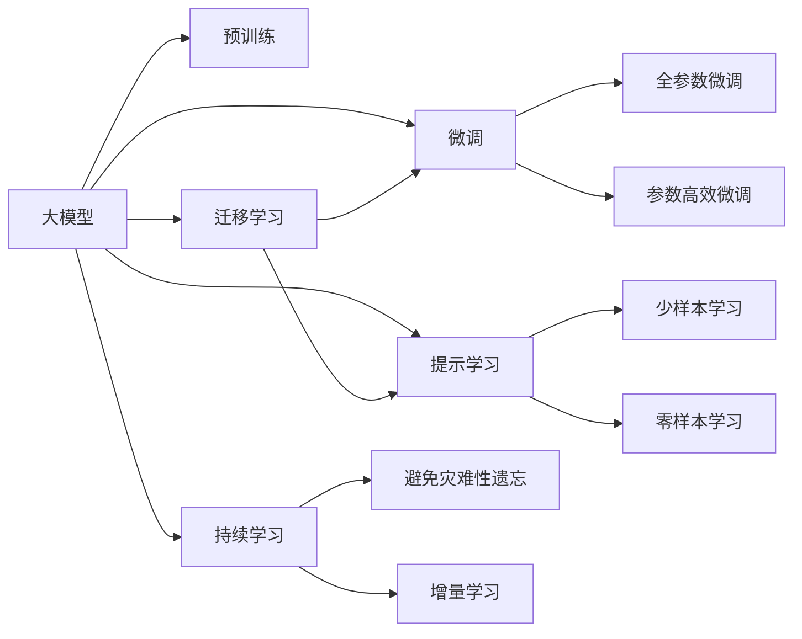

                 

# AI 大模型创业：如何利用资源优势？

## 1. 背景介绍

在人工智能(AI)领域，大模型已经成为行业的热门话题。大模型具有巨大的参数规模和强大的表征能力，能够在各种复杂的任务上取得卓越的性能。但大模型的开发和部署并非易事，创业公司需要充分利用其资源优势，构建高效、可扩展的AI大模型系统。

### 1.1 大模型的优势

大模型能够通过大规模的无标签数据预训练获得广泛的语义表示和知识，从而在诸如自然语言处理(NLP)、计算机视觉(CV)、语音识别等诸多领域上展现出卓越的泛化能力。相较于传统的机器学习模型，大模型可以在少量标注数据的情况下进行微调，快速适应特定任务。

### 1.2 资源瓶颈

尽管大模型具有诸多优势，但它们也带来了巨大的资源需求，尤其是计算资源、存储资源和标注数据。这对创业公司构成了巨大的挑战，但也提供了资源优势利用的巨大空间。

## 2. 核心概念与联系

### 2.1 核心概念概述

为更好理解AI大模型创业的关键点，本节将介绍一些核心概念，并通过流程图进行直观展示。

- **大模型**：指具有大规模参数的神经网络模型，如BERT、GPT-3等。
- **预训练**：在大规模无标签数据上进行训练，学习通用的语义表示。
- **微调**：在预训练模型基础上，使用少量标注数据对特定任务进行优化。
- **迁移学习**：将预训练模型应用于新任务，提高模型泛化能力。
- **参数高效微调**：只微调部分模型参数，保持预训练模型的权重不变，提升微调效率。
- **提示学习**：通过设计任务描述，引导大模型生成期望的输出，减少微调参数。

这些概念之间的关系可以通过以下Mermaid流程图进行可视化：



### 2.2 核心概念原理与架构

以下是这些核心概念的原理和架构的解释。

**大模型**：大模型采用深度神经网络结构，如Transformer，能够学习到语义和语境丰富的表示。以BERT为例，其结构包含Transformer的编码器层，能够处理变长的输入序列。

**预训练**：预训练模型通过在大量文本、图像、语音数据上进行无监督学习，学习到通用的语言、视觉和音频表示。常见的预训练任务包括掩码语言模型、自回归语言模型等。

**微调**：微调在大模型上使用少量标注数据进行有监督学习，调整特定任务的输出层或解码器，以适应特定任务的需求。

**迁移学习**：迁移学习利用预训练模型的表示，将其应用于新任务，通过微调优化特定任务所需的输出层。

**参数高效微调**：参数高效微调只更新部分模型参数，如顶层输出层或解码器，保持大部分预训练权重不变，以减少计算资源消耗。

**提示学习**：提示学习通过设计特定的输入文本格式，引导模型输出特定结果，减少微调所需的标注数据量。

这些概念通过高效的架构设计，能够在大规模数据上实现高性能的AI模型，为创业公司提供了资源优势利用的可能。

## 3. 核心算法原理 & 具体操作步骤

### 3.1 算法原理概述

AI大模型创业的核心算法包括预训练和微调。预训练通过大规模无标签数据训练模型，微调则在此基础上，通过少量标注数据对模型进行优化，以适应特定任务。

### 3.2 算法步骤详解

**预训练**：
1. 收集大规模无标签数据，如大规模中文维基百科、新闻等文本数据。
2. 设计预训练任务，如掩码语言模型、自回归语言模型。
3. 使用预训练模型，如BERT、GPT-3等，在无标签数据上进行预训练。

**微调**：
1. 收集少量标注数据，如特定任务的数据集。
2. 加载预训练模型，添加任务适配层，如分类器或解码器。
3. 设计损失函数，如交叉熵损失、均方误差损失。
4. 使用优化器（如AdamW）进行梯度下降，更新模型参数。
5. 评估模型性能，进行Early Stopping。
6. 在测试集上进行最终评估。

### 3.3 算法优缺点

**优点**：
- 泛化能力强：预训练模型能够处理各种新任务。
- 灵活高效：微调过程简单，仅需少量标注数据。
- 节省成本：使用预训练模型能够减少标注数据和计算资源投入。

**缺点**：
- 依赖标注数据：微调效果依赖于标注数据的质量和数量。
- 泛化能力受限：当新任务与预训练任务差异较大时，泛化性能受限。
- 模型过拟合：若微调数据量少，模型容易过拟合。

### 3.4 算法应用领域

AI大模型创业在多个领域应用广泛，包括但不限于：

- 自然语言处理（NLP）：问答系统、机器翻译、情感分析等。
- 计算机视觉（CV）：图像分类、目标检测、图像生成等。
- 语音识别：自动语音识别（ASR）、文本转语音（TTS）等。
- 医疗健康：医疗影像分析、健康监测、疾病诊断等。
- 金融科技：金融舆情分析、风险评估、信用评估等。
- 智能制造：预测性维护、生产调度、质量控制等。
- 智能家居：智能推荐、智能控制、安全监控等。

## 4. 数学模型和公式 & 详细讲解 & 举例说明

### 4.1 数学模型构建

以BERT模型为例，其预训练模型包括Transformer编码器和池化层，微调任务的目标函数为：

$$
\mathcal{L} = \frac{1}{N} \sum_{i=1}^N \ell(M_{\theta}(x_i), y_i)
$$

其中，$M_{\theta}$ 为微调后的模型，$\ell$ 为任务特定的损失函数，$N$ 为训练样本数量。

### 4.2 公式推导过程

以情感分析任务为例，若使用BERT进行微调，步骤如下：

1. 加载预训练BERT模型。
2. 将输入文本 $x$ 转换为BERT模型可处理的格式。
3. 使用微调后的输出层，计算情感分类预测概率。
4. 计算损失函数 $\ell(x, y)$。
5. 反向传播更新模型参数。

假设损失函数为交叉熵损失，公式为：

$$
\ell(x, y) = -y \log \hat{y} + (1-y) \log(1-\hat{y})
$$

其中，$\hat{y}$ 为模型预测的情感概率，$y$ 为实际情感标签。

### 4.3 案例分析与讲解

以情感分析为例，若输入文本为：“这部电影真的很好看，推荐大家去看。”，其情感标签为1。微调后的模型输出为：$P(\text{正向情感}) = 0.9$，则预测结果为正向情感，损失为：

$$
\ell(x, y) = -1 \cdot \log(0.9) + 0 \cdot \log(0.1) = 0.105
$$

## 5. 项目实践：代码实例和详细解释说明

### 5.1 开发环境搭建

使用Python和PyTorch搭建AI大模型开发环境，具体步骤如下：

1. 安装Anaconda，创建虚拟环境。
2. 安装PyTorch、TensorFlow等深度学习框架。
3. 安装相关的NLP库，如nltk、spaCy等。
4. 配置GPU环境，使用CUDA和cuDNN。
5. 设置数据加载、预处理、训练、评估等关键模块。

### 5.2 源代码详细实现

以下是一个情感分析任务的代码实现示例：

```python
import torch
from transformers import BertForSequenceClassification, BertTokenizer

# 加载预训练BERT模型
model = BertForSequenceClassification.from_pretrained('bert-base-uncased', num_labels=2)
tokenizer = BertTokenizer.from_pretrained('bert-base-uncased')

# 定义训练函数
def train(model, dataset, optimizer, device):
    model.train()
    for i, (inputs, labels) in enumerate(dataset):
        inputs = inputs.to(device)
        labels = labels.to(device)
        optimizer.zero_grad()
        outputs = model(inputs)
        loss = outputs.loss
        loss.backward()
        optimizer.step()

# 定义评估函数
def evaluate(model, dataset, device):
    model.eval()
    correct = 0
    total = 0
    for inputs, labels in dataset:
        inputs = inputs.to(device)
        labels = labels.to(device)
        outputs = model(inputs)
        _, preds = torch.max(outputs, 1)
        total += labels.size(0)
        correct += (preds == labels).sum().item()
    print('Accuracy:', correct / total)

# 加载数据集
train_dataset = ...
dev_dataset = ...
test_dataset = ...

# 定义优化器
optimizer = ...

# 训练模型
for epoch in range(10):
    train(model, train_dataset, optimizer, device)
    evaluate(model, dev_dataset, device)

# 在测试集上评估模型
evaluate(model, test_dataset, device)
```

### 5.3 代码解读与分析

该示例代码使用PyTorch框架，加载BERT预训练模型，进行情感分析任务的微调。

**输入**：文本序列，经过分词后转换为BERT模型所需的格式。
**模型**：加载预训练的BERT模型，添加输出层和分类器。
**训练函数**：对数据集进行迭代训练，更新模型参数。
**评估函数**：计算模型在验证集和测试集上的准确率。

## 6. 实际应用场景

### 6.1 医疗影像分析

AI大模型可以应用于医疗影像分析，通过CT、MRI等影像数据，自动识别病灶、分类疾病，辅助医生诊断。

**流程**：
1. 收集大量医疗影像数据，进行标注。
2. 使用大模型进行预训练，学习图像特征表示。
3. 微调模型，通过微调后的输出层，对病灶进行分类和定位。

### 6.2 金融风险评估

AI大模型可以应用于金融领域，通过分析交易记录、新闻等数据，预测风险、评估信用等。

**流程**：
1. 收集金融数据，进行标注。
2. 使用大模型进行预训练，学习交易特征表示。
3. 微调模型，通过微调后的输出层，预测风险、评估信用等级。

### 6.3 智能推荐系统

AI大模型可以应用于智能推荐系统，通过分析用户行为、商品信息，推荐个性化商品、广告等。

**流程**：
1. 收集用户行为数据、商品信息，进行标注。
2. 使用大模型进行预训练，学习用户、商品特征表示。
3. 微调模型，通过微调后的输出层，推荐个性化商品、广告。

### 6.4 未来应用展望

未来，AI大模型将在更多领域展现出巨大潜力，包括：

- **自动化生产**：在制造业、物流业等领域，自动检测、预测、优化生产流程。
- **智能交通**：在交通管理、智慧城市等领域，实现智能交通管理、预测交通流量。
- **教育科技**：在教育、培训等领域，提供个性化教育、智能化培训等。
- **安全监控**：在安防、警务等领域，实现智能监控、异常检测等。
- **精准农业**：在农业、环保等领域，实现精准种植、农业智能决策等。

## 7. 工具和资源推荐

### 7.1 学习资源推荐

- **《深度学习》：Ian Goodfellow等著。** 深入介绍深度学习基础和应用。
- **《TensorFlow实战》：Manning等著。** 详细介绍TensorFlow框架的开发和应用。
- **《Python机器学习》：Sebastian Raschka等著。** 系统介绍Python在机器学习中的应用。
- **Kaggle竞赛平台。** 提供大量数据集和竞赛任务，帮助开发者提高实战能力。

### 7.2 开发工具推荐

- **PyTorch。** 深度学习领域的主流框架，提供丰富的预训练模型和优化器。
- **TensorFlow。** 支持大规模分布式训练，适用于大规模生产环境。
- **Jupyter Notebook。** 可视化开发环境，便于代码调试和展示。
- **Git版本控制。** 协作开发、版本管理。

### 7.3 相关论文推荐

- **《大模型的艺术》。** 介绍大模型的开发和应用，提供深入的理论基础和实践指南。
- **《大规模深度学习模型的应用》。** 讨论大规模深度学习模型在各领域的实际应用。
- **《预训练语言模型的效果评估》。** 提供评估预训练语言模型效果的方法和标准。

## 8. 总结：未来发展趋势与挑战

### 8.1 研究成果总结

本文介绍了AI大模型创业的关键算法和操作步骤，并通过实际应用场景展示了其潜力。大模型在各领域展现出巨大优势，但仍面临资源瓶颈和算法挑战。

### 8.2 未来发展趋势

未来，AI大模型将呈现以下趋势：

- **模型规模增大**：模型参数量将持续增长，学习更多的知识和表示。
- **算法多样化**：参数高效微调、持续学习等算法不断涌现。
- **跨领域应用**：大模型将在更多领域展示其普适性和泛化能力。
- **多模态融合**：结合图像、语音、文本等多种模态数据，实现更全面的表示学习。
- **智能化升级**：大模型将在智能化应用中发挥越来越重要的作用。

### 8.3 面临的挑战

未来，AI大模型创业面临以下挑战：

- **资源需求高**：大模型需要大量计算资源、存储资源和标注数据。
- **过拟合风险**：微调数据量少时，容易发生过拟合。
- **模型鲁棒性**：对异常数据、噪声数据不敏感。
- **可解释性不足**：模型的内部机制难以解释。
- **伦理和安全问题**：大模型可能带来偏见、误导等问题。

### 8.4 研究展望

未来，AI大模型创业需要在以下方面取得突破：

- **降低资源需求**：优化模型结构，减少计算资源消耗。
- **提高泛化能力**：增强模型对新任务的适应性。
- **增强可解释性**：提供可解释的模型推理过程。
- **消除偏见**：开发公平、无偏见的模型。
- **保障安全**：加强模型审计和监控，确保数据安全。

## 9. 附录：常见问题与解答

### Q1: 大模型的预训练和微调有哪些关键步骤？

A: 大模型的预训练和微调包括数据准备、模型加载、损失函数设计、优化器设置、参数更新、评估等关键步骤。

### Q2: 如何减少大模型的资源需求？

A: 可以通过参数高效微调、分布式训练、模型压缩等方法，减少大模型的资源消耗。

### Q3: 如何提高大模型的泛化能力？

A: 可以通过数据增强、对抗训练、迁移学习等方法，提高大模型的泛化能力。

### Q4: 大模型创业需要哪些资源支持？

A: 大模型创业需要强大的计算资源、丰富的标注数据、高效的开发工具和先进的算法支持。

### Q5: 如何构建高效的大模型系统？

A: 需要优化模型结构、减少计算资源消耗，结合多种算法进行模型训练和微调，确保模型的高效性和泛化能力。

---

作者：禅与计算机程序设计艺术 / Zen and the Art of Computer Programming

