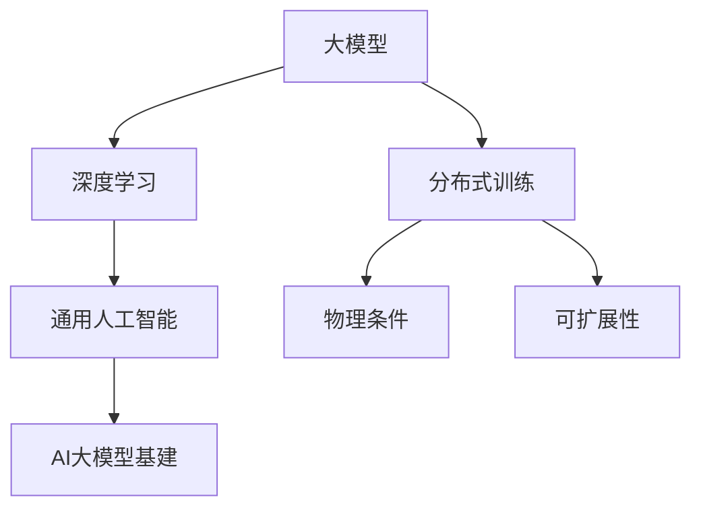

                 

# AI 大模型原理与应用：AGI 大基建受限于物理条件

> 关键词：大模型,通用人工智能,AGI,深度学习,物理条件,可扩展性

## 1. 背景介绍

### 1.1 问题由来

人工智能（AI）领域的迅速发展，特别是深度学习技术的应用，推动了大模型的研究和实践。近年来，众多大模型如BERT、GPT-3、DALL·E、DETR等在自然语言处理（NLP）、计算机视觉（CV）、生成模型等领域取得了令人瞩目的成绩。然而，这些大模型往往具有庞大的参数规模，对计算资源的需求极高，部署成本极高，很难在工业界大规模部署。此外，由于物理条件的限制，如算法可扩展性、存储和传输等问题，大规模部署AI大模型的基础设施也面临诸多挑战。

### 1.2 问题核心关键点

本文聚焦于AI大模型在通用人工智能（AGI）领域的应用及其基础设施的构建，探讨了在物理条件限制下如何更好地构建和部署大模型。在技术实践中，我们需要解决的问题包括：
- 如何构建具有高度可扩展性的AI大模型基础设施？
- 如何在有限物理资源下高效地训练和部署大模型？
- 如何优化模型，使其在分布式系统中表现出更好的性能？

## 2. 核心概念与联系

### 2.1 核心概念概述

为更好地理解AGI大模型基建受限于物理条件的问题，我们需介绍几个核心概念：

- 大模型（Large Models）：参数规模在百万级以上，可处理大规模数据和复杂任务的高效模型。
- 通用人工智能（AGI）：具备在多种领域自主解决问题的能力，对人类智能有较高层次模拟的AI模型。
- 分布式训练（Distributed Training）：通过多个计算节点协同工作，加速大模型的训练过程。
- 深度学习（Deep Learning）：一类基于人工神经网络的机器学习方法，利用多层次非线性变换进行特征提取和预测。
- 物理条件（Physical Conditions）：指模型训练和部署时的硬件限制，如GPU、内存、网络带宽等。

这些核心概念之间的逻辑关系可以通过以下Mermaid流程图来展示：



这个流程图展示了大模型的核心概念及其之间的关系：

1. 大模型通过深度学习获取多层次的特征表示，具备处理复杂任务的能力。
2. 分布式训练利用多个计算节点加速模型训练，提高训练效率和模型性能。
3. 通用人工智能将大模型应用于多个领域，提升AI系统的整体能力。
4. 物理条件限制了大模型的训练和部署效率。
5. 可扩展性要求在大模型基建中设计高效的计算、存储和通信机制。

这些概念共同构成了AGI大模型的构建和部署框架，使我们能够克服物理条件的限制，构建高效、可扩展的AI大模型基础设施。

## 3. 核心算法原理 & 具体操作步骤
### 3.1 算法原理概述

AI大模型在AGI基建受限于物理条件的问题，核心在于如何构建高效、可扩展的基础设施，并在此基础上训练和部署大模型。具体而言，需要从模型设计、训练算法和优化策略等多个维度进行优化。

1. **模型设计**：
    - **层次化模型设计**：将大模型设计成多个层次，如GPT模型的自回归层和Transformer层，实现不同层次的信息提取。
    - **参数共享**：在模型中设计参数共享机制，如BERT中的共享层和位置编码，减少参数数量，降低计算成本。

2. **训练算法**：
    - **分布式训练**：采用分布式训练算法，如Ring Allreduce、NCCL等，通过多节点协同工作，加速模型训练。
    - **优化器**：选择合适的优化器，如Adam、SGD等，并结合学习率、批大小等超参数调整，提高模型收敛速度。

3. **优化策略**：
    - **剪枝和量化**：通过剪枝和量化技术减少模型参数，降低计算成本。
    - **混合精度训练**：采用混合精度训练，减少存储和计算成本，提高训练速度。
    - **模型压缩**：采用模型压缩技术，如知识蒸馏、蒸馏量化等，将大模型压缩为更小的模型，提高推理速度。

### 3.2 算法步骤详解

#### 3.2.1 层次化模型设计

**层次化模型设计**：
- 将大模型设计成多个层次，每层负责处理不同的信息。例如，GPT模型中的自回归层负责处理上下文信息，Transformer层负责处理语言模型。
- 层次化模型设计可以降低模型参数量，同时提高模型的泛化能力。具体而言，各层次可以并行计算，提高模型训练速度，同时模型层次划分可以使得模型更易于扩展和优化。

#### 3.2.2 分布式训练

**分布式训练**：
- 将大模型分布在多个计算节点上，通过多节点协同工作进行训练。
- 分布式训练算法有Ring Allreduce、NCCL等。Ring Allreduce算法通过节点环传递信息，NCCL算法通过节点环和Allgather、ReduceScatter等操作，实现更高效的通信。

#### 3.2.3 优化器选择

**优化器选择**：
- 选择适合的大模型优化器，如Adam、SGD等。Adam优化器具有收敛速度快、稳定性好等优点，适用于大模型训练。
- 调整超参数，如学习率、批大小等，以提高模型收敛速度。

#### 3.2.4 剪枝和量化

**剪枝和量化**：
- 通过剪枝技术去除模型中不必要的参数，减少模型复杂度，提高计算效率。剪枝可以在训练过程中动态调整，选择对模型性能影响较小的参数进行剪枝。
- 量化技术将模型参数从浮点数转换为定点数，减少存储和计算成本，提高训练速度。量化可以在模型训练前或训练过程中进行。

#### 3.2.5 混合精度训练

**混合精度训练**：
- 采用混合精度训练，将模型参数分为高精度和低精度两部分，降低存储和计算成本，提高训练速度。
- 混合精度训练可以通过NVIDIA的NVIDIA Ampere GPU等支持硬件实现。

#### 3.2.6 模型压缩

**模型压缩**：
- 通过知识蒸馏、蒸馏量化等技术，将大模型压缩为更小的模型，提高推理速度。
- 知识蒸馏是一种将大模型压缩为小模型的方法，通过在大模型和小模型之间传递知识，提高小模型的性能。蒸馏量化则是一种将模型参数转换为定点数的方法，减少存储和计算成本。

### 3.3 算法优缺点

**层次化模型设计**：
- **优点**：降低了模型参数量，提高了模型的泛化能力，模型层次划分可以使得模型更易于扩展和优化。
- **缺点**：层次设计需要设计合适的层次结构，设计不当可能影响模型性能。

**分布式训练**：
- **优点**：提高了模型训练速度，支持大规模模型训练，模型并行计算。
- **缺点**：分布式训练需要设计高效的通信算法，增加系统复杂度。

**优化器选择**：
- **优点**：Adam优化器收敛速度快，SGD稳定性好，选择适合的优化器可以提高模型性能。
- **缺点**：优化器选择不当可能导致模型训练困难，超参数调整复杂。

**剪枝和量化**：
- **优点**：减少模型参数量，降低计算成本，提高计算速度。
- **缺点**：剪枝和量化可能导致模型性能下降，需要动态调整。

**混合精度训练**：
- **优点**：减少存储和计算成本，提高训练速度，硬件支持良好。
- **缺点**：精度损失可能影响模型性能，需要选择合适的混合精度策略。

**模型压缩**：
- **优点**：提高推理速度，支持更广泛的应用场景，减少硬件需求。
- **缺点**：压缩技术可能影响模型性能，需要选择合适的压缩方法。

### 3.4 算法应用领域

大模型在AGI基建受限于物理条件的问题上，已经在多个领域取得了显著成果：

1. **自然语言处理（NLP）**：
    - **预训练和微调**：通过在大规模无标签数据上进行预训练，然后在特定任务上微调，构建高效的语言模型。
    - **情感分析和文本生成**：利用大模型进行情感分析和文本生成，提高语言理解能力。

2. **计算机视觉（CV）**：
    - **图像分类和目标检测**：构建大规模图像分类和目标检测模型，如ResNet、YOLO等，提高图像识别能力。
    - **生成对抗网络（GAN）**：利用大模型生成逼真的图像，如DALL·E、DETR等。

3. **生成模型**：
    - **自然语言生成**：利用大模型生成自然语言文本，如GPT系列模型。
    - **音乐生成**：利用大模型生成逼真的音乐，如Jukedeck。

4. **强化学习**：
    - **游戏AI**：构建游戏AI模型，如AlphaGo、StarCraft AI等，提升游戏AI能力。
    - **机器人控制**：利用大模型控制机器人，提高智能机器人的决策能力。

以上领域展示了大模型在AGI基建中的应用潜力，未来随着技术进步，大模型将进一步推动AI技术在各领域的应用和落地。

## 4. 数学模型和公式 & 详细讲解  
### 4.1 数学模型构建

在AGI基建中，大模型的数学模型通常包括输入数据 $x$、参数 $w$ 和输出 $y$，表示为 $f(x, w)$。训练模型的目标是最小化损失函数 $L$，即：

$$
\min_{w} L(f(x, w), y)
$$

其中，损失函数 $L$ 可以是交叉熵、均方误差等。在模型训练过程中，我们需要优化模型参数 $w$，使其输出 $f(x, w)$ 逼近真实标签 $y$。

### 4.2 公式推导过程

#### 4.2.1 交叉熵损失函数

**交叉熵损失函数**：
- 设 $x_i$ 为第 $i$ 个输入样本，$y_i$ 为对应的真实标签，$w$ 为模型参数，$f(x_i, w)$ 为模型的预测输出。
- 则交叉熵损失函数定义为：

$$
L = -\frac{1}{N} \sum_{i=1}^N \sum_{j=1}^M y_{i,j} \log f(x_i, w)
$$

其中，$N$ 为样本数量，$M$ 为每个样本的类别数，$y_{i,j}$ 为第 $i$ 个样本的第 $j$ 个类别的真实标签。

#### 4.2.2 均方误差损失函数

**均方误差损失函数**：
- 设 $x_i$ 为第 $i$ 个输入样本，$y_i$ 为对应的真实标签，$w$ 为模型参数，$f(x_i, w)$ 为模型的预测输出。
- 则均方误差损失函数定义为：

$$
L = \frac{1}{N} \sum_{i=1}^N (y_i - f(x_i, w))^2
$$

### 4.3 案例分析与讲解

**案例1：自然语言处理（NLP）**

在NLP领域，利用大模型进行情感分析和文本生成，可以通过以下步骤：

1. **数据准备**：收集大量标注数据，如电影评论、新闻评论等。
2. **预训练**：在大规模无标签数据上进行预训练，构建语言模型。
3. **微调**：在特定任务上进行微调，如情感分类任务，调整顶层分类器。
4. **推理**：使用微调后的模型对新样本进行推理，生成情感分析结果。

**案例2：计算机视觉（CV）**

在CV领域，利用大模型进行图像分类和目标检测，可以通过以下步骤：

1. **数据准备**：收集大量标注数据，如图像分类数据集。
2. **预训练**：在大规模无标签数据上进行预训练，构建卷积神经网络模型。
3. **微调**：在特定任务上进行微调，如目标检测任务，调整顶层检测器。
4. **推理**：使用微调后的模型对新样本进行推理，进行目标检测。

## 5. 项目实践：代码实例和详细解释说明
### 5.1 开发环境搭建

在进行AGI基建实践前，我们需要准备好开发环境。以下是使用Python进行PyTorch开发的环境配置流程：

1. 安装Anaconda：从官网下载并安装Anaconda，用于创建独立的Python环境。

2. 创建并激活虚拟环境：
```bash
conda create -n pytorch-env python=3.8 
conda activate pytorch-env
```

3. 安装PyTorch：根据CUDA版本，从官网获取对应的安装命令。例如：
```bash
conda install pytorch torchvision torchaudio cudatoolkit=11.1 -c pytorch -c conda-forge
```

4. 安装Transformers库：
```bash
pip install transformers
```

5. 安装各类工具包：
```bash
pip install numpy pandas scikit-learn matplotlib tqdm jupyter notebook ipython
```

完成上述步骤后，即可在`pytorch-env`环境中开始AGI基建实践。

### 5.2 源代码详细实现

这里我们以ResNet为例，展示如何在大规模图像数据上构建和训练深度学习模型。

```python
import torch
import torch.nn as nn
import torch.optim as optim
from torchvision import datasets, transforms

# 定义模型
class ResNet(nn.Module):
    def __init__(self):
        super(ResNet, self).__init__()
        self.conv1 = nn.Conv2d(3, 64, kernel_size=7, stride=2, padding=3)
        self.maxpool = nn.MaxPool2d(kernel_size=3, stride=2, padding=1)
        self.res2 = self.residual_block(64, '2')
        self.res3 = self.residual_block(64, '3')
        self.res4 = self.residual_block(64, '4')
        self.avgpool = nn.AvgPool2d(kernel_size=7, stride=1)
        self.fc = nn.Linear(64, 10)

    def forward(self, x):
        x = self.conv1(x)
        x = self.maxpool(x)
        x = self.res2(x)
        x = self.res3(x)
        x = self.res4(x)
        x = self.avgpool(x)
        x = x.view(x.size(0), -1)
        x = self.fc(x)
        return x

    def residual_block(self, in_channels, shortcut):
        conv1 = nn.Conv2d(in_channels, in_channels * 4, kernel_size=3, stride=1, padding=1, bias=False)
        bn1 = nn.BatchNorm2d(in_channels * 4)
        conv2 = nn.Conv2d(in_channels * 4, in_channels * 4, kernel_size=3, stride=1, padding=1, bias=False)
        bn2 = nn.BatchNorm2d(in_channels * 4)
        x = nn.ReLU(inplace=True)(x)
        shortcut = nn.Conv2d(in_channels, in_channels * 4, kernel_size=1, stride=1, padding=0, bias=False)(x)
        shortcut = nn.BatchNorm2d(in_channels * 4)(shortcut)
        x = nn.ReLU(inplace=True)(x)
        x = conv1(x)
        x = bn1(x)
        x = conv2(x)
        x = bn2(x)
        x += shortcut
        return x

# 定义数据预处理
transform = transforms.Compose([
    transforms.ToTensor(),
    transforms.Normalize((0.5, 0.5, 0.5), (0.5, 0.5, 0.5))
])

# 加载数据集
train_data = datasets.CIFAR10(root='./data', train=True, download=True, transform=transform)
test_data = datasets.CIFAR10(root='./data', train=False, download=True, transform=transform)

# 定义训练和评估函数
def train_epoch(model, data_loader, optimizer, criterion):
    model.train()
    for batch_idx, (data, target) in enumerate(data_loader):
        optimizer.zero_grad()
        output = model(data)
        loss = criterion(output, target)
        loss.backward()
        optimizer.step()

def evaluate(model, data_loader, criterion):
    model.eval()
    total_loss = 0.0
    total_correct = 0
    for data, target in data_loader:
        output = model(data)
        loss = criterion(output, target)
        total_loss += loss.item() * data.size(0)
        total_correct += (output.argmax(dim=1) == target).sum().item()
    return total_loss / len(data_loader.dataset), total_correct / len(data_loader.dataset)

# 训练模型
device = torch.device('cuda' if torch.cuda.is_available() else 'cpu')
model = ResNet().to(device)
optimizer = optim.SGD(model.parameters(), lr=0.1, momentum=0.9)
criterion = nn.CrossEntropyLoss()

train_loader = torch.utils.data.DataLoader(train_data, batch_size=64, shuffle=True)
test_loader = torch.utils.data.DataLoader(test_data, batch_size=64, shuffle=False)

for epoch in range(10):
    train_loss = train_epoch(model, train_loader, optimizer, criterion)
    test_loss, test_acc = evaluate(model, test_loader, criterion)
    print(f'Epoch {epoch+1}, train loss: {train_loss:.4f}, test loss: {test_loss:.4f}, test acc: {test_acc:.4f}')
```

以上就是使用PyTorch构建和训练ResNet模型的完整代码实现。可以看到，PyTorch提供了丰富的组件和灵活的API，能够快速实现深度学习模型的构建和训练。

### 5.3 代码解读与分析

让我们再详细解读一下关键代码的实现细节：

**ResNet类**：
- `__init__`方法：初始化模型结构，包括卷积层、池化层和全连接层。
- `forward`方法：定义前向传播过程，依次进行卷积、ReLU激活、池化、全连接等操作。
- `residual_block`方法：定义残差块，实现跨层连接。

**数据预处理**：
- `transforms.Compose`方法：定义数据预处理流程，包括将图像转化为Tensor并进行归一化。

**训练和评估函数**：
- `train_epoch`方法：对数据进行批处理迭代，前向传播计算损失，反向传播更新模型参数。
- `evaluate`方法：对测试数据进行批处理迭代，计算模型损失和准确率。

**模型训练**：
- `device`变量：设置训练设备的类型。
- `train_loader`和`test_loader`：定义数据加载器，用于加载训练集和测试集数据。
- 在循环中依次训练和评估模型，输出每个epoch的损失和准确率。

可以看到，PyTorch提供了便捷的API和丰富的组件，使得深度学习模型的构建和训练变得非常简单。

当然，在工业级的系统实现中，还需要考虑更多因素，如模型的保存和部署、超参数的自动搜索、多任务联合训练等。但核心的AGI基建流程基本与此类似。

## 6. 实际应用场景
### 6.1 智能医疗

在智能医疗领域，基于大模型的AGI基建可以实现多种医疗任务，如病历记录、疾病诊断、药物研发等。

**病历记录**：利用大模型进行电子病历的自动化记录，减少医生的工作量，提高诊断效率。

**疾病诊断**：构建医疗影像分类模型，利用大模型对医学影像进行分类和诊断，如X光片、CT片等。

**药物研发**：利用大模型进行药物分子模拟和药物发现，加速新药的研发进程。

### 6.2 智能交通

在智能交通领域，基于大模型的AGI基建可以实现智能交通管理、自动驾驶、交通预测等任务。

**智能交通管理**：利用大模型进行交通流量预测和信号优化，提高交通管理效率。

**自动驾驶**：构建自动驾驶系统，利用大模型进行环境感知和决策，提高行车安全。

**交通预测**：利用大模型进行交通流量预测和路径规划，优化出行方案。

### 6.3 智能制造

在智能制造领域，基于大模型的AGI基建可以实现智能生产调度、设备监控、质量控制等任务。

**智能生产调度**：利用大模型进行生产调度优化，提高生产效率和质量。

**设备监控**：构建智能监控系统，利用大模型进行设备状态预测和故障诊断。

**质量控制**：利用大模型进行产品质量检测和缺陷识别，提高产品质量。

### 6.4 未来应用展望

随着AGI基建技术的不断进步，基于大模型的AI系统将进一步拓展应用范围，为各行各业带来新的变革。

在智慧城市治理中，基于大模型的AGI基建可以实现智能城市管理、应急指挥、环境监测等任务。

在金融行业，利用大模型进行金融舆情监测、风险预警、量化交易等，提升金融机构的智能化水平。

在教育领域，利用大模型进行智能教育、学情分析、作业批改等，提升教育质量和学习效率。

未来，随着技术的不断演进和应用的不断拓展，AGI基建将逐步成为各行各业智能化发展的基础设施，为经济社会发展注入新的动力。

## 7. 工具和资源推荐
### 7.1 学习资源推荐

为了帮助开发者系统掌握AGI大模型的理论和实践，这里推荐一些优质的学习资源：

1. 《深度学习》（Ian Goodfellow等著）：深度学习领域的经典教材，涵盖深度学习的基本概念和核心算法。
2. 《TensorFlow官方文档》：TensorFlow的官方文档，提供了丰富的API和使用示例。
3. 《PyTorch官方文档》：PyTorch的官方文档，提供了详细的API和使用示例。
4. 《Transformers官方文档》：Transformers库的官方文档，提供了丰富的预训练模型和微调样例代码。
5. 《自然语言处理综述》（Jurafsky等著）：自然语言处理领域的综述性教材，涵盖NLP的基本概念和核心技术。

通过对这些资源的学习实践，相信你一定能够快速掌握AGI大模型的精髓，并用于解决实际的AGI基建问题。

### 7.2 开发工具推荐

高效的开发离不开优秀的工具支持。以下是几款用于AGI基建开发的常用工具：

1. PyTorch：基于Python的开源深度学习框架，灵活动态的计算图，适合快速迭代研究。大部分预训练语言模型都有PyTorch版本的实现。
2. TensorFlow：由Google主导开发的开源深度学习框架，生产部署方便，适合大规模工程应用。同样有丰富的预训练语言模型资源。
3. TensorFlow Lite：TensorFlow的轻量级版本，适用于移动设备等资源受限环境。
4. ONNX：开放神经网络交换格式，支持多种深度学习框架之间的模型转换和部署。
5. AWS SageMaker：Amazon提供的云端深度学习平台，支持模型训练、部署和管理。

合理利用这些工具，可以显著提升AGI基建的开发效率，加快创新迭代的步伐。

### 7.3 相关论文推荐

AGI基建技术的发展源于学界的持续研究。以下是几篇奠基性的相关论文，推荐阅读：

1. 《深度学习》（Goodfellow等著）：深度学习领域的经典教材，涵盖深度学习的基本概念和核心算法。
2. 《Transformer from scratch》：Transformer原论文，介绍Transformer模型的核心原理和实现细节。
3. 《深度学习在医学图像分析中的应用》（Jiang等著）：利用深度学习进行医学影像分析的综述性论文。
4. 《深度学习在自动驾驶中的应用》（Vincent等著）：利用深度学习进行自动驾驶的综述性论文。
5. 《深度学习在智能交通中的应用》（Xu等著）：利用深度学习进行智能交通的综述性论文。

这些论文代表了大模型在AGI基建中的应用方向和发展脉络。通过学习这些前沿成果，可以帮助研究者把握学科前进方向，激发更多的创新灵感。

## 8. 总结：未来发展趋势与挑战
### 8.1 研究成果总结

本文对AGI大模型在基础设施受限于物理条件的问题进行了全面系统的介绍。首先阐述了AGI大模型的研究背景和意义，明确了基础设施在模型训练和部署中的重要性和现状。其次，从模型设计、训练算法、优化策略等多个维度，详细讲解了AGI大模型的构建和训练方法。同时，通过具体案例分析与讲解，展示了AGI大模型在不同领域的应用前景。

通过本文的系统梳理，可以看到，AGI大模型在基础设施受限于物理条件的问题上，已经在多个领域取得了显著成果，并在不断拓展新的应用场景。未来随着技术的不断进步，AGI大模型将进一步推动AI技术在各领域的应用和落地。

### 8.2 未来发展趋势

展望未来，AGI大模型的基建将呈现以下几个发展趋势：

1. **分布式训练**：随着硬件计算能力的提升，分布式训练将更加高效和普及，支持更大规模的模型训练和推理。
2. **模型压缩和剪枝**：为了降低计算成本，模型压缩和剪枝技术将进一步发展，支持更高精度和更快速度的推理。
3. **跨领域融合**：AGI大模型将进一步与知识图谱、逻辑规则等专家知识结合，形成更全面、准确的智能系统。
4. **多模态信息融合**：大模型将支持视觉、语音等多模态信息的整合，提升系统性能和灵活性。
5. **可扩展性和可维护性**：大模型的基础设施将更加可扩展和可维护，支持动态资源配置和系统优化。

以上趋势展示了AGI大模型基建的广阔前景，这些方向的探索发展，必将进一步提升AGI大模型的性能和应用范围，为人类智能智能的发展注入新的动力。

### 8.3 面临的挑战

尽管AGI大模型基建在技术上取得了一定进展，但在迈向更加智能化、普适化应用的过程中，仍面临诸多挑战：

1. **计算资源限制**：大规模深度学习模型的训练和推理需要大量的计算资源，难以在资源受限的环境下部署。
2. **数据质量和分布**：数据质量和数据分布的不均衡可能导致模型性能下降，需要在大规模数据上训练和优化模型。
3. **模型可解释性**：深度学习模型的决策过程难以解释，需要引入可解释性技术，增强模型的透明度和可信度。
4. **隐私和安全**：大规模数据训练和推理涉及隐私和安全问题，需要设计隐私保护和安全防护机制。
5. **跨领域应用**：在不同领域的应用中，需要设计合适的任务适配层，使得大模型能够适应新的任务。

这些挑战需要在技术、工程、伦理等多个维度进行协同攻关，才能更好地推动AGI大模型的落地应用。

### 8.4 研究展望

面对AGI大模型基建所面临的挑战，未来的研究需要在以下几个方面寻求新的突破：

1. **跨领域通用模型**：构建跨领域通用模型，支持多种任务和领域的智能应用。
2. **混合精度训练**：开发混合精度训练技术，进一步提高模型训练和推理效率。
3. **可解释性增强**：引入可解释性技术，增强模型的透明度和可信度。
4. **隐私保护技术**：设计隐私保护和安全防护机制，保障数据和模型的安全。
5. **跨模态融合**：研究跨模态数据融合技术，提升系统的综合性能。

这些研究方向的探索，必将引领AGI大模型基建技术迈向更高的台阶，为构建智能、可靠、可解释、可控的AI系统铺平道路。面向未来，AGI大模型基建技术还需要与其他人工智能技术进行更深入的融合，如知识表示、因果推理、强化学习等，多路径协同发力，共同推动自然语言理解和智能交互系统的进步。

---

作者：禅与计算机程序设计艺术 / Zen and the Art of Computer Programming

