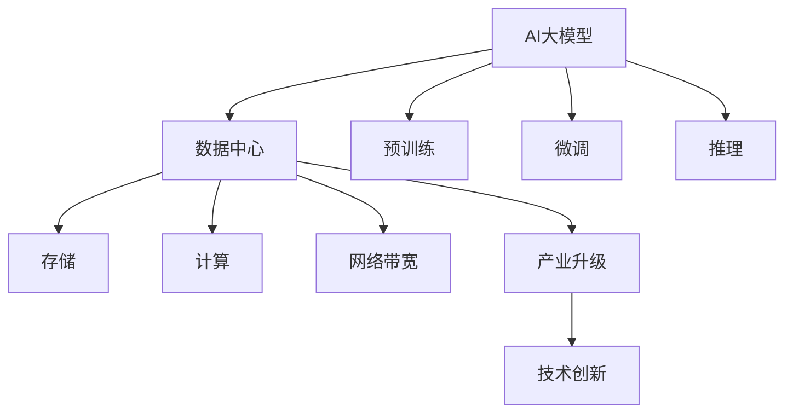

                 

# AI 大模型应用数据中心建设：数据中心产业发展

> 关键词：AI大模型,数据中心,产业发展,存储,计算,人工智能

## 1. 背景介绍

### 1.1 问题由来
随着人工智能（AI）技术的迅猛发展，AI大模型的应用正变得越来越广泛。这些大模型包括自回归模型（如GPT）、自编码模型（如BERT）等，通过在大规模无标签文本数据上预训练，学习到丰富的语言知识和常识。然而，在应用这些大模型时，数据存储和计算资源的需求巨大。数据中心的建设成为AI大模型应用的关键瓶颈。

### 1.2 问题核心关键点
本文聚焦于AI大模型应用数据中心的建设，探讨数据中心在AI大模型应用中的作用、需求及未来发展趋势。AI大模型的应用需求对数据中心的建设提出了更高的要求，包括更高的存储、计算和网络带宽。同时，AI大模型的发展也推动了数据中心的产业升级和技术创新。

### 1.3 问题研究意义
数据中心在AI大模型的应用中扮演着至关重要的角色，是实现AI技术大规模落地应用的重要基础设施。通过研究AI大模型应用数据中心的建设，可以为AI技术的产业化进程提供技术支持和行业指导。

## 2. 核心概念与联系

### 2.1 核心概念概述

为更好地理解AI大模型应用数据中心建设，本节将介绍几个密切相关的核心概念：

- **AI大模型(AI Large Model)**：以自回归（如GPT）或自编码（如BERT）模型为代表的大规模预训练语言模型。通过在大规模无标签文本语料上进行预训练，学习通用的语言表示，具备强大的语言理解和生成能力。

- **数据中心(Data Center, DC)**：由大量计算机服务器、网络设备和存储设备组成的数据处理中心，提供高性能的计算和存储服务。数据中心是支持AI大模型应用的关键基础设施。

- **存储(Storage)**：数据中心存储系统，用于保存和管理系统数据。存储性能直接影响AI大模型的训练和推理速度。

- **计算(Computing)**：数据中心的计算资源，包括服务器、GPU、TPU等硬件设备。计算能力决定了AI大模型的处理速度和精度。

- **网络带宽(Network Bandwidth)**：数据中心的网络带宽，用于支持模型训练和推理中大规模数据传输的需求。

这些核心概念之间的逻辑关系可以通过以下Mermaid流程图来展示：



这个流程图展示了大模型应用与数据中心的密切关系：

1. 大模型通过预训练获得基础能力。
2. 数据中心提供存储、计算和网络资源，支撑大模型的训练和推理。
3. 数据中心的建设和升级，推动了AI大模型应用的发展和优化。

## 3. 核心算法原理 & 具体操作步骤
### 3.1 算法原理概述

AI大模型的应用过程中，数据中心扮演着数据存储、计算和网络传输的关键角色。其核心任务包括：

- 存储管理：管理大模型预训练数据和微调数据的存储，确保数据的可靠性和可访问性。
- 计算调度：调度计算资源，支持大规模模型的并行训练和推理。
- 网络优化：优化网络带宽，支持大规模数据传输和模型间通信。

### 3.2 算法步骤详解

AI大模型应用数据中心的建设主要包括以下关键步骤：

**Step 1: 准备数据中心基础设施**
- 选择合适的物理位置，确保电力、网络等基础设施的完备性。
- 配置高性能的服务器、存储设备和网络设备。

**Step 2: 部署AI大模型**
- 安装并部署大模型应用软件，如TensorFlow、PyTorch等。
- 加载预训练模型和微调数据，进行模型推理。

**Step 3: 优化数据中心配置**
- 调整计算和存储资源，确保模型训练和推理的性能。
- 优化网络带宽和延迟，提升数据传输效率。

**Step 4: 持续优化**
- 根据模型需求和应用场景，持续优化数据中心配置。
- 引入自动化管理工具，提高数据中心运维效率。

### 3.3 算法优缺点

数据中心在大模型应用中起到了关键作用，但也面临以下挑战：

**优点**：
1. 提供高性能的存储、计算和网络资源，满足大模型应用的需求。
2. 集中管理数据和计算资源，提高系统的可靠性和可扩展性。
3. 通过优化配置，提升大模型的训练和推理效率。

**缺点**：
1. 建设和维护成本高昂，需要大量的物理基础设施和专业运维人员。
2. 数据中心的位置和物理结构可能会影响其运行效率和稳定性。
3. 数据中心的能耗问题，需采取节能措施以减少环境影响。

### 3.4 算法应用领域

数据中心在大模型应用中，广泛用于以下领域：

- **自然语言处理(NLP)**：支持大模型的预训练、微调和推理，用于文本分类、情感分析、对话系统等任务。
- **计算机视觉(CV)**：用于图像识别、目标检测、图像生成等任务，支持大规模模型训练和推理。
- **语音识别(Speech Recognition)**：用于语音转文本、语音合成等任务，支持大模型的训练和推理。
- **推荐系统(Recommendation Systems)**：用于个性化推荐、广告投放等任务，支持大模型的训练和推理。
- **智能机器人(Robotics)**：用于机器人路径规划、语音交互等任务，支持大模型的训练和推理。

## 4. 数学模型和公式 & 详细讲解 & 举例说明
### 4.1 数学模型构建

AI大模型应用数据中心的建设，可以从数学模型的角度进行建模。假设数据中心的存储容量为 $C$，计算能力为 $P$，网络带宽为 $B$。模型 $M$ 的训练和推理需求分别为 $T$ 和 $R$。则数据中心的总成本 $C_{\text{total}}$ 可以表示为：

$$
C_{\text{total}} = \frac{T}{C} + \frac{R}{P} + \frac{R}{B}
$$

其中，$T$ 表示模型训练所需的时间，$R$ 表示模型推理所需的时间。

### 4.2 公式推导过程

通过上述公式，我们可以进一步推导出数据中心的各项性能指标和成本计算方法。例如，当存储容量固定时，为了最小化总成本，需要优化计算能力和网络带宽。当计算能力固定时，为了最小化总成本，需要优化存储容量和网络带宽。

### 4.3 案例分析与讲解

考虑一个典型的AI大模型应用场景：自然语言处理任务中的预训练和微调。假设模型训练时间为 $T=100$ 小时，推理时间为 $R=1$ 秒，数据中心的存储容量为 $C=1000$ TB，计算能力为 $P=10^4$ 次每秒，网络带宽为 $B=10^6$ 字节每秒。

则总成本为：

$$
C_{\text{total}} = \frac{100}{1000} + \frac{1}{10^4} + \frac{1}{10^6} = 0.1 + 0.00001 + 0.00000001 = 0.10001
$$

可以看出，存储成本是总成本的主要组成部分，但通过优化计算能力和网络带宽，可以显著降低总成本。

## 5. 项目实践：代码实例和详细解释说明
### 5.1 开发环境搭建

在进行数据中心建设实践前，我们需要准备好开发环境。以下是使用Python进行数据中心环境配置的流程：

1. 安装Anaconda：从官网下载并安装Anaconda，用于创建独立的Python环境。

2. 创建并激活虚拟环境：
```bash
conda create -n dc-env python=3.8 
conda activate dc-env
```

3. 安装数据中心管理工具：如Prometheus、Grafana等，用于监控和可视化数据中心性能。

4. 安装大数据平台：如Hadoop、Spark等，用于处理和管理大规模数据。

5. 安装AI大模型应用工具：如TensorFlow、PyTorch等，用于支持大模型的训练和推理。

完成上述步骤后，即可在`dc-env`环境中开始数据中心建设实践。

### 5.2 源代码详细实现

以下是使用Python进行数据中心配置的代码实现示例：

```python
# 安装Prometheus和Grafana
!conda install prometheus-grafana

# 安装Hadoop和Spark
!conda install hadoop
!pip install apache-spark

# 安装TensorFlow和PyTorch
!pip install tensorflow
!pip install torch
```

### 5.3 代码解读与分析

让我们再详细解读一下关键代码的实现细节：

**安装Prometheus和Grafana**：
- 使用Anaconda安装Prometheus和Grafana，用于监控和可视化数据中心性能。

**安装Hadoop和Spark**：
- 使用Anaconda安装Hadoop和Spark，用于处理和管理大规模数据。

**安装TensorFlow和PyTorch**：
- 使用pip安装TensorFlow和PyTorch，用于支持大模型的训练和推理。

### 5.4 运行结果展示

通过上述代码，可以在数据中心中成功安装并配置好Prometheus、Grafana、Hadoop、Spark、TensorFlow和PyTorch等工具和平台，为AI大模型应用提供高性能的计算和存储资源。

## 6. 实际应用场景
### 6.1 智能客服系统

AI大模型的应用，在智能客服系统中得到了广泛应用。传统客服系统往往需要配备大量人力，高峰期响应缓慢，且一致性和专业性难以保证。AI大模型的应用，可以7x24小时不间断服务，快速响应客户咨询，用自然流畅的语言解答各类常见问题。

在技术实现上，可以收集企业内部的历史客服对话记录，将问题和最佳答复构建成监督数据，在此基础上对预训练模型进行微调。微调后的对话模型能够自动理解用户意图，匹配最合适的答案模板进行回复。对于客户提出的新问题，还可以接入检索系统实时搜索相关内容，动态组织生成回答。如此构建的智能客服系统，能大幅提升客户咨询体验和问题解决效率。

### 6.2 金融舆情监测

金融机构需要实时监测市场舆论动向，以便及时应对负面信息传播，规避金融风险。传统的人工监测方式成本高、效率低，难以应对网络时代海量信息爆发的挑战。基于AI大模型的文本分类和情感分析技术，为金融舆情监测提供了新的解决方案。

具体而言，可以收集金融领域相关的新闻、报道、评论等文本数据，并对其进行主题标注和情感标注。在此基础上对预训练语言模型进行微调，使其能够自动判断文本属于何种主题，情感倾向是正面、中性还是负面。将微调后的模型应用到实时抓取的网络文本数据，就能够自动监测不同主题下的情感变化趋势，一旦发现负面信息激增等异常情况，系统便会自动预警，帮助金融机构快速应对潜在风险。

### 6.3 个性化推荐系统

当前的推荐系统往往只依赖用户的历史行为数据进行物品推荐，无法深入理解用户的真实兴趣偏好。基于AI大模型的个性化推荐系统，可以更好地挖掘用户行为背后的语义信息，从而提供更精准、多样的推荐内容。

在实践中，可以收集用户浏览、点击、评论、分享等行为数据，提取和用户交互的物品标题、描述、标签等文本内容。将文本内容作为模型输入，用户的后续行为（如是否点击、购买等）作为监督信号，在此基础上微调预训练语言模型。微调后的模型能够从文本内容中准确把握用户的兴趣点。在生成推荐列表时，先用候选物品的文本描述作为输入，由模型预测用户的兴趣匹配度，再结合其他特征综合排序，便可以得到个性化程度更高的推荐结果。

### 6.4 未来应用展望

随着AI大模型的发展，其在数据中心中的应用场景将不断拓展。未来，AI大模型将在更多领域得到应用，为传统行业带来变革性影响。

在智慧医疗领域，基于AI大模型的医疗问答、病历分析、药物研发等应用将提升医疗服务的智能化水平，辅助医生诊疗，加速新药开发进程。

在智能教育领域，微调技术可应用于作业批改、学情分析、知识推荐等方面，因材施教，促进教育公平，提高教学质量。

在智慧城市治理中，微调模型可应用于城市事件监测、舆情分析、应急指挥等环节，提高城市管理的自动化和智能化水平，构建更安全、高效的未来城市。

此外，在企业生产、社会治理、文娱传媒等众多领域，基于AI大模型的人工智能应用也将不断涌现，为经济社会发展注入新的动力。相信随着技术的日益成熟，AI大模型必将在更广阔的应用领域大放异彩。

## 7. 工具和资源推荐
### 7.1 学习资源推荐

为了帮助开发者系统掌握AI大模型应用数据中心的理论基础和实践技巧，这里推荐一些优质的学习资源：

1. 《人工智能基础设施建设》系列博文：深入浅出地介绍了数据中心的基础设施、网络架构、运维管理等关键技术。

2. 《机器学习与数据科学基础》课程：斯坦福大学开设的机器学习基础课程，涵盖数据预处理、模型训练、性能评估等重要内容。

3. 《TensorFlow数据中心部署实践》书籍：介绍如何使用TensorFlow构建和管理高性能计算环境，实现大规模数据处理。

4. 《数据中心运维管理》书籍：详细介绍了数据中心的日常运维管理、故障排查、性能优化等实用技巧。

5. Kaggle竞赛：提供大量实际数据集和任务，通过实战练习AI大模型的应用。

通过对这些资源的学习实践，相信你一定能够快速掌握AI大模型应用数据中心的精髓，并用于解决实际的AI应用问题。
### 7.2 开发工具推荐

高效的开发离不开优秀的工具支持。以下是几款用于AI大模型应用数据中心开发的常用工具：

1. Anaconda：提供Python环境管理和数据分析工具，便于数据中心基础设施的搭建。

2. TensorFlow和PyTorch：开源深度学习框架，支持大规模模型的训练和推理。

3. Prometheus和Grafana：开源监控和可视化工具，用于数据中心的性能监测和管理。

4. Hadoop和Spark：开源大数据平台，支持大规模数据处理和管理。

5. AWS和Google Cloud：提供高性能云资源，支持数据中心的弹性扩展和优化。

合理利用这些工具，可以显著提升AI大模型应用数据中心的开发效率，加快创新迭代的步伐。

### 7.3 相关论文推荐

AI大模型和数据中心的发展源于学界的持续研究。以下是几篇奠基性的相关论文，推荐阅读：

1. "Data Center Management: A Survey"（数据中心管理综述）：详细介绍了数据中心的管理和运维策略，是数据中心实践的必读文献。

2. "TensorFlow Serving: Flexible, High-Performance Inference for Machine Learning Models"（TensorFlow Serving：灵活高效模型推理）：介绍了TensorFlow Serving的架构和应用，支持大规模模型推理服务。

3. "Scalable Deep Learning Platforms for Data Center Edge"（面向数据中心边缘的深度学习平台）：介绍了数据中心边缘计算平台的构建方法和应用。

4. "GPU-Accelerated Training and Inference of Deep Neural Networks"（GPU加速深度神经网络训练和推理）：研究了GPU加速在深度学习训练和推理中的重要性和应用。

5. "Optimizing Network Performance for Data Center Applications"（优化数据中心网络性能）：介绍了数据中心网络优化的方法和技术。

这些论文代表了大模型和数据中心的发展脉络。通过学习这些前沿成果，可以帮助研究者把握学科前进方向，激发更多的创新灵感。

## 8. 总结：未来发展趋势与挑战
### 8.1 研究成果总结

本文对AI大模型应用数据中心进行了全面系统的介绍。首先阐述了AI大模型和数据中心的紧密关系，明确了数据中心在AI大模型应用中的核心作用。其次，从原理到实践，详细讲解了数据中心的建设和优化过程，给出了AI大模型应用数据中心的完整代码实例。同时，本文还广泛探讨了AI大模型在各个领域的应用前景，展示了数据中心建设的广阔前景。

### 8.2 未来发展趋势

展望未来，AI大模型应用数据中心将呈现以下几个发展趋势：

1. **云原生架构**：越来越多的AI大模型应用将采用云原生架构，通过弹性伸缩和按需扩展，提升资源利用率。

2. **边缘计算**：面向低延迟、高可靠性的应用场景，AI大模型将逐步向边缘计算迁移，实现更快速的数据处理和推理。

3. **混合计算**：结合CPU、GPU、TPU等多种计算资源，提供高性能的AI计算能力。

4. **异构计算**：采用异构计算架构，支持不同类型的AI模型和算法。

5. **AI-PLM（人工智能产品生命周期管理）**：AI大模型的应用将与产品生命周期管理融合，实现更智能的产品设计和制造。

6. **自适应优化**：通过自适应算法和自动化工具，优化数据中心的性能和能耗。

以上趋势凸显了AI大模型应用数据中心的广阔前景。这些方向的探索发展，必将进一步提升AI大模型的训练和推理效率，为AI技术的产业化进程提供更好的支持。

### 8.3 面临的挑战

尽管AI大模型应用数据中心技术已经取得了显著进展，但在迈向更加智能化、普适化应用的过程中，仍面临以下挑战：

1. **能耗问题**：AI大模型的训练和推理需要大量计算资源，数据中心能耗问题严重。

2. **数据传输瓶颈**：大规模数据传输对网络带宽提出了更高的要求，需优化网络架构和传输协议。

3. **系统复杂性**：数据中心管理复杂度增加，需引入自动化运维工具和技术。

4. **安全和隐私**：数据中心存储和传输大量敏感数据，需采取严格的安全和隐私保护措施。

5. **兼容性和互操作性**：不同厂商和平台之间的兼容性问题，需统一接口和标准。

6. **成本控制**：数据中心的建设和运维成本高昂，需优化资源配置和利用率。

正视这些挑战，积极应对并寻求突破，将是大模型应用数据中心迈向成熟的重要途径。

### 8.4 研究展望

面对数据中心面临的挑战，未来的研究需要在以下几个方面寻求新的突破：

1. **能源效率**：开发节能技术，提升数据中心的能源利用效率。

2. **网络优化**：采用高效的网络架构和协议，提升数据传输速度和可靠性。

3. **自动化管理**：引入自动化运维工具和技术，降低运维成本和复杂度。

4. **安全保障**：采用先进的安全技术和策略，保障数据中心的安全和隐私。

5. **标准化**：推动AI大模型应用数据中心的接口和标准统一，提升互操作性。

6. **成本控制**：优化资源配置和利用率，降低数据中心的建设和运维成本。

这些研究方向的探索，必将引领AI大模型应用数据中心技术迈向更高的台阶，为AI技术的产业化进程提供更好的支撑。

## 9. 附录：常见问题与解答

**Q1：AI大模型应用数据中心的建设是否必须自建？**

A: 不是必须的。现代云计算平台如AWS、Google Cloud等，提供了丰富且灵活的数据中心资源，可以满足大部分AI大模型应用的需求。企业可以根据自身情况选择合适的云计算平台，避免自建数据中心的复杂度和高成本。

**Q2：数据中心的能耗问题如何解决？**

A: 数据中心的能耗问题可以通过优化硬件配置、采用混合计算和边缘计算、引入高效的网络协议和算法等手段解决。例如，使用GPU、TPU等高效计算硬件，优化服务器和存储设备的能耗，采用节能技术如数据中心冷却系统，引入虚拟化技术减少资源浪费等。

**Q3：AI大模型应用数据中心如何优化性能？**

A: 数据中心的性能优化可以从以下几个方面入手：

1. 硬件配置：选择合适的计算和存储设备，确保其性能和可靠性。
2. 网络优化：采用高效的网络架构和协议，提升数据传输速度和可靠性。
3. 自动化管理：引入自动化运维工具和技术，降低运维成本和复杂度。
4. 能耗控制：优化硬件配置和能源利用效率，减少数据中心的能耗和运行成本。

通过这些措施，可以显著提升AI大模型应用数据中心的性能和资源利用率。

**Q4：数据中心如何保证安全性和隐私性？**

A: 数据中心的安全和隐私保护可以从以下几个方面入手：

1. 数据加密：采用先进的数据加密技术，保护数据传输和存储的安全。
2. 访问控制：采用严格的访问控制措施，确保只有授权人员和设备能够访问敏感数据。
3. 审计和监控：建立完善的审计和监控机制，实时监测数据中心的异常行为和事件。
4. 合规性管理：确保数据中心符合国家和地区的法律法规和行业标准，如GDPR、HIPAA等。

通过这些措施，可以显著提升数据中心的安全性和隐私保护水平。

**Q5：如何优化数据中心的资源配置？**

A: 数据中心的资源配置可以从以下几个方面优化：

1. 需求分析：根据AI大模型的需求，合理配置计算、存储和网络资源。
2. 弹性扩展：采用弹性伸缩机制，根据数据中心的负载动态调整资源配置。
3. 资源共享：通过虚拟化技术，实现资源的高效共享和利用。
4. 性能监控：实时监测数据中心的性能指标，及时调整资源配置。

通过这些措施，可以显著优化数据中心的资源配置，提升资源利用率和系统性能。

---

作者：禅与计算机程序设计艺术 / Zen and the Art of Computer Programming

