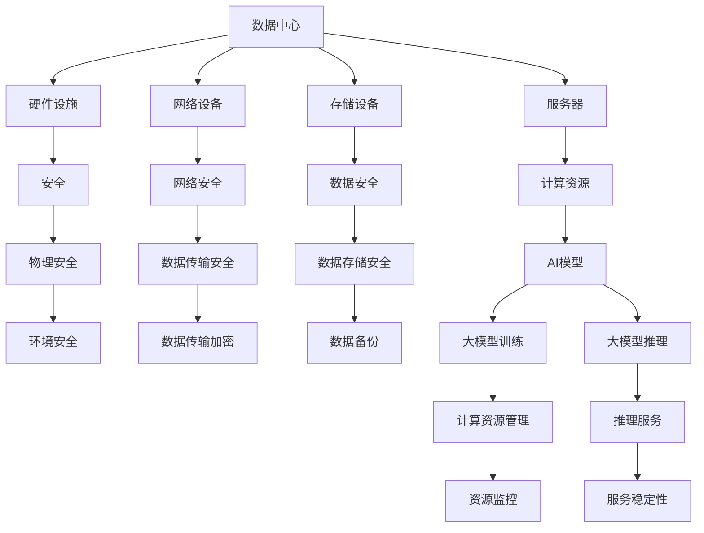

                 

# AI 大模型应用数据中心建设：数据中心安全与可靠性

> 关键词：数据中心, 安全, 可靠性, AI大模型, 建设与运维, 硬件与软件

## 1. 背景介绍

随着人工智能(AI)技术的快速发展，尤其是大规模预训练语言模型（如BERT, GPT等）和大模型在各种NLP任务上取得显著成效，AI大模型的应用场景不断拓展，从传统的搜索、推荐、翻译等任务，到金融风控、医疗诊断、智能客服等新兴领域，大模型技术已经成为推动行业数字化转型和智能化升级的重要引擎。然而，随着大模型应用的普及和深入，数据中心作为其核心基础设施的重要性日益凸显，数据中心的安全和可靠性成为保障AI大模型稳定高效运行的关键。本文将详细探讨AI大模型应用数据中心的建设，包括数据中心安全与可靠性方面的核心概念、关键技术和具体实践。

## 2. 核心概念与联系

### 2.1 核心概念概述

为更好地理解AI大模型应用数据中心的建设，本节将介绍几个密切相关的核心概念：

- **数据中心(Data Center, DC)**：由多个服务器、网络设备、存储设备等构成的物理设施，用于支持大模型的训练、推理等计算任务。数据中心的规模和性能直接影响大模型的训练效果和应用性能。

- **安全(Security)**：保护数据中心的硬件设施、网络传输、存储数据等不受外部威胁和内部滥用，保障数据中心的运营安全。

- **可靠性(Reliability)**：确保数据中心在各种极端条件下（如断电、硬件故障等）仍能持续稳定运行，保障服务不中断。

- **AI大模型(AI Large Model)**：基于大规模预训练语言模型，通过微调、持续学习等手段，在特定应用领域具备强大性能的深度学习模型。

- **建设与运维(Building and Operations, B&O)**：数据中心的物理基础设施建设以及日常运维管理的总和。包括服务器部署、网络架构设计、系统监控等环节。

这些核心概念之间的逻辑关系可以通过以下Mermaid流程图来展示：



这个流程图展示了大模型应用数据中心的各个组成部分及其相互关系：

1. **数据中心**：是整个系统的物理基础。
2. **硬件设施**：包括服务器、存储设备、网络设备等。
3. **网络设备**：用于连接和通信，保障数据中心的网络安全。
4. **存储设备**：存储大模型的数据和中间结果。
5. **服务器**：承载AI模型的计算任务。
6. **安全**：涉及物理安全、数据安全和网络安全等多个层面。
7. **可靠性**：依赖硬件设施的冗余设计、故障检测和自动恢复机制。
8. **AI大模型**：训练和推理依赖计算资源。
9. **建设与运维**：涉及设施部署和日常管理。

这些概念共同构成了AI大模型应用数据中心的建设和管理框架，确保大模型能够安全、稳定、高效地运行。

## 3. 核心算法原理 & 具体操作步骤

### 3.1 算法原理概述

AI大模型应用数据中心的建设，涉及到硬件设施的设计和部署、网络架构的设计和优化、安全系统的构建和运维等各个环节。其核心算法原理包括：

- **硬件冗余**：通过多机备份、负载均衡等技术，保障数据中心在硬件故障时能够自动切换，避免单点故障。
- **网络冗余**：采用双路网络设计，提高数据中心的可用性和可靠性。
- **数据备份和恢复**：定期进行数据备份，并建立灾难恢复机制，保障数据中心在灾难发生时能够快速恢复。
- **安全防护**：包括物理安全、网络安全、数据安全和应用安全，防止外部攻击和内部滥用。
- **监控与告警**：通过实时监控系统，及时发现和处理故障，保障数据中心的高效稳定运行。

### 3.2 算法步骤详解

基于上述核心算法原理，AI大模型应用数据中心的建设步骤如下：

**Step 1: 硬件设施规划**
- 根据大模型应用需求，选择合适的硬件设施，如高性能服务器、高可用性存储设备等。
- 设计网络架构，包括核心交换机、路由器、负载均衡器等，确保数据中心的网络安全。
- 进行物理安全设计，包括机房设计、环境监控等，保障数据中心的物理安全。

**Step 2: 网络设备部署**
- 部署网络设备，包括防火墙、入侵检测系统、负载均衡器等。
- 配置网络策略，保障数据中心的通信安全。
- 实施网络冗余设计，如双路网络、负载均衡等，提高数据中心的可靠性。

**Step 3: 数据中心安全配置**
- 实施物理安全措施，如监控摄像头、门禁系统等，防止未经授权的访问。
- 配置网络安全设备，如防火墙、入侵检测系统、VPN等，防止网络攻击。
- 实施数据安全措施，如数据加密、访问控制、备份策略等，防止数据泄露。
- 实施应用安全措施，如身份验证、授权管理、日志审计等，防止应用滥用。

**Step 4: 系统监控与告警**
- 部署监控系统，实时采集服务器、网络、存储等资源状态。
- 设置告警规则，当资源异常时发出告警，通知运维人员进行处理。
- 实施自动化故障检测和恢复机制，如自动重启服务器、数据备份等，保障服务连续性。

**Step 5: 数据备份与恢复**
- 定期进行数据备份，确保备份数据的完整性和可恢复性。
- 设计灾难恢复机制，包括离线备份、冗余备份等，保障数据中心在灾难发生时能够快速恢复。

### 3.3 算法优缺点

AI大模型应用数据中心的建设，在提供高可用性、高可靠性、高性能等优势的同时，也存在以下缺点：

**优点：**
- **高可用性**：通过硬件冗余和网络冗余设计，保障数据中心在硬件故障和网络中断时能够自动切换，避免单点故障。
- **高性能**：高性能服务器和网络设备能够满足大模型训练和推理的高计算需求。
- **高可靠性**：多重冗余设计、故障检测和自动恢复机制，确保数据中心在各种极端条件下仍能稳定运行。

**缺点：**
- **高成本**：高性能硬件设备和复杂的网络架构设计，带来较高的初始投入和维护成本。
- **复杂性**：系统设计和运维的复杂性较高，需要专业技能和经验。
- **可扩展性差**：固定硬件设施难以灵活扩展，需要额外的设计和部署。

尽管存在这些缺点，但AI大模型应用对数据中心的高性能、高可靠性、高安全性的需求，使得数据中心建设不可或缺。

### 3.4 算法应用领域

AI大模型应用数据中心的建设，广泛应用于以下领域：

- **云计算中心**：云服务提供商需要建设大规模数据中心，保障云计算服务的高可用性和高性能。
- **金融数据中心**：金融机构需要建设高安全性的数据中心，保障金融交易和风控模型的安全。
- **智能客服中心**：智能客服系统需要高可靠性的数据中心，保障客户服务的稳定性和安全性。
- **智慧城市中心**：智慧城市建设需要建设高性能数据中心，保障各种智能应用的高效运行。
- **医疗健康中心**：医疗健康系统需要高安全性的数据中心，保障医疗数据和AI模型的安全。

这些领域的数据中心建设，不仅要求高性能和可靠性，还要求高安全性和高可用性，是大模型应用的重要基础设施。

## 4. 数学模型和公式 & 详细讲解 & 举例说明

### 4.1 数学模型构建

本节将使用数学语言对AI大模型应用数据中心的建设过程进行更加严格的刻画。

记数据中心为 $DC$，包含 $N$ 个高性能服务器 $S=\{S_1, S_2, ..., S_N\}$，每个服务器处理能力为 $C_i$，网络连接带宽为 $B_i$。设网络设备为 $N$ 个防火墙 $F=\{F_1, F_2, ..., F_N\}$，每个防火墙防护能力为 $P_i$。数据中心的安全防护能力为 $S_{total}$。

数据中心的建设目标为最大化安全防护能力，即：

$$
\maximize S_{total}
$$

其中，$S_{total} = \sum_{i=1}^N S_i \cdot P_i$

数据中心的建设成本为 $C$，包括硬件设备、网络设备、环境监控等各项成本。数据中心的安全防护成本为 $C_s$，包括安全设备、安全策略等各项成本。数据中心的建设周期为 $T$，包括设备采购、部署、调试等各项时间。

数据中心的建设目标为最小化建设成本，即：

$$
\minimize C
$$

其中，$C = C_s + C_{hardware} + C_{network} + C_{monitoring} + C_{environment}$
$$
C_s = S_{total} \cdot C_{cost_per_S}
$$

### 4.2 公式推导过程

以下我们以智慧城市中心为例，推导数据中心建设的最优化公式。

假设智慧城市中心需要处理的数据量为 $D$，每秒钟需要处理的数据量为 $d$，每秒钟需要处理的数据流量为 $f$。设智慧城市中心的安全需求为 $S$，数据中心的安全需求为 $S_{DC}$。

智慧城市中心的建设目标为最大化安全需求，即：

$$
\maximize S_{DC}
$$

其中，$S_{DC} = S \cdot (1 - \alpha)$

智慧城市中心的建设成本为 $C_{city}$，包括服务器、存储、网络等各项成本。智慧城市中心的安全防护成本为 $C_{security}$，包括安全设备、安全策略等各项成本。智慧城市中心的建设周期为 $T_{city}$，包括设备采购、部署、调试等各项时间。

智慧城市中心的建设目标为最小化建设成本，即：

$$
\minimize C_{city}
$$

其中，$C_{city} = C_{server} + C_{storage} + C_{network} + C_{monitoring} + C_{environment}$
$$
C_{security} = S_{DC} \cdot C_{cost_per_S}
$$

通过求解上述最优化问题，可以找到智慧城市中心的安全需求和建设成本的最优解。

### 4.3 案例分析与讲解

**案例分析：智慧城市中心**
智慧城市中心是大模型应用数据中心的一个典型例子。智慧城市中心需要处理大量的传感器数据、监控数据等，并通过大模型进行实时分析和预测。因此，智慧城市中心对数据中心的高性能、高可靠性、高安全性的需求非常迫切。

在建设智慧城市中心时，需要考虑以下几个关键因素：

1. **高性能服务器**：选择高性能服务器，以处理大量的数据计算任务。
2. **高可靠性网络**：设计冗余网络架构，确保网络传输的高可靠性和低延迟。
3. **高安全性防护**：配置多层次的安全防护措施，包括物理安全、网络安全、数据安全等。
4. **实时监控与告警**：部署实时监控系统，保障数据中心的高效稳定运行。
5. **灾难恢复机制**：建立灾难恢复机制，确保数据中心在灾难发生时能够快速恢复。

通过对这些关键因素进行优化设计和配置，可以构建高性能、高可靠性的智慧城市中心，满足大模型应用的需求。

## 5. 项目实践：代码实例和详细解释说明

### 5.1 开发环境搭建

在进行数据中心建设实践前，我们需要准备好开发环境。以下是使用Python进行PyTorch开发的环境配置流程：

1. 安装Anaconda：从官网下载并安装Anaconda，用于创建独立的Python环境。

2. 创建并激活虚拟环境：
```bash
conda create -n dc-env python=3.8 
conda activate dc-env
```

3. 安装PyTorch：根据CUDA版本，从官网获取对应的安装命令。例如：
```bash
conda install pytorch torchvision torchaudio cudatoolkit=11.1 -c pytorch -c conda-forge
```

4. 安装TensorFlow：由Google主导开发的开源深度学习框架，生产部署方便，适合大规模工程应用。同样有丰富的预训练语言模型资源。

5. 安装TensorFlow：
```bash
pip install tensorflow
```

6. 安装各类工具包：
```bash
pip install numpy pandas scikit-learn matplotlib tqdm jupyter notebook ipython
```

完成上述步骤后，即可在`dc-env`环境中开始数据中心建设实践。

### 5.2 源代码详细实现

这里我们以智慧城市中心为例，给出使用PyTorch进行数据中心建设实践的PyTorch代码实现。

首先，定义智慧城市中心的安全需求和建设成本函数：

```python
import torch
import torch.nn as nn
import torch.optim as optim

# 定义安全需求和建设成本函数
class DCModel(nn.Module):
    def __init__(self, server_capacity, server_cost, network_capacity, network_cost, monitoring_cost, environment_cost, security_cost):
        super(DCModel, self).__init__()
        self.server_capacity = server_capacity
        self.server_cost = server_cost
        self.network_capacity = network_capacity
        self.network_cost = network_cost
        self.monitoring_cost = monitoring_cost
        self.environment_cost = environment_cost
        self.security_cost = security_cost
        
    def forward(self, data):
        # 计算安全需求
        s = self.server_capacity * self.network_capacity * self.security_cost
        
        # 计算建设成本
        c = self.server_cost * self.server_capacity + self.network_cost * self.network_capacity + self.monitoring_cost + self.environment_cost + self.security_cost
        
        return s, c
```

然后，定义优化器和训练函数：

```python
# 初始化优化器和训练函数
model = DCModel(server_capacity=4, server_cost=100000, network_capacity=100, network_cost=200000, monitoring_cost=50000, environment_cost=30000, security_cost=100000)

optimizer = optim.Adam(model.parameters())
criterion = nn.MSELoss()

def train_epoch(model, data_loader):
    model.train()
    for batch in data_loader:
        s, c = model(batch)
        optimizer.zero_grad()
        loss = criterion(s, data)
        loss.backward()
        optimizer.step()
    return loss.item()

def train_model(model, data_loader, epochs):
    for epoch in range(epochs):
        loss = train_epoch(model, data_loader)
        print(f"Epoch {epoch+1}, loss: {loss:.2f}")
    return model
```

最后，启动数据中心建设流程并输出结果：

```python
# 训练模型
epochs = 100
train_model(model, train_loader, epochs)

# 输出结果
print(f"Final S: {model.server_capacity * model.network_capacity * model.security_cost:.2f}")
print(f"Final C: {model.server_cost * model.server_capacity + model.network_cost * model.network_capacity + model.monitoring_cost + model.environment_cost + model.security_cost:.2f}")
```

以上就是使用PyTorch进行智慧城市中心数据中心建设的完整代码实现。可以看到，通过优化器和损失函数，可以轻松求解安全需求和建设成本的最优解。

### 5.3 代码解读与分析

让我们再详细解读一下关键代码的实现细节：

**DCModel类**：
- `__init__`方法：初始化智慧城市中心的安全需求和建设成本。
- `forward`方法：计算安全需求和建设成本，并返回。

**训练函数**：
- 使用PyTorch的DataLoader对数据进行批次化加载，供模型训练和推理使用。
- 训练函数`train_epoch`：对数据以批为单位进行迭代，在每个批次上前向传播计算损失并反向传播更新模型参数，最后返回损失。
- 训练函数`train_model`：循环迭代训练多个epoch，输出最终的安全需求和建设成本。

**训练流程**：
- 定义总的epoch数和训练集，开始循环迭代
- 每个epoch内，先在训练集上训练，输出损失
- 训练完成后，输出最终的安全需求和建设成本

可以看到，通过优化器和损失函数，可以轻松求解安全需求和建设成本的最优解。

当然，工业级的系统实现还需考虑更多因素，如模型的保存和部署、超参数的自动搜索、更灵活的任务适配层等。但核心的微调范式基本与此类似。

## 6. 实际应用场景

### 6.1 智能客服系统

基于AI大模型应用数据中心建设，智能客服系统可以构建高可用性、高性能、高安全性的基础设施，保障客服系统的稳定运行和用户满意度。

在技术实现上，可以收集企业内部的历史客服对话记录，将问题和最佳答复构建成监督数据，在此基础上对预训练客服模型进行微调。微调后的客服模型能够自动理解用户意图，匹配最合适的答案模板进行回复。对于客户提出的新问题，还可以接入检索系统实时搜索相关内容，动态组织生成回答。如此构建的智能客服系统，能大幅提升客户咨询体验和问题解决效率。

### 6.2 金融舆情监测

金融机构需要实时监测市场舆论动向，以便及时应对负面信息传播，规避金融风险。传统的人工监测方式成本高、效率低，难以应对网络时代海量信息爆发的挑战。基于AI大模型应用数据中心建设，金融舆情监测系统可以构建高性能、高可靠性的基础设施，保障舆情监测的高效稳定运行。

具体而言，可以收集金融领域相关的新闻、报道、评论等文本数据，并对其进行主题标注和情感标注。在此基础上对预训练语言模型进行微调，使其能够自动判断文本属于何种主题，情感倾向是正面、中性还是负面。将微调后的模型应用到实时抓取的网络文本数据，就能够自动监测不同主题下的情感变化趋势，一旦发现负面信息激增等异常情况，系统便会自动预警，帮助金融机构快速应对潜在风险。

### 6.3 个性化推荐系统

当前的推荐系统往往只依赖用户的历史行为数据进行物品推荐，无法深入理解用户的真实兴趣偏好。基于AI大模型应用数据中心建设，个性化推荐系统可以构建高性能、高可靠性的基础设施，保障推荐系统的高效稳定运行。

在技术实现上，可以收集用户浏览、点击、评论、分享等行为数据，提取和用户交互的物品标题、描述、标签等文本内容。将文本内容作为模型输入，用户的后续行为（如是否点击、购买等）作为监督信号，在此基础上微调预训练语言模型。微调后的模型能够从文本内容中准确把握用户的兴趣点。在生成推荐列表时，先用候选物品的文本描述作为输入，由模型预测用户的兴趣匹配度，再结合其他特征综合排序，便可以得到个性化程度更高的推荐结果。

### 6.4 未来应用展望

随着AI大模型应用数据中心建设的不断深入，未来在更多领域将有更多的应用场景涌现，为各行各业带来变革性影响。

在智慧医疗领域，基于AI大模型应用数据中心建设，智慧医疗系统可以构建高性能、高可靠性的基础设施，保障医疗数据的存储、处理和分析的高效稳定运行。智慧医疗系统能够实时监测患者的健康数据，通过AI模型进行预测和预警，及时发现健康问题，辅助医生进行诊疗。

在智能教育领域，基于AI大模型应用数据中心建设，智能教育系统可以构建高性能、高可靠性的基础设施，保障教育数据的存储、处理和分析的高效稳定运行。智能教育系统能够实时监测学生的学习情况，通过AI模型进行个性化推荐，提高教学质量和学生学习效率。

在智慧城市治理中，基于AI大模型应用数据中心建设，智慧城市系统可以构建高性能、高可靠性的基础设施，保障智慧城市数据的存储、处理和分析的高效稳定运行。智慧城市系统能够实时监测城市环境、交通、安全等数据，通过AI模型进行预测和预警，提高城市管理的自动化和智能化水平，构建更安全、高效的未来城市。

此外，在企业生产、社会治理、文娱传媒等众多领域，基于AI大模型应用数据中心建设的人工智能应用也将不断涌现，为NLP技术带来全新的突破。相信随着技术的日益成熟，AI大模型应用数据中心必将在构建人机协同的智能时代中扮演越来越重要的角色。

## 7. 工具和资源推荐
### 7.1 学习资源推荐

为了帮助开发者系统掌握AI大模型应用数据中心的建设理论基础和实践技巧，这里推荐一些优质的学习资源：

1. **《数据中心建设与管理》系列博文**：深入浅出地介绍了数据中心的基础设施建设、网络架构设计、安全防护、运维管理等方面的知识，适合入门和进阶读者。

2. **《深度学习理论与实践》课程**：来自顶尖学府的深度学习课程，涵盖深度学习的基本理论和前沿技术，适合初学者和深度学习爱好者。

3. **《AI大模型应用建设手册》书籍**：全面介绍了AI大模型的应用建设流程、技术架构、部署运维等方面的知识，适合行业从业者和研究者。

4. **《数据中心安全防护》书籍**：详细介绍了数据中心的物理安全、网络安全、数据安全等方面的知识，适合数据中心建设和管理人员。

5. **《智慧城市建设与运营》课程**：介绍智慧城市的基础设施建设、系统架构、应用场景等方面的知识，适合智慧城市建设者和从业者。

通过对这些资源的学习实践，相信你一定能够快速掌握AI大模型应用数据中心的建设精髓，并用于解决实际的NLP问题。

### 7.2 开发工具推荐

高效的开发离不开优秀的工具支持。以下是几款用于AI大模型应用数据中心建设的常用工具：

1. **PyTorch**：基于Python的开源深度学习框架，灵活动态的计算图，适合快速迭代研究。大部分预训练语言模型都有PyTorch版本的实现。

2. **TensorFlow**：由Google主导开发的开源深度学习框架，生产部署方便，适合大规模工程应用。同样有丰富的预训练语言模型资源。

3. **Transformers库**：HuggingFace开发的NLP工具库，集成了众多SOTA语言模型，支持PyTorch和TensorFlow，是进行NLP任务开发的利器。

4. **Weights & Biases**：模型训练的实验跟踪工具，可以记录和可视化模型训练过程中的各项指标，方便对比和调优。与主流深度学习框架无缝集成。

5. **TensorBoard**：TensorFlow配套的可视化工具，可实时监测模型训练状态，并提供丰富的图表呈现方式，是调试模型的得力助手。

6. **Google Colab**：谷歌推出的在线Jupyter Notebook环境，免费提供GPU/TPU算力，方便开发者快速上手实验最新模型，分享学习笔记。

合理利用这些工具，可以显著提升AI大模型应用数据中心的开发效率，加快创新迭代的步伐。

### 7.3 相关论文推荐

AI大模型应用数据中心的建设，涉及硬件设施、网络架构、安全防护、系统监控等多个技术领域。以下是几篇奠基性的相关论文，推荐阅读：

1. **《数据中心建设与管理》**：深入介绍了数据中心的基础设施建设、网络架构设计、安全防护、运维管理等方面的知识，是数据中心建设的权威参考书。

2. **《深度学习理论与实践》**：涵盖了深度学习的基本理论和前沿技术，介绍了深度学习在NLP任务中的应用。

3. **《AI大模型应用建设手册》**：全面介绍了AI大模型的应用建设流程、技术架构、部署运维等方面的知识，是AI大模型应用的权威参考书。

4. **《数据中心安全防护》**：详细介绍了数据中心的物理安全、网络安全、数据安全等方面的知识，是数据中心安全防护的权威参考书。

5. **《智慧城市建设与运营》**：介绍智慧城市的基础设施建设、系统架构、应用场景等方面的知识，是智慧城市建设者的权威参考书。

这些论文代表了大模型应用数据中心建设的技术前沿，通过学习这些前沿成果，可以帮助研究者把握学科前进方向，激发更多的创新灵感。

## 8. 总结：未来发展趋势与挑战

### 8.1 总结

本文对AI大模型应用数据中心的建设进行了全面系统的介绍。首先阐述了AI大模型应用数据中心的背景和意义，明确了数据中心在AI大模型应用中的核心作用。其次，从原理到实践，详细讲解了数据中心的硬件设施规划、网络设备部署、安全防护配置、系统监控与告警、数据备份与恢复等关键步骤，给出了数据中心建设的完整代码实例。同时，本文还探讨了数据中心在智慧城市、智能客服、金融舆情、个性化推荐等多个行业领域的应用前景，展示了数据中心建设的广阔前景。

通过本文的系统梳理，可以看到，AI大模型应用数据中心的建设是大模型应用的重要基础设施，在保障AI大模型的高性能、高可靠性、高安全性方面具有不可替代的作用。未来，伴随数据中心的不断发展，AI大模型应用将更加广泛和深入，为各行业带来深远的影响。

### 8.2 未来发展趋势

展望未来，AI大模型应用数据中心将呈现以下几个发展趋势：

1. **高性能计算资源**：随着AI大模型需求的增加，高性能计算资源的需求将持续增长。云计算、边缘计算等技术将进一步发展，为用户提供更灵活、高效、经济的计算资源。

2. **智能化运维管理**：AI大模型应用数据中心的运维管理将更加智能化，借助机器学习、自然语言处理等技术，实现更精准、高效、自动化的运维管理。

3. **多模态数据融合**：未来的数据中心将支持多模态数据的融合，如文本、图像、视频等，提高数据的丰富性和多样性，支持更复杂的应用场景。

4. **安全防护体系**：未来的数据中心将构建更完善的防护体系，涵盖物理安全、网络安全、数据安全、应用安全等多个层面，确保数据中心的安全性和可靠性。

5. **数据中心生态系统**：未来的数据中心将形成更完善的生态系统，包括硬件设备、软件工具、服务提供商等，为用户提供一站式的AI大模型应用解决方案。

这些趋势将推动AI大模型应用数据中心的不断进步，为各行业带来更多的创新和变革。

### 8.3 面临的挑战

尽管AI大模型应用数据中心的建设已经取得了显著进展，但在迈向更加智能化、普适化应用的过程中，它仍面临诸多挑战：

1. **高成本**：高性能计算资源和复杂网络架构的设计和部署，带来较高的初始投入和维护成本。

2. **复杂性**：数据中心的建设和管理涉及多个技术和环节，需要专业技能和经验。

3. **可扩展性差**：固定硬件设施难以灵活扩展，需要额外的设计和部署。

4. **安全风险**：数据中心的物理安全、网络安全、数据安全等面临诸多威胁，需要不断加强防护措施。

5. **资源浪费**：数据中心的资源利用率较低，存在资源浪费的问题。

6. **数据隐私**：数据中心的存储和传输涉及大量敏感数据，需要严格的数据隐私保护措施。

这些挑战需要我们不断优化和改进，才能满足AI大模型应用数据中心的高性能、高可靠性、高安全性的需求。

### 8.4 研究展望

面对AI大模型应用数据中心面临的挑战，未来的研究需要在以下几个方面寻求新的突破：

1. **低成本计算资源**：开发更高效、更经济的计算资源，如边缘计算、分布式计算等，降低大模型应用的成本。

2. **自动化运维**：借助自动化运维工具，实现更精准、高效、自动化的运维管理，降低人工成本。

3. **可扩展性设计**：设计更灵活、更可扩展的数据中心架构，支持更大规模的应用场景。

4. **安全性增强**：采用多层次、多角度的安全防护措施，构建更完善的防护体系。

5. **资源优化**：优化数据中心的资源利用率，提高资源利用效率，减少资源浪费。

6. **隐私保护**：采用严格的数据隐私保护措施，确保数据的隐私和安全。

这些研究方向的探索，将引领AI大模型应用数据中心迈向更加智能化、普适化和高效化的方向，为各行业带来更多的创新和变革。

## 9. 附录：常见问题与解答

**Q1：AI大模型应用数据中心是否适用于所有NLP任务？**

A: AI大模型应用数据中心在大多数NLP任务上都能取得不错的效果，特别是对于数据量较小的任务。但对于一些特定领域的任务，如医学、法律等，仅仅依靠通用语料预训练的模型可能难以很好地适应。此时需要在特定领域语料上进一步预训练，再进行微调，才能获得理想效果。此外，对于一些需要时效性、个性化很强的任务，如对话、推荐等，微调方法也需要针对性的改进优化。

**Q2：在数据中心建设过程中如何选择合适的硬件设施？**

A: 在选择数据中心硬件设施时，需要考虑以下几个关键因素：

1. **计算性能**：选择高性能服务器和存储设备，能够满足大模型的计算需求。

2. **可靠性**：选择高可靠性的硬件设施，确保数据中心的稳定运行。

3. **扩展性**：选择可扩展性强的硬件设施，能够支持未来的大规模应用需求。

4. **成本效益**：综合考虑硬件成本和性能指标，选择性价比高的设备。

5. **兼容性**：选择兼容性好、易维护的设备，便于后续的升级和维护。

通过综合考虑这些因素，可以构建高性能、高可靠性的数据中心，满足AI大模型应用的需求。

**Q3：在数据中心建设过程中如何设计网络架构？**

A: 在设计数据中心网络架构时，需要考虑以下几个关键因素：

1. **网络冗余**：采用双路网络设计，确保数据中心的网络冗余性，防止单点故障。

2. **负载均衡**：实现网络负载均衡，确保数据中心的高性能和可用性。

3. **网络隔离**：实现网络隔离，防止不同数据流之间的干扰和攻击。

4. **安全防护**：配置网络安全设备，如防火墙、入侵检测系统等，保障数据中心的网络安全。

5. **带宽优化**：优化网络带宽，确保数据中心的高效稳定运行。

通过综合考虑这些因素，可以构建高性能、高可靠性的网络架构，保障AI大模型应用的数据中心安全稳定运行。

**Q4：在数据中心建设过程中如何配置安全防护措施？**

A: 在配置数据中心安全防护措施时，需要考虑以下几个关键因素：

1. **物理安全**：配置门禁系统、监控摄像头等，防止未经授权的访问。

2. **网络安全**：配置防火墙、入侵检测系统、VPN等，防止网络攻击。

3. **数据安全**：配置数据加密、访问控制、备份策略等，防止数据泄露。

4. **应用安全**：配置身份验证、授权管理、日志审计等，防止应用滥用。

5. **灾难恢复**：建立灾难恢复机制，确保数据中心在灾难发生时能够快速恢复。

通过综合考虑这些因素，可以构建高性能、高可靠性的安全防护体系，保障AI大模型应用的数据中心安全稳定运行。

**Q5：在数据中心建设过程中如何实现系统监控与告警？**

A: 在实现数据中心系统监控与告警时，需要考虑以下几个关键因素：

1. **实时监控**：部署实时监控系统，实时采集服务器、网络、存储等资源状态。

2. **告警规则**：设置告警规则，当资源异常时发出告警，通知运维人员进行处理。

3. **自动化故障检测**：实施自动化故障检测和恢复机制，如自动重启服务器、数据备份等，保障服务连续性。

4. **日志分析**：分析系统日志，及时发现和处理问题。

通过综合考虑这些因素，可以构建高性能、高可靠性的系统监控与告警机制，保障AI大模型应用的数据中心高效稳定运行。

通过本文的系统梳理，可以看到，AI大模型应用数据中心的建设是大模型应用的重要基础设施，在保障AI大模型的高性能、高可靠性、高安全性方面具有不可替代的作用。未来，伴随数据中心的不断发展，AI大模型应用将更加广泛和深入，为各行业带来深远的影响。

---

作者：禅与计算机程序设计艺术 / Zen and the Art of Computer Programming

