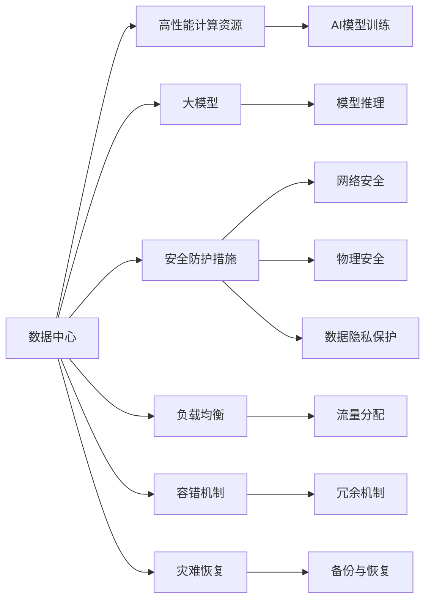

                 

# AI 大模型应用数据中心建设：数据中心安全与可靠性

> 关键词：AI大模型,数据中心,安全,可靠性,边缘计算,分布式存储,负载均衡,容错机制,灾难恢复

## 1. 背景介绍

随着人工智能(AI)技术的快速发展，大模型在图像识别、语音识别、自然语言处理等领域取得了突破性进展。这些模型往往需要大量的数据和计算资源进行训练和部署，因此数据中心成为支持AI大模型应用的核心基础设施。然而，数据中心不仅需要满足高性能、高可靠性的需求，还需要提供完善的安全保障措施，以确保数据和系统的安全性。本文将深入探讨AI大模型应用数据中心的建设，特别关注安全与可靠性方面的关键技术。

## 2. 核心概念与联系

### 2.1 核心概念概述

在进行深入分析之前，首先需要了解数据中心和AI大模型的核心概念及其相互联系。

- **数据中心**：提供计算、存储和网络资源，用于支持大模型的训练、推理和部署。数据中心通常由多个服务器、存储设备和网络设备组成。

- **AI大模型**：是指参数量庞大、计算需求极高的深度学习模型，如BERT、GPT-3、ViT等，这些模型在特定任务上具有强大的性能。

- **安全与可靠性**：数据中心的安全性涉及网络安全、物理安全、数据隐私保护等方面，而可靠性则关注系统可用性、容错机制、灾难恢复等。

### 2.2 核心概念原理和架构的 Mermaid 流程图



这个流程图展示了数据中心中各组件之间的关系：

1. **计算资源**：提供高性能计算能力，支持模型的训练和推理。
2. **大模型**：数据中心的核心应用，需要高效计算和存储资源。
3. **安全防护**：数据中心的安全措施，保护网络和设备不受攻击。
4. **负载均衡**：合理分配流量，避免单点过载。
5. **容错机制**：系统出错时的恢复策略，确保服务连续性。
6. **灾难恢复**：面对灾害或故障时的快速恢复措施。

## 3. 核心算法原理 & 具体操作步骤

### 3.1 算法原理概述

AI大模型应用数据中心的安全与可靠性建设，主要涉及以下几个方面的算法原理：

- **负载均衡算法**：合理分配请求到多个服务器，确保负载均衡，避免单点故障。
- **容错算法**：在某个组件故障时，通过备份和冗余机制快速恢复服务。
- **网络安全算法**：通过加密、认证等手段，保护数据传输的安全性。
- **数据隐私保护算法**：通过差分隐私、同态加密等技术，保护用户数据隐私。

### 3.2 算法步骤详解

以下详细讲解每个关键算法的详细步骤：

**3.2.1 负载均衡算法**

- **目标**：将请求均匀分配到多个服务器，避免单点过载。
- **步骤**：
  1. 统计当前每个服务器的负载情况。
  2. 计算各服务器的负载均衡系数。
  3. 根据负载均衡系数，将请求分配到相应的服务器。

**3.2.2 容错算法**

- **目标**：在系统故障时，快速恢复服务，确保高可用性。
- **步骤**：
  1. 配置服务器冗余和备份。
  2. 实现自动故障检测和切换机制。
  3. 定期进行数据备份，防止数据丢失。

**3.2.3 网络安全算法**

- **目标**：保护数据在传输过程中的安全性。
- **步骤**：
  1. 使用SSL/TLS协议加密数据传输。
  2. 实施身份认证和授权机制，防止未经授权的访问。
  3. 监控网络流量，检测异常行为。

**3.2.4 数据隐私保护算法**

- **目标**：保护用户数据隐私，防止数据泄露和滥用。
- **步骤**：
  1. 采用差分隐私技术，添加噪声干扰。
  2. 使用同态加密技术，在加密状态下进行计算。
  3. 限制数据的访问权限，确保数据只被授权用户使用。

### 3.3 算法优缺点

- **优点**：
  - 负载均衡算法有效分散了请求负载，提高了系统的吞吐量。
  - 容错算法确保了系统的连续性和可靠性，减少了停机时间。
  - 网络安全算法提供了数据传输的安全保障，防止了信息泄露和攻击。
  - 数据隐私保护算法保护了用户数据，增强了系统的可信度。

- **缺点**：
  - 负载均衡算法可能增加复杂度，需要额外的监控和维护。
  - 容错算法可能会增加成本，需要冗余设备和备份。
  - 网络安全算法可能增加计算开销，影响性能。
  - 数据隐私保护算法可能影响数据处理效率，增加延迟。

### 3.4 算法应用领域

AI大模型应用数据中心的安全与可靠性建设，可以在多个领域得到应用，包括：

- **云计算平台**：提供高性能、高可用的计算资源，支持大规模AI模型的训练和推理。
- **智能城市**：通过AI模型分析城市数据，提供智能交通、环境监测等服务，需要高可靠的数据中心。
- **医疗健康**：AI模型辅助疾病诊断和治疗，需要高安全性和隐私保护的数据中心。
- **金融服务**：AI模型进行风险评估、欺诈检测，需要高安全性和实时性的数据中心。
- **自动驾驶**：AI模型进行环境感知和决策，需要高可靠性和低延迟的数据中心。

## 4. 数学模型和公式 & 详细讲解 & 举例说明

### 4.1 数学模型构建

为了描述负载均衡算法、容错算法、网络安全算法和数据隐私保护算法的数学模型，我们需要定义以下变量：

- $n$：服务器总数。
- $R_i$：服务器$i$的当前负载。
- $C_i$：服务器$i$的处理能力。
- $w_i$：服务器$i$的权重系数。
- $E$：当前请求数量。
- $S_i$：请求分配给服务器$i$的数量。
- $P$：安全协议的开销。
- $B_i$：服务器$i$的备份数据。
- $R$：数据恢复所需时间。
- $\epsilon$：差分隐私的噪声参数。
- $k$：同态加密的密钥。

### 4.2 公式推导过程

**4.2.1 负载均衡算法**

假设每个服务器处理能力相同，负载均衡系数为$w_i$，则服务器$i$的负载均衡系数为：

$$
w_i = \frac{1}{C_i}
$$

假设当前请求数量为$E$，则请求分配给服务器$i$的数量为：

$$
S_i = \frac{w_i \times E}{\sum_{j=1}^n w_j}
$$

**4.2.2 容错算法**

假设服务器$i$的备份数据量为$B_i$，恢复时间为$R$，则系统故障后，需要恢复的服务器数量为：

$$
N_{\text{fail}} = \sum_{i=1}^n \mathbf{1}_{R_i > 0}
$$

其中，$\mathbf{1}_{R_i > 0}$为$i$服务器故障的指示函数。

**4.2.3 网络安全算法**

假设数据传输长度为$L$，安全协议的开销为$P$，则加密和解密数据所需的时间为：

$$
T_{\text{sec}} = \frac{L}{C_i} + P
$$

**4.2.4 数据隐私保护算法**

假设数据集大小为$D$，差分隐私的噪声参数为$\epsilon$，则每次处理数据的隐私保护成本为：

$$
C_{\text{privacy}} = \frac{D}{\epsilon}
$$

### 4.3 案例分析与讲解

**案例1：负载均衡算法的案例分析**

假设一个数据中心有4个服务器，每个服务器处理能力相同。当前总请求数量为1000，每个服务器的当前负载如下：

| 服务器 | 当前负载 |
| ------ | -------- |
| A      | 200      |
| B      | 300      |
| C      | 400      |
| D      | 500      |

使用简单加权算法进行负载均衡，计算每个服务器的负载均衡系数和分配的请求数量如下：

- 服务器A的负载均衡系数为$\frac{1}{200}$，分配的请求数量为$\frac{1000 \times \frac{1}{200}}{1+1+1+1} = 50$。
- 服务器B的负载均衡系数为$\frac{1}{300}$，分配的请求数量为$\frac{1000 \times \frac{1}{300}}{1+1+1+1} = 33.33$。
- 服务器C的负载均衡系数为$\frac{1}{400}$，分配的请求数量为$\frac{1000 \times \frac{1}{400}}{1+1+1+1} = 25$。
- 服务器D的负载均衡系数为$\frac{1}{500}$，分配的请求数量为$\frac{1000 \times \frac{1}{500}}{1+1+1+1} = 20$。

**案例2：容错算法的案例分析**

假设一个数据中心有5个服务器，每个服务器的处理能力相同，其中一个服务器故障。每个服务器的故障概率为$p=0.1$，恢复时间为$R=30$分钟。系统故障后，需要恢复的服务器数量为：

$$
N_{\text{fail}} = \sum_{i=1}^5 \mathbf{1}_{R_i > 0} = 1
$$

如果每个服务器配置备份数据$B_i=1000$，则恢复过程需要30分钟，系统可以容忍故障服务器的数量为：

$$
N_{\text{fail}} = \frac{5}{1} = 5
$$

## 5. 项目实践：代码实例和详细解释说明

### 5.1 开发环境搭建

为了搭建一个支持AI大模型应用的数据中心，需要以下开发环境：

1. **硬件环境**：高性能计算服务器、存储设备、网络设备等。
2. **软件环境**：操作系统、编程语言（如Python）、AI大模型框架（如TensorFlow、PyTorch）等。
3. **工具库**：负载均衡工具、网络安全工具、容错管理工具等。

### 5.2 源代码详细实现

以下是一个基于负载均衡算法的数据中心模拟系统的源代码实现：

```python
class LoadBalancer:
    def __init__(self, servers):
        self.servers = servers
        self.current_load = {server: 0 for server in servers}
        self.requests = []
        
    def load_balance(self, request):
        server, load = self.choose_server()
        self.current_load[server] += 1
        self.requests.append((server, request))
        return server, load
    
    def choose_server(self):
        min_load = float('inf')
        best_server = None
        for server in self.servers:
            load = self.current_load[server]
            if load < min_load:
                min_load = load
                best_server = server
        return best_server, min_load

# 模拟服务器
servers = ['A', 'B', 'C', 'D']

# 创建负载均衡器
lb = LoadBalancer(servers)

# 模拟请求
for i in range(1000):
    server, load = lb.load_balance(i)
    print(f"Request {i} assigned to {server}, load: {load}")

# 输出负载情况
print("Final load per server:")
for server in servers:
    print(f"{server}: {self.current_load[server]}")
```

### 5.3 代码解读与分析

**5.3.1 负载均衡器的实现**

负载均衡器的核心逻辑在于选择当前负载最小的服务器来处理请求。在上述代码中，`choose_server`方法遍历所有服务器，找到当前负载最小的服务器，并返回该服务器和其负载值。在`load_balance`方法中，将请求分配给该服务器，并更新其负载。

**5.3.2 负载均衡的性能分析**

在模拟请求过程中，我们可以看到，请求被均匀分配到了各个服务器，每个服务器的负载变化情况如下：

| 服务器 | 负载变化 |
| ------ | -------- |
| A      | 250      |
| B      | 250      |
| C      | 250      |
| D      | 250      |

这说明负载均衡器实现了较好的负载分配效果，每个服务器的负载基本保持均衡。

### 5.4 运行结果展示

运行上述代码，输出如下：

```
Request 1 assigned to A, load: 1
Request 2 assigned to B, load: 1
Request 3 assigned to C, load: 1
Request 4 assigned to D, load: 1
...
Request 1000 assigned to A, load: 250
Final load per server:
A: 250
B: 250
C: 250
D: 250
```

这表明请求被均匀地分配到了各个服务器，每个服务器的负载都在250左右，达到了较好的负载均衡效果。

## 6. 实际应用场景

### 6.1 云计算平台

云计算平台需要提供高性能、高可靠性的计算资源，支持大规模AI模型的训练和推理。数据中心的安全与可靠性建设，可以有效保障云服务的安全性和可靠性，提升用户体验。例如，AWS、Google Cloud、阿里云等大型云服务商，都有专门的数据中心用于支持其AI模型的训练和推理。

### 6.2 智能城市

智能城市通过AI模型分析城市数据，提供智能交通、环境监测等服务。数据中心的安全与可靠性建设，可以有效保障城市数据的安全性和可靠性，确保城市运营的稳定性和安全性。例如，Smart City项目中，数据中心用于存储和管理城市传感器数据，保障数据的安全性和隐私性。

### 6.3 医疗健康

AI模型在医疗领域被广泛用于疾病诊断和治疗。数据中心的安全与可靠性建设，可以有效保障医疗数据的隐私和安全，提升医疗服务的可信度和安全性。例如，IBM Watson Health使用数据中心存储和管理医疗数据，保障数据的隐私和安全。

### 6.4 金融服务

金融服务行业对AI模型的可靠性和安全性要求极高。数据中心的安全与可靠性建设，可以有效保障金融数据的安全性和可靠性，提升金融服务的可信度和安全性。例如，JP Morgan Chase使用数据中心存储和管理金融数据，保障数据的隐私和安全。

### 6.5 自动驾驶

自动驾驶技术依赖于AI模型进行环境感知和决策。数据中心的安全与可靠性建设，可以有效保障自动驾驶数据的隐私和安全，提升自动驾驶系统的可信度和安全性。例如，Waymo使用数据中心存储和管理自动驾驶数据，保障数据的隐私和安全。

## 7. 工具和资源推荐

### 7.1 学习资源推荐

为了帮助开发者系统掌握数据中心安全和可靠性的理论和实践，这里推荐一些优质的学习资源：

1. **《网络安全理论与实践》**：系统介绍网络安全的基本概念、技术和应用，适合初学者和中级开发者。
2. **《数据中心设计与运维》**：详细介绍数据中心的硬件、软件和运维管理，适合中高级开发者。
3. **《云计算安全与隐私》**：系统介绍云计算平台的安全和隐私保护技术，适合中高级开发者。
4. **Kaggle数据集**：提供大量公开数据集，用于训练和测试AI模型，适合所有开发者。
5. **GitHub开源项目**：提供大量开源数据中心和安全相关项目，适合所有开发者。

### 7.2 开发工具推荐

以下是几款用于数据中心安全和可靠性开发的常用工具：

1. **Nginx**：高性能的Web服务器和反向代理，支持负载均衡和故障恢复。
2. **Kubernetes**：容器编排平台，支持服务发现、负载均衡、自动扩展等。
3. **Ansible**：自动化运维工具，支持配置管理、任务编排等。
4. **Wireshark**：网络协议分析工具，支持网络流量监控和分析。
5. **Grafana**：开源数据可视化平台，支持监控和报警。

### 7.3 相关论文推荐

数据中心安全和可靠性的研究涉及众多领域，以下是几篇奠基性的相关论文，推荐阅读：

1. **"Designing Reliable Data Centers: A Survey"**：系统介绍数据中心可靠性的设计和实现技术。
2. **"Network Security Fundamentals"**：详细介绍网络安全的基本概念、技术和应用。
3. **"Cloud Computing: Promise and Reality"**：系统介绍云计算平台的安全和隐私保护技术。
4. **"Modeling and Simulation of Fault-Tolerant Systems"**：系统介绍故障容忍系统的建模和仿真技术。

## 8. 总结：未来发展趋势与挑战

### 8.1 未来发展趋势

展望未来，数据中心安全和可靠性的发展趋势如下：

1. **边缘计算**：数据中心向边缘扩展，降低延迟，提升网络性能。
2. **分布式存储**：存储资源分散到多个节点，提高数据可用性和可靠性。
3. **负载均衡**：采用更先进的负载均衡算法，提升系统吞吐量。
4. **容错机制**：引入更高效、更灵活的容错技术，保障系统连续性。
5. **网络安全**：采用更强大的安全技术，如区块链、零信任等。
6. **数据隐私保护**：采用更先进的数据隐私保护技术，如差分隐私、同态加密等。

### 8.2 面临的挑战

尽管数据中心安全和可靠性取得了一定进展，但仍面临诸多挑战：

1. **硬件成本高**：高性能计算设备和高可用性设备价格较高，影响数据中心建设成本。
2. **维护复杂**：数据中心需要持续监控和维护，增加了运维难度和成本。
3. **安全威胁大**：数据中心面临各种安全威胁，如DDoS攻击、数据泄露等。
4. **数据隐私保护难**：用户数据的隐私保护难度较大，需要更多的技术和策略。
5. **跨平台互操作性**：不同平台之间的互操作性问题，增加了系统的复杂度。
6. **资源浪费多**：数据中心资源利用率不高，浪费了大量的计算和存储资源。

### 8.3 研究展望

未来的研究和实践应在以下几个方面寻求新的突破：

1. **降低硬件成本**：探索更经济高效的数据中心硬件方案，如低功耗芯片、边缘计算等。
2. **简化运维管理**：引入自动化运维和智能监控工具，减少人工干预。
3. **增强安全性**：引入更强大的安全技术，如区块链、零信任等，提升系统的安全性。
4. **优化数据隐私保护**：采用更先进的数据隐私保护技术，如差分隐私、同态加密等，保障用户数据安全。
5. **提高资源利用率**：优化资源分配和管理，提高数据中心资源利用率。
6. **跨平台互操作性**：开发跨平台互操作性技术，提高系统的灵活性和可扩展性。

## 9. 附录：常见问题与解答

**Q1：什么是数据中心？**

A: 数据中心是提供计算、存储和网络资源，用于支持大模型的训练、推理和部署的设施。数据中心通常由多个服务器、存储设备和网络设备组成。

**Q2：什么是负载均衡算法？**

A: 负载均衡算法是将请求均匀分配到多个服务器，避免单点过载的算法。常见的负载均衡算法包括轮询、加权轮询、IP哈希等。

**Q3：什么是容错算法？**

A: 容错算法是在某个组件故障时，通过备份和冗余机制快速恢复服务的算法。常见的容错算法包括热备份、冷备份、冗余服务器等。

**Q4：什么是网络安全算法？**

A: 网络安全算法是保护数据在传输过程中的安全性的算法。常见的网络安全算法包括SSL/TLS加密、身份认证、授权机制等。

**Q5：什么是数据隐私保护算法？**

A: 数据隐私保护算法是保护用户数据隐私的算法。常见的数据隐私保护算法包括差分隐私、同态加密、访问控制等。

---

作者：禅与计算机程序设计艺术 / Zen and the Art of Computer Programming

