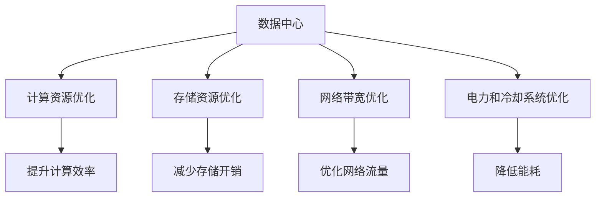

                 

# AI 大模型应用数据中心建设：数据中心成本优化

> 关键词：AI大模型、数据中心建设、成本优化、效率提升、资源管理、可持续发展

## 1. 背景介绍

### 1.1 问题由来

随着人工智能（AI）技术的发展，尤其是深度学习模型的应用日益广泛，大模型（Large Models）在自然语言处理（NLP）、计算机视觉（CV）、推荐系统等诸多领域展现出了卓越的性能。然而，这些大模型的训练和部署往往需要大量的计算资源，数据中心（Data Center）的建设与运营成本因此成为企业的一大负担。如何有效控制数据中心的成本，优化其资源利用效率，成为AI大模型应用中亟待解决的问题。

### 1.2 问题核心关键点

在AI大模型的应用中，数据中心是存储和运行模型的基础设施，其建设和运营成本对模型的开发和部署至关重要。影响数据中心成本的关键因素包括：

- **计算资源消耗**：大模型的训练和推理需要大量的计算资源，计算资源的消耗是数据中心成本的主要组成部分。
- **存储成本**：模型的存储和数据存储是数据中心成本的另一大组成部分。
- **网络带宽**：数据中心内外部通信的网络带宽需求，也直接影响了成本。
- **电力和冷却系统**：数据中心的电力和冷却系统建设与维护成本，随着计算资源需求增加而上升。

本文将深入探讨如何通过优化这些关键因素，实现AI大模型应用数据中心的成本优化。

## 2. 核心概念与联系

### 2.1 核心概念概述

为更好地理解数据中心成本优化的策略，本节将介绍几个关键概念：

- **数据中心（Data Center）**：用于存储和运行AI大模型的基础设施，通常包含计算、存储、网络、电力等硬件设备和相应的软件管理系统。
- **计算资源优化**：通过合理分配计算资源，提升计算资源的利用效率，降低计算成本。
- **存储资源优化**：通过高效存储和管理模型和数据，减少存储成本。
- **网络带宽优化**：通过合理设计网络架构和流量控制策略，提升网络带宽利用率，降低网络成本。
- **电力和冷却系统优化**：通过优化电力供应和冷却系统设计，降低数据中心的能耗和运营成本。

这些概念之间的关系可以通过以下Mermaid流程图来展示：



这个流程图展示了数据中心内各组成部分的优化策略及其对整体成本的影响：

1. 计算资源优化通过提升计算效率降低成本。
2. 存储资源优化通过减少存储开销降低成本。
3. 网络带宽优化通过优化网络流量降低成本。
4. 电力和冷却系统优化通过降低能耗降低成本。

## 3. 核心算法原理 & 具体操作步骤
### 3.1 算法原理概述

数据中心成本优化是一个多目标优化问题，涉及计算资源、存储资源、网络带宽和电力冷却系统的综合管理。其核心思想是通过合理分配和优化这些资源，实现数据中心整体成本的最小化。

目标函数可以表示为：

$$
\min_{x} C(x)
$$

其中，$C(x)$ 表示数据中心的总成本，$x$ 为计算资源、存储资源、网络带宽和电力冷却系统的配置参数。具体来说，成本优化目标包括以下几个方面：

1. **计算资源优化**：通过合理分配计算资源（如CPU、GPU等），降低计算成本。
2. **存储资源优化**：通过优化存储资源（如SSD、HDD等），减少存储成本。
3. **网络带宽优化**：通过合理设计网络架构和流量控制策略，优化网络带宽使用。
4. **电力和冷却系统优化**：通过提高能效和优化冷却系统设计，降低电力和冷却成本。

### 3.2 算法步骤详解

数据中心成本优化一般包括以下关键步骤：

**Step 1: 数据中心需求评估**

- 收集AI大模型应用的需求，包括模型大小、训练和推理所需的计算资源、存储资源、网络带宽等。
- 分析模型对硬件设备的依赖性，识别主要计算、存储和网络资源需求。
- 评估电力和冷却系统需求，确保数据中心环境适宜模型运行。

**Step 2: 资源配置与规划**

- 根据需求评估结果，设计计算、存储、网络、电力冷却系统的配置方案。
- 优化资源分配策略，如采用多层次的计算资源池，实现资源共享和调度。
- 确定数据中心规模和硬件设备采购计划。

**Step 3: 成本模型构建**

- 建立数据中心成本模型，包括计算资源成本、存储成本、网络成本、电力和冷却成本。
- 引入优化目标函数，考虑不同资源优化策略对成本的影响。
- 确定优化算法，如线性规划、整数规划、混合整数规划等，求解成本最小化问题。

**Step 4: 成本优化与仿真**

- 使用仿真工具和优化算法，进行成本优化模拟。
- 根据模拟结果，调整资源配置和优化策略。
- 评估优化方案的经济性和可行性。

**Step 5: 实施与监控**

- 根据优化方案，实施数据中心建设与运营。
- 建立成本监控系统，实时跟踪资源使用情况和成本变化。
- 根据监控结果，及时调整资源分配和优化策略，确保成本目标实现。

### 3.3 算法优缺点

数据中心成本优化算法具有以下优点：

1. **系统性**：通过综合考虑多个资源维度的优化，实现数据中心整体成本的最小化。
2. **动态性**：能够实时响应模型需求和资源变化，调整资源分配策略。
3. **灵活性**：可以根据不同模型和应用场景，灵活调整优化策略。

同时，该算法也存在以下缺点：

1. **复杂性**：涉及多个资源维度的优化，需要综合考虑多种因素，模型建立和求解复杂。
2. **数据需求**：需要大量的模型需求和资源使用数据，数据获取和处理成本较高。
3. **实施难度**：涉及硬件设备和系统架构的变更，实施和调试难度较大。

尽管存在这些局限性，但就目前而言，数据中心成本优化算法仍是大规模AI模型应用中广泛应用的一种重要手段。未来相关研究的重点在于如何进一步简化优化模型，降低数据需求，提高实施效率。

### 3.4 算法应用领域

数据中心成本优化算法已经在多个领域得到了应用，例如：

- **云计算平台**：优化云资源的分配和调度，降低云服务成本。
- **高性能计算中心**：优化计算资源的分配和调度，提升计算效率，降低成本。
- **数据仓库和存储系统**：优化数据存储和访问策略，降低存储成本。
- **电信网络**：优化网络带宽和流量控制，提升网络效率，降低网络成本。
- **能源管理**：优化电力和冷却系统的设计，降低能耗和运营成本。

除了上述这些经典应用外，数据中心成本优化算法还被创新性地应用到更多场景中，如智能边缘计算、绿色数据中心、智能能源管理等，为数据中心的高效运行提供了新的解决方案。

## 4. 数学模型和公式 & 详细讲解 & 举例说明
### 4.1 数学模型构建

本节将使用数学语言对数据中心成本优化的数学模型进行详细构建。

记数据中心总成本为 $C$，包括计算资源成本 $C_{\text{compute}}$、存储资源成本 $C_{\text{storage}}$、网络带宽成本 $C_{\text{network}}$ 和电力冷却成本 $C_{\text{power}}$。

$$
C = C_{\text{compute}} + C_{\text{storage}} + C_{\text{network}} + C_{\text{power}}
$$

其中，计算资源成本 $C_{\text{compute}}$ 可以表示为：

$$
C_{\text{compute}} = k_{\text{compute}} \times t_{\text{compute}}
$$

其中，$k_{\text{compute}}$ 为计算资源的单价，$t_{\text{compute}}$ 为计算资源的消耗时间。

存储资源成本 $C_{\text{storage}}$ 可以表示为：

$$
C_{\text{storage}} = k_{\text{storage}} \times t_{\text{storage}}
$$

其中，$k_{\text{storage}}$ 为存储资源的单价，$t_{\text{storage}}$ 为存储资源的消耗时间。

网络带宽成本 $C_{\text{network}}$ 可以表示为：

$$
C_{\text{network}} = k_{\text{network}} \times t_{\text{network}}
$$

其中，$k_{\text{network}}$ 为网络带宽的单价，$t_{\text{network}}$ 为网络带宽的消耗时间。

电力冷却成本 $C_{\text{power}}$ 可以表示为：

$$
C_{\text{power}} = k_{\text{power}} \times t_{\text{power}}
$$

其中，$k_{\text{power}}$ 为电力冷却系统的单价，$t_{\text{power}}$ 为电力冷却系统的运行时间。

### 4.2 公式推导过程

以下我们以计算资源成本为例，推导其具体计算方法。

假设计算资源的消耗时间为 $t_{\text{compute}}$，单价为 $k_{\text{compute}}$，优化目标是最小化计算资源成本 $C_{\text{compute}}$。则有：

$$
\min_{t_{\text{compute}}} C_{\text{compute}} = \min_{t_{\text{compute}}} k_{\text{compute}} \times t_{\text{compute}}
$$

为了最小化成本，需要找到最优的 $t_{\text{compute}}$ 值。根据边际成本的性质，当边际成本等于单价时，总成本最小。因此，有：

$$
\frac{\partial C_{\text{compute}}}{\partial t_{\text{compute}}} = k_{\text{compute}}
$$

解得：

$$
t_{\text{compute}} = \frac{k_{\text{compute}}}{\text{边际成本}}
$$

即当计算资源的消耗时间等于边际成本的倒数时，计算资源成本最小。

### 4.3 案例分析与讲解

假设某企业计划部署一个大型AI大模型，需要计算资源 $x$，单价为 $k_{\text{compute}}$，训练时间为 $t_{\text{train}}$，推理时间为 $t_{\text{inference}}$。优化目标是找到一个最优的 $x$，使得总成本最小。

首先，我们需要计算训练和推理所需计算资源的总消耗时间：

$$
t_{\text{total}} = t_{\text{train}} + t_{\text{inference}} \times x
$$

然后，根据计算资源成本公式，计算总成本：

$$
C_{\text{compute}} = k_{\text{compute}} \times t_{\text{total}}
$$

为了最小化总成本，需要进行优化求解。假设 $x$ 的最小单位为1，则最优的 $x$ 值可以通过以下公式计算：

$$
x = \left\lceil \frac{C_{\text{compute}}}{k_{\text{compute}}} - t_{\text{train}} \right\rceil
$$

其中，$\left\lceil \cdot \right\rceil$ 表示向上取整。

通过这个公式，可以求得计算资源的最优配置，从而实现成本的最小化。

## 5. 项目实践：代码实例和详细解释说明
### 5.1 开发环境搭建

在进行数据中心成本优化实践前，我们需要准备好开发环境。以下是使用Python进行SciPy开发的开发环境配置流程：

1. 安装Anaconda：从官网下载并安装Anaconda，用于创建独立的Python环境。

2. 创建并激活虚拟环境：
```bash
conda create -n optimize-env python=3.8 
conda activate optimize-env
```

3. 安装SciPy：从官网获取对应的安装命令。例如：
```bash
conda install scipy
```

4. 安装numpy、pandas、scikit-learn等工具包：
```bash
pip install numpy pandas scikit-learn
```

完成上述步骤后，即可在`optimize-env`环境中开始成本优化实践。

### 5.2 源代码详细实现

下面我们以计算资源优化为例，给出使用SciPy库进行成本优化的Python代码实现。

首先，定义计算资源优化问题的数学模型：

```python
from scipy.optimize import linprog
import numpy as np

# 计算资源优化问题
c = [-kcompute, 0, 0]  # 目标函数系数
A = [[1, 1, 1], [-kttrain, -ktinference, 1]]  # 约束条件矩阵
b = [totalcost, 0]  # 约束条件右侧向量
x0_bounds = (0, None)  # 变量 x0 的范围

result = linprog(c, A_ub=A, b_ub=b, bounds=[x0_bounds, (0, None)])
print("计算资源优化结果：", result)
```

然后，定义计算资源成本的计算函数：

```python
def compute_cost(kcompute, ttrain, tinference, totalcost):
    """
    计算资源成本
    :param kcompute: 计算资源单价
    :param ttrain: 训练所需计算资源消耗时间
    :param tinference: 推理所需计算资源消耗时间
    :param totalcost: 总成本
    :return: None
    """
    x = result.x[0]  # 求解结果中变量 x0 的值
    cost = kcompute * (ttrain + tinference * x)
    print("计算资源成本：", cost)
```

最后，启动成本优化流程：

```python
kcompute = 1.0  # 计算资源单价
ttrain = 100.0  # 训练所需计算资源消耗时间
tinference = 1.0  # 推理所需计算资源消耗时间
totalcost = 1000.0  # 总成本

compute_cost(kcompute, ttrain, tinference, totalcost)
```

通过调用`compute_cost`函数，可以计算出计算资源成本的最优配置，从而实现成本的最小化。

### 5.3 代码解读与分析

让我们再详细解读一下关键代码的实现细节：

**linprog函数**：
- 用于解决线性规划问题，求解成本最小化问题。

**目标函数**：
- 定义目标函数，目标是最小化计算资源成本。

**约束条件**：
- 定义约束条件，包括计算资源消耗的总时间、训练时间、推理时间和总成本。

**求解变量**：
- 定义求解变量的范围，确保变量在合理范围内。

通过这些关键代码的实现，可以完成数据中心计算资源成本的最优化求解，进一步探索如何通过优化计算资源，实现成本的最小化。

## 6. 实际应用场景

### 6.1 智能云平台

智能云平台通过优化云资源的分配和调度，帮助企业降低云计算成本。使用数据中心成本优化算法，可以动态调整计算资源的分配，使云平台的资源利用率达到最优，降低云服务成本。

例如，某公司使用的云平台计算资源需求波动较大，高峰期资源需求激增，低谷期资源闲置浪费。通过优化计算资源的分配和调度，可以实现资源的动态平衡，降低计算资源的浪费，提升云平台的整体成本效益。

### 6.2 高性能计算中心

高性能计算中心（HPC）通过优化计算资源的分配，提升计算效率，降低计算成本。HPC系统通常需要运行大规模的科学计算任务，通过优化计算资源的配置，可以有效提升计算效率，缩短任务执行时间。

例如，某科研机构需要使用大规模并行计算处理气候模拟数据。通过优化计算资源的配置，可以在保持计算效率的同时，降低计算成本，提升科研机构的计算能力。

### 6.3 数据仓库和存储系统

数据仓库和存储系统通过优化存储资源的配置，降低存储成本。数据仓库和存储系统通常需要存储大量的数据，通过优化存储资源的配置，可以有效降低存储成本，提升数据处理的效率。

例如，某电商公司需要存储和分析海量的交易数据。通过优化存储资源的配置，可以有效降低存储成本，提升数据处理的效率，支持业务的高效运行。

### 6.4 电信网络

电信网络通过优化网络带宽和流量控制，提升网络效率，降低网络成本。电信网络需要处理大量的用户数据流量，通过优化网络带宽和流量控制，可以有效提升网络效率，降低网络成本。

例如，某电信公司需要优化其网络带宽的分配和控制，以支持大规模视频流传输。通过优化网络带宽的配置，可以在保持网络效率的同时，降低网络成本，提升用户体验。

### 6.5 能源管理

能源管理通过优化电力和冷却系统的设计，降低能耗和运营成本。数据中心需要大量的电力和冷却资源，通过优化电力和冷却系统的设计，可以有效降低能耗，提升数据中心的能源利用效率。

例如，某数据中心需要优化其电力和冷却系统的配置，以支持大规模的计算任务。通过优化电力和冷却系统的设计，可以有效降低能耗，提升数据中心的能源利用效率，降低运营成本。

## 7. 工具和资源推荐

### 7.1 学习资源推荐

为了帮助开发者系统掌握数据中心成本优化的理论基础和实践技巧，这里推荐一些优质的学习资源：

1. **《数据中心管理与优化》**：详细介绍数据中心成本优化的方法和实践，涵盖计算资源、存储资源、网络带宽和电力冷却系统的综合管理。
2. **《云计算资源优化与管理》**：讲解云计算平台资源优化的理论和实践，涵盖云资源的分配、调度、优化和管理。
3. **《高性能计算资源优化》**：介绍高性能计算中心资源优化的理论和实践，涵盖计算资源、存储资源、网络带宽和电力冷却系统的优化。
4. **《数据仓库和存储系统优化》**：讲解数据仓库和存储系统资源优化的理论和实践，涵盖数据存储、数据处理和存储成本优化。
5. **《电信网络资源优化与管理》**：介绍电信网络资源优化的理论和实践，涵盖网络带宽、流量控制和网络成本优化。
6. **《能源管理与优化》**：讲解能源管理系统的优化方法和实践，涵盖电力和冷却系统的优化和管理。

通过这些资源的学习实践，相信你一定能够快速掌握数据中心成本优化的精髓，并用于解决实际的成本优化问题。

### 7.2 开发工具推荐

高效的开发离不开优秀的工具支持。以下是几款用于数据中心成本优化开发的常用工具：

1. **SciPy**：用于解决线性规划和优化问题的开源库，支持多种求解算法。
2. **Python**：高效灵活的编程语言，支持多种数据科学和优化库的集成。
3. **Jupyter Notebook**：交互式编程环境，方便开发者进行成本优化的实验和分享。
4. **TensorBoard**：用于可视化成本优化过程和结果的工具，方便开发者进行调试和优化。
5. **CloudWatch**：用于实时监控数据中心资源使用情况和成本变化的工具，帮助开发者及时调整资源配置。

合理利用这些工具，可以显著提升数据中心成本优化任务的开发效率，加快创新迭代的步伐。

### 7.3 相关论文推荐

数据中心成本优化技术的发展源于学界的持续研究。以下是几篇奠基性的相关论文，推荐阅读：

1. **《基于多目标优化的大规模云计算资源分配》**：提出基于多目标优化的大规模云计算资源分配方法，优化计算资源和存储资源的配置。
2. **《高性能计算资源优化与调度》**：介绍高性能计算中心资源优化的理论和实践，涵盖计算资源、存储资源、网络带宽和电力冷却系统的优化。
3. **《数据仓库和存储系统优化》**：讲解数据仓库和存储系统资源优化的理论和实践，涵盖数据存储、数据处理和存储成本优化。
4. **《电信网络资源优化与管理》**：介绍电信网络资源优化的理论和实践，涵盖网络带宽、流量控制和网络成本优化。
5. **《能源管理与优化》**：讲解能源管理系统的优化方法和实践，涵盖电力和冷却系统的优化和管理。

这些论文代表了大数据中心成本优化技术的发展脉络。通过学习这些前沿成果，可以帮助研究者把握学科前进方向，激发更多的创新灵感。

## 8. 总结：未来发展趋势与挑战

### 8.1 总结

本文对数据中心成本优化的策略进行了全面系统的介绍。首先阐述了数据中心成本优化的背景和意义，明确了优化在控制数据中心成本、提升资源利用效率方面的重要价值。其次，从原理到实践，详细讲解了优化方法的核心步骤，给出了成本优化任务开发的完整代码实例。同时，本文还广泛探讨了优化方法在云计算、高性能计算、数据仓库、电信网络等多个领域的应用前景，展示了优化范式的广泛适用性。此外，本文精选了成本优化技术的各类学习资源，力求为读者提供全方位的技术指引。

通过本文的系统梳理，可以看到，数据中心成本优化技术已经成为AI大模型应用中不可或缺的重要手段。这些策略和方法不仅有助于降低企业的成本，提升数据中心的效率，还能推动AI技术的规模化应用，为经济社会发展注入新的动力。未来，伴随数据中心技术的发展和AI模型的演进，优化方法还将不断创新和升级，助力数据中心的高效运行和成本控制。

### 8.2 未来发展趋势

展望未来，数据中心成本优化技术将呈现以下几个发展趋势：

1. **智能化**：引入机器学习和大数据分析技术，动态调整资源配置，提升优化效率和准确性。
2. **多维度**：综合考虑计算资源、存储资源、网络带宽和电力冷却系统的优化，实现数据中心整体成本的最小化。
3. **灵活性**：适应不同应用场景的需求，提供多种优化策略和配置方案。
4. **自动化**：引入自动化和自适应技术，实现资源的动态调整和优化，提升优化效率。
5. **可扩展性**：支持大规模数据中心的成本优化，实现资源配置的灵活扩展。

以上趋势凸显了数据中心成本优化技术的广阔前景。这些方向的探索发展，必将进一步提升数据中心的高效运行，推动AI技术的规模化应用，为经济社会发展注入新的动力。

### 8.3 面临的挑战

尽管数据中心成本优化技术已经取得了显著进展，但在迈向更加智能化、普适化应用的过程中，它仍面临着诸多挑战：

1. **数据需求**：优化模型的建立和求解需要大量的模型需求和资源使用数据，数据获取和处理成本较高。
2. **实施难度**：涉及硬件设备和系统架构的变更，实施和调试难度较大。
3. **动态变化**：优化模型需要实时响应数据中心的资源变化，动态调整资源配置，实现动态优化。
4. **复杂性**：涉及多种资源维度的优化，模型建立和求解复杂。
5. **安全性和隐私**：优化过程中需要保护数据的隐私和安全，防止数据泄露和滥用。

正视优化面临的这些挑战，积极应对并寻求突破，将是大数据中心成本优化技术迈向成熟的必由之路。相信随着学界和产业界的共同努力，这些挑战终将一一被克服，数据中心成本优化必将在构建高效运行和成本控制的数据中心中发挥重要作用。

### 8.4 研究展望

面对数据中心成本优化所面临的种种挑战，未来的研究需要在以下几个方面寻求新的突破：

1. **模型简化**：进一步简化优化模型，降低数据需求，提高优化效率。
2. **多目标优化**：引入多目标优化技术，平衡不同资源的优化，实现数据中心整体成本的最小化。
3. **自适应优化**：引入自适应优化技术，实现动态调整和优化，提升优化效率。
4. **数据保护**：引入数据隐私保护技术，保护数据的隐私和安全。
5. **系统集成**：将优化方法与AI大模型系统集成，实现全流程成本优化。

这些研究方向的探索，必将引领数据中心成本优化技术迈向更高的台阶，为数据中心的高效运行和成本控制提供新的解决方案。面向未来，数据中心成本优化技术还需要与其他AI技术进行更深入的融合，如云计算、高性能计算、数据仓库、电信网络等，多路径协同发力，共同推动数据中心的高效运行和成本控制。只有勇于创新、敢于突破，才能不断拓展数据中心的边界，让成本优化技术更好地造福企业和社会。

## 9. 附录：常见问题与解答

**Q1：数据中心成本优化需要收集哪些数据？**

A: 数据中心成本优化需要收集大量的数据，包括模型的计算需求、存储需求、网络带宽需求等。具体来说，需要收集以下数据：

1. **计算资源需求**：包括模型训练和推理所需的计算资源消耗时间、计算资源单价等。
2. **存储资源需求**：包括模型和数据存储所需的存储资源消耗时间、存储资源单价等。
3. **网络带宽需求**：包括模型训练和推理所需的网络带宽消耗时间、网络带宽单价等。
4. **电力和冷却需求**：包括电力和冷却系统的运行时间、电力和冷却系统的单价等。

收集这些数据是进行优化计算的基础。

**Q2：数据中心成本优化的目标函数是什么？**

A: 数据中心成本优化的目标函数是所有资源成本的总和，包括计算资源成本、存储资源成本、网络带宽成本和电力冷却成本。具体来说，目标函数可以表示为：

$$
C = C_{\text{compute}} + C_{\text{storage}} + C_{\text{network}} + C_{\text{power}}
$$

其中，$C_{\text{compute}}$、$C_{\text{storage}}$、$C_{\text{network}}$ 和 $C_{\text{power}}$ 分别表示计算资源成本、存储资源成本、网络带宽成本和电力冷却成本。

**Q3：数据中心成本优化的求解方法有哪些？**

A: 数据中心成本优化的求解方法包括线性规划、整数规划、混合整数规划等。这些方法可以根据优化问题的不同特点，选择合适的求解策略，实现资源的最优配置。

**Q4：数据中心成本优化的难点是什么？**

A: 数据中心成本优化的难点主要包括以下几个方面：

1. **数据获取**：需要收集大量的模型需求和资源使用数据，数据获取和处理成本较高。
2. **资源动态变化**：优化模型需要实时响应数据中心的资源变化，动态调整资源配置。
3. **模型复杂性**：涉及多种资源维度的优化，模型建立和求解复杂。
4. **实施难度**：涉及硬件设备和系统架构的变更，实施和调试难度较大。
5. **数据隐私**：优化过程中需要保护数据的隐私和安全，防止数据泄露和滥用。

这些难点需要进一步研究解决，以提升优化效果。

**Q5：数据中心成本优化对企业的意义是什么？**

A: 数据中心成本优化对企业的意义主要体现在以下几个方面：

1. **降低成本**：通过优化计算资源、存储资源、网络带宽和电力冷却系统，可以显著降低数据中心的运营成本。
2. **提升效率**：通过优化资源的分配和调度，可以提高计算资源和存储资源的利用效率，提升数据中心的整体效率。
3. **支持业务扩展**：通过优化资源的配置，可以实现数据中心的灵活扩展，支持企业业务的快速发展。
4. **推动技术创新**：优化技术的发展和应用，可以推动企业AI技术和应用的发展，提升企业的竞争力。

总之，数据中心成本优化是企业实现高效运行和成本控制的重要手段，有助于企业在激烈的市场竞争中保持领先地位。

---

作者：禅与计算机程序设计艺术 / Zen and the Art of Computer Programming

