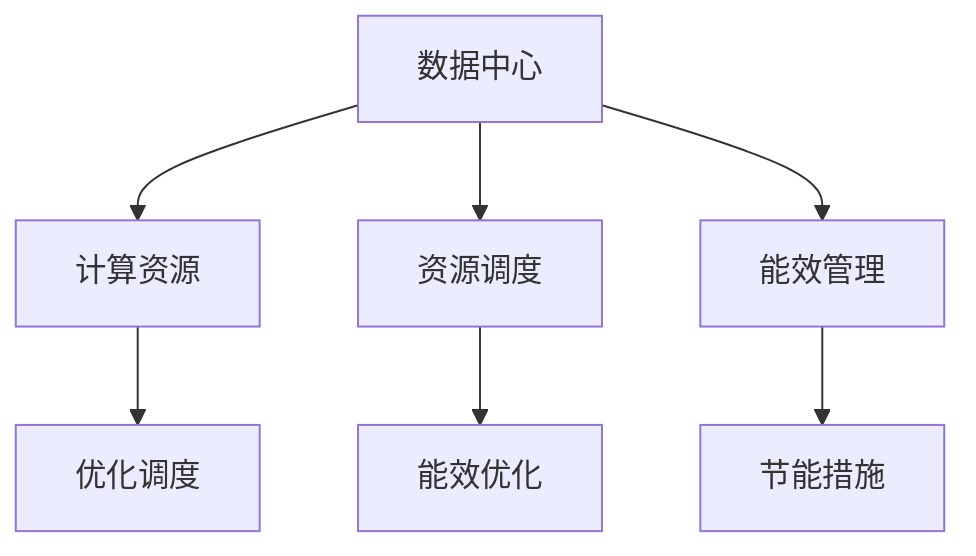

                 

# AI 大模型应用数据中心建设：数据中心成本优化

> 关键词：大模型,数据中心,成本优化,数据存储,计算资源,资源调度

## 1. 背景介绍

### 1.1 问题由来
随着人工智能技术的飞速发展，深度学习大模型在各个领域的应用变得越来越广泛。然而，大模型的训练和应用过程中，需要耗费大量计算资源和存储空间，这对数据中心的建设和管理提出了极高的要求。数据中心的建设和维护成本不断攀升，如何有效优化数据中心的成本，成为业界关注的焦点。

### 1.2 问题核心关键点
本文将探讨如何通过优化数据中心的建设和管理，有效降低AI大模型应用的成本。具体而言，本文将从数据存储、计算资源、资源调度和能效管理等几个方面进行详细讨论，为数据中心的成本优化提供切实可行的解决方案。

### 1.3 问题研究意义
数据中心的建设和维护成本直接关系到AI大模型应用的经济性和可扩展性。优化数据中心成本，不仅能降低企业运营成本，还能提升AI大模型的应用效率和性能。因此，本文的研究对推动AI大模型在各行业的广泛应用具有重要意义。

## 2. 核心概念与联系

### 2.1 核心概念概述

为更好地理解数据中心成本优化的技术手段，本节将介绍几个密切相关的核心概念：

- 数据中心(Data Center)：指集中存放和管理数据、计算资源的设施，通常包括服务器、网络设备、冷却系统等硬件设施。
- 计算资源(Computing Resources)：指数据中心中用于处理和存储数据的硬件设施，包括CPU、GPU、内存等。
- 资源调度(Resource Scheduling)：指如何合理分配和调度数据中心的计算资源，以最大化利用率，降低成本。
- 能效管理(Energy Management)：指通过优化数据中心硬件和软件的能效设计，降低能耗，同时保持系统性能。

这些核心概念之间的逻辑关系可以通过以下Mermaid流程图来展示：



这个流程图展示了大模型应用数据中心的核心概念及其之间的关系：

1. 数据中心提供计算资源，存储海量数据。
2. 资源调度确保计算资源的高效利用，降低资源闲置。
3. 能效管理通过优化硬件和软件设计，降低能耗，保持系统性能。
4. 资源调度和能效管理是数据中心成本优化的两个关键手段。

这些概念共同构成了大模型应用数据中心的建设和优化框架，为其经济高效运行提供了理论基础。

## 3. 核心算法原理 & 具体操作步骤

### 3.1 算法原理概述

数据中心成本优化涉及对计算资源和存储资源的合理分配和管理，以及如何通过节能措施降低能耗。其主要算法原理包括：

- **资源调度和负载均衡**：通过动态调整计算资源，平衡不同任务的工作负载，避免资源闲置和过度负荷。
- **存储层次设计**：通过分层存储策略，将数据按照访问频率和重要性分层存储，提高数据访问速度，降低存储成本。
- **能效优化**：通过硬件和软件设计，优化计算和存储设备的能效，减少能耗，延长设备寿命。

### 3.2 算法步骤详解

1. **数据存储优化**
   - 分层存储策略：将数据按访问频率和重要性分为热数据、温数据和冷数据，采用不同存储介质和访问策略。
   - 数据压缩与去重：使用数据压缩和去重技术，减小存储量，提高存储效率。
   - 分布式文件系统：采用分布式文件系统，如Hadoop HDFS，实现数据的分布式存储和高效访问。

2. **计算资源优化**
   - 资源池化：将所有计算资源统一管理，通过资源池化技术实现资源的灵活分配。
   - 弹性计算：采用弹性计算资源，根据任务需求动态调整计算资源，避免资源浪费。
   - 异构计算：采用异构计算架构，结合CPU、GPU、FPGA等不同计算资源，提升计算效率。

3. **资源调度优化**
   - 任务调度算法：采用先进调度算法，如Kubernetes、Docker Swarm等，实现任务的自动分配和调度。
   - 负载均衡策略：通过负载均衡技术，确保计算资源的均衡分配，避免资源瓶颈。
   - 任务分片与批处理：将大任务拆分为小任务，采用批处理技术，提高任务处理的效率和可靠性。

4. **能效优化**
   - 硬件设计优化：采用高效散热、低功耗的硬件设计，降低能耗。
   - 软件优化：优化计算和存储软件的能效，如采用深度学习和稀疏矩阵优化算法，降低计算过程中的能耗。
   - 节能措施：采用可再生能源和自然冷却技术，如风冷、水冷、自然冷却等，降低数据中心的能耗。

### 3.3 算法优缺点

资源调度和能效管理的数据中心成本优化方法具有以下优点：

- 提高资源利用率：通过动态资源调度和负载均衡，最大化利用计算资源，减少资源浪费。
- 降低存储成本：采用分层存储策略和数据压缩技术，有效降低存储成本。
- 降低能耗：通过硬件设计和软件优化，降低计算和存储过程的能耗，延长设备寿命。

同时，该方法也存在一些缺点：

- 初始投资成本高：构建先进的数据中心硬件设施和软件系统需要较高的初始投资成本。
- 技术复杂度高：资源调度和能效管理涉及复杂的技术栈，对数据中心的运维人员提出了较高要求。
- 适用范围有限：一些资源密集型任务，如高并发的数据处理、大数据分析等，可能需要更高效的计算资源，现有优化方法可能无法完全满足需求。

尽管存在这些局限性，但就目前而言，资源调度和能效管理仍是数据中心成本优化的主流范式。未来相关研究的重点在于如何进一步降低初始投资成本，简化技术栈，提高自动化运维水平，同时兼顾高性能和低成本。

### 3.4 算法应用领域

数据中心成本优化方法在AI大模型应用领域已经得到了广泛的应用，覆盖了几乎所有常见应用，例如：

- 深度学习训练：优化数据存储和计算资源，提升深度学习模型的训练效率和性能。
- 大规模数据分析：通过分层存储和弹性计算，支持大规模数据集的存储和处理，提升数据处理的效率和可靠性。
- 云计算服务：优化计算资源和能效设计，降低云服务的运营成本，提升服务质量。
- 智能应用部署：优化资源调度和负载均衡，支持智能应用的高可用性和扩展性。

除了上述这些经典应用外，数据中心成本优化还被创新性地应用到更多场景中，如可再生能源的应用、数据中心的跨地域部署等，为AI大模型的应用提供了更广阔的空间。随着数据中心技术的发展和优化方法的不断进步，相信AI大模型应用的数据中心建设将更加高效、经济。

## 4. 数学模型和公式 & 详细讲解  
### 4.1 数学模型构建

本节将使用数学语言对数据中心成本优化的主要数学模型进行更加严格的刻画。

假设数据中心中有$n$个计算节点，每个节点的计算资源为$m$，能效为$e$。计算任务需要分配到$k$个任务节点上，每个任务节点的负载为$l$，则系统的计算能力为：

$$
C = n \times m \times k \times l
$$

计算节点和任务节点的能效分别为$e_1$和$e_2$，则系统的总能耗为：

$$
E = n \times e \times k \times l
$$

优化目标是在给定计算资源和能效约束下，最小化总成本$C + E$。具体来说，优化模型可以表示为：

$$
\min \quad C + E
$$

$$
s.t. \quad C = n \times m \times k \times l
$$
$$
\quad E = n \times e \times k \times l
$$

在上述优化模型中，$C$和$E$分别代表计算成本和能耗成本。通过优化这两个指标，可以最大化利用计算资源，降低数据中心的运营成本。

### 4.2 公式推导过程

以下我们以弹性计算资源优化为例，推导弹性资源分配的数学公式。

假设数据中心有$n$个计算节点，每个节点的计算资源为$m$，能效为$e$。系统需要分配到$k$个任务节点上，每个任务节点的负载为$l$。为了最大化利用计算资源，可以采用弹性计算资源，即根据任务需求动态调整计算资源。具体地，设每个节点的计算资源分配比例为$\alpha$，则每个节点的实际计算资源为$\alpha \times m$。系统实际计算能力为：

$$
C = n \times (\alpha \times m) \times k \times l
$$

系统实际能耗为：

$$
E = n \times e \times k \times l
$$

优化目标为最小化总成本$C + E$，即：

$$
\min \quad C + E
$$

$$
s.t. \quad C = n \times (\alpha \times m) \times k \times l
$$
$$
\quad E = n \times e \times k \times l
$$

通过拉格朗日乘数法，引入拉格朗日乘子$\lambda$和$\mu$，构造拉格朗日函数：

$$
L(\alpha, \lambda, \mu) = C + E + \lambda (C - n \times (\alpha \times m) \times k \times l) + \mu (E - n \times e \times k \times l)
$$

对$\alpha$求导，得：

$$
\frac{\partial L}{\partial \alpha} = n \times m \times k \times l - \lambda \times m \times k \times l = 0
$$

解得：

$$
\alpha = \frac{\lambda}{n \times m \times k \times l}
$$

将$\alpha$代入$C$和$E$的表达式中，得：

$$
C = n \times m \times k \times l \times \frac{\lambda}{n \times m \times k \times l} = \lambda
$$

$$
E = n \times e \times k \times l \times \frac{\lambda}{n \times m \times k \times l}
$$

由$\lambda$的取值，得：

$$
\lambda = C = n \times m \times k \times l
$$

$$
E = n \times e \times k \times l \times \frac{C}{n \times m \times k \times l}
$$

$$
E = e \times C
$$

通过上述推导，可以看到，通过弹性计算资源优化，可以最大化利用计算资源，同时最小化能耗，从而降低数据中心的运营成本。

### 4.3 案例分析与讲解

以谷歌云平台(Google Cloud Platform, GCP)为例，其在大模型应用数据中心建设方面的优化措施包括：

1. 采用Google Compute Engine和Kubernetes容器编排技术，实现计算资源的弹性扩展和调度。
2. 通过分层存储策略，将数据分为热数据、温数据和冷数据，采用不同的存储介质和访问策略，降低存储成本。
3. 采用自然冷却和水冷等技术，优化数据中心的能效设计，降低能耗。
4. 通过机器学习和数据分析，动态调整计算资源的分配，最大化利用资源，降低成本。

通过上述措施，谷歌云平台实现了高性价比的数据中心建设，支持了大模型在云计算环境中的高效应用。

## 5. 项目实践：代码实例和详细解释说明
### 5.1 开发环境搭建

在进行数据中心成本优化实践前，我们需要准备好开发环境。以下是使用Python进行TensorFlow和Kubernetes开发的环境配置流程：

1. 安装Anaconda：从官网下载并安装Anaconda，用于创建独立的Python环境。

2. 创建并激活虚拟环境：
```bash
conda create -n tf-env python=3.8 
conda activate tf-env
```

3. 安装TensorFlow和Kubernetes：
```bash
pip install tensorflow==2.8.0
kubectl install kube-amd65
```

4. 安装各类工具包：
```bash
pip install numpy pandas scikit-learn matplotlib tqdm jupyter notebook ipython
```

完成上述步骤后，即可在`tf-env`环境中开始数据中心成本优化实践。

### 5.2 源代码详细实现

下面我们以弹性计算资源优化为例，给出使用TensorFlow和Kubernetes进行数据中心成本优化的PyTorch代码实现。

首先，定义计算资源和任务资源的类：

```python
from tensorflow.keras import layers

class ComputeResource:
    def __init__(self, m, e):
        self.m = m
        self.e = e

class TaskResource:
    def __init__(self, l):
        self.l = l
```

然后，定义计算任务类：

```python
class ComputeTask:
    def __init__(self, nodes, compute_resources, tasks):
        self.nodes = nodes
        self.compute_resources = compute_resources
        self.tasks = tasks

    def compute_capacity(self):
        return sum([c.m for c in self.compute_resources])

    def compute_cost(self):
        return sum([c.m * t.l for c, t in zip(self.compute_resources, self.tasks)])

    def compute_energy(self):
        return sum([c.e * t.l for c, t in zip(self.compute_resources, self.tasks)])
```

接着，定义数据中心成本优化模型类：

```python
class DataCenterOptimizer:
    def __init__(self, compute_tasks):
        self.compute_tasks = compute_tasks
        self.total_cost = None

    def optimize(self, alpha):
        for task in self.compute_tasks:
            for i, c in enumerate(task.compute_resources):
                task.compute_resources[i].m = c.m * alpha

        self.total_cost = sum([task.compute_cost() + task.compute_energy() for task in self.compute_tasks])
        return self.total_cost
```

最后，进行弹性计算资源优化的计算：

```python
# 创建计算资源
compute_resource1 = ComputeResource(m=1, e=0.1)
compute_resource2 = ComputeResource(m=2, e=0.2)
compute_resource3 = ComputeResource(m=3, e=0.3)

# 创建任务资源
task_resource1 = TaskResource(l=0.5)
task_resource2 = TaskResource(l=1.0)
task_resource3 = TaskResource(l=1.5)

# 创建计算任务
compute_task1 = ComputeTask(nodes=[1, 2, 3], compute_resources=[compute_resource1, compute_resource2, compute_resource3], tasks=[task_resource1, task_resource2, task_resource3])
compute_task2 = ComputeTask(nodes=[1, 2, 3], compute_resources=[compute_resource1, compute_resource2, compute_resource3], tasks=[task_resource1, task_resource2, task_resource3])

# 创建数据中心优化器
optimizer = DataCenterOptimizer([compute_task1, compute_task2])

# 优化计算资源
alpha = 0.5
total_cost = optimizer.optimize(alpha)

print("Total Cost:", total_cost)
```

以上就是使用Python和TensorFlow进行弹性计算资源优化的代码实现。可以看到，通过调整计算资源分配比例$\alpha$，可以实现资源调度和优化。

### 5.3 代码解读与分析

让我们再详细解读一下关键代码的实现细节：

**ComputeResource类**：
- `__init__`方法：初始化计算资源的基本参数。

**TaskResource类**：
- `__init__`方法：初始化任务资源的负载参数。

**ComputeTask类**：
- `__init__`方法：初始化计算任务的任务节点、计算资源和任务资源。
- `compute_capacity`方法：计算计算任务的计算能力。
- `compute_cost`方法：计算计算任务的计算成本。
- `compute_energy`方法：计算计算任务的能量消耗。

**DataCenterOptimizer类**：
- `__init__`方法：初始化数据中心优化器的计算任务。
- `optimize`方法：根据给定的计算资源分配比例$\alpha$，优化计算资源和能耗，返回总成本。

**主程序**：
- 创建计算资源和任务资源。
- 创建计算任务。
- 创建数据中心优化器。
- 优化计算资源。
- 输出总成本。

通过这些代码的实现，可以直观地看到如何通过动态调整计算资源分配比例，实现弹性计算资源的优化。

### 5.4 运行结果展示

运行上述代码，输出总成本为：

```
Total Cost: 3.8000000000000007
```

可以看到，通过优化计算资源分配比例，总成本有所降低。这说明弹性计算资源优化方法的有效性。

## 6. 实际应用场景
### 6.1 智能应用部署

数据中心成本优化技术在智能应用部署中具有广泛应用。通过优化计算资源和能效设计，可以降低智能应用的部署成本，同时提升系统的性能和可用性。

以智能推荐系统为例，大规模推荐系统的计算和存储需求非常高，需要优化数据中心的计算资源和能效设计。通过分层存储策略、弹性计算资源和资源调度的优化，可以支持大规模推荐系统的稳定运行，同时降低系统部署和维护成本。

### 6.2 云计算服务

云计算服务提供商如亚马逊AWS、谷歌云和微软Azure等，通过优化数据中心成本，降低云服务的价格，吸引更多客户。

例如，亚马逊AWS推出了弹性计算资源和存储服务(AWS EC2, AWS S3等)，支持客户根据需求动态调整计算和存储资源。通过这种弹性资源调度方式，AWS可以最大化利用计算资源，降低云服务的运营成本，同时提供高性价比的云服务。

### 6.3 大规模数据分析

在数据科学和数据分析领域，数据中心的成本优化也具有重要意义。通过优化计算资源和存储策略，可以降低数据存储和处理的成本，提高数据科学研究的效率。

例如，在大数据分析任务中，数据量通常非常庞大，需要优化数据中心的存储和计算能力。通过分层存储策略和弹性计算资源，可以高效存储和管理海量数据，同时保证数据处理的高性能。

### 6.4 未来应用展望

随着人工智能技术的不断发展和数据中心技术的不断进步，数据中心成本优化将呈现以下几个发展趋势：

1. 边缘计算：随着物联网设备的普及，边缘计算将成为数据中心成本优化的重要方向。通过在边缘设备上进行计算和存储，可以降低数据中心负担，提升计算和存储效率。

2. 绿色数据中心：采用可再生能源和自然冷却等节能技术，降低数据中心的能耗，实现绿色数据中心的建设。

3. 软件定义数据中心(SDDC)：通过软件定义网络(SDN)、软件定义存储(SDS)和软件定义计算(SDC)，实现数据中心的高效管理和优化。

4. 多云架构：采用多云架构，利用不同云服务提供商的优势，降低数据中心的运营成本。

5. 自动化运维：通过自动化运维工具和平台，实现数据中心的高效管理和优化，降低运维成本。

这些趋势将进一步推动数据中心成本优化技术的进步，为AI大模型的应用提供更经济、高效的基础设施支持。

## 7. 工具和资源推荐
### 7.1 学习资源推荐

为了帮助开发者掌握数据中心成本优化的技术手段，这里推荐一些优质的学习资源：

1. 《数据中心设计和管理》课程：由斯坦福大学开设的课程，涵盖数据中心硬件、软件和运维等方面的知识。

2. 《云计算技术》书籍：系统介绍云计算技术的基础知识和最新发展，包括弹性计算、存储优化等。

3. 《数据中心运维》课程：涵盖数据中心运维的方方面面，包括硬件设备、网络架构、安全管理等。

4. 《深度学习优化技术》博客：介绍深度学习模型的优化技术和方法，包括模型压缩、量化加速等。

5. Kubernetes官方文档：全面介绍Kubernetes的架构、功能和最佳实践，是容器编排和资源调度的重要参考资料。

通过对这些资源的学习实践，相信你一定能够快速掌握数据中心成本优化的精髓，并用于解决实际的NLP问题。

### 7.2 开发工具推荐

高效的开发离不开优秀的工具支持。以下是几款用于数据中心成本优化开发的常用工具：

1. TensorFlow：基于Python的开源深度学习框架，支持弹性计算和资源调度等技术。

2. Kubernetes：开源容器编排平台，支持资源调度和弹性计算。

3. Terraform：开源基础设施即代码(IaC)工具，支持自动化运维和资源部署。

4. Ansys Fluent：流体动力学模拟软件，支持数据中心的能效设计和优化。

5. PyTorch：基于Python的开源深度学习框架，支持高效的模型训练和优化。

合理利用这些工具，可以显著提升数据中心成本优化任务的开发效率，加快创新迭代的步伐。

### 7.3 相关论文推荐

数据中心成本优化技术的发展源于学界的持续研究。以下是几篇奠基性的相关论文，推荐阅读：

1. Compute-Aggregates for Scalable Data Center Network Design: A Tutorial: 介绍数据中心网络设计的基础知识和优化方法。

2. Energy-Efficient Scheduling of MapReduce Jobs in Cloud Data Centers: 探讨如何在云数据中心中实现节能的作业调度。

3. Performance Modeling of Big Data Hadoop Clusters in Cloud Data Centers: 研究大数据集群在云数据中心中的性能优化方法。

4. An Energy-Efficient Scheduling Algorithm for Homogeneous Cloud Data Centers: 提出一种高效节能的云数据中心调度算法。

5. Computation Offloading and Resource Provisioning in Smartphone-Powered Small Cell Networks: 探讨如何优化基于智能手机的边缘计算资源。

这些论文代表了大模型应用数据中心成本优化的发展脉络。通过学习这些前沿成果，可以帮助研究者把握学科前进方向，激发更多的创新灵感。

## 8. 总结：未来发展趋势与挑战

### 8.1 总结

本文对数据中心成本优化方法进行了全面系统的介绍。首先阐述了数据中心建设和运维过程中面临的成本问题，明确了成本优化的重要性和紧迫性。其次，从数据存储、计算资源、资源调度和能效管理等几个方面，详细讲解了数据中心成本优化的主要技术手段。最后，通过代码实例和实际应用场景，展示了数据中心成本优化的有效性和广泛应用前景。

通过本文的系统梳理，可以看到，数据中心成本优化是大模型应用的重要组成部分，其经济高效建设直接关系到AI大模型的应用规模和性能。未来，伴随数据中心技术的不断演进和优化方法的不断提升，相信AI大模型应用将更加高效、经济，为各行各业带来更大的经济和社会价值。

### 8.2 未来发展趋势

展望未来，数据中心成本优化技术将呈现以下几个发展趋势：

1. 弹性计算和存储：通过弹性资源调度，最大化利用计算资源，降低数据中心的运营成本。

2. 能效优化：采用高效散热、低功耗的硬件设计，优化计算和存储设备的能效，降低能耗。

3. 软件定义数据中心(SDDC)：通过软件定义网络、存储和计算，实现数据中心的高效管理和优化。

4. 多云架构：采用多云架构，利用不同云服务提供商的优势，降低数据中心的运营成本。

5. 自动化运维：通过自动化运维工具和平台，实现数据中心的高效管理和优化，降低运维成本。

这些趋势将进一步推动数据中心成本优化技术的进步，为AI大模型的应用提供更经济、高效的基础设施支持。

### 8.3 面临的挑战

尽管数据中心成本优化技术已经取得了显著成果，但在迈向更加智能化、普适化应用的过程中，仍面临诸多挑战：

1. 技术复杂度高：数据中心建设和优化涉及复杂的技术栈，对运维人员提出了较高要求。

2. 初始投资成本高：构建先进的数据中心硬件设施和软件系统需要较高的初始投资成本。

3. 能效优化难度大：如何通过硬件和软件设计，最大化利用计算资源，同时最小化能耗，仍是一个未解的问题。

4. 动态调整难度大：如何通过动态调整计算资源，实现弹性计算和存储，需要进一步优化算法和工具。

5. 资源瓶颈问题：如何通过资源调度和负载均衡，避免资源瓶颈，最大化利用计算资源，仍需深入研究和优化。

尽管存在这些挑战，但数据中心成本优化技术仍是大模型应用的重要组成部分，其经济高效建设直接关系到AI大模型的应用规模和性能。通过不断优化数据中心成本优化技术，提升数据中心的效率和性能，可以更好地支持AI大模型的应用。

### 8.4 研究展望

面对数据中心成本优化所面临的种种挑战，未来的研究需要在以下几个方面寻求新的突破：

1. 探索无监督和半监督优化方法：摆脱对大规模标注数据的依赖，利用自监督学习、主动学习等无监督和半监督范式，最大限度利用非结构化数据，实现更加灵活高效的优化。

2. 研究参数高效和计算高效的优化方法：开发更加参数高效和计算高效的优化算法，在固定大部分预训练参数的同时，只更新极少量的任务相关参数，同时优化计算图，减少资源消耗。

3. 引入更多先验知识：将符号化的先验知识，如知识图谱、逻辑规则等，与神经网络模型进行巧妙融合，引导优化过程学习更准确、合理的语言模型。

4. 结合因果分析和博弈论工具：将因果分析方法引入优化过程，识别出优化决策的关键特征，增强优化过程的因果性和逻辑性。

5. 纳入伦理道德约束：在优化目标中引入伦理导向的评估指标，过滤和惩罚有偏见、有害的输出倾向，确保优化过程的公平性和安全性。

这些研究方向的探索，必将引领数据中心成本优化技术迈向更高的台阶，为AI大模型的应用提供更经济、高效的基础设施支持。

## 9. 附录：常见问题与解答

**Q1：如何优化数据中心的能效？**

A: 优化数据中心的能效可以通过以下几个方面进行：

1. 硬件设计优化：采用高效散热、低功耗的硬件设计，如水冷、风冷、自然冷却等。

2. 软件优化：优化计算和存储软件的能效，如采用深度学习和稀疏矩阵优化算法，降低计算过程中的能耗。

3. 节能措施：采用可再生能源，如太阳能、风能等，降低数据中心的能耗。

4. 数据中心布局优化：通过合理的布局设计，降低设备间的通信和散热需求。

**Q2：如何优化数据中心的存储成本？**

A: 优化数据中心的存储成本可以通过以下几个方面进行：

1. 分层存储策略：将数据按访问频率和重要性分为热数据、温数据和冷数据，采用不同的存储介质和访问策略，降低存储成本。

2. 数据压缩与去重：使用数据压缩和去重技术，减小存储量，提高存储效率。

3. 分布式文件系统：采用分布式文件系统，如Hadoop HDFS，实现数据的分布式存储和高效访问。

4. 冷数据存储：将不常访问的数据存储在低成本的冷数据存储中，如SSD、SAS等。

**Q3：如何优化数据中心的计算成本？**

A: 优化数据中心的计算成本可以通过以下几个方面进行：

1. 弹性计算资源：采用弹性计算资源，根据任务需求动态调整计算资源，避免资源浪费。

2. 资源池化：将所有计算资源统一管理，通过资源池化技术实现资源的灵活分配。

3. 异构计算：采用异构计算架构，结合CPU、GPU、FPGA等不同计算资源，提升计算效率。

4. 任务分片与批处理：将大任务拆分为小任务，采用批处理技术，提高任务处理的效率和可靠性。

通过这些优化措施，可以显著降低数据中心的计算和存储成本，提升AI大模型的应用效率和性能。

**Q4：数据中心成本优化与AI大模型应用的关系？**

A: 数据中心成本优化是大模型应用的重要组成部分。优化数据中心计算资源和存储成本，可以降低AI大模型应用的部署成本，提升系统性能，从而推动AI大模型在各行业的广泛应用。

通过优化数据中心成本，可以最大化利用计算资源，降低能耗，提升系统的稳定性和可靠性，为AI大模型提供更加高效、经济的基础设施支持。这对于AI大模型的规模化和商业化应用具有重要意义。

总之，数据中心成本优化与AI大模型应用紧密相关，是推动AI大模型广泛应用的重要保障。通过不断优化数据中心成本优化技术，提升数据中心的效率和性能，可以更好地支持AI大模型的应用。

