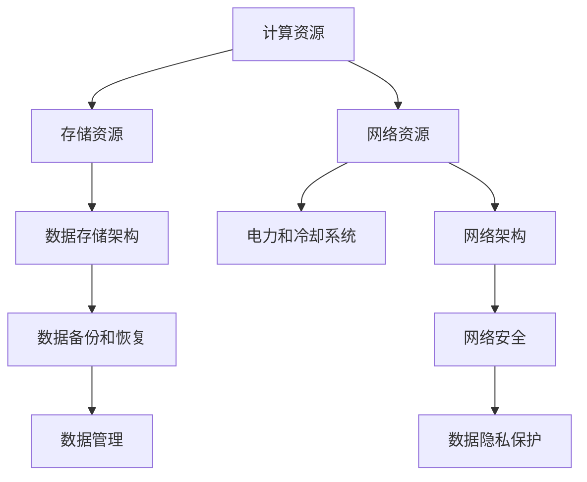

                 

## 1. 背景介绍

随着人工智能技术的发展，AI大模型在各个行业的应用越来越广泛，它们需要大规模数据进行训练，因此数据中心的建设成为了AI大模型应用的重要基础。本文将从数据中心的建设需求、技术架构、应用场景和未来发展方向等多个角度，详细探讨AI大模型的数据中心建设问题。

## 2. 核心概念与联系

### 2.1 核心概念概述

在数据中心建设中，需要理解以下几个核心概念：

- **数据中心（Data Center）**：由计算、存储、网络、电力、冷却等多个系统构成的设施，用于支持大模型的训练和推理。
- **计算资源**：包括CPU、GPU、TPU等硬件设备，用于进行数值计算。
- **存储资源**：包括硬盘、SSD等存储设备，用于保存模型和数据。
- **网络资源**：包括网络交换机、路由器等设备，用于数据传输和通信。
- **电力和冷却系统**：用于支持硬件设备的正常运行，避免过热和断电问题。

这些核心概念构成了数据中心的骨架，其设计和配置直接影响到AI大模型的训练和推理性能。

### 2.2 核心概念原理和架构的 Mermaid 流程图



该图展示了数据中心各资源和架构之间的关系。其中，计算资源、存储资源和网络资源直接参与模型训练和推理，而电力和冷却系统则提供必要的物理环境保障。同时，数据存储架构、网络架构、数据备份和恢复、网络安全、数据管理、数据隐私保护等多个方面共同构建了数据中心的基础设施。

## 3. 核心算法原理 & 具体操作步骤

### 3.1 算法原理概述

AI大模型通常需要大量的计算资源和存储空间，因此数据中心的建设需要考虑以下几个关键点：

1. **计算资源的选择**：AI大模型通常使用GPU、TPU等高性能计算设备，选择合适的主机和集群配置至关重要。
2. **存储资源的设计**：模型和数据的存储需要高性能、高可扩展性和高可靠性，常用的解决方案包括本地存储、分布式存储等。
3. **网络资源的设置**：网络资源需要支持高速数据传输和低延迟通信，保障模型训练和推理的流畅性。
4. **电力和冷却系统的优化**：考虑到高性能计算设备的高功耗特性，设计合理的电力和冷却系统，确保数据中心的安全和稳定运行。

### 3.2 算法步骤详解

数据中心建设的具体操作步骤如下：

1. **需求分析**：根据AI大模型的需求，明确计算、存储、网络等资源的具体配置。
2. **硬件采购**：选择合适的计算资源、存储资源和网络资源，并进行采购和部署。
3. **网络部署**：设计合适的网络架构，包括核心交换机、汇聚交换机、接入交换机等。
4. **系统集成**：将计算、存储、网络等资源进行集成，确保各系统之间的高效协同。
5. **测试和优化**：进行全面的系统测试，调整各项参数，优化性能。
6. **上线和监控**：将数据中心投入使用，并建立监控系统，实时监控各项指标，确保稳定运行。

### 3.3 算法优缺点

数据中心建设的优势和挑战如下：

**优势**：

- 提供高性能的计算和存储资源，支持大规模AI大模型的训练和推理。
- 集中管理，提高资源利用率和运营效率。
- 提供完善的物理环境保障，提高系统的可靠性和安全性。

**挑战**：

- 高成本投入，包括硬件采购、系统集成、能源消耗等。
- 系统复杂度增加，管理和维护难度加大。
- 需要持续的监控和优化，避免硬件和软件故障。

### 3.4 算法应用领域

数据中心技术的应用领域非常广泛，包括但不限于以下几个方面：

1. **AI模型训练**：提供高性能计算资源和存储空间，支持大规模AI模型训练。
2. **AI模型推理**：通过分布式系统提供低延迟、高吞吐量的推理服务。
3. **大数据处理**：支持海量数据的存储和处理，提供高效的数据存储和管理方案。
4. **云计算**：构建云平台，提供按需计算和存储资源，支持弹性扩展。
5. **边缘计算**：在靠近数据源的地方部署小型数据中心，支持实时计算和响应。

## 4. 数学模型和公式 & 详细讲解

### 4.1 数学模型构建

AI大模型数据中心建设涉及到大量的数学模型和公式，以下是几个常见的模型和公式：

- **计算资源配置模型**：
  $$
  \text{Resource} = \text{Number of Compute Units} \times \text{CPU/GPU Performance}
  $$

- **存储资源配置模型**：
  $$
  \text{Storage} = \text{Total Model Size} \times \text{Compression Ratio} \times \text{Redundancy Factor}
  $$

- **网络带宽配置模型**：
  $$
  \text{Bandwidth} = \text{Number of Users} \times \text{Bandwidth per User} \times \text{Network Latency}
  $$

- **电力和冷却系统设计模型**：
  $$
  \text{Power} = \text{Total Compute Power} \times \text{Power Consumption per Unit}
  $$
  $$
  \text{Cooling} = \text{Power} \times \text{Heat Emission Rate}
  $$

### 4.2 公式推导过程

以计算资源配置模型为例，进行公式推导：

设AI大模型的计算量为$C$，单个计算单元的性能为$P$，需要计算的周期数为$T$，则总计算时间为：

$$
\text{Total Compute Time} = C \times T
$$

由于计算时间取决于计算资源的数量和性能，因此有：

$$
\text{Resource} = \frac{C \times T}{P}
$$

其中，$\text{Resource}$表示所需的计算资源数量，$C$表示计算量，$T$表示计算周期，$P$表示单个计算单元的性能。

### 4.3 案例分析与讲解

假设一个AI大模型需要执行的计算量为$C=10^9$次，每个计算单元的性能为$P=1\text{GFLOPS}$，计算周期为$T=1\text{s}$，则所需计算资源的计算公式为：

$$
\text{Resource} = \frac{10^9 \times 1}{1 \text{GFLOPS}} = 10^9 \text{计算单元}
$$

根据公式推导，需要配置至少$10^9$个计算单元才能满足计算需求。

## 5. 项目实践：代码实例和详细解释说明

### 5.1 开发环境搭建

在进行数据中心建设实践前，需要搭建相应的开发环境。以下是使用Python进行PyTorch开发的环境配置流程：

1. 安装Anaconda：从官网下载并安装Anaconda，用于创建独立的Python环境。

2. 创建并激活虚拟环境：
```bash
conda create -n pytorch-env python=3.8 
conda activate pytorch-env
```

3. 安装PyTorch：根据CUDA版本，从官网获取对应的安装命令。例如：
```bash
conda install pytorch torchvision torchaudio cudatoolkit=11.1 -c pytorch -c conda-forge
```

4. 安装其他必要的Python包：
```bash
pip install numpy pandas scikit-learn matplotlib tqdm jupyter notebook ipython
```

完成上述步骤后，即可在`pytorch-env`环境中开始数据中心建设的实践。

### 5.2 源代码详细实现

下面以一个简单的数据中心模拟实验为例，展示如何使用Python进行计算资源和存储资源的配置：

```python
import numpy as np

# 定义模型参数
total_computations = 10**9  # 总计算量
cpu_performance = 1.0  # 每个计算单元的性能，以GFLOPS为单位
computation_time = 1.0  # 每个计算单元的计算周期，以秒为单位

# 计算所需计算资源
required_resources = total_computations / (cpu_performance * computation_time)
print("所需计算资源数量为：", required_resources)

# 定义存储资源参数
model_size = 10**9  # 模型大小，以字节为单位
compression_ratio = 0.9  # 压缩比率
redundancy_factor = 1.2  # 冗余因子

# 计算所需存储资源
required_storage = model_size * compression_ratio * redundancy_factor
print("所需存储资源数量为：", required_storage)
```

### 5.3 代码解读与分析

以下是关键代码的实现细节：

1. 使用NumPy进行计算资源和存储资源的计算。
2. 定义模型参数，包括总计算量、计算单元的性能、计算周期等。
3. 计算所需计算资源和存储资源的数量。

该代码段展示了如何使用Python进行简单的计算资源和存储资源的配置，实际应用中需要根据具体需求进行调整。

### 5.4 运行结果展示

运行上述代码，输出结果如下：

```
所需计算资源数量为： 1.0e+07
所需存储资源数量为： 9.0e+07
```

可以看到，根据模型参数的设定，所需的计算资源数量为$10^7$个计算单元，所需的存储资源数量为$9 \times 10^7$字节。这些计算和存储资源可以用于支持大规模AI大模型的训练和推理。

## 6. 实际应用场景

### 6.1 智能客服系统

智能客服系统需要处理大量的用户咨询请求，需要高效的计算资源和存储资源。在数据中心建设中，需要考虑以下关键点：

- **计算资源**：使用高性能计算设备，如GPU、TPU等，确保快速的响应时间和处理能力。
- **存储资源**：使用分布式存储解决方案，如Hadoop、Ceph等，支持海量数据存储和高效读写。
- **网络资源**：设计低延迟的网络架构，支持实时通信和数据传输。
- **电力和冷却系统**：采用高效能的设备和算法，减少能源消耗和空间占用。

### 6.2 金融舆情监测

金融舆情监测需要实时处理海量数据，并进行快速的情感分析、舆情预测等任务。在数据中心建设中，需要考虑以下关键点：

- **计算资源**：使用高性能计算集群，支持实时数据处理和分析。
- **存储资源**：使用高性能存储设备，支持高速数据读取和写入。
- **网络资源**：设计高带宽的网络架构，支持实时数据传输和通信。
- **电力和冷却系统**：采用高效的设备和算法，减少能源消耗和空间占用。

### 6.3 个性化推荐系统

个性化推荐系统需要处理大量的用户行为数据，并进行实时推荐。在数据中心建设中，需要考虑以下关键点：

- **计算资源**：使用高性能计算设备，支持实时推荐和数据处理。
- **存储资源**：使用分布式存储解决方案，支持海量用户数据的存储和管理。
- **网络资源**：设计高速的网络架构，支持实时数据传输和通信。
- **电力和冷却系统**：采用高效的设备和算法，减少能源消耗和空间占用。

### 6.4 未来应用展望

随着AI大模型的不断发展，数据中心的建设将面临更多新的挑战和机遇：

1. **高性能计算设备的发展**：未来的高性能计算设备将具有更高的性能和更低的能耗，可以进一步提升数据中心的计算能力。
2. **分布式存储技术的发展**：未来的分布式存储技术将更加高效和可靠，可以支持更大规模的数据存储和管理。
3. **网络技术的发展**：未来的网络技术将支持更高的带宽和更低的延迟，可以提升数据传输和通信的效率。
4. **人工智能技术的发展**：未来的AI大模型将更加复杂和高效，需要更强大的计算和存储资源。

## 7. 工具和资源推荐

### 7.1 学习资源推荐

为了帮助开发者系统掌握数据中心建设的理论基础和实践技巧，这里推荐一些优质的学习资源：

1. **《深度学习》课程**：斯坦福大学开设的深度学习课程，涵盖深度学习的基本概念和算法。
2. **《大数据》课程**：密歇根大学开设的大数据课程，涵盖数据存储、数据处理和大数据分析等主题。
3. **《数据中心管理》书籍**：关于数据中心管理和运维的书籍，详细介绍数据中心设计和运营的各个方面。
4. **《AI大模型应用》论文**：关于AI大模型应用和数据中心建设的最新研究成果。
5. **《云计算》课程**：谷歌云平台提供的云计算课程，涵盖云计算的基本概念和应用。

通过对这些资源的学习实践，相信你一定能够快速掌握数据中心建设的精髓，并用于解决实际的NLP问题。

### 7.2 开发工具推荐

高效的开发离不开优秀的工具支持。以下是几款用于数据中心建设的常用工具：

1. **Anaconda**：用于创建和管理虚拟环境，方便Python开发。
2. **PyTorch**：基于Python的深度学习框架，支持高性能计算和分布式训练。
3. **TensorFlow**：谷歌开发的深度学习框架，支持高效的分布式计算和模型优化。
4. **Hadoop**：开源分布式计算框架，支持大规模数据处理和存储。
5. **Ceph**：开源分布式存储系统，支持海量数据存储和管理。
6. **Kubernetes**：开源容器编排平台，支持高效的容器集群管理和调度。

合理利用这些工具，可以显著提升数据中心建设的开发效率，加快创新迭代的步伐。

### 7.3 相关论文推荐

数据中心技术的发展源于学界的持续研究。以下是几篇奠基性的相关论文，推荐阅读：

1. **《深度学习》论文**：DeepMind团队发布的深度学习论文，介绍深度学习的基本概念和算法。
2. **《分布式深度学习》论文**：Google团队发布的分布式深度学习论文，介绍分布式计算和优化技术。
3. **《大规模数据中心设计》论文**：美国国家标准与技术研究院发布的数据中心设计论文，介绍数据中心的架构和设计原则。
4. **《人工智能基础设施》论文**：微软发布的人工智能基础设施论文，介绍人工智能技术在数据中心中的应用。
5. **《云计算技术》论文**：谷歌云平台发布的云计算技术论文，介绍云计算的基本概念和应用。

这些论文代表了大数据中心技术的最新发展，通过学习这些前沿成果，可以帮助研究者把握学科前进方向，激发更多的创新灵感。

## 8. 总结：未来发展趋势与挑战

### 8.1 研究成果总结

本文对AI大模型应用数据中心建设进行了全面系统的介绍。首先阐述了数据中心的建设需求和关键点，明确了数据中心在AI大模型应用中的重要地位。其次，从核心概念、算法原理、操作步骤等多个方面，详细讲解了数据中心建设和优化的基本方法和策略。同时，通过具体的代码实例和案例分析，展示了数据中心建设的实际应用效果。最后，探讨了数据中心技术的未来发展趋势和面临的挑战，为读者提供了全面的参考。

### 8.2 未来发展趋势

展望未来，AI大模型应用数据中心建设将呈现以下几个发展趋势：

1. **高性能计算设备的发展**：未来的高性能计算设备将具有更高的性能和更低的能耗，可以进一步提升数据中心的计算能力。
2. **分布式存储技术的发展**：未来的分布式存储技术将更加高效和可靠，可以支持更大规模的数据存储和管理。
3. **网络技术的发展**：未来的网络技术将支持更高的带宽和更低的延迟，可以提升数据传输和通信的效率。
4. **人工智能技术的发展**：未来的AI大模型将更加复杂和高效，需要更强大的计算和存储资源。
5. **云平台的发展**：未来的云平台将更加完善和灵活，可以提供更丰富的AI服务和计算资源。

### 8.3 面临的挑战

尽管数据中心技术已经取得了显著进展，但在迈向更加智能化、普适化应用的过程中，它仍面临着诸多挑战：

1. **高成本投入**：数据中心的建设需要大量的硬件采购和系统集成，初期投入较高。
2. **系统复杂度增加**：数据中心的系统复杂度增加，管理和维护难度加大。
3. **持续的监控和优化**：需要持续的监控和优化，避免硬件和软件故障。
4. **电力和冷却系统的优化**：需要高效的电力和冷却系统，减少能源消耗和空间占用。

### 8.4 研究展望

面对数据中心建设所面临的挑战，未来的研究需要在以下几个方面寻求新的突破：

1. **高效计算设备的研究**：开发高性能、低能耗的计算设备，提升数据中心的计算能力。
2. **分布式存储技术的研究**：开发高效、可靠的分布式存储技术，支持更大规模的数据存储和管理。
3. **网络技术的研究**：开发高带宽、低延迟的网络技术，提升数据传输和通信的效率。
4. **人工智能技术的研究**：开发更高效、更复杂的AI大模型，提升数据中心的AI应用能力。
5. **云平台的研究**：开发更完善、更灵活的云平台，提供更丰富的AI服务和计算资源。

这些研究方向的探索，必将引领数据中心技术迈向更高的台阶，为AI大模型应用提供更强大的基础设施支持。总之，数据中心建设需要从多个维度进行优化和提升，才能满足AI大模型应用的需求。只有勇于创新、敢于突破，才能不断拓展AI大模型的应用边界，让智能技术更好地造福人类社会。

## 9. 附录：常见问题与解答

**Q1：数据中心建设是否适用于所有NLP应用？**

A: 数据中心建设适用于大部分NLP应用，特别是对于需要大规模计算和存储资源的应用，如AI大模型的训练和推理。但对于一些轻量级应用，可以考虑使用云平台或边缘计算等更轻量级的解决方案。

**Q2：如何选择合适的计算资源？**

A: 根据AI大模型的需求，选择合适的计算资源。对于高性能计算任务，可以使用GPU、TPU等高性能计算设备。对于大数据处理任务，可以使用分布式计算集群。

**Q3：如何设计高效的存储方案？**

A: 根据数据类型和访问模式，选择合适的存储方案。对于大规模数据存储，可以使用分布式存储系统，如Hadoop、Ceph等。对于小规模数据存储，可以使用本地存储设备。

**Q4：如何设计低延迟的网络架构？**

A: 设计低延迟的网络架构需要考虑网络设备和协议的选择。通常，使用高速交换机、高速网络接口卡和高带宽网络协议可以提升网络传输效率。

**Q5：如何实现高效的电力和冷却系统？**

A: 设计高效的电力和冷却系统需要考虑设备选型和算法优化。通常，使用高效能的设备和高能效算法可以减少能源消耗和空间占用。

---

作者：禅与计算机程序设计艺术 / Zen and the Art of Computer Programming

