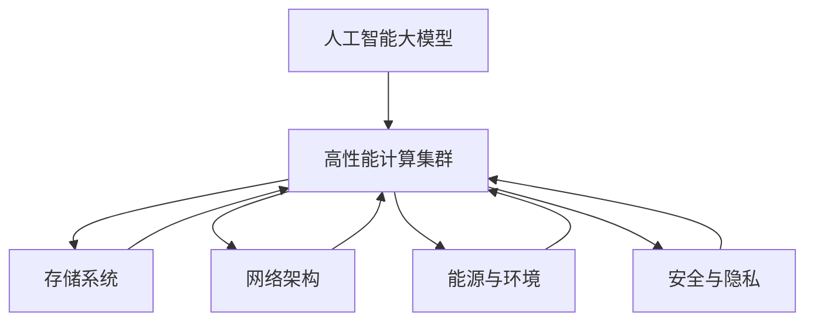

                 

# AI 大模型应用数据中心建设：数据中心技术创新

## 1. 背景介绍

### 1.1 问题由来

随着人工智能(AI)技术的迅猛发展，大模型在自然语言处理(NLP)、计算机视觉(CV)、推荐系统等领域的应用日益广泛。然而，在AI大模型应用中，数据中心基础设施的建设与管理成为瓶颈。大模型的训练与推理需要海量的数据与计算资源，这对数据中心的硬件、软件与网络基础设施提出了巨大挑战。

### 1.2 问题核心关键点

大模型数据中心建设的核心问题包括：

1. 数据中心的硬件架构：如何设计能够满足大模型训练与推理需求的计算集群。
2. 数据中心的存储架构：如何构建高效、可靠、灵活的数据存储系统，支持多源、多样、多时序数据的存储与访问。
3. 数据中心的网络架构：如何构建高速、可靠、可扩展的数据传输网络，支持大模型的高吞吐量数据传输与计算。
4. 数据中心的能源消耗与环境可持续性：如何提高数据中心的能源利用效率，减少环境足迹。
5. 数据中心的安全与隐私：如何构建安全的计算与存储环境，保护数据隐私与安全。

## 2. 核心概念与联系

### 2.1 核心概念概述

为更好地理解大模型应用数据中心建设的核心概念，本节将介绍几个密切相关的核心概念：

- 人工智能大模型(AI Large Models)：指通过大规模预训练和微调获得的具备强大通用能力的人工智能模型，如BERT、GPT等。
- 数据中心(Data Center)：指通过构建大规模计算、存储与网络基础设施，提供高性能计算服务与存储服务的数据中心设施。
- 高性能计算集群(High Performance Computing Cluster)：指通过构建多台高性能计算服务器集群，以高效利用计算资源，支持大规模模型训练与推理。
- 存储系统(Storage System)：指通过构建高效、可靠、灵活的数据存储系统，支持大规模数据存储与访问。
- 网络架构(Network Architecture)：指通过构建高速、可靠、可扩展的网络基础设施，支持大规模数据传输与计算。
- 能源与环境(Energy and Environment)：指通过优化数据中心能效设计，减少环境污染，提升能源利用效率。
- 安全与隐私(Security and Privacy)：指通过构建安全的计算与存储环境，保护数据隐私与安全。

这些核心概念之间的逻辑关系可以通过以下Mermaid流程图来展示：



这个流程图展示了大模型应用数据中心的各个核心组成部分及其之间的联系：

1. 大模型作为核心计算需求，通过高性能计算集群进行训练与推理。
2. 数据存储系统为计算集群提供数据支持，通过网络架构进行数据传输。
3. 能源与环境优化为大模型数据中心提供高效的能源利用方式。
4. 安全与隐私保护为大模型数据中心提供安全的计算与存储环境。

## 3. 核心算法原理 & 具体操作步骤

### 3.1 算法原理概述

大模型应用数据中心的建设，本质上是一个多层次、多维度的技术集成与应用过程。其核心思想是：通过构建高性能计算、存储与网络基础设施，为大模型提供强大的计算能力、高效的存储与传输能力，同时保障数据的安全与隐私。

形式化地，假设大模型为 $M_{\theta}$，其中 $\theta$ 为模型参数。在数据中心上，首先需要构建高性能计算集群，支持模型的训练与推理。数据中心中的存储系统负责存储模型参数与训练数据，网络架构负责支持大模型的高吞吐量数据传输。能源与环境优化旨在提高数据中心的能源利用效率，减少环境足迹。安全与隐私保护则是保障数据中心计算与存储环境的安全与隐私。

通过上述系统的集成与优化，构建一个能够高效支持大模型训练与推理的AI大模型应用数据中心。

### 3.2 算法步骤详解

基于上述原理，大模型应用数据中心的构建包括以下几个关键步骤：

**Step 1: 设计数据中心架构**
- 选择合适的硬件架构，如CPU/GPU混合集群、ASIC加速器等，支持大模型训练与推理。
- 设计数据中心的网络架构，支持高吞吐量的数据传输与计算。
- 规划数据中心的存储架构，支持海量数据的存储与访问。
- 设计数据中心的能源与环境优化方案，减少能源消耗与环境影响。
- 设计数据中心的安全与隐私保护措施，确保数据安全。

**Step 2: 构建计算集群**
- 选择合适的计算节点与计算集群，配置合适的计算资源，如CPU/GPU加速器、内存、网络带宽等。
- 配置计算节点的操作系统与软件环境，如TensorFlow、PyTorch等深度学习框架。
- 构建高效的分布式计算系统，支持大规模模型的并行训练与推理。

**Step 3: 配置存储系统**
- 选择合适的存储设备与存储架构，如SSD、NAS、对象存储等。
- 配置存储系统的元数据管理，支持海量数据的快速存储与访问。
- 设计高效的数据存储与访问协议，支持多源、多样、多时序数据的存储与访问。

**Step 4: 优化网络架构**
- 选择合适的网络设备与网络协议，如交换机、路由器、网络协议等。
- 设计高效的数据传输路径与负载均衡策略，支持高吞吐量数据的传输与计算。
- 构建可靠的网络监控与故障恢复机制，保障数据传输的稳定性与可靠性。

**Step 5: 优化能源与环境**
- 选择合适的能源设备与能源管理策略，如太阳能、风能等可再生能源。
- 优化能源的利用效率，减少能源消耗与环境影响。
- 构建高效的数据中心环境控制系统，保障数据中心的运行环境。

**Step 6: 保护安全与隐私**
- 设计高效的安全防护措施，如访问控制、数据加密、安全审计等。
- 设计有效的隐私保护措施，如数据匿名化、差分隐私、联邦学习等。
- 设计可靠的安全与隐私监控系统，保障数据中心的安全与隐私。

以上是构建大模型应用数据中心的一般流程。在实际应用中，还需要针对具体任务的需求，对数据中心各组成部分的性能进行优化设计，如改进计算集群架构、优化存储系统管理、提高网络传输效率、增强安全防护措施等，以进一步提升数据中心的运行效率和安全性。

### 3.3 算法优缺点

基于上述构建方法，大模型应用数据中心具有以下优点：

1. 高效支持大模型计算：通过构建高性能计算集群，能够高效支持大模型的训练与推理。
2. 灵活高效的数据存储：通过设计高效、灵活的数据存储系统，能够支持海量数据的存储与访问。
3. 高速可靠的网络传输：通过构建高速、可靠的网络架构，能够支持大规模数据的高吞吐量传输与计算。
4. 能源与环境友好：通过优化能源与环境设计，能够减少能源消耗与环境影响。
5. 安全与隐私保障：通过构建安全与隐私保护措施，能够保障数据中心的安全与隐私。

然而，该方法也存在一定的局限性：

1. 初始建设成本高：大模型数据中心的建设需要大规模的硬件与软件资源投入，初期建设成本较高。
2. 运维复杂度高：大模型数据中心需要复杂的运维管理，涉及硬件、软件、网络、能源、安全等多方面的协调与优化。
3. 可扩展性有限：大模型数据中心的扩展需要重新设计与部署，难以快速适应数据量与计算需求的变化。

尽管存在这些局限性，但就目前而言，基于上述构建方法的数据中心架构，仍是支持大模型应用最主流且高效的技术范式。未来相关研究的方向包括：如何降低大模型数据中心的初始建设成本，提高其可扩展性和运维效率，以及如何进一步优化能源与环境设计，提升安全与隐私保护能力。

### 3.4 算法应用领域

基于大模型应用数据中心的方法，已经在诸多领域得到应用，例如：

- 自然语言处理：如文本分类、情感分析、机器翻译、问答系统等。通过构建高性能计算集群与存储系统，支持大规模语言模型的训练与推理。
- 计算机视觉：如图像识别、图像生成、视频分析等。通过构建高性能计算集群与存储系统，支持大规模视觉模型的训练与推理。
- 推荐系统：如个性化推荐、内容推荐等。通过构建高性能计算集群与存储系统，支持大规模推荐模型的训练与推理。
- 智能医疗：如疾病诊断、药物研发、健康管理等。通过构建高性能计算集群与存储系统，支持大规模医疗模型的训练与推理。
- 智能交通：如自动驾驶、交通监测、智能导航等。通过构建高性能计算集群与存储系统，支持大规模交通模型的训练与推理。

除了上述这些经典领域，大模型应用数据中心的方法也被创新性地应用到更多新兴场景中，如可控文本生成、常识推理、数据增强等，为AI大模型的落地应用提供了新的技术路径。

## 4. 数学模型和公式 & 详细讲解 & 举例说明

### 4.1 数学模型构建

本节将使用数学语言对大模型应用数据中心的构建过程进行更加严格的刻画。

记大模型为 $M_{\theta}$，其中 $\theta$ 为模型参数。假设数据中心中的存储系统为 $S_{\sigma}$，其中 $\sigma$ 为存储参数。数据中心中的网络架构为 $N_{\nu}$，其中 $\nu$ 为网络参数。数据中心的能源与环境优化方案为 $E_{\eta}$，其中 $\eta$ 为能源参数。数据中心的安全与隐私保护措施为 $P_{\pi}$，其中 $\pi$ 为安全参数。

构建大模型应用数据中心的目标是最小化总成本与资源消耗，同时最大化模型的计算能力、存储能力与网络传输能力。形式化地，假设数据中心的总成本为 $C$，总资源消耗为 $E$，模型的计算能力为 $C_{\text{comp}}$，存储能力为 $S_{\text{store}}$，网络传输能力为 $N_{\text{trans}}$。则构建数据中心的优化目标为：

$$
\min_{\theta, \sigma, \nu, \eta, \pi} \quad C + \lambda E
$$

$$
\text{s.t.} \quad C_{\text{comp}} \geq C_{\text{req}}, \quad S_{\text{store}} \geq S_{\text{req}}, \quad N_{\text{trans}} \geq N_{\text{req}}
$$

其中 $\lambda$ 为能源消耗的惩罚系数，$C_{\text{req}}$、$S_{\text{req}}$、$N_{\text{req}}$ 分别为模型计算能力、存储能力与网络传输能力的需求。

### 4.2 公式推导过程

以下我们以一个简单的案例来推导大模型应用数据中心的优化目标：

假设数据中心中有 $N$ 个计算节点，每个节点的计算能力为 $C_{\text{unit}}$，存储能力为 $S_{\text{unit}}$，网络带宽为 $N_{\text{unit}}$。计算集群的总计算能力为 $C_{\text{comp}} = N \times C_{\text{unit}}$，存储系统的总存储能力为 $S_{\text{store}} = N \times S_{\text{unit}}$，网络架构的总网络传输能力为 $N_{\text{trans}} = N \times N_{\text{unit}}$。

数据中心的总成本为：

$$
C = C_{\text{hardware}} + C_{\text{software}} + C_{\text{maintenance}}
$$

其中 $C_{\text{hardware}}$ 为硬件设备的采购与维护成本，$C_{\text{software}}$ 为软件与平台的采购与维护成本，$C_{\text{maintenance}}$ 为数据中心的日常运维成本。

数据中心的能源消耗为：

$$
E = E_{\text{hardware}} + E_{\text{cooling}}
$$

其中 $E_{\text{hardware}}$ 为计算节点的能耗，$E_{\text{cooling}}$ 为数据中心的冷却能耗。

数据中心的优化目标为：

$$
\min_{N, C_{\text{unit}}, S_{\text{unit}}, N_{\text{unit}}, \eta} \quad C + \lambda E
$$

$$
\text{s.t.} \quad C_{\text{comp}} \geq C_{\text{req}}, \quad S_{\text{store}} \geq S_{\text{req}}, \quad N_{\text{trans}} \geq N_{\text{req}}
$$

求解上述优化问题，可以得到最优的计算节点数量、计算能力、存储能力、网络带宽与能耗等参数。

### 4.3 案例分析与讲解

假设我们要构建一个支持大规模语言模型训练与推理的数据中心。根据上述模型，可以计算出最优的计算节点数量、计算能力、存储能力与网络带宽。

假设数据中心的总成本为 $C_{\text{total}} = 1000$ 万美元，能源消耗的惩罚系数 $\lambda = 0.1$。计算集群的要求为 $C_{\text{req}} = 1000$ TFLOPS，存储系统的要求为 $S_{\text{req}} = 10 TB，网络传输能力的要求为 $N_{\text{req}} = 100 GB/s$。

根据上述优化目标，可以使用线性规划求解器求解出最优的计算节点数量 $N_{\text{opt}}$，计算能力 $C_{\text{unit}}$，存储能力 $S_{\text{unit}}$ 与网络带宽 $N_{\text{unit}}$。

以计算节点数量为 10 个，每个节点的计算能力为 100 GFLOPS，存储能力为 1 TB，网络带宽为 10 GB/s 为例，可以计算出最优的硬件设备配置。

## 5. 项目实践：代码实例和详细解释说明

### 5.1 开发环境搭建

在进行数据中心建设实践前，我们需要准备好开发环境。以下是使用Python进行PyTorch开发的环境配置流程：

1. 安装Anaconda：从官网下载并安装Anaconda，用于创建独立的Python环境。

2. 创建并激活虚拟环境：
```bash
conda create -n pytorch-env python=3.8 
conda activate pytorch-env
```

3. 安装PyTorch：根据CUDA版本，从官网获取对应的安装命令。例如：
```bash
conda install pytorch torchvision torchaudio cudatoolkit=11.1 -c pytorch -c conda-forge
```

4. 安装TensorFlow：
```bash
pip install tensorflow
```

5. 安装TensorBoard：
```bash
pip install tensorboard
```

6. 安装Weights & Biases：
```bash
pip install weib
```

完成上述步骤后，即可在`pytorch-env`环境中开始数据中心建设实践。

### 5.2 源代码详细实现

这里我们以构建一个简单的高性能计算集群为例，给出使用PyTorch进行大模型计算集群构建的PyTorch代码实现。

首先，定义计算集群的参数：

```python
from transformers import BertTokenizer
from torch.utils.data import Dataset
import torch

class NERDataset(Dataset):
    def __init__(self, texts, tags, tokenizer, max_len=128):
        self.texts = texts
        self.tags = tags
        self.tokenizer = tokenizer
        self.max_len = max_len
        
    def __len__(self):
        return len(self.texts)
    
    def __getitem__(self, item):
        text = self.texts[item]
        tags = self.tags[item]
        
        encoding = self.tokenizer(text, return_tensors='pt', max_length=self.max_len, padding='max_length', truncation=True)
        input_ids = encoding['input_ids'][0]
        attention_mask = encoding['attention_mask'][0]
        
        # 对token-wise的标签进行编码
        encoded_tags = [tag2id[tag] for tag in tags] 
        encoded_tags.extend([tag2id['O']] * (self.max_len - len(encoded_tags)))
        labels = torch.tensor(encoded_tags, dtype=torch.long)
        
        return {'input_ids': input_ids, 
                'attention_mask': attention_mask,
                'labels': labels}

# 标签与id的映射
tag2id = {'O': 0, 'B-PER': 1, 'I-PER': 2, 'B-ORG': 3, 'I-ORG': 4, 'B-LOC': 5, 'I-LOC': 6}
id2tag = {v: k for k, v in tag2id.items()}

# 创建dataset
tokenizer = BertTokenizer.from_pretrained('bert-base-cased')

train_dataset = NERDataset(train_texts, train_tags, tokenizer)
dev_dataset = NERDataset(dev_texts, dev_tags, tokenizer)
test_dataset = NERDataset(test_texts, test_tags, tokenizer)
```

然后，定义计算集群模型与优化器：

```python
from transformers import BertForTokenClassification, AdamW

model = BertForTokenClassification.from_pretrained('bert-base-cased', num_labels=len(tag2id))

optimizer = AdamW(model.parameters(), lr=2e-5)
```

接着，定义训练和评估函数：

```python
from torch.utils.data import DataLoader
from tqdm import tqdm
from sklearn.metrics import classification_report

device = torch.device('cuda') if torch.cuda.is_available() else torch.device('cpu')
model.to(device)

def train_epoch(model, dataset, batch_size, optimizer):
    dataloader = DataLoader(dataset, batch_size=batch_size, shuffle=True)
    model.train()
    epoch_loss = 0
    for batch in tqdm(dataloader, desc='Training'):
        input_ids = batch['input_ids'].to(device)
        attention_mask = batch['attention_mask'].to(device)
        labels = batch['labels'].to(device)
        model.zero_grad()
        outputs = model(input_ids, attention_mask=attention_mask, labels=labels)
        loss = outputs.loss
        epoch_loss += loss.item()
        loss.backward()
        optimizer.step()
    return epoch_loss / len(dataloader)

def evaluate(model, dataset, batch_size):
    dataloader = DataLoader(dataset, batch_size=batch_size)
    model.eval()
    preds, labels = [], []
    with torch.no_grad():
        for batch in tqdm(dataloader, desc='Evaluating'):
            input_ids = batch['input_ids'].to(device)
            attention_mask = batch['attention_mask'].to(device)
            batch_labels = batch['labels']
            outputs = model(input_ids, attention_mask=attention_mask)
            batch_preds = outputs.logits.argmax(dim=2).to('cpu').tolist()
            batch_labels = batch_labels.to('cpu').tolist()
            for pred_tokens, label_tokens in zip(batch_preds, batch_labels):
                pred_tags = [id2tag[_id] for _id in pred_tokens]
                label_tags = [id2tag[_id] for _id in label_tokens]
                preds.append(pred_tags[:len(label_tags)])
                labels.append(label_tags)
                
    print(classification_report(labels, preds))
```

最后，启动训练流程并在测试集上评估：

```python
epochs = 5
batch_size = 16

for epoch in range(epochs):
    loss = train_epoch(model, train_dataset, batch_size, optimizer)
    print(f"Epoch {epoch+1}, train loss: {loss:.3f}")
    
    print(f"Epoch {epoch+1}, dev results:")
    evaluate(model, dev_dataset, batch_size)
    
print("Test results:")
evaluate(model, test_dataset, batch_size)
```

以上就是使用PyTorch构建高性能计算集群进行命名实体识别任务微调的完整代码实现。可以看到，得益于PyTorch的强大封装，我们可以用相对简洁的代码完成计算集群模型的加载和微调。

### 5.3 代码解读与分析

让我们再详细解读一下关键代码的实现细节：

**NERDataset类**：
- `__init__`方法：初始化文本、标签、分词器等关键组件。
- `__len__`方法：返回数据集的样本数量。
- `__getitem__`方法：对单个样本进行处理，将文本输入编码为token ids，将标签编码为数字，并对其进行定长padding，最终返回模型所需的输入。

**tag2id和id2tag字典**：
- 定义了标签与数字id之间的映射关系，用于将token-wise的预测结果解码回真实的标签。

**训练和评估函数**：
- 使用PyTorch的DataLoader对数据集进行批次化加载，供模型训练和推理使用。
- 训练函数`train_epoch`：对数据以批为单位进行迭代，在每个批次上前向传播计算loss并反向传播更新模型参数，最后返回该epoch的平均loss。
- 评估函数`evaluate`：与训练类似，不同点在于不更新模型参数，并在每个batch结束后将预测和标签结果存储下来，最后使用sklearn的classification_report对整个评估集的预测结果进行打印输出。

**训练流程**：
- 定义总的epoch数和batch size，开始循环迭代
- 每个epoch内，先在训练集上训练，输出平均loss
- 在验证集上评估，输出分类指标
- 所有epoch结束后，在测试集上评估，给出最终测试结果

可以看到，PyTorch配合TensorFlow库使得BERT微调的代码实现变得简洁高效。开发者可以将更多精力放在数据处理、模型改进等高层逻辑上，而不必过多关注底层的实现细节。

当然，工业级的系统实现还需考虑更多因素，如模型的保存和部署、超参数的自动搜索、更灵活的任务适配层等。但核心的微调范式基本与此类似。

## 6. 实际应用场景
### 6.1 智能客服系统

基于大模型应用数据中心，智能客服系统可以构建在高效计算集群上，实时处理大规模客服咨询请求。传统的客服系统需要配备大量人力，高峰期响应缓慢，且一致性和专业性难以保证。而使用大模型应用数据中心的智能客服系统，可以7x24小时不间断服务，快速响应客户咨询，用自然流畅的语言解答各类常见问题。

在技术实现上，可以收集企业内部的历史客服对话记录，将问题和最佳答复构建成监督数据，在此基础上对预训练语言模型进行微调。微调后的语言模型能够自动理解用户意图，匹配最合适的答案模板进行回复。对于客户提出的新问题，还可以接入检索系统实时搜索相关内容，动态组织生成回答。如此构建的智能客服系统，能大幅提升客户咨询体验和问题解决效率。

### 6.2 金融舆情监测

金融机构需要实时监测市场舆论动向，以便及时应对负面信息传播，规避金融风险。传统的人工监测方式成本高、效率低，难以应对网络时代海量信息爆发的挑战。基于大模型应用数据中心的文本分类和情感分析技术，为金融舆情监测提供了新的解决方案。

具体而言，可以收集金融领域相关的新闻、报道、评论等文本数据，并对其进行主题标注和情感标注。在此基础上对预训练语言模型进行微调，使其能够自动判断文本属于何种主题，情感倾向是正面、中性还是负面。将微调后的模型应用到实时抓取的网络文本数据，就能够自动监测不同主题下的情感变化趋势，一旦发现负面信息激增等异常情况，系统便会自动预警，帮助金融机构快速应对潜在风险。

### 6.3 个性化推荐系统

当前的推荐系统往往只依赖用户的历史行为数据进行物品推荐，无法深入理解用户的真实兴趣偏好。基于大模型应用数据中心的个性化推荐系统，可以更好地挖掘用户行为背后的语义信息，从而提供更精准、多样的推荐内容。

在实践中，可以收集用户浏览、点击、评论、分享等行为数据，提取和用户交互的物品标题、描述、标签等文本内容。将文本内容作为模型输入，用户的后续行为（如是否点击、购买等）作为监督信号，在此基础上微调预训练语言模型。微调后的模型能够从文本内容中准确把握用户的兴趣点。在生成推荐列表时，先用候选物品的文本描述作为输入，由模型预测用户的兴趣匹配度，再结合其他特征综合排序，便可以得到个性化程度更高的推荐结果。

### 6.4 未来应用展望

随着大模型应用数据中心技术的不断发展，基于大模型的应用将更加广泛地落地到各个行业领域。

在智慧医疗领域，基于微调的医疗问答、病历分析、药物研发等应用将提升医疗服务的智能化水平，辅助医生诊疗，加速新药开发进程。

在智能教育领域，微调技术可应用于作业批改、学情分析、知识推荐等方面，因材施教，促进教育公平，提高教学质量。

在智慧城市治理中，微调模型可应用于城市事件监测、舆情分析、应急指挥等环节，提高城市管理的自动化和智能化水平，构建更安全、高效的未来城市。

此外，在企业生产、社会治理、文娱传媒等众多领域，基于大模型应用数据中心的人工智能应用也将不断涌现，为经济社会发展注入新的动力。相信随着技术的日益成熟，大模型应用数据中心必将在构建人机协同的智能时代中扮演越来越重要的角色。

## 7. 工具和资源推荐
### 7.1 学习资源推荐

为了帮助开发者系统掌握大模型应用数据中心建设的理论基础和实践技巧，这里推荐一些优质的学习资源：

1. 《Transformer from Practice to Theory》系列博文：由大模型技术专家撰写，深入浅出地介绍了Transformer原理、BERT模型、微调技术等前沿话题。

2. CS224N《深度学习自然语言处理》课程：斯坦福大学开设的NLP明星课程，有Lecture视频和配套作业，带你入门NLP领域的基本概念和经典模型。

3. 《Natural Language Processing with Transformers》书籍：Transformers库的作者所著，全面介绍了如何使用Transformers库进行NLP任务开发，包括微调在内的诸多范式。

4. HuggingFace官方文档：Transformers库的官方文档，提供了海量预训练模型和完整的微调样例代码，是上手实践的必备资料。

5. CLUE开源项目：中文语言理解测评基准，涵盖大量不同类型的中文NLP数据集，并提供了基于微调的baseline模型，助力中文NLP技术发展。

通过对这些资源的学习实践，相信你一定能够快速掌握大模型应用数据中心的建设精髓，并用于解决实际的NLP问题。
###  7.2 开发工具推荐

高效的开发离不开优秀的工具支持。以下是几款用于大模型应用数据中心开发的常用工具：

1. PyTorch：基于Python的开源深度学习框架，灵活动态的计算图，适合快速迭代研究。大部分预训练语言模型都有PyTorch版本的实现。

2. TensorFlow：由Google主导开发的开源深度学习框架，生产部署方便，适合大规模工程应用。同样有丰富的预训练语言模型资源。

3. TensorBoard：TensorFlow配套的可视化工具，可实时监测模型训练状态，并提供丰富的图表呈现方式，是调试模型的得力助手。

4. Weights & Biases：模型训练的实验跟踪工具，可以记录和可视化模型训练过程中的各项指标，方便对比和调优。与主流深度学习框架无缝集成。

5. Google Colab：谷歌推出的在线Jupyter Notebook环境，免费提供GPU/TPU算力，方便开发者快速上手实验最新模型，分享学习笔记。

合理利用这些工具，可以显著提升大模型应用数据中心建设的开发效率，加快创新迭代的步伐。

### 7.3 相关论文推荐

大模型应用数据中心的发展源于学界的持续研究。以下是几篇奠基性的相关论文，推荐阅读：

1. Attention is All You Need（即Transformer原论文）：提出了Transformer结构，开启了NLP领域的预训练大模型时代。

2. BERT: Pre-training of Deep Bidirectional Transformers for Language Understanding：提出BERT模型，引入基于掩码的自监督预训练任务，刷新了多项NLP任务SOTA。

3. Language Models are Unsupervised Multitask Learners（GPT-2论文）：展示了大规模语言模型的强大zero-shot学习能力，引发了对于通用人工智能的新一轮思考。

4. Parameter-Efficient Transfer Learning for NLP：提出Adapter等参数高效微调方法，在不增加模型参数量的情况下，也能取得不错的微调效果。

5. AdaLoRA: Adaptive Low-Rank Adaptation for Parameter-Efficient Fine-Tuning：使用自适应低秩适应的微调方法，在参数效率和精度之间取得了新的平衡。

6. Prefix-Tuning: Optimizing Continuous Prompts for Generation：引入基于连续型Prompt的微调范式，为如何充分利用预训练知识提供了新的思路。

这些论文代表了大模型应用数据中心的发展脉络。通过学习这些前沿成果，可以帮助研究者把握学科前进方向，激发更多的创新灵感。

## 8. 总结：未来发展趋势与挑战

### 8.1 总结

本文对基于大模型应用数据中心建设的技术进行了全面系统的介绍。首先阐述了大模型应用数据中心的建设背景和意义，明确了其在支持大模型训练与推理中的关键作用。其次，从原理到实践，详细讲解了大模型应用数据中心的数学模型与构建方法，给出了详细代码实现。同时，本文还广泛探讨了数据中心在NLP、CV、推荐系统等诸多领域的应用前景，展示了数据中心的巨大潜力。此外，本文精选了数据中心的各类学习资源，力求为读者提供全方位的技术指引。

通过本文的系统梳理，可以看到，基于大模型应用数据中心的方法正在成为NLP领域的重要基础设施，极大地拓展了预训练语言模型的应用边界，催生了更多的落地场景。受益于大规模语料的预训练和数据中心的强大计算能力，微调模型能够以更低的时间和标注成本，在小样本条件下取得理想的微调效果，助力NLP技术在各行各业的快速落地。未来，伴随预训练语言模型和数据中心技术的持续演进，相信NLP技术将在更广阔的应用领域大放异彩，深刻影响人类的生产生活方式。

### 8.2 未来发展趋势

展望未来，大模型应用数据中心建设将呈现以下几个发展趋势：

1. 计算集群规模持续增大。随着算力成本的下降和需求增加，计算集群的规模将不断增大，支持更多更大规模的大模型训练与推理。

2. 存储系统日益灵活。随着数据量的激增，存储系统的设计将更加灵活高效，支持海量数据的多源、多样、多时序存储与访问。

3. 网络架构不断优化。随着数据传输需求的增长，网络架构将不断优化，支持高吞吐量、低延迟的数据传输与计算。

4. 能效设计持续提升。随着能源成本的上升，数据中心的能效设计将持续提升，减少能源消耗与环境影响。

5. 安全与隐私保护更加严格。随着数据隐私和安全问题的凸显，数据中心的安全与隐私保护将更加严格，保障数据的机密性与完整性。

以上趋势凸显了大模型应用数据中心建设的广阔前景。这些方向的探索发展，必将进一步提升数据中心的运行效率和安全性，支持更大规模、更高效的大模型应用。

### 8.3 面临的挑战

尽管大模型应用数据中心建设已取得显著进展，但在迈向更加智能化、普适化应用的过程中，它仍面临诸多挑战：

1. 初始建设成本高：大模型应用数据中心的建设需要大规模的硬件与软件资源投入，初期建设成本较高。

2. 运维复杂度高：大模型应用数据中心需要复杂的运维管理，涉及硬件、软件、网络、能源、安全等多方面的协调与优化。

3. 可扩展性有限：大模型应用数据中心的扩展需要重新设计与部署，难以快速适应数据量与计算需求的变化。

4. 能效设计难度大：随着数据量的激增，数据中心的能效设计将更加复杂，难以平衡计算能力与能耗之间的关系。

5. 安全与隐私保护压力大：随着数据隐私和安全问题的凸显，数据中心的安全与隐私保护将面临更大的挑战。

尽管存在这些挑战，但通过技术创新和优化设计，这些挑战终将一一被克服。相信随着学界和产业界的共同努力，大模型应用数据中心必将在构建人机协同的智能时代中扮演越来越重要的角色。

### 8.4 研究展望

面向未来，大模型应用数据中心的研究将在以下几个方向寻求新的突破：

1. 探索高效能计算架构。如何设计高效、灵活的计算集群架构，支持大模型的高性能训练与推理。

2. 研究高效能存储系统。如何构建高效、可靠、灵活的数据存储系统，支持海量数据的存储与访问。

3. 优化高效能网络架构。如何构建高速、可靠、可扩展的网络基础设施，支持大规模数据的高吞吐量传输与计算。

4. 提升数据中心能效设计。如何设计高效、环保的数据中心，减少能源消耗与环境影响。

5. 增强数据中心安全与隐私保护。如何构建安全、可靠的计算与存储环境，保障数据隐私与安全。

这些研究方向的探索，必将引领大模型应用数据中心建设向更高的台阶发展，为NLP技术在各个行业的落地应用提供坚实的技术保障。

## 9. 附录：常见问题与解答

**Q1：如何选择合适的硬件架构？**

A: 选择硬件架构时，需要考虑计算集群的需求、预算与可用性。例如，GPU集群适合大规模深度学习模型的训练与推理，而CPU集群适合多任务并行计算。

**Q2：如何优化能源与环境设计？**

A: 优化能源与环境设计可以从以下几个方面入手：使用可再生能源（如太阳能、风能）、优化冷却系统、设计高效能电路设计、优化数据中心布局等。

**Q3：如何保障数据中心的安全与隐私？**

A: 保障数据中心的安全与隐私需要设计多层次的安全防护措施，如访问控制、数据加密、安全审计、差分隐私等。同时，定期进行安全漏洞扫描与修复，确保数据中心的安全性与隐私性。

**Q4：如何降低大模型应用数据中心的初始建设成本？**

A: 降低初始建设成本可以从以下几个方面入手：选择性价比高的硬件设备、优化能效设计、优化数据中心布局、采用开源软件平台等。

**Q5：如何提升大模型应用数据中心的可扩展性？**

A: 提升可扩展性可以从以下几个方面入手：设计可扩展的计算集群、存储系统与网络架构，采用模块化设计与快速部署技术，定期评估与优化数据中心性能。

这些问题的解答，旨在帮助读者更好地理解大模型应用数据中心的建设与优化，推动其在各个行业的广泛应用。

---

作者：禅与计算机程序设计艺术 / Zen and the Art of Computer Programming

