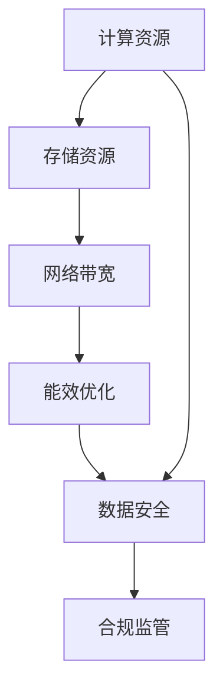

                 

# AI 大模型应用数据中心建设：数据中心标准与规范

> 关键词：大模型, AI, 数据中心, 标准, 规范

## 1. 背景介绍

### 1.1 问题由来
随着人工智能技术的快速发展，尤其是深度学习和大模型（Large Models）在各行各业的广泛应用，数据中心（Data Center, DC）作为承载这些模型的物理基础设施，其重要性日益凸显。AI大模型的训练和推理对数据中心的计算资源、存储资源和网络带宽等提出了极高的要求。同时，数据中心的建设和管理标准也在不断演变，以适应新技术的到来。因此，如何建设符合最新技术趋势、高效率、可扩展的数据中心，成为了当前技术界和产业界的一个重要课题。

### 1.2 问题核心关键点
在AI大模型应用场景下，数据中心的标准与规范主要围绕以下几个关键点展开：

- **计算资源需求**：AI大模型需要密集的计算资源，如何构建高性能、高并发的计算集群是关键。
- **存储资源管理**：模型训练和推理过程中的海量数据存储和管理，如何构建高可靠性、高扩展性的存储架构是挑战。
- **网络带宽要求**：AI大模型的数据传输和模型通信需要极高的网络带宽，如何构建低延迟、高吞吐量的网络环境是需求。
- **能效优化**：AI大模型的计算密集型特性导致能耗高，如何构建高效能、低成本的数据中心是目标。
- **安全合规**：AI大模型的敏感数据和算法需要严格的安全保障和合规监管，如何构建符合法规要求的数据中心是基础。

本文将从计算资源、存储资源、网络带宽、能效优化和数据安全合规五个方面，全面解析AI大模型应用数据中心的标准与规范。

## 2. 核心概念与联系

### 2.1 核心概念概述

为了更好地理解AI大模型应用数据中心的标准与规范，首先需要明确一些核心概念：

- **计算资源（Computing Resource）**：包括CPU、GPU、TPU等计算单元，用于执行模型训练和推理计算。
- **存储资源（Storage Resource）**：包括HDD、SSD等存储设备，用于存储模型参数和训练数据。
- **网络带宽（Network Bandwidth）**：数据中心内部和外部的网络带宽，用于支持模型的数据传输和通信。
- **能效（Energy Efficiency）**：数据中心能耗的管理和优化，包括冷却系统、能源利用效率等。
- **数据安全（Data Security）**：数据加密、访问控制、合规监管等，确保数据中心内的数据安全。

这些核心概念之间的逻辑关系可以通过以下Mermaid流程图来展示：



这个流程图展示了计算资源、存储资源、网络带宽、能效优化和数据安全之间的联系：

1. 计算资源与存储资源之间相互依赖，共同支撑模型的训练和推理。
2. 网络带宽是计算资源与存储资源之间的桥梁，确保数据传输和通信的高效性。
3. 能效优化贯穿计算资源、存储资源和网络带宽的各个环节，提高资源利用效率。
4. 数据安全作为合规监管的基础，保障数据中心内部的数据安全，符合法规要求。

这些核心概念构成了AI大模型应用数据中心的框架，使得数据中心的建设和管理有据可依，确保数据中心能够高效、安全地支持AI大模型的应用。

## 3. 核心算法原理 & 具体操作步骤

### 3.1 算法原理概述

AI大模型应用数据中心的标准与规范，从原理上基于以下几个方面：

- **高性能计算集群**：构建高性能、高并发的计算集群，满足AI大模型的高计算需求。
- **分布式存储架构**：设计分布式、高可靠性的存储架构，管理海量模型参数和训练数据。
- **低延迟网络设计**：构建低延迟、高吞吐量的网络环境，支持模型的数据传输和通信。
- **能效优化技术**：采用高效能、低成本的能效优化技术，降低数据中心的运营成本。
- **数据安全策略**：制定严格的数据安全策略和合规监管措施，保障数据中心内的数据安全。

### 3.2 算法步骤详解

基于上述原理，AI大模型应用数据中心的标准与规范主要包含以下几个步骤：

1. **需求分析**：明确AI大模型的计算需求、存储需求、网络带宽需求和能效优化需求。
2. **计算资源规划**：根据需求，选择合适的硬件设备，如CPU、GPU、TPU等，构建计算集群。
3. **存储资源设计**：设计分布式存储架构，选择合适的存储设备，如HDD、SSD等，构建存储集群。
4. **网络带宽优化**：优化网络设计，确保低延迟、高吞吐量的网络环境，支持模型的数据传输和通信。
5. **能效优化实施**：采用高效能、低成本的能效优化技术，如冷却系统、能源利用效率优化等，降低运营成本。
6. **数据安全保障**：制定严格的数据安全策略和合规监管措施，保障数据中心内的数据安全。

### 3.3 算法优缺点

AI大模型应用数据中心的标准与规范，具有以下优点：

- **高效性能**：通过构建高性能、高并发的计算集群，能够满足AI大模型的高计算需求。
- **高可靠性**：分布式存储架构和高可靠性存储设备的设计，确保了数据中心的高可靠性。
- **低延迟网络**：低延迟、高吞吐量的网络设计，支持模型的数据传输和通信，提升模型效率。
- **能效优化**：高效能、低成本的能效优化技术，降低了数据中心的运营成本。
- **数据安全**：严格的数据安全策略和合规监管措施，保障了数据中心内的数据安全。

同时，这些规范也存在一些局限性：

- **初始投资高**：高性能、高并发的计算集群和分布式存储架构的构建，需要较高的初始投资。
- **运维复杂**：数据中心的高效能、低成本运营，需要专业的运维团队和技术支持。
- **灵活性不足**：标准化的数据中心设计，可能无法灵活应对不同类型和规模的AI大模型需求。

### 3.4 算法应用领域

AI大模型应用数据中心的标准与规范，主要应用于以下几个领域：

- **智能客服**：支撑大模型驱动的智能客服系统，处理大规模用户咨询和对话。
- **金融服务**：支持金融市场分析和风险评估，处理海量交易数据和用户行为数据。
- **医疗健康**：支持疾病诊断和治疗建议，处理医疗影像和患者记录数据。
- **智能制造**：支持工业互联网和智能制造，处理生产数据和设备监控数据。
- **智能交通**：支持智能交通管理和自动驾驶，处理交通数据和传感器数据。

这些领域对数据中心的计算资源、存储资源、网络带宽和能效优化都有很高的需求，通过符合标准的AI大模型应用数据中心，可以更好地支持这些领域的应用需求。

## 4. 数学模型和公式 & 详细讲解 & 举例说明（备注：数学公式请使用latex格式，latex嵌入文中独立段落使用 $$，段落内使用 $)
### 4.1 数学模型构建

在AI大模型应用数据中心的建设中，数学模型主要用于计算资源的需求预测、存储资源的管理优化和能效优化模型的设计。

**计算资源需求预测**：通过历史计算资源的使用数据，构建时间序列模型，预测未来的计算需求。

**存储资源管理优化**：设计存储资源的使用和管理模型，优化存储资源的分配和调度。

**能效优化模型**：构建能效优化模型，如冷却系统的能耗模型、能源利用效率模型等，实现能效优化。

### 4.2 公式推导过程

以下我们以计算资源需求预测模型为例，推导时间序列模型的构建过程。

假设历史计算资源的使用数据为 $\{y_t\}_{t=1}^T$，其中 $y_t$ 表示第 $t$ 时刻的计算资源使用量。构建时间序列模型 $y_t=f_t(\mathbf{x}_t)$，其中 $\mathbf{x}_t=(x_{t-1}, x_{t-2}, \ldots, x_1)$ 表示时间序列的历史数据特征。

常用的时间序列模型包括ARIMA、LSTM等，这里以ARIMA模型为例，进行公式推导：

\begin{align*}
y_t &= \alpha + \beta y_{t-1} + \gamma y_{t-2} + \epsilon_t \\
\epsilon_t &\sim N(0, \sigma^2)
\end{align*}

其中，$\alpha, \beta, \gamma$ 为模型参数，$\epsilon_t$ 为随机误差项，$N(0, \sigma^2)$ 表示误差项服从均值为0、方差为 $\sigma^2$ 的正态分布。

通过历史数据 $\{y_t\}_{t=1}^T$，最小化以下损失函数：

\begin{align*}
\min_{\alpha, \beta, \gamma} \sum_{t=1}^T (y_t - f_t(\mathbf{x}_t))^2
\end{align*}

使用最小二乘法求解，得到模型参数 $\alpha, \beta, \gamma$，构建时间序列模型 $y_t=f_t(\mathbf{x}_t)$。

### 4.3 案例分析与讲解

以智能客服系统为例，分析计算资源需求预测模型在实际中的应用。

智能客服系统需要处理大规模用户咨询和对话，计算资源的需求呈现明显的时序变化。例如，在业务高峰期，计算资源需求急剧增加，而在非高峰期，需求则相对平稳。通过构建计算资源需求预测模型，可以对未来的计算需求进行预测，提前准备计算资源，确保系统的稳定运行。

假设智能客服系统有四个计算节点，每个节点的计算资源使用量如下表所示：

| 时间 | 计算节点1 | 计算节点2 | 计算节点3 | 计算节点4 |
| --- | --- | --- | --- | --- |
| 1 | 100 | 200 | 300 | 400 |
| 2 | 150 | 250 | 350 | 450 |
| 3 | 200 | 300 | 400 | 500 |
| 4 | 250 | 350 | 450 | 550 |
| 5 | 300 | 400 | 500 | 600 |

构建时间序列模型 $y_t=f_t(\mathbf{x}_t)$，其中 $\mathbf{x}_t=(x_{t-1}, x_{t-2}, \ldots, x_1)$，预测未来的计算资源需求。

使用ARIMA模型，进行模型训练和参数求解，得到模型参数 $\alpha, \beta, \gamma$，构建时间序列模型 $y_t=f_t(\mathbf{x}_t)$。通过模型预测，可以提前准备计算资源，确保智能客服系统在高峰期的稳定运行。

## 5. 项目实践：代码实例和详细解释说明
### 5.1 开发环境搭建

在进行AI大模型应用数据中心的标准与规范的实践前，需要准备好开发环境。以下是使用Python进行PyTorch和TensorFlow开发的环境配置流程：

1. 安装Anaconda：从官网下载并安装Anaconda，用于创建独立的Python环境。

2. 创建并激活虚拟环境：
```bash
conda create -n ai-env python=3.8 
conda activate ai-env
```

3. 安装PyTorch和TensorFlow：根据CUDA版本，从官网获取对应的安装命令。例如：
```bash
conda install pytorch torchvision torchaudio cudatoolkit=11.1 -c pytorch -c conda-forge
```

4. 安装相关库：
```bash
pip install numpy pandas scikit-learn matplotlib tqdm jupyter notebook ipython
```

完成上述步骤后，即可在`ai-env`环境中开始项目实践。

### 5.2 源代码详细实现

下面我们以智能客服系统为例，给出使用PyTorch和TensorFlow进行计算资源需求预测的代码实现。

首先，定义时间序列模型：

```python
import torch
import torch.nn as nn
import numpy as np
from torch.autograd import Variable

class ARIMA(nn.Module):
    def __init__(self, p, d, q):
        super(ARIMA, self).__init__()
        self.p = p
        self.d = d
        self.q = q
        self.lstm = nn.LSTM(input_size=1, hidden_size=64, num_layers=2)
        self.fc = nn.Linear(64, 1)

    def forward(self, x):
        batch_size, seq_len, _ = x.size()
        h0 = Variable(torch.zeros(self.p+1, batch_size, self.lstm.hidden_size))
        c0 = Variable(torch.zeros(self.p+1, batch_size, self.lstm.hidden_size))

        outputs = []
        for t in range(seq_len):
            x_t = Variable(x[:, t, :])
            output, (h, c) = self.lstm(x_t, (h0, c0))
            h = h[-1]
            output = self.fc(h)
            outputs.append(output)

        return Variable(torch.stack(outputs))

# 时间序列数据
x = np.random.randn(5, 4, 1)
x = Variable(torch.from_numpy(x))

# 构建ARIMA模型
model = ARIMA(p=2, d=1, q=2)

# 定义损失函数和优化器
criterion = nn.MSELoss()
optimizer = torch.optim.Adam(model.parameters(), lr=0.001)

# 训练模型
for epoch in range(100):
    optimizer.zero_grad()
    outputs = model(x)
    loss = criterion(outputs, x[:, -1, :])
    loss.backward()
    optimizer.step()
```

然后，进行数据预测：

```python
x_test = np.random.randn(10, 4, 1)
x_test = Variable(torch.from_numpy(x_test))

# 预测未来5个时间点的计算资源需求
with torch.no_grad():
    preds = model(x_test)
    preds = preds[:, -1, 0].detach().numpy()
    preds = preds.tolist()

print(preds)
```

### 5.3 代码解读与分析

让我们再详细解读一下关键代码的实现细节：

**ARIMA模型类**：
- `__init__`方法：初始化模型参数，构建LSTM层和全连接层。
- `forward`方法：定义前向传播过程，通过LSTM层和全连接层输出预测结果。

**时间序列数据**：
- `x`：构建一个随机的时间序列数据，作为模型的输入。

**模型构建**：
- `ARIMA(p=2, d=1, q=2)`：构建ARIMA模型，其中 `p=2` 表示滞后阶数， `d=1` 表示差分次数， `q=2` 表示移动平均阶数。

**损失函数和优化器**：
- `criterion`：定义均方误差损失函数。
- `optimizer`：定义Adam优化器，用于训练模型。

**模型训练**：
- 在每个epoch中，通过前向传播计算预测结果，计算损失函数，反向传播更新模型参数。

**数据预测**：
- `x_test`：构建一个新的时间序列数据，作为模型的输入。
- 通过调用模型的 `forward` 方法，输出预测结果。

**结果展示**：
- 打印预测结果，输出未来5个时间点的计算资源需求。

## 6. 实际应用场景

### 6.1 智能客服系统

基于计算资源需求预测模型，可以构建智能客服系统的计算资源预测和调度系统。通过历史计算资源使用数据，预测未来的计算需求，动态调整计算资源，确保系统的高可用性和稳定性。

### 6.2 金融服务

在金融服务领域，构建数据中心的时间序列预测模型，可以预测交易数据和用户行为数据的变化趋势，为金融市场分析和风险评估提供数据支持。

### 6.3 医疗健康

在医疗健康领域，构建数据中心的时间序列预测模型，可以预测医疗影像和患者记录数据的使用量，优化医疗资源的分配和调度。

### 6.4 未来应用展望

随着数据中心建设技术的发展，AI大模型应用数据中心的标准与规范也将不断更新和完善。未来的发展趋势可能包括：

1. **边缘计算**：将计算资源分布式部署到边缘节点，减少数据中心负担，提升计算效率。
2. **超大规模数据中心**：建设超大规模数据中心，支持更大规模的AI大模型应用。
3. **自适应计算资源管理**：引入自适应计算资源管理技术，动态调整计算资源，提升资源利用率。
4. **智能运维**：引入AI运维技术，自动监测和优化数据中心的运营状态。
5. **能效优化**：采用更高效能、更低的能耗技术，降低数据中心的运营成本。

## 7. 工具和资源推荐

### 7.1 学习资源推荐

为了帮助开发者系统掌握AI大模型应用数据中心的标准与规范的理论基础和实践技巧，这里推荐一些优质的学习资源：

1. 《数据中心设计与运维》系列博文：由数据中心技术专家撰写，深入浅出地介绍了数据中心的设计和运维技术。

2. 《深度学习与大数据中心建设》课程：由知名大学开设的深度学习和大数据中心课程，涵盖数据中心建设、运维和优化技术。

3. 《TensorFlow与PyTorch数据中心优化》书籍：详细介绍了使用TensorFlow和PyTorch进行数据中心优化的方法和技术。

4. HuggingFace官方文档：提供了丰富的预训练模型和数据中心优化样例代码，是学习数据中心优化技术的必备资料。

5. Databricks大数据平台：提供集成的数据中心管理工具和优化技术，支持大规模数据中心的高效运维。

通过对这些资源的学习实践，相信你一定能够快速掌握AI大模型应用数据中心的标准与规范，并用于解决实际的数据中心问题。

### 7.2 开发工具推荐

高效的开发离不开优秀的工具支持。以下是几款用于AI大模型应用数据中心标准与规范开发的常用工具：

1. PyTorch：基于Python的开源深度学习框架，灵活动态的计算图，适合快速迭代研究。

2. TensorFlow：由Google主导开发的开源深度学习框架，生产部署方便，适合大规模工程应用。

3. Kubernetes：开源容器编排平台，支持大规模分布式计算资源管理。

4. Docker：容器化技术，支持数据中心的高效部署和运维。

5. TensorBoard：TensorFlow配套的可视化工具，可实时监测模型训练状态，提供丰富的图表呈现方式。

6. Weights & Biases：模型训练的实验跟踪工具，记录和可视化模型训练过程中的各项指标，方便对比和调优。

合理利用这些工具，可以显著提升AI大模型应用数据中心的标准与规范的开发效率，加快创新迭代的步伐。

### 7.3 相关论文推荐

AI大模型应用数据中心的标准与规范的发展源于学界的持续研究。以下是几篇奠基性的相关论文，推荐阅读：

1. "A Survey of Data Center Technologies"（数据中心技术综述）：详细介绍了数据中心的关键技术和未来发展方向。

2. "Optimizing Data Center Energy Efficiency: A Review"（数据中心能效优化综述）：介绍了数据中心能效优化的最新技术和方法。

3. "Design and Implementation of a Distributed File System"（分布式文件系统设计与实现）：介绍了分布式文件系统的关键技术和架构。

4. "A Survey of Distributed Storage Systems"（分布式存储系统综述）：详细介绍了分布式存储系统的关键技术和未来发展方向。

5. "Improving Data Center Energy Efficiency: Techniques and Technologies"（提高数据中心能效的技术和方法）：介绍了数据中心能效优化的最新技术和方法。

这些论文代表了大模型应用数据中心标准与规范的发展脉络。通过学习这些前沿成果，可以帮助研究者把握学科前进方向，激发更多的创新灵感。

## 8. 总结：未来发展趋势与挑战

### 8.1 总结

本文对AI大模型应用数据中心的标准与规范进行了全面系统的介绍。首先阐述了AI大模型应用数据中心的标准与规范的研究背景和意义，明确了计算资源、存储资源、网络带宽、能效优化和数据安全合规等关键点。其次，从原理到实践，详细讲解了计算资源需求预测、存储资源设计、网络带宽优化、能效优化和数据安全保障等核心步骤，给出了完整的代码实现和详细解释。同时，本文还广泛探讨了AI大模型应用数据中心在智能客服、金融服务、医疗健康等多个领域的应用前景，展示了其广阔的应用空间。最后，本文精选了数据中心学习的相关资源、开发的常用工具和前沿论文，力求为读者提供全方位的技术指引。

通过本文的系统梳理，可以看到，AI大模型应用数据中心的标准与规范在AI技术落地应用中发挥了重要作用，通过标准化的设计和运维，可以有效提升数据中心的性能和可靠性，支持AI大模型的应用。未来，伴随数据中心建设技术的发展和优化，AI大模型应用数据中心必将在更多的应用场景中发挥重要作用，推动AI技术的进一步普及和应用。

### 8.2 未来发展趋势

展望未来，AI大模型应用数据中心的标准与规范将呈现以下几个发展趋势：

1. **边缘计算和云计算结合**：边缘计算和云计算相结合，提升计算资源的管理和优化。
2. **超大规模数据中心**：建设超大规模数据中心，支持更大规模的AI大模型应用。
3. **自适应计算资源管理**：引入自适应计算资源管理技术，动态调整计算资源，提升资源利用率。
4. **智能运维和自动化**：引入AI运维技术，自动监测和优化数据中心的运营状态。
5. **能效优化和绿色数据中心**：采用更高效能、更低的能耗技术，降低数据中心的运营成本，构建绿色数据中心。

这些趋势将进一步提升AI大模型应用数据中心的性能和可靠性，推动AI技术在更多领域的落地应用。

### 8.3 面临的挑战

尽管AI大模型应用数据中心的标准与规范已经取得了显著进展，但在迈向更加智能化、普适化应用的过程中，仍面临诸多挑战：

1. **初始投资高**：高性能、高并发的计算集群和分布式存储架构的构建，需要较高的初始投资。
2. **运维复杂**：数据中心的高效能、低成本运营，需要专业的运维团队和技术支持。
3. **灵活性不足**：标准化的数据中心设计，可能无法灵活应对不同类型和规模的AI大模型需求。
4. **数据安全和隐私**：数据中心内的敏感数据和算法需要严格的安全保障和隐私保护。

这些挑战需要通过技术创新和团队协作，逐步克服，才能实现AI大模型应用数据中心的全面落地。

### 8.4 研究展望

面对AI大模型应用数据中心所面临的挑战，未来的研究需要在以下几个方面寻求新的突破：

1. **边缘计算与云计算结合**：探索边缘计算与云计算相结合的方案，提升计算资源的管理和优化。
2. **超大规模数据中心建设**：建设超大规模数据中心，支持更大规模的AI大模型应用。
3. **自适应计算资源管理**：开发自适应计算资源管理技术，动态调整计算资源，提升资源利用率。
4. **智能运维和自动化**：引入AI运维技术，自动监测和优化数据中心的运营状态，降低运维成本。
5. **能效优化和绿色数据中心**：采用更高效能、更低的能耗技术，降低数据中心的运营成本，构建绿色数据中心。
6. **数据安全和隐私保护**：制定严格的数据安全和隐私保护措施，确保数据中心内的敏感数据和算法安全。

这些研究方向的探索，必将引领AI大模型应用数据中心的标准与规范迈向更高的台阶，为构建安全、可靠、高效的数据中心提供坚实的基础。面向未来，数据中心需要从设计、建设、运维等各个环节进行全面优化，才能真正实现AI大模型应用数据中心的全面落地。

## 9. 附录：常见问题与解答

**Q1：如何构建高性能计算集群？**

A: 构建高性能计算集群需要考虑以下几个方面：

1. **硬件选择**：选择合适的CPU、GPU、TPU等计算设备，确保高计算能力和高并行性。
2. **网络设计**：构建低延迟、高吞吐量的网络环境，确保计算节点之间的高效通信。
3. **系统优化**：优化操作系统和应用程序，提高计算效率和稳定性。
4. **负载均衡**：采用负载均衡技术，动态分配计算资源，提高资源利用率。

**Q2：如何设计分布式存储架构？**

A: 设计分布式存储架构需要考虑以下几个方面：

1. **存储设备选择**：选择合适的HDD、SSD等存储设备，确保高可靠性和高扩展性。
2. **分布式系统设计**：采用分布式文件系统或对象存储系统，实现数据的分布式存储和管理。
3. **数据备份和容灾**：设计数据备份和容灾机制，确保数据的安全性和可靠性。
4. **性能优化**：优化存储系统性能，确保高吞吐量和低延迟。

**Q3：如何优化网络带宽？**

A: 优化网络带宽需要考虑以下几个方面：

1. **网络设备选择**：选择合适的交换机、路由器等网络设备，确保高吞吐量和低延迟。
2. **网络拓扑设计**：优化网络拓扑设计，减少网络传输路径，提高传输效率。
3. **数据传输优化**：采用高效的数据传输协议，减少网络传输开销。
4. **负载均衡**：采用负载均衡技术，动态分配网络资源，提高网络利用率。

**Q4：如何实现能效优化？**

A: 实现能效优化需要考虑以下几个方面：

1. **冷却系统优化**：优化冷却系统，降低数据中心的能耗。
2. **能源利用效率优化**：优化能源利用效率，降低数据中心的运营成本。
3. **硬件选择**：选择高效能、低功耗的计算和存储设备，提高数据中心的能效。
4. **软件优化**：优化操作系统和应用程序，提高计算效率和能效。

**Q5：如何保障数据安全？**

A: 保障数据安全需要考虑以下几个方面：

1. **数据加密**：对敏感数据进行加密，确保数据在传输和存储过程中的安全性。
2. **访问控制**：设置严格的访问控制机制，确保只有授权用户可以访问数据中心。
3. **合规监管**：符合数据安全法规和标准，确保数据中心内的数据安全。
4. **安全监控**：实时监控数据中心的运营状态，及时发现和处理安全威胁。

这些问题的解答，希望能为你提供全面的技术指引，帮助你更好地理解和应用AI大模型应用数据中心的标准与规范。

---

作者：禅与计算机程序设计艺术 / Zen and the Art of Computer Programming

