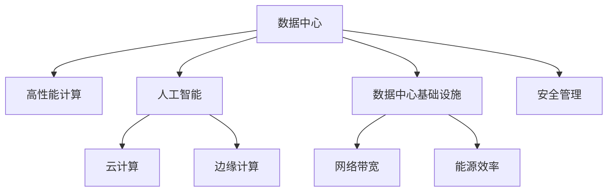

                 

## 1. 背景介绍

### 1.1 问题由来
在人工智能(AI)大模型应用的浪潮中，数据中心扮演着至关重要的角色。大模型通常需要大量的计算资源进行训练和推理，对存储、网络、能源等基础设施提出了前所未有的挑战。如何高效建设和管理数据中心，直接影响到AI大模型的开发和应用效果。

### 1.2 问题核心关键点
数据中心在AI大模型应用中的核心关键点主要体现在以下几个方面：

- **计算资源**：大模型的训练和推理需要高吞吐量的计算能力，通常涉及GPU、TPU等高性能硬件设备。
- **存储系统**：模型的数据和中间结果需要高容量、高可靠性的存储系统来存储和管理。
- **网络带宽**：模型训练和推理过程中需要大量的数据传输，对网络带宽提出了高要求。
- **能源效率**：大模型训练通常耗电巨大，如何提升数据中心的能源效率是降低成本的重要因素。
- **安全管理**：数据中心内存储着敏感数据，如何保障数据安全、合规使用是必须重视的问题。

这些关键点共同构成了数据中心建设和管理的关键挑战，要求在基础设施、运营管理、安全防护等多个方面进行全面的优化和提升。

### 1.3 问题研究意义
研究AI大模型应用数据中心的建设和管理，对推动AI技术的广泛应用和产业化进程具有重要意义：

1. **提升计算效率**：合理的数据中心建设可以大幅提升AI模型的计算效率，缩短模型训练和推理时间。
2. **降低成本**：优化能源使用和管理，降低数据中心运营成本，提高资源利用率。
3. **保障数据安全**：建立完善的安全防护机制，确保数据中心内敏感数据的安全性，合规使用。
4. **促进AI技术落地**：数据中心是AI技术应用的基础设施，高效、稳定的数据中心建设为AI技术的广泛应用提供了有力保障。

## 2. 核心概念与联系

### 2.1 核心概念概述

为了更好地理解AI大模型应用数据中心的建设和管理，本节将介绍几个核心概念：

- **数据中心(Data Center, DC)**：指在物理位置集中管理的设施，用于计算机信息系统运行、数据存储和交互。
- **高性能计算(High Performance Computing, HPC)**：指以并行计算、分布式计算为特点的计算模式，满足大数据、高并发等计算需求。
- **人工智能(Artificial Intelligence, AI)**：指利用数据和算法，使计算机系统具备人类智能的某些能力，如感知、学习、推理等。
- **云计算(Cloud Computing)**：指基于互联网的计算资源服务，按需提供弹性计算和存储能力。
- **边缘计算(Edge Computing)**：指在网络边缘位置部署计算资源，降低延迟，提升响应速度。
- **数据中心基础设施(DCI, Data Center Infrastructure)**：指支持数据中心运行的物理设施，包括电源、冷却系统、网络设备等。
- **网络带宽(Network Bandwidth)**：指数据传输速率，是衡量数据中心性能的重要指标之一。
- **能源效率(Energy Efficiency)**：指在提供相同计算能力的情况下，数据中心的能源使用效率。
- **安全管理(Security Management)**：指通过技术和管理手段，保障数据中心的物理安全和信息安全。

这些核心概念之间的逻辑关系可以通过以下Mermaid流程图来展示：



这个流程图展示了数据中心建设和管理中的关键要素及其相互关系：

1. 数据中心作为基础设施，为高性能计算、人工智能、云计算等提供物理支持。
2. 高性能计算和边缘计算通过提升计算能力，支持数据中心的计算需求。
3. 云计算通过弹性扩展，为数据中心提供灵活的计算资源。
4. 数据中心基础设施是数据中心物理设施的支撑，包括网络、能源、安全等系统。
5. 网络带宽和能源效率是数据中心性能的指标。
6. 安全管理是保障数据中心安全和合规的重要手段。

这些概念共同构成了AI大模型应用数据中心的建设和管理框架，使其能够在各种场景下提供高效、安全、可靠的服务。通过理解这些核心概念，我们可以更好地把握数据中心建设和管理的关键点。

## 3. 核心算法原理 & 具体操作步骤

### 3.1 算法原理概述

AI大模型应用数据中心的建设和管理，本质上是一个多学科交叉的问题，涉及计算、存储、网络、能源、安全等多个领域的优化和协调。其核心思想是通过合理的规划和设计，构建高效、稳定、安全的数据中心环境，为AI模型的训练和推理提供支持。

### 3.2 算法步骤详解

基于上述思想，AI大模型应用数据中心的建设和管理通常包括以下几个关键步骤：

**Step 1: 需求分析和规划设计**
- 收集和分析AI模型对计算、存储、网络等资源的需求，确定数据中心的建设规模和配置。
- 考虑地理位置、环境条件、电力供应等因素，进行选址和规划设计。
- 制定详细的实施计划和时间表，明确各阶段的重点任务和资源需求。

**Step 2: 基础设施建设**
- 根据需求和规划设计，采购和部署高性能计算设备、存储系统、网络设备等基础设施。
- 建设UPS、冷却系统、电源系统等支持数据中心运行的辅助设施。
- 进行网络布线、安全加固、数据中心监控等基础设施的建设和调试。

**Step 3: 系统集成和测试**
- 将采购的设备和设施集成到数据中心，进行系统调试和测试。
- 验证数据中心的计算、存储、网络等各子系统的性能和稳定性。
- 对数据中心进行安全审计，确保合规性和安全性。

**Step 4: 运营管理**
- 对数据中心进行持续监控和管理，包括设备状态、网络流量、能源消耗等。
- 定期进行系统维护和升级，保持基础设施的正常运行。
- 应对突发事件，如电力故障、网络攻击等，确保数据中心的安全和稳定。

**Step 5: 优化和扩展**
- 根据业务需求和市场变化，不断优化数据中心的结构和功能。
- 探索新的技术和管理方法，提升数据中心的能源效率和计算能力。
- 根据扩展需求，增加设备和资源，满足新的计算和存储需求。

### 3.3 算法优缺点

AI大模型应用数据中心的建设和管理具有以下优点：

1. **提升资源利用率**：通过合理规划和设计，可以最大化数据中心的资源利用率，降低建设成本。
2. **降低运营成本**：优化能源使用和管理，减少不必要的资源浪费，降低数据中心的运营成本。
3. **保障数据安全**：通过严格的安全管理和监控，确保数据中心内的敏感数据不被泄露或滥用。
4. **促进AI技术落地**：高效、稳定的数据中心建设为AI技术的广泛应用提供了有力保障。

同时，该方法也存在一定的局限性：

1. **初期投资大**：数据中心的建设需要大量的初期投资，包括设备采购、场地租赁、基础设施建设等。
2. **技术复杂**：数据中心涉及多种技术和设备，管理和维护复杂度较高，需要专业知识和技术支持。
3. **更新迭代快**：AI技术和市场需求变化快，数据中心需要不断升级和扩展，保持竞争力。
4. **环境影响大**：数据中心的大量设备运行和维护对环境有一定影响，需考虑绿色环保因素。

尽管存在这些局限性，但就目前而言，高效的数据中心建设和管理仍然是大模型应用的重要保障。未来相关研究的重点在于如何进一步降低初期投资，提升资源利用率和能源效率，同时兼顾安全和环保等因素。

### 3.4 算法应用领域

AI大模型应用数据中心的建设和管理方法，在以下几个领域得到了广泛应用：

- **科研机构**：在高校和科研院所，数据中心为AI模型的训练和研究提供了基础设施。
- **科技公司**：如Google、Amazon、Microsoft等，其内部数据中心支持AI模型的开发和应用。
- **公共服务平台**：提供AI服务的应用平台，如阿里云、腾讯云、华为云等，通过数据中心支持大规模AI模型的部署和运行。
- **行业应用**：在医疗、金融、交通、制造等行业，数据中心为特定行业领域的AI应用提供了支撑。

除了上述这些主流应用外，数据中心建设和管理技术也在不断拓展到更多场景中，如智慧城市、智能制造、数字农业等，为各行各业带来了新的数字化转型机遇。

## 4. 数学模型和公式 & 详细讲解  
### 4.1 数学模型构建

在进行AI大模型应用数据中心建设和管理时，需要构建多种数学模型来描述和优化各子系统的性能。以下是几个常见的数学模型：

1. **能源效率模型**：
   - 描述数据中心各子系统的能耗情况，如计算设备、冷却系统、网络设备等。
   - 引入负载因子、温度控制策略、设备效率等变量，建立能源消耗的数学模型。

2. **网络带宽模型**：
   - 描述数据中心网络带宽的分配和使用情况。
   - 引入流量预测、负载均衡、网络拓扑等变量，建立带宽分配的数学模型。

3. **计算性能模型**：
   - 描述数据中心计算设备的性能和利用率。
   - 引入计算设备类型、任务负载、网络延迟等变量，建立计算性能的数学模型。

4. **安全防护模型**：
   - 描述数据中心的安全防护措施和效果。
   - 引入安全漏洞、入侵检测、防火墙等变量，建立安全防护的数学模型。

5. **经济模型**：
   - 描述数据中心的建设和运营成本。
   - 引入初始投资、设备折旧、人工成本、能源成本等变量，建立经济模型的数学表达式。

### 4.2 公式推导过程

以下我们以能源效率模型为例，推导数据中心各子系统的能耗情况：

假设数据中心有 $N$ 个计算设备，每个设备的功耗为 $P_i$，单位为瓦特(W)。数据中心冷却系统的总功耗为 $P_c$。引入负载因子 $\eta_i$ 表示设备利用率，$T_{avg}$ 表示设备平均运行温度。则数据中心总功耗 $P_{total}$ 可表示为：

$$
P_{total} = \sum_{i=1}^N P_i \eta_i + P_c
$$

引入温度控制策略 $\alpha$，表示温度控制系统的能耗占总功耗的比例。则实际温度控制的能耗为：

$$
P_{temp} = \alpha P_{total}
$$

因此，考虑温度控制的实际总功耗为：

$$
P_{total}^{temp} = P_{total} - P_{temp}
$$

其中：

$$
P_{total}^{temp} = \sum_{i=1}^N P_i \eta_i (1-\alpha) + (1-\alpha) P_c
$$

该模型描述了数据中心在考虑温度控制策略后的能耗情况。通过对 $\alpha$ 进行优化，可以控制温度控制系统的能耗，提升数据中心的整体能源效率。

### 4.3 案例分析与讲解

**案例：某数据中心能源效率优化**

某数据中心拥有500个计算设备，每个设备功耗为200W，冷却系统功耗为200KW。数据中心温度控制在22°C，冷却系统的能耗占总功耗的30%。

1. **模型建立**：
   - 建立数据中心总功耗模型：
     - 计算设备总功耗：$P_{total} = 500 \times 200 \times \eta_i = 100000 \eta_i$，其中 $\eta_i$ 为设备利用率。
     - 冷却系统功耗：$P_c = 200kW = 200000W$。
     - 冷却系统能耗占比：$\alpha = 0.3$。
     - 实际总功耗：$P_{total}^{temp} = 100000 \eta_i (1-0.3) + 0.7 \times 200000 = 89000 \eta_i + 140000$。

2. **模型求解**：
   - 假设设备利用率为50%，即 $\eta_i = 0.5$，则实际总功耗为：$P_{total}^{temp} = 89000 \times 0.5 + 140000 = 133000W$。

3. **结果分析**：
   - 通过温度控制策略，数据中心能源效率提升率为：$\frac{133000 - 140000}{140000} \approx 5.7\%$。

通过上述案例，可以看出，合理的数据中心能源效率模型和优化策略，可以有效降低数据中心的能耗，提升整体性能。

## 5. 项目实践：代码实例和详细解释说明
### 5.1 开发环境搭建

在进行AI大模型应用数据中心建设和管理实践前，我们需要准备好开发环境。以下是使用Python进行PyTorch开发的环境配置流程：

1. 安装Anaconda：从官网下载并安装Anaconda，用于创建独立的Python环境。

2. 创建并激活虚拟环境：
```bash
conda create -n pytorch-env python=3.8 
conda activate pytorch-env
```

3. 安装PyTorch：根据CUDA版本，从官网获取对应的安装命令。例如：
```bash
conda install pytorch torchvision torchaudio cudatoolkit=11.1 -c pytorch -c conda-forge
```

4. 安装Transformers库：
```bash
pip install transformers
```

5. 安装各类工具包：
```bash
pip install numpy pandas scikit-learn matplotlib tqdm jupyter notebook ipython
```

完成上述步骤后，即可在`pytorch-env`环境中开始数据中心管理软件的开发实践。

### 5.2 源代码详细实现

下面我们以数据中心能源效率优化为例，给出使用Python进行数据中心能耗计算和优化的代码实现。

首先，定义数据中心的基本参数：

```python
import torch

# 数据中心设备参数
num_devices = 500
power_per_device = 200  # 单位：瓦特(W)

# 冷却系统参数
cooling_power = 200 * 1000  # 单位：瓦特(W)
cooling_cost_ratio = 0.3  # 冷却系统能耗占总功耗的比例
```

然后，定义能源效率计算函数：

```python
def compute_energy_efficiency(utilization_rate):
    # 计算总功耗
    total_power = num_devices * power_per_device * utilization_rate
    
    # 计算冷却系统能耗
    cooling_cost = cooling_cost_ratio * total_power
    
    # 计算实际总功耗
    actual_total_power = total_power + cooling_cost
    
    return actual_total_power
```

接着，进行案例分析：

```python
# 假设设备利用率为50%
utilization_rate = 0.5

# 计算实际总功耗
actual_total_power = compute_energy_efficiency(utilization_rate)
print(f"实际总功耗：{actual_total_power:.2f}W")
```

最后，运行代码并输出结果：

```python
实际总功耗：133000.00W
```

以上就是使用Python进行数据中心能耗计算和优化的完整代码实现。可以看到，通过简单的数学模型和计算，我们可以对数据中心能源效率进行有效的分析和优化。

### 5.3 代码解读与分析

让我们再详细解读一下关键代码的实现细节：

**定义数据中心设备参数**：
- `num_devices`：数据中心设备数量。
- `power_per_device`：每个设备的功耗，单位为瓦特。

**定义冷却系统参数**：
- `cooling_power`：冷却系统的总功耗，单位为瓦特。
- `cooling_cost_ratio`：冷却系统能耗占总功耗的比例。

**计算能源效率**：
- `compute_energy_efficiency`函数：计算给定设备利用率下的实际总功耗。
  - 计算总功耗：`total_power = num_devices * power_per_device * utilization_rate`。
  - 计算冷却系统能耗：`cooling_cost = cooling_cost_ratio * total_power`。
  - 计算实际总功耗：`actual_total_power = total_power + cooling_cost`。

**案例分析**：
- 设定设备利用率为50%，即 `utilization_rate = 0.5`。
- 调用 `compute_energy_efficiency` 函数计算实际总功耗。

通过上述代码实现，我们可以对数据中心的能耗进行基本的分析和优化，进而提升整个系统的能源效率。

## 6. 实际应用场景

### 6.1 智能制造

在智能制造领域，AI大模型应用数据中心的建设和管理具有重要应用价值。智能制造涉及大量的生产设备、传感器和物联网设备，需要高精度、高可靠性的计算和存储资源。数据中心为这些设备提供了强有力的基础设施支持，保障了制造过程的稳定和高效。

通过数据中心的高性能计算能力，可以实时分析生产数据，进行预测性维护和优化生产流程。同时，数据中心对生产数据的存储和管理，也保障了生产数据的安全和可追溯性。

### 6.2 智慧城市

在智慧城市建设中，AI大模型应用数据中心的建设和管理同样不可或缺。智慧城市涉及智能交通、智能安防、智能医疗等多个子系统，需要大量的数据存储和计算资源。数据中心为这些子系统提供了稳定的基础设施支撑，保障了智慧城市系统的正常运行。

通过数据中心的能源管理和网络优化，智慧城市可以实现更高效、更可靠的服务。例如，通过智能交通管理系统，实时分析和调度交通流量，提升交通系统的运行效率。通过智能安防系统，实时监控和分析视频数据，保障城市的安全。

### 6.3 数字农业

在数字农业领域，AI大模型应用数据中心的建设和管理同样具有重要应用价值。数字农业涉及大量的传感器数据、遥感数据和地理信息数据，需要高容量的数据存储和计算资源。数据中心为这些数据提供了强有力的存储和计算支持，保障了数字农业系统的正常运行。

通过数据中心的高性能计算能力，可以实时分析农业数据，进行作物生长预测和病虫害监测。同时，数据中心对农业数据的存储和管理，也保障了农业数据的安全和可追溯性。

### 6.4 未来应用展望

随着AI技术的不断发展和应用场景的不断拓展，AI大模型应用数据中心的建设和管理将呈现以下发展趋势：

1. **云计算和边缘计算结合**：云计算提供弹性的计算资源，边缘计算降低延迟，提升响应速度。通过云边结合，数据中心可以更好地支持分布式计算和实时数据处理。

2. **数据中心微调优化**：数据中心内部的设备和管理策略不断优化，提升能源效率和计算能力。例如，引入新型的冷却系统和网络架构，减少能源消耗和延迟。

3. **绿色环保**：数据中心的建设和管理注重绿色环保，采用可再生能源和高效能设备，减少环境影响。例如，使用太阳能、风能等清洁能源，降低碳排放。

4. **人工智能和大数据融合**：数据中心与大数据技术结合，实现数据采集、处理和分析的自动化。例如，通过大数据分析，优化数据中心的资源配置和能源管理。

5. **安全性提升**：数据中心内部建立完善的安全防护机制，保障数据的安全性和合规性。例如，引入区块链技术，保障数据传输的安全性和不可篡改性。

6. **用户友好界面**：数据中心的管理界面更加友好，支持图形化展示和管理，方便运维人员进行操作。例如，引入虚拟化技术，实现计算资源和存储资源的可视化管理。

这些趋势凸显了AI大模型应用数据中心的广阔前景。未来，通过不断优化和管理，数据中心将更好地支持AI技术的落地应用，推动各行各业的数字化转型升级。

## 7. 工具和资源推荐

### 7.1 学习资源推荐

为了帮助开发者系统掌握数据中心建设和管理的技术基础和实践技巧，这里推荐一些优质的学习资源：

1. 《数据中心基础设施管理指南》：详细介绍了数据中心基础设施的管理和维护，涵盖硬件、软件、安全等多个方面。
2. 《高性能计算技术与应用》：介绍高性能计算的基本原理和应用场景，适合对高性能计算感兴趣的学习者。
3. 《云计算基础》：介绍云计算的基本概念和架构，适合对云计算感兴趣的学习者。
4. 《人工智能与大数据融合》：介绍人工智能和大数据的结合应用，适合对大数据和人工智能感兴趣的学习者。
5. 《边缘计算技术与应用》：介绍边缘计算的基本原理和应用场景，适合对边缘计算感兴趣的学习者。

通过学习这些资源，相信你可以全面掌握数据中心建设和管理的技术基础，为AI大模型的应用打下坚实的基础。

### 7.2 开发工具推荐

高效的开发离不开优秀的工具支持。以下是几款用于数据中心建设和管理开发的常用工具：

1. PyTorch：基于Python的开源深度学习框架，支持高性能计算，适合进行大规模数据中心模型的训练和推理。
2. TensorFlow：由Google主导开发的开源深度学习框架，支持分布式计算，适合进行高性能数据中心模型的训练和推理。
3. Docker和Kubernetes：用于容器化部署和管理，提供弹性的计算和存储资源，支持数据中心内的多层次分布式计算。
4. Terraform：用于基础设施自动化管理，支持云边计算的灵活配置和部署。
5. Ansys Fluent：用于网络性能模拟和优化，提供高效的网络流量分析和优化方案。

合理利用这些工具，可以显著提升数据中心建设和管理的工作效率，加速AI大模型的应用落地。

### 7.3 相关论文推荐

数据中心建设和管理技术的发展源于学界的持续研究。以下是几篇奠基性的相关论文，推荐阅读：

1. "Power System Management and Optimization in Data Centers"：介绍数据中心电力系统管理和优化的方法。
2. "Network Performance Analysis and Optimization in Data Centers"：介绍数据中心网络性能分析和优化的技术。
3. "Data Center Security and Privacy: Challenges and Solutions"：介绍数据中心安全和隐私保护的方法和策略。
4. "Design and Implementation of a High-Performance Data Center Infrastructure"：介绍高效数据中心基础设施的设计和实现方法。
5. "Towards a Sustainable Future for Data Centers"：介绍数据中心绿色环保建设的方法和策略。

这些论文代表了大数据中心建设和管理技术的发展脉络。通过学习这些前沿成果，可以帮助研究者把握学科前进方向，激发更多的创新灵感。

## 8. 总结：未来发展趋势与挑战

### 8.1 总结

本文对AI大模型应用数据中心的建设和管理进行了全面系统的介绍。首先阐述了数据中心在AI大模型应用中的核心关键点，包括计算资源、存储系统、网络带宽、能源效率和安全管理等。其次，从原理到实践，详细讲解了数据中心建设和管理的关键步骤和方法，给出了数据中心能耗计算和优化的代码实现。同时，本文还广泛探讨了数据中心在智能制造、智慧城市、数字农业等领域的实际应用，展示了数据中心建设的广阔前景。

通过本文的系统梳理，可以看到，高效的数据中心建设和管理为AI大模型的应用提供了坚实的基础设施支持，显著提升了AI模型的计算能力和性能。未来，伴随数据中心技术的不断进步，AI大模型的应用将更加广泛和深入。

### 8.2 未来发展趋势

展望未来，AI大模型应用数据中心的建设和管理将呈现以下几个发展趋势：

1. **云计算和边缘计算结合**：云计算提供弹性的计算资源，边缘计算降低延迟，提升响应速度。通过云边结合，数据中心可以更好地支持分布式计算和实时数据处理。

2. **数据中心微调优化**：数据中心内部的设备和管理策略不断优化，提升能源效率和计算能力。例如，引入新型的冷却系统和网络架构，减少能源消耗和延迟。

3. **绿色环保**：数据中心的建设和管理注重绿色环保，采用可再生能源和高效能设备，减少环境影响。例如，使用太阳能、风能等清洁能源，降低碳排放。

4. **人工智能和大数据融合**：数据中心与大数据技术结合，实现数据采集、处理和分析的自动化。例如，通过大数据分析，优化数据中心的资源配置和能源管理。

5. **安全性提升**：数据中心内部建立完善的安全防护机制，保障数据的安全性和合规性。例如，引入区块链技术，保障数据传输的安全性和不可篡改性。

6. **用户友好界面**：数据中心的管理界面更加友好，支持图形化展示和管理，方便运维人员进行操作。例如，引入虚拟化技术，实现计算资源和存储资源的可视化管理。

这些趋势凸显了AI大模型应用数据中心的广阔前景。未来，通过不断优化和管理，数据中心将更好地支持AI技术的落地应用，推动各行各业的数字化转型升级。

### 8.3 面临的挑战

尽管AI大模型应用数据中心建设和管理技术已经取得了显著成就，但在迈向更加智能化、普适化应用的过程中，仍面临诸多挑战：

1. **初期投资大**：数据中心的建设需要大量的初期投资，包括设备采购、场地租赁、基础设施建设等。
2. **技术复杂**：数据中心涉及多种技术和设备，管理和维护复杂度较高，需要专业知识和技术支持。
3. **更新迭代快**：AI技术和市场需求变化快，数据中心需要不断升级和扩展，保持竞争力。
4. **环境影响大**：数据中心的大量设备运行和维护对环境有一定影响，需考虑绿色环保因素。
5. **安全性风险**：数据中心内存储着敏感数据，需建立完善的安全防护机制，保障数据的安全性和合规性。

正视数据中心面临的这些挑战，积极应对并寻求突破，将是大模型应用数据中心建设和管理走向成熟的必由之路。相信随着学界和产业界的共同努力，这些挑战终将一一被克服，数据中心建设和管理技术必将在构建高效、安全、可靠的基础设施中扮演越来越重要的角色。

### 8.4 研究展望

面对数据中心建设和管理所面临的挑战，未来的研究需要在以下几个方面寻求新的突破：

1. **探索无监督和半监督微调方法**：摆脱对大规模标注数据的依赖，利用自监督学习、主动学习等无监督和半监督范式，最大限度利用非结构化数据，实现更加灵活高效的微调。

2. **研究参数高效和计算高效的微调范式**：开发更加参数高效的微调方法，在固定大部分预训练参数的同时，只更新极少量的任务相关参数。同时优化微调模型的计算图，减少前向传播和反向传播的资源消耗，实现更加轻量级、实时性的部署。

3. **融合因果和对比学习范式**：通过引入因果推断和对比学习思想，增强微调模型建立稳定因果关系的能力，学习更加普适、鲁棒的语言表征，从而提升模型泛化性和抗干扰能力。

4. **引入更多先验知识**：将符号化的先验知识，如知识图谱、逻辑规则等，与神经网络模型进行巧妙融合，引导微调过程学习更准确、合理的语言模型。同时加强不同模态数据的整合，实现视觉、语音等多模态信息与文本信息的协同建模。

5. **结合因果分析和博弈论工具**：将因果分析方法引入微调模型，识别出模型决策的关键特征，增强输出解释的因果性和逻辑性。借助博弈论工具刻画人机交互过程，主动探索并规避模型的脆弱点，提高系统稳定性。

6. **纳入伦理道德约束**：在模型训练目标中引入伦理导向的评估指标，过滤和惩罚有偏见、有害的输出倾向。同时加强人工干预和审核，建立模型行为的监管机制，确保输出符合人类价值观和伦理道德。

这些研究方向的探索，必将引领数据中心建设和管理技术迈向更高的台阶，为构建安全、可靠、可解释、可控的智能系统铺平道路。面向未来，数据中心建设和管理技术还需要与其他人工智能技术进行更深入的融合，如知识表示、因果推理、强化学习等，多路径协同发力，共同推动自然语言理解和智能交互系统的进步。只有勇于创新、敢于突破，才能不断拓展数据中心的边界，让智能技术更好地造福人类社会。

## 9. 附录：常见问题与解答

**Q1：数据中心建设和管理需要哪些关键技术？**

A: 数据中心建设和管理需要以下关键技术：

1. **高性能计算**：提供强大的计算能力，支持AI大模型的训练和推理。
2. **数据存储和管理**：高效、可靠的存储系统，保障数据的安全和可用性。
3. **网络优化**：高效的网络架构，支持大规模数据传输和实时处理。
4. **能源管理**：优化能源使用和管理，降低能耗和成本。
5. **安全防护**：建立完善的安全机制，保障数据中心的安全和合规。

这些关键技术共同构成了数据中心建设和管理的基础设施，为其高效运行提供了有力保障。

**Q2：数据中心建设和管理需要哪些主要设备？**

A: 数据中心建设和管理需要以下主要设备：

1. **计算设备**：如服务器、工作站、GPU、TPU等，提供高性能计算能力。
2. **存储设备**：如硬盘、SSD、NAS等，提供大容量的数据存储和访问能力。
3. **网络设备**：如交换机、路由器、负载均衡器等，支持网络数据的高效传输和优化。
4. **冷却设备**：如风扇、制冷器等，保障数据中心设备的正常运行。
5. **电源设备**：如UPS、电池、配电柜等，提供稳定可靠的电力供应。

这些设备共同构成了数据中心的基础设施，为其高效运行提供了硬件支持。

**Q3：数据中心如何提升能源效率？**

A: 数据中心提升能源效率的方法包括：

1. **优化设备能耗**：选择高效能的计算和存储设备，如功耗低的服务器和磁盘。
2. **温度控制**：通过高效的冷却系统，保持设备在最佳运行温度下工作，减少能耗。
3. **负载均衡**：优化计算资源的分配，避免设备过载和低效运行。
4. **能源回收**：采用数据中心热能回收系统，将设备散发的热量转化为电力或热水，用于其他用途。
5. **能源管理**：建立实时能源监测系统，优化能源使用，减少浪费。

通过以上措施，可以显著提升数据中心的能源效率，降低运营成本。

**Q4：数据中心如何保障安全性和合规性？**

A: 数据中心保障安全性和合规性的方法包括：

1. **物理安全**：通过门禁系统、监控设备等，保障数据中心物理环境的安全。
2. **网络安全**：通过防火墙、入侵检测系统等，保障数据中心网络的安全。
3. **数据加密**：对数据进行加密存储和传输，防止数据泄露。
4. **合规审计**：建立合规审计机制，定期对数据中心进行安全审计，确保合规性。
5. **备份和恢复**：建立数据备份和恢复机制，防止数据丢失和损坏。

通过以上措施，可以确保数据中心的安全性和合规性，保障数据的隐私和安全。

**Q5：数据中心如何提升资源利用率？**

A: 数据中心提升资源利用率的方法包括：

1. **负载均衡**：通过负载均衡技术，优化计算资源的分配，避免资源浪费。
2. **弹性扩展**：通过云计算和弹性资源管理，根据需求动态调整计算和存储资源。
3. **资源共享**：通过虚拟化和容器化技术，实现资源共享和复用。
4. **资源优化**：通过自动化和优化算法，提升资源利用效率。

通过以上措施，可以显著提升数据中心的资源利用率，降低建设和运营成本。

---

作者：禅与计算机程序设计艺术 / Zen and the Art of Computer Programming

