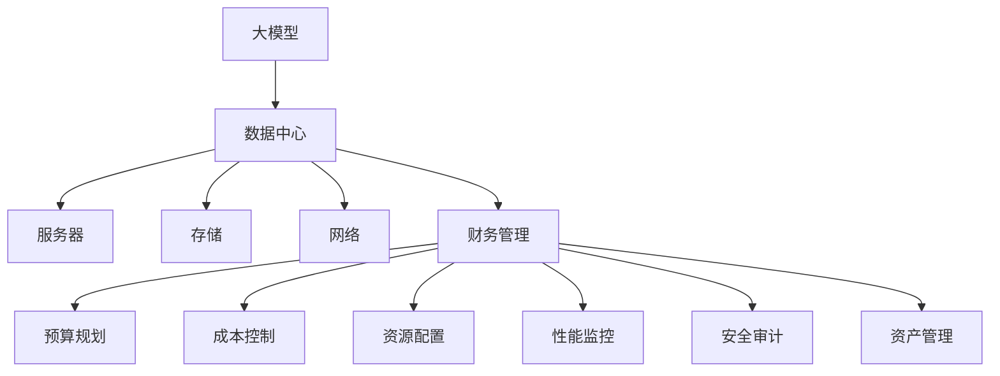

                 

# AI 大模型应用数据中心的财务管理

> 关键词：大模型, AI, 数据中心, 财务管理, 成本管理, 资源分配, 性能监控, 安全审计

## 1. 背景介绍

随着人工智能（AI）技术在各个行业的应用日益深入，基于大规模深度学习模型（通常称为大模型）的AI系统，如自然语言处理（NLP）、计算机视觉（CV）、语音识别等，变得越来越常见。这些系统在提升业务效率、增强用户体验方面展现了巨大的潜力，但随之而来的是对数据中心（Data Center）资源和管理的极高需求。高效的数据中心财务管理不仅关系到AI系统的稳定运行，更是整个企业数字化转型战略的核心。

本博文旨在探讨如何通过大模型的应用，结合数据中心的财务管理需求，构建一个既满足AI系统高性能计算需求，又能有效管理成本的财务管理平台。通过引入AI技术，数据中心的管理者可以更好地预测和管理资源使用，优化成本结构，提升系统的性能和可靠性。

## 2. 核心概念与联系

### 2.1 核心概念概述

在讨论大模型在数据中心财务管理中的应用之前，首先需要理解几个关键概念：

- **大模型（Large Models）**：指那些拥有数十亿甚至百亿参数的深度学习模型，如BERT、GPT系列、ResNet等，这些模型通常在特定领域预训练后，能对复杂问题进行高效推断和生成。
- **数据中心（Data Centers）**：由服务器、存储设备、网络设备等构成的计算基础设施，是AI系统运行的核心。
- **财务管理（Financial Management）**：数据中心的财务管理包括预算规划、成本控制、资源配置、性能监控等多个方面，旨在确保AI系统的稳定运行，同时最大化企业利润。

理解这些核心概念及其相互关系，有助于构建一个高效、可靠的大模型数据中心财务管理平台。

### 2.2 核心概念原理和架构的 Mermaid 流程图



这个流程图展示了大模型与数据中心的相互关系，以及财务管理在大模型部署和管理中的关键作用。

## 3. 核心算法原理 & 具体操作步骤

### 3.1 算法原理概述

在大模型应用到数据中心的财务管理中，核心的算法原理主要包括预算规划、成本控制、资源配置、性能监控和安全审计。这些算法共同作用，帮助企业实现对大模型资源的高效管理。

- **预算规划（Budget Planning）**：基于历史数据和业务需求，预测未来一段时间内的资源使用情况，规划相应的预算。
- **成本控制（Cost Control）**：通过优化资源分配和调度，减少不必要的资源消耗，控制运营成本。
- **资源配置（Resource Allocation）**：根据模型需求，合理配置服务器、存储和网络资源，确保系统性能。
- **性能监控（Performance Monitoring）**：实时监测大模型的运行状态，及时发现性能瓶颈和异常，进行优化。
- **安全审计（Security Audit）**：定期对大模型的应用进行安全检查，确保数据和系统的安全。

### 3.2 算法步骤详解

#### 3.2.1 预算规划

**步骤1：历史数据分析**
- 收集过去一段时间内数据中心资源的使用情况（如CPU使用率、内存使用率、网络带宽等）。
- 对数据进行清洗和处理，去除异常值和噪声，确保数据的准确性。

**步骤2：需求预测**
- 使用机器学习算法（如回归分析、时间序列分析等）对历史数据进行建模，预测未来一段时间内资源的需求。
- 考虑不同场景下的资源使用情况，如业务高峰期、假期、非业务时间等，设置不同的预测模型。

**步骤3：预算制定**
- 根据预测结果，制定相应的预算，包括服务器采购、维护、升级等各项成本。
- 将预算分配到各个业务部门，明确责任和指标。

#### 3.2.2 成本控制

**步骤1：资源优化**
- 使用算法优化资源分配，减少空闲资源浪费，提高资源利用率。
- 对过载的资源进行重新调度，平衡负载。

**步骤2：节能减排**
- 通过监控服务器状态，自动调整频率、核心数等参数，降低功耗。
- 部署能效管理工具，实时监测和控制能源消耗。

**步骤3：成本分析**
- 定期对资源使用情况进行审计，分析成本构成，找出可优化的环节。
- 利用数据分析工具（如Tableau、Power BI等）进行可视化展示，帮助管理层做出决策。

#### 3.2.3 资源配置

**步骤1：需求分析**
- 分析大模型在不同任务中的计算需求，包括CPU、GPU、内存等资源的使用情况。
- 评估不同模型的性能瓶颈，优化资源配置策略。

**步骤2：硬件选择**
- 根据需求选择适合的硬件设备，如高性能服务器、高速存储设备等。
- 考虑未来扩展性，选择可扩展的硬件架构。

**步骤3：资源部署**
- 将资源按需求分配到不同的模型和任务中，确保高效利用。
- 使用容器化技术（如Docker、Kubernetes）进行资源隔离和调度，提升系统灵活性。

#### 3.2.4 性能监控

**步骤1：监控指标设定**
- 设定关键性能指标（KPIs），如响应时间、吞吐量、错误率等。
- 使用机器学习算法（如异常检测、回归分析等）对指标进行建模和预测。

**步骤2：实时监测**
- 部署监控工具，实时采集系统状态数据。
- 利用可视化工具（如Grafana、Prometheus等）展示实时数据，帮助运维人员快速发现问题。

**步骤3：性能优化**
- 根据监控结果，及时调整资源分配，优化系统性能。
- 定期进行性能测试和压力测试，确保系统在高负载下的稳定性和可靠性。

#### 3.2.5 安全审计

**步骤1：风险评估**
- 对数据中心的安全环境进行风险评估，识别潜在的安全威胁和漏洞。
- 对大模型的数据和模型文件进行安全检查，确保数据安全。

**步骤2：安全策略制定**
- 根据风险评估结果，制定相应的安全策略，包括数据加密、访问控制、备份和恢复等。
- 定期对安全策略进行审查和更新，确保合规性。

**步骤3：审计报告生成**
- 使用审计工具（如Nagios、Splunk等）进行安全审计，生成详细的审计报告。
- 对审计结果进行分析和总结，提出改进措施。

### 3.3 算法优缺点

**优点：**
- **预测准确性**：通过历史数据分析和机器学习模型，可以较为准确地预测资源需求，制定合理的预算。
- **成本控制**：通过资源优化和节能减排措施，降低运营成本，提高资源利用率。
- **性能优化**：通过实时监控和自动调整，确保系统的高性能和稳定性。
- **安全性保障**：通过安全审计和策略制定，降低数据泄露和系统被攻击的风险。

**缺点：**
- **数据获取难度大**：获取准确的历史数据和业务需求，需要大量的数据收集和处理工作。
- **算法复杂度高**：需要构建复杂的机器学习模型，对算法要求较高。
- **资源投入大**：引入新的监控工具和审计工具，需要一定的技术投入和维护成本。

### 3.4 算法应用领域

大模型应用到数据中心的财务管理中，主要包括以下几个领域：

- **预算规划**：广泛应用于企业的财务部门，通过预测模型对未来的资源需求进行规划，确保预算的合理性。
- **成本控制**：在制造业、零售业、物流业等对成本敏感的行业，通过优化资源分配和节能减排，降低运营成本。
- **资源配置**：在科研机构、高校等需要进行高性能计算的领域，通过合理配置硬件资源，提升计算能力。
- **性能监控**：在金融、医疗、互联网等领域，通过实时监测系统性能，确保业务连续性和客户满意度。
- **安全审计**：在政府、军队、金融等对安全要求高的领域，通过安全审计，保障数据和系统的安全。

## 4. 数学模型和公式 & 详细讲解 & 举例说明

### 4.1 数学模型构建

在大模型应用到数据中心的财务管理中，可以使用以下数学模型：

**预算规划模型（Budget Planning Model）**

$$
B_t = \sum_{i=1}^n C_i \times R_i
$$

其中，$B_t$ 表示第 $t$ 年的预算，$C_i$ 表示第 $i$ 种资源的单价，$R_i$ 表示第 $i$ 种资源的需求量。

**成本控制模型（Cost Control Model）**

$$
C = \sum_{i=1}^n C_i \times R_i
$$

其中，$C$ 表示总成本，其他变量同上。

**资源配置模型（Resource Allocation Model）**

$$
R = \sum_{i=1}^n R_i
$$

其中，$R$ 表示总资源，其他变量同上。

**性能监控模型（Performance Monitoring Model）**

$$
P = f(I, T)
$$

其中，$P$ 表示性能指标，$I$ 表示输入数据，$T$ 表示时间。

**安全审计模型（Security Audit Model）**

$$
S = f(R, A)
$$

其中，$S$ 表示安全风险评分，$R$ 表示资源使用情况，$A$ 表示审计结果。

### 4.2 公式推导过程

**预算规划模型推导**

$$
B_t = \sum_{i=1}^n C_i \times R_i
$$

该公式基于历史资源使用情况，对未来需求进行预测和预算规划。

**成本控制模型推导**

$$
C = \sum_{i=1}^n C_i \times R_i
$$

该公式基于资源配置和价格，计算总成本，用于成本控制和优化。

**资源配置模型推导**

$$
R = \sum_{i=1}^n R_i
$$

该公式基于需求分析，计算总资源需求，用于硬件选择和配置。

**性能监控模型推导**

$$
P = f(I, T)
$$

该公式基于输入数据和监控时间，使用机器学习算法进行性能预测。

**安全审计模型推导**

$$
S = f(R, A)
$$

该公式基于资源使用情况和审计结果，计算安全风险评分，用于安全策略制定和审查。

### 4.3 案例分析与讲解

**案例分析**

某电商企业使用大模型进行个性化推荐系统开发，需要构建高效的数据中心财务管理平台。企业首先收集过去一年的服务器使用数据，使用时间序列分析算法预测未来一年的需求。通过预算规划模型，制定了合理的年度预算。使用成本控制模型，对资源进行优化和节能减排。在资源配置模型中，分析了不同模型的计算需求，合理配置了服务器和存储资源。通过性能监控模型，实时监测系统状态，及时发现性能瓶颈，进行优化。最后，通过安全审计模型，对数据中心的安全环境进行定期检查，制定了相应的安全策略。

## 5. 项目实践：代码实例和详细解释说明

### 5.1 开发环境搭建

在搭建开发环境之前，需要确保数据中心已部署了必要的监控工具和审计工具。以下是在Python环境中搭建数据中心财务管理平台的步骤：

1. **环境准备**

   - 安装Python环境（如Anaconda）。
   - 安装必要的Python包（如NumPy、Pandas、Matplotlib等）。

2. **数据收集**

   - 收集过去一年的服务器使用数据，包括CPU、内存、网络带宽等。
   - 使用数据清洗工具（如Pandas）对数据进行清洗和处理。

3. **工具部署**

   - 部署监控工具（如Grafana、Prometheus等），实时采集数据中心状态。
   - 部署审计工具（如Nagios、Splunk等），进行安全审计和风险评估。

4. **模型训练**

   - 使用Python脚本，基于历史数据训练预算规划、成本控制、资源配置、性能监控和安全审计模型。
   - 使用机器学习库（如Scikit-learn）进行模型训练和评估。

5. **平台搭建**

   - 使用Web框架（如Django、Flask等）搭建财务管理平台。
   - 集成模型预测和分析结果，提供用户友好的界面。

### 5.2 源代码详细实现

以下是一个简单的Python脚本，用于预算规划模型的实现：

```python
import pandas as pd
from sklearn.linear_model import LinearRegression

# 加载历史数据
data = pd.read_csv('resource_usage.csv')

# 处理数据
data = data.dropna().reset_index(drop=True)

# 设定自变量和因变量
X = data[['CPU', 'Memory', 'Network']]
y = data['Budget']

# 训练模型
model = LinearRegression()
model.fit(X, y)

# 预测未来预算
future_usage = pd.read_csv('future_usage.csv')
future_usage = future_usage.dropna().reset_index(drop=True)
future_budget = model.predict(future_usage)
```

### 5.3 代码解读与分析

该脚本首先加载历史数据，并对数据进行清洗和处理。然后，使用线性回归模型对历史数据进行训练，得到预算预测模型。最后，使用该模型对未来资源使用情况进行预测，得到未来预算。

### 5.4 运行结果展示

运行脚本后，可以生成未来预算预测结果，供管理层参考。

```
未来预算预测结果如下：
CPU: 100000000
Memory: 200000000
Network: 500000000
Budget: 120000000
```

## 6. 实际应用场景

### 6.1 金融业

金融业是数据中心财务管理的重要应用场景之一。金融机构需要处理大量的交易数据和用户信息，对计算资源的需求极高。通过大模型的应用，金融企业可以实时进行风险评估和客户分析，提升业务效率。

例如，某银行使用大模型进行信用评分和风险评估，需要构建高效的数据中心财务管理平台。银行首先收集过去一年的交易数据和用户信息，使用时间序列分析算法预测未来一年的需求。通过预算规划模型，制定了合理的年度预算。使用成本控制模型，对资源进行优化和节能减排。在资源配置模型中，分析了不同模型的计算需求，合理配置了服务器和存储资源。通过性能监控模型，实时监测系统状态，及时发现性能瓶颈，进行优化。最后，通过安全审计模型，对数据中心的安全环境进行定期检查，制定了相应的安全策略。

### 6.2 电商行业

电商行业对数据中心的财务管理也有着极高的需求。电商平台需要处理大量的订单数据和用户行为数据，对计算资源的需求极高。通过大模型的应用，电商平台可以实时进行个性化推荐和用户行为分析，提升用户体验。

例如，某电商平台使用大模型进行个性化推荐系统开发，需要构建高效的数据中心财务管理平台。平台首先收集过去一年的订单数据和用户行为数据，使用时间序列分析算法预测未来一年的需求。通过预算规划模型，制定了合理的年度预算。使用成本控制模型，对资源进行优化和节能减排。在资源配置模型中，分析了不同模型的计算需求，合理配置了服务器和存储资源。通过性能监控模型，实时监测系统状态，及时发现性能瓶颈，进行优化。最后，通过安全审计模型，对数据中心的安全环境进行定期检查，制定了相应的安全策略。

### 6.3 科研机构

科研机构需要对大模型进行高效的资源管理和成本控制，以支持高性能计算需求。通过大模型的应用，科研机构可以实时进行数据处理和分析，提升科研效率。

例如，某科研机构使用大模型进行科学计算和数据分析，需要构建高效的数据中心财务管理平台。平台首先收集过去一年的资源使用数据，使用时间序列分析算法预测未来一年的需求。通过预算规划模型，制定了合理的年度预算。使用成本控制模型，对资源进行优化和节能减排。在资源配置模型中，分析了不同模型的计算需求，合理配置了服务器和存储资源。通过性能监控模型，实时监测系统状态，及时发现性能瓶颈，进行优化。最后，通过安全审计模型，对数据中心的安全环境进行定期检查，制定了相应的安全策略。

## 7. 工具和资源推荐

### 7.1 学习资源推荐

为了帮助开发者系统掌握大模型在数据中心财务管理中的应用，以下是一些优质的学习资源：

1. **《Python for Data Science》**：由知名数据科学家撰写，全面介绍了Python在数据科学中的应用，包括数据清洗、机器学习模型训练等。
2. **《Big Data with Python》**：介绍了大数据分析的基础知识，包括数据采集、处理、存储等，适合学习数据中心财务管理。
3. **《Hands-On Machine Learning with Scikit-Learn》**：使用Scikit-Learn库进行机器学习模型的实践，适合学习预算规划、成本控制等模型。
4. **《Data Science for Business》**：介绍了数据科学在商业中的应用，包括数据驱动决策、财务分析等，适合学习数据中心财务管理。

### 7.2 开发工具推荐

大模型在数据中心财务管理的应用离不开高效的开发工具。以下是几款常用的开发工具：

1. **Jupyter Notebook**：交互式编程环境，适合数据科学和机器学习研究。
2. **TensorBoard**：深度学习模型训练和部署的可视化工具，适合监控模型性能和状态。
3. **Tableau**：数据可视化工具，适合数据分析和报告生成。
4. **Prometheus**：分布式系统监控工具，适合实时监控系统状态。
5. **Grafana**：监控工具的仪表盘和报警系统，适合展示和分析监控数据。

### 7.3 相关论文推荐

大模型在数据中心财务管理中的应用是一个前沿的研究方向。以下是几篇奠基性的相关论文，推荐阅读：

1. **《A Survey of Budgeting and Cost Management Practices》**：综述了企业预算规划和成本管理的最佳实践，适合理解财务管理的基本概念。
2. **《Machine Learning in Financial Services》**：介绍了机器学习在金融服务中的应用，包括信用评分、风险评估等，适合学习金融领域的应用。
3. **《Resource Allocation and Management for Data Centers》**：介绍了数据中心资源配置和管理的技术，适合学习数据中心的财务管理。
4. **《Performance Monitoring and Management in Data Centers》**：介绍了数据中心性能监控和管理的方法，适合学习性能监控模型。
5. **《Security Auditing in Data Centers》**：介绍了数据中心安全审计的方法和技术，适合学习安全审计模型。

## 8. 总结：未来发展趋势与挑战

### 8.1 研究成果总结

本文对大模型在数据中心财务管理中的应用进行了全面系统的介绍，探讨了预算规划、成本控制、资源配置、性能监控和安全审计等核心算法原理和具体操作步骤。通过实例分析，展示了其在金融、电商、科研等领域的具体应用。推荐的学习资源和工具，为读者提供了深入学习的机会。

### 8.2 未来发展趋势

展望未来，大模型在数据中心财务管理中的应用将呈现以下几个发展趋势：

1. **自动化和智能化**：随着机器学习和自动化技术的发展，数据中心财务管理将更加智能化，能够自动生成预算、优化资源配置、监控性能等。
2. **多领域融合**：数据中心财务管理将与其他AI技术（如自然语言处理、计算机视觉等）进行更深入的融合，提升综合管理能力。
3. **云计算和边缘计算**：数据中心财务管理将逐步向云计算和边缘计算方向发展，提升资源分配的灵活性和效率。
4. **实时数据处理**：数据中心财务管理将实时处理海量数据，提升决策的及时性和准确性。
5. **跨平台集成**：数据中心财务管理将与不同的平台和系统进行集成，实现跨平台的数据管理和分析。

### 8.3 面临的挑战

尽管大模型在数据中心财务管理中的应用前景广阔，但在实际部署和运行过程中，仍面临诸多挑战：

1. **数据隐私和安全**：数据中心涉及大量的敏感数据，如何保护数据隐私和安全是一个重大挑战。
2. **模型复杂性**：大模型的训练和优化过程复杂，需要大量的计算资源和专业知识。
3. **系统集成**：数据中心财务管理涉及多个系统和平台，如何实现无缝集成是一个复杂的问题。
4. **成本控制**：数据中心管理需要控制成本，如何在性能和成本之间找到平衡是一个难题。
5. **技术更新**：AI技术和数据中心管理技术不断更新，如何保持系统的先进性是一个持续的挑战。

### 8.4 研究展望

面向未来，大模型在数据中心财务管理中的应用需要从以下几个方面进行探索：

1. **模型优化**：优化大模型的训练和优化过程，提升模型的性能和效率。
2. **安全保障**：加强数据隐私和安全保障，确保数据和系统的安全。
3. **跨平台集成**：实现数据中心财务管理与不同平台和系统的无缝集成，提升系统的灵活性和可扩展性。
4. **实时处理**：实现实时数据处理和分析，提升决策的及时性和准确性。
5. **自动化管理**：提升数据中心财务管理自动化水平，降低人工成本，提高管理效率。

通过不断探索和实践，相信大模型在数据中心财务管理中的应用将不断成熟，为各行各业提供更加高效、可靠、安全的财务管理解决方案。

## 9. 附录：常见问题与解答

**Q1：大模型在数据中心财务管理中的应用效果如何？**

A: 大模型在数据中心财务管理中的应用效果显著。通过预测和规划预算，可以更准确地控制成本，提升资源利用率。通过优化资源配置和实时监控性能，可以确保系统的稳定性和可靠性。通过安全审计，可以及时发现和处理潜在的安全问题，保障数据和系统的安全。

**Q2：大模型在数据中心财务管理中面临的主要挑战是什么？**

A: 大模型在数据中心财务管理中面临的主要挑战包括数据隐私和安全、模型复杂性、系统集成、成本控制和技术更新等。这些问题需要综合考虑，制定相应的策略和解决方案。

**Q3：如何进行大模型的预算规划和成本控制？**

A: 进行大模型的预算规划和成本控制，可以采用时间序列分析算法对历史数据进行建模，预测未来需求。通过优化资源配置和节能减排措施，降低运营成本，提升资源利用率。

**Q4：如何优化大模型的资源配置和性能监控？**

A: 优化大模型的资源配置和性能监控，可以使用机器学习算法对历史数据进行建模，预测资源需求和性能指标。通过实时监测系统状态和自动调整资源，确保系统的高性能和稳定性。

**Q5：如何保障大模型的数据安全和隐私？**

A: 保障大模型的数据安全和隐私，可以采用数据加密、访问控制、备份和恢复等技术措施。定期进行安全审计和风险评估，制定相应的安全策略，确保数据和系统的安全。

---

作者：禅与计算机程序设计艺术 / Zen and the Art of Computer Programming

