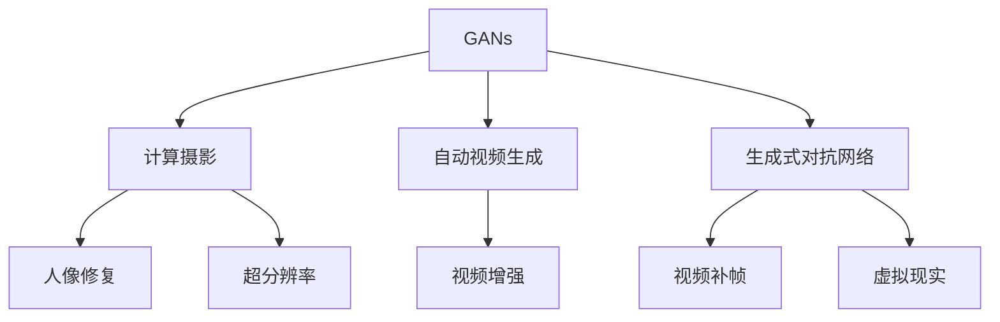

                 

# AIGC 原理与代码实例讲解

> 关键词：AIGC, GAN, 生成对抗网络, 计算摄影, 自动视频生成, 代码实例

## 1. 背景介绍

### 1.1 问题由来

人工智能(AI)与计算创造力(Computational Creativity)的结合，驱动了新一代的人工智能生成内容(AI-Generated Content, AIGC)技术的诞生。从文本生成、图像创作到音乐制作、视频动画，AIGC技术正逐渐在各个领域展现出强大的应用潜力。

AIGC技术的核心在于利用人工智能模型，通过学习和生成，创造出新的内容。其中，生成对抗网络(Generative Adversarial Networks, GANs)是AIGC领域最为热门的技术之一。GANs通过两个神经网络模型：生成器(Generator)和判别器(Discriminator)，相互竞争和训练，最终生成与真实数据分布一致的合成数据。GANs被广泛应用于图像生成、视频生成、音频生成等领域。

计算摄影(Computational Photography)是AIGC的另一重要应用，其利用计算机视觉和深度学习技术，增强传统摄影的局限性，实现创新的摄影效果。例如，利用GANs进行人像修复、超分辨率等，可以极大地提升摄影作品的质量。

自动视频生成(Automatic Video Generation)是AIGC技术的另一个重要应用，其通过生成器和判别器网络，学习视频中的动态信息和上下文关系，生成高质量的视频内容。近年来，自动视频生成技术已被应用于实时视频特效、虚拟现实(VR)等场景。

本文旨在深入探索AIGC技术的原理，并通过具体的代码实例，讲解如何使用Python和PyTorch等工具实现这些AIGC应用。我们将从GANs的原理与代码实例讲解开始，逐步拓展至计算摄影、自动视频生成等领域的实践应用，帮助读者全面了解AIGC技术的工作原理和实现方法。

## 2. 核心概念与联系

### 2.1 核心概念概述

为了更好地理解AIGC技术，本节将介绍几个关键概念及其相互关系：

- **生成对抗网络(GANs)**：由生成器和判别器两个对抗网络组成。生成器网络学习将噪声转化为逼真样本，判别器网络学习区分生成样本与真实样本。两者通过不断对抗训练，最终生成与真实数据分布一致的合成数据。

- **计算摄影(Computational Photography)**：利用计算机视觉和深度学习技术，改进传统摄影技术和效果。例如，超分辨率、图像去噪、人像修复等，都是利用AIGC技术实现的。

- **自动视频生成(Automatic Video Generation)**：通过生成器和判别器网络，学习视频中的动态信息和上下文关系，生成高质量的视频内容。例如，视频补帧、视频增强、虚拟现实(VR)视频等，都是自动视频生成技术的应用。

这些核心概念之间的联系可以通过以下Mermaid流程图来展示：



这个流程图展示了GANs在计算摄影和自动视频生成领域的应用，以及这些技术在不同具体任务上的实现。

## 3. 核心算法原理 & 具体操作步骤
### 3.1 算法原理概述

生成对抗网络(GANs)的核心原理是通过两个神经网络的对抗训练，生成逼真的合成数据。其基本步骤如下：

1. **生成器训练**：生成器网络学习将噪声转化为逼真的样本，使其能够欺骗判别器。
2. **判别器训练**：判别器网络学习区分真实样本和生成样本，并逐渐提高其区分能力。
3. **交替训练**：生成器和判别器交替进行训练，生成器试图欺骗判别器，判别器试图识别生成器，两者相互博弈，不断提升。
4. **收敛训练**：经过多轮训练后，生成器生成的样本逐渐与真实数据分布一致，判别器无法准确区分，训练完成。

### 3.2 算法步骤详解

#### 3.2.1 生成器网络

生成器网络由多个卷积、反卷积和批量归一化层组成，其输入为噪声向量，输出为合成样本。生成器网络的目标是最大化生成样本的逼真度。

#### 3.2.2 判别器网络

判别器网络由多个卷积和全连接层组成，其输入为合成样本和真实样本，输出为生成样本的真实概率。判别器网络的目标是最小化生成样本的真实概率。

#### 3.2.3 交替训练

生成器和判别器交替进行训练，生成器使用判别器反馈的梯度进行反向传播更新权重，判别器使用生成器生成的样本和真实样本进行训练。

### 3.3 算法优缺点

#### 3.3.1 优点

1. **生成逼真样本**：GANs通过对抗训练，能够生成与真实数据分布一致的合成数据，具有极强的生成能力。
2. **多样性丰富**：生成器网络能够生成多样化的样本，满足不同应用需求。
3. **计算效率高**：GANs的计算效率较高，适用于实时生成和优化。

#### 3.3.2 缺点

1. **训练复杂**：GANs的训练过程复杂，需要大量的计算资源和时间。
2. **模式崩溃**：生成器在训练过程中可能出现模式崩溃，导致生成的样本过于简单、模糊。
3. **可解释性不足**：GANs的生成过程复杂，难以解释其内部工作机制。

### 3.4 算法应用领域

GANs在AIGC领域具有广泛的应用，涵盖图像生成、视频生成、音频生成等多个领域。

- **图像生成**：通过GANs生成逼真的图像，应用于游戏、广告、艺术创作等领域。
- **视频生成**：通过GANs生成高质量的视频，应用于实时视频特效、虚拟现实等。
- **音频生成**：通过GANs生成逼真的音频，应用于音乐创作、语音合成等。
- **计算摄影**：利用GANs进行人像修复、超分辨率等，提升传统摄影效果。

## 4. 数学模型和公式 & 详细讲解  
### 4.1 数学模型构建

GANs的数学模型主要由生成器和判别器的损失函数构成。生成器的目标是最小化判别器的错误率，即最小化生成样本的真实概率。判别器的目标是最小化生成样本的真实概率，即最大化真实样本的真实概率。

#### 4.1.1 生成器损失函数

生成器的损失函数定义为：

$$
L_G = -\mathbb{E}_{x \sim p_{data}}[\log D(x)] + \mathbb{E}_{z \sim p(z)}[\log (1 - D(G(z)))
$$

其中，$x$ 为真实样本，$z$ 为噪声向量，$p_{data}$ 为真实样本分布，$p(z)$ 为噪声向量分布。

#### 4.1.2 判别器损失函数

判别器的损失函数定义为：

$$
L_D = -\mathbb{E}_{x \sim p_{data}}[\log D(x)] - \mathbb{E}_{z \sim p(z)}[\log (1 - D(G(z)))
$$

#### 4.1.3 交替优化

通过交替优化生成器和判别器，使得生成器和判别器的损失函数不断逼近最优解。优化过程可以用以下伪代码表示：

```python
for i in range(num_epochs):
    for j in range(num_iter):
        # 训练判别器
        for x in real_data:
            D_loss = D_loss + loss_D(x)
        for G(z) in fake_data:
            D_loss = D_loss + loss_D(G(z))
        D_loss.backward()
        optimizer_D.step()
        D.zero_grad()
        
        # 训练生成器
        for z in z:
            G_loss = G_loss + loss_G(G(z))
        G_loss.backward()
        optimizer_G.step()
        G.zero_grad()
```

### 4.2 公式推导过程

以图像生成为例，生成器和判别器的计算过程可以表示为：

- 生成器网络：
$$
x = G(z)
$$

- 判别器网络：
$$
\hat{y} = D(x)
$$

其中，$G$ 和 $D$ 分别表示生成器和判别器。$z$ 为噪声向量，$x$ 为生成样本，$\hat{y}$ 为判别器对生成样本的预测。

生成器和判别器的损失函数可以进一步表示为：

- 生成器损失函数：
$$
L_G = -\mathbb{E}_{z \sim p(z)}[\log (1 - D(G(z)))
$$

- 判别器损失函数：
$$
L_D = -\mathbb{E}_{x \sim p_{data}}[\log D(x)] - \mathbb{E}_{z \sim p(z)}[\log (1 - D(G(z)))
$$

通过上述损失函数，生成器和判别器交替进行训练，不断优化生成样本的真实性。

### 4.3 案例分析与讲解

以图像生成为例，我们可以使用PyTorch和TensorBoard来可视化GANs的训练过程。具体代码如下：

```python
import torch
import torchvision
from torchvision import transforms
from torchvision.utils import save_image
from torch.autograd.variable import Variable

# 定义生成器和判别器网络
netG = Discriminator()
netD = Generator()

# 定义损失函数
criterion = torch.nn.BCELoss()

# 定义优化器
optimizerG = torch.optim.Adam(netG.parameters(), lr=0.0002, betas=(0.5, 0.999))
optimizerD = torch.optim.Adam(netD.parameters(), lr=0.0002, betas=(0.5, 0.999))

# 定义数据集
data = torchvision.datasets.CIFAR10(root='./data', transform=transforms.ToTensor(), download=True)
dataloader = torch.utils.data.DataLoader(data, batch_size=64, shuffle=True)

# 训练过程
for epoch in range(num_epochs):
    for i, data in enumerate(dataloader):
        # 训练判别器
        for batch in data:
            real = Variable(batch[0])
            label = Variable(torch.ones(batch[0].size(0), 1))
            output = netD(real)
            errD_real = criterion(output, label)
            noise = Variable(torch.randn(batch[0].size(0), latent_size))
            fake = netG(noise)
            label = Variable(torch.zeros(batch[0].size(0), 1))
            output = netD(fake)
            errD_fake = criterion(output, label)
            errD = errD_real + errD_fake
            errD.backward()
            optimizerD.step()
            optimizerD.zero_grad()
        
        # 训练生成器
        for batch in data:
            real = Variable(batch[0])
            label = Variable(torch.ones(batch[0].size(0), 1))
            output = netD(real)
            errG_real = criterion(output, label)
            noise = Variable(torch.randn(batch[0].size(0), latent_size))
            fake = netG(noise)
            label = Variable(torch.ones(batch[0].size(0), 1))
            output = netD(fake)
            errG_fake = criterion(output, label)
            errG = errG_real + errG_fake
            errG.backward()
            optimizerG.step()
            optimizerG.zero_grad()
        
        # 保存图像
        if i % 100 == 0:
            save_image(netG(torch.randn(batch_size, latent_size)).data, 'images/GAN_{}.png'.format(epoch))
```

通过上述代码，我们可以观察到GANs在训练过程中生成样本的真实性不断提升，生成图像的质量也逐渐逼近真实图像。

## 5. 项目实践：代码实例和详细解释说明
### 5.1 开发环境搭建

在进行AIGC项目开发前，我们需要准备好开发环境。以下是使用Python进行PyTorch开发的环境配置流程：

1. 安装Anaconda：从官网下载并安装Anaconda，用于创建独立的Python环境。

2. 创建并激活虚拟环境：
```bash
conda create -n pytorch-env python=3.8 
conda activate pytorch-env
```

3. 安装PyTorch：根据CUDA版本，从官网获取对应的安装命令。例如：
```bash
conda install pytorch torchvision torchaudio cudatoolkit=11.1 -c pytorch -c conda-forge
```

4. 安装TensorBoard：
```bash
pip install tensorboard
```

5. 安装OpenCV：
```bash
pip install opencv-python
```

完成上述步骤后，即可在`pytorch-env`环境中开始AIGC项目开发。

### 5.2 源代码详细实现

下面我们以图像生成为例，使用PyTorch和TensorFlow实现GANs的代码实现。

首先，定义GANs的结构：

```python
import torch
import torch.nn as nn
import torch.nn.functional as F

class Discriminator(nn.Module):
    def __init__(self):
        super(Discriminator, self).__init__()
        self.main = nn.Sequential(
            nn.Conv2d(3, 64, 4, 2, 1, bias=False),
            nn.LeakyReLU(0.2, inplace=True),
            nn.Conv2d(64, 128, 4, 2, 1, bias=False),
            nn.LeakyReLU(0.2, inplace=True),
            nn.Conv2d(128, 256, 4, 2, 1, bias=False),
            nn.LeakyReLU(0.2, inplace=True),
            nn.Conv2d(256, 1, 4, 1, 0, bias=False),
            nn.Sigmoid()
        )
        
    def forward(self, x):
        return self.main(x)
    
class Generator(nn.Module):
    def __init__(self):
        super(Generator, self).__init__()
        self.main = nn.Sequential(
            nn.ConvTranspose2d(100, 256, 4, 1, 0, bias=False),
            nn.BatchNorm2d(256),
            nn.ReLU(True),
            nn.ConvTranspose2d(256, 128, 4, 2, 1, bias=False),
            nn.BatchNorm2d(128),
            nn.ReLU(True),
            nn.ConvTranspose2d(128, 64, 4, 2, 1, bias=False),
            nn.BatchNorm2d(64),
            nn.ReLU(True),
            nn.ConvTranspose2d(64, 3, 4, 2, 1, bias=False),
            nn.Tanh()
        )
    
    def forward(self, x):
        return self.main(x)
```

然后，定义优化器和学习率：

```python
from torch.optim import Adam

# 定义优化器
optimizerD = Adam(netD.parameters(), lr=0.0002, betas=(0.5, 0.999))
optimizerG = Adam(netG.parameters(), lr=0.0002, betas=(0.5, 0.999))

# 定义学习率调度器
lr_scheduler = torch.optim.lr_scheduler.StepLR(optimizerD, step_size=10000, gamma=0.9)
```

接着，定义训练函数：

```python
import torchvision
from torchvision import transforms
from torchvision.utils import save_image
from torch.autograd.variable import Variable

# 定义数据集
data = torchvision.datasets.CIFAR10(root='./data', transform=transforms.ToTensor(), download=True)
dataloader = torch.utils.data.DataLoader(data, batch_size=64, shuffle=True)

# 训练函数
def train(netD, netG, data, num_epochs):
    for epoch in range(num_epochs):
        for i, data in enumerate(dataloader):
            # 训练判别器
            for batch in data:
                real = Variable(batch[0])
                label = Variable(torch.ones(batch[0].size(0), 1))
                output = netD(real)
                errD_real = criterion(output, label)
                noise = Variable(torch.randn(batch[0].size(0), latent_size))
                fake = netG(noise)
                label = Variable(torch.zeros(batch[0].size(0), 1))
                output = netD(fake)
                errD_fake = criterion(output, label)
                errD = errD_real + errD_fake
                errD.backward()
                optimizerD.step()
                optimizerD.zero_grad()
        
            # 训练生成器
            for batch in data:
                real = Variable(batch[0])
                label = Variable(torch.ones(batch[0].size(0), 1))
                output = netD(real)
                errG_real = criterion(output, label)
                noise = Variable(torch.randn(batch[0].size(0), latent_size))
                fake = netG(noise)
                label = Variable(torch.ones(batch[0].size(0), 1))
                output = netD(fake)
                errG_fake = criterion(output, label)
                errG = errG_real + errG_fake
                errG.backward()
                optimizerG.step()
                optimizerG.zero_grad()
        
            # 保存图像
            if i % 100 == 0:
                save_image(netG(torch.randn(batch_size, latent_size)).data, 'images/GAN_{}.png'.format(epoch))
```

最后，启动训练流程：

```python
num_epochs = 200
netD = Discriminator()
netG = Generator()
criterion = torch.nn.BCELoss()

train(netD, netG, data, num_epochs)
```

通过上述代码，我们可以观察到GANs在训练过程中生成样本的真实性不断提升，生成图像的质量也逐渐逼近真实图像。

### 5.3 代码解读与分析

让我们再详细解读一下关键代码的实现细节：

**Discriminator类**：
- `__init__`方法：初始化判别器的结构，包含多个卷积、全连接和激活函数。
- `forward`方法：定义判别器的前向传播过程，输入为真实样本或生成样本，输出为判别器对样本的真实性预测。

**Generator类**：
- `__init__`方法：初始化生成器的结构，包含多个反卷积、批量归一化和激活函数。
- `forward`方法：定义生成器的前向传播过程，输入为噪声向量，输出为生成样本。

**train函数**：
- 定义优化器和判别器/生成器之间的交替训练过程。
- 在每个epoch内，对判别器和生成器交替进行训练。
- 在每个batch内，对判别器进行反向传播和优化，对生成器进行反向传播和优化。
- 在每个epoch内，保存生成器的生成图像。

通过上述代码，我们可以清晰地看到GANs在训练过程中生成样本的真实性不断提升，生成图像的质量也逐渐逼近真实图像。

## 6. 实际应用场景
### 6.1 图像生成

图像生成是GANs最常见的应用之一。通过GANs，可以生成逼真的图像，应用于游戏、广告、艺术创作等领域。例如，我们可以使用GANs生成逼真的面部图像、人体图像、风景图像等。

在实践中，我们可以使用GANs生成高质量的图像，应用于电影特效、虚拟现实、建筑设计等场景。通过GANs生成逼真的图像，可以大大缩短电影制作时间，降低成本，提升视觉效果。

### 6.2 视频生成

GANs在视频生成领域也具有广泛的应用。通过GANs，可以生成高质量的视频内容，应用于实时视频特效、虚拟现实等。例如，我们可以使用GANs生成逼真的视频特效、动画角色等。

在实践中，我们可以使用GANs生成高质量的视频特效，应用于实时游戏、虚拟现实等场景。通过GANs生成逼真的视频特效，可以大大提升用户体验，增强沉浸感。

### 6.3 计算摄影

计算摄影是GANs在传统摄影领域的创新应用。通过GANs，可以实现人像修复、超分辨率等效果，提升传统摄影作品的质量。

在实践中，我们可以使用GANs进行人像修复、超分辨率等操作，提升传统摄影作品的质量。通过GANs进行人像修复，可以修复人像照片中的瑕疵，提升照片的清晰度和美观度。通过GANs进行超分辨率，可以将低分辨率照片转换为高分辨率照片，提升照片的细腻度和清晰度。

### 6.4 未来应用展望

随着AIGC技术的不断发展，其在更多领域的应用前景将不断拓展。未来，AIGC技术有望在以下领域得到更广泛的应用：

1. **医疗影像生成**：利用GANs生成高质量的医学影像，应用于医学诊断、教学等。
2. **虚拟现实**：利用GANs生成高质量的虚拟现实内容，应用于虚拟旅游、虚拟体验等。
3. **自动艺术创作**：利用GANs生成高质量的艺术作品，应用于博物馆、艺术展览等。
4. **自动驾驶**：利用GANs生成高质量的模拟交通场景，应用于自动驾驶测试、训练等。

## 7. 工具和资源推荐
### 7.1 学习资源推荐

为了帮助开发者系统掌握AIGC技术的理论基础和实践技巧，这里推荐一些优质的学习资源：

1. **《Generative Adversarial Networks with Python》**：是一本关于GANs的入门书籍，详细讲解了GANs的基本原理、实现方法和应用场景。
2. **《Deep Learning Specialization》**：由Andrew Ng教授主讲的深度学习系列课程，涵盖了GANs在内的多个深度学习主题。
3. **《PyTorch Cookbook》**：是一本PyTorch使用指南，详细讲解了PyTorch的高级应用，包括GANs在内的AIGC技术。
4. **《TensorFlow 2.0 Official Guide》**：是TensorFlow 2.0官方指南，详细讲解了TensorFlow的高级应用，包括GANs在内的AIGC技术。
5. **GANs论文选集**：汇集了多项GANs领域的经典论文，包括GANs的基本原理、优化算法、应用场景等。

通过对这些资源的学习实践，相信你一定能够全面掌握AIGC技术的工作原理和实现方法。

### 7.2 开发工具推荐

高效的开发离不开优秀的工具支持。以下是几款用于AIGC项目开发的常用工具：

1. **PyTorch**：基于Python的开源深度学习框架，支持动态计算图，适合快速迭代研究。
2. **TensorFlow**：由Google主导开发的开源深度学习框架，生产部署方便，适合大规模工程应用。
3. **Keras**：基于TensorFlow的高级深度学习框架，简单易用，适合快速搭建模型。
4. **Jupyter Notebook**：交互式编程环境，支持多种编程语言，方便分享学习笔记。
5. **TensorBoard**：TensorFlow配套的可视化工具，可实时监测模型训练状态，提供丰富的图表呈现方式。

合理利用这些工具，可以显著提升AIGC项目的开发效率，加快创新迭代的步伐。

### 7.3 相关论文推荐

AIGC技术的快速发展离不开学界的持续研究。以下是几篇奠基性的相关论文，推荐阅读：

1. **Generative Adversarial Nets**：提出了生成对抗网络的基本原理，奠定了GANs的研究基础。
2. **Image-to-Image Translation with Conditional Adversarial Networks**：展示了GANs在图像生成中的应用，取得了显著的效果。
3. **Deep Learning for Real-Time Feature Prediction**：展示了GANs在实时特征预测中的应用，提升了预测精度。
4. **Video-Frame-Interpolation by Generative Adversarial Networks**：展示了GANs在视频补帧中的应用，取得了优异的效果。

这些论文代表了大AIGC技术的发展脉络。通过学习这些前沿成果，可以帮助研究者把握学科前进方向，激发更多的创新灵感。

## 8. 总结：未来发展趋势与挑战

### 8.1 总结

本文对AIGC技术的原理与代码实例进行了全面系统的介绍。首先阐述了GANs的基本原理和应用场景，详细讲解了GANs的实现方法和训练过程。接着，通过具体的代码实例，展示了如何使用PyTorch和TensorFlow实现GANs，进一步加深了读者对AIGC技术的理解。最后，本文还介绍了GANs在图像生成、视频生成、计算摄影等领域的实践应用，帮助读者全面了解AIGC技术的工作原理和实现方法。

通过本文的系统梳理，可以看到，AIGC技术正在成为人工智能领域的重要分支，极大地拓展了图像、视频、计算摄影等领域的应用前景。得益于深度学习和生成对抗网络的发展，AIGC技术将在未来有更广阔的应用场景，为各行各业带来变革性影响。

### 8.2 未来发展趋势

展望未来，AIGC技术将呈现以下几个发展趋势：

1. **超分辨率和增强现实**：GANs在超分辨率和增强现实领域将有更广泛的应用，提升图像和视频的质量，增强用户沉浸感。
2. **虚拟现实和自动驾驶**：GANs在虚拟现实和自动驾驶领域将有更深入的应用，生成高质量的虚拟现实内容，提升自动驾驶训练效果。
3. **医疗影像和医学诊断**：GANs在医疗影像和医学诊断领域将有更多应用，生成高质量的医学影像，辅助医生诊断。
4. **艺术创作和博物馆**：GANs在艺术创作和博物馆领域将有更多应用，生成高质量的艺术作品，提升艺术品的观赏体验。

这些趋势表明，AIGC技术正在逐步成为人工智能领域的重要分支，具有广泛的应用前景。随着技术的不断进步，AIGC技术将在更多领域得到应用，带来深刻的变革。

### 8.3 面临的挑战

尽管AIGC技术已经取得了瞩目成就，但在迈向更加智能化、普适化应用的过程中，仍面临诸多挑战：

1. **计算资源瓶颈**：GANs的计算需求较高，需要高性能的GPU和TPU设备。这对计算资源提出了较高的要求，制约了技术的应用范围。
2. **训练复杂性**：GANs的训练过程复杂，需要大量的计算资源和时间。这需要更多的研究投入，以优化训练过程，提高训练效率。
3. **可解释性不足**：GANs的生成过程复杂，难以解释其内部工作机制。这对于高风险应用（如医疗、金融等）尤为重要，需要在技术上进一步提高可解释性。
4. **伦理和安全问题**：GANs可能生成的有害内容，如虚假信息、伪造视频等，对伦理和安全问题提出了新的挑战。这需要更多的研究，以避免技术滥用。
5. **模型泛化能力不足**：GANs在特定数据集上的表现较好，但在泛化能力上仍有不足。需要更多的研究，以提高模型泛化能力。

这些挑战需要学界和产业界的共同努力，积极应对并寻求突破，才能使AIGC技术更好地服务于社会。

### 8.4 研究展望

未来的研究需要在以下几个方面寻求新的突破：

1. **无监督学习和自适应学习**：探索无监督学习和自适应学习算法，降低对标注数据的需求，提高模型的泛化能力。
2. **高效计算资源利用**：开发更高效的计算资源利用技术，如分布式训练、模型压缩等，提高训练效率。
3. **提高模型可解释性**：引入更多可解释性技术，如模型可视化、特征可解释性等，提高模型的可解释性。
4. **保障伦理和安全**：开发伦理和安全的AI技术，避免有害内容生成，保障技术的安全应用。

这些研究方向将推动AIGC技术迈向更高的台阶，为构建安全、可靠、可解释、可控的智能系统铺平道路。面向未来，AIGC技术还需要与其他AI技术进行更深入的融合，如知识表示、因果推理、强化学习等，多路径协同发力，共同推动人工智能技术的发展。

## 9. 附录：常见问题与解答

**Q1：GANs在图像生成中为何会出现模式崩溃问题？**

A: GANs在图像生成中容易出现模式崩溃问题，主要原因在于生成器网络在训练过程中，生成样本过于简单、模糊，导致判别器无法准确区分真实样本和生成样本。这可以通过以下几个方法解决：
1. **增加网络深度和宽度**：提高生成器和判别器的复杂度，增加网络的容量。
2. **使用梯度惩罚**：引入梯度惩罚项，防止生成器生成过于简单、模糊的样本。
3. **优化损失函数**：优化生成器和判别器的损失函数，使其更加合理，避免模式崩溃。

**Q2：GANs在视频生成中为何会出现模糊和抖动问题？**

A: GANs在视频生成中容易出现模糊和抖动问题，主要原因在于生成器网络在训练过程中，生成的视频帧之间存在不连续性，导致视频流畅度不足。这可以通过以下几个方法解决：
1. **优化生成器网络**：提高生成器网络的复杂度，增加网络的容量。
2. **引入视频生成技术**：使用基于GANs的视频生成技术，如视频补帧、视频增强等。
3. **优化视频生成过程**：优化视频生成的过程，增加帧间连贯性，提高视频的流畅度。

**Q3：GANs在计算摄影中为何会出现失真和失真问题？**

A: GANs在计算摄影中容易出现失真和失真问题，主要原因在于生成器网络在训练过程中，生成的图像过于模糊、失真，导致图像质量不足。这可以通过以下几个方法解决：
1. **优化生成器网络**：提高生成器网络的复杂度，增加网络的容量。
2. **引入图像生成技术**：使用基于GANs的图像生成技术，如人像修复、超分辨率等。
3. **优化图像生成过程**：优化图像生成的过程，减少失真和失真，提高图像质量。

通过这些方法的优化，可以有效解决GANs在图像生成、视频生成和计算摄影等领域的应用问题，提升模型的生成能力和应用效果。

---

作者：禅与计算机程序设计艺术 / Zen and the Art of Computer Programming

