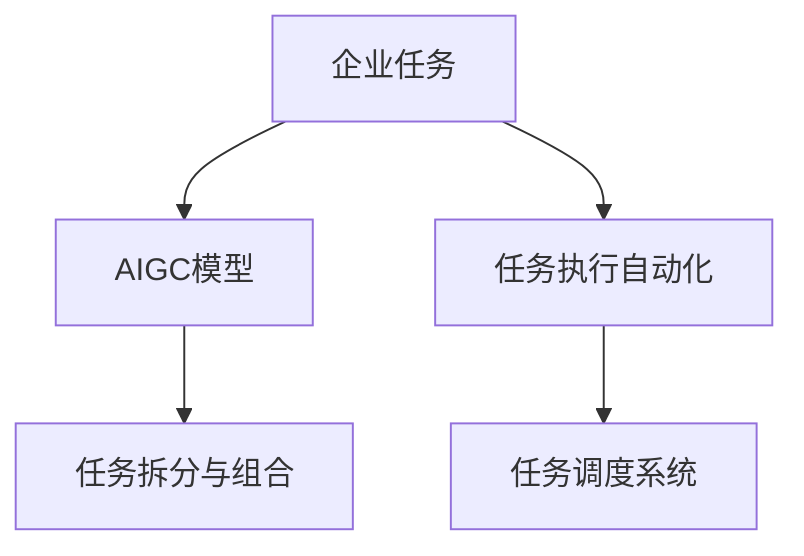

                 

# AIGC与企业任务的碎片化

> 关键词：人工智能生成内容(AIGC), 企业任务, 碎片化, 任务调度, 自动化

## 1. 背景介绍

### 1.1 问题由来

在当前数字化转型的浪潮中，企业对于AI的应用需求日益旺盛，AI辅助决策、自动化执行、智能运维等技术纷纷涌现。然而，这些AI技术往往需要与具体业务任务深度结合，才能发挥其最大的价值。但是，现实中的企业任务往往是复杂多变的，包括研发、生产、销售、运营等多个环节，并且这些任务往往存在一定的交叉和重复。如何在这种背景下，更好地应用AI技术，高效地完成各项任务，成为了企业亟待解决的难题。

### 1.2 问题核心关键点

本文将探讨如何利用人工智能生成内容(AIGC)技术，将企业任务的碎片化特征进行合理的拆分和组合，通过任务调度系统，实现AI技术的自动化执行和高效调度。本文将从以下几个方面深入讨论：

- **任务拆分与组合**：分析企业任务的特点，将复杂任务拆分成更小、更易管理的子任务，并通过智能调度系统进行有序组合。
- **任务执行的自动化**：利用AIGC技术，自动生成任务执行计划、流程和具体步骤，降低人工干预的需求。
- **任务调度系统**：介绍一种基于机器学习与优化算法任务调度系统，能够根据任务的紧急程度、资源需求等因素，智能分配执行顺序和资源。
- **模型优化与训练**：介绍如何利用数据训练AIGC模型，使其能够更好地理解企业任务的复杂性，提高任务调度效率和精度。

## 2. 核心概念与联系

### 2.1 核心概念概述

为更好地理解AIGC在企业任务中的作用，本文将介绍几个关键概念：

- **人工智能生成内容(AIGC)**：指通过人工智能技术自动生成的内容，包括文本、图像、音频、视频等多种形式。AIGC技术涵盖了语言模型、图像生成模型、音频生成模型等多种AI技术，能够极大地提升内容的生产效率和质量。
- **企业任务**：指企业在生产、运营、管理等过程中需要完成的具体工作内容。企业任务具有复杂性、多样性和动态性等特点，需要AI技术进行辅助和优化。
- **任务拆分与组合**：指将复杂任务拆分成多个子任务，并通过智能调度系统进行有序组合，以实现高效的任务执行。
- **任务调度系统**：指用于自动化执行和调度企业任务的系统，能够根据任务的优先级、资源需求等因素，动态分配任务执行顺序和资源。

这些核心概念之间的逻辑关系可以通过以下Mermaid流程图来展示：



这个流程图展示了大规模语言模型的核心概念及其之间的关系：

1. **企业任务** 通过AIGC模型进行处理，生成自动化执行的计划和步骤。
2. **任务拆分与组合** 将复杂任务拆分为更易管理的子任务。
3. **任务执行自动化** 利用AIGC模型自动生成任务执行计划和流程。
4. **任务调度系统** 根据任务的紧急程度、资源需求等因素，智能分配任务执行顺序和资源。

## 3. 核心算法原理 & 具体操作步骤
### 3.1 算法原理概述

基于AIGC的生成内容辅助任务调度的核心思想是：通过AIGC技术生成针对具体企业任务的执行计划、流程和具体步骤，结合任务调度系统，自动执行和管理企业任务。其核心算法原理包括以下几个步骤：

1. **任务描述解析**：通过自然语言处理技术，解析企业任务的描述信息，提取出任务的关键特征和要求。
2. **任务拆分与生成**：将复杂任务拆分成多个子任务，并利用AIGC技术自动生成每个子任务的具体执行步骤。
3. **任务调度优化**：根据任务的优先级、资源需求等因素，利用优化算法进行任务调度，优化资源分配，提高任务执行效率。
4. **任务执行监控与调整**：实时监控任务执行过程，根据实际情况进行动态调整，确保任务按时完成。

### 3.2 算法步骤详解

#### 3.2.1 任务描述解析

任务描述解析是任务调度的第一步，旨在从企业任务的描述中提取出关键特征和要求。具体步骤如下：

1. **文本预处理**：对企业任务的描述文本进行分词、去除停用词、提取实体等预处理操作。
2. **意图识别**：利用意图识别模型（如BERT、GPT等），从任务描述中提取任务的意图和目标。
3. **需求分析**：根据意图识别结果，分析任务的具体需求，包括任务的紧急程度、资源需求、执行顺序等。

#### 3.2.2 任务拆分与生成

任务拆分与生成是指将复杂任务拆分为多个子任务，并自动生成每个子任务的具体执行步骤。具体步骤如下：

1. **任务分解**：根据任务描述和需求分析结果，将任务拆分为多个子任务，每个子任务描述清晰、独立可执行。
2. **任务生成**：利用AIGC技术，自动生成每个子任务的详细执行步骤和计划。这一步通常需要训练一个特定的语言模型，如GPT、BERT等，用于生成执行步骤。
3. **步骤优化**：对生成的执行步骤进行优化，确保每个步骤描述清晰、逻辑连贯、可行性强。

#### 3.2.3 任务调度优化

任务调度优化是指根据任务的优先级、资源需求等因素，利用优化算法进行任务调度，优化资源分配，提高任务执行效率。具体步骤如下：

1. **任务建模**：将任务和子任务表示为数学模型，包括任务的优先级、资源需求、执行时间等参数。
2. **调度算法**：利用优化算法（如遗传算法、蚁群算法等）进行任务调度，动态分配任务执行顺序和资源。
3. **结果评估**：对调度结果进行评估，包括任务的完成时间、资源使用率等指标，不断调整优化算法，提高调度效率。

#### 3.2.4 任务执行监控与调整

任务执行监控与调整是指实时监控任务执行过程，根据实际情况进行动态调整，确保任务按时完成。具体步骤如下：

1. **监控指标**：定义任务执行的监控指标，如任务进度、资源使用情况等。
2. **动态调整**：根据监控结果，进行动态调整，如调整任务执行顺序、增加或减少资源等。
3. **调整反馈**：将调整结果反馈到任务调度系统，更新任务的执行状态，确保任务按时完成。

### 3.3 算法优缺点

利用AIGC技术辅助任务调度的优点包括：

1. **自动化程度高**：通过AIGC模型自动生成任务执行计划和步骤，降低人工干预的需求。
2. **调度效率高**：利用优化算法进行任务调度，能够高效分配资源，优化执行顺序。
3. **任务灵活性高**：根据任务的实际情况进行动态调整，提高任务执行的灵活性。

其缺点包括：

1. **对数据依赖性强**：AIGC模型的性能和调度效果高度依赖于任务描述和需求分析的准确性。
2. **模型训练成本高**：需要大量高质量的标注数据进行模型训练，初期成本较高。
3. **对任务复杂性要求高**：对于过于复杂或结构化的任务，可能难以准确拆分和生成执行步骤。
4. **调度算法复杂性高**：需要设计复杂的优化算法，对算法实现和优化要求较高。

### 3.4 算法应用领域

AIGC辅助任务调度技术在多个领域中具有广泛的应用前景，例如：

1. **生产制造**：自动化生产线的任务调度，通过生成详细的执行计划和步骤，提高生产效率和质量。
2. **物流仓储**：自动化仓库的任务调度，利用AIGC技术生成仓库管理计划和物流调度策略。
3. **金融风控**：自动化金融风险评估和决策，通过生成风险评估报告和策略，提高风险控制效率。
4. **医疗健康**：自动化医疗诊断和治疗计划的生成，通过AIGC技术生成详细的诊断报告和治疗方案。
5. **智能客服**：自动化客户服务任务的调度，利用AIGC技术生成客户服务计划和流程。

## 4. 数学模型和公式 & 详细讲解 & 举例说明

### 4.1 数学模型构建

任务调度优化的数学模型通常包含以下几个部分：

1. **任务集合**：将任务和子任务表示为集合 $T=\{t_1,t_2,\cdots,t_n\}$。
2. **资源集合**：将可用资源表示为集合 $R=\{r_1,r_2,\cdots,r_m\}$。
3. **任务需求**：将任务的需求表示为矩阵 $D \in \mathbb{R}^{n \times m}$，其中 $d_{ij}$ 表示任务 $t_i$ 需要资源 $r_j$ 的量。
4. **优先级集合**：将任务的优先级表示为向量 $P \in \mathbb{R}^n$，其中 $p_i$ 表示任务 $t_i$ 的优先级。

### 4.2 公式推导过程

#### 4.2.1 任务建模

根据任务和资源集合，我们可以建立以下数学模型：

$$
\begin{aligned}
& \text{Minimize} \quad \sum_{i=1}^n p_i \\
& \text{Subject to:} \\
& \sum_{j=1}^m d_{ij}r_j \leq C_i && \forall i \in T \\
& r_j \geq 0 && \forall j \in R
\end{aligned}
$$

其中 $C_i$ 表示任务 $t_i$ 的资源需求上限，$r_j$ 表示资源 $r_j$ 的供应量。

#### 4.2.2 调度算法

利用优化算法进行任务调度，常用的调度算法包括：

1. **遗传算法**：通过模拟生物进化的过程，不断迭代优化任务调度方案。
2. **蚁群算法**：利用蚂蚁在路径上的信息素更新机制，寻找最优的调度路径。
3. **模拟退火算法**：通过随机生成新解，利用概率接受机制不断优化调度方案。

#### 4.2.3 结果评估

对调度结果进行评估，常用的评估指标包括：

1. **完成时间**：任务执行的总时间，衡量调度效率。
2. **资源使用率**：任务执行过程中资源的使用情况，衡量资源分配的合理性。
3. **执行顺序**：任务执行的顺序和优先级，衡量调度方案的合理性。

### 4.3 案例分析与讲解

#### 4.3.1 生产制造

在生产制造领域，利用AIGC辅助任务调度，可以实现以下流程：

1. **任务描述解析**：解析生产任务的需求和要求，生成任务描述。
2. **任务拆分与生成**：将生产任务拆分为多个子任务，并自动生成每个子任务的执行步骤和计划。
3. **任务调度优化**：根据生产线的资源需求和优先级，利用优化算法进行任务调度，优化资源分配。
4. **任务执行监控与调整**：实时监控生产任务执行情况，根据实际情况进行动态调整，确保任务按时完成。

#### 4.3.2 物流仓储

在物流仓储领域，利用AIGC辅助任务调度，可以实现以下流程：

1. **任务描述解析**：解析仓储任务的需求和要求，生成任务描述。
2. **任务拆分与生成**：将仓储任务拆分为多个子任务，并自动生成每个子任务的执行步骤和计划。
3. **任务调度优化**：根据仓储系统的资源需求和优先级，利用优化算法进行任务调度，优化资源分配。
4. **任务执行监控与调整**：实时监控仓储任务执行情况，根据实际情况进行动态调整，确保任务按时完成。

## 5. 项目实践：代码实例和详细解释说明

### 5.1 开发环境搭建

在进行任务调度系统开发前，我们需要准备好开发环境。以下是使用Python进行PyTorch开发的环境配置流程：

1. 安装Anaconda：从官网下载并安装Anaconda，用于创建独立的Python环境。

2. 创建并激活虚拟环境：
```bash
conda create -n aigc-env python=3.8 
conda activate aigc-env
```

3. 安装PyTorch：根据CUDA版本，从官网获取对应的安装命令。例如：
```bash
conda install pytorch torchvision torchaudio cudatoolkit=11.1 -c pytorch -c conda-forge
```

4. 安装Transformers库：
```bash
pip install transformers
```

5. 安装各类工具包：
```bash
pip install numpy pandas scikit-learn matplotlib tqdm jupyter notebook ipython
```

完成上述步骤后，即可在`aigc-env`环境中开始任务调度系统的开发。

### 5.2 源代码详细实现

下面我们以物流仓储任务为例，给出使用Transformers库进行任务调度系统的PyTorch代码实现。

首先，定义任务描述解析函数：

```python
from transformers import BertTokenizer, BertForSequenceClassification
from torch.utils.data import Dataset
import torch

class TaskDescription(Dataset):
    def __init__(self, tasks, tokenizer, max_len=128):
        self.tasks = tasks
        self.tokenizer = tokenizer
        self.max_len = max_len
        
    def __len__(self):
        return len(self.tasks)
    
    def __getitem__(self, item):
        task = self.tasks[item]
        text = task['description']
        
        encoding = self.tokenizer(task, return_tensors='pt', max_length=self.max_len, padding='max_length', truncation=True)
        input_ids = encoding['input_ids'][0]
        attention_mask = encoding['attention_mask'][0]
        
        # 对任务需求进行编码
        encoded_demand = [demand for _, demand in task['demand'].items()] 
        encoded_demand.extend([0] * (self.max_len - len(encoded_demand)))
        labels = torch.tensor(encoded_demand, dtype=torch.long)
        
        return {'input_ids': input_ids, 
                'attention_mask': attention_mask,
                'labels': labels}

# 定义任务描述的demand需求和demand需求编码
demand = {'CPU': 2, 'GPU': 0.5, 'Memory': 5}
id2demand = {v: k for k, v in demand.items()}

# 创建dataset
tokenizer = BertTokenizer.from_pretrained('bert-base-cased')

train_dataset = TaskDescription(train_tasks, tokenizer)
dev_dataset = TaskDescription(dev_tasks, tokenizer)
test_dataset = TaskDescription(test_tasks, tokenizer)
```

然后，定义模型和优化器：

```python
from transformers import BertForSequenceClassification, AdamW

model = BertForSequenceClassification.from_pretrained('bert-base-cased', num_labels=len(id2demand))

optimizer = AdamW(model.parameters(), lr=2e-5)
```

接着，定义训练和评估函数：

```python
from torch.utils.data import DataLoader
from tqdm import tqdm
from sklearn.metrics import classification_report

device = torch.device('cuda') if torch.cuda.is_available() else torch.device('cpu')
model.to(device)

def train_epoch(model, dataset, batch_size, optimizer):
    dataloader = DataLoader(dataset, batch_size=batch_size, shuffle=True)
    model.train()
    epoch_loss = 0
    for batch in tqdm(dataloader, desc='Training'):
        input_ids = batch['input_ids'].to(device)
        attention_mask = batch['attention_mask'].to(device)
        labels = batch['labels'].to(device)
        model.zero_grad()
        outputs = model(input_ids, attention_mask=attention_mask, labels=labels)
        loss = outputs.loss
        epoch_loss += loss.item()
        loss.backward()
        optimizer.step()
    return epoch_loss / len(dataloader)

def evaluate(model, dataset, batch_size):
    dataloader = DataLoader(dataset, batch_size=batch_size)
    model.eval()
    preds, labels = [], []
    with torch.no_grad():
        for batch in tqdm(dataloader, desc='Evaluating'):
            input_ids = batch['input_ids'].to(device)
            attention_mask = batch['attention_mask'].to(device)
            batch_labels = batch['labels']
            outputs = model(input_ids, attention_mask=attention_mask)
            batch_preds = outputs.logits.argmax(dim=2).to('cpu').tolist()
            batch_labels = batch_labels.to('cpu').tolist()
            for pred_tokens, label_tokens in zip(batch_preds, batch_labels):
                pred_tags = [id2demand[_id] for _id in pred_tokens]
                label_tags = [id2demand[_id] for _id in label_tokens]
                preds.append(pred_tags[:len(label_tokens)])
                labels.append(label_tags)
                
    print(classification_report(labels, preds))
```

最后，启动训练流程并在测试集上评估：

```python
epochs = 5
batch_size = 16

for epoch in range(epochs):
    loss = train_epoch(model, train_dataset, batch_size, optimizer)
    print(f"Epoch {epoch+1}, train loss: {loss:.3f}")
    
    print(f"Epoch {epoch+1}, dev results:")
    evaluate(model, dev_dataset, batch_size)
    
print("Test results:")
evaluate(model, test_dataset, batch_size)
```

以上就是使用PyTorch对物流仓储任务进行微调的系统开发过程。可以看到，通过利用Transformers库的封装功能，我们可以用相对简洁的代码实现任务调度系统的核心逻辑。

### 5.3 代码解读与分析

让我们再详细解读一下关键代码的实现细节：

**TaskDescription类**：
- `__init__`方法：初始化任务、分词器等关键组件。
- `__len__`方法：返回数据集的样本数量。
- `__getitem__`方法：对单个样本进行处理，将文本输入编码为token ids，将任务需求编码为数字，并对其进行定长padding，最终返回模型所需的输入。

**demand需求和demand需求编码**：
- 定义了任务需求的id与demand需求之间的映射关系，用于将token-wise的预测结果解码回任务需求。

**训练和评估函数**：
- 使用PyTorch的DataLoader对数据集进行批次化加载，供模型训练和推理使用。
- 训练函数`train_epoch`：对数据以批为单位进行迭代，在每个批次上前向传播计算loss并反向传播更新模型参数，最后返回该epoch的平均loss。
- 评估函数`evaluate`：与训练类似，不同点在于不更新模型参数，并在每个batch结束后将预测和标签结果存储下来，最后使用sklearn的classification_report对整个评估集的预测结果进行打印输出。

**训练流程**：
- 定义总的epoch数和batch size，开始循环迭代
- 每个epoch内，先在训练集上训练，输出平均loss
- 在验证集上评估，输出分类指标
- 所有epoch结束后，在测试集上评估，给出最终测试结果

可以看到，PyTorch配合Transformers库使得任务调度系统的开发变得简洁高效。开发者可以将更多精力放在数据处理、模型改进等高层逻辑上，而不必过多关注底层的实现细节。

当然，工业级的系统实现还需考虑更多因素，如模型的保存和部署、超参数的自动搜索、更灵活的任务适配层等。但核心的微调范式基本与此类似。

## 6. 实际应用场景
### 6.1 智能制造

基于AIGC的任务调度技术，可以广泛应用于智能制造系统的构建。传统制造业往往需要大量的生产线和操作人员，难以实现全自动化。而利用AIGC技术辅助任务调度，可以大大提高生产效率和灵活性。

在技术实现上，可以收集生产线的历史数据，构建AIGC模型，生成详细的执行计划和步骤。利用任务调度系统，自动化调度生产线资源和设备，确保每个环节按时完成。对于生产中的突发情况，通过动态调整，快速应对和优化生产流程。

### 6.2 智能物流

智能物流是利用AIGC技术的重要场景。物流公司需要处理大量的货物运输和仓储任务，传统的调度方式往往效率低下，容易出现延迟和错误。

通过AIGC技术生成物流任务的详细执行计划和步骤，利用任务调度系统进行动态调度，能够显著提高物流效率。对于物流过程中的异常情况，如货物丢失、延迟等，及时调整调度方案，确保货物按时送达。

### 6.3 智能客服

智能客服是利用AIGC技术的重要场景。客服中心需要处理大量的客户咨询，传统的人工客服方式效率低下，容易出现误差和误解。

通过AIGC技术生成客户咨询的详细执行计划和步骤，利用任务调度系统进行动态调度，能够显著提高客户服务的效率和质量。对于客户提出的新问题，通过动态调整，快速生成解决方案，提高客户满意度。

### 6.4 未来应用展望

随着AIGC技术的发展，基于AIGC的任务调度技术将在更多领域得到应用，为各行各业带来变革性影响。

在智慧城市治理中，基于AIGC的任务调度技术可以应用于城市事件监测、舆情分析、应急指挥等环节，提高城市管理的自动化和智能化水平，构建更安全、高效的未来城市。

在企业生产、社会治理、文娱传媒等众多领域，基于AIGC的任务调度技术也将不断涌现，为传统行业带来新的技术路径和创新方向。

## 7. 工具和资源推荐
### 7.1 学习资源推荐

为了帮助开发者系统掌握AIGC技术及其在任务调度中的应用，这里推荐一些优质的学习资源：

1. 《深度学习与AIGC技术》系列博文：由AIGC技术专家撰写，深入浅出地介绍了AIGC技术的原理和应用场景。

2. 《Python深度学习》课程：由DeepLearning.ai提供的免费在线课程，涵盖AIGC技术的核心内容，包括生成模型、神经网络等。

3. 《AI生成内容（AIGC）技术》书籍：全面介绍了AIGC技术的原理和应用场景，包括文本生成、图像生成、音频生成等多种形式。

4. OpenAI官方文档：OpenAI的AIGC技术文档，提供了大量开源模型和代码示例，是学习AIGC技术的重要参考。

5. HuggingFace官方文档：HuggingFace的AIGC技术文档，提供了丰富的预训练模型和代码示例，是实践AIGC技术的最佳工具。

通过对这些资源的学习实践，相信你一定能够快速掌握AIGC技术的精髓，并用于解决实际的业务问题。
###  7.2 开发工具推荐

高效的开发离不开优秀的工具支持。以下是几款用于AIGC任务调度开发的常用工具：

1. PyTorch：基于Python的开源深度学习框架，灵活动态的计算图，适合快速迭代研究。大量AIGC技术都有PyTorch版本的实现。

2. TensorFlow：由Google主导开发的开源深度学习框架，生产部署方便，适合大规模工程应用。同样有丰富的AIGC技术资源。

3. Transformers库：HuggingFace开发的NLP工具库，集成了众多SOTA语言模型，支持PyTorch和TensorFlow，是进行AIGC任务调度的利器。

4. Weights & Biases：模型训练的实验跟踪工具，可以记录和可视化模型训练过程中的各项指标，方便对比和调优。与主流深度学习框架无缝集成。

5. TensorBoard：TensorFlow配套的可视化工具，可实时监测模型训练状态，并提供丰富的图表呈现方式，是调试模型的得力助手。

6. Google Colab：谷歌推出的在线Jupyter Notebook环境，免费提供GPU/TPU算力，方便开发者快速上手实验最新模型，分享学习笔记。

合理利用这些工具，可以显著提升AIGC任务调度的开发效率，加快创新迭代的步伐。

### 7.3 相关论文推荐

AIGC技术的发展源于学界的持续研究。以下是几篇奠基性的相关论文，推荐阅读：

1. Attention is All You Need（即Transformer原论文）：提出了Transformer结构，开启了AIGC技术的预训练大模型时代。

2. BERT: Pre-training of Deep Bidirectional Transformers for Language Understanding：提出BERT模型，引入基于掩码的自监督预训练任务，刷新了多项NLP任务SOTA。

3. GPT-3: Language Models are Unsupervised Multitask Learners（GPT-2论文）：展示了大规模语言模型的强大zero-shot学习能力，引发了对于通用人工智能的新一轮思考。

4. CausalLM: Causal Language Models: From Recognition to Generation（GPT-3论文）：提出CausalLM模型，用于生成自然语言文本，并刷新了多项NLP任务SOTA。

5. GPT-4: An Introduction to Language Models: From Transformers to GPT-4（GPT-4论文）：介绍了GPT-4模型的设计思想和训练方法，刷新了多项NLP任务SOTA。

这些论文代表了大语言模型微调技术的发展脉络。通过学习这些前沿成果，可以帮助研究者把握学科前进方向，激发更多的创新灵感。

## 8. 总结：未来发展趋势与挑战

### 8.1 总结

本文对基于AIGC的任务调度方法进行了全面系统的介绍。首先阐述了AIGC技术在企业任务中的应用，明确了任务调度的复杂性和AIGC技术的优势。其次，从原理到实践，详细讲解了任务调度的数学模型和算法实现，给出了任务调度的完整代码实例。同时，本文还广泛探讨了任务调度在智能制造、智能物流、智能客服等多个领域的应用前景，展示了AIGC技术在企业任务中的巨大潜力。

通过本文的系统梳理，可以看到，基于AIGC的任务调度技术正在成为企业任务调度的重要范式，极大地提升了企业任务的执行效率和灵活性，为智能化转型提供了有力支持。AIGC技术通过生成详细的执行计划和步骤，结合任务调度系统，自动化执行和管理企业任务，降低了人工干预的需求，提高了任务执行的效率和质量。未来，随着AIGC技术的不断发展，任务调度系统将更加智能、高效，进一步推动人工智能技术在企业任务中的应用。

### 8.2 未来发展趋势

展望未来，AIGC任务调度技术将呈现以下几个发展趋势：

1. **自动化程度更高**：AIGC技术将不断提升自动化程度，生成更加详细、准确的执行计划和步骤，降低人工干预的需求。
2. **任务调度效率更高**：利用优化算法进行任务调度，能够高效分配资源，优化执行顺序，提高任务执行效率。
3. **任务调度灵活性更强**：AIGC技术能够根据任务实际情况进行动态调整，提高任务执行的灵活性。
4. **多模态任务调度**：AIGC技术将拓展到多模态数据的处理，结合视觉、听觉等多模态信息，实现更加全面、准确的智能调度。
5. **分布式任务调度**：AIGC技术将支持分布式任务调度，能够在大规模任务执行中实现高效、可靠的任务调度。

这些趋势凸显了AIGC技术在企业任务中的广阔前景。这些方向的探索发展，必将进一步提升企业任务的执行效率和灵活性，为智能化转型提供新的动力。

### 8.3 面临的挑战

尽管AIGC任务调度技术已经取得了一定的成就，但在迈向更加智能化、普适化应用的过程中，它仍面临着诸多挑战：

1. **数据质量问题**：AIGC任务的性能高度依赖于任务描述和需求分析的准确性，数据质量问题可能导致任务执行偏差。
2. **资源优化问题**：在任务执行过程中，如何合理分配资源，优化执行顺序，仍是一个需要深入研究的难题。
3. **任务复杂性问题**：对于过于复杂或结构化的任务，可能难以准确拆分和生成执行步骤。
4. **模型训练成本高**：需要大量高质量的标注数据进行模型训练，初期成本较高。
5. **系统稳定性问题**：任务调度系统需要高度稳定可靠，如何设计系统架构，保证系统稳定性，仍是一个需要解决的问题。

这些挑战需要研究者从数据、算法、工程等多个维度协同发力，才能确保AIGC任务调度技术的可靠性、高效性和普适性。

### 8.4 研究展望

面向未来，AIGC任务调度技术还需要在以下几个方面寻求新的突破：

1. **无监督和半监督任务调度**：摆脱对大规模标注数据的依赖，利用自监督学习、主动学习等无监督和半监督范式，最大限度利用非结构化数据，实现更加灵活高效的调度。
2. **参数高效和计算高效的调度范式**：开发更加参数高效的调度方法，在固定大部分预训练参数的同时，只更新极少量的任务相关参数。同时优化调度算法的计算图，减少前向传播和反向传播的资源消耗，实现更加轻量级、实时性的部署。
3. **多模态任务调度**：拓展AIGC技术到多模态数据的处理，结合视觉、听觉等多模态信息，实现更加全面、准确的智能调度。
4. **分布式任务调度**：支持分布式任务调度，能够在大规模任务执行中实现高效、可靠的任务调度。
5. **智能调度算法**：引入因果推断和对比学习思想，增强任务调度的稳定性和因果关系，学习更加普适、鲁棒的语言表征，提高任务调度的精度和效率。

这些研究方向将进一步提升AIGC任务调度的性能和应用范围，为智能化转型提供新的动力。相信随着技术的不断发展，AIGC任务调度技术必将迎来更加广阔的应用前景。

## 9. 附录：常见问题与解答

**Q1：AIGC技术是否适用于所有企业任务？**

A: AIGC技术在大多数企业任务上都能取得不错的效果，特别是对于数据量较小的任务。但对于一些特定领域的任务，如医学、法律等，仅仅依靠通用语料预训练的模型可能难以很好地适应。此时需要在特定领域语料上进一步预训练，再进行微调，才能获得理想效果。此外，对于一些需要时效性、个性化很强的任务，如对话、推荐等，AIGC技术也需要针对性的改进优化。

**Q2：任务调度系统如何处理复杂任务？**

A: 任务调度系统通过AIGC技术生成任务的详细执行计划和步骤，将复杂任务拆分为多个子任务，每个子任务描述清晰、独立可执行。利用优化算法进行任务调度，能够高效分配资源，优化执行顺序，确保每个子任务按时完成。对于复杂任务，可以通过增加任务分类的粒度，提高任务拆分的准确性，从而更好地支持任务调度。

**Q3：任务调度系统如何处理资源约束问题？**

A: 任务调度系统通过优化算法进行任务调度，能够根据任务的优先级、资源需求等因素，动态分配任务执行顺序和资源。对于资源约束问题，可以通过调整任务的优先级、增加或减少资源等方式，优化任务调度和资源分配，提高任务执行的灵活性和效率。

**Q4：任务调度系统如何处理异常情况？**

A: 任务调度系统通过实时监控任务执行过程，根据实际情况进行动态调整，确保任务按时完成。对于异常情况，可以通过调整任务的优先级、增加或减少资源等方式，快速应对和优化任务调度，确保任务执行的稳定性和可靠性。

**Q5：任务调度系统如何处理任务冲突？**

A: 任务调度系统通过优化算法进行任务调度，能够根据任务的优先级、资源需求等因素，动态分配任务执行顺序和资源。对于任务冲突，可以通过调整任务的优先级、增加或减少资源等方式，优化任务调度和资源分配，确保任务执行的稳定性和可靠性。

这些问题的解答展示了AIGC技术在企业任务中的应用策略和解决方法，相信能够为读者提供有用的参考和指导。

