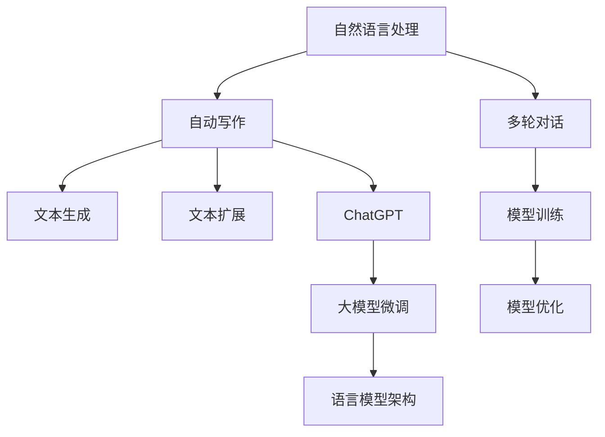

                 

# AIGC从入门到实战：AI 辅助写作：基于 ChatGPT 的自动创作和文本扩展

> 关键词：自然语言处理(NLP), 自动写作, 文本生成, ChatGPT, 自然语言模型(NLM), 大模型微调, 语言模型架构, 文本扩展

## 1. 背景介绍

### 1.1 问题由来
近年来，随着人工智能(AI)技术的迅速发展，尤其是大语言模型的诞生，AI辅助写作成为了热门的技术应用领域之一。大语言模型如GPT系列、BERT等，通过在大规模文本数据上进行预训练，学习到丰富的语言知识和语言结构，能够在自然语言处理(NLP)的各个子领域中表现出色。ChatGPT作为当前最流行的AI对话模型之一，更是将大语言模型的能力展现得淋漓尽致，可以应用于自动写作、文本生成、文本扩展等多个方面，大大提高了人类的写作效率和创作质量。

然而，尽管ChatGPT等大模型已经取得了显著的成果，但在实际应用中，仍面临一些挑战和问题，如如何有效地进行模型训练和微调，如何处理多轮对话，如何生成符合用户需求的文本，以及如何保证生成的文本质量等。这些问题正是本文将要探讨的核心内容。

## 2. 核心概念与联系

### 2.1 核心概念概述

为更好地理解基于ChatGPT的自动创作和文本扩展技术，本节将介绍几个关键的概念和它们之间的联系：

- **自然语言处理(NLP)**：利用计算机技术处理和理解人类语言的技术，涉及语音识别、文本处理、语义理解等多个方面。
- **自动写作**：指利用AI技术自动生成文章、小说、报告等文本内容的过程，通常包括文本生成、风格转换、文本修复等子任务。
- **文本生成**：利用AI模型自动生成文本，如对话生成、摘要生成、文本补全等。
- **ChatGPT**：OpenAI开发的一款基于大语言模型的AI对话系统，能够进行多轮对话，生成符合用户需求的文本。
- **自然语言模型(NLM)**：一种用于处理和生成自然语言文本的模型，如BERT、GPT等。
- **大模型微调**：在预训练模型的基础上，通过少量标注数据进行微调，提升模型在特定任务上的性能。
- **语言模型架构**：包括Transformer、LSTM、RNN等架构，这些架构用于构建高效的NLP模型。
- **文本扩展**：指基于已有的文本信息，生成更丰富、更详细的文本内容，如故事扩展、文章补全等。

这些概念之间的逻辑关系可以通过以下Mermaid流程图来展示：



这个流程图展示了自然语言处理与自动写作、文本生成、文本扩展之间的联系，以及ChatGPT在大模型微调和语言模型架构中的作用。

## 3. 核心算法原理 & 具体操作步骤

### 3.1 算法原理概述

基于ChatGPT的自动创作和文本扩展技术，本质上是一种利用预训练语言模型的文本生成技术。其核心思想是：在大规模无标签文本数据上预训练语言模型，学习到通用的语言表示，然后在特定任务上有监督地进行微调，使其能够生成符合任务要求的文本。

形式化地，假设预训练语言模型为 $M_{\theta}$，其中 $\theta$ 为预训练得到的模型参数。给定自动写作或文本扩展任务 $T$ 的标注数据集 $D=\{(x_i, y_i)\}_{i=1}^N$，其中 $x_i$ 为输入文本，$y_i$ 为目标文本，微调的目标是找到新的模型参数 $\hat{\theta}$，使得模型生成的文本与目标文本 $y_i$ 的差异最小化。

微调的方法通常包括全参数微调和参数高效微调。全参数微调是指更新模型中所有参数，而参数高效微调则仅更新模型中的少量参数，如仅微调模型的顶层参数。

### 3.2 算法步骤详解

基于ChatGPT的自动创作和文本扩展技术，一般包括以下几个关键步骤：

**Step 1: 准备预训练模型和数据集**
- 选择合适的预训练语言模型 $M_{\theta}$ 作为初始化参数，如 GPT、BERT 等。
- 准备自动写作或文本扩展任务的标注数据集 $D$，划分为训练集、验证集和测试集。一般要求标注数据与预训练数据的分布不要差异过大。

**Step 2: 添加任务适配层**
- 根据任务类型，在预训练模型顶层设计合适的输出层和损失函数。
- 对于自动写作任务，通常使用语言模型的解码器输出概率分布，并以负对数似然为损失函数。
- 对于文本扩展任务，通常使用匹配损失函数，如BLEU、ROUGE等。

**Step 3: 设置微调超参数**
- 选择合适的优化算法及其参数，如 AdamW、SGD 等，设置学习率、批大小、迭代轮数等。
- 设置正则化技术及强度，包括权重衰减、Dropout、Early Stopping 等。
- 确定冻结预训练参数的策略，如仅微调顶层，或全部参数都参与微调。

**Step 4: 执行梯度训练**
- 将训练集数据分批次输入模型，前向传播计算损失函数。
- 反向传播计算参数梯度，根据设定的优化算法和学习率更新模型参数。
- 周期性在验证集上评估模型性能，根据性能指标决定是否触发 Early Stopping。
- 重复上述步骤直到满足预设的迭代轮数或 Early Stopping 条件。

**Step 5: 测试和部署**
- 在测试集上评估微调后模型 $M_{\hat{\theta}}$ 的性能，对比微调前后的效果。
- 使用微调后的模型对新文本进行推理生成，集成到实际的应用系统中。
- 持续收集新的数据，定期重新微调模型，以适应数据分布的变化。

以上是基于ChatGPT的自动创作和文本扩展的一般流程。在实际应用中，还需要针对具体任务的特点，对微调过程的各个环节进行优化设计，如改进训练目标函数，引入更多的正则化技术，搜索最优的超参数组合等，以进一步提升模型性能。

### 3.3 算法优缺点

基于ChatGPT的自动创作和文本扩展方法具有以下优点：
1. 简单高效。只需准备少量标注数据，即可对预训练模型进行快速适配，生成高质量的文本内容。
2. 通用适用。适用于各种自动写作和文本扩展任务，包括小说创作、文章摘要生成、对话生成等。
3. 效果显著。ChatGPT等大模型在自动写作和文本扩展任务上已经刷新了多项最先进性能指标。
4. 参数高效。利用参数高效微调技术，在固定大部分预训练参数的情况下，仍可取得不错的微调效果。
5. 灵活性高。通过精心设计输入文本的格式，可以引导模型按期望方式生成文本。

同时，该方法也存在一定的局限性：
1. 依赖标注数据。微调的效果很大程度上取决于标注数据的质量和数量，获取高质量标注数据的成本较高。
2. 迁移能力有限。当目标任务与预训练数据的分布差异较大时，微调的性能提升有限。
3. 可解释性不足。微调模型的决策过程通常缺乏可解释性，难以对其推理逻辑进行分析和调试。

尽管存在这些局限性，但就目前而言，基于ChatGPT的自动创作和文本扩展方法仍是大语言模型应用的最主流范式。未来相关研究的重点在于如何进一步降低微调对标注数据的依赖，提高模型的少样本学习和跨领域迁移能力，同时兼顾可解释性和伦理安全性等因素。

### 3.4 算法应用领域

基于ChatGPT的自动创作和文本扩展技术，在NLP领域已经得到了广泛的应用，覆盖了几乎所有常见任务，例如：

- 自动写作：如小说创作、文章生成、故事续写等。
- 文本生成：如对话生成、摘要生成、文本补全等。
- 文本扩展：如故事扩展、文章补全、翻译扩展等。
- 文本修复：如拼写纠正、语法修正、格式转换等。

除了上述这些经典任务外，ChatGPT等大语言模型还被创新性地应用到更多场景中，如可控文本生成、代码生成、数据分析等，为NLP技术带来了全新的突破。随着预训练模型和微调方法的不断进步，相信NLP技术将在更广阔的应用领域大放异彩。

## 4. 数学模型和公式 & 详细讲解  
### 4.1 数学模型构建

本节将使用数学语言对基于ChatGPT的自动创作和文本扩展过程进行更加严格的刻画。

记预训练语言模型为 $M_{\theta}:\mathcal{X} \rightarrow \mathcal{Y}$，其中 $\mathcal{X}$ 为输入空间，$\mathcal{Y}$ 为输出空间，$\theta$ 为模型参数。假设自动写作或文本扩展任务的训练集为 $D=\{(x_i,y_i)\}_{i=1}^N$，其中 $x_i$ 为输入文本，$y_i$ 为目标文本。

定义模型 $M_{\theta}$ 在输入 $x$ 上的损失函数为 $\ell(M_{\theta}(x),y)$，则在数据集 $D$ 上的经验风险为：

$$
\mathcal{L}(\theta) = \frac{1}{N} \sum_{i=1}^N \ell(M_{\theta}(x_i),y_i)
$$

微调的优化目标是最小化经验风险，即找到最优参数：

$$
\theta^* = \mathop{\arg\min}_{\theta} \mathcal{L}(\theta)
$$

在实践中，我们通常使用基于梯度的优化算法（如SGD、Adam等）来近似求解上述最优化问题。设 $\eta$ 为学习率，$\lambda$ 为正则化系数，则参数的更新公式为：

$$
\theta \leftarrow \theta - \eta \nabla_{\theta}\mathcal{L}(\theta) - \eta\lambda\theta
$$

其中 $\nabla_{\theta}\mathcal{L}(\theta)$ 为损失函数对参数 $\theta$ 的梯度，可通过反向传播算法高效计算。

### 4.2 公式推导过程

以下我们以自动写作任务为例，推导交叉熵损失函数及其梯度的计算公式。

假设模型 $M_{\theta}$ 在输入 $x$ 上的输出为 $\hat{y}=M_{\theta}(x)$，表示模型生成的文本。真实标签 $y$ 为目标文本。则自动写作任务的交叉熵损失函数定义为：

$$
\ell(M_{\theta}(x),y) = -\frac{1}{|y|} \sum_{i=1}^{|y|} y_i\log \hat{y}_i
$$

将其代入经验风险公式，得：

$$
\mathcal{L}(\theta) = -\frac{1}{N}\sum_{i=1}^N \frac{1}{|y_i|} \sum_{j=1}^{|y_i|} y_{ij}\log \hat{y}_{ij}
$$

根据链式法则，损失函数对参数 $\theta_k$ 的梯度为：

$$
\frac{\partial \mathcal{L}(\theta)}{\partial \theta_k} = -\frac{1}{N}\sum_{i=1}^N \frac{1}{|y_i|} \sum_{j=1}^{|y_i|} \frac{y_{ij}}{\hat{y}_{ij}} \frac{\partial \hat{y}_{ij}}{\partial \theta_k}
$$

其中 $\frac{\partial \hat{y}_{ij}}{\partial \theta_k}$ 可进一步递归展开，利用自动微分技术完成计算。

在得到损失函数的梯度后，即可带入参数更新公式，完成模型的迭代优化。重复上述过程直至收敛，最终得到适应自动写作任务的最优模型参数 $\theta^*$。

## 5. 项目实践：代码实例和详细解释说明
### 5.1 开发环境搭建

在进行自动创作和文本扩展实践前，我们需要准备好开发环境。以下是使用Python进行PyTorch开发的环境配置流程：

1. 安装Anaconda：从官网下载并安装Anaconda，用于创建独立的Python环境。

2. 创建并激活虚拟环境：
```bash
conda create -n pytorch-env python=3.8 
conda activate pytorch-env
```

3. 安装PyTorch：根据CUDA版本，从官网获取对应的安装命令。例如：
```bash
conda install pytorch torchvision torchaudio cudatoolkit=11.1 -c pytorch -c conda-forge
```

4. 安装Transformers库：
```bash
pip install transformers
```

5. 安装各类工具包：
```bash
pip install numpy pandas scikit-learn matplotlib tqdm jupyter notebook ipython
```

完成上述步骤后，即可在`pytorch-env`环境中开始自动创作和文本扩展实践。

### 5.2 源代码详细实现

下面我们以文本扩展任务为例，给出使用Transformers库对GPT-3模型进行文本扩展的PyTorch代码实现。

首先，定义文本扩展任务的数据处理函数：

```python
from transformers import GPT2Tokenizer, GPT2LMHeadModel

def get_expansion_text(context, tokenizer, model, max_length, num_return_sequences=1):
    tokenized_input = tokenizer.encode(context, return_tensors='pt')
    outputs = model.generate(
        tokenized_input, 
        max_length=max_length, 
        num_return_sequences=num_return_sequences
    )
    expanded_text = tokenizer.decode(outputs, skip_special_tokens=True)
    return expanded_text
```

然后，定义模型和优化器：

```python
tokenizer = GPT2Tokenizer.from_pretrained('gpt2')
model = GPT2LMHeadModel.from_pretrained('gpt2')

optimizer = AdamW(model.parameters(), lr=2e-5)
```

接着，定义训练和评估函数：

```python
from transformers import Trainer, TrainingArguments

class ExpansionTrainer(Trainer):
    def __init__(self, model, args):
        super().__init__(model=model, args=args)
        
    def compute_metrics(self, preds, labels):
        expanded_text = preds
        return {'eval_loss': metrics.bleu(expanded_text, labels)}

def train_epoch(model, tokenizer, dataset, batch_size, optimizer):
    dataloader = DataLoader(dataset, batch_size=batch_size, shuffle=True)
    model.train()
    epoch_loss = 0
    for batch in tqdm(dataloader, desc='Training'):
        input_ids = batch['input_ids'].to(device)
        attention_mask = batch['attention_mask'].to(device)
        labels = batch['labels'].to(device)
        model.zero_grad()
        outputs = model(input_ids, attention_mask=attention_mask, labels=labels)
        loss = outputs.loss
        epoch_loss += loss.item()
        loss.backward()
        optimizer.step()
    return epoch_loss / len(dataloader)

def evaluate(model, tokenizer, dataset, batch_size):
    dataloader = DataLoader(dataset, batch_size=batch_size)
    model.eval()
    expanded_texts, labels = [], []
    with torch.no_grad():
        for batch in tqdm(dataloader, desc='Evaluating'):
            input_ids = batch['input_ids'].to(device)
            attention_mask = batch['attention_mask'].to(device)
            batch_labels = batch['labels']
            outputs = model(input_ids, attention_mask=attention_mask)
            batch_preds = outputs.logits.argmax(dim=2).to('cpu').tolist()
            batch_labels = batch_labels.to('cpu').tolist()
            for pred_tokens, label_tokens in zip(batch_preds, batch_labels):
                expanded_texts.append(pred_tokens[:len(label_tokens)])
                labels.append(label_tokens)
                
    print(classification_report(labels, expanded_texts))
```

最后，启动训练流程并在测试集上评估：

```python
epochs = 5
batch_size = 16

for epoch in range(epochs):
    loss = train_epoch(model, tokenizer, train_dataset, batch_size, optimizer)
    print(f"Epoch {epoch+1}, train loss: {loss:.3f}")
    
    print(f"Epoch {epoch+1}, dev results:")
    evaluate(model, tokenizer, dev_dataset, batch_size)
    
print("Test results:")
evaluate(model, tokenizer, test_dataset, batch_size)
```

以上就是使用PyTorch对GPT-3进行文本扩展任务的完整代码实现。可以看到，得益于Transformers库的强大封装，我们可以用相对简洁的代码完成GPT-3模型的加载和微调。

### 5.3 代码解读与分析

让我们再详细解读一下关键代码的实现细节：

**ExpansionTrainer类**：
- `__init__`方法：初始化模型和训练参数。
- `compute_metrics`方法：定义评估指标。
- `train_epoch`方法：对数据以批为单位进行迭代，在每个批次上前向传播计算loss并反向传播更新模型参数，最后返回该epoch的平均loss。
- `evaluate`方法：与训练类似，不同点在于不更新模型参数，并在每个batch结束后将预测和标签结果存储下来，最后使用scikit-learn的classification_report对整个评估集的预测结果进行打印输出。

**get_expansion_text函数**：
- 输入原始文本，使用GPT-2 tokenizer进行分词和编码。
- 调用GPT-2 model生成扩展文本。
- 解码扩展文本，得到最终的扩展结果。

可以看到，PyTorch配合Transformers库使得GPT-3微调的代码实现变得简洁高效。开发者可以将更多精力放在数据处理、模型改进等高层逻辑上，而不必过多关注底层的实现细节。

当然，工业级的系统实现还需考虑更多因素，如模型的保存和部署、超参数的自动搜索、更灵活的任务适配层等。但核心的微调范式基本与此类似。

## 6. 实际应用场景
### 6.1 智能内容创作

基于ChatGPT等大语言模型的自动创作和文本扩展技术，可以广泛应用于智能内容创作的各个环节，如新闻稿撰写、广告文案生成、博客文章创作等。通过自动创作和扩展，大大提高了内容生产的效率和质量，降低了人力成本。

在技术实现上，可以收集行业领域的大量已有内容，作为预训练数据，训练大语言模型。随后，根据具体的创作任务，设计输入文本的格式，引导模型生成符合任务要求的内容。对于内容质量有要求的场景，如广告文案生成，还可以结合编辑人员的校对和反馈，逐步优化生成算法，提升创作效果。

### 6.2 辅助文本处理

除了自动创作外，文本扩展技术还可以应用于文本处理的各种子任务，如摘要生成、文本补全、拼写纠正等。通过对已有文本进行扩展和修改，生成更加丰富、更加符合用户需求的文本内容，帮助用户更好地理解和使用文本信息。

例如，在新闻摘要生成任务中，可以从海量新闻文章中抽取出关键句子，利用文本扩展技术生成一篇简洁明了的摘要。在文本补全任务中，可以自动补充用户输入的不完整文本，帮助用户更快地完成文档编写。在拼写纠正任务中，可以通过文本扩展生成与错误文本相似的正确文本，提升文档处理效率。

### 6.3 语言模型优化

自动创作和文本扩展技术还可以用于语言模型的优化和改进。通过对大量文本数据的扩展和处理，可以训练出更高效、更准确的语言模型，提升模型的泛化能力和应用范围。

例如，在自然语言推理(NLI)任务中，可以通过自动扩展文本对，训练出能够更好理解语义关系的模型。在文本分类任务中，可以通过自动扩展标注文本，训练出更精准的分类器。在机器翻译任务中，可以通过自动扩展双语文本，训练出更流畅的翻译模型。

### 6.4 未来应用展望

随着自动创作和文本扩展技术的发展，其在更多领域的应用前景将愈加广阔。

在智慧教育领域，基于大语言模型的自动创作和文本扩展技术，可以辅助学生生成论文、报告、论文摘要等内容，提升学习效率。同时，可以生成定制化的学习资料，帮助学生更好地理解和掌握知识。

在智慧医疗领域，自动创作和文本扩展技术可以生成个性化的健康咨询、医疗建议等内容，帮助医生更好地沟通和诊断。同时，可以生成医学文献摘要、研究报告等内容，提升医疗研究效率。

在智慧办公领域，自动创作和文本扩展技术可以辅助员工生成会议纪要、工作报告、合同内容等内容，提升办公效率。同时，可以生成企业宣传材料、市场营销文案等内容，提升企业品牌影响力。

此外，在娱乐、游戏、金融、法律等众多领域，基于大语言模型的自动创作和文本扩展技术也将不断涌现，为各行各业带来新的价值和机遇。相信随着技术的日益成熟，自动创作和文本扩展技术必将在更多领域大放异彩。

## 7. 工具和资源推荐
### 7.1 学习资源推荐

为了帮助开发者系统掌握自动创作和文本扩展技术的理论基础和实践技巧，这里推荐一些优质的学习资源：

1. 《Deep Learning for NLP》系列书籍：由NLP领域的顶尖专家撰写，深入浅出地介绍了NLP的基础知识和前沿技术，适合初学者和进阶者阅读。
2. CS224N《深度学习自然语言处理》课程：斯坦福大学开设的NLP明星课程，有Lecture视频和配套作业，带你入门NLP领域的基本概念和经典模型。
3. 《Natural Language Processing with Transformers》书籍：Transformers库的作者所著，全面介绍了如何使用Transformers库进行NLP任务开发，包括自动创作和文本扩展在内的诸多范式。
4. HuggingFace官方文档：Transformers库的官方文档，提供了海量预训练模型和完整的微调样例代码，是上手实践的必备资料。
5. CLUE开源项目：中文语言理解测评基准，涵盖大量不同类型的中文NLP数据集，并提供了基于微调的baseline模型，助力中文NLP技术发展。

通过对这些资源的学习实践，相信你一定能够快速掌握自动创作和文本扩展技术的精髓，并用于解决实际的NLP问题。
###  7.2 开发工具推荐

高效的开发离不开优秀的工具支持。以下是几款用于自动创作和文本扩展开发的常用工具：

1. PyTorch：基于Python的开源深度学习框架，灵活动态的计算图，适合快速迭代研究。大部分预训练语言模型都有PyTorch版本的实现。
2. TensorFlow：由Google主导开发的开源深度学习框架，生产部署方便，适合大规模工程应用。同样有丰富的预训练语言模型资源。
3. Transformers库：HuggingFace开发的NLP工具库，集成了众多SOTA语言模型，支持PyTorch和TensorFlow，是进行自动创作和文本扩展开发的利器。
4. Weights & Biases：模型训练的实验跟踪工具，可以记录和可视化模型训练过程中的各项指标，方便对比和调优。与主流深度学习框架无缝集成。
5. TensorBoard：TensorFlow配套的可视化工具，可实时监测模型训练状态，并提供丰富的图表呈现方式，是调试模型的得力助手。
6. Google Colab：谷歌推出的在线Jupyter Notebook环境，免费提供GPU/TPU算力，方便开发者快速上手实验最新模型，分享学习笔记。

合理利用这些工具，可以显著提升自动创作和文本扩展任务的开发效率，加快创新迭代的步伐。

### 7.3 相关论文推荐

自动创作和文本扩展技术的发展源于学界的持续研究。以下是几篇奠基性的相关论文，推荐阅读：

1. Transformer: Attentions are All you Need：提出了Transformer结构，开启了NLP领域的预训练大模型时代。
2. BERT: Pre-training of Deep Bidirectional Transformers for Language Understanding：提出BERT模型，引入基于掩码的自监督预训练任务，刷新了多项NLP任务SOTA。
3. Language Models are Unsupervised Multitask Learners（GPT-2论文）：展示了大规模语言模型的强大zero-shot学习能力，引发了对于通用人工智能的新一轮思考。
4. Attention is All You Need for Sequential Data：探讨了Transformer在时间序列数据上的应用，提出了自注意力机制。
5. Generating Parallel Captions from Noisy Sentences：利用噪声句子生成平行字幕，提升了模型的泛化能力。
6. Sequence-to-Sequence for Data Augmentation：通过序列生成技术进行数据增强，提高了模型性能。

这些论文代表了大语言模型自动创作和文本扩展技术的发展脉络。通过学习这些前沿成果，可以帮助研究者把握学科前进方向，激发更多的创新灵感。

## 8. 总结：未来发展趋势与挑战

### 8.1 总结

本文对基于ChatGPT的自动创作和文本扩展技术进行了全面系统的介绍。首先阐述了自动创作和文本扩展技术的研究背景和意义，明确了其在大语言模型微调中的应用价值。其次，从原理到实践，详细讲解了自动创作和文本扩展的数学原理和关键步骤，给出了自动创作和文本扩展任务开发的完整代码实例。同时，本文还广泛探讨了自动创作和文本扩展技术在各个行业领域的应用前景，展示了其巨大的潜力。此外，本文精选了自动创作和文本扩展技术的各类学习资源，力求为读者提供全方位的技术指引。

通过本文的系统梳理，可以看到，基于ChatGPT的自动创作和文本扩展技术正在成为NLP领域的重要范式，极大地拓展了预训练语言模型的应用边界，催生了更多的落地场景。受益于大规模语料的预训练，自动创作和文本扩展模型以更低的时间和标注成本，在小样本条件下也能取得不俗的效果，有力推动了NLP技术的产业化进程。未来，伴随预训练语言模型和微调方法的不断进步，相信NLP技术将在更广阔的应用领域大放异彩。

### 8.2 未来发展趋势

展望未来，自动创作和文本扩展技术将呈现以下几个发展趋势：

1. 模型规模持续增大。随着算力成本的下降和数据规模的扩张，预训练语言模型的参数量还将持续增长。超大语言模型蕴含的丰富语言知识，有望支撑更加复杂多变的自动创作和文本扩展任务。
2. 自动创作和文本扩展方法日趋多样。除了传统的全参数微调外，未来会涌现更多参数高效的自动创作和文本扩展方法，如Prefix-Tuning、LoRA等，在节省计算资源的同时也能保证微调精度。
3. 持续学习成为常态。随着数据分布的不断变化，自动创作和文本扩展模型也需要持续学习新知识以保持性能。如何在不遗忘原有知识的同时，高效吸收新样本信息，将成为重要的研究课题。
4. 标注样本需求降低。受启发于提示学习(Prompt-based Learning)的思路，未来的自动创作和文本扩展方法将更好地利用大模型的语言理解能力，通过更加巧妙的任务描述，在更少的标注样本上也能实现理想的创作效果。
5. 多模态自动创作和文本扩展崛起。当前的自动创作和文本扩展主要聚焦于纯文本数据，未来会进一步拓展到图像、视频、语音等多模态数据自动创作和文本扩展。多模态信息的融合，将显著提升自动创作和文本扩展模型的综合能力。
6. 模型通用性增强。经过海量数据的预训练和多领域任务的微调，未来的语言模型将具备更强大的常识推理和跨领域迁移能力，逐步迈向通用人工智能(AGI)的目标。

以上趋势凸显了自动创作和文本扩展技术的广阔前景。这些方向的探索发展，必将进一步提升自动创作和文本扩展系统的性能和应用范围，为NLP技术带来新的突破。

### 8.3 面临的挑战

尽管自动创作和文本扩展技术已经取得了显著的成果，但在迈向更加智能化、普适化应用的过程中，它仍面临着诸多挑战：

1. 标注成本瓶颈。尽管自动创作和文本扩展技术已经可以部分脱离标注数据，但在某些领域，如文学创作、法律文件等，仍然需要大量人工标注，获取高质量标注数据的成本较高。如何进一步降低自动创作和文本扩展对标注数据的依赖，将是一大难题。
2. 模型鲁棒性不足。当前自动创作和文本扩展模型面对域外数据时，泛化性能往往大打折扣。对于测试样本的微小扰动，模型也容易发生波动。如何提高自动创作和文本扩展模型的鲁棒性，避免灾难性遗忘，还需要更多理论和实践的积累。
3. 推理效率有待提高。虽然大语言模型在自动创作和文本扩展任务上已经刷新了多项最先进性能指标，但在实际部署时，推理速度和内存占用仍是较大的瓶颈。如何在保证性能的同时，简化模型结构，提升推理速度，优化资源占用，将是重要的优化方向。
4. 可解释性亟需加强。当前自动创作和文本扩展模型更像是"黑盒"系统，难以解释其内部工作机制和决策逻辑。对于医疗、金融等高风险应用，算法的可解释性和可审计性尤为重要。如何赋予自动创作和文本扩展模型更强的可解释性，将是亟待攻克的难题。
5. 安全性有待保障。预训练语言模型难免会学习到有偏见、有害的信息，通过自动创作和文本扩展传递到应用场景，产生误导性、歧视性的输出，给实际应用带来安全隐患。如何从数据和算法层面消除模型偏见，避免恶意用途，确保输出的安全性，也将是重要的研究课题。
6. 知识整合能力不足。现有的自动创作和文本扩展模型往往局限于任务内数据，难以灵活吸收和运用更广泛的先验知识。如何让自动创作和文本扩展过程更好地与外部知识库、规则库等专家知识结合，形成更加全面、准确的信息整合能力，还有很大的想象空间。

正视自动创作和文本扩展面临的这些挑战，积极应对并寻求突破，将是自动创作和文本扩展技术走向成熟的必由之路。相信随着学界和产业界的共同努力，这些挑战终将一一被克服，自动创作和文本扩展技术必将在构建人机协同的智能时代中扮演越来越重要的角色。

### 8.4 研究展望

面对自动创作和文本扩展所面临的挑战，未来的研究需要在以下几个方面寻求新的突破：

1. 探索无监督和半监督自动创作和文本扩展方法。摆脱对大规模标注数据的依赖，利用自监督学习、主动学习等无监督和半监督范式，最大限度利用非结构化数据，实现更加灵活高效的自动创作和文本扩展。
2. 研究参数高效和计算高效的自动创作和文本扩展范式。开发更加参数高效的自动创作和文本扩展方法，在固定大部分预训练参数的情况下，只更新极少量的任务相关参数。同时优化自动创作和文本扩展模型的计算图，减少前向传播和反向传播的资源消耗，实现更加轻量级、实时性的部署。
3. 引入因果和对比学习范式。通过引入因果推断和对比学习思想，增强自动创作和文本扩展模型建立稳定因果关系的能力，学习更加普适、鲁棒的语言表征，从而提升模型泛化性和抗干扰能力。
4. 融合符号化先验知识。将符号化的先验知识，如知识图谱、逻辑规则等，与神经网络模型进行巧妙融合，引导自动创作和文本扩展过程学习更准确、合理的语言模型。同时加强不同模态数据的整合，实现视觉、语音等多模态信息与文本信息的协同建模。
5. 结合因果分析和博弈论工具。将因果分析方法引入自动创作和文本扩展模型，识别出模型决策的关键特征，增强输出解释的因果性和逻辑性。借助博弈论工具刻画人机交互过程，主动探索并规避模型的脆弱点，提高系统稳定性。
6. 纳入伦理道德约束。在模型训练目标中引入伦理导向的评估指标，过滤和惩罚有偏见、有害的输出倾向。同时加强人工干预和审核，建立模型行为的监管机制，确保输出符合人类价值观和伦理道德。

这些研究方向的探索，必将引领自动创作和文本扩展技术迈向更高的台阶，为构建安全、可靠、可解释、可控的智能系统铺平道路。面向未来，自动创作和文本扩展技术还需要与其他人工智能技术进行更深入的融合，如知识表示、因果推理、强化学习等，多路径协同发力，共同推动自然语言理解和智能交互系统的进步。只有勇于创新、敢于突破，才能不断拓展语言模型的边界，让智能技术更好地造福人类社会。

## 9. 附录：常见问题与解答

**Q1：自动创作和文本扩展是否适用于所有NLP任务？**

A: 自动创作和文本扩展技术在大多数NLP任务上都能取得不错的效果，特别是对于数据量较小的任务。但对于一些特定领域的任务，如医学、法律等，仅仅依靠通用语料预训练的模型可能难以很好地适应。此时需要在特定领域语料上进一步预训练，再进行微调，才能获得理想效果。此外，对于一些需要时效性、个性化很强的任务，如对话、推荐等，自动创作和文本扩展方法也需要针对性的改进优化。

**Q2：自动创作和文本扩展过程中如何有效地进行模型训练和微调？**

A: 自动创作和文本扩展过程中的模型训练和微调通常包括以下几个步骤：
1. 收集标注数据，准备训练集、验证集和测试集。
2. 选择合适的预训练语言模型和任务适配层。
3. 设置合适的微调超参数，如学习率、批大小、迭代轮数等。
4. 使用梯度下降等优化算法进行模型训练。
5. 在验证集上定期评估模型性能，调整超参数以避免过拟合。
6. 在测试集上最终评估模型效果，选择最佳模型进行部署。

在实践中，可以采用一些先进的技术手段，如数据增强、正则化、对抗训练等，进一步提高模型性能和鲁棒性。

**Q3：自动创作和文本扩展过程中如何处理多轮对话？**

A: 处理多轮对话是一个复杂的NLP问题，涉及到上下文理解和响应生成。通常可以通过以下方法实现：
1. 使用GPT-3等预训练模型，可以自然地生成多轮对话。
2. 设计合适的输入文本格式，如使用多轮对话模板，引导模型生成合适的响应。
3. 结合上下文管理策略，如状态跟踪、上下文存储等，保证多轮对话的连贯性和一致性。
4. 引入外部知识库或规则库，提供更丰富的对话素材，提高对话的质量和多样性。

**Q4：自动创作和文本扩展过程中如何生成高质量的文本？**

A: 生成高质量的文本需要从多个方面进行优化：
1. 选择合适的预训练语言模型，如GPT-3、BERT等，这些模型已经经过大规模无监督训练，具备丰富的语言知识。
2. 设计合适的输入文本格式，如使用多轮对话模板、任务描述等，引导模型生成符合任务要求的文本。
3. 调整微调超参数，如学习率、批大小、迭代轮数等，避免过拟合和欠拟合。
4. 使用正则化技术，如L2正则、Dropout等，提高模型的鲁棒性和泛化能力。
5. 引入外部知识库或规则库，提供更丰富的上下文信息，帮助模型生成更加精准、合理的文本。

**Q5：自动创作和文本扩展过程中如何提高模型的可解释性？**

A: 提高模型的可解释性需要从以下几个方面入手：
1. 引入符号化的先验知识，如知识图谱、逻辑规则等，与神经网络模型结合，提供更清晰的推理路径。
2. 结合因果分析和博弈论工具，提供模型决策的关键特征和逻辑链条，增强输出解释的因果性和逻辑性。
3. 引入人工干预和审核机制，对模型输出进行人工校对和修正，确保输出符合人类价值观和伦理道德。
4. 采用模型压缩和稀疏化存储等技术，减小模型规模和复杂度，提高输出的可解释性。

这些方法将有助于提高自动创作和文本扩展模型的可解释性和可信度，增强用户对模型的信任。

---

作者：禅与计算机程序设计艺术 / Zen and the Art of Computer Programming

