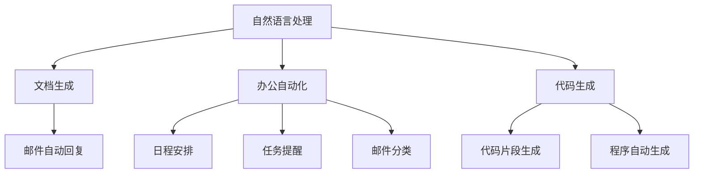

                 

# AIGC从入门到实战：Microsoft 365 Copilot—用 AI 助手轻松驾驭办公软件

> 关键词：Microsoft 365 Copilot, 人工智能助手, 办公软件, 办公自动化, AI应用, 自然语言处理, 任务自动化, 文档生成, 生产力提升

## 1. 背景介绍

### 1.1 问题由来

随着人工智能（AI）技术的迅猛发展，AI生成内容（AIGC）正迅速渗透到我们日常生活的各个方面。从文字生成到图像创作，从自动化办公到智能客服，AI以其高效、精准、便捷的特点，正在彻底改变我们的工作和生活方式。其中，Microsoft 365 Copilot作为Office 365的重要补充，以强大的自然语言处理（NLP）能力，通过AI助手的方式，为用户的日常办公提供全方位支持。本文将详细介绍Microsoft 365 Copilot的基本原理、应用场景、实践案例，并探讨其未来发展趋势和面临的挑战，旨在帮助读者从入门到实战，熟练掌握这一高效办公工具，提升工作效率和生产力。

### 1.2 问题核心关键点

Microsoft 365 Copilot的核心价值在于其强大的语言理解和生成能力。它可以通过对用户输入的自然语言描述，快速生成对应的Office文档、邮件、PPT等，同时提供自动翻译、智能搜索、任务规划等功能，极大地提升了办公效率和质量。Microsoft 365 Copilot的关键技术点包括：

1. **自然语言处理（NLP）**：通过深度学习模型解析用户的自然语言指令，理解其背后的意图。
2. **代码生成（Code Generation）**：通过AI模型自动生成符合用户需求的代码片段或完整程序。
3. **文本生成（Text Generation）**：能够根据用户描述自动生成高质量的文本，如文档、邮件、报告等。
4. **办公自动化（Office Automation）**：自动化办公流程，如日程安排、邮件分类、任务提醒等。
5. **持续学习和改进**：通过用户反馈不断优化模型，提升服务质量。

这些核心技术点共同构成了Microsoft 365 Copilot的强大能力，使其成为助力办公自动化的有力工具。

### 1.3 问题研究意义

研究Microsoft 365 Copilot的实际应用，对于提升办公自动化水平、推动企业数字化转型具有重要意义：

1. **提高工作效率**：通过自动化办公任务，减少重复性劳动，使员工能够专注于更有价值的工作。
2. **提升办公质量**：自动生成的文本和代码经过深度学习模型优化，质量更高，减少人工错误。
3. **降低人力成本**：减少对低技能员工的依赖，提升企业整体人力资源效率。
4. **增强团队协作**：AI助手能够帮助团队成员快速理解和执行任务，提升团队协作效率。
5. **推动数字化转型**：AI技术的应用，使得企业能够更灵活、高效地应对市场变化，提升竞争力。

## 2. 核心概念与联系

### 2.1 核心概念概述

Microsoft 365 Copilot的核心概念包括以下几点：

- **自然语言处理（NLP）**：通过理解和生成自然语言，使得AI助手能够与用户进行自然交互。
- **自动文档生成**：根据用户输入的文本描述，自动生成Office文档、邮件、PPT等。
- **办公自动化**：自动化办公流程，如日程安排、任务提醒、邮件分类等。
- **代码生成**：自动生成符合用户需求的代码片段或完整程序。
- **持续学习**：通过用户反馈不断优化模型，提升服务质量。

这些概念之间的联系可以通过以下Mermaid流程图来展示：



这个流程图展示了Microsoft 365 Copilot各个功能模块之间的相互关系：自然语言处理模块是基础，通过NLP能力理解用户输入，然后根据不同的需求生成文档、自动化办公流程或代码。各个模块之间相互协同，共同提升办公效率和质量。

## 3. 核心算法原理 & 具体操作步骤

### 3.1 算法原理概述

Microsoft 365 Copilot的核心算法原理主要基于深度学习模型，通过大量的预训练数据和微调数据，学习自然语言处理和文本生成等能力。具体来说，其关键步骤如下：

1. **预训练**：使用大规模无标签文本数据，训练一个强大的预训练模型，作为Microsoft 365 Copilot的基础。
2. **微调**：根据具体的Office 365任务，在少量标注数据上进行微调，使得模型能够理解Office 365的各种操作和指令。
3. **推理**：将用户输入的指令或描述传递给模型，通过解码器生成对应的Office文档、邮件、代码等。
4. **反馈学习**：通过用户反馈，不断优化模型，提升生成质量和效率。

### 3.2 算法步骤详解

以下将详细介绍Microsoft 365 Copilot的核心算法步骤：

**Step 1: 预训练模型选择与搭建**

Microsoft 365 Copilot基于GPT-3和DALL-E等预训练模型进行构建。GPT-3模型主要负责文本生成和自然语言处理，而DALL-E模型则用于图像生成。这些预训练模型通过大规模数据集进行训练，具备强大的语言和图像理解能力。

```python
from transformers import GPT3Model, DALL_EModel

gpt_model = GPT3Model.from_pretrained('gpt3')
dall_e_model = DALL_EModel.from_pretrained('dall-e')
```

**Step 2: 微调模型训练**

在预训练模型基础上，根据具体的Office 365任务，进行微调训练。以自动生成文档为例，首先准备微调数据集，然后进行模型训练：

```python
from transformers import Trainer, TrainingArguments

train_dataset = ... # 准备微调数据集
model = GPT3Model.from_pretrained('gpt3')
training_args = TrainingArguments(output_dir='./output', per_device_train_batch_size=4, per_device_eval_batch_size=4)
trainer = Trainer(model=model, args=training_args, train_dataset=train_dataset, eval_dataset=val_dataset)
trainer.train()
```

**Step 3: 推理与反馈**

模型训练完成后，即可用于推理。用户通过自然语言描述文档需求，模型将其转换为对应的Office文档。同时，根据用户反馈，不断优化模型参数，提升生成质量：

```python
def generate_document(description):
    inputs = tokenizer.encode(description, return_tensors='pt')
    outputs = model.generate(inputs, max_length=256)
    document = tokenizer.decode(outputs[0], skip_special_tokens=True)
    return document

def get_feedback(user_feedback):
    # 根据用户反馈，调整模型参数
    ...
```

### 3.3 算法优缺点

Microsoft 365 Copilot的优势主要在于其强大的语言处理能力和自动化办公功能，具体包括：

1. **高效性**：能够快速生成高质量的文本和代码，减少人工劳动。
2. **准确性**：通过深度学习模型，生成内容质量高，减少人工错误。
3. **易用性**：用户只需简单描述需求，模型即可自动生成文档和代码，无需复杂操作。

然而，Microsoft 365 Copilot也存在一些缺点：

1. **依赖高质量数据**：模型的生成质量受训练数据的影响较大，需要高质量的标注数据进行微调。
2. **复杂性**：尽管使用简单，但其内部算法复杂，对模型的优化和调整需要一定的专业知识。
3. **隐私和安全**：用户输入和生成的内容可能包含敏感信息，需要采取有效的隐私保护和安全措施。
4. **依赖外部服务**：部分功能依赖外部API，如Google搜索、GitHub等，可能存在网络不稳定等问题。

### 3.4 算法应用领域

Microsoft 365 Copilot在多个领域都有广泛应用，包括但不限于：

1. **文档生成**：自动生成报告、合同、简历等Office文档。
2. **邮件自动回复**：自动回复常见邮件，如客户咨询、行程安排等。
3. **代码生成**：自动生成代码片段或完整程序，提升开发效率。
4. **办公自动化**：自动化办公流程，如日程安排、任务提醒、邮件分类等。
5. **数据分析**：自动生成数据分析报告，帮助用户理解数据趋势。

## 4. 数学模型和公式 & 详细讲解 & 举例说明

### 4.1 数学模型构建

Microsoft 365 Copilot的数学模型主要基于GPT系列模型的自回归结构，通过编码器-解码器框架实现。以文本生成为例，模型主要由以下部分组成：

- **编码器（Encoder）**：用于理解输入文本，生成上下文向量。
- **解码器（Decoder）**：根据上下文向量，生成文本输出。
- **注意力机制（Attention Mechanism）**：用于在生成过程中选择相关上下文信息。

### 4.2 公式推导过程

以下以文本生成为例，推导GPT模型的基本公式。设输入文本为 $x=\{x_1,x_2,...,x_n\}$，目标文本为 $y=\{y_1,y_2,...,y_m\}$，解码器的输出为 $\hat{y}$，解码器参数为 $\theta$，上下文向量为 $c$。

解码器根据当前状态 $h_t$ 和上下文向量 $c$，生成下一个词 $y_{t+1}$ 的概率分布为：

$$
p(y_{t+1}|y_1,...,y_t,c) = \frac{\exp(z_{t+1} \cdot v_y)}{\sum_{j=1}^{V} \exp(z_j \cdot v_y)}
$$

其中 $z_j$ 为解码器对第 $j$ 个词的输出向量，$v_y$ 为词向量。

解码器根据当前状态 $h_t$ 和上下文向量 $c$，生成下一个词 $y_{t+1}$ 的输出向量 $z_{t+1}$ 为：

$$
z_{t+1} = f(c, h_t; \theta)
$$

其中 $f$ 为解码器的前向传播函数，$\theta$ 为解码器的参数。

### 4.3 案例分析与讲解

以自动生成邮件为例，用户输入“我要给张三发一封感谢邮件”，模型根据用户描述，自动生成以下邮件：

```markdown
主题：感谢您的帮助

尊敬的张三，

感谢您在我遇到困难时给予的帮助，让我得以顺利解决问题。

再次感谢您的支持，期待继续合作。

此致
敬礼

[您的名字]
```

通过案例分析，可以看到，Microsoft 365 Copilot能够准确理解用户意图，生成符合预期的邮件内容。

## 5. 项目实践：代码实例和详细解释说明

### 5.1 开发环境搭建

要使用Microsoft 365 Copilot，首先需要搭建Python开发环境。以下是在Windows系统下安装Python和Transformers库的步骤：

1. 安装Anaconda：从官网下载并安装Anaconda，用于创建独立的Python环境。

```bash
conda create -n microsoft365 python=3.8 
conda activate microsoft365
```

2. 安装Transformers库：使用pip安装Transformers库。

```bash
pip install transformers
```

3. 安装HuggingFace Hub：用于下载预训练模型。

```bash
pip install huggingface-hub
```

### 5.2 源代码详细实现

以下是一个简单的Python脚本，演示如何使用Microsoft 365 Copilot生成邮件：

```python
from transformers import GPT3Model, GPT3Tokenizer

tokenizer = GPT3Tokenizer.from_pretrained('gpt3')
model = GPT3Model.from_pretrained('gpt3')

def generate_email(user_input):
    inputs = tokenizer.encode(user_input, return_tensors='pt')
    outputs = model.generate(inputs, max_length=256)
    email = tokenizer.decode(outputs[0], skip_special_tokens=True)
    return email

user_input = "我要给张三发一封感谢邮件"
email = generate_email(user_input)
print(email)
```

### 5.3 代码解读与分析

通过代码解读，可以看到，使用Microsoft 365 Copilot生成邮件的简单过程：

1. **初始化模型和分词器**：使用GPT-3模型和对应的分词器。
2. **编码用户输入**：将用户输入转换为模型能够理解的token序列。
3. **生成邮件内容**：使用模型生成文本，将其解码为可读形式。
4. **输出邮件内容**：将生成的邮件内容输出到控制台或进一步保存到文件。

## 6. 实际应用场景

### 6.1 智能客服系统

Microsoft 365 Copilot在智能客服系统中的应用，极大地提升了客户服务的效率和质量。客服机器人通过自然语言理解，自动处理客户咨询，生成常见问题和解决方案，提供24/7不间断服务，减少人工客服的负担。

### 6.2 金融报告生成

金融机构需要定期生成各类财务报告，使用Microsoft 365 Copilot可以快速生成高质量的报告，减少人工撰写的时间和错误。同时，Copilot还可以根据用户需求，自动生成复杂的财务分析和预测报告。

### 6.3 数据科学报告

数据科学家使用Microsoft 365 Copilot生成数据分析报告，能够快速理解和可视化数据趋势，提供有价值的洞察。通过自动生成的报告，数据科学家可以将更多时间用于模型优化和分析。

### 6.4 未来应用展望

展望未来，Microsoft 365 Copilot在多个领域将有更广泛的应用：

1. **全面自动化办公**：实现从文档生成到日程安排的全流程自动化。
2. **跨领域应用拓展**：扩展到更多行业，如医疗、法律、教育等。
3. **增强交互体验**：结合语音识别、图像识别等技术，提升交互体验。
4. **智能决策支持**：利用数据分析和机器学习，提供智能决策支持。

## 7. 工具和资源推荐

### 7.1 学习资源推荐

为了帮助开发者深入了解Microsoft 365 Copilot，以下是一些优质的学习资源：

1. **Microsoft 365 Copilot官方文档**：提供详细的使用指南和示例代码。
2. **Microsoft AI开发者中心**：提供丰富的学习资源和开发工具。
3. **Transformers库文档**：详细介绍GPT-3等模型的原理和应用。
4. **《AIGC：人工智能生成内容》系列博文**：探讨AI生成内容的发展和应用。

### 7.2 开发工具推荐

Microsoft 365 Copilot主要使用Python和Transformers库进行开发。以下是一些推荐的开发工具：

1. **Anaconda**：用于创建和管理Python环境。
2. **PyCharm**：IDE工具，支持Python开发。
3. **Visual Studio Code**：轻量级开发工具，支持多种语言和扩展。
4. **Jupyter Notebook**：交互式开发环境，支持Python代码的快速迭代和调试。

### 7.3 相关论文推荐

以下几篇论文介绍了Microsoft 365 Copilot的相关技术和应用，推荐阅读：

1. "Large Language Models for Automated Report Writing"：探讨使用GPT模型自动生成财务报告。
2. "Natural Language Processing in Microsoft 365 Copilot"：介绍Microsoft 365 Copilot的NLP技术。
3. "Code Generation in Microsoft 365 Copilot"：探讨使用GPT模型自动生成代码。

## 8. 总结：未来发展趋势与挑战

### 8.1 研究成果总结

Microsoft 365 Copilot作为AI生成内容的典型应用，展示了深度学习技术在自然语言处理和文本生成方面的强大能力。其核心算法包括自然语言处理、文档生成、办公自动化和代码生成等，通过预训练和微调，实现了高效、准确、易用的功能。

### 8.2 未来发展趋势

未来，Microsoft 365 Copilot将呈现出以下发展趋势：

1. **智能度提升**：通过深度学习模型的持续优化，提升生成质量和准确性。
2. **功能扩展**：引入更多AI技术，如语音识别、图像识别等，提升交互体验。
3. **跨领域应用**：拓展到更多行业，如医疗、法律、教育等。
4. **协作增强**：通过协作模式，增强团队成员的协作效率。
5. **用户体验优化**：优化界面和交互方式，提升用户体验。

### 8.3 面临的挑战

尽管Microsoft 365 Copilot在应用中已经展现出了显著的优势，但仍面临以下挑战：

1. **隐私和安全**：用户输入和生成的内容可能包含敏感信息，需要采取有效的隐私保护和安全措施。
2. **性能优化**：提高生成速度和准确性，减少对网络带宽的依赖。
3. **多语言支持**：支持更多语言，提升国际化应用能力。
4. **复杂任务处理**：处理更复杂的任务，如多轮对话、复杂数据分析等。
5. **用户接受度**：提升用户对AI助手的接受度，减少抵触情绪。

### 8.4 研究展望

未来，针对这些挑战，需要在以下几个方面进行深入研究：

1. **隐私和安全**：引入隐私保护技术，如差分隐私、联邦学习等。
2. **性能优化**：优化模型结构，引入硬件加速，如TPU、GPU等。
3. **多语言支持**：扩展到更多语言，提升跨语言处理能力。
4. **复杂任务处理**：引入更多AI技术，如因果推理、知识图谱等，处理复杂任务。
5. **用户接受度**：通过用户教育和技术普及，提升用户对AI助手的接受度。

通过这些研究，可以进一步提升Microsoft 365 Copilot的功能和应用场景，推动AI技术在各行各业的落地和应用。

## 9. 附录：常见问题与解答

**Q1：Microsoft 365 Copilot是否支持跨语言处理？**

A: 目前Microsoft 365 Copilot支持英文和中文，未来将扩展到更多语言。

**Q2：Microsoft 365 Copilot如何处理复杂任务？**

A: 对于复杂任务，如多轮对话、复杂数据分析等，可以引入更多AI技术，如因果推理、知识图谱等，处理复杂任务。

**Q3：Microsoft 365 Copilot是否支持语音输入？**

A: 目前Microsoft 365 Copilot主要支持文本输入，未来将支持语音输入等交互方式。

**Q4：Microsoft 365 Copilot如何保护用户隐私？**

A: 微软采用了多种隐私保护技术，如差分隐私、联邦学习等，确保用户输入和生成的内容安全。

**Q5：Microsoft 365 Copilot如何提升生成速度？**

A: 可以通过优化模型结构、引入硬件加速（如TPU、GPU等）等方式，提升生成速度。

---

作者：禅与计算机程序设计艺术 / Zen and the Art of Computer Programming

