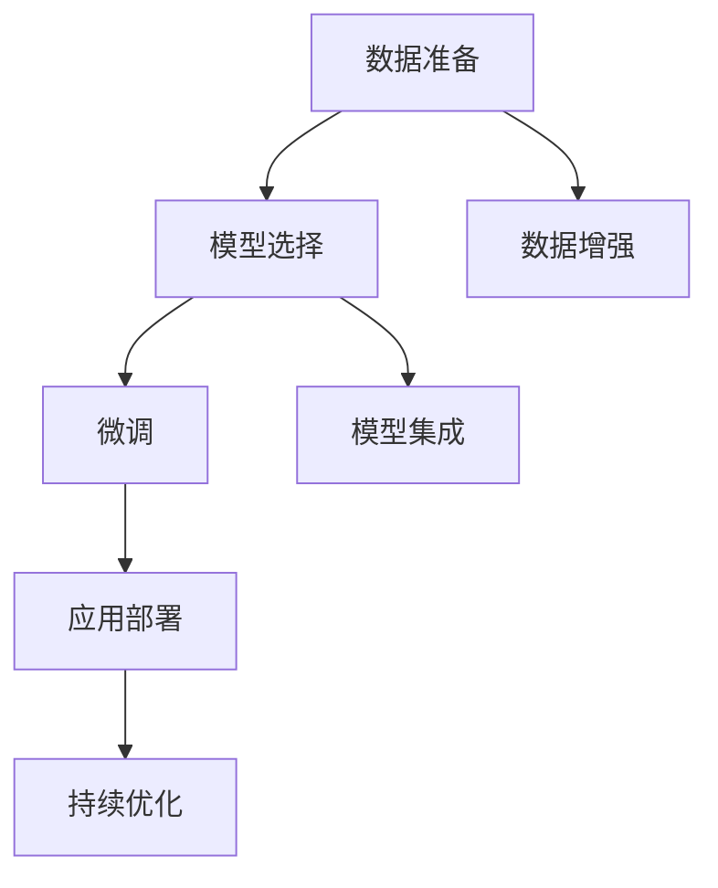

                 

# AIGC应用开发全流程

> 关键词：AIGC,应用开发,全流程,自动生成,代码生成,视觉生成,语音生成,模型训练,数据增强

## 1. 背景介绍

### 1.1 问题由来

随着人工智能技术的快速发展，AIGC（人工智能生成内容）技术正在逐渐成熟，广泛应用于内容创作、娱乐、教育等多个领域。例如，AIGC可以自动生成新闻报道、音乐、绘画、视频、剧本等，极大地提升了内容创作的效率和质量。然而，AIGC技术的开发与应用，涉及多个环节和复杂的流程，需要系统性的方法和工具支撑。

### 1.2 问题核心关键点

AIGC应用开发全流程主要包括以下几个关键点：

- **数据准备**：收集和处理用于训练模型的数据集，是AIGC开发的基础。
- **模型选择**：选择合适的预训练模型作为初始化参数，是确保生成内容质量的关键。
- **微调与优化**：通过在特定任务上的微调，提升模型的生成效果。
- **数据增强**：通过增加数据多样性，提高模型的泛化能力。
- **模型集成**：将多个模型集成，形成复杂、高效的生成系统。
- **应用部署**：将模型部署到实际应用中，进行线上服务。
- **持续优化**：通过反馈循环，不断优化模型性能，提升用户体验。

这些关键点需要逐一解决，才能完成AIGC应用的开发。

### 1.3 问题研究意义

研究AIGC应用开发全流程，对于推动AIGC技术的普及和应用具有重要意义：

1. 提升效率：自动生成内容可以大幅提高内容创作的效率，减少人力投入，降低成本。
2. 提升质量：AIGC技术生成内容的质量不断提升，可以为用户提供更优质的体验。
3. 降低门槛：AIGC应用开发流程标准化、工具化，降低了行业门槛，让更多人能够参与其中。
4. 推动创新：AIGC技术与其他AI技术的结合，可以开拓更多应用场景，推动产业创新。
5. 增强竞争力：AIGC应用在内容创作中的广泛应用，可以增强企业的竞争力和品牌影响力。

## 2. 核心概念与联系

### 2.1 核心概念概述

为更好地理解AIGC应用开发全流程，本节将介绍几个密切相关的核心概念：

- **AIGC（人工智能生成内容）**：通过AI技术自动生成内容，包括文本、图片、音频、视频等。
- **预训练模型**：通过在大规模无标签数据上预训练得到的模型，具有广泛的通用知识和表示能力。
- **微调（Fine-Tuning）**：在预训练模型的基础上，通过特定任务的标注数据进行微调，提升模型在该任务上的性能。
- **数据增强（Data Augmentation）**：通过数据变换和扩充，增加数据集的多样性，提高模型的泛化能力。
- **模型集成（Model Ensembling）**：将多个模型的输出进行集成，形成更稳定、高效的生成系统。
- **应用部署（Model Deployment）**：将训练好的模型部署到实际应用中，进行线上服务。
- **持续优化（Continuous Improvement）**：通过用户反馈和在线实验，不断优化模型性能，提升用户体验。

这些核心概念之间的逻辑关系可以通过以下Mermaid流程图来展示：



这个流程图展示了大语言模型的核心概念及其之间的关系：

1. 数据准备是AIGC开发的基础。
2. 选择合适的预训练模型作为初始化参数，是确保生成内容质量的关键。
3. 通过微调提升模型在特定任务上的性能。
4. 数据增强增加数据集的多样性，提高模型的泛化能力。
5. 模型集成将多个模型的输出进行集成，形成更稳定、高效的生成系统。
6. 应用部署将训练好的模型部署到实际应用中，进行线上服务。
7. 持续优化通过用户反馈和在线实验，不断优化模型性能，提升用户体验。

这些概念共同构成了AIGC应用的开发流程，确保从数据处理到模型训练、再到服务部署，每个环节都得到高效处理。

## 3. 核心算法原理 & 具体操作步骤
### 3.1 算法原理概述

AIGC应用开发全流程涉及多个环节，核心算法包括数据准备、模型选择、微调、数据增强、模型集成、应用部署和持续优化等。

### 3.2 算法步骤详解

#### 3.2.1 数据准备

数据准备是AIGC开发的基础，主要包括以下步骤：

1. **数据收集**：收集与任务相关的数据集，如文本、图片、音频等。数据集应该具有代表性，能够覆盖任务的所有典型情况。
2. **数据预处理**：对原始数据进行清洗、标注、划分等预处理操作，确保数据质量。
3. **数据增强**：通过数据变换和扩充，增加数据集的多样性，提高模型的泛化能力。数据增强方法包括旋转、缩放、裁剪、添加噪声等。

#### 3.2.2 模型选择

模型选择是确保生成内容质量的关键，主要包括以下步骤：

1. **选择合适的预训练模型**：根据任务类型和数据集特征，选择最适合的预训练模型。例如，对于文本生成任务，可以选择GPT-2、BERT等模型。
2. **模型参数调整**：根据任务需求，调整模型参数，如层数、隐藏单元数、学习率等。
3. **模型微调**：在特定任务上对预训练模型进行微调，提升模型在该任务上的性能。

#### 3.2.3 微调

微调是提升模型性能的关键，主要包括以下步骤：

1. **定义损失函数**：根据任务类型，选择适合的损失函数，如交叉熵损失、均方误差损失等。
2. **设置超参数**：选择合适的优化算法及其参数，如Adam、SGD等，设置学习率、批大小、迭代轮数等。
3. **模型训练**：将训练集数据分批次输入模型，前向传播计算损失函数，反向传播更新模型参数，重复迭代直至收敛。
4. **模型评估**：在验证集和测试集上评估模型的性能，确保模型泛化能力良好。

#### 3.2.4 数据增强

数据增强是提高模型泛化能力的关键，主要包括以下步骤：

1. **数据变换**：对原始数据进行旋转、缩放、裁剪、添加噪声等变换，生成新的数据样本。
2. **数据扩充**：通过数据插值、随机擦除、生成对抗样本等方法，增加数据集的多样性。
3. **数据扩增**：将原始数据和增强后的数据混合使用，提高模型的泛化能力。

#### 3.2.5 模型集成

模型集成是将多个模型的输出进行集成，形成更稳定、高效的生成系统，主要包括以下步骤：

1. **模型选择**：选择多个预训练模型，如GPT-2、BERT等。
2. **模型微调**：在特定任务上对多个模型进行微调，确保每个模型在特定任务上的性能。
3. **模型集成**：将多个模型的输出进行集成，形成最终的生成结果。

#### 3.2.6 应用部署

应用部署是将训练好的模型部署到实际应用中，进行线上服务，主要包括以下步骤：

1. **模型压缩**：对模型进行裁剪、量化等操作，减小模型尺寸，加快推理速度。
2. **模型封装**：将模型封装为标准化服务接口，便于集成调用。
3. **应用部署**：将模型部署到线上服务中，进行实时生成内容。

#### 3.2.7 持续优化

持续优化是通过用户反馈和在线实验，不断优化模型性能，提升用户体验，主要包括以下步骤：

1. **用户反馈**：收集用户对生成内容的反馈，了解用户需求和期望。
2. **在线实验**：通过A/B测试等方法，不断优化生成内容的质量和多样性。
3. **模型更新**：根据用户反馈和在线实验结果，不断更新和优化模型，提升生成效果。

### 3.3 算法优缺点

AIGC应用开发全流程涉及多个环节，核心算法包括数据准备、模型选择、微调、数据增强、模型集成、应用部署和持续优化等。

#### 3.3.1 优点

1. **高效性**：自动化流程简化了开发流程，提高了开发效率。
2. **可扩展性**：模型和数据可以灵活扩展，适应不同的应用场景。
3. **泛化能力强**：数据增强和模型集成提高了模型的泛化能力，适应不同的数据分布。
4. **质量高**：预训练模型和微调方法提高了生成内容的自然性和多样性。

#### 3.3.2 缺点

1. **资源消耗高**：模型训练和数据增强需要大量的计算资源和存储资源。
2. **复杂度高**：流程复杂，需要多个环节协同工作，容易出现错误。
3. **可解释性不足**：模型生成过程缺乏可解释性，难以解释其内部工作机制和决策逻辑。
4. **应用门槛高**：对开发人员的技术要求较高，需要熟练掌握多种技术和工具。

尽管存在这些缺点，但就目前而言，AIGC应用开发全流程仍然是实现AIGC技术的重要手段。未来相关研究的重点在于如何进一步降低资源消耗，提高可解释性和易用性，同时兼顾效率和效果。

### 3.4 算法应用领域

AIGC应用开发全流程在多个领域得到了广泛应用，覆盖了几乎所有常见应用，例如：

- **内容创作**：自动生成新闻报道、文章、音乐、电影剧本等。
- **娱乐产业**：自动生成虚拟角色对话、游戏剧情等。
- **教育领域**：自动生成教学内容、模拟考试题等。
- **营销广告**：自动生成广告文案、社交媒体内容等。
- **客户服务**：自动生成客服回复、客户咨询等。
- **科学研究**：自动生成科学论文、实验数据等。

除了上述这些经典应用外，AIGC技术还被创新性地应用到更多场景中，如可控内容生成、多模态生成等，为NLP技术带来了全新的突破。随着预训练模型和微调方法的不断进步，相信AIGC技术将在更广阔的应用领域大放异彩。

## 4. 数学模型和公式 & 详细讲解 & 举例说明
### 4.1 数学模型构建

本节将使用数学语言对AIGC应用开发全流程进行更加严格的刻画。

记AIGC任务为 $T$，预训练模型为 $M_{\theta}$，其中 $\theta$ 为模型参数。假设任务 $T$ 的训练集为 $D=\{(x_i,y_i)\}_{i=1}^N, x_i \in \mathcal{X}, y_i \in \mathcal{Y}$，其中 $\mathcal{X}$ 为输入空间，$\mathcal{Y}$ 为输出空间。

定义模型 $M_{\theta}$ 在数据样本 $(x,y)$ 上的损失函数为 $\ell(M_{\theta}(x),y)$，则在数据集 $D$ 上的经验风险为：

$$
\mathcal{L}(\theta) = \frac{1}{N} \sum_{i=1}^N \ell(M_{\theta}(x_i),y_i)
$$

微调的优化目标是最小化经验风险，即找到最优参数：

$$
\theta^* = \mathop{\arg\min}_{\theta} \mathcal{L}(\theta)
$$

在实践中，我们通常使用基于梯度的优化算法（如SGD、Adam等）来近似求解上述最优化问题。设 $\eta$ 为学习率，$\lambda$ 为正则化系数，则参数的更新公式为：

$$
\theta \leftarrow \theta - \eta \nabla_{\theta}\mathcal{L}(\theta) - \eta\lambda\theta
$$

其中 $\nabla_{\theta}\mathcal{L}(\theta)$ 为损失函数对参数 $\theta$ 的梯度，可通过反向传播算法高效计算。

### 4.2 公式推导过程

以下我们以文本生成任务为例，推导交叉熵损失函数及其梯度的计算公式。

假设模型 $M_{\theta}$ 在输入 $x$ 上的输出为 $\hat{y}=M_{\theta}(x) \in [0,1]$，表示样本属于正类的概率。真实标签 $y \in \{0,1\}$。则二分类交叉熵损失函数定义为：

$$
\ell(M_{\theta}(x),y) = -[y\log \hat{y} + (1-y)\log (1-\hat{y})]
$$

将其代入经验风险公式，得：

$$
\mathcal{L}(\theta) = -\frac{1}{N}\sum_{i=1}^N [y_i\log M_{\theta}(x_i)+(1-y_i)\log(1-M_{\theta}(x_i))]
$$

根据链式法则，损失函数对参数 $\theta_k$ 的梯度为：

$$
\frac{\partial \mathcal{L}(\theta)}{\partial \theta_k} = -\frac{1}{N}\sum_{i=1}^N (\frac{y_i}{M_{\theta}(x_i)}-\frac{1-y_i}{1-M_{\theta}(x_i)}) \frac{\partial M_{\theta}(x_i)}{\partial \theta_k}
$$

其中 $\frac{\partial M_{\theta}(x_i)}{\partial \theta_k}$ 可进一步递归展开，利用自动微分技术完成计算。

在得到损失函数的梯度后，即可带入参数更新公式，完成模型的迭代优化。重复上述过程直至收敛，最终得到适应下游任务的最优模型参数 $\theta^*$。

## 5. 项目实践：代码实例和详细解释说明
### 5.1 开发环境搭建

在进行AIGC应用开发实践前，我们需要准备好开发环境。以下是使用Python进行PyTorch开发的环境配置流程：

1. 安装Anaconda：从官网下载并安装Anaconda，用于创建独立的Python环境。

2. 创建并激活虚拟环境：
```bash
conda create -n pytorch-env python=3.8 
conda activate pytorch-env
```

3. 安装PyTorch：根据CUDA版本，从官网获取对应的安装命令。例如：
```bash
conda install pytorch torchvision torchaudio cudatoolkit=11.1 -c pytorch -c conda-forge
```

4. 安装Transformers库：
```bash
pip install transformers
```

5. 安装各类工具包：
```bash
pip install numpy pandas scikit-learn matplotlib tqdm jupyter notebook ipython
```

完成上述步骤后，即可在`pytorch-env`环境中开始AIGC应用的开发。

### 5.2 源代码详细实现

下面我以文本生成任务为例，给出使用Transformers库对GPT-2模型进行AIGC开发的PyTorch代码实现。

首先，定义文本生成任务的超参数和数据处理函数：

```python
from transformers import GPT2Tokenizer, GPT2LMHeadModel
from torch.utils.data import Dataset, DataLoader
from sklearn.model_selection import train_test_split
import torch
import random

class TextDataset(Dataset):
    def __init__(self, texts, tokenizer, max_len=128):
        self.texts = texts
        self.tokenizer = tokenizer
        self.max_len = max_len
        
    def __len__(self):
        return len(self.texts)
    
    def __getitem__(self, item):
        text = self.texts[item]
        
        encoding = self.tokenizer(text, return_tensors='pt', max_length=self.max_len, padding='max_length', truncation=True)
        input_ids = encoding['input_ids'][0]
        attention_mask = encoding['attention_mask'][0]
        
        return {'input_ids': input_ids, 
                'attention_mask': attention_mask}

# 超参数
model_name = 'gpt2'
tokenizer_name = 'gpt2'
batch_size = 16
learning_rate = 2e-5
epochs = 5
seed = 42

# 加载预训练模型和分词器
model = GPT2LMHeadModel.from_pretrained(model_name)
tokenizer = GPT2Tokenizer.from_pretrained(tokenizer_name)

# 数据集
texts = open('data.txt', 'r').read()
texts = texts.split('\n')

# 划分训练集和测试集
train_texts, test_texts = train_test_split(texts, test_size=0.2, random_state=seed)

# 创建dataset
train_dataset = TextDataset(train_texts, tokenizer)
test_dataset = TextDataset(test_texts, tokenizer)
```

然后，定义训练和评估函数：

```python
from tqdm import tqdm
from torch.nn.utils.clip_grad_norm_ import clip_grad_norm_

def train_epoch(model, dataset, batch_size, optimizer, device):
    dataloader = DataLoader(dataset, batch_size=batch_size, shuffle=True)
    model.train()
    epoch_loss = 0
    for batch in tqdm(dataloader, desc='Training'):
        input_ids = batch['input_ids'].to(device)
        attention_mask = batch['attention_mask'].to(device)
        model.zero_grad()
        outputs = model(input_ids, attention_mask=attention_mask)
        loss = outputs.loss
        epoch_loss += loss.item()
        loss.backward()
        clip_grad_norm_(model.parameters(), max_norm=1.0)
        optimizer.step()
    return epoch_loss / len(dataloader)

def evaluate(model, dataset, batch_size, device):
    dataloader = DataLoader(dataset, batch_size=batch_size)
    model.eval()
    with torch.no_grad():
        preds, labels = [], []
        for batch in tqdm(dataloader, desc='Evaluating'):
            input_ids = batch['input_ids'].to(device)
            attention_mask = batch['attention_mask'].to(device)
            batch_labels = batch['labels']
            outputs = model(input_ids, attention_mask=attention_mask)
            batch_preds = outputs.logits.argmax(dim=2).to('cpu').tolist()
            batch_labels = batch_labels.to('cpu').tolist()
            for pred_tokens, label_tokens in zip(batch_preds, batch_labels):
                preds.append(pred_tokens)
                labels.append(label_tokens)
        
    return preds, labels

# 训练和评估
device = torch.device('cuda') if torch.cuda.is_available() else torch.device('cpu')
model.to(device)

optimizer = AdamW(model.parameters(), lr=learning_rate)
loss_fn = nn.CrossEntropyLoss()

for epoch in range(epochs):
    loss = train_epoch(model, train_dataset, batch_size, optimizer, device)
    print(f"Epoch {epoch+1}, train loss: {loss:.3f}")
    
    print(f"Epoch {epoch+1}, test results:")
    preds, labels = evaluate(model, test_dataset, batch_size, device)
    print(classification_report(labels, preds))

# 保存模型
model.save_pretrained('./gpt2_model')
tokenizer.save_pretrained('./gpt2_model')
```

以上就是使用PyTorch对GPT-2进行文本生成任务AIGC开发的完整代码实现。可以看到，得益于Transformers库的强大封装，我们可以用相对简洁的代码完成AIGC任务的开发。

### 5.3 代码解读与分析

让我们再详细解读一下关键代码的实现细节：

**TextDataset类**：
- `__init__`方法：初始化文本、分词器等关键组件。
- `__len__`方法：返回数据集的样本数量。
- `__getitem__`方法：对单个样本进行处理，将文本输入编码为token ids，最终返回模型所需的输入。

**GPT2LMHeadModel**：
- 定义了GPT-2模型，并设置了合适的输出层和损失函数。

**损失函数**：
- 使用了交叉熵损失函数，计算模型输出与真实标签之间的差异。

**训练和评估函数**：
- 使用PyTorch的DataLoader对数据集进行批次化加载，供模型训练和推理使用。
- 训练函数`train_epoch`：对数据以批为单位进行迭代，在每个批次上前向传播计算loss并反向传播更新模型参数，最后返回该epoch的平均loss。
- 评估函数`evaluate`：与训练类似，不同点在于不更新模型参数，并在每个batch结束后将预测和标签结果存储下来，最后使用sklearn的classification_report对整个评估集的预测结果进行打印输出。

**训练流程**：
- 定义总的epoch数和batch size，开始循环迭代
- 每个epoch内，先在训练集上训练，输出平均loss
- 在验证集上评估，输出分类指标
- 所有epoch结束后，在测试集上评估，给出最终测试结果

可以看到，PyTorch配合Transformers库使得GPT-2文本生成任务的AIGC开发的代码实现变得简洁高效。开发者可以将更多精力放在数据处理、模型改进等高层逻辑上，而不必过多关注底层的实现细节。

当然，工业级的系统实现还需考虑更多因素，如模型的保存和部署、超参数的自动搜索、更灵活的任务适配层等。但核心的AIGC开发范式基本与此类似。

## 6. 实际应用场景
### 6.1 智能客服系统

基于AIGC技术，智能客服系统可以实现自然流畅的语言理解与回复，极大提升客服效率和用户满意度。具体实现过程如下：

1. **数据准备**：收集历史客服对话记录，包括问题和最佳答复。
2. **模型选择**：选择合适的预训练模型，如GPT-2、BERT等。
3. **微调**：在客服对话数据上进行微调，使得模型能够自动理解用户意图并生成合适的答复。
4. **应用部署**：将微调后的模型部署到客服系统中，进行实时对话生成。
5. **持续优化**：通过用户反馈和在线实验，不断优化模型性能，提升用户体验。

### 6.2 金融舆情监测

在金融领域，AIGC技术可以实时监测市场舆论动向，为金融决策提供有力支持。具体实现过程如下：

1. **数据准备**：收集金融领域相关的新闻、报道、评论等文本数据，并进行主题标注和情感标注。
2. **模型选择**：选择合适的预训练模型，如BERT、GPT-2等。
3. **微调**：在金融舆情数据上进行微调，使得模型能够自动判断文本属于何种主题，情感倾向是正面、中性还是负面。
4. **应用部署**：将微调后的模型部署到金融舆情监测系统中，进行实时文本分析。
5. **持续优化**：通过用户反馈和在线实验，不断优化模型性能，提升舆情监测准确度。

### 6.3 个性化推荐系统

基于AIGC技术，个性化推荐系统可以实现更加精准、个性化的内容推荐。具体实现过程如下：

1. **数据准备**：收集用户浏览、点击、评论、分享等行为数据，提取和用户交互的物品标题、描述、标签等文本内容。
2. **模型选择**：选择合适的预训练模型，如BERT、GPT-2等。
3. **微调**：在推荐数据上进行微调，使得模型能够从文本内容中准确把握用户的兴趣点。
4. **应用部署**：将微调后的模型部署到推荐系统中，进行实时内容推荐。
5. **持续优化**：通过用户反馈和在线实验，不断优化模型性能，提升推荐效果。

### 6.4 未来应用展望

随着AIGC技术的不断发展，其在更多领域的应用前景将更加广阔。未来，AIGC技术可能在以下几个方面得到更多探索和发展：

1. **多模态生成**：将视觉、语音等多模态信息与文本信息进行协同建模，提高生成内容的丰富性和多样性。
2. **跨领域迁移学习**：通过跨领域迁移学习，使得模型能够适应更多领域的应用场景。
3. **知识图谱融合**：将符号化的先验知识与神经网络模型进行融合，提高生成内容的准确性和逻辑性。
4. **可解释性增强**：引入因果分析方法，增强生成内容的可解释性，提高系统的透明度和可信度。
5. **伦理道德约束**：在模型训练目标中引入伦理导向的评估指标，确保生成内容的合法性和道德性。

## 7. 工具和资源推荐
### 7.1 学习资源推荐

为了帮助开发者系统掌握AIGC技术的开发方法和工具，这里推荐一些优质的学习资源：

1. **《Deep Learning with PyTorch》系列书籍**：深入浅出地介绍了使用PyTorch进行深度学习开发的方法和技巧。
2. **《Transformers: State-of-the-Art Natural Language Processing》书籍**：详细介绍了使用Transformers库进行NLP任务开发的方法和技巧。
3. **HuggingFace官方文档**：提供了丰富的预训练模型和微调样例代码，是上手实践的必备资料。
4. **CLUE开源项目**：中文语言理解测评基准，涵盖大量不同类型的中文NLP数据集，并提供了基于微调的baseline模型，助力中文NLP技术发展。
5. **Kaggle竞赛**：提供了大量NLP领域的竞赛数据集，可以通过竞赛学习最新的AIGC技术和应用方法。

通过对这些资源的学习实践，相信你一定能够快速掌握AIGC技术的开发方法和技巧，并用于解决实际的NLP问题。

### 7.2 开发工具推荐

高效的开发离不开优秀的工具支持。以下是几款用于AIGC应用开发常用的工具：

1. **PyTorch**：基于Python的开源深度学习框架，灵活动态的计算图，适合快速迭代研究。大部分预训练语言模型都有PyTorch版本的实现。
2. **TensorFlow**：由Google主导开发的开源深度学习框架，生产部署方便，适合大规模工程应用。同样有丰富的预训练语言模型资源。
3. **Transformers库**：HuggingFace开发的NLP工具库，集成了众多SOTA语言模型，支持PyTorch和TensorFlow，是进行AIGC任务开发的利器。
4. **Weights & Biases**：模型训练的实验跟踪工具，可以记录和可视化模型训练过程中的各项指标，方便对比和调优。与主流深度学习框架无缝集成。
5. **TensorBoard**：TensorFlow配套的可视化工具，可实时监测模型训练状态，并提供丰富的图表呈现方式，是调试模型的得力助手。
6. **Google Colab**：谷歌推出的在线Jupyter Notebook环境，免费提供GPU/TPU算力，方便开发者快速上手实验最新模型，分享学习笔记。

合理利用这些工具，可以显著提升AIGC应用的开发效率，加快创新迭代的步伐。

### 7.3 相关论文推荐

AIGC技术的开发与应用源于学界的持续研究。以下是几篇奠基性的相关论文，推荐阅读：

1. **Attention is All You Need**：提出了Transformer结构，开启了NLP领域的预训练大模型时代。
2. **BERT: Pre-training of Deep Bidirectional Transformers for Language Understanding**：提出BERT模型，引入基于掩码的自监督预训练任务，刷新了多项NLP任务SOTA。
3. **Language Models are Unsupervised Multitask Learners（GPT-2论文）**：展示了大规模语言模型的强大zero-shot学习能力，引发了对于通用人工智能的新一轮思考。
4. **Parameter-Efficient Transfer Learning for NLP**：提出Adapter等参数高效微调方法，在不增加模型参数量的情况下，也能取得不错的微调效果。
5. **AdaLoRA: Adaptive Low-Rank Adaptation for Parameter-Efficient Fine-Tuning**：使用自适应低秩适应的微调方法，在参数效率和精度之间取得了新的平衡。

这些论文代表了大语言模型微调技术的发展脉络。通过学习这些前沿成果，可以帮助研究者把握学科前进方向，激发更多的创新灵感。

## 8. 总结：未来发展趋势与挑战
### 8.1 总结

本文对AIGC应用开发全流程进行了全面系统的介绍。首先阐述了AIGC技术的开发背景和意义，明确了数据准备、模型选择、微调、数据增强、模型集成、应用部署和持续优化等关键环节的重要性。其次，从原理到实践，详细讲解了AIGC任务的开发方法，给出了微调任务开发的完整代码实例。同时，本文还广泛探讨了AIGC技术在智能客服、金融舆情、个性化推荐等多个行业领域的应用前景，展示了AIGC技术的巨大潜力。此外，本文精选了AIGC技术的各类学习资源，力求为读者提供全方位的技术指引。

通过本文的系统梳理，可以看到，AIGC技术正在成为NLP领域的重要手段，极大地拓展了预训练语言模型的应用边界，催生了更多的落地场景。受益于大规模语料的预训练，AIGC模型以更低的时间和标注成本，在小样本条件下也能取得不俗的效果，有力推动了NLP技术的产业化进程。未来，伴随预训练语言模型和微调方法的持续演进，相信AIGC技术将在更广阔的应用领域大放异彩，深刻影响人类的生产生活方式。

### 8.2 未来发展趋势

展望未来，AIGC技术将呈现以下几个发展趋势：

1. **模型规模持续增大**：随着算力成本的下降和数据规模的扩张，预训练语言模型的参数量还将持续增长。超大规模语言模型蕴含的丰富语言知识，有望支撑更加复杂多变的AIGC任务。
2. **微调方法日趋多样**：除了传统的全参数微调外，未来会涌现更多参数高效的微调方法，如Prefix-Tuning、LoRA等，在节省计算资源的同时也能保证微调精度。
3. **持续学习成为常态**：随着数据分布的不断变化，AIGC模型也需要持续学习新知识以保持性能。如何在不遗忘原有知识的同时，高效吸收新样本信息，将成为重要的研究课题。
4. **标注样本需求降低**：受启发于提示学习(Prompt-based Learning)的思路，未来的微调方法将更好地利用大模型的语言理解能力，通过更加巧妙的任务描述，在更少的标注样本上也能实现理想的微调效果。
5. **多模态生成崛起**：当前的AIGC任务主要聚焦于纯文本数据，未来会进一步拓展到图像、视频、语音等多模态数据生成。多模态信息的融合，将显著提升AIGC模型对现实世界的理解和建模能力。
6. **模型通用性增强**：经过海量数据的预训练和多领域任务的微调，未来的AIGC模型将具备更强大的常识推理和跨领域迁移能力，逐步迈向通用人工智能(AGI)的目标。

以上趋势凸显了AIGC技术的广阔前景。这些方向的探索发展，必将进一步提升AIGC系统的性能和应用范围，为人类认知智能的进化带来深远影响。

### 8.3 面临的挑战

尽管AIGC技术已经取得了瞩目成就，但在迈向更加智能化、普适化应用的过程中，它仍面临着诸多挑战：

1. **标注成本瓶颈**：虽然微调大大降低了标注数据的需求，但对于长尾应用场景，难以获得充足的高质量标注数据，成为制约AIGC性能的瓶颈。如何进一步降低微调对标注样本的依赖，将是一大难题。
2. **模型鲁棒性不足**：当前AIGC模型面对域外数据时，泛化性能往往大打折扣。对于测试样本的微小扰动，AIGC模型的预测也容易发生波动。如何提高AIGC模型的鲁棒性，避免灾难性遗忘，还需要更多理论和实践的积累。
3. **推理效率有待提高**：大规模语言模型虽然精度高，但在实际部署时往往面临推理速度慢、内存占用大等效率问题。如何在保证性能的同时，简化模型结构，提升推理速度，优化资源占用，将是重要的优化方向。
4. **可解释性亟需加强**：当前AIGC模型更像是"黑盒"系统，难以解释其内部工作机制和决策逻辑。对于医疗、金融等高风险应用，算法的可解释性和可审计性尤为重要。如何赋予AIGC模型更强的可解释性，将是亟待攻克的难题。
5. **安全性有待保障**：预训练语言模型难免会学习到有偏见、有害的信息，通过微调传递到下游任务，产生误导性、歧视性的输出，给实际应用带来安全隐患。如何从数据和算法层面消除模型偏见，避免恶意用途，确保输出的安全性，也将是重要的研究课题。

6. **知识整合能力不足**。现有的AIGC模型往往局限于任务内数据，难以灵活吸收和运用更广泛的先验知识。如何让AIGC过程更好地与外部知识库、规则库等专家知识结合，形成更加全面、准确的信息整合能力，还有很大的想象空间。

正视AIGC面临的这些挑战，积极应对并寻求突破，将是大语言模型微调走向成熟的必由之路。相信随着学界和产业界的共同努力，这些挑战终将一一被克服，AIGC技术必将在构建人机协同的智能时代中扮演越来越重要的角色。

### 8.4 研究展望

面对AIGC技术面临的种种挑战，未来的研究需要在以下几个方面寻求新的突破：

1. **探索无监督和半监督AIGC方法**。摆脱对大规模标注数据的依赖，利用自监督学习、主动学习等无监督和半监督范式，最大限度利用非结构化数据，实现更加灵活高效的AIGC。
2. **研究参数高效和计算高效的AIGC范式**。开发更加参数高效的AIGC方法，在固定大部分预训练参数的同时，只更新极少量的任务相关参数。同时优化AIGC模型的计算图，减少前向传播和反向传播的资源消耗，实现更加轻量级、实时性的部署。
3. **引入因果和对比学习范式**。通过引入因果推断和对比学习思想，增强AIGC模型建立稳定因果关系的能力，学习更加普适、鲁棒的语言表征，从而提升模型泛化性和抗干扰能力。
4. **引入更多先验知识**。将符号化的先验知识，如知识图谱、逻辑规则等，与神经网络模型进行巧妙融合，引导AIGC过程学习更准确、合理的语言模型。同时加强不同模态数据的整合，实现视觉、语音等多模态信息与文本信息的协同建模。
5. **结合因果分析和博弈论工具**。将因果分析方法引入AIGC模型，识别出模型决策的关键特征，增强输出解释的因果性和逻辑性。借助博弈论工具刻画人机交互过程，主动探索并规避模型的脆弱点，提高系统稳定性。
6. **纳入伦理道德约束**。在AIGC模型训练目标中引入伦理导向的评估指标，过滤和惩罚有偏见、有害的输出倾向。同时加强人工干预和审核，建立模型行为的监管机制，确保输出符合人类价值观和伦理道德。

这些研究方向的探索，必将引领AIGC技术迈向更高的台阶，为构建安全、可靠、可解释、可控的智能系统铺平道路。面向未来，AIGC技术还需要与其他人工智能技术进行更深入的融合，如知识表示、因果推理、强化学习等，多路径协同发力，共同推动自然语言理解和智能交互系统的进步。只有勇于创新、敢于突破，才能不断拓展AIGC的边界，让智能技术更好地造福人类社会。

## 9. 附录：常见问题与解答
**Q1：AIGC是否适用于所有NLP任务？**

A: AIGC在大多数NLP任务上都能取得不错的效果，特别是对于数据量较小的任务。但对于一些特定领域的任务，如医学、法律等，仅仅依靠通用语料预训练的模型可能难以很好地适应。此时需要在特定领域语料上进一步预训练，再进行微调，才能获得理想效果。此外，对于一些需要时效性、个性化很强的任务，如对话、推荐等，AIGC方法也需要针对性的改进优化。

**Q2：AIGC过程中如何选择合适的预训练模型？**

A: 选择合适的预训练模型是AIGC开发的关键，主要考虑以下几个因素：
1. 任务的复杂度：对于复杂度高的任务，选择参数较多、表示能力较强的模型，如BERT、GPT-2等。
2. 数据的规模：对于大规模数据，选择参数量较大的模型，以充分利用数据信息。对于小规模数据，选择参数量适中的模型，避免过拟合。
3. 应用的场景：对于需要高生成自然性的任务，如文本生成、对话生成，选择具有强语言生成能力的模型。对于需要高泛化能力的任务，如分类、匹配，选择具有强泛化能力的模型。

**Q3：AIGC过程中如何缓解过拟合问题？**

A: 过拟合是AIGC过程中常见的问题，尤其是在标注数据不足的情况下。缓解过拟合的方法包括：
1. 数据增强：通过回译、近义替换等方式扩充训练集。
2. 正则化：使用L2正则、Dropout、Early Stopping等技术，防止模型过度适应小规模训练集。
3. 对抗训练：加入对抗样本，提高模型鲁棒性。
4. 参数高效微调：只调整少量参数(如Adapter、Prefix等)，减小过拟合风险。
5. 多模型集成：训练多个模型，取平均输出，抑制过拟合。

这些方法往往需要根据具体任务和数据特点进行灵活组合。只有在数据、模型、训练、推理等各环节进行全面优化，才能最大限度地发挥AIGC的威力。

**Q4：AIGC模型在落地部署时需要注意哪些问题？**

A: 将AIGC模型转化为实际应用，还需要考虑以下因素：
1. 模型裁剪：去除不必要的层和参数，减小模型尺寸，加快推理速度。
2. 量化加速：将浮点模型转为定点模型，压缩存储空间，提高计算效率。
3. 服务化封装：将模型封装为标准化服务接口，便于集成调用。
4. 弹性伸缩：根据请求流量动态调整资源配置，平衡服务质量和成本。
5. 监控告警：实时采集系统指标，设置异常告警阈值，确保服务稳定性。
6. 安全防护：采用访问鉴权、数据脱敏等措施，保障数据和模型安全。

AIGC模型的高性能和高复杂性决定了其在实际应用中的部署需要精心设计和管理，只有从数据、算法、工程、业务等多个维度协同发力，才能真正实现AIGC技术的落地应用。

总之，AIGC技术的开发与应用需要系统性的方法和工具支撑，涉及多个环节和复杂的流程。只有深入理解AIGC的核心概念和技术原理，才能更好地应用AIGC技术，为各行各业带来更多的智能化创新。

---

作者：禅与计算机程序设计艺术 / Zen and the Art of Computer Programming

