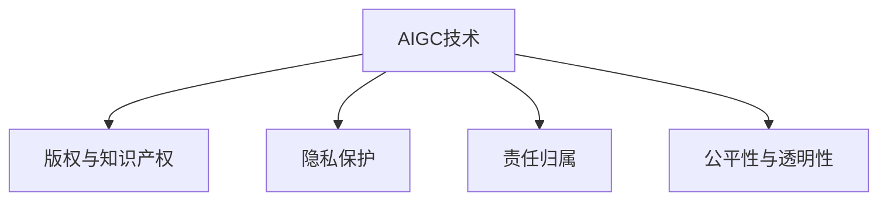

                 

## 1. 背景介绍

### 1.1 问题由来

随着人工智能（AI）的快速发展，尤其是在生成对抗网络（GANs）和自动生成内容（AIGC）领域的突破，我们已经逐渐进入了一个前所未有的时代。AIGC技术的兴起不仅在图像、音频、视频生成等领域带来了革命性变化，还在自然语言处理（NLP）、法律文书自动生成等方面展现了其巨大潜力。然而，AIGC技术的广泛应用也带来了诸多法律与伦理上的挑战，特别是对于知识产权、隐私保护、责任归属等问题的冲击。

### 1.2 问题核心关键点

AIGC技术的法律与伦理挑战主要体现在以下几个方面：

1. **知识产权与版权问题**：生成的内容是否拥有原创性？如何使用这些内容而不侵犯原创者的权益？
2. **隐私保护问题**：生成的内容是否侵犯了个人隐私？如何保护用户的隐私？
3. **责任归属问题**：生成的内容导致错误或损害时，谁应承担责任？
4. **公平与透明问题**：AIGC系统是否具有公平性？其决策过程是否透明可解释？

### 1.3 问题研究意义

研究AIGC技术的法律与伦理挑战，对于确保其在各行各业的安全、公正、透明应用具有重要意义：

1. 确保技术创新不会侵犯知识产权，保护创新者的合法权益。
2. 保障用户隐私安全，增强公众对AIGC技术的信任度。
3. 明确责任归属，减少法律纠纷，维护社会稳定。
4. 推动AIGC技术向公平、透明方向发展，提升技术的可信度和可用性。

## 2. 核心概念与联系

### 2.1 核心概念概述

为更好地理解AIGC技术所面临的法律与伦理挑战，本节将介绍几个关键概念：

- **人工智能与生成对抗网络（AIGC）**：指利用深度学习技术生成逼真图像、音频、视频和文本的AI系统。通过GANs等技术，AIGC系统能够生成高质量、符合特定风格和内容要求的数据。
- **版权与知识产权**：指作者对其原创作品的专有权利，包括复制、分发、展示、表演等。AIGC技术的广泛应用可能模糊版权归属，引发法律争议。
- **隐私保护**：指在数据收集、处理和使用过程中，保护个人隐私不被泄露或滥用。AIGC技术涉及大量用户数据，需确保隐私保护。
- **责任归属**：指在AI系统生成内容引发损害或错误时，应由谁承担责任的问题。如开发者、用户还是第三方？
- **公平性与透明性**：指AI系统是否对所有用户公平，其决策过程是否透明可解释。AIGC系统应具备这些属性，以获得广泛信任。

这些概念之间的逻辑关系可以通过以下Mermaid流程图来展示：



这个流程图展示了AIGC技术所涉及的法律与伦理核心概念及其相互关系。

## 3. 核心算法原理 & 具体操作步骤

### 3.1 算法原理概述

AIGC技术的核心算法原理主要基于生成对抗网络（GANs）。GANs由一个生成器（Generator）和一个判别器（Discriminator）组成，通过对抗训练，生成器能够生成逼真的内容，而判别器则尽可能区分真实与生成的内容。以下是生成对抗网络的基本框架：

$$
G(z) \sim \mathcal{N}(0,1), D(x) \rightarrow [0,1], D(G(z)) \rightarrow 0, D(x) \rightarrow 1
$$

其中，$G(z)$ 表示生成器生成的样本，$D(x)$ 表示判别器对样本的判断概率。目标函数为：

$$
L_G = \mathbb{E}_{z \sim p(z)} [log(1-D(G(z)))], L_D = \mathbb{E}_{x \sim p_{\text{real}}(x)} [log(D(x))] + \mathbb{E}_{z \sim p(z)} [log(1-D(G(z)))]
$$

### 3.2 算法步骤详解

AIGC技术的具体操作步骤如下：

1. **数据准备**：收集训练所需的原始数据，进行预处理和标注。
2. **模型构建**：设计生成器和判别器的网络结构，选择适当的损失函数。
3. **训练模型**：通过对抗训练的方式，交替更新生成器和判别器的参数，直到达到收敛。
4. **生成内容**：使用训练好的生成器，根据给定条件生成新的内容。

### 3.3 算法优缺点

AIGC技术具有以下优点：

1. **高效生成内容**：能够在短时间内生成大量高质量的内容。
2. **广泛应用**：适用于图像、音频、视频、文本等多种类型的生成。
3. **低成本**：相比于传统内容创作，AIGC技术成本较低。

然而，也存在一些缺点：

1. **版权问题**：生成的内容可能侵犯原创者的版权。
2. **隐私风险**：生成内容可能涉及个人隐私信息。
3. **伦理争议**：是否应将责任归咎于开发者、用户或第三方。
4. **公平性与透明性问题**：系统可能存在偏见，决策过程不够透明。

### 3.4 算法应用领域

AIGC技术在多个领域有着广泛的应用，如：

- **娱乐与媒体**：生成逼真视频、音乐、电影等娱乐内容。
- **广告与营销**：自动生成广告素材、宣传片等。
- **设计领域**：自动生成建筑设计、产品设计等。
- **医疗领域**：辅助医学图像生成、病历生成等。
- **法律与文书**：自动生成法律文书、合同等。

## 4. 数学模型和公式 & 详细讲解 & 举例说明

### 4.1 数学模型构建

AIGC技术中的生成对抗网络可以建模为如下优化问题：

$$
\min_G \max_D L(G,D) = \mathbb{E}_{x \sim p_{\text{real}}(x)} [log(D(x))] + \mathbb{E}_{z \sim p(z)} [log(1-D(G(z)))]
$$

其中，$G(z)$ 表示生成器，$D(x)$ 表示判别器，$L(G,D)$ 表示对抗损失函数，$z$ 为随机噪声。

### 4.2 公式推导过程

推导过程中，我们主要关注生成器的损失函数$L_G$和判别器的损失函数$L_D$：

$$
L_G = \mathbb{E}_{z \sim p(z)} [log(1-D(G(z)))]
$$

$$
L_D = \mathbb{E}_{x \sim p_{\text{real}}(x)} [log(D(x))] + \mathbb{E}_{z \sim p(z)} [log(1-D(G(z)))]
$$

这里，$G(z)$ 生成的样本需满足与真实样本相同的分布$p_{\text{real}}(x)$，而判别器的目标是最大化区分真实样本和生成样本的能力。

### 4.3 案例分析与讲解

以文本生成为例，假设生成的文本为$T$，其来源为一个由真实文本$T_{\text{real}}$和生成文本$T_{\text{fake}}$组成的混合分布$p(T)$。通过优化生成器$G(z)$和判别器$D(T)$，可以使生成的文本尽可能逼近真实文本。

## 5. 项目实践：代码实例和详细解释说明

### 5.1 开发环境搭建

在进行AIGC项目实践前，我们需要准备好开发环境。以下是使用Python进行TensorFlow开发的环境配置流程：

1. 安装Anaconda：从官网下载并安装Anaconda，用于创建独立的Python环境。

2. 创建并激活虚拟环境：
```bash
conda create -n tf-env python=3.8 
conda activate tf-env
```

3. 安装TensorFlow：根据CUDA版本，从官网获取对应的安装命令。例如：
```bash
conda install tensorflow -c pytorch -c conda-forge
```

4. 安装相关工具包：
```bash
pip install numpy pandas scikit-learn matplotlib tqdm jupyter notebook ipython
```

完成上述步骤后，即可在`tf-env`环境中开始AIGC实践。

### 5.2 源代码详细实现

下面我们以文本生成任务为例，给出使用TensorFlow对AIGC模型进行训练的代码实现。

首先，定义生成器（Generator）和判别器（Discriminator）的架构：

```python
import tensorflow as tf

class Generator(tf.keras.Model):
    def __init__(self):
        super(Generator, self).__init__()
        self.dense1 = tf.keras.layers.Dense(256, input_dim=100)
        self.dense2 = tf.keras.layers.Dense(256)
        self.dense3 = tf.keras.layers.Dense(784)

    def call(self, x):
        x = self.dense1(x)
        x = tf.nn.tanh(x)
        x = self.dense2(x)
        x = tf.nn.tanh(x)
        return self.dense3(x)

class Discriminator(tf.keras.Model):
    def __init__(self):
        super(Discriminator, self).__init__()
        self.dense1 = tf.keras.layers.Dense(256, input_dim=784)
        self.dense2 = tf.keras.layers.Dense(256)
        self.dense3 = tf.keras.layers.Dense(1)

    def call(self, x):
        x = self.dense1(x)
        x = tf.nn.tanh(x)
        x = self.dense2(x)
        x = tf.nn.tanh(x)
        return self.dense3(x)
```

接着，定义损失函数和优化器：

```python
learning_rate = 0.0005

def discriminator_loss(real_output, fake_output):
    real_loss = tf.reduce_mean(tf.nn.sigmoid_cross_entropy_with_logits(labels=tf.ones_like(real_output), logits=real_output))
    fake_loss = tf.reduce_mean(tf.nn.sigmoid_cross_entropy_with_logits(labels=tf.zeros_like(fake_output), logits=fake_output))
    return real_loss + fake_loss

def generator_loss(fake_output):
    return tf.reduce_mean(tf.nn.sigmoid_cross_entropy_with_logits(labels=tf.ones_like(fake_output), logits=fake_output))

def adversarial_loss(real_output, fake_output):
    real_loss = discriminator_loss(real_output, fake_output)
    fake_loss = generator_loss(fake_output)
    return real_loss + fake_loss

generator = Generator()
discriminator = Discriminator()
optimizer = tf.keras.optimizers.Adam(learning_rate)
```

最后，定义训练函数并开始训练：

```python
@tf.function
def train_step(real_images):
    with tf.GradientTape() as gen_tape, tf.GradientTape() as disc_tape:
        real_output = discriminator(real_images, training=True)
        noise = tf.random.normal([BATCH_SIZE, 100])
        fake_images = generator(noise, training=True)
        fake_output = discriminator(fake_images, training=True)
        
        gen_loss = generator_loss(fake_output)
        disc_loss = discriminator_loss(real_output, fake_output)
        adv_loss = adversarial_loss(real_output, fake_output)
        
        gradients_of_gen = gen_tape.gradient(gen_loss, generator.trainable_variables)
        gradients_of_disc = disc_tape.gradient(disc_loss, discriminator.trainable_variables)
        
        optimizer.apply_gradients(zip(gradients_of_gen, generator.trainable_variables))
        optimizer.apply_gradients(zip(gradients_of_disc, discriminator.trainable_variables))
        
train_images = # 真实图像数据
for epoch in range(NUM_EPOCHS):
    for real_images in train_images:
        train_step(real_images)
```

以上就是使用TensorFlow对AIGC模型进行文本生成任务训练的完整代码实现。可以看到，TensorFlow提供了丰富的工具和接口，使得模型训练变得简单易行。

### 5.3 代码解读与分析

让我们再详细解读一下关键代码的实现细节：

**Generator类**：
- `__init__`方法：初始化生成器的网络层，包括三个密集层。
- `call`方法：前向传播生成样本。

**Discriminator类**：
- `__init__`方法：初始化判别器的网络层，包括三个密集层。
- `call`方法：前向传播判断样本真伪。

**损失函数**：
- `discriminator_loss`：计算判别器对真实和生成样本的损失。
- `generator_loss`：计算生成器对生成样本的损失。
- `adversarial_loss`：计算对抗损失，即真实样本和生成样本的总损失。

**优化器**：
- `optimizer`：使用Adam优化器进行参数更新。

**训练函数**：
- `train_step`：定义训练步骤，包括计算损失、求导和更新参数。

**训练流程**：
- 在每个epoch内，对数据集进行迭代，依次输入真实图像和生成图像，计算损失并反向传播更新参数。

可以看到，TensorFlow提供了便捷的接口和丰富的工具，使得模型训练过程变得高效、稳定。然而，在实际部署和应用中，还需要考虑更多因素，如模型裁剪、量化加速、服务化封装等，以确保模型在实际环境中的高性能和稳定运行。

## 6. 实际应用场景

### 6.1 金融科技

在金融科技领域，AIGC技术的应用场景包括但不限于以下几个方面：

1. **风险评估**：通过生成逼真的金融文档和图表，帮助分析师进行风险评估。
2. **金融新闻生成**：生成最新的金融新闻和市场分析，供投资者参考。
3. **欺诈检测**：生成异常交易的模拟数据，训练检测模型，提升反欺诈能力。

### 6.2 医疗健康

AIGC技术在医疗健康领域也有着广泛的应用：

1. **医学图像生成**：生成高分辨率医学影像，辅助医生诊断。
2. **病历自动生成**：根据医生记录，自动生成病历报告，提高效率。
3. **治疗方案生成**：生成个性化的治疗方案，为患者提供更好的治疗建议。

### 6.3 娱乐媒体

AIGC技术在娱乐媒体领域的应用主要包括：

1. **电影和电视制作**：生成逼真的电影特效、背景和角色，提升制作效率和质量。
2. **音乐和音频制作**：生成逼真的音乐和音效，为创作提供更多素材。
3. **游戏设计**：生成游戏角色和场景，丰富游戏内容。

### 6.4 未来应用展望

随着AIGC技术的不断进步，其应用场景将更加广泛，以下是未来可能的发展方向：

1. **自动化内容创作**：自动生成新闻、文章、博客等，提高内容创作效率。
2. **智能客服**：生成逼真的客户对话，提高客服系统的响应速度和质量。
3. **个性化推荐**：生成个性化的商品推荐、广告推荐等，提升用户体验。
4. **辅助教育**：生成个性化的学习内容，提升教育效果。
5. **法律文书自动生成**：生成合同、协议、法律文书等，提高工作效率。

## 7. 工具和资源推荐

### 7.1 学习资源推荐

为了帮助开发者系统掌握AIGC技术，这里推荐一些优质的学习资源：

1. **《Deep Learning》系列书籍**：由Ian Goodfellow等人著，全面介绍了深度学习的基础理论和算法。
2. **Coursera《Deep Learning Specialization》课程**：由Andrew Ng主讲的深度学习课程，涵盖深度学习的基础、实践和应用。
3. **Udacity《Generative Adversarial Networks》课程**：专注于生成对抗网络的深入学习，提供丰富的实践项目和案例分析。
4. **Hugging Face官方文档**：提供了丰富的预训练模型和代码示例，是学习和实践AIGC技术的必备资料。
5. **TensorFlow官方文档**：详细介绍了TensorFlow的使用方法和API，适合实战学习。

通过对这些资源的学习实践，相信你一定能够快速掌握AIGC技术的精髓，并用于解决实际的NLP问题。

### 7.2 开发工具推荐

高效的开发离不开优秀的工具支持。以下是几款用于AIGC开发的常用工具：

1. **PyTorch**：基于Python的开源深度学习框架，灵活性高，适合研究原型开发。
2. **TensorFlow**：由Google主导开发的深度学习框架，功能强大，适合大规模工程应用。
3. **Hugging Face Transformers库**：提供了丰富的预训练模型和API，方便模型训练和推理。
4. **Jupyter Notebook**：交互式开发环境，支持Python、R、SQL等多种编程语言。
5. **Google Colab**：免费的在线Jupyter Notebook环境，提供GPU和TPU算力，适合快速实验。

合理利用这些工具，可以显著提升AIGC开发的效率，加快创新迭代的步伐。

### 7.3 相关论文推荐

AIGC技术的快速发展源于学界的持续研究。以下是几篇奠基性的相关论文，推荐阅读：

1. **Generative Adversarial Nets**：Ian Goodfellow等人提出的生成对抗网络理论基础。
2. **Deep Speech 2**：Google团队提出的基于生成对抗网络的声音生成技术，推动了语音生成技术的进步。
3. **Unsupervised Representation Learning with Deep Convolutional Generative Adversarial Networks**：利用生成对抗网络进行无监督表示学习，提高了模型的泛化能力。
4. **A Style Transfer for Images**：Isola等人提出的图像风格迁移方法，展示了AIGC技术在图像处理领域的应用潜力。
5. **Unsupervised Generative Image Modeling Using Convolutional Adversarial Networks**：利用生成对抗网络进行无监督图像生成，进一步提升了模型的性能。

这些论文代表了大模型微调技术的发展脉络。通过学习这些前沿成果，可以帮助研究者把握学科前进方向，激发更多的创新灵感。

## 8. 总结：未来发展趋势与挑战

### 8.1 总结

本文对AIGC技术的法律与伦理挑战进行了全面系统的介绍。首先阐述了AIGC技术的背景和应用场景，明确了其在多领域带来的变革潜力。其次，从原理到实践，详细讲解了AIGC技术的关键算法和操作步骤，提供了完整的代码实现。同时，本文还探讨了AIGC技术在金融、医疗、娱乐等领域的应用前景，展示了其广泛的应用价值。最后，精选了AIGC技术的各类学习资源，力求为读者提供全方位的技术指引。

通过本文的系统梳理，可以看到，AIGC技术在各个领域展现出巨大的潜力和应用前景。然而，在实际落地过程中，仍需面对诸多法律与伦理挑战，如版权、隐私、责任归属等。只有解决好这些问题，AIGC技术才能真正实现其商业价值和社会效益。

### 8.2 未来发展趋势

展望未来，AIGC技术的发展趋势如下：

1. **技术不断进步**：随着深度学习技术的不断进步，AIGC技术的生成效果将进一步提升，应用场景将更加广泛。
2. **伦理与法律框架完善**：社会对AIGC技术的接受度将逐步提高，相关伦理和法律框架也将逐步完善，规范AIGC技术的应用。
3. **应用场景多样化**：AIGC技术将在更多领域展现其潜力，如教育、娱乐、医疗等，带来颠覆性变革。
4. **人机协同增强**：AIGC技术与人工智能的结合将更加紧密，实现更智能、更高效的内容创作。
5. **全球标准化**：AIGC技术将在全球范围内逐步标准化，提升其可信度和可用性。

### 8.3 面临的挑战

尽管AIGC技术已经取得了显著进展，但在迈向普及应用的过程中，仍面临诸多挑战：

1. **法律与伦理问题**：如何在确保技术创新的同时，保护原创者权益、保护用户隐私、明确责任归属，是重要挑战。
2. **技术安全与可靠性**：AIGC技术可能存在漏洞，导致系统安全性问题，需要不断提升技术安全性。
3. **技术公平性与透明性**：AIGC系统可能存在偏见，需要确保系统的公平性和透明性。
4. **用户接受度**：如何提升用户对AIGC技术的接受度，确保其广泛应用。

### 8.4 研究展望

未来的研究应从以下几个方面进行突破：

1. **法律与伦理研究**：研究如何在AIGC技术中实现公平、透明、可解释的目标，制定相关法律法规。
2. **技术安全性提升**：研究AIGC技术的安全性问题，提升系统的鲁棒性和安全性。
3. **用户接受度提升**：研究如何提升用户对AIGC技术的接受度，确保其在实际应用中的普及。
4. **技术应用拓展**：研究AIGC技术在更多领域的应用，提升其普适性和实用性。

## 9. 附录：常见问题与解答

**Q1：AIGC技术生成的内容是否侵犯版权？**

A: AIGC技术生成的内容是否侵犯版权，主要取决于其生成方式和数据来源。如果生成的内容是基于真实数据，且未经过版权所有者的授权，可能构成侵权。建议在使用AIGC技术时，需确保数据来源合法，避免侵犯版权。

**Q2：AIGC技术如何保护用户隐私？**

A: 在数据收集和处理过程中，AIGC技术应严格遵守隐私保护法律法规，如GDPR、CCPA等，确保用户数据的安全性和匿名性。建议在数据预处理阶段，采用数据脱敏、加密等技术，保护用户隐私。

**Q3：AIGC技术生成的内容引发错误或损害时，谁应承担责任？**

A: 生成的内容引发错误或损害时，责任归属问题较为复杂。一般而言，应由开发者、用户或第三方共同承担责任，具体责任分配需根据具体情况和法律法规进行判断。建议在模型训练和部署阶段，明确责任归属，避免法律纠纷。

**Q4：AIGC技术是否具有公平性与透明性？**

A: AIGC技术的公平性和透明性问题需要持续关注。为了提升系统的公平性，应在数据预处理和模型训练阶段，确保数据集的多样性和代表性。为了提升系统的透明性，应提供系统的决策过程和中间结果，便于用户理解和监督。

---

作者：禅与计算机程序设计艺术 / Zen and the Art of Computer Programming

