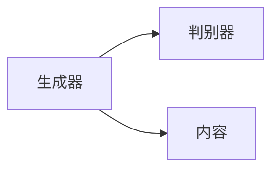

                 

# AIGC的社会影响与应对策略

> 关键词：人工智能生成内容(AIGC), 深度学习, 自然语言处理(NLP), 计算机视觉(CV), 伦理道德, 隐私保护, 知识产权, 教育, 医疗, 艺术, 就业, 政策法规

## 1. 背景介绍

### 1.1 问题由来
随着人工智能(AI)技术的迅猛发展，人工智能生成内容(AIGC)逐渐成为炙手可热的研究方向。AIGC技术的出现，将深度学习技术应用于图像生成、文本生成、音频生成等多个领域，赋予了计算机前所未有的创造力。无论是生成逼真的图像，还是撰写优美的文章，甚至创作动人的音乐，AIGC技术正在逐渐改变我们的生活方式。然而，AIGC的广泛应用也带来了诸多社会问题，如伦理道德的挑战、隐私保护的问题、知识产权的争议等。因此，如何合理应用和监管AIGC技术，确保其在积极推动社会进步的同时，也保障公众的权益，成为当前研究的重要课题。

## 2. 核心概念与联系

### 2.1 核心概念概述

为了深入理解AIGC技术的应用与影响，首先介绍几个核心概念：

- 人工智能生成内容(AIGC)：指利用人工智能技术生成自然内容的过程，包括文本、图像、音频等多种形式。AIGC主要依赖于深度学习技术，通过大规模数据训练模型，实现内容的自动生成和优化。

- 深度学习：一种基于神经网络的机器学习方法，通过多层次的特征提取和转换，实现复杂数据的分析和建模。深度学习在图像识别、自然语言处理、语音识别等多个领域展现了强大的能力。

- 自然语言处理(NLP)：研究如何让计算机理解、处理和生成人类语言的学科，涉及文本分类、情感分析、机器翻译等多个任务。NLP是AIGC技术的重要组成部分。

- 计算机视觉(CV)：利用计算机对图像、视频等视觉信号进行处理和分析的学科，主要包括目标检测、图像生成、图像编辑等多个方向。CV技术也是AIGC的重要基础。

- 伦理道德：涉及人工智能技术应用的道德规范和伦理标准，如数据隐私、算法偏见、自动化决策等。伦理道德问题在AIGC应用中尤为重要。

- 隐私保护：指在AIGC技术中对用户数据和生成的内容的保护，防止数据泄露和滥用。隐私保护是AIGC技术应用的基石。

- 知识产权：涉及AI生成的内容的版权归属问题，如原创性、版权保护等。AIGC技术的应用也带来了新的知识产权挑战。

这些核心概念构成了AIGC技术的理论基础，并在实际应用中相互影响和关联。

## 3. 核心算法原理 & 具体操作步骤

### 3.1 算法原理概述

AIGC技术主要通过深度学习模型进行内容生成，其核心算法包括：

- 生成对抗网络(GAN)：通过两个神经网络竞争学习，生成逼真的内容。GAN在图像生成和音频生成中展现了强大的能力。

- 变分自编码器(VAE)：通过编码器-解码器的结构，对数据进行压缩和重构，生成与原始数据相似的内容。VAE在图像生成和文本生成中得到了广泛应用。

- 序列生成模型：如循环神经网络(RNN)、长短期记忆网络(LSTM)、变分自编码器(VAE)等，用于生成连续文本、对话等内容。

### 3.2 算法步骤详解

AIGC技术的核心步骤包括数据准备、模型训练和内容生成。具体步骤如下：

**Step 1: 数据准备**

- 收集和预处理数据集，包括图像、文本、音频等多种形式的数据。
- 对数据进行清洗、标注和划分，确保数据集的质量和多样性。

**Step 2: 模型训练**

- 选择适合的深度学习模型，如GAN、VAE、RNN等。
- 设计模型架构，并设定超参数，如学习率、批量大小等。
- 使用大量标注数据进行模型训练，优化模型参数。

**Step 3: 内容生成**

- 使用训练好的模型对新数据进行生成，生成逼真的图像、文本、音频等内容。
- 对生成的内容进行后处理，如修复细节、增强效果等。

### 3.3 算法优缺点

AIGC技术在提升内容生成效率和质量方面展现了显著优势，但同时也存在一些不足：

**优点：**

- 生成速度快：AIGC技术可以在短时间内生成大量高质量内容。
- 多样性高：生成的内容具有较高的多样性和创造性。
- 降低成本：大量人工创作的高昂成本被机器生成所替代。

**缺点：**

- 缺乏原创性：生成的内容可能缺乏原创性和独特性，难以满足特定需求。
- 数据隐私问题：生成的内容可能包含隐私信息，对用户数据隐私构成威胁。
- 知识产权争议：AI生成内容的版权归属问题尚未明确，存在法律风险。

### 3.4 算法应用领域

AIGC技术的应用领域非常广泛，涵盖多个行业和领域：

- 媒体和娱乐：生成逼真的视频、音乐、电影等娱乐内容。
- 教育：生成教育资源，如视频讲解、互动练习等。
- 广告：生成个性化广告内容，提高广告效果。
- 医疗：生成医疗影像、健康咨询等内容。
- 艺术：生成绘画、雕塑等艺术作品，推动艺术创作。
- 科学研究：生成实验数据、模型结果等科学研究内容。

## 4. 数学模型和公式 & 详细讲解 & 举例说明

### 4.1 数学模型构建

AIGC技术的数学模型通常由生成器和判别器组成，如图：



其中，生成器用于生成内容，判别器用于评估生成的内容是否真实。

**GAN模型**：
- 生成器：输入噪声向量，生成逼真的内容。
- 判别器：输入内容，判断其真实性。
- 目标函数：最大化生成器输出的真实性概率，最小化判别器对真实内容的识别概率。

**VAE模型**：
- 编码器：将输入内容压缩为潜在空间中的编码向量。
- 解码器：将编码向量重构为原始内容。
- 目标函数：最小化重构误差，最大化解码器和编码器之间的相似性。

### 4.2 公式推导过程

以GAN模型为例，推导其生成器损失函数：

$$
\mathcal{L}_{gen}=\mathbb{E}_{z \sim p(z)}[\log D(G(z))]
$$

其中，$G(z)$表示生成器生成的内容，$D(x)$表示判别器对内容的评估。

### 4.3 案例分析与讲解

以文本生成为例，使用基于Transformer的Seq2Seq模型，其生成过程如下：

- 输入：给定一段文本。
- 编码器：将文本转化为向量表示。
- 解码器：基于向量生成新的文本内容。
- 目标函数：最大化生成的文本与原始文本的相似度。

## 5. 项目实践：代码实例和详细解释说明

### 5.1 开发环境搭建

AIGC技术的开发通常使用Python和深度学习框架，如TensorFlow、PyTorch等。以下是一个简单的AIGC开发环境搭建流程：

1. 安装Anaconda：从官网下载并安装Anaconda，用于创建独立的Python环境。

2. 创建并激活虚拟环境：
```bash
conda create -n aigc_env python=3.8 
conda activate aigc_env
```

3. 安装相关库：
```bash
pip install torch torchvision numpy scikit-learn
```

4. 安装模型和数据集：
```bash
pip install modelscope[transformer]
```

5. 下载数据集：
```bash
modelscope download nlp text-generation-openai-gpt2
```

完成上述步骤后，即可开始AIGC模型的开发和训练。

### 5.2 源代码详细实现

以下是使用PyTorch实现基于GAN的图像生成模型的代码示例：

```python
import torch
import torch.nn as nn
import torch.optim as optim
from torchvision.datasets import CIFAR10
from torchvision.transforms import ToTensor
from torch.utils.data import DataLoader

# 定义生成器
class Generator(nn.Module):
    def __init__(self, latent_dim, img_shape):
        super(Generator, self).__init__()
        self.model = nn.Sequential(
            nn.ConvTranspose2d(latent_dim, 256, kernel_size=4, stride=1, padding=0),
            nn.ReLU(inplace=True),
            nn.ConvTranspose2d(256, 128, kernel_size=4, stride=2, padding=1),
            nn.ReLU(inplace=True),
            nn.ConvTranspose2d(128, 64, kernel_size=4, stride=2, padding=1),
            nn.ReLU(inplace=True),
            nn.ConvTranspose2d(64, 3, kernel_size=4, stride=2, padding=1, output_padding=1),
            nn.Tanh()
        )
    
    def forward(self, input):
        return self.model(input)

# 定义判别器
class Discriminator(nn.Module):
    def __init__(self, img_shape):
        super(Discriminator, self).__init__()
        self.model = nn.Sequential(
            nn.Conv2d(img_shape[0], 64, kernel_size=4, stride=2, padding=1),
            nn.LeakyReLU(0.2, inplace=True),
            nn.Conv2d(64, 128, kernel_size=4, stride=2, padding=1),
            nn.LeakyReLU(0.2, inplace=True),
            nn.Conv2d(128, 256, kernel_size=4, stride=2, padding=1),
            nn.LeakyReLU(0.2, inplace=True),
            nn.Conv2d(256, 1, kernel_size=4, stride=1, padding=0),
            nn.Sigmoid()
        )
    
    def forward(self, input):
        return self.model(input)

# 定义模型
G = Generator(latent_dim=100, img_shape=(32, 32, 3))
D = Discriminator(img_shape=(32, 32, 3))

# 定义损失函数和优化器
criterion = nn.BCELoss()
optimizer_G = optim.Adam(G.parameters(), lr=0.0002)
optimizer_D = optim.Adam(D.parameters(), lr=0.0002)

# 定义数据集
train_data = CIFAR10(root='./data', transform=ToTensor(), download=True)
train_loader = DataLoader(train_data, batch_size=128, shuffle=True)

# 定义训练过程
def train_epoch(G, D, D_real, D_fake):
    real_data = next(iter(train_loader))
    real_data = real_data.to(device)
    real_labels = torch.ones_like(real_data[:, :, :, 0])
    
    G.zero_grad()
    G.eval()
    z = torch.randn(128, 100, device=device)
    fake_data = G(z).detach()
    D_real_loss = criterion(D(real_data), real_labels)
    D_fake_loss = criterion(D(fake_data), torch.zeros_like(real_labels))
    D_loss = D_real_loss + D_fake_loss
    D_loss.backward()
    optimizer_D.step()
    
    G.zero_grad()
    G.train()
    z = torch.randn(128, 100, device=device)
    fake_data = G(z)
    D_real_loss = criterion(D(real_data), real_labels)
    D_fake_loss = criterion(D(fake_data), torch.ones_like(real_labels))
    D_loss = D_real_loss + D_fake_loss
    D_loss.backward()
    optimizer_G.step()
    
    return D_real_loss.item(), D_fake_loss.item()

# 训练模型
device = torch.device('cuda' if torch.cuda.is_available() else 'cpu')
G.to(device)
D.to(device)

for epoch in range(100):
    D_real_loss, D_fake_loss = train_epoch(G, D, D_real, D_fake)
    print(f'Epoch {epoch+1}, D_real_loss: {D_real_loss:.4f}, D_fake_loss: {D_fake_loss:.4f}')
```

### 5.3 代码解读与分析

以下是代码中几个关键部分的详细解读：

- 定义生成器和判别器：使用卷积神经网络实现，生成器和判别器的架构设计可以参考GAN模型。
- 定义损失函数和优化器：使用二分类交叉熵损失函数，优化器采用Adam优化器。
- 定义数据集：使用CIFAR10数据集，进行数据预处理和加载。
- 定义训练过程：通过前向传播和反向传播更新模型参数。

## 6. 实际应用场景

### 6.1 媒体和娱乐

AIGC技术在媒体和娱乐领域的应用非常广泛，如生成逼真的电影、电视剧、动画等。例如，Netflix等流媒体平台已经使用AIGC技术生成全新的内容，极大地丰富了观众的观影体验。

### 6.2 教育

在教育领域，AIGC技术可以生成个性化的学习材料，如虚拟教师、互动练习、模拟实验等。AIGC技术还可以生成虚拟现实(VR)和增强现实(AR)环境，帮助学生更好地理解抽象概念。

### 6.3 广告

AIGC技术可以生成个性化的广告内容，如动态广告、个性化推荐等，提高广告的点击率和转化率。此外，AIGC技术还可以生成广告文案、图像、视频等，提升广告创意和传播效果。

### 6.4 医疗

在医疗领域，AIGC技术可以生成医学影像、健康咨询等内容。例如，生成虚拟病人，进行疾病模拟和临床实验。AIGC技术还可以生成个性化的健康建议，帮助医生和患者更好地理解疾病和治疗方案。

### 6.5 艺术

AIGC技术可以生成各种艺术作品，如绘画、雕塑、音乐等。例如，Google的DeepDream技术生成逼真的艺术图像，OpenAI的DALL·E生成独特的艺术图像。AIGC技术还可以生成音乐、电影剧本等内容，推动艺术创作和传播。

### 6.6 科学研究

AIGC技术可以生成科研数据、实验结果、模型结果等内容，加速科研进展。例如，生成模拟数据，帮助科学家验证假设和模型。AIGC技术还可以生成科学论文、科普文章等内容，推动科学传播和普及。

## 7. 工具和资源推荐

### 7.1 学习资源推荐

为了帮助开发者系统掌握AIGC技术的理论基础和实践技巧，以下是一些推荐的学习资源：

1. 《Deep Learning with PyTorch》系列书籍：深入讲解深度学习基础和实践技巧，适合初学者和进阶者。
2. Coursera《Deep Learning Specialization》课程：斯坦福大学开设的深度学习系列课程，涵盖深度学习基础和高级应用。
3. 《Generative Adversarial Networks with PyTorch》书籍：详细讲解GAN模型的理论基础和实践技巧，适合深度学习和计算机视觉领域的研究者。
4. PyTorch官方文档：提供PyTorch框架的全面介绍和示例代码，适合开发者学习和实践。
5. Kaggle数据竞赛：提供大量实际数据和竞赛任务，提升开发者解决实际问题的能力。

通过对这些资源的学习实践，相信你一定能够快速掌握AIGC技术的精髓，并用于解决实际的AI问题。

### 7.2 开发工具推荐

AIGC技术的开发通常使用Python和深度学习框架，如TensorFlow、PyTorch等。以下是一些推荐的工具：

1. PyTorch：基于Python的开源深度学习框架，灵活动态的计算图，适合快速迭代研究。
2. TensorFlow：由Google主导开发的开源深度学习框架，生产部署方便，适合大规模工程应用。
3. Hugging Face Transformers库：提供了丰富的预训练模型和代码实现，支持多种深度学习任务。
4. Weights & Biases：模型训练的实验跟踪工具，可以记录和可视化模型训练过程中的各项指标，方便对比和调优。
5. Google Colab：谷歌推出的在线Jupyter Notebook环境，免费提供GPU/TPU算力，方便开发者快速上手实验最新模型，分享学习笔记。

合理利用这些工具，可以显著提升AIGC任务的开发效率，加快创新迭代的步伐。

### 7.3 相关论文推荐

以下是一些AIGC技术的经典论文，推荐阅读：

1. Goodfellow et al.（2014）《Generative Adversarial Nets》：提出GAN模型，奠定了AIGC技术的基础。
2. Kingma et al.（2014）《Automatic Image Generation with Generative Adversarial Nets》：将GAN应用于图像生成，提升了图像生成的质量。
3. Doersch et al.（2015）《Unsupervised Learning of Visual Representations by Maximizing Correlation with Human Annotations》：引入VAE模型，通过优化重构误差，实现图像生成。
4. Rezende et al.（2014）《Stochastic Backpropagation Gradient Estators for Unsupervised Generative Modeling》：提出变分自编码器VAE模型，提升了模型训练的稳定性和效率。
5. Vondrick et al.（2016）《Harnessing Generative Adversarial Nets for Generative Image Modeling》：将GAN应用于图像生成，生成逼真和多样化的图像。
6. Oord et al.（2016）《Conditional Image Synthesis With Auxiliary Classifier GANs》：提出条件GAN，生成符合特定条件的图像。

这些论文代表了大规模生成内容技术的最新进展，为后续的研究提供了重要的参考。

## 8. 总结：未来发展趋势与挑战

### 8.1 研究成果总结

AIGC技术已经在媒体、娱乐、教育、医疗等多个领域展现出广泛的应用前景。未来，随着深度学习技术和硬件设备的进一步发展，AIGC技术有望在更多领域实现突破。

### 8.2 未来发展趋势

1. 模型规模持续增大：超大规模的生成模型将进一步提升内容的真实性和多样性。
2. 生成质量持续提升：通过更多的数据和更复杂的模型，生成内容的质量将进一步提升。
3. 应用场景更加多样化：AIGC技术将广泛应用于更多领域，推动行业创新。
4. 伦理道德问题得到重视：研究如何平衡技术创新与伦理道德的关系，确保AIGC技术的应用具有社会责任感。

### 8.3 面临的挑战

尽管AIGC技术在多个领域展现出巨大的潜力，但也面临诸多挑战：

1. 数据隐私问题：生成的内容可能包含隐私信息，对用户数据隐私构成威胁。
2. 知识产权争议：AI生成内容的版权归属问题尚未明确，存在法律风险。
3. 算法偏见问题：生成内容可能存在偏见，需要研究如何减少算法偏见。
4. 技术可靠性：生成内容的质量和稳定性需要进一步提升，避免生成不可接受的内容。
5. 伦理道德问题：研究如何平衡技术创新与伦理道德的关系，确保AIGC技术的应用具有社会责任感。

### 8.4 研究展望

未来，AIGC技术的研究方向包括以下几个方面：

1. 数据隐私保护：研究如何保护用户数据隐私，防止数据泄露和滥用。
2. 知识产权保护：研究如何保护AI生成内容的版权，推动版权保护的法律完善。
3. 算法偏见减少：研究如何减少算法偏见，提高生成内容的公平性和多样性。
4. 技术可靠性提升：研究如何提高生成内容的真实性和稳定性，避免生成不可接受的内容。
5. 伦理道德规范：研究如何平衡技术创新与伦理道德的关系，确保AIGC技术的应用具有社会责任感。

这些研究方向将推动AIGC技术向更加智能化、普适化和可控化的方向发展，实现技术与社会的和谐共进。

## 9. 附录：常见问题与解答

**Q1：AIGC技术是否会取代人类创造力？**

A: 虽然AIGC技术在内容生成方面展现了强大的能力，但人类创造力的独特性是AI无法完全替代的。人类在创造过程中能够融合情感、经验、价值观等多方面因素，生成独特的艺术作品、文学作品等。AIGC技术可以辅助人类创作，提高创作效率，但无法取代人类创造力的多样性和深度。

**Q2：AIGC技术在教育领域有哪些应用？**

A: AIGC技术在教育领域可以应用于虚拟教师、互动练习、模拟实验等多个方面。例如，生成虚拟教师进行互动教学，生成互动练习帮助学生巩固知识，生成模拟实验提高学生的动手能力。此外，AIGC技术还可以生成个性化学习材料，帮助学生更好地理解复杂概念。

**Q3：AIGC技术如何保护用户隐私？**

A: AIGC技术在数据生成过程中，需要收集大量用户数据。为了保护用户隐私，可以采用以下措施：1)匿名化处理数据，去除用户标识信息。2)限制数据使用范围，确保数据仅用于特定应用场景。3)使用差分隐私技术，防止数据泄露。

**Q4：AIGC技术在科学研究中有哪些应用？**

A: AIGC技术可以生成科研数据、实验结果、模型结果等内容，加速科研进展。例如，生成模拟数据，帮助科学家验证假设和模型。AIGC技术还可以生成科学论文、科普文章等内容，推动科学传播和普及。

**Q5：AIGC技术在医疗领域有哪些应用？**

A: AIGC技术在医疗领域可以生成医学影像、健康咨询等内容。例如，生成虚拟病人，进行疾病模拟和临床实验。AIGC技术还可以生成个性化的健康建议，帮助医生和患者更好地理解疾病和治疗方案。此外，AIGC技术还可以生成医疗报告、临床案例等内容，帮助医生进行决策和治疗。

总之，AIGC技术在未来具有广阔的应用前景，但也面临着诸多挑战和伦理道德问题。通过研究如何平衡技术创新与伦理道德的关系，推动AIGC技术向更加智能化、普适化和可控化的方向发展，将为人类社会带来更多的福祉。

