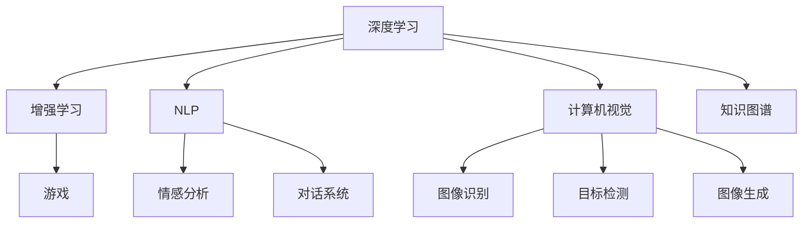

                 

# AI与人类社会的未来发展

## 1. 背景介绍

### 1.1 问题由来
人工智能（Artificial Intelligence，AI）技术在过去几十年中取得了飞速发展，并在各个领域中展现出了巨大的应用潜力。从深度学习、强化学习、自然语言处理到计算机视觉，AI技术的突破已经深刻改变了我们的工作、生活乃至思维模式。然而，AI与人类社会的未来发展道路仍面临诸多挑战和不确定性。本文将系统探讨AI在各个领域的应用前景，并分析其在未来可能带来的深远影响。

### 1.2 问题核心关键点
AI与人类社会的未来发展涉及多个核心关键点：
1. **AI技术成熟度**：AI技术的当前水平和未来发展趋势。
2. **应用领域**：AI技术在医疗、教育、金融、交通等领域的具体应用。
3. **伦理与安全**：AI在应用过程中可能引发的伦理和安全性问题。
4. **社会影响**：AI技术对就业、教育、治理等方面的社会影响。
5. **挑战与对策**：未来AI技术面临的主要挑战和应对策略。

这些关键点共同构成了AI与人类社会未来发展的复杂图景，需要我们从技术、应用、伦理和社会等多个维度进行深入分析和思考。

## 2. 核心概念与联系

### 2.1 核心概念概述

为更好地理解AI与人类社会的未来发展，本节将介绍几个密切相关的核心概念：

- **人工智能（AI）**：模拟人类智能的机器或系统，包括感知、推理、学习、决策等多个方面。
- **深度学习（Deep Learning）**：基于神经网络的机器学习方法，能够处理复杂的数据模式和结构，广泛应用于图像识别、语音识别、自然语言处理等领域。
- **增强学习（Reinforcement Learning）**：通过与环境的交互，不断调整策略以最大化奖励的机器学习方法，广泛应用于游戏、机器人、自动驾驶等领域。
- **自然语言处理（NLP）**：使计算机能够理解、处理和生成人类语言的技术，包括机器翻译、情感分析、对话系统等。
- **计算机视觉（CV）**：使计算机能够理解和解释视觉数据的学科，包括图像识别、目标检测、图像生成等。
- **知识图谱（KG）**：用于描述实体和实体间关系的图形数据库，能够支持复杂的推理和查询。

这些核心概念之间的逻辑关系可以通过以下Mermaid流程图来展示：



这个流程图展示了大语言模型与多个AI子领域的紧密联系：

1. **深度学习**是AI技术的基石，通过学习数据分布，实现了对复杂数据模式的自动提取和抽象。
2. **增强学习**利用奖励机制，通过与环境的交互不断优化策略，推动AI技术在实际应用中的进步。
3. **自然语言处理**使AI系统能够理解和生成人类语言，极大地拓宽了AI的应用场景。
4. **计算机视觉**使AI系统能够处理和理解视觉数据，推动了智能监控、自动驾驶等领域的发展。
5. **知识图谱**为AI系统提供了结构化的知识库，支持复杂的推理和查询，提升了AI系统的智能水平。

这些核心概念共同构成了AI技术的基本框架，推动了AI在各个领域的广泛应用。

## 3. 核心算法原理 & 具体操作步骤
### 3.1 算法原理概述

AI与人类社会的未来发展，不仅依赖于AI技术的突破，还涉及如何有效应用这些技术，推动社会进步。本节将系统介绍基于深度学习和增强学习的AI核心算法原理，并探讨其操作步骤。

### 3.2 算法步骤详解

AI技术的核心算法包括深度学习和增强学习。下面分别介绍这两种算法的详细步骤：

#### 3.2.1 深度学习算法
深度学习算法主要包括以下步骤：

1. **数据收集与预处理**：收集相关数据，并进行清洗、标注、归一化等预处理操作。
2. **模型设计**：选择合适的神经网络结构和激活函数，设计输入层、隐藏层和输出层。
3. **模型训练**：使用反向传播算法，根据损失函数调整模型参数，最小化预测误差。
4. **模型评估**：使用测试集对模型进行评估，计算准确率、召回率、F1分数等指标。
5. **模型优化**：根据评估结果，调整模型结构和参数，进行多次迭代训练。
6. **模型应用**：将训练好的模型应用于实际问题，进行预测或推理。

#### 3.2.2 增强学习算法
增强学习算法主要包括以下步骤：

1. **环境设计**：定义AI系统需要交互的环境，包括状态、动作、奖励等。
2. **策略设计**：选择或设计合适的策略函数，确定AI系统的决策规则。
3. **模型训练**：通过与环境的交互，不断调整策略函数，最大化长期奖励。
4. **模型评估**：使用测试集或实际环境，评估AI系统的表现。
5. **模型优化**：根据评估结果，优化策略函数和参数，进行多次迭代训练。
6. **模型应用**：将训练好的模型应用于实际问题，进行决策或控制。

### 3.3 算法优缺点

深度学习和增强学习各有优缺点，如下：

- **深度学习**的优点包括：
  - 能够处理大规模数据，自动提取数据中的复杂模式。
  - 适用于多种任务，包括分类、回归、生成等。
  - 模型结构灵活，可以通过增加层数和神经元数量提高性能。

- **深度学习**的缺点包括：
  - 需要大量标注数据，数据获取成本高。
  - 模型复杂度高，训练和推理速度慢。
  - 可能存在过拟合问题，需要精细调参。

- **增强学习**的优点包括：
  - 能够通过与环境的交互，不断优化决策策略。
  - 适用于需要连续控制的任务，如自动驾驶、机器人控制等。
  - 模型可以不断学习和适应，具有较强的适应性。

- **增强学习**的缺点包括：
  - 环境设计复杂，需要精确定义状态和动作空间。
  - 奖励设计困难，可能导致AI系统策略不稳定。
  - 模型训练时间长，需要大量计算资源。

### 3.4 算法应用领域

AI技术在多个领域中都有广泛应用，具体如下：

1. **医疗领域**：AI技术在医学影像分析、疾病诊断、个性化治疗等方面有重要应用。例如，通过深度学习算法，AI系统可以分析CT、MRI等医学影像，帮助医生快速定位病变区域。
2. **教育领域**：AI技术在智能辅导、个性化推荐、智能评估等方面有重要应用。例如，通过增强学习算法，AI系统可以根据学生的学习行为，自动调整教学策略和内容，提高学习效果。
3. **金融领域**：AI技术在风险管理、交易策略、欺诈检测等方面有重要应用。例如，通过深度学习算法，AI系统可以分析大量交易数据，预测市场走势和风险。
4. **交通领域**：AI技术在自动驾驶、交通流量优化、智能交通管理等方面有重要应用。例如，通过增强学习算法，AI系统可以在模拟环境中学习驾驶策略，提升自动驾驶的安全性和可靠性。
5. **工业领域**：AI技术在智能制造、质量检测、设备维护等方面有重要应用。例如，通过计算机视觉算法，AI系统可以检测生产线上的缺陷，提高产品质量和生产效率。

## 4. 数学模型和公式 & 详细讲解 & 举例说明

### 4.1 数学模型构建

为了更系统地介绍AI与人类社会的未来发展，本节将通过数学模型来详细讲解深度学习和增强学习的原理。

#### 4.1.1 深度学习模型构建
深度学习模型主要由输入层、隐藏层和输出层组成，可以通过以下公式表示：

$$
y = f(W_1 \cdot x + b_1) \cdot W_2 + b_2
$$

其中，$x$ 表示输入向量，$W_1$ 和 $W_2$ 表示权重矩阵，$b_1$ 和 $b_2$ 表示偏置向量，$f$ 表示激活函数。

#### 4.1.2 增强学习模型构建
增强学习模型主要包括以下几个组件：
1. **状态空间**：定义环境的状态集合。
2. **动作空间**：定义环境的动作集合。
3. **奖励函数**：定义环境对动作的奖励。
4. **策略函数**：定义AI系统的决策策略。

例如，在自动驾驶场景中，状态空间可以包括车速、位置、周围车辆信息等，动作空间可以包括加速、刹车、转向等，奖励函数可以定义安全到达目的地等。

### 4.2 公式推导过程

#### 4.2.1 深度学习公式推导
深度学习的核心是反向传播算法，其基本思想是通过链式法则反向传播损失函数的梯度，更新模型参数。具体推导过程如下：

$$
\frac{\partial \mathcal{L}}{\partial W_2} = \frac{\partial \mathcal{L}}{\partial y} \cdot \frac{\partial y}{\partial W_2}
$$

其中，$\mathcal{L}$ 表示损失函数，$y$ 表示输出向量。

#### 4.2.2 增强学习公式推导
增强学习的核心是策略函数的学习和优化，其基本思想是通过与环境的交互，最大化长期奖励。具体推导过程如下：

$$
\pi^* = \mathop{\arg\min}_{\pi} \mathbb{E} [\sum_{t=0}^{\infty} \gamma^t r_t]
$$

其中，$\pi$ 表示策略函数，$\gamma$ 表示折扣因子，$r_t$ 表示时间 $t$ 的奖励。

### 4.3 案例分析与讲解

#### 4.3.1 图像识别案例
图像识别是深度学习在计算机视觉领域的重要应用之一。例如，通过卷积神经网络（CNN）算法，AI系统可以识别图片中的物体和场景。

以识别猫和狗为例，可以将猫和狗的图像作为训练集，定义输入向量 $x$ 和输出向量 $y$，训练深度学习模型。具体步骤如下：

1. **数据准备**：收集猫和狗的图像，并进行标注。
2. **模型设计**：选择CNN模型结构，包括卷积层、池化层、全连接层等。
3. **模型训练**：使用反向传播算法，调整模型参数，最小化预测误差。
4. **模型评估**：使用测试集对模型进行评估，计算准确率和召回率。
5. **模型优化**：根据评估结果，调整模型结构和参数，进行多次迭代训练。
6. **模型应用**：将训练好的模型应用于实际问题，识别新输入的图片中的猫或狗。

#### 4.3.2 自动驾驶案例
自动驾驶是增强学习在交通领域的重要应用之一。例如，通过强化学习算法，AI系统可以在模拟环境中学习驾驶策略，提升自动驾驶的安全性和可靠性。

以自动驾驶为例，可以将模拟环境中的交通状况作为状态空间，加速、刹车、转向等作为动作空间，安全到达目的地作为奖励函数。具体步骤如下：

1. **环境设计**：定义模拟环境，包括交通信号、车道、车辆等。
2. **策略设计**：选择或设计合适的策略函数，确定AI系统的决策规则。
3. **模型训练**：通过与环境的交互，不断调整策略函数，最大化长期奖励。
4. **模型评估**：使用测试集或实际环境，评估AI系统的表现。
5. **模型优化**：根据评估结果，优化策略函数和参数，进行多次迭代训练。
6. **模型应用**：将训练好的模型应用于实际问题，控制自动驾驶车辆在复杂交通环境中安全行驶。

## 5. 项目实践：代码实例和详细解释说明

### 5.1 开发环境搭建

在进行AI项目开发时，需要准备好开发环境。以下是使用Python进行TensorFlow开发的环境配置流程：

1. 安装Anaconda：从官网下载并安装Anaconda，用于创建独立的Python环境。

2. 创建并激活虚拟环境：
```bash
conda create -n tf-env python=3.7 
conda activate tf-env
```

3. 安装TensorFlow：根据CUDA版本，从官网获取对应的安装命令。例如：
```bash
conda install tensorflow tensorflow-gpu=2.4.0=cudatoolkit=11.1 -c tf
```

4. 安装各类工具包：
```bash
pip install numpy pandas scikit-learn matplotlib tqdm jupyter notebook ipython
```

完成上述步骤后，即可在`tf-env`环境中开始AI项目开发。

### 5.2 源代码详细实现

下面我们以图像识别为例，给出使用TensorFlow进行深度学习项目开发的PyTorch代码实现。

首先，定义图像识别任务的数据处理函数：

```python
import tensorflow as tf
import numpy as np
import matplotlib.pyplot as plt

class ImageClassifier:
    def __init__(self):
        self.model = tf.keras.models.Sequential([
            tf.keras.layers.Conv2D(32, (3, 3), activation='relu', input_shape=(28, 28, 1)),
            tf.keras.layers.MaxPooling2D((2, 2)),
            tf.keras.layers.Flatten(),
            tf.keras.layers.Dense(64, activation='relu'),
            tf.keras.layers.Dense(10, activation='softmax')
        ])
    
    def preprocess_image(self, image):
        image = tf.image.resize(image, (28, 28))
        image = tf.image.grayscale_to_rgb(image)
        image = tf.image.per_image_standardization(image)
        return image
    
    def predict(self, image):
        image = self.preprocess_image(image)
        image = tf.expand_dims(image, axis=0)
        predictions = self.model.predict(image)
        return np.argmax(predictions)
```

然后，定义模型和优化器：

```python
model = ImageClassifier()
optimizer = tf.keras.optimizers.Adam(learning_rate=0.001)
```

接着，定义训练和评估函数：

```python
def train_epoch(model, dataset, batch_size, optimizer):
    model.compile(optimizer=optimizer, loss='sparse_categorical_crossentropy', metrics=['accuracy'])
    model.fit(dataset, epochs=10, batch_size=batch_size)
    
def evaluate(model, dataset, batch_size):
    loss, accuracy = model.evaluate(dataset, batch_size=batch_size)
    print('Loss:', loss)
    print('Accuracy:', accuracy)
```

最后，启动训练流程并在测试集上评估：

```python
train_dataset = ...
test_dataset = ...

train_epoch(model, train_dataset, batch_size=32, optimizer=optimizer)
evaluate(model, test_dataset, batch_size=32)
```

以上就是使用TensorFlow进行图像识别项目开发的完整代码实现。可以看到，TensorFlow提供了强大的模型构建和优化功能，使得深度学习模型的开发和训练变得非常简单。

### 5.3 代码解读与分析

让我们再详细解读一下关键代码的实现细节：

**ImageClassifier类**：
- `__init__`方法：初始化模型结构，包括卷积层、池化层、全连接层等。
- `preprocess_image`方法：对输入图像进行预处理，包括灰度化、标准化等。
- `predict`方法：对输入图像进行预测，返回预测结果。

**train_epoch和evaluate函数**：
- `train_epoch`方法：使用TensorFlow的API，定义模型编译、训练等步骤，并通过调用`fit`方法进行训练。
- `evaluate`方法：使用TensorFlow的API，定义模型评估，并通过调用`evaluate`方法进行评估。

**训练流程**：
- 定义总的epoch数和batch size，开始循环迭代。
- 每个epoch内，先在训练集上训练，输出平均loss和acc。
- 在测试集上评估，输出测试loss和acc。
- 所有epoch结束后，在测试集上评估，给出最终测试结果。

可以看到，TensorFlow提供了丰富的API，使得深度学习模型的开发和训练变得非常简单。开发者可以专注于模型结构和算法优化，而不必过多关注底层的实现细节。

当然，工业级的系统实现还需考虑更多因素，如模型的保存和部署、超参数的自动搜索、更灵活的任务适配层等。但核心的AI开发流程基本与此类似。

## 6. 实际应用场景
### 6.1 智能制造

智能制造是AI在工业领域的重要应用之一。通过AI技术，可以实现生产线的自动化、智能化，提升生产效率和质量。

例如，通过计算机视觉算法，AI系统可以检测生产线上的缺陷，提高产品质量和生产效率。具体步骤如下：

1. **数据准备**：收集生产线的图像数据，并进行标注。
2. **模型设计**：选择计算机视觉模型结构，包括卷积层、池化层、全连接层等。
3. **模型训练**：使用反向传播算法，调整模型参数，最小化预测误差。
4. **模型评估**：使用测试集对模型进行评估，计算准确率和召回率。
5. **模型优化**：根据评估结果，调整模型结构和参数，进行多次迭代训练。
6. **模型应用**：将训练好的模型应用于实际问题，检测生产线上的缺陷。

### 6.2 智能客服

智能客服是AI在客服领域的重要应用之一。通过AI技术，可以实现客服的自动化、智能化，提升客户体验和效率。

例如，通过自然语言处理算法，AI系统可以自动理解客户咨询，匹配最合适的答案模板进行回复。具体步骤如下：

1. **数据准备**：收集客服对话数据，并进行标注。
2. **模型设计**：选择自然语言处理模型结构，包括输入层、隐藏层、输出层等。
3. **模型训练**：使用反向传播算法，调整模型参数，最小化预测误差。
4. **模型评估**：使用测试集对模型进行评估，计算准确率和召回率。
5. **模型优化**：根据评估结果，调整模型结构和参数，进行多次迭代训练。
6. **模型应用**：将训练好的模型应用于实际问题，自动理解客户咨询，匹配最合适的答案模板进行回复。

### 6.3 智慧城市

智慧城市是AI在城市治理领域的重要应用之一。通过AI技术，可以实现城市管理的智能化，提升城市的运行效率和居民生活质量。

例如，通过计算机视觉算法，AI系统可以监测城市交通状况，优化交通流量。具体步骤如下：

1. **数据准备**：收集城市交通监控视频，并进行标注。
2. **模型设计**：选择计算机视觉模型结构，包括卷积层、池化层、全连接层等。
3. **模型训练**：使用反向传播算法，调整模型参数，最小化预测误差。
4. **模型评估**：使用测试集对模型进行评估，计算准确率和召回率。
5. **模型优化**：根据评估结果，调整模型结构和参数，进行多次迭代训练。
6. **模型应用**：将训练好的模型应用于实际问题，监测城市交通状况，优化交通流量。

## 7. 工具和资源推荐
### 7.1 学习资源推荐

为了帮助开发者系统掌握AI技术的理论基础和实践技巧，这里推荐一些优质的学习资源：

1. 《深度学习》课程（CS231n）：斯坦福大学开设的深度学习课程，内容涵盖了深度学习的基础知识和应用。
2. 《强化学习》课程（CS294）：斯坦福大学开设的强化学习课程，内容涵盖了强化学习的基本算法和应用。
3. 《自然语言处理》课程（CS224n）：斯坦福大学开设的自然语言处理课程，内容涵盖了自然语言处理的基础知识和应用。
4. 《计算机视觉》课程（CS231n）：斯坦福大学开设的计算机视觉课程，内容涵盖了计算机视觉的基础知识和应用。
5. 《AI导论》书籍（Hinton）：深度学习领域的经典书籍，内容涵盖了深度学习的基本原理和应用。

通过对这些资源的学习实践，相信你一定能够快速掌握AI技术的精髓，并用于解决实际的AI问题。

### 7.2 开发工具推荐

高效的开发离不开优秀的工具支持。以下是几款用于AI技术开发的工具：

1. PyTorch：基于Python的开源深度学习框架，灵活动态的计算图，适合快速迭代研究。
2. TensorFlow：由Google主导开发的开源深度学习框架，生产部署方便，适合大规模工程应用。
3. Keras：高层次的深度学习框架，易于上手，适合快速原型开发。
4. Jupyter Notebook：交互式的开发环境，支持代码、数据和图表的展示和分享。
5. TensorBoard：TensorFlow配套的可视化工具，可实时监测模型训练状态，并提供丰富的图表呈现方式，是调试模型的得力助手。

合理利用这些工具，可以显著提升AI技术的开发效率，加快创新迭代的步伐。

### 7.3 相关论文推荐

AI技术的发展离不开学界的持续研究。以下是几篇奠基性的相关论文，推荐阅读：

1. AlexNet：2012年ImageNet图像识别比赛的冠军算法，开启了深度学习在计算机视觉领域的革命。
2. AlphaGo：2016年击败人类围棋世界冠军的AI算法，展示了深度强化学习的潜力。
3. BERT：2018年提出的预训练语言模型，刷新了多项NLP任务的SOTA。
4. GPT-3：2020年提出的预训练语言模型，展示了深度学习在自然语言处理领域的巨大能力。
5. AlphaStar：2019年击败人类星际争霸世界冠军的AI算法，展示了深度强化学习在游戏领域的潜力。

这些论文代表了大语言模型和AI技术的发展脉络。通过学习这些前沿成果，可以帮助研究者把握学科前进方向，激发更多的创新灵感。

## 8. 总结：未来发展趋势与挑战

### 8.1 总结

本文对AI与人类社会的未来发展进行了全面系统的介绍。首先阐述了AI技术的当前水平和未来发展趋势，明确了AI技术在各个领域的应用前景和深远影响。其次，从原理到实践，详细讲解了基于深度学习和增强学习的AI核心算法原理，并探讨了其操作步骤。同时，本文还广泛探讨了AI技术在医疗、教育、金融、交通等多个领域的应用场景，展示了AI技术对社会的广泛影响。最后，本文精选了AI技术的各类学习资源，力求为读者提供全方位的技术指引。

通过本文的系统梳理，可以看到，AI技术与人类社会的未来发展紧密相关，将在多个领域中发挥重要作用。AI技术不仅能够提升生产效率、优化资源配置，还能提升服务质量、改善人类生活质量。然而，AI技术的发展也面临着诸多挑战和不确定性，需要我们从技术、应用、伦理和社会等多个维度进行深入分析和思考。

### 8.2 未来发展趋势

展望未来，AI与人类社会的未来发展趋势如下：

1. **技术成熟度**：AI技术将在更多领域中取得突破，推动各行业的智能化转型。
2. **应用领域**：AI技术将在医疗、教育、金融、交通等领域得到广泛应用，提升社会运行效率。
3. **伦理与安全**：AI技术将面临更多的伦理和安全问题，需要建立相应的规范和监管机制。
4. **社会影响**：AI技术将深刻影响就业、教育、治理等多个社会领域，带来新的挑战和机遇。
5. **挑战与对策**：AI技术将面临数据获取、模型训练、计算资源等方面的挑战，需要不断创新和优化。

以上趋势凸显了AI技术在推动社会进步中的重要作用，但也需要我们关注其可能带来的负面影响，建立健全的规范和监管机制，确保AI技术的应用安全、可靠、可解释。

### 8.3 面临的挑战

尽管AI技术的发展前景广阔，但也面临诸多挑战：

1. **数据隐私和安全**：AI技术的广泛应用需要大量的数据支持，但如何保护用户隐私和数据安全，仍是一个重要问题。
2. **模型透明和可解释性**：当前AI模型通常是一个"黑盒"系统，难以解释其内部工作机制和决策逻辑。如何赋予AI模型更强的可解释性，将是未来AI技术的重要研究方向。
3. **伦理和道德问题**：AI技术的快速发展可能带来伦理和道德问题，如偏见、歧视、隐私泄露等。如何构建公正、透明的AI系统，将是未来AI技术的重要课题。
4. **计算资源和能耗**：AI模型通常需要大量计算资源和能源支持，如何优化模型结构和算法，减少计算资源和能源消耗，将是未来AI技术的重要研究方向。
5. **标准化和互操作性**：AI技术的广泛应用需要跨领域的标准化和互操作性，如何建立统一的标准和规范，将是未来AI技术的重要课题。

这些挑战凸显了AI技术在发展过程中需要解决的问题，需要我们从技术、应用、伦理等多个维度进行深入分析和思考。

### 8.4 研究展望

未来AI技术的研究展望如下：

1. **跨领域融合**：AI技术将在多个领域中深度融合，推动各行业的智能化转型。
2. **自主学习**：未来的AI系统将具备更强的自主学习能力，能够不断学习和适应新的环境和任务。
3. **多模态融合**：未来的AI系统将能够融合多种模态数据，提升智能感知和理解能力。
4. **伦理和法律**：未来的AI系统将面临更多的伦理和法律问题，需要建立相应的规范和监管机制。
5. **人机协同**：未来的AI系统将与人类实现更加紧密的协同，提升人机交互的效率和效果。

这些研究方向的探索，将引领AI技术迈向更高的台阶，为构建安全、可靠、可解释、可控的智能系统铺平道路。

## 9. 附录：常见问题与解答

**Q1：AI技术是否会取代人类？**

A: AI技术的发展将改变人类的生产生活方式，但在可预见的未来，AI技术无法完全取代人类。AI技术的核心在于辅助人类，提升人类工作效率和生活质量，而不是取代人类。例如，AI技术在医疗、教育、客服等领域，可以辅助医生、教师、客服等工作，提升服务质量和效率，但无法完全替代人类。

**Q2：AI技术对就业市场有何影响？**

A: AI技术的发展将对就业市场带来深刻影响。一方面，AI技术可以替代一些重复性、低技能的工作，降低劳动成本。另一方面，AI技术也将创造新的就业机会，如AI系统维护、数据标注、算法优化等。总体来看，AI技术的发展将推动就业市场的结构性变革，提升整体劳动生产率。

**Q3：AI技术在医疗领域的应用前景如何？**

A: AI技术在医疗领域的应用前景广阔。例如，通过图像识别算法，AI系统可以辅助医生进行疾病诊断，提高诊断准确率和效率。通过自然语言处理算法，AI系统可以辅助医生进行病历记录和分析，提升医疗决策的科学性。通过个性化推荐算法，AI系统可以为患者提供个性化的治疗方案，提高治疗效果。

**Q4：AI技术在教育领域的应用前景如何？**

A: AI技术在教育领域的应用前景广阔。例如，通过智能辅导系统，AI系统可以为学生提供个性化的学习建议和资源，提升学习效果。通过情感分析算法，AI系统可以了解学生的学习情感，及时调整教学策略，提高学习体验。通过智能评估系统，AI系统可以自动评估学生的学习成果，提供客观、公正的评价。

**Q5：AI技术在金融领域的应用前景如何？**

A: AI技术在金融领域的应用前景广阔。例如，通过风险管理算法，AI系统可以预测市场走势和风险，帮助投资者做出更明智的投资决策。通过欺诈检测算法，AI系统可以监测金融交易，预防和打击金融欺诈行为。通过量化交易算法，AI系统可以自动化交易，提升交易效率和收益。

综上所述，AI技术将在各个领域中发挥重要作用，推动社会的智能化转型。然而，AI技术的发展也面临诸多挑战和不确定性，需要我们从技术、应用、伦理和社会等多个维度进行深入分析和思考。只有勇于创新、敢于突破，才能不断拓展AI技术的边界，让人类社会进入更加智能化的未来。

