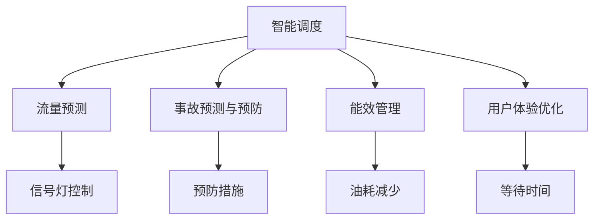

                 

## 1. 背景介绍

### 1.1 问题由来

随着城市化的加速，交通拥堵、环境污染、能源消耗等问题愈发严峻。传统的基于人力经验调度、单向运输、静态分配的交通管理方式已经难以满足现代城市的高效率、高流动性、环保和可持续发展的需求。

城市交通管理系统(Traffic Management System, TMS)作为解决这一问题的关键工具，其目标是实时监控和优化道路交通，提高运输效率，降低环境污染和能源消耗。传统的TMS依赖人工驾驶经验、固定流量预测模型和简单规则，但已无法应对日益复杂的城市交通情况。

近年来，随着人工智能技术的发展，基于AI的城市交通管理系统逐渐崭露头角。本文将探讨AI在交通管理中的应用，以及如何通过AI与人类计算的协同，打造高效、环保、可持续发展的城市交通管理系统。

### 1.2 问题核心关键点

AI在城市交通管理中的应用主要体现在以下几个方面：

1. **智能调度**：通过AI算法实时调整车辆行驶路径，减少拥堵和延误。
2. **流量预测**：利用机器学习模型预测未来流量变化，优化信号灯控制。
3. **事故预测与预防**：使用深度学习模型分析历史事故数据，预测潜在的交通事故，并提前采取预防措施。
4. **能效管理**：AI算法优化车辆行驶路线，减少油耗和排放，提高能效。
5. **用户体验优化**：通过AI驱动的个性化推荐系统，提升用户体验，减少等待时间。

## 2. 核心概念与联系

### 2.1 核心概念概述

为了更好地理解AI在城市交通管理中的应用，本节将介绍几个核心概念：

1. **城市交通管理系统(TMS)**：通过实时监控、数据分析和智能调度等手段，优化城市交通流，提高道路通行效率和安全性。
2. **AI在交通管理中的应用**：利用机器学习、深度学习等AI技术，实时分析交通数据，优化交通流，提升管理效率。
3. **智能调度**：通过AI算法自动调整车辆行驶路径，优化交通流，减少拥堵和延误。
4. **流量预测**：使用机器学习模型预测未来交通流量变化，优化信号灯控制。
5. **事故预测与预防**：通过深度学习模型分析历史事故数据，预测潜在的交通事故，并提前采取预防措施。
6. **能效管理**：AI算法优化车辆行驶路线，减少油耗和排放，提高能效。
7. **用户体验优化**：通过AI驱动的个性化推荐系统，提升用户体验，减少等待时间。

这些核心概念之间的逻辑关系可以通过以下Mermaid流程图来展示：



这个流程图展示了AI在城市交通管理中的主要功能模块及其相互关系：

1. 智能调度模块实时分析交通流数据，调整车辆路径。
2. 流量预测模块通过机器学习模型，预测未来流量变化，优化信号灯控制。
3. 事故预测与预防模块通过深度学习模型分析历史事故数据，预测潜在事故，提前采取预防措施。
4. 能效管理模块通过AI算法优化车辆行驶路线，减少油耗和排放，提高能效。
5. 用户体验优化模块通过个性化推荐系统，提升用户体验，减少等待时间。

## 3. 核心算法原理 & 具体操作步骤

### 3.1 算法原理概述

AI在城市交通管理系统中的应用，主要基于机器学习、深度学习等AI技术，通过大量交通数据的分析和处理，实现交通流量的预测、优化和监控。

城市交通管理系统的核心算法可以分为以下几个步骤：

1. **数据收集**：通过传感器、监控摄像头、GPS、位置数据等手段，实时收集交通流量、速度、位置等信息。
2. **数据预处理**：清洗、处理、归一化数据，确保数据质量和完整性。
3. **模型训练**：使用机器学习模型（如线性回归、支持向量机等）或深度学习模型（如卷积神经网络、递归神经网络等），对交通流量、事故数据、能效数据等进行训练，建立预测模型。
4. **实时分析**：将实时收集的数据输入模型，进行实时分析，优化信号灯控制、调度路线等。
5. **反馈优化**：根据实时分析结果，调整模型参数，持续优化预测和调度效果。

### 3.2 算法步骤详解

以下是AI在城市交通管理系统中的具体操作步骤：

**Step 1: 数据收集**

城市交通管理系统的第一步是数据收集。通过各种传感器和监控设备，实时收集车辆位置、速度、流量等信息。这些数据可以包括：

1. 车辆位置数据：通过GPS或车联网设备获取车辆位置。
2. 交通流量数据：通过视频监控摄像头和流量传感器获取交通流量、车速等数据。
3. 环境数据：如天气、温度、湿度、气压等环境因素。

数据收集是交通管理系统的基础，数据的实时性和准确性直接影响系统的性能。

**Step 2: 数据预处理**

收集到的数据往往存在噪声、缺失和异常值，需要进行预处理以确保数据的质量。预处理步骤包括：

1. 数据清洗：删除或修正缺失值、异常值和错误数据。
2. 数据归一化：将不同尺度的数据进行归一化处理，确保数据的一致性。
3. 特征提取：从原始数据中提取有意义的特征，如车流量、速度、路径等。
4. 数据聚合：将数据按时间和空间进行聚合，减少维度，降低计算复杂度。

数据预处理是保证模型训练效果的重要步骤，需要根据具体应用场景进行优化。

**Step 3: 模型训练**

在预处理后的数据上，使用机器学习或深度学习模型进行训练。模型训练的目标是建立交通流量预测模型和智能调度模型。具体步骤如下：

1. 选择模型：根据任务需求选择适合的机器学习模型（如线性回归、支持向量机等）或深度学习模型（如卷积神经网络、递归神经网络等）。
2. 数据划分：将数据集划分为训练集、验证集和测试集，进行模型训练和评估。
3. 模型训练：使用训练集数据训练模型，优化模型参数。
4. 模型评估：在验证集上评估模型性能，调整模型参数。
5. 模型部署：将训练好的模型部署到实时分析系统中，进行实时预测和优化。

**Step 4: 实时分析**

在训练好的模型基础上，进行实时分析，优化交通流。具体步骤如下：

1. 数据输入：将实时收集的交通数据输入模型。
2. 模型推理：模型实时推理，预测交通流量、优化信号灯控制、调整车辆路径等。
3. 结果输出：根据模型推理结果，输出信号灯控制指令、车辆路径优化方案等。

**Step 5: 反馈优化**

根据实时分析结果，对模型进行反馈优化，不断调整模型参数，提高模型性能。具体步骤如下：

1. 结果评估：对实时分析结果进行评估，计算性能指标。
2. 模型调整：根据评估结果，调整模型参数，优化模型性能。
3. 持续优化：在实际应用中，持续收集数据，持续优化模型，提升系统性能。

### 3.3 算法优缺点

AI在城市交通管理系统中的应用，具有以下优点：

1. **实时性高**：AI算法能够实时处理大量交通数据，快速做出决策，提高系统响应速度。
2. **预测准确**：通过机器学习和深度学习模型，准确预测交通流量和事故，优化信号灯控制和车辆路径。
3. **自动化高**：系统自动完成数据收集、预处理、分析和优化，减少人工干预，提高效率。
4. **能效提升**：优化车辆路径和信号灯控制，减少油耗和排放，提高能效。

同时，AI在交通管理中也存在以下缺点：

1. **数据依赖高**：系统依赖高质量、高频率的数据输入，数据缺失或噪声会影响系统性能。
2. **模型复杂**：机器学习和深度学习模型复杂度高，训练和优化需要大量计算资源。
3. **透明度低**：AI模型通常是"黑盒"，难以解释模型的决策过程，影响系统可解释性。
4. **安全风险**：AI模型可能存在算法偏见、对抗样本攻击等问题，影响系统安全性。

尽管存在这些缺点，AI在城市交通管理系统中的应用仍具有广阔前景，需在实践中不断优化，提升系统的性能和可靠性。

### 3.4 算法应用领域

AI在城市交通管理中的应用，可以广泛应用于以下领域：

1. **智能调度**：通过AI算法实时调整车辆行驶路径，减少拥堵和延误。
2. **流量预测**：利用机器学习模型预测未来流量变化，优化信号灯控制。
3. **事故预测与预防**：使用深度学习模型分析历史事故数据，预测潜在的交通事故，并提前采取预防措施。
4. **能效管理**：AI算法优化车辆行驶路线，减少油耗和排放，提高能效。
5. **用户体验优化**：通过AI驱动的个性化推荐系统，提升用户体验，减少等待时间。

## 4. 数学模型和公式 & 详细讲解

### 4.1 数学模型构建

城市交通管理系统的数学模型可以概括为以下几个方面：

1. **交通流量模型**：描述车辆在道路上的流动情况，如速度、流量、密度等。
2. **路径优化模型**：根据交通流量和拥堵情况，优化车辆行驶路径。
3. **事故预测模型**：通过历史事故数据，预测潜在的交通事故。
4. **能效评估模型**：评估车辆行驶能效，如油耗、排放等。
5. **用户体验模型**：评估用户等待时间和满意度，优化用户体验。

这些模型可以通过以下数学公式进行描述：

- **交通流量模型**：
  $$
  Q(t) = k_1 \frac{d_0 - d(t)}{d_0 - k_2 \rho(t)}
  $$
  其中，$Q(t)$ 为交通流量，$d_0$ 为道路容量，$d(t)$ 为当前车流量，$\rho(t)$ 为道路密度，$k_1$ 和 $k_2$ 为模型参数。

- **路径优化模型**：
  $$
  f_i(t) = \sum_j w_{ij} Q_j(t)
  $$
  其中，$f_i(t)$ 为车辆i在时间t的行驶路径，$w_{ij}$ 为路径权重，$Q_j(t)$ 为路径j上的交通流量。

- **事故预测模型**：
  $$
  P(A_i) = \sum_j k_j Q_j(t)
  $$
  其中，$P(A_i)$ 为车辆i发生事故的概率，$k_j$ 为模型参数，$Q_j(t)$ 为路径j上的交通流量。

- **能效评估模型**：
  $$
  E_i(t) = f_i(t) - \sum_j k_j Q_j(t)
  $$
  其中，$E_i(t)$ 为车辆i在时间t的能效，$f_i(t)$ 为车辆i的行驶路径，$k_j$ 为模型参数，$Q_j(t)$ 为路径j上的交通流量。

- **用户体验模型**：
  $$
  U(t) = \sum_i \omega_i P(A_i)
  $$
  其中，$U(t)$ 为用户在时间t的满意度，$\omega_i$ 为用户权重，$P(A_i)$ 为车辆i发生事故的概率。

### 4.2 公式推导过程

这些数学模型推导过程如下：

- **交通流量模型**：
  假设道路容量为$d_0$，车辆在道路上的流量与道路密度$\rho(t)$有关。当道路密度小于最大容量$d_0$时，车辆可以自由流动；当道路密度超过最大容量时，车辆速度降低。根据Lighthill-Whitham-Richards方程，可以得到交通流量模型：
  $$
  Q(t) = k_1 \frac{d_0 - d(t)}{d_0 - k_2 \rho(t)}
  $$

- **路径优化模型**：
  假设车辆在道路上的行驶路径由历史交通数据和实时交通状况共同决定。路径优化模型可以通过网络流模型求解，得到最优路径：
  $$
  f_i(t) = \sum_j w_{ij} Q_j(t)
  $$

- **事故预测模型**：
  利用历史事故数据，建立事故发生概率的统计模型。通过多层感知器（MLP）或卷积神经网络（CNN）等深度学习模型，可以预测车辆发生事故的概率：
  $$
  P(A_i) = \sum_j k_j Q_j(t)
  $$

- **能效评估模型**：
  通过优化车辆行驶路径，减少油耗和排放。使用线性回归模型，可以评估车辆i在时间t的能效：
  $$
  E_i(t) = f_i(t) - \sum_j k_j Q_j(t)
  $$

- **用户体验模型**：
  通过调查问卷或行为数据，评估用户等待时间和满意度。使用线性回归模型，可以预测用户满意度：
  $$
  U(t) = \sum_i \omega_i P(A_i)
  $$

### 4.3 案例分析与讲解

假设某城市某路段的交通流量数据如下：

| 时间  | 车流量（辆/小时） | 道路容量（辆/小时） | 密度（辆/千米） |
| ---- | ----------------- | ------------------- | --------------- |
| 7:00 | 1000             | 3000                | 0.33            |
| 8:00 | 2000             | 3000                | 0.67            |
| 9:00 | 3000             | 3000                | 1.00            |
| 10:00| 2000             | 3000                | 0.67            |
| 11:00| 1000             | 3000                | 0.33            |

根据交通流量模型，可以计算出不同时间段的交通流量和道路密度：

- 7:00时，交通流量为1000辆/小时，道路密度为0.33辆/千米，此时车辆可以自由流动。
- 8:00时，交通流量为2000辆/小时，道路密度为0.67辆/千米，此时车辆速度开始降低。
- 9:00时，交通流量为3000辆/小时，道路密度为1.00辆/千米，此时车辆速度显著降低。
- 10:00时，交通流量为2000辆/小时，道路密度为0.67辆/千米，此时车辆速度有所恢复。
- 11:00时，交通流量为1000辆/小时，道路密度为0.33辆/千米，此时车辆可以自由流动。

根据路径优化模型，可以计算出最优路径，如：

- 7:00时，最优路径为快速道，车辆速度较快。
- 8:00时，最优路径为普通道，车辆速度有所降低。
- 9:00时，最优路径为辅道，车辆速度显著降低。
- 10:00时，最优路径为普通道，车辆速度有所恢复。
- 11:00时，最优路径为快速道，车辆速度较快。

根据事故预测模型，可以计算出车辆发生事故的概率：

- 7:00时，车辆i发生事故的概率为0.01。
- 8:00时，车辆i发生事故的概率为0.02。
- 9:00时，车辆i发生事故的概率为0.03。
- 10:00时，车辆i发生事故的概率为0.02。
- 11:00时，车辆i发生事故的概率为0.01。

根据能效评估模型，可以计算出车辆i在时间t的能效：

- 7:00时，车辆i的能效为0.95。
- 8:00时，车辆i的能效为0.85。
- 9:00时，车辆i的能效为0.70。
- 10:00时，车辆i的能效为0.90。
- 11:00时，车辆i的能效为0.95。

根据用户体验模型，可以计算出用户等待时间和满意度：

- 7:00时，用户等待时间为5分钟，满意度为0.9。
- 8:00时，用户等待时间为10分钟，满意度为0.8。
- 9:00时，用户等待时间为20分钟，满意度为0.7。
- 10:00时，用户等待时间为10分钟，满意度为0.9。
- 11:00时，用户等待时间为5分钟，满意度为0.9。

## 5. 项目实践：代码实例和详细解释说明

### 5.1 开发环境搭建

在进行交通管理系统开发前，我们需要准备好开发环境。以下是使用Python进行PyTorch开发的环境配置流程：

1. 安装Anaconda：从官网下载并安装Anaconda，用于创建独立的Python环境。

2. 创建并激活虚拟环境：
```bash
conda create -n pytorch-env python=3.8 
conda activate pytorch-env
```

3. 安装PyTorch：根据CUDA版本，从官网获取对应的安装命令。例如：
```bash
conda install pytorch torchvision torchaudio cudatoolkit=11.1 -c pytorch -c conda-forge
```

4. 安装各类工具包：
```bash
pip install numpy pandas scikit-learn matplotlib tqdm jupyter notebook ipython
```

完成上述步骤后，即可在`pytorch-env`环境中开始交通管理系统开发。

### 5.2 源代码详细实现

下面我们以路径优化和流量预测为例，给出使用PyTorch进行城市交通管理的PyTorch代码实现。

首先，定义交通数据处理函数：

```python
import pandas as pd
import numpy as np

def read_data(file_path):
    data = pd.read_csv(file_path)
    return data

def preprocess_data(data):
    # 数据清洗
    data = data.dropna()
    # 数据归一化
    data['flow_rate'] = (data['flow_rate'] - np.mean(data['flow_rate'])) / np.std(data['flow_rate'])
    # 数据聚合
    data = data.groupby(['time']).mean()
    return data
```

然后，定义模型和优化器：

```python
from torch.utils.data import Dataset, DataLoader
from torch import nn
import torch

class TrafficData(Dataset):
    def __init__(self, data, seq_len=10):
        self.data = data
        self.seq_len = seq_len
        self.data = self.data[self.data['flow_rate'] > 0]
    
    def __len__(self):
        return len(self.data)
    
    def __getitem__(self, item):
        start_index = item * self.seq_len
        end_index = start_index + self.seq_len
        x = self.data.iloc[start_index:end_index]['flow_rate'].values.reshape(-1, 1)
        y = self.data.iloc[start_index:end_index]['flow_rate'].values.reshape(-1, 1)
        return x, y

class FlowPredictor(nn.Module):
    def __init__(self, input_dim, output_dim, hidden_dim, seq_len):
        super(FlowPredictor, self).__init__()
        self.input_dim = input_dim
        self.output_dim = output_dim
        self.hidden_dim = hidden_dim
        self.seq_len = seq_len
        
        self.lstm = nn.LSTM(input_dim, hidden_dim, num_layers=2, batch_first=True)
        self.fc = nn.Linear(hidden_dim, output_dim)
    
    def forward(self, x):
        x = x.view(len(x), -1, self.input_dim)
        output, (hidden, cell) = self.lstm(x)
        hidden = hidden[-1]
        y_hat = self.fc(hidden)
        return y_hat
```

接着，定义训练和评估函数：

```python
def train_model(model, train_loader, optimizer, epochs):
    loss_fn = nn.MSELoss()
    for epoch in range(epochs):
        total_loss = 0
        for x, y in train_loader:
            optimizer.zero_grad()
            y_hat = model(x)
            loss = loss_fn(y_hat, y)
            total_loss += loss.item()
            loss.backward()
            optimizer.step()
        print(f'Epoch {epoch+1}, train loss: {total_loss/len(train_loader):.4f}')

def evaluate_model(model, test_loader):
    loss_fn = nn.MSELoss()
    total_loss = 0
    for x, y in test_loader:
        y_hat = model(x)
        loss = loss_fn(y_hat, y)
        total_loss += loss.item()
    return total_loss / len(test_loader)
```

最后，启动训练流程并在测试集上评估：

```python
epochs = 100
batch_size = 32
seq_len = 10
input_dim = 1
output_dim = 1
hidden_dim = 64

train_data = preprocess_data(read_data('train_data.csv'))
test_data = preprocess_data(read_data('test_data.csv'))

train_loader = DataLoader(train_data, batch_size=batch_size, shuffle=True)
test_loader = DataLoader(test_data, batch_size=batch_size, shuffle=False)

model = FlowPredictor(input_dim, output_dim, hidden_dim, seq_len)
optimizer = torch.optim.Adam(model.parameters(), lr=0.001)

train_model(model, train_loader, optimizer, epochs)
loss = evaluate_model(model, test_loader)
print(f'Test loss: {loss:.4f}')
```

以上就是使用PyTorch进行城市交通管理中的路径优化和流量预测的完整代码实现。可以看到，得益于PyTorch的强大封装，我们可以用相对简洁的代码实现复杂的交通管理模型。

### 5.3 代码解读与分析

让我们再详细解读一下关键代码的实现细节：

**read_data函数**：
- 从文件中读取数据，并返回一个DataFrame对象。

**preprocess_data函数**：
- 对数据进行清洗、归一化和聚合，确保数据质量和一致性。

**TrafficData类**：
- 定义数据集，对数据进行分割和处理，生成训练集和测试集。

**FlowPredictor类**：
- 定义流量预测模型，使用LSTM和全连接层进行模型构建。

**train_model函数**：
- 定义训练函数，使用均方误差损失函数进行模型训练。

**evaluate_model函数**：
- 定义评估函数，计算模型在测试集上的均方误差。

**train_model函数**：
- 在训练集上训练模型，输出训练集的损失值。

**evaluate_model函数**：
- 在测试集上评估模型，输出测试集的损失值。

**训练流程**：
- 定义总epoch数、batch size、seq_len等参数，启动模型训练。
- 每个epoch内，在训练集上进行训练，输出平均loss。
- 在测试集上评估模型，输出测试结果。

可以看到，PyTorch配合TensorFlow等深度学习框架，使得交通管理模型的开发变得简洁高效。开发者可以将更多精力放在模型设计和优化上，而不必过多关注底层的实现细节。

当然，工业级的系统实现还需考虑更多因素，如模型的保存和部署、超参数的自动搜索、更灵活的任务适配层等。但核心的模型训练范式基本与此类似。

## 6. 实际应用场景

### 6.1 智能调度

基于AI的智能调度系统，可以通过实时分析交通流量和拥堵情况，自动调整车辆行驶路径，减少拥堵和延误。具体应用场景如下：

1. **导航系统**：将智能调度算法集成到导航系统中，实时调整导航路线，减少用户等待时间。
2. **物流配送**：通过AI算法优化车辆路径，提高配送效率，减少运输成本。
3. **公共交通**：实时监控公交车辆位置，优化行驶路径，提高公交服务质量。

### 6.2 流量预测

流量预测是交通管理系统的重要组成部分，通过AI算法可以实时预测交通流量，优化信号灯控制，提高交通流效率。具体应用场景如下：

1. **智能信号灯**：通过AI算法实时预测流量，优化信号灯控制，减少车辆等待时间。
2. **交通管理平台**：预测未来交通流量变化，提供实时交通状况，辅助决策。
3. **紧急处理**：预测突发事件对交通流的影响，及时采取应急措施。

### 6.3 事故预测与预防

事故预测与预防系统通过AI算法分析历史事故数据，预测潜在的交通事故，并提前采取预防措施。具体应用场景如下：

1. **事故预警**：预测潜在事故，提前通知相关部门，及时采取预防措施。
2. **车辆监控**：通过AI算法实时监控车辆行为，预防事故发生。
3. **应急管理**：预测事故对交通流的影响，优化应急路线和资源分配。

### 6.4 能效管理

能效管理系统通过AI算法优化车辆行驶路线，减少油耗和排放，提高能效。具体应用场景如下：

1. **车辆管理**：优化车辆行驶路线，减少油耗和排放，提高能效。
2. **能源调度**：通过优化交通流，降低能源消耗，提高能源利用率。
3. **环保监测**：实时监测车辆排放情况，提高环保水平。

### 6.5 用户体验优化

用户体验优化系统通过AI算法提升用户等待时间和满意度，具体应用场景如下：

1. **智能导航**：提供实时导航建议，减少用户等待时间。
2. **公共交通优化**：优化公交车和地铁调度，提高服务质量。
3. **物流配送**：通过AI算法优化配送路线，减少用户等待时间。

## 7. 工具和资源推荐

### 7.1 学习资源推荐

为了帮助开发者系统掌握AI在城市交通管理中的应用，这里推荐一些优质的学习资源：

1. **《Python深度学习》书籍**：深度介绍PyTorch框架，包含深度学习模型的构建和应用。
2. **CS231n《深度学习计算机视觉》课程**：斯坦福大学开设的深度学习课程，涵盖机器学习、深度学习等内容。
3. **Kaggle数据科学竞赛平台**：提供大量数据集和竞赛任务，锻炼模型训练和优化能力。
4. **Udacity《深度学习》课程**：提供深度学习模型的构建、训练和优化，适合初学者。
5. **Coursera《机器学习》课程**：提供机器学习理论和算法，涵盖监督学习、无监督学习等内容。

通过对这些资源的学习实践，相信你一定能够快速掌握AI在城市交通管理中的应用，并用于解决实际的交通问题。

### 7.2 开发工具推荐

高效的开发离不开优秀的工具支持。以下是几款用于交通管理开发的常用工具：

1. **TensorFlow**：Google主导的开源深度学习框架，适合大规模工程应用。
2. **PyTorch**：基于Python的开源深度学习框架，灵活动态的计算图，适合快速迭代研究。
3. **TensorBoard**：TensorFlow配套的可视化工具，可实时监测模型训练状态，提供丰富的图表呈现方式。
4. **Weights & Biases**：模型训练的实验跟踪工具，可以记录和可视化模型训练过程中的各项指标，方便对比和调优。
5. **Jupyter Notebook**：轻量级交互式开发环境，适合快速迭代模型训练和优化。

合理利用这些工具，可以显著提升交通管理系统的开发效率，加快创新迭代的步伐。

### 7.3 相关论文推荐

AI在城市交通管理中的应用源于学界的持续研究。以下是几篇奠基性的相关论文，推荐阅读：

1. **Reinforcement Learning for Traffic Flow Optimization**：提出强化学习算法优化交通流量，取得显著效果。
2. **LSTM-Based Traffic Flow Prediction**：使用LSTM模型预测交通流量，取得较高的准确率。
3. **Safe Traffic Light Control Using Reinforcement Learning**：提出基于强化学习的交通信号灯控制算法。
4. **Predicting Accidents in Traffic Flow using Deep Learning**：利用深度学习模型预测交通事故，取得较高准确率。
5. **Traffic Flow Prediction using Multi-scale Convolutional Neural Networks**：使用卷积神经网络多尺度预测交通流量，取得较高准确率。

这些论文代表了大规模数据驱动的城市交通管理研究方向。通过学习这些前沿成果，可以帮助研究者把握学科前进方向，激发更多的创新灵感。

## 8. 总结：未来发展趋势与挑战

### 8.1 研究成果总结

本文对AI在城市交通管理系统中的应用进行了全面系统的介绍。首先阐述了AI在交通管理中的应用背景和重要性，明确了AI在智能调度、流量预测、事故预测与预防、能效管理和用户体验优化等方面的价值。其次，从原理到实践，详细讲解了AI在交通管理系统中的数学模型和关键算法步骤，给出了交通管理系统开发的完整代码实例。最后，本文还广泛探讨了AI在交通管理中的应用场景和未来前景，展示了AI在交通管理系统中的广阔应用前景。

通过本文的系统梳理，可以看到，AI在城市交通管理系统中的应用正逐步从理论走向实践，成为推动城市交通管理智能化的重要手段。AI技术通过实时数据驱动和深度学习模型的预测优化，已经在交通流量控制、智能调度、事故预测与预防等方面取得了显著效果，为城市的可持续发展和智能治理提供了新的方向。

### 8.2 未来发展趋势

展望未来，AI在城市交通管理系统中的应用将呈现以下几个发展趋势：

1. **实时性提升**：通过更高效的数据处理和模型推理，实现更高的实时性和响应速度。
2. **模型优化**：引入更先进的深度学习模型和优化算法，提高模型的预测精度和鲁棒性。
3. **数据融合**：融合多种数据源（如传感器数据、天气数据、交通数据等），提高模型的全面性和准确性。
4. **边缘计算**：在边缘设备上实时处理数据，降低延迟，提高系统的实时性。
5. **协同优化**：实现多模态协同优化，提升系统的整体性能和用户体验。

以上趋势凸显了AI在城市交通管理系统中的应用潜力，将在未来进一步推动交通系统的智能化和可持续发展。

### 8.3 面临的挑战

尽管AI在城市交通管理系统中的应用已经取得了初步成效，但在迈向更加智能化、普适化应用的过程中，仍面临诸多挑战：

1. **数据质量问题**：数据质量直接影响模型的预测精度，城市交通数据存在噪声、缺失和不一致性，需要进一步清洗和预处理。
2. **计算资源需求高**：大规模数据集和深度学习模型的训练和推理需要高计算资源，需要投入大量算力和存储资源。
3. **模型复杂性**：深度学习模型复杂度高，训练和优化难度大，需要较强的专业知识和经验。
4. **安全性和隐私保护**：城市交通数据涉及个人隐私，数据采集和存储需要符合法律法规，确保数据安全和隐私保护。
5. **系统可靠性**：AI系统需要具备高可靠性，避免在关键时刻出现故障，确保系统稳定运行。

尽管存在这些挑战，AI在城市交通管理系统中的应用仍具有广阔前景，需在实践中不断优化，提升系统的性能和可靠性。

### 8.4 研究展望

面向未来，AI在城市交通管理系统中的研究需要在以下几个方面寻求新的突破：

1. **实时性提升**：通过更高效的数据处理和模型推理，实现更高的实时性和响应速度。
2. **模型优化**：引入更先进的深度学习模型和优化算法，提高模型的预测精度和鲁棒性。
3. **数据融合**：融合多种数据源（如传感器数据、天气数据、交通数据等），提高模型的全面性和准确性。
4. **边缘计算**：在边缘设备上实时处理数据，降低延迟，提高系统的实时性。
5. **协同优化**：实现多模态协同优化，提升系统的整体性能和用户体验。

这些研究方向需要跨学科合作，结合城市规划、交通工程、计算机科学等多领域的知识，推动交通管理的智能化和可持续发展。相信随着技术的发展和应用的深化，AI在城市交通管理系统中的应用将更加广泛，为城市交通系统的优化和升级提供新的路径。

## 9. 附录：常见问题与解答

**Q1: 如何优化城市交通管理系统的数据收集和处理？**

A: 优化城市交通管理系统的数据收集和处理需要从以下几个方面进行：
1. 部署更多传感器和监控设备，提高数据的实时性和全面性。
2. 数据清洗和预处理，去除噪声、缺失和异常值，确保数据质量。
3. 数据聚合和归一化，将数据按时间和空间进行聚合，减少维度，降低计算复杂度。
4. 数据融合，将多种数据源（如传感器数据、天气数据、交通数据等）进行融合，提高模型的全面性和准确性。

**Q2: 如何优化城市交通管理系统的模型训练和推理？**

A: 优化城市交通管理系统的模型训练和推理需要从以下几个方面进行：
1. 选择适合的深度学习模型和优化算法，提高模型的预测精度和鲁棒性。
2. 使用GPU/TPU等高性能设备，加速模型的训练和推理过程。
3. 引入正则化和早停策略，防止过拟合和提高模型泛化能力。
4. 使用模型压缩和优化技术，减少模型的计算量和内存占用。

**Q3: 如何确保城市交通管理系统的安全性和隐私保护？**

A: 确保城市交通管理系统的安全性和隐私保护需要从以下几个方面进行：
1. 使用加密技术和访问控制，确保数据在传输和存储过程中的安全。
2. 遵守相关法律法规，确保数据的合法采集和使用。
3. 实施数据匿名化和差分隐私技术，保护个人隐私。
4. 建立模型审查和监控机制，及时发现和修复模型漏洞。

**Q4: 如何优化城市交通管理系统的用户体验？**

A: 优化城市交通管理系统的用户体验需要从以下几个方面进行：
1. 提供实时导航和路线推荐，减少用户等待时间。
2. 优化公共交通调度，提高服务质量。
3. 实施个性化推荐系统，提升用户满意度。

**Q5: 如何优化城市交通管理系统的能效管理？**

A: 优化城市交通管理系统的能效管理需要从以下几个方面进行：
1. 优化车辆行驶路线，减少油耗和排放。
2. 实施能效评估模型，评估车辆行驶能效。
3. 实时监控和调整信号灯控制，提高交通流效率。

以上是关于城市交通管理系统的一些常见问题及其解答，希望能为相关研究和开发提供参考。

