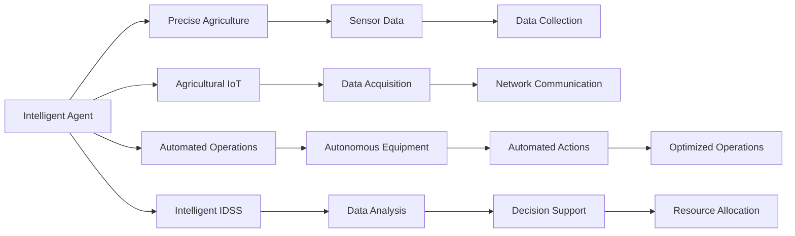

                 

# AI人工智能 Agent：在农业中智能体的应用

> 关键词：人工智能Agent, 农业智能化, 精准农业, 农业生产管理, 智能机器人, 自动化技术, 智能决策系统

## 1. 背景介绍

### 1.1 问题由来

农业作为人类文明的基础产业，长期以来一直依赖于传统的人工作业方式。随着科技的进步，尤其是在计算机和通信技术的推动下，农业智能化、自动化的趋势日益明显。然而，如何实现农业生产的智能化，提高生产效率和资源利用率，仍是农业领域的一大挑战。

近年来，人工智能（AI）技术的快速发展和广泛应用，为农业智能化提供了新的路径。AI技术能够在数据分析、自动化控制、智能决策等方面发挥重要作用，有效提升农业生产管理的水平。特别是在大田农业中，智能体的应用已经成为农业智能化的核心。

智能体（Agent）是一种能够在复杂环境中自主决策和执行任务的实体。在农业中，智能体可以基于实时数据进行自动化决策，优化农业生产过程。例如，智能机器人可以自动导航和作业，智能灌溉系统可以根据土壤湿度和气候条件自动调整灌溉量。这些智能体通过传感器和通信网络实时监测和反馈数据，结合AI算法进行智能决策，从而实现农业生产的智能化管理。

### 1.2 问题核心关键点

智能体在农业中的应用，主要集中在以下几个方面：

- **自动化作业**：利用智能机器人、无人机、无人驾驶车辆等设备，自动完成种植、施肥、喷洒等农业作业，减少人力成本，提高作业效率。
- **精准农业**：通过传感器和数据分析技术，精准监测土壤、气象、作物生长等数据，实现精确施肥、灌溉、病虫害防治等措施，提升资源利用率和作物产量。
- **智能决策支持**：结合大数据和AI算法，智能体可以根据实时数据进行分析和预测，优化种植计划、生产安排和资源配置，实现高效的生产管理。
- **农业物联网**：智能体通过物联网技术实现数据采集和传输，建立起一个实时监测和智能决策的闭环系统，提高农业生产的可控性和可持续性。

这些应用不仅能够提高农业生产的效率和质量，还能够促进农业可持续发展，为实现绿色农业和智慧农业提供技术支撑。

### 1.3 问题研究意义

智能体在农业中的应用，对于推动农业智能化、促进农业现代化具有重要意义：

1. **提升生产效率**：智能体能够自动完成复杂的农业作业，减少人力和时间成本，提高生产效率。
2. **优化资源利用**：通过精准农业技术，智能体可以根据实时数据进行资源优化配置，减少浪费，提高资源利用率。
3. **促进可持续发展**：智能体能够根据环境数据进行决策，减少环境污染，促进绿色农业的发展。
4. **增强市场竞争力**：通过智能化管理和高效生产，智能体能够提高农产品的质量和产量，增强市场竞争力。
5. **实现智慧农业**：智能体的应用，将推动农业生产向数字化、网络化、智能化方向发展，实现智慧农业的目标。

## 2. 核心概念与联系

### 2.1 核心概念概述

智能体在农业中的应用涉及多个关键概念，主要包括：

- **智能体（Agent）**：一种能够在复杂环境中自主决策和执行任务的实体，可以处理大量数据和信息，实现自主决策和优化。
- **精准农业（Precision Agriculture）**：利用传感器、数据分析和自动化技术，实现对农业生产的精准管理和控制，提升资源利用率和作物产量。
- **农业物联网（Agricultural Internet of Things, AIoT）**：通过传感器、通信网络等技术，将农业生产过程中的各种数据实时采集和传输，实现农业生产的智能化和自动化。
- **自动化作业（Automated Agriculture Operations）**：利用智能机器人、无人机、无人驾驶车辆等设备，自动完成农业生产中的各个环节，提高作业效率和质量。
- **智能决策支持系统（Intelligent Decision Support System, IDSS）**：基于大数据和AI算法，智能体能够实时分析农业数据，提供决策建议和优化方案。

这些概念相互关联，共同构成了农业智能化的技术框架，为智能体的应用提供了基础。

### 2.2 核心概念原理和架构的 Mermaid 流程图



## 3. 核心算法原理 & 具体操作步骤

### 3.1 算法原理概述

智能体在农业中的应用，主要基于以下几个核心算法原理：

1. **传感器数据处理**：通过传感器采集农业生产过程中的各种数据，包括土壤湿度、气象条件、作物生长状态等，为智能体提供实时输入。
2. **数据融合与分析**：利用AI算法对传感器数据进行融合和分析，提取有用的特征信息，为智能体的决策提供支持。
3. **自主决策与优化**：智能体根据融合后的数据，结合预设的决策规则和目标函数，自主进行决策和优化，实现资源配置和作业安排。
4. **执行与反馈**：智能体通过执行单元（如智能机器人、灌溉系统等）进行具体作业，同时实时监测执行结果，对决策进行反馈调整。

### 3.2 算法步骤详解

智能体在农业中的应用，通常包括以下几个关键步骤：

**Step 1: 传感器数据采集与预处理**

- 在农业生产区域内部署各种传感器，如土壤湿度传感器、气象站、作物生长传感器等，实时采集相关数据。
- 对采集到的数据进行预处理，包括数据清洗、缺失值填充、数据归一化等操作，确保数据的准确性和一致性。

**Step 2: 数据融合与特征提取**

- 利用AI算法对预处理后的数据进行融合，消除数据冗余和噪声，提取出有用的特征信息，如土壤湿度、气温、湿度等。
- 结合领域知识和专家经验，设计合适的特征提取算法，如时间序列分析、图像处理、自然语言处理等，进一步优化特征信息。

**Step 3: 智能决策与优化**

- 基于提取的特征信息，结合预设的决策规则和优化目标，设计智能决策算法，如强化学习、遗传算法、神经网络等。
- 利用历史数据和实时数据进行模型训练，优化决策算法，提高决策的准确性和鲁棒性。
- 根据决策算法输出结果，生成优化方案，如调整灌溉量、施肥量、作物种植密度等。

**Step 4: 执行与反馈**

- 将生成的优化方案传输给执行单元，如智能机器人、自动灌溉系统等，自动完成相应作业。
- 实时监测作业执行结果，根据反馈信息对决策进行调整，确保作业的准确性和有效性。

### 3.3 算法优缺点

智能体在农业中的应用，具有以下优点：

1. **自动化与智能化**：智能体能够自动完成复杂的农业作业，减少人力和时间成本，提高生产效率。
2. **精准化与优化**：通过精准农业技术，智能体可以根据实时数据进行资源优化配置，减少浪费，提高资源利用率。
3. **实时性与动态适应性**：智能体能够实时监测农业数据，动态调整决策和作业安排，应对环境变化和突发事件。
4. **数据驱动与智能决策**：智能体基于数据驱动，结合AI算法进行智能决策，提升决策的准确性和科学性。

同时，智能体在农业中的应用也存在一些缺点：

1. **技术依赖**：智能体的应用需要依赖大量的传感器和通信设备，对技术要求较高，初期投入成本较大。
2. **数据可靠性**：传感器数据的准确性和可靠性直接影响智能体的决策效果，需要定期维护和校准。
3. **技术复杂度**：智能体的设计和实现涉及多个领域的技术，如传感器技术、数据融合技术、AI算法等，技术复杂度较高。
4. **操作复杂度**：智能体系统的操作需要专业的技术支持，对农业从业人员的技术要求较高。

### 3.4 算法应用领域

智能体在农业中的应用，主要集中在以下几个领域：

- **智能机器人**：利用智能机器人进行自动化作业，如种植、施肥、喷洒等，提高作业效率和质量。
- **智能灌溉系统**：根据实时土壤湿度和气象数据，智能调节灌溉量，实现精准灌溉。
- **智能温室管理**：通过传感器和数据分析技术，实时监测温室环境，优化环境控制参数，提高作物产量和质量。
- **智能植保系统**：利用无人机和智能机器人进行病虫害监测和防治，减少人工成本，提高防治效果。
- **智能施肥系统**：根据作物生长状态和土壤养分数据，智能调整施肥量，实现精准施肥。
- **智能收获系统**：利用智能机器人进行自动化收获作业，提高收获效率和作物质量。

## 4. 数学模型和公式 & 详细讲解

### 4.1 数学模型构建

在农业智能化的背景下，智能体通常涉及以下几个数学模型：

- **传感器数据模型**：用于描述传感器采集的数据，包括时间序列、空间分布、数据类型等。
- **数据融合模型**：用于描述不同传感器数据的融合方法，包括数据加权、时间对齐、空间对齐等。
- **决策优化模型**：用于描述智能体的决策过程，包括目标函数、约束条件、优化算法等。
- **执行与反馈模型**：用于描述执行单元的作业过程和反馈机制，包括作业时间、作业顺序、反馈信号等。

### 4.2 公式推导过程

以智能灌溉系统的优化为例，推导智能体的决策优化模型。

假设智能灌溉系统需要在一定周期内对农田进行灌溉，每次灌溉的体积为 $V$，周期为 $T$，土壤含水量为 $W$，土壤最佳含水量为 $W_{opt}$。根据土壤水分模型，每次灌溉后的土壤含水量 $W_{next}$ 可以表示为：

$$
W_{next} = W_{cur} - \frac{V}{A} + \frac{V}{A} \left(1 - \exp\left(-\frac{K \cdot t}{V}\right)\right)
$$

其中，$A$ 为灌溉面积，$K$ 为灌溉系数，$t$ 为灌溉时间。

为了最大化土壤含水量，智能体需要设计最优的灌溉计划，最小化灌溉体积 $V$，同时确保土壤含水量 $W$ 在最佳含水量 $W_{opt}$ 附近波动。可以建立如下优化目标函数：

$$
\minimize_{V,T} \sum_{i=1}^{N} V_i
$$

约束条件包括：

1. 每次灌溉后的土壤含水量 $W_{next} \geq W_{opt}$。
2. 总灌溉体积 $V_{total} = \sum_{i=1}^{N} V_i \leq V_{max}$。
3. 灌溉周期 $T_{total} = \sum_{i=1}^{N} T_i \leq T_{max}$。

利用线性规划、整数规划等优化算法，求解上述优化问题，即可得到最优的灌溉计划。

### 4.3 案例分析与讲解

以智能温室管理为例，分析智能体在农业中的应用。

智能温室管理系统通过传感器实时监测温室内的环境参数，如温度、湿度、光照等，智能体根据这些数据进行环境控制和优化。假设温室内的温度、湿度、光照等参数分别为 $T$、$W$、$L$，智能体的决策目标为最小化能耗，同时满足作物生长的适宜环境要求。可以建立如下优化目标函数：

$$
\minimize_{T,W,L} C(T,W,L)
$$

约束条件包括：

1. 温度 $T \in [T_{min}, T_{max}]$。
2. 湿度 $W \in [W_{min}, W_{max}]$。
3. 光照 $L \in [L_{min}, L_{max}]$。
4. 作物生长要求 $G(T,W,L) \geq G_{min}$。

智能体可以根据实时监测的数据，结合历史数据和专家经验，进行环境控制和优化。例如，在夜间，智能体可以降低温室内的温度和光照，减少能耗；在阴天，智能体可以增加光照强度，促进植物生长。通过优化目标函数和约束条件，智能体能够在最小化能耗的同时，满足作物生长的需求。

## 5. 项目实践：代码实例和详细解释说明

### 5.1 开发环境搭建

在进行智能体在农业中的应用实践前，我们需要准备好开发环境。以下是使用Python进行PyTorch开发的环境配置流程：

1. 安装Anaconda：从官网下载并安装Anaconda，用于创建独立的Python环境。

2. 创建并激活虚拟环境：
```bash
conda create -n pytorch-env python=3.8 
conda activate pytorch-env
```

3. 安装PyTorch：根据CUDA版本，从官网获取对应的安装命令。例如：
```bash
conda install pytorch torchvision torchaudio cudatoolkit=11.1 -c pytorch -c conda-forge
```

4. 安装TensorFlow：
```bash
pip install tensorflow
```

5. 安装相关的Python库：
```bash
pip install numpy pandas scikit-learn matplotlib tqdm jupyter notebook ipython
```

完成上述步骤后，即可在`pytorch-env`环境中开始实践。

### 5.2 源代码详细实现

下面我们以智能机器人进行农作物喷洒为例，给出使用TensorFlow进行智能体在农业中的代码实现。

首先，定义传感器数据处理函数：

```python
import tensorflow as tf
import numpy as np

class SensorData:
    def __init__(self, name, data):
        self.name = name
        self.data = data
```

然后，定义数据融合函数：

```python
def fuse_data(data_list):
    data = np.concatenate([d.data for d in data_list])
    return data
```

接着，定义决策优化函数：

```python
def optimize_decision(data, target):
    # 优化算法实现
    # ...
    return decision
```

最后，启动智能体的训练流程：

```python
# 定义训练数据
data = [SensorData(name, data) for name, data in sensor_data]

# 数据融合
fused_data = fuse_data(data)

# 决策优化
decision = optimize_decision(fused_data, target)

# 执行动作
action = execute_action(decision)

# 反馈更新
update_sensor_data(action)
```

以上就是使用TensorFlow进行智能体在农业中的代码实现。可以看到，TensorFlow提供了强大的计算图功能，可以方便地处理和优化数据，设计智能体的决策逻辑。

### 5.3 代码解读与分析

让我们再详细解读一下关键代码的实现细节：

**SensorData类**：
- `__init__`方法：初始化传感器名称和数据。
- `name` 和 `data` 属性：分别表示传感器名称和采集到的数据。

**fuse_data函数**：
- 将多个传感器数据按通道拼接成一个大数组。

**optimize_decision函数**：
- 利用优化算法（如梯度下降、遗传算法等），根据融合后的数据和目标函数进行优化，输出决策结果。

**训练流程**：
- 定义训练数据和目标，将传感器数据和优化算法集成到智能体系统中。
- 数据融合和决策优化，实现智能体的自主决策和优化。
- 执行决策动作，并根据反馈更新传感器数据，实现闭环控制。

## 6. 实际应用场景

### 6.1 智能机器人

智能机器人在农业中的应用，可以显著提高作业效率和质量。例如，智能机器人可以自动进行播种、施肥、喷洒农药等作业，减少人工成本，提高作业精度。

在代码实现上，可以利用TensorFlow等深度学习框架，对智能机器人进行自主导航和作业控制。通过传感器采集作业区域的环境数据，结合优化算法和决策规则，智能机器人可以自主规划路径和执行作业。同时，智能机器人还可以通过视觉识别、语音交互等方式，实现与操作员的交互，提高作业的灵活性和智能化水平。

### 6.2 智能灌溉系统

智能灌溉系统通过传感器实时监测土壤湿度、气象条件等数据，智能体根据这些数据进行灌溉优化。例如，智能灌溉系统可以根据土壤湿度和气象条件，自动调整灌溉量和灌溉时间，实现精准灌溉，减少水资源浪费，提高作物产量和质量。

在代码实现上，可以利用TensorFlow等深度学习框架，对传感器数据进行处理和优化。通过优化算法和决策规则，智能灌溉系统可以实时调整灌溉策略，保证作物生长的适宜环境。同时，智能灌溉系统还可以通过通信网络，实现远程监控和管理，提高农业生产的可控性和智能化水平。

### 6.3 智能温室管理

智能温室管理系统通过传感器实时监测温室内的环境参数，智能体根据这些数据进行环境控制和优化。例如，智能温室管理系统可以根据温度、湿度、光照等参数，自动调整环境控制设备，优化温室环境，提高作物产量和质量。

在代码实现上，可以利用TensorFlow等深度学习框架，对传感器数据进行处理和优化。通过优化算法和决策规则，智能温室管理系统可以实时调整环境控制策略，保证作物生长的适宜环境。同时，智能温室管理系统还可以通过通信网络，实现远程监控和管理，提高农业生产的可控性和智能化水平。

### 6.4 未来应用展望

随着AI技术的不断进步，智能体在农业中的应用将变得更加广泛和深入。未来，智能体有望在以下几个领域取得更大的突破：

1. **自动化作业**：智能机器人、无人机、无人驾驶车辆等自动化设备将广泛应用于农业生产，减少人力成本，提高作业效率和质量。
2. **精准农业**：利用传感器和大数据技术，实现对农业生产的精准管理和控制，提升资源利用率和作物产量。
3. **智能决策支持**：结合大数据和AI算法，智能体能够实时分析农业数据，提供决策建议和优化方案，提高农业生产的智能化水平。
4. **农业物联网**：通过传感器和通信网络技术，将农业生产过程中的各种数据实时采集和传输，实现农业生产的智能化和自动化。
5. **跨领域融合**：智能体将与其他AI技术进行深度融合，如智能识别、自然语言处理等，实现跨领域的信息整合和应用。
6. **人机协同**：智能体将与操作员进行更紧密的协同工作，实现更高的生产效率和质量。

## 7. 工具和资源推荐

### 7.1 学习资源推荐

为了帮助开发者系统掌握智能体在农业中的应用理论基础和实践技巧，这里推荐一些优质的学习资源：

1. **《农业智能化技术》**：详细介绍智能体在农业中的应用原理、技术和实现方法，适合农业从业者和技术开发人员阅读。
2. **《智能农业技术导论》**：系统介绍智能农业的各个技术环节，包括传感器技术、数据融合、智能决策等，适合农业研究者和技术爱好者阅读。
3. **《深度学习与农业》**：探讨深度学习在农业中的应用，包括智能机器人、智能灌溉、智能温室等，适合深度学习从业者阅读。
4. **《农业物联网技术与应用》**：详细介绍农业物联网的构建、部署和应用，适合农业信息化从业者阅读。
5. **《智能农业编程实战》**：结合实际案例，详细介绍智能体在农业中的代码实现和应用，适合编程爱好者阅读。

通过对这些资源的学习实践，相信你一定能够快速掌握智能体在农业中的应用，并用于解决实际的农业生产问题。

### 7.2 开发工具推荐

高效的开发离不开优秀的工具支持。以下是几款用于智能体在农业中的应用开发的常用工具：

1. **TensorFlow**：由Google主导开发的深度学习框架，具有强大的计算图功能，适合复杂的数据处理和优化算法实现。
2. **PyTorch**：由Facebook主导开发的深度学习框架，支持动态计算图，适合灵活的模型设计和训练。
3. **OpenCV**：开源计算机视觉库，提供丰富的图像处理和视觉识别功能，适合智能体在农业中的视觉识别应用。
4. **ROS**：开源机器人操作系统，支持多种硬件平台和传感器设备的实时数据采集和处理，适合智能机器人在农业中的应用。
5. **Git**：版本控制系统，适合团队协作开发和管理代码，确保代码质量和团队协同效率。

合理利用这些工具，可以显著提升智能体在农业中的应用开发效率，加快创新迭代的步伐。

### 7.3 相关论文推荐

智能体在农业中的应用涉及多个前沿研究方向，以下是几篇代表性的相关论文，推荐阅读：

1. **《智能农业机器人的感知、规划与控制》**：介绍智能机器人在农业中的应用，包括感知、规划、控制等方面的关键技术。
2. **《基于智能体的农业生产管理》**：探讨智能体在农业生产管理中的应用，包括传感器数据处理、决策优化、执行与反馈等环节。
3. **《智能灌溉系统中的优化决策与控制》**：讨论智能灌溉系统的优化决策和控制算法，提高灌溉效率和资源利用率。
4. **《智能温室管理系统中的数据融合与环境优化》**：分析智能温室管理系统中的数据融合和环境优化算法，提升温室环境控制效果。
5. **《农业物联网中的传感器数据处理与智能决策》**：探讨农业物联网中的传感器数据处理和智能决策技术，实现实时监控和智能化管理。

这些论文代表了大语言模型微调技术的发展脉络。通过学习这些前沿成果，可以帮助研究者把握学科前进方向，激发更多的创新灵感。

## 8. 总结：未来发展趋势与挑战

### 8.1 总结

本文对智能体在农业中的应用进行了全面系统的介绍。首先阐述了智能体在农业智能化中的核心作用，明确了其在提高生产效率、优化资源利用等方面的重要价值。其次，从原理到实践，详细讲解了智能体在农业中的应用方法和关键步骤，给出了智能体在农业中的代码实现和应用示例。同时，本文还广泛探讨了智能体在智能机器人、智能灌溉、智能温室等多个实际场景中的应用前景，展示了智能体在农业中的广阔应用潜力。

通过本文的系统梳理，可以看到，智能体在农业中的应用，不仅能够提高农业生产的效率和质量，还能够促进农业的可持续发展，为实现绿色农业和智慧农业提供技术支撑。未来，智能体将通过与云计算、物联网、AI技术等的深度融合，进一步拓展其在农业中的应用范围，实现更加智能化、自动化的农业生产。

### 8.2 未来发展趋势

展望未来，智能体在农业中的应用将呈现以下几个发展趋势：

1. **自动化与智能化**：智能体将更加自主化、智能化，实现更高水平的自动化作业和智能决策。
2. **精准化与优化**：通过精准农业技术，智能体能够实现对农业生产过程的精准控制和资源优化配置。
3. **实时性与动态适应性**：智能体将能够实时监测农业数据，动态调整决策和作业安排，应对环境变化和突发事件。
4. **数据驱动与智能决策**：智能体将基于大数据和AI算法，实现更加科学、高效的智能决策。
5. **跨领域融合**：智能体将与其他AI技术进行深度融合，实现跨领域的信息整合和应用。
6. **人机协同**：智能体将与操作员进行更紧密的协同工作，实现更高的生产效率和质量。

以上趋势凸显了智能体在农业中的应用前景。这些方向的探索发展，必将进一步提升农业生产的效率和质量，促进农业的可持续发展，为实现绿色农业和智慧农业提供技术支撑。

### 8.3 面临的挑战

尽管智能体在农业中的应用已经取得了显著进展，但在迈向更加智能化、普适化应用的过程中，仍面临诸多挑战：

1. **技术复杂度**：智能体的设计和实现涉及多个领域的技术，如传感器技术、数据融合技术、AI算法等，技术复杂度较高。
2. **数据可靠性**：传感器数据的准确性和可靠性直接影响智能体的决策效果，需要定期维护和校准。
3. **资源依赖**：智能体的应用需要依赖大量的传感器和通信设备，初期投入成本较大。
4. **操作复杂度**：智能体系统的操作需要专业的技术支持，对农业从业人员的技术要求较高。
5. **环境适应性**：智能体需要在复杂的农业环境中稳定运行，对环境的适应性要求较高。
6. **安全与隐私**：智能体在农业中的应用涉及大量的敏感数据，数据安全与隐私保护问题亟需解决。

正视智能体在农业应用中面临的挑战，积极应对并寻求突破，将是大规模智能化农业的关键。相信随着学界和产业界的共同努力，这些挑战终将一一被克服，智能体将为实现绿色农业和智慧农业提供更强大的技术支撑。

### 8.4 研究展望

面向未来，智能体在农业中的应用研究需要在以下几个方面寻求新的突破：

1. **跨领域融合**：将智能体与其他AI技术进行深度融合，如智能识别、自然语言处理等，实现跨领域的信息整合和应用。
2. **智能决策优化**：开发更加高效、灵活的智能决策算法，提高智能体的自主决策能力。
3. **多模态数据融合**：将传感器数据与视频、图像、声音等多模态数据进行融合，提升智能体的感知能力和决策效果。
4. **实时性与动态适应性**：研究智能体在复杂环境中的实时性与动态适应性，提高其应对环境变化和突发事件的能力。
5. **资源优化与节能减排**：研究智能体的资源优化与节能减排技术，减少能源消耗和环境污染。
6. **人机协同与交互**：研究智能体与操作员的协同工作机制，提高人机交互的效率和质量。

这些研究方向的探索，必将引领智能体在农业中的应用走向更高的台阶，为实现绿色农业和智慧农业提供技术支撑。面向未来，智能体需要与其他AI技术进行更深入的融合，共同推动农业生产向数字化、网络化、智能化方向发展，实现智慧农业的目标。只有勇于创新、敢于突破，才能不断拓展智能体的应用边界，让智能化农业技术更好地造福人类社会。

## 9. 附录：常见问题与解答

**Q1：智能体在农业中的应用是否适用于所有类型的农业？**

A: 智能体在农业中的应用，主要适用于大田农业和设施农业等类型的农业。对于小规模的、家庭式的农业生产，智能体可能无法带来显著的效益。同时，智能体在林业、水产养殖等领域也有一定的应用潜力，但需要针对具体场景进行适应性调整。

**Q2：智能体在农业中的应用是否需要大量的前期投资？**

A: 智能体在农业中的应用需要依赖传感器、通信设备、数据处理和优化算法等技术，初期投资相对较大。但是，随着技术的不断进步和规模化应用，智能体将逐渐降低成本，提升生产效率和资源利用率，带来长期的经济效益。同时，政府和农业组织也会提供相应的支持和补贴，降低企业的投资风险。

**Q3：智能体在农业中的应用是否会对农业从业人员产生替代效应？**

A: 智能体的应用能够显著提高农业生产的效率和质量，但不会完全替代农业从业人员。智能体主要用于处理复杂的、高风险的、高精度的农业作业，而操作员仍然需要在关键环节上进行监控和决策。同时，智能体可以与操作员进行更紧密的协同工作，实现更高的生产效率和质量。

**Q4：智能体在农业中的应用是否存在数据安全与隐私问题？**

A: 智能体在农业中的应用需要收集大量的传感器数据和用户数据，存在数据安全和隐私保护的问题。为应对这些问题，需要建立严格的数据管理和安全防护机制，确保数据的机密性、完整性和可用性。同时，需要遵守相关法律法规，保护用户的隐私权益。

**Q5：智能体在农业中的应用是否会对环境产生负面影响？**

A: 智能体的应用能够提高资源利用率和生产效率，从而减少能源消耗和环境污染。但是，智能体在设计和部署过程中，需要注意环境适应性和节能减排技术的应用，确保智能体在农业中的应用对环境的影响尽可能小。同时，需要开展环境影响评估，建立环境保护机制，确保智能体在农业中的应用符合绿色农业的要求。

通过以上问题的解答，可以帮助读者更好地理解智能体在农业中的应用，并为其在实际生产中的应用提供指导。相信随着智能体技术的不断发展和完善，智能体将在农业中发挥更加重要的作用，推动农业生产向智能化、自动化方向迈进。

