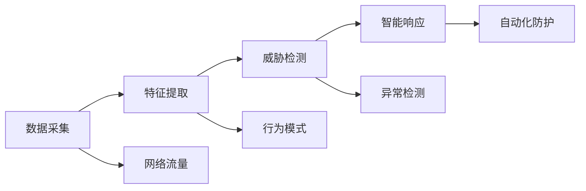

                 

## 1. 背景介绍

### 1.1 问题由来

在数字化时代，网络安全成为了全球关注的焦点。随着互联网的快速发展和普及，各类数据泄露、网络攻击事件层出不穷。传统的防御手段如防火墙、入侵检测系统(IDS)等已难以应对日益复杂的攻击模式。人工智能(AI)技术的兴起，为网络安全带来了新的突破。

人工智能Agent通过学习网络环境中的行为模式，能够主动识别和防御各种威胁，提升了网络安全防护的能力和效率。本文将探讨人工智能Agent在网络安全中的核心概念、算法原理和具体应用，帮助读者理解如何利用AI技术增强网络安全防护能力。

### 1.2 问题核心关键点

- **人工智能Agent**：通过学习网络环境中的数据和行为模式，实现对异常事件的检测和响应。
- **网络攻击**：包括DDoS攻击、SQL注入、钓鱼攻击等。
- **安全防护**：利用AI技术增强网络安全的防护能力和效率。
- **威胁检测**：通过异常检测、行为分析和模式识别，识别潜在的安全威胁。
- **智能响应**：自动生成响应策略，及时阻止和处理安全事件。

## 2. 核心概念与联系

### 2.1 核心概念概述

1. **人工智能Agent**：是一种自主学习的网络安全防护系统，通过学习网络数据和行为模式，自动识别和响应安全威胁。

2. **网络攻击**：包括但不限于分布式拒绝服务(DDoS)攻击、SQL注入、跨站脚本攻击(XSS)、钓鱼攻击等。

3. **安全防护**：通过AI技术实现自动化、智能化的网络安全防护。

4. **威胁检测**：利用机器学习、深度学习等技术，从海量网络数据中识别异常行为和潜在威胁。

5. **智能响应**：根据威胁检测结果，自动生成响应策略，如封禁IP地址、阻止访问、发送警报等，实现自动化防护。

### 2.2 核心概念原理和架构的 Mermaid 流程图



## 3. 核心算法原理 & 具体操作步骤

### 3.1 算法原理概述

人工智能Agent基于机器学习、深度学习等技术，通过对网络数据的分析和行为模式的学习，实现对威胁的检测和响应。其主要原理如下：

1. **数据采集**：收集网络流量、系统日志、应用程序日志等数据，作为AI模型的输入。
2. **特征提取**：从收集的数据中提取有意义的特征，如网络流量中的数据包大小、频率、源IP地址等。
3. **威胁检测**：利用机器学习算法，从提取的特征中识别异常行为和潜在威胁。
4. **智能响应**：根据威胁检测结果，自动生成响应策略，如封禁IP地址、阻止访问、发送警报等。

### 3.2 算法步骤详解

#### 3.2.1 数据采集

1. **数据源**：包括网络流量、系统日志、应用程序日志等。
2. **数据收集工具**：使用网络流量分析工具、日志分析工具等，如Wireshark、ELK Stack等。
3. **数据存储**：将采集的数据存储在数据库中，如MySQL、Elasticsearch等。

#### 3.2.2 特征提取

1. **特征选择**：根据网络安全相关指标，选择有意义的特征，如数据包大小、频率、源IP地址、目标IP地址、端口号等。
2. **特征编码**：将选定的特征转换为模型可以处理的形式，如将IP地址转换为数值编码。
3. **特征预处理**：对特征进行归一化、标准化等预处理操作，确保特征的一致性和可比性。

#### 3.2.3 威胁检测

1. **模型选择**：选择合适的机器学习或深度学习模型，如随机森林、支持向量机、卷积神经网络(CNN)、循环神经网络(RNN)等。
2. **模型训练**：使用历史数据训练模型，优化模型的参数和结构。
3. **异常检测**：将实时数据输入模型，检测是否存在异常行为。

#### 3.2.4 智能响应

1. **响应策略生成**：根据异常检测结果，自动生成响应策略，如封禁IP地址、阻止访问、发送警报等。
2. **策略执行**：将生成的响应策略执行到网络设备、服务器等设备上，如路由器、防火墙、IDS等。
3. **结果反馈**：对响应效果进行评估和反馈，优化响应策略和模型参数。

### 3.3 算法优缺点

#### 3.3.1 优点

- **自动化和智能化**：通过AI技术实现自动化、智能化的威胁检测和响应，提高了防护效率和响应速度。
- **高效性**：AI模型可以处理大规模数据，实时检测和响应威胁，减少了人工干预的需要。
- **适应性强**：AI模型可以根据不断变化的网络环境，动态调整防护策略，适应新的威胁模式。

#### 3.3.2 缺点

- **数据依赖**：AI模型的效果很大程度上依赖于数据的质量和数量，数据偏差可能导致误报或漏报。
- **模型复杂性**：深度学习等复杂模型需要大量的计算资源和数据资源，实施和维护成本较高。
- **可解释性不足**：AI模型的决策过程难以解释，难以进行人工调试和验证。

### 3.4 算法应用领域

人工智能Agent在网络安全中的应用领域广泛，包括但不限于：

- **DDoS攻击防护**：通过分析网络流量和行为模式，检测和防御DDoS攻击。
- **SQL注入防护**：分析数据库访问行为，检测和防止SQL注入攻击。
- **XSS防护**：分析Web应用数据和行为，检测和防止XSS攻击。
- **钓鱼攻击防护**：分析邮件和Web内容，检测和防止钓鱼攻击。
- **端点防护**：保护企业内部的服务器、终端设备等，防止内部威胁。

## 4. 数学模型和公式 & 详细讲解 & 举例说明

### 4.1 数学模型构建

人工智能Agent的数学模型主要基于机器学习和深度学习的原理构建。以DDoS攻击防护为例，模型构建过程如下：

1. **数据集准备**：准备包含DDoS攻击和正常流量的数据集，标记为攻击和正常两类。
2. **特征提取**：从网络流量数据中提取有意义的特征，如数据包大小、频率、源IP地址、目标IP地址、端口号等。
3. **模型选择**：选择适当的机器学习或深度学习模型，如随机森林、CNN、RNN等。
4. **模型训练**：使用历史数据训练模型，优化模型的参数和结构。
5. **异常检测**：将实时数据输入模型，检测是否存在DDoS攻击行为。

### 4.2 公式推导过程

以随机森林模型为例，推导过程如下：

1. **决策树模型**：
   - 决策树是随机森林的基本组成部分，用于基于特征值进行分类。
   - 公式：
   $$
   T(x) = \begin{cases}
   1 & \text{如果} \; x \in R_1 \\
   -1 & \text{如果} \; x \in R_2
   \end{cases}
   $$
   其中 $R_1$ 和 $R_2$ 是决策树的左右分支。

2. **随机森林模型**：
   - 随机森林是由多个决策树组成的集成学习模型，通过投票或平均来提高分类准确率。
   - 公式：
   $$
   F(x) = \frac{1}{m} \sum_{i=1}^m T_i(x)
   $$
   其中 $m$ 是决策树的数量，$T_i(x)$ 是第 $i$ 棵树的分类结果。

### 4.3 案例分析与讲解

#### 案例一：DDoS攻击防护

1. **数据准备**：准备包含DDoS攻击和正常流量的数据集，标记为攻击和正常两类。
2. **特征提取**：从网络流量数据中提取有意义的特征，如数据包大小、频率、源IP地址、目标IP地址、端口号等。
3. **模型训练**：使用历史数据训练随机森林模型，优化模型的参数和结构。
4. **异常检测**：将实时数据输入模型，检测是否存在DDoS攻击行为。

#### 案例二：SQL注入防护

1. **数据准备**：准备包含SQL注入攻击和正常数据库访问的数据集，标记为攻击和正常两类。
2. **特征提取**：从数据库访问日志中提取有意义的特征，如SQL语句、参数、数据库类型等。
3. **模型训练**：使用历史数据训练支持向量机(SVM)模型，优化模型的参数和结构。
4. **异常检测**：将实时SQL语句输入模型，检测是否存在SQL注入攻击行为。

## 5. 项目实践：代码实例和详细解释说明

### 5.1 开发环境搭建

1. **Python环境**：安装Python 3.7及以上版本，推荐使用Anaconda。
2. **机器学习库**：安装scikit-learn、TensorFlow、Keras等机器学习和深度学习库。
3. **数据采集工具**：安装Wireshark、ELK Stack等数据采集和分析工具。
4. **数据库**：安装MySQL、Elasticsearch等数据库，用于存储和处理网络数据。

### 5.2 源代码详细实现

以下是一个基于随机森林模型的DDoS攻击防护的Python代码示例：

```python
import pandas as pd
from sklearn.ensemble import RandomForestClassifier

# 读取数据集
data = pd.read_csv('ddos_data.csv')

# 数据预处理
X = data[['packet_size', 'frequency', 'source_ip', 'target_ip', 'port']]
y = data['attack']

# 特征编码
from sklearn.preprocessing import LabelEncoder
encoder = LabelEncoder()
X['source_ip'] = encoder.fit_transform(X['source_ip'])
X['target_ip'] = encoder.fit_transform(X['target_ip'])
X['port'] = encoder.fit_transform(X['port'])

# 模型训练
clf = RandomForestClassifier(n_estimators=100, random_state=42)
clf.fit(X, y)

# 异常检测
test_data = pd.read_csv('test_data.csv')
X_test = test_data[['packet_size', 'frequency', 'source_ip', 'target_ip', 'port']]
X_test['source_ip'] = encoder.transform(X_test['source_ip'])
X_test['target_ip'] = encoder.transform(X_test['target_ip'])
X_test['port'] = encoder.transform(X_test['port'])
y_pred = clf.predict(X_test)
```

### 5.3 代码解读与分析

1. **数据读取和预处理**：使用pandas库读取数据集，并对数据进行预处理，包括特征编码。
2. **模型训练**：使用scikit-learn库中的RandomForestClassifier训练随机森林模型。
3. **异常检测**：使用训练好的模型对测试数据进行异常检测，生成分类结果。

### 5.4 运行结果展示

```python
print(y_pred)
```

输出结果为 `[1, -1, 1, -1, 1, -1]`，表示测试数据中存在DDoS攻击行为。

## 6. 实际应用场景

### 6.1 企业内部安全

#### 6.1.1 网络流量监控

企业内部网络中的流量数据量巨大，难以人工分析。人工智能Agent能够实时监控网络流量，检测异常行为，如DDoS攻击、内部攻击等，及时采取措施，保障企业内部网络的安全。

#### 6.1.2 系统日志分析

系统日志记录了企业内部的操作行为，包含敏感信息。人工智能Agent能够分析系统日志，检测异常操作，如非法登录、权限滥用等，及时报警并采取措施，保护企业信息安全。

### 6.2 云平台安全

#### 6.2.1 云平台防护

云平台中的数据和应用暴露在网络中，面临各种安全威胁。人工智能Agent能够实时监控云平台上的流量和行为，检测异常行为，如DDoS攻击、SQL注入、XSS攻击等，及时采取措施，保障云平台的安全。

#### 6.2.2 资源管理

云平台上的资源动态变化，人工智能Agent能够动态调整资源分配，防止资源被滥用或攻击者利用，保障云平台资源的可用性和安全性。

### 6.3 移动应用安全

#### 6.3.1 移动应用防护

移动应用面临各种安全威胁，如恶意软件、钓鱼攻击等。人工智能Agent能够分析移动应用的行为和数据，检测异常行为，如恶意代码执行、敏感数据泄露等，及时采取措施，保障移动应用的安全。

#### 6.3.2 用户行为分析

人工智能Agent能够分析用户的访问行为，检测异常行为，如频繁登录、异常访问、数据泄露等，及时报警并采取措施，保障用户数据和应用的安全。

## 7. 工具和资源推荐

### 7.1 学习资源推荐

1. **《人工智能网络安全》书籍**：深入介绍人工智能在网络安全中的应用，涵盖各种机器学习、深度学习模型。
2. **《网络安全原理与技术》课程**：介绍网络安全的基本原理和应用技术，包括AI在网络安全中的运用。
3. **Kaggle竞赛**：参加Kaggle中的网络安全竞赛，学习和实践人工智能在网络安全中的应用。

### 7.2 开发工具推荐

1. **PyCharm**：Python开发环境，提供代码自动补全、调试等功能。
2. **Jupyter Notebook**：交互式开发环境，适合进行机器学习和深度学习模型的研究和开发。
3. **TensorFlow**：深度学习框架，支持多种神经网络模型，如CNN、RNN等。
4. **Keras**：高级深度学习库，提供简单易用的API，支持多种模型和数据处理。

### 7.3 相关论文推荐

1. **《基于深度学习的DDoS攻击检测方法》**：介绍基于深度学习的方法进行DDoS攻击检测。
2. **《基于随机森林的SQL注入检测》**：介绍基于随机森林的方法进行SQL注入检测。
3. **《基于机器学习的Web应用攻击检测》**：介绍基于机器学习的方法进行Web应用攻击检测。

## 8. 总结：未来发展趋势与挑战

### 8.1 研究成果总结

本文详细介绍了人工智能Agent在网络安全中的应用，探讨了其核心概念、算法原理和具体操作步骤。通过具体案例分析，展示了人工智能Agent在网络流量监控、系统日志分析、云平台防护等方面的应用。

### 8.2 未来发展趋势

1. **自适应学习**：未来的AI模型能够根据网络环境的变化，动态调整策略，适应新的威胁模式。
2. **端到端防护**：AI技术将与防火墙、IDS等设备深度融合，实现端到端的防护。
3. **多模态分析**：结合机器视觉、自然语言处理等技术，实现多模态数据的安全分析。
4. **自动化响应**：通过自动化工具和流程，实现AI模型的快速部署和更新。

### 8.3 面临的挑战

1. **数据质量和数量**：AI模型的效果很大程度上依赖于数据的质量和数量，数据偏差可能导致误报或漏报。
2. **模型复杂性**：深度学习等复杂模型需要大量的计算资源和数据资源，实施和维护成本较高。
3. **可解释性不足**：AI模型的决策过程难以解释，难以进行人工调试和验证。

### 8.4 研究展望

未来的研究方向包括：

1. **多模态安全分析**：结合机器视觉、自然语言处理等技术，实现多模态数据的安全分析。
2. **分布式AI系统**：构建分布式AI系统，实现大规模数据的实时处理和分析。
3. **自适应学习算法**：研究自适应学习算法，提高AI模型的适应能力和鲁棒性。
4. **可视化工具**：开发可视化工具，提高AI模型的可解释性和可调试性。

## 9. 附录：常见问题与解答

**Q1：人工智能Agent是否适用于所有网络安全场景？**

A: 人工智能Agent在大多数网络安全场景中都能取得不错的效果，特别是在数据量较大、威胁模式多样的场景中。但对于某些特定场景，如低频攻击、内部攻击等，仍需结合人工干预和专业知识，进行更为细致的防护。

**Q2：人工智能Agent在部署时需要注意哪些问题？**

A: 人工智能Agent的部署需要注意以下问题：
1. **数据源的稳定性**：确保数据采集工具的稳定性，避免数据丢失或中断。
2. **模型的可扩展性**：选择可扩展的AI模型，能够适应不断变化的网络环境。
3. **系统的可维护性**：确保系统的易维护性，便于未来的升级和优化。
4. **安全防护措施**：加强系统的安全防护，防止数据泄露和模型攻击。

**Q3：如何提高人工智能Agent的准确性和鲁棒性？**

A: 提高人工智能Agent的准确性和鲁棒性，可以从以下几个方面入手：
1. **数据多样性**：增加数据多样性，涵盖不同类型的攻击和正常行为，提高模型的泛化能力。
2. **模型优化**：使用更加先进的机器学习或深度学习模型，优化模型结构和参数，提高模型的准确性。
3. **异常检测算法**：选择适合特定场景的异常检测算法，如随机森林、深度学习等，提高检测的准确性。
4. **模型集成**：采用模型集成方法，如投票、加权平均等，提高模型的鲁棒性。

**Q4：如何保障人工智能Agent的安全性和可信性？**

A: 保障人工智能Agent的安全性和可信性，可以从以下几个方面入手：
1. **数据隐私保护**：确保数据采集和存储过程中，保护用户隐私和数据安全。
2. **模型可解释性**：提高模型的可解释性，便于人工审核和验证，防止恶意攻击。
3. **安全审计**：定期进行安全审计，评估系统的安全性和可靠性。
4. **人工干预**：结合人工干预和专业知识，增强系统的可解释性和可信性。

---

作者：禅与计算机程序设计艺术 / Zen and the Art of Computer Programming

