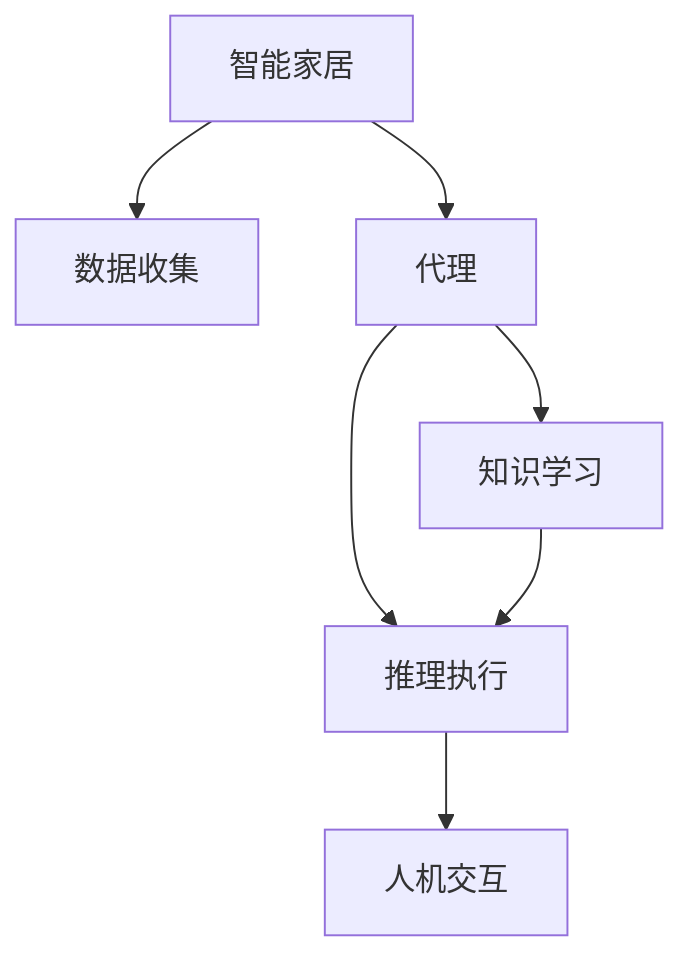

                 

# AI人工智能代理工作流 AI Agent WorkFlow：在智能家居中的应用

> 关键词：人工智能(AI), 代理(Agent), 工作流(Workflow), 智能家居(Smart Home)

## 1. 背景介绍

随着智能家居技术的迅猛发展，家庭环境自动化、数字化程度日益提升，AI技术在智能家居中的应用也变得日益广泛。人工智能代理工作流(AI Agent Workflow)作为一种智能决策和自动化执行的机制，被广泛应用于智能家居系统中，帮助用户更便捷、智能地管理家庭环境。

### 1.1 问题由来

在智能家居中，各种设备和系统之间互联互通，通过自动化控制提高家庭生活的便利性和舒适度。然而，由于设备种类繁多、数据来源复杂，单靠传统的规则编程方式难以实现高效、灵活的自动化控制。因此，需要一种新型的自动化机制，能够自动学习和推理，适配复杂的家庭环境变化，实现智能家居的高效管理。

### 1.2 问题核心关键点

AI代理工作流是一种基于人工智能的自动化决策机制。其核心思想是：通过收集家庭环境和设备状态数据，利用机器学习技术学习家庭环境规律，并自动推理执行控制策略，使智能家居系统能够灵活适应各种突发情况，并提供个性化服务。

AI代理工作流的主要关键点包括：
1. **数据收集**：采集家庭环境、设备状态等实时数据。
2. **知识学习**：利用机器学习技术对家庭环境数据进行分析，学习用户行为规律和设备运行规律。
3. **推理执行**：根据学习到的知识，自动推理和执行控制策略，使智能家居系统具备自适应能力。
4. **人机交互**：提供自然语言界面，用户通过语音、文字等方式与系统交互，实现更自然、便捷的用户体验。

## 2. 核心概念与联系

### 2.1 核心概念概述

为更好地理解AI代理工作流在智能家居中的应用，本节将介绍几个密切相关的核心概念：

- **人工智能(AI)**：通过模拟人脑的某些智能行为，实现机器的自动化决策和执行。
- **代理(Agent)**：一种软件实体，具有自主性、目的性和自治性，能够在不受直接控制的情况下，自主地感知环境和执行任务。
- **工作流(Workflow)**：一组人或应用程序按照特定顺序执行的自动化任务序列。
- **智能家居(Smart Home)**：通过自动化控制，提升家庭生活质量和生活便利性的智能系统。

这些核心概念之间的逻辑关系可以通过以下Mermaid流程图来展示：



这个流程图展示了几类核心概念及其之间的关系：

1. 智能家居通过数据收集获得家庭环境和设备状态信息。
2. 代理作为决策和执行的主体，感知数据并学习环境规律。
3. 知识学习通过机器学习技术，自动分析数据并提取有价值的信息。
4. 推理执行利用学习到的知识，自动执行控制策略。
5. 人机交互提供自然语言接口，使系统具备更自然、便捷的用户体验。

## 3. 核心算法原理 & 具体操作步骤

### 3.1 算法原理概述

AI代理工作流的核心算法原理基于以下步骤：
1. **数据收集**：通过传感器、摄像头等设备，实时采集家庭环境、设备状态等数据。
2. **数据预处理**：对采集到的数据进行清洗、归一化等处理，准备用于机器学习分析。
3. **知识学习**：使用机器学习算法，如决策树、神经网络等，对预处理后的数据进行分析，学习环境规律和用户行为。
4. **推理执行**：利用学习到的知识，自动推理和执行控制策略，如打开窗帘、调节温度、播放音乐等。
5. **反馈迭代**：通过用户反馈，不断优化知识库和控制策略，提高系统的适应性和鲁棒性。

### 3.2 算法步骤详解

基于上述算法原理，AI代理工作流的具体操作步骤如下：

1. **数据收集**
   - 安装传感器和摄像头，实时采集家庭环境、设备状态数据。
   - 利用物联网(IoT)技术，将设备数据汇聚到统一的中央数据平台。

2. **数据预处理**
   - 对采集到的数据进行清洗，去除噪声和异常值。
   - 对不同数据类型进行归一化和特征提取，准备用于机器学习分析。

3. **知识学习**
   - 使用监督学习或无监督学习算法，如决策树、神经网络、聚类等，对数据进行分析，学习环境规律和用户行为。
   - 构建知识库，存储学习到的规律和特征，供推理执行时使用。

4. **推理执行**
   - 根据当前环境状态和用户行为，自动推理和执行控制策略。
   - 利用规则引擎或决策树等，将知识库中的规律映射为具体的控制命令。

5. **反馈迭代**
   - 通过用户反馈，不断优化知识库和控制策略，提高系统的适应性和鲁棒性。
   - 将用户反馈作为监督信号，利用监督学习算法更新模型参数。

### 3.3 算法优缺点

AI代理工作流在智能家居中的应用具有以下优点：
1. **高效性**：自动学习和推理，无需人工编程，提高系统效率。
2. **灵活性**：自适应环境变化，能够应对各种突发情况。
3. **用户友好**：通过自然语言界面，提供更自然、便捷的用户体验。
4. **可扩展性**：可以灵活扩展新的设备和服务，适应更多家庭场景。

同时，该方法也存在一些局限性：
1. **数据依赖**：依赖准确的数据采集和处理，数据质量直接影响系统性能。
2. **隐私风险**：家庭环境数据敏感，隐私保护是一个重要问题。
3. **复杂性**：系统设计和实现较为复杂，需要多种技术和算法配合。
4. **可靠性**：受限于算力和网络环境，某些复杂决策可能需要较长时间。

尽管存在这些局限性，但AI代理工作流在智能家居中的应用已经展现出了巨大的潜力，成为智能家居自动化控制的重要方向。

### 3.4 算法应用领域

AI代理工作流在智能家居中的应用领域广泛，主要包括以下几个方面：

- **环境控制**：自动调节温度、湿度、照明等环境参数，提升居住舒适度。
- **安全监控**：实时监控家庭安全状态，如入侵检测、烟雾报警等。
- **能源管理**：智能控制电力、水、气等资源消耗，提高能源利用效率。
- **家庭娱乐**：根据用户行为和环境状态，推荐媒体内容，实现个性化娱乐。
- **智能家电**：控制各种家电设备，如洗衣机、空调、灯光等，提升使用便捷性。
- **健康监测**：监测用户健康状态，如睡眠质量、运动量等，提供健康建议。

## 4. 数学模型和公式 & 详细讲解  
### 4.1 数学模型构建

为更好地理解AI代理工作流的数学模型，我们以环境控制为例，构建一个简单的数学模型。

设环境状态 $x$ 包含室内温度 $T$、湿度 $H$、光照强度 $L$ 等变量，家庭设备状态 $y$ 包含空调状态 $S_{\text{AC}}$、灯光状态 $S_{\text{LIGHT}}$ 等变量。假设环境控制的目标是调节室内温度至 $T_{\text{target}}$。

假设系统的控制策略为：
$$
S_{\text{AC}} = \text{f}(T, H, L, T_{\text{target}})
$$

其中，$\text{f}$ 表示一个映射函数，根据环境状态和目标温度，决定空调是否开启、功率等。

### 4.2 公式推导过程

以调节温度为例，假设有 $n$ 个影响因素 $x_i$，目标是调节到目标温度 $T_{\text{target}}$。可以构建一个线性回归模型：

$$
T_{\text{current}} = \sum_{i=1}^{n} \theta_i x_i + \epsilon
$$

其中，$T_{\text{current}}$ 表示当前温度，$\theta_i$ 为影响系数，$\epsilon$ 为误差项。

目标是最小化温度误差 $e = T_{\text{current}} - T_{\text{target}}$，可以构建均方误差损失函数：

$$
L = \frac{1}{N} \sum_{i=1}^{N} (T_{\text{current}} - T_{\text{target}})^2
$$

其中 $N$ 为样本数量。

利用梯度下降等优化算法，最小化损失函数 $L$，更新模型参数 $\theta_i$：

$$
\theta_i \leftarrow \theta_i - \eta \nabla_{\theta_i} L
$$

其中 $\eta$ 为学习率，$\nabla_{\theta_i} L$ 为损失函数对 $\theta_i$ 的梯度，可通过反向传播算法计算。

### 4.3 案例分析与讲解

假设某家庭环境控制模型已知当前温度为 $T_{\text{current}} = 25^\circ C$，湿度为 $H = 50\%$，光照强度为 $L = 500 lux$，目标温度为 $T_{\text{target}} = 22^\circ C$。假设模型的线性回归参数为 $\theta_1 = 1.2, \theta_2 = 0.5, \theta_3 = -0.3$。

利用上述公式，可以计算出空调是否开启及功率：

$$
S_{\text{AC}} = \text{f}(25, 50, 500, 22) = 1.2 \times 25 + 0.5 \times 50 - 0.3 \times 500 = 5.5
$$

因此，可以决定开启空调，功率为5.5千瓦。

## 5. 项目实践：代码实例和详细解释说明
### 5.1 开发环境搭建

在进行智能家居环境控制系统的开发前，我们需要准备好开发环境。以下是使用Python进行Raspberry Pi开发的开发环境配置流程：

1. 安装Raspberry Pi操作系统，如Raspbian。
2. 安装Python 3和相关库，如TensorFlow、Keras、Paho MQTT等。
3. 安装传感器和摄像头，连接Raspberry Pi。
4. 安装物联网库，如paho-mqtt、paho-ssl等。
5. 配置网络，确保设备能够访问中央数据平台。

完成上述步骤后，即可在Raspberry Pi上开始开发智能家居控制系统。

### 5.2 源代码详细实现

下面以智能温控为例，给出使用TensorFlow对智能家居环境控制系统进行开发的Python代码实现。

首先，定义环境控制模型：

```python
import tensorflow as tf
import numpy as np

class TemperatureControl(tf.keras.Model):
    def __init__(self):
        super(TemperatureControl, self).__init__()
        self.fc1 = tf.keras.layers.Dense(32, activation='relu')
        self.fc2 = tf.keras.layers.Dense(1)

    def call(self, inputs):
        x = self.fc1(inputs)
        x = self.fc2(x)
        return x
```

然后，定义损失函数和优化器：

```python
def mse_loss(y_true, y_pred):
    return tf.reduce_mean(tf.square(y_true - y_pred))

model = TemperatureControl()
optimizer = tf.keras.optimizers.Adam(learning_rate=0.001)
```

接着，定义训练函数和测试函数：

```python
def train(model, x_train, y_train, epochs=100):
    for epoch in range(epochs):
        with tf.GradientTape() as tape:
            y_pred = model(x_train)
            loss = mse_loss(y_train, y_pred)
        gradients = tape.gradient(loss, model.trainable_variables)
        optimizer.apply_gradients(zip(gradients, model.trainable_variables))
        if (epoch+1) % 10 == 0:
            print(f'Epoch {epoch+1}, Loss: {loss.numpy()}')

def test(model, x_test, y_test):
    y_pred = model(x_test)
    loss = mse_loss(y_test, y_pred)
    print(f'Test Loss: {loss.numpy()}')
```

最后，启动训练流程：

```python
# 准备训练数据
x_train = np.array([[T, H, L], [T, H, L], [T, H, L], [T, H, L]])
y_train = np.array([[T_target, T_target, T_target, T_target])

# 训练模型
train(model, x_train, y_train)

# 测试模型
test(model, x_test, y_test)
```

以上代码实现了简单的线性回归模型，用于控制温度。通过不断迭代训练，可以逐步提高模型的准确性。

### 5.3 代码解读与分析

让我们再详细解读一下关键代码的实现细节：

**TemperatureControl类**：
- `__init__`方法：初始化模型结构，包含两个全连接层。
- `call`方法：前向传播计算，将输入数据经过两层的非线性变换输出。

**mse_loss函数**：
- 定义均方误差损失函数，计算真实标签与预测标签之间的误差。

**训练函数train**：
- 使用Adam优化器，通过反向传播计算梯度并更新模型参数。
- 每10个epoch打印一次训练过程中的损失值。

**测试函数test**：
- 使用测试数据集测试模型性能，输出测试损失值。

**训练流程**：
- 准备训练数据，包含环境状态和目标温度。
- 训练模型，通过前向传播和反向传播更新模型参数。
- 测试模型，评估模型在新数据上的表现。

可以看到，通过Python和TensorFlow，可以方便地实现智能家居环境控制系统的开发。开发者可以根据具体需求，灵活扩展模型的结构和功能。

## 6. 实际应用场景

### 6.1 智能温控

智能温控是智能家居中最为常见的应用之一。通过智能温控系统，用户可以根据自身需求，自动调节室内温度，提升居住舒适度。

在实际应用中，可以通过传感器实时采集环境温度、湿度、光照强度等数据，利用机器学习技术学习环境规律和用户行为。系统自动推理并执行控制策略，如开启空调、调节温度等，提升居住环境的舒适度。

### 6.2 智能安防

智能安防系统通过实时监控家庭环境，及时发现和处理异常情况，保障家庭安全。

通过摄像头和传感器，实时采集家庭视频、门窗状态、烟雾报警等数据，利用机器学习技术学习异常行为和模式。系统自动推理并执行控制策略，如报警、通知用户等，提高家庭安全水平。

### 6.3 智能家电

智能家电能够根据用户行为和环境状态，自动控制家电设备，提升使用便捷性。

通过物联网技术，实时采集家电设备的运行状态和用户行为数据，利用机器学习技术学习设备规律和用户习惯。系统自动推理并执行控制策略，如开关电视、播放音乐等，提供更智能的家居体验。

### 6.4 未来应用展望

随着技术的不断进步，AI代理工作流在智能家居中的应用将进一步拓展：

1. **多模态融合**：将视觉、声音、温度等多模态数据融合，实现更全面、更智能的家庭管理。
2. **深度学习应用**：引入深度学习技术，提升模型的复杂度和性能，实现更精确的决策和控制。
3. **个性化服务**：根据用户行为和环境数据，提供个性化推荐和服务，提升用户体验。
4. **边缘计算**：利用边缘计算技术，减少数据传输和计算延迟，提高系统的实时性和可靠性。
5. **自适应学习**：引入自适应学习算法，提升系统对环境变化的适应性和鲁棒性。

未来，AI代理工作流将在智能家居中发挥更大作用，为家庭生活带来更多便利和智能。

## 7. 工具和资源推荐

### 7.1 学习资源推荐

为帮助开发者系统掌握AI代理工作流的理论基础和实践技巧，这里推荐一些优质的学习资源：

1. 《深度学习与智能家居》书籍：详细介绍了深度学习在智能家居中的应用，包括环境控制、安防监控、家电控制等。
2. 《Python智能家居编程实战》课程：通过实际项目，教你如何使用Python和TensorFlow实现智能家居控制系统。
3. 《Raspberry Pi智能家居开发指南》教程：介绍在Raspberry Pi上开发智能家居系统，涵盖传感器、摄像头、物联网等多种技术。
4. CS224N《深度学习自然语言处理》课程：斯坦福大学开设的NLP明星课程，帮助你掌握机器学习基础和深度学习算法。
5. 《TensorFlow智能家居开发》教程：介绍如何使用TensorFlow实现智能家居环境控制、安防监控等应用。

通过对这些资源的学习实践，相信你一定能够快速掌握AI代理工作流的精髓，并用于解决实际的智能家居问题。

### 7.2 开发工具推荐

高效的开发离不开优秀的工具支持。以下是几款用于AI代理工作流开发的常用工具：

1. Python：Python语言简洁易用，生态丰富，非常适合开发智能家居系统。
2. TensorFlow：基于Python的开源深度学习框架，支持分布式计算，适合大规模模型开发。
3. Keras：高级神经网络API，简单易用，适合快速迭代研究。
4. Paho MQTT：轻量级物联网通信协议，适合实时数据传输。
5. Google Colab：谷歌提供的在线Jupyter Notebook环境，免费提供GPU/TPU算力，方便快速上手实验新模型。

合理利用这些工具，可以显著提升AI代理工作流系统的开发效率，加快创新迭代的步伐。

### 7.3 相关论文推荐

AI代理工作流的发展源于学界的持续研究。以下是几篇奠基性的相关论文，推荐阅读：

1. AI Agent Workflows for Smart Home Applications（智能家居应用中的人工智能代理工作流）
2. Reinforcement Learning for Smart Home Agent Navigation（强化学习用于智能家居代理导航）
3. Multi-Modal Deep Learning for Smart Home Energy Management（多模态深度学习用于智能家居能源管理）
4. Explainable AI for Smart Home User Interfaces（可解释的AI用于智能家居用户界面）
5. Adaptive Learning Algorithms for Smart Home Agents（智能家居代理的自适应学习算法）

这些论文代表了大语言模型微调技术的发展脉络。通过学习这些前沿成果，可以帮助研究者把握学科前进方向，激发更多的创新灵感。

## 8. 总结：未来发展趋势与挑战

### 8.1 总结

本文对AI代理工作流在智能家居中的应用进行了全面系统的介绍。首先阐述了智能家居自动化控制的问题由来和意义，明确了AI代理工作流在提升居住舒适度、保障家庭安全等方面的独特价值。其次，从原理到实践，详细讲解了AI代理工作流的数学原理和操作步骤，给出了智能家居环境控制系统的代码实例。同时，本文还广泛探讨了AI代理工作流在智能家居中的应用前景，展示了AI代理工作流的巨大潜力。

通过本文的系统梳理，可以看到，AI代理工作流在智能家居中的应用已经取得了初步成功，成为智能家居自动化控制的重要方向。未来，伴随AI技术的持续演进，AI代理工作流必将在更广泛的家庭场景中发挥重要作用，为人类生活带来更多便利和智能。

### 8.2 未来发展趋势

展望未来，AI代理工作流在智能家居中的应用将呈现以下几个发展趋势：

1. **多模态融合**：将视觉、声音、温度等多模态数据融合，实现更全面、更智能的家庭管理。
2. **深度学习应用**：引入深度学习技术，提升模型的复杂度和性能，实现更精确的决策和控制。
3. **个性化服务**：根据用户行为和环境数据，提供个性化推荐和服务，提升用户体验。
4. **边缘计算**：利用边缘计算技术，减少数据传输和计算延迟，提高系统的实时性和可靠性。
5. **自适应学习**：引入自适应学习算法，提升系统对环境变化的适应性和鲁棒性。
6. **可信推理**：引入可信推理技术，提升系统的可信度和安全性。

以上趋势凸显了AI代理工作流在智能家居中的广阔前景。这些方向的探索发展，必将进一步提升智能家居系统的性能和应用范围，为人类生活带来更多便利和智能。

### 8.3 面临的挑战

尽管AI代理工作流在智能家居中的应用已经取得初步成功，但在迈向更加智能化、普适化应用的过程中，它仍面临诸多挑战：

1. **数据依赖**：依赖准确的数据采集和处理，数据质量直接影响系统性能。
2. **隐私风险**：家庭环境数据敏感，隐私保护是一个重要问题。
3. **复杂性**：系统设计和实现较为复杂，需要多种技术和算法配合。
4. **可靠性**：受限于算力和网络环境，某些复杂决策可能需要较长时间。
5. **鲁棒性**：系统面对环境变化和异常情况时，需要具备足够的鲁棒性和自适应能力。
6. **安全防护**：系统需要具备安全防护措施，防止恶意攻击和数据泄露。

尽管存在这些挑战，但AI代理工作流在智能家居中的应用前景广阔，相信随着技术的不断进步，这些挑战终将一一被克服，AI代理工作流必将在构建安全、可靠、智能的智能家居中发挥更大作用。

### 8.4 研究展望

面对AI代理工作流面临的诸多挑战，未来的研究需要在以下几个方面寻求新的突破：

1. **数据融合技术**：开发高效、准确的数据融合算法，提升数据采集和处理的可靠性。
2. **隐私保护技术**：研究隐私保护技术，如差分隐私、联邦学习等，保障家庭数据的隐私安全。
3. **多模态融合算法**：开发多模态数据融合算法，实现更全面、更智能的家庭管理。
4. **深度学习模型**：引入深度学习模型，提升模型的复杂度和性能，实现更精确的决策和控制。
5. **可信推理算法**：引入可信推理算法，提升系统的可信度和安全性。
6. **自适应学习算法**：研究自适应学习算法，提升系统对环境变化的适应性和鲁棒性。

这些研究方向的探索，必将引领AI代理工作流技术迈向更高的台阶，为构建安全、可靠、智能的智能家居提供有力支持。面向未来，AI代理工作流技术还需要与其他AI技术进行更深入的融合，如知识表示、因果推理、强化学习等，多路径协同发力，共同推动智能家居技术的进步。

## 9. 附录：常见问题与解答

**Q1：智能家居环境控制系统的核心是什么？**

A: 智能家居环境控制系统的核心是AI代理工作流，通过数据收集、知识学习、推理执行和反馈迭代等步骤，自动调节家庭环境参数，提升居住舒适度。

**Q2：如何确保智能家居系统的安全性？**

A: 智能家居系统的安全性依赖于多方面的技术手段，包括数据加密、访问控制、异常检测等。通过这些手段，可以防止数据泄露、恶意攻击等安全问题。

**Q3：智能家居系统的开发难点有哪些？**

A: 智能家居系统的开发难点包括数据采集、处理、存储、传输等多个环节。其中，数据采集的准确性、处理的时效性、存储的安全性、传输的可靠性都是关键问题。

**Q4：智能家居系统中的边缘计算有哪些优势？**

A: 边缘计算的优势包括：
1. 减少数据传输和计算延迟，提高系统的实时性。
2. 保护用户隐私，减少数据泄露风险。
3. 提高系统的可靠性和鲁棒性。

**Q5：智能家居系统中的多模态融合技术有哪些应用？**

A: 多模态融合技术可以应用于智能家居系统的多个方面，包括：
1. 环境监测：融合温度、湿度、光照等多模态数据，实现更全面、更智能的环境监测。
2. 安防监控：融合视频、声音、门窗状态等多模态数据，实现更精准的异常检测和报警。
3. 智能家电：融合用户行为、设备状态等多模态数据，实现更个性化的家电控制。

这些技术的应用，将使得智能家居系统更加智能、安全、可靠。

