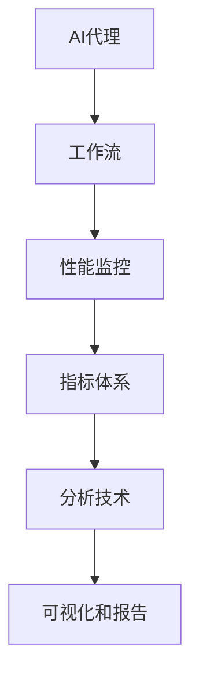

                 

# AI人工智能代理工作流AI Agent WorkFlow：AI代理性能监控指标与分析技术

> 关键词：AI代理,工作流,性能监控,指标,分析技术

## 1. 背景介绍

### 1.1 问题由来
随着人工智能(AI)技术的快速发展，AI代理（AI Agent）逐渐成为各行各业自动化、智能化改造的核心工具。AI代理通过模拟人类的决策逻辑，自动处理业务流程中的复杂任务，极大提升了效率和准确性。然而，如何确保AI代理在高效运行的同时，保持高质量、高可靠性的表现，成为了当前AI应用的一个关键挑战。

在实际应用中，AI代理的工作流程通常包括任务接收、数据处理、模型推理、结果反馈等多个环节，每个环节的性能表现都直接影响整体效果。因此，对AI代理的工作流进行性能监控和分析，是确保其稳定运行和持续优化的重要手段。

### 1.2 问题核心关键点
本节将介绍AI代理工作流性能监控的几项核心关键点：

- **性能监控**：实时监测AI代理在各个任务环节中的性能表现，包括响应时间、准确率、内存占用等指标。
- **指标体系**：构建完善的性能指标体系，涵盖从数据输入到输出结果的全流程。
- **分析技术**：利用数据挖掘、机器学习等技术，对AI代理性能数据进行深入分析，揭示潜在问题，指导优化。
- **可视化和报告**：将分析结果通过图表、报表等形式呈现，帮助用户直观理解AI代理的工作状态和性能瓶颈。

这些关键点共同构成了AI代理性能监控的核心方法论，帮助开发者、运维人员和业务方全面了解AI代理的工作状态，及时发现和解决问题，提升系统稳定性和用户体验。

## 2. 核心概念与联系

### 2.1 核心概念概述

为更好地理解AI代理性能监控，本节将介绍几个关键概念及其联系：

- **AI代理（AI Agent）**：能够自动执行特定任务或流程的智能软件系统。AI代理通过学习大量数据，形成对复杂问题的理解和解决方案。
- **工作流（Workflow）**：一系列有序的任务步骤，用于描述AI代理的具体操作流程。工作流通过定义任务间的逻辑关系，确保各个环节协同运行。
- **性能监控（Performance Monitoring）**：实时或周期性地收集和分析AI代理各环节的性能数据，如响应时间、准确率、内存占用等。
- **指标体系（Metric System）**：对AI代理性能的各个方面进行量化描述的体系，通常包含任务响应时间、准确率、并发量等指标。
- **分析技术（Analysis Technique）**：利用数据挖掘、机器学习等技术对AI代理性能数据进行深入分析，揭示潜在的瓶颈和问题。
- **可视化和报告（Visualization and Reporting）**：将性能分析结果通过图表、报表等形式呈现，帮助用户直观理解AI代理的工作状态和性能瓶颈。

这些概念之间的逻辑关系可以通过以下Mermaid流程图来展示：



这个流程图展示了几项关键概念及其之间的关系：

1. AI代理通过定义工作流执行任务。
2. 性能监控实时收集工作流各环节的性能数据。
3. 指标体系量化描述AI代理的各项性能指标。
4. 分析技术深入挖掘性能数据，揭示潜在问题。
5. 可视化和报告将分析结果呈现给用户，指导优化。

这些概念共同构成了AI代理性能监控的基础框架，帮助实现对AI代理的全面监控和持续优化。

## 3. 核心算法原理 & 具体操作步骤
### 3.1 算法原理概述

AI代理性能监控的核心算法原理基于实时数据采集和分析技术。其基本流程如下：

1. **数据采集**：使用日志、事件日志等方法实时记录AI代理在各个任务环节中的性能数据。
2. **数据存储与处理**：将采集到的数据存储在数据库或数据湖中，使用ETL（Extract, Transform, Load）技术进行清洗和预处理。
3. **指标计算**：根据设定的指标体系，计算各项性能指标。
4. **性能分析**：利用机器学习、统计分析等技术，对性能数据进行深入分析，揭示潜在的瓶颈和问题。
5. **可视化和报告**：将分析结果通过图表、报表等形式呈现，帮助用户直观理解AI代理的工作状态和性能瓶颈。

### 3.2 算法步骤详解

以下将详细介绍AI代理性能监控的算法步骤：

**Step 1: 数据采集**
- 使用日志、事件日志等方法实时记录AI代理在各个任务环节中的性能数据。
- 通过分布式日志系统（如ELK Stack）集中管理日志数据。
- 利用Flume、Kafka等工具实现数据流传输。

**Step 2: 数据存储与处理**
- 将采集到的数据存储在关系型数据库（如MySQL、PostgreSQL）或非关系型数据库（如NoSQL、Apache Cassandra）中。
- 使用ETL技术对数据进行清洗和预处理，如去除冗余数据、处理缺失值等。
- 利用大数据处理框架（如Apache Spark、Apache Flink）对数据进行并行处理和聚合。

**Step 3: 指标计算**
- 根据设定的指标体系，计算各项性能指标，如任务响应时间、错误率、内存占用等。
- 使用Python、SQL等工具编写计算脚本，自动化计算各项指标。
- 定期更新指标数据，生成统计报告，帮助识别问题点。

**Step 4: 性能分析**
- 利用机器学习算法（如回归分析、分类分析）对性能数据进行深入分析。
- 使用数据挖掘技术（如关联规则挖掘、序列模式挖掘）揭示性能瓶颈。
- 构建数学模型，预测未来性能变化趋势。

**Step 5: 可视化和报告**
- 使用数据可视化工具（如Tableau、Power BI）将分析结果可视化呈现。
- 生成各种类型的报表（如饼图、柱状图、折线图），展示关键性能指标。
- 通过报表系统（如Zabbix、Nagios）对性能监控结果进行自动化展示和告警。

### 3.3 算法优缺点

AI代理性能监控算法具有以下优点：

1. **实时性**：通过实时采集和分析数据，能够快速发现并解决问题。
2. **全面性**：指标体系覆盖从数据输入到输出结果的全流程，提供全面的性能视图。
3. **可扩展性**：能够轻松扩展到更多任务和更多维度，适应大规模AI代理应用。
4. **自动化**：使用自动化工具和脚本，减少人工干预，提高监控效率。

同时，该算法也存在一些局限性：

1. **数据采集成本高**：需要配置分布式日志系统，对基础设施要求较高。
2. **复杂度较高**：涉及数据采集、存储、处理、分析和可视化等多个环节，实现复杂。
3. **数据隐私问题**：在处理敏感数据时，需要采取数据脱敏和隐私保护措施。
4. **性能开销大**：数据采集和处理占用了大量计算资源，可能影响AI代理的性能。

尽管如此，AI代理性能监控仍是当前实现高效AI代理的关键手段，对于确保AI代理的稳定运行和持续优化具有重要意义。

### 3.4 算法应用领域

AI代理性能监控算法在多个领域中得到了广泛应用，例如：

- **智能客服系统**：监控服务响应时间、准确率等指标，确保客户满意度。
- **金融交易系统**：监控交易延迟、错误率等指标，保障交易安全。
- **医疗诊断系统**：监控诊断时间、错误率等指标，提升诊断准确性。
- **智能制造系统**：监控生产流程响应时间、故障率等指标，优化生产效率。
- **电子商务系统**：监控订单处理时间、错误率等指标，提升用户体验。

这些领域的应用表明，AI代理性能监控算法可以显著提升AI代理系统的性能和可靠性，为各行各业的数字化转型提供强有力的技术支撑。

## 4. 数学模型和公式 & 详细讲解 & 举例说明

### 4.1 数学模型构建

以下我们将使用数学语言对AI代理性能监控的各个环节进行更加严格的刻画。

假设AI代理在任务$i$中的响应时间为$t_i$，错误率为$f_i$，资源占用率为$r_i$，设定的指标体系为$M=\{t_i, f_i, r_i\}$。

定义AI代理在任务$i$中的性能指标$P_i$为：

$$
P_i = (t_i, f_i, r_i)
$$

则AI代理在任务$i$中的性能指标数据集为$P=\{P_i\}_{i=1}^N$。

### 4.2 公式推导过程

以下我们将推导几个常用的性能指标计算公式：

**任务响应时间计算**：

任务响应时间（Response Time）定义为从任务输入到输出的总时间，包括数据处理、模型推理等环节。设任务$i$的响应时间为$t_i$，则计算公式为：

$$
t_i = t_{input} + t_{processing} + t_{output}
$$

其中$t_{input}$为数据输入时间，$t_{processing}$为模型推理时间，$t_{output}$为结果输出时间。

**错误率计算**：

错误率（Error Rate）定义为任务出错次数与总任务数的比值。设任务$i$的错误次数为$e_i$，任务总数为$N$，则计算公式为：

$$
f_i = \frac{e_i}{N}
$$

**资源占用率计算**：

资源占用率（Resource Utilization Rate）定义为任务在运行过程中占用的资源与总资源之比。设任务$i$的资源占用量为$r_i$，总资源为$R$，则计算公式为：

$$
r_i = \frac{r_i}{R}
$$

### 4.3 案例分析与讲解

以智能客服系统为例，分析AI代理性能监控的实现方法：

**案例背景**：

某智能客服系统使用AI代理处理客户咨询，要求在15秒内响应客户，错误率不超过5%，资源占用率不超过70%。

**数据采集**：

使用Flume实时采集AI代理的日志数据，记录每个咨询任务的响应时间、错误次数、资源占用量等性能指标。

**数据存储与处理**：

将采集到的日志数据存储在Apache Hadoop中，使用ETL工具清洗数据，去除冗余和异常值。

**指标计算**：

使用Python编写计算脚本，自动化计算每个咨询任务的响应时间、错误率、资源占用率，生成每日、每周的统计报告。

**性能分析**：

利用回归分析模型预测未来的响应时间变化趋势，发现某些时间段响应时间异常增加，进行深入分析，发现是由于API调用延迟引起的。

**可视化和报告**：

使用Tableau将响应时间、错误率、资源占用率等指标可视化呈现，生成饼图、柱状图、折线图等图表，帮助管理者直观理解系统状态。

## 5. 项目实践：代码实例和详细解释说明

### 5.1 开发环境搭建

在进行AI代理性能监控项目实践前，我们需要准备好开发环境。以下是使用Python进行PyTorch开发的环境配置流程：

1. 安装Anaconda：从官网下载并安装Anaconda，用于创建独立的Python环境。

2. 创建并激活虚拟环境：
```bash
conda create -n pytorch-env python=3.8 
conda activate pytorch-env
```

3. 安装PyTorch：根据CUDA版本，从官网获取对应的安装命令。例如：
```bash
conda install pytorch torchvision torchaudio cudatoolkit=11.1 -c pytorch -c conda-forge
```

4. 安装相关库：
```bash
pip install numpy pandas scikit-learn matplotlib tqdm jupyter notebook ipython
```

5. 安装日志采集工具：
```bash
pip install fluentd
```

6. 安装数据存储与处理工具：
```bash
pip install kafka-python
```

完成上述步骤后，即可在`pytorch-env`环境中开始项目实践。

### 5.2 源代码详细实现

下面以智能客服系统为例，给出使用Fluentd进行日志采集、Kafka进行数据传输、Apache Hadoop进行数据存储和处理、Python进行性能指标计算和可视化的PyTorch代码实现。

首先，定义日志采集配置文件：

```python
<configuration>
    <source>
        <type>fluentd</type>
        <hosts>localhost:24224</hosts>
    </source>
    <channel>
        <type>kafka</type>
        <brokers>localhost:9092</brokers>
        <topic>log</topic>
    </channel>
    <sink>
        <type>stdout</type>
    </sink>
</configuration>
```

然后，配置Kafka生产者：

```python
from kafka import KafkaProducer

producer = KafkaProducer(bootstrap_servers='localhost:9092', value_serializer=lambda v: json.dumps(v).encode('utf-8'))
```

接着，定义数据处理和存储函数：

```python
from pykafka import KafkaConsumer

def process_logs(consumer):
    while True:
        for message in consumer:
            data = json.loads(message.value.decode('utf-8'))
            process_data(data)

def process_data(data):
    # 提取性能指标
    response_time = extract_response_time(data)
    error_rate = extract_error_rate(data)
    resource_utilization = extract_resource_utilization(data)
    
    # 计算平均值
    response_time_avg = calculate_average(response_time)
    error_rate_avg = calculate_average(error_rate)
    resource_utilization_avg = calculate_average(resource_utilization)
    
    # 保存至Hadoop
    save_to_hadoop(response_time_avg, error_rate_avg, resource_utilization_avg)
```

然后，定义指标计算函数：

```python
def extract_response_time(data):
    # 提取数据处理和推理时间
    processing_time = data['processing_time']
    output_time = data['output_time']
    
    # 计算响应时间
    response_time = processing_time + output_time
    return response_time

def extract_error_rate(data):
    # 提取错误次数
    error_count = data['error_count']
    
    # 计算错误率
    total_count = data['total_count']
    error_rate = error_count / total_count
    return error_rate

def extract_resource_utilization(data):
    # 提取资源占用量
    resource_utilization = data['resource_utilization']
    return resource_utilization

def calculate_average(values):
    # 计算平均值
    total = sum(values)
    count = len(values)
    average = total / count
    return average

def save_to_hadoop(response_time_avg, error_rate_avg, resource_utilization_avg):
    # 将平均值保存到Hadoop
    hdfs = Hadoop()
    hdfs.write('avg_response_time', response_time_avg)
    hdfs.write('avg_error_rate', error_rate_avg)
    hdfs.write('avg_resource_utilization', resource_utilization_avg)
```

最后，定义可视化函数：

```python
import matplotlib.pyplot as plt
import seaborn as sns

def visualize_performance(data):
    # 绘制响应时间分布图
    plt.figure(figsize=(10, 5))
    sns.distplot(data['response_time'], kde=False)
    plt.title('Response Time Distribution')
    plt.xlabel('Response Time')
    plt.ylabel('Frequency')
    plt.show()
```

完成上述代码后，即可通过Fluentd实时采集日志，Kafka传输数据，Apache Hadoop存储处理数据，Python进行指标计算和可视化，实现智能客服系统的AI代理性能监控。

### 5.3 代码解读与分析

让我们再详细解读一下关键代码的实现细节：

**配置文件**：
- 使用Fluentd作为日志采集工具，通过配置文件指定日志来源和Kafka通道。

**Kafka生产者**：
- 使用Kafka作为数据传输工具，配置生产者连接Kafka服务器和主题。

**数据处理函数**：
- 通过Fluentd采集到的日志数据，提取响应时间、错误率和资源占用量等性能指标。
- 计算平均值，存储至Apache Hadoop。

**指标计算函数**：
- 使用Python编写函数，提取响应时间、错误率和资源占用量，计算平均值。
- 使用Hadoop接口，将计算结果保存至Hadoop中。

**可视化函数**：
- 使用Matplotlib和Seaborn库，绘制响应时间分布图。
- 将图表展示给用户，帮助理解系统性能。

## 6. 实际应用场景

### 6.1 智能客服系统

智能客服系统是AI代理性能监控的经典应用场景。通过实时监控客服系统的响应时间、错误率和资源占用，可以帮助管理者及时发现并解决系统瓶颈，提升客户满意度。

在具体实现中，可以部署多个Kafka集群，覆盖不同业务渠道的日志数据采集。使用Apache Hadoop进行数据存储和处理，利用Fluentd和Kafka进行数据采集和传输。通过Python编写脚本，实时计算和可视化性能指标，帮助管理者优化系统。

### 6.2 金融交易系统

金融交易系统对性能要求极高，任何延迟或错误都可能导致重大损失。通过AI代理性能监控，可以实时监测交易系统的响应时间、错误率和资源占用，确保交易安全。

具体实现时，可以使用Kafka集群采集交易系统的日志数据，部署Apache Hadoop进行数据处理和存储。使用Python编写脚本，实时计算和可视化各项性能指标，及时发现和解决性能问题。

### 6.3 医疗诊断系统

医疗诊断系统对准确性和效率的要求极高。通过AI代理性能监控，可以实时监测诊断系统的响应时间和错误率，提升诊断准确性。

具体实现时，可以使用Kafka集群采集诊断系统的日志数据，部署Apache Hadoop进行数据处理和存储。使用Python编写脚本，实时计算和可视化各项性能指标，及时发现和解决性能问题。

### 6.4 未来应用展望

随着AI代理性能监控技术的不断发展，未来将在更多领域得到应用，为各行各业带来变革性影响：

- **智能制造系统**：通过实时监控生产流程的响应时间和资源占用，优化生产效率，降低成本。
- **智能交通系统**：实时监测交通信号的响应时间和故障率，提高交通效率，减少拥堵。
- **智能推荐系统**：实时监测推荐算法的响应时间和准确率，提升用户体验，增加转化率。
- **智能城市治理**：实时监测城市事件的处理时间和响应质量，提高治理效率，保障公共安全。

这些应用场景表明，AI代理性能监控技术不仅限于智能客服和金融交易，而是可以广泛应用于各种复杂系统，为数字化转型提供强有力的技术支撑。

## 7. 工具和资源推荐
### 7.1 学习资源推荐

为了帮助开发者系统掌握AI代理性能监控的理论基础和实践技巧，这里推荐一些优质的学习资源：

1. **《深度学习入门》**：北京大学出版社的入门教材，详细介绍了深度学习的基本概念和实现方法。
2. **《Kafka分布式实时数据处理》**：O'Reilly出版社的高级教程，介绍了Kafka的架构和应用场景。
3. **《Hadoop生态系统指南》**：O'Reilly出版社的入门教程，介绍了Hadoop的安装、配置和应用。
4. **《Python数据科学手册》**：O'Reilly出版社的实战指南，介绍了Python在数据科学中的应用。
5. **《机器学习实战》**：O'Reilly出版社的入门教程，介绍了机器学习的基本算法和实现方法。

通过对这些资源的学习实践，相信你一定能够快速掌握AI代理性能监控的精髓，并用于解决实际的AI应用问题。

### 7.2 开发工具推荐

高效的开发离不开优秀的工具支持。以下是几款用于AI代理性能监控开发的常用工具：

1. **Fluentd**：用于实时采集日志数据，支持多数据源和插件扩展。
2. **Kafka**：用于高吞吐量、低延迟的数据传输，支持分布式架构和流处理。
3. **Apache Hadoop**：用于大规模数据存储和处理，支持分布式计算和数据仓库。
4. **Python**：用于高性能数据分析和机器学习，支持丰富的第三方库和框架。
5. **Matplotlib**：用于绘制图表和可视化，支持多种绘图类型和格式。
6. **Seaborn**：基于Matplotlib的高级绘图库，支持更丰富的统计绘图。

合理利用这些工具，可以显著提升AI代理性能监控任务的开发效率，加快创新迭代的步伐。

### 7.3 相关论文推荐

AI代理性能监控技术的发展源于学界的持续研究。以下是几篇奠基性的相关论文，推荐阅读：

1. **《分布式系统中的性能监控与诊断》**：介绍了分布式系统中的性能监控原理和实现方法。
2. **《基于机器学习的系统性能监控与分析》**：探讨了机器学习在性能监控中的应用，包括异常检测和趋势预测。
3. **《智能客服系统中的实时性能监控与优化》**：介绍了智能客服系统的性能监控策略和优化方法。
4. **《金融交易系统中的实时性能监控与故障诊断》**：介绍了金融交易系统的性能监控策略和故障诊断方法。
5. **《医疗诊断系统中的实时性能监控与决策支持》**：介绍了医疗诊断系统的性能监控策略和决策支持方法。

这些论文代表了大规模系统性能监控技术的发展脉络。通过学习这些前沿成果，可以帮助研究者把握学科前进方向，激发更多的创新灵感。

## 8. 总结：未来发展趋势与挑战

### 8.1 总结

本文对AI代理性能监控的原理和实现方法进行了全面系统的介绍。首先阐述了AI代理性能监控的背景和意义，明确了其对于提升AI代理系统性能和可靠性的重要性。其次，从原理到实践，详细讲解了性能监控的数学模型和关键步骤，给出了AI代理性能监控项目开发的完整代码实例。同时，本文还广泛探讨了AI代理性能监控在多个行业领域的应用前景，展示了其广阔的发展潜力。

通过本文的系统梳理，可以看到，AI代理性能监控技术正在成为AI代理系统的重要组成部分，极大地提升了AI代理的稳定性和性能。未来，伴随算法的不断优化和技术的持续演进，性能监控将更加全面、高效、自动化，为AI代理系统的广泛应用提供坚实的技术支撑。

### 8.2 未来发展趋势

展望未来，AI代理性能监控技术将呈现以下几个发展趋势：

1. **实时性更强**：随着大数据技术和流计算技术的发展，性能监控将更加实时、准确，能够快速发现和解决问题。
2. **自动化程度更高**：通过引入自动化的数据采集、存储和分析工具，减少人工干预，提高监控效率。
3. **智能化水平提升**：利用机器学习和深度学习技术，提升性能分析和预测的精度和智能化水平。
4. **多维度监控**：拓展监控指标，覆盖资源、网络、存储等多个维度，提供全面的性能视图。
5. **分布式监控**：支持分布式监控架构，支持大规模系统的高并发、高吞吐量需求。
6. **数据隐私保护**：加强数据隐私保护，确保敏感数据的安全性，防止数据泄露。

以上趋势凸显了AI代理性能监控技术的未来发展方向，相信伴随算法的不断优化和技术的持续演进，性能监控将更加全面、高效、智能化，为AI代理系统的稳定运行和持续优化提供坚实的基础。

### 8.3 面临的挑战

尽管AI代理性能监控技术已经取得了显著进展，但在迈向更加智能化、普适化应用的过程中，它仍面临诸多挑战：

1. **数据采集成本高**：需要配置分布式日志系统，对基础设施要求较高。
2. **数据存储和处理复杂**：大数据处理技术和流计算技术的应用，增加了数据存储和处理的复杂度。
3. **数据隐私保护困难**：在处理敏感数据时，需要采取数据脱敏和隐私保护措施。
4. **性能开销大**：数据采集和处理占用了大量计算资源，可能影响AI代理的性能。
5. **监控结果解释性不足**：性能监控结果复杂，难以直观理解系统状态。

尽管如此，AI代理性能监控仍是当前实现高效AI代理的关键手段，对于确保AI代理的稳定运行和持续优化具有重要意义。相信伴随技术的不断优化和完善，这些挑战终将一一被克服，AI代理性能监控技术必将在构建人机协同的智能时代中扮演越来越重要的角色。

### 8.4 研究展望

面向未来，AI代理性能监控技术需要在以下几个方面进行深入研究：

1. **分布式监控架构**：研究分布式监控架构的设计和实现方法，支持大规模系统的高并发、高吞吐量需求。
2. **智能化监控算法**：探索基于机器学习和深度学习的监控算法，提升监控结果的智能化水平。
3. **数据隐私保护**：研究数据隐私保护技术，确保敏感数据的安全性。
4. **实时性能优化**：研究实时性能优化方法，提升系统响应速度和稳定性。
5. **多维度监控指标**：拓展监控指标，覆盖资源、网络、存储等多个维度，提供全面的性能视图。
6. **可视化工具改进**：研究可视化工具的改进方法，提升性能监控结果的直观性和可理解性。

这些研究方向将为AI代理性能监控技术带来新的突破，推动AI代理系统的广泛应用和深入发展。总之，AI代理性能监控技术需要在多个维度上进行优化和改进，才能真正实现高效、智能化、安全可靠的AI代理系统。

## 9. 附录：常见问题与解答

**Q1：AI代理性能监控是否适用于所有系统？**

A: AI代理性能监控在大多数系统上都能取得不错的效果，特别是对于数据量大、任务复杂的系统。但对于一些实时性要求极高的系统，如高频交易系统，需要进一步优化数据采集和处理流程，以保证监控的实时性。

**Q2：如何选择合适的性能指标？**

A: 选择合适的性能指标需要根据系统的特点和业务需求来决定。一般选择能够反映系统核心性能的指标，如响应时间、错误率、资源占用率等。同时需要结合业务场景，选择有针对性的指标进行监控。

**Q3：数据采集和处理对系统性能有影响吗？**

A: 数据采集和处理会占用一定的计算资源，对系统性能有一定的影响。需要通过优化采集和处理流程，减少对系统性能的影响。同时，也需要配置足够的计算资源，保证监控的实时性和准确性。

**Q4：如何防止数据泄露和隐私问题？**

A: 防止数据泄露和隐私问题，需要采取数据脱敏和隐私保护措施。在存储和传输数据时，可以使用数据加密技术，确保数据安全。在处理敏感数据时，需要对数据进行匿名化处理，保护用户隐私。

**Q5：如何提升监控结果的解释性？**

A: 提升监控结果的解释性，需要改进可视化工具和方法，使其更直观、易理解。可以通过图表、报表等形式，将监控结果呈现给用户，帮助用户快速理解系统状态和性能瓶颈。同时，也可以通过日志分析、性能异常检测等方法，提供更详细的解释和指导。

这些问题的解答表明，AI代理性能监控技术需要在多个维度上进行优化和改进，才能真正实现高效、智能化、安全可靠的AI代理系统。相信伴随技术的不断优化和完善，AI代理性能监控必将在构建人机协同的智能时代中扮演越来越重要的角色。

---

作者：禅与计算机程序设计艺术 / Zen and the Art of Computer Programming

