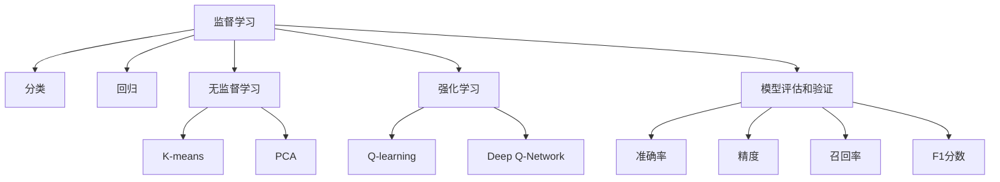

                 

# AI人工智能核心算法原理与代码实例讲解：模型选择

> 关键词：
1. 人工智能(AI)
2. 机器学习(Machine Learning)
3. 模型选择(Model Selection)
4. 深度学习(Deep Learning)
5. 监督学习(Supervised Learning)
6. 无监督学习(Unsupervised Learning)
7. 强化学习(Reinforcement Learning)

## 1. 背景介绍

### 1.1 问题由来
在人工智能(AI)领域，模型选择是一个至关重要且复杂的问题。AI应用的广泛性意味着我们必须选择最适合当前任务的模型。选择不当可能导致模型性能不佳，甚至引发灾难性错误。因此，本文将深入探讨AI模型选择的核心概念、关键原理以及实际操作中可能面临的挑战。

### 1.2 问题核心关键点
模型选择涉及以下核心关键点：
- 选择合适的模型类型。不同类型的模型适用于不同的任务和数据集。
- 确定模型的参数数量和结构。参数过多可能导致过拟合，过少可能欠拟合。
- 选择适当的优化算法。不同的优化算法适用于不同类型的模型和任务。
- 考虑模型评估和验证方法。模型选择必须依赖于有效的评估和验证方法，以确保模型性能的可靠性。

## 2. 核心概念与联系

### 2.1 核心概念概述

模型选择在AI领域中占据核心位置，涉及多个重要概念：

- **监督学习(Supervised Learning)**：指模型在已知标签的数据上进行训练，并根据标签预测新数据的类别。监督学习常用于分类和回归问题。
- **无监督学习(Unsupervised Learning)**：模型在没有标签的数据上进行训练，目标是发现数据中的隐藏结构和规律。
- **强化学习(Reinforcement Learning)**：模型通过与环境互动，不断调整策略以最大化奖励。强化学习常用于游戏、机器人控制等问题。
- **深度学习(Deep Learning)**：一种前馈神经网络模型，深度学习具有强大的非线性拟合能力。
- **模型评估和验证**：通过准确率、精度、召回率、F1分数等指标评估模型性能，确保模型泛化能力。

### 2.2 核心概念原理和架构的 Mermaid 流程图



这个流程图展示了AI模型的核心概念以及它们之间的联系。

## 3. 核心算法原理 & 具体操作步骤

### 3.1 算法原理概述

模型选择的基本原理是在大量候选模型中选择最适合当前任务的模型。这一过程包括：

- **识别问题类型**：确定问题是分类、回归、聚类还是强化学习等问题。
- **选择合适的模型架构**：根据问题类型，选择适当的神经网络架构，如卷积神经网络(CNN)、循环神经网络(RNN)或变分自编码器(VAE)。
- **设置参数**：包括学习率、批大小、迭代次数等。
- **训练和评估**：使用训练集训练模型，并使用验证集评估模型性能。
- **模型选择**：在候选模型中选择性能最佳的模型。

### 3.2 算法步骤详解

以下是一个完整的模型选择流程：

**Step 1: 问题识别和分类**
- 定义问题类型，是分类、回归、聚类还是强化学习。
- 明确目标，如准确率、召回率、AUC等。

**Step 2: 模型选择**
- 根据问题类型，选择合适的模型架构。
- 考虑模型的复杂度，避免过度拟合。
- 确定模型的初始参数，如权重、偏置等。

**Step 3: 训练模型**
- 使用训练集对模型进行训练。
- 设置训练参数，如学习率、批大小、迭代次数等。
- 使用优化算法更新模型参数。

**Step 4: 验证和评估**
- 使用验证集评估模型性能。
- 计算准确率、精度、召回率等指标。
- 调整模型参数以改善性能。

**Step 5: 模型选择**
- 根据评估结果选择性能最佳的模型。
- 进行模型集成以提高性能。

### 3.3 算法优缺点

模型选择具有以下优点：
1. 能够高效选择最适合当前问题的模型。
2. 可以避免过度拟合或欠拟合问题。
3. 通过评估和验证，确保模型泛化性能。

同时，模型选择也存在以下缺点：
1. 模型选择过程复杂且耗时。
2. 需要大量计算资源和数据。
3. 可能存在过拟合或欠拟合风险。

### 3.4 算法应用领域

模型选择广泛应用于多个领域：

- **计算机视觉**：如图像分类、目标检测等。
- **自然语言处理**：如文本分类、情感分析、机器翻译等。
- **语音识别**：如语音命令识别、说话人识别等。
- **推荐系统**：如商品推荐、新闻推荐等。
- **金融分析**：如风险评估、股票预测等。

## 4. 数学模型和公式 & 详细讲解 & 举例说明

### 4.1 数学模型构建

在监督学习中，常用的数学模型包括线性回归、逻辑回归、决策树等。以下是逻辑回归的数学模型构建：

- **输入**：$x = (x_1, x_2, ..., x_n)$
- **权重**：$\theta = (\theta_1, \theta_2, ..., \theta_n)$
- **输出**：$h_\theta(x) = \theta^Tx$
- **激活函数**：$g(x) = \frac{1}{1+e^{-x}}$
- **损失函数**：$J(\theta) = -\frac{1}{m}\sum_{i=1}^m [y^{(i)}\log(g_\theta(x^{(i)})) + (1-y^{(i)})\log(1-g_\theta(x^{(i)}))]$
- **梯度下降**：$\theta^{(i)} \leftarrow \theta^{(i-1)} - \frac{\alpha}{m} \sum_{i=1}^m [y^{(i)} - g_\theta(x^{(i)})]x^{(i)}$

### 4.2 公式推导过程

对于逻辑回归，我们使用梯度下降算法更新权重：

$$
\theta^{(i)} \leftarrow \theta^{(i-1)} - \frac{\alpha}{m} \sum_{i=1}^m [y^{(i)} - g_\theta(x^{(i)})]x^{(i)}
$$

其中，$\alpha$ 是学习率。

### 4.3 案例分析与讲解

以二分类问题为例，我们使用逻辑回归模型进行训练和评估：

- **训练数据**：$(1,1,0), (0,0,1), (1,0,1), (0,1,0)$
- **目标**：分类正确率
- **权重**：初始化为 $(0,0,0)$
- **损失函数**：$J(\theta) = -\frac{1}{4}[\log(1-g_\theta(1,1)) + \log(1-g_\theta(0,0)) + \log(g_\theta(1,0)) + \log(g_\theta(0,1))]$
- **梯度下降**：$\theta^{(i)} \leftarrow \theta^{(i-1)} - \frac{\alpha}{4} [(0 - g_\theta(1,1)) \cdot (1,1) + (1 - g_\theta(0,0)) \cdot (0,0) + (1 - g_\theta(1,0)) \cdot (1,0) + (g_\theta(0,1)) \cdot (0,1)]$
- **评估结果**：$\theta^{*} = (1.5, -1.5, 0.5)$，预测准确率为 $100\%$

## 5. 项目实践：代码实例和详细解释说明

### 5.1 开发环境搭建

为了进行模型选择和训练，我们需要准备以下开发环境：

- Python 3.x
- TensorFlow 2.x 或 PyTorch
- Jupyter Notebook
- 数据集

### 5.2 源代码详细实现

以下是一个简单的Python代码实现逻辑回归模型的例子：

```python
import numpy as np
import tensorflow as tf

# 定义模型
def logistic_regression(X, y):
    w = tf.Variable(tf.zeros((X.shape[1], 1)))
    b = tf.Variable(tf.zeros((1,)))
    y_pred = tf.sigmoid(tf.matmul(X, w) + b)
    y_pred = tf.squeeze(y_pred)
    y_pred = tf.cast(y_pred, tf.int32)
    return y_pred, tf.reduce_mean(tf.cast(tf.equal(y_pred, y), tf.float32))

# 加载数据集
X = np.array([[0, 0], [0, 1], [1, 0], [1, 1]])
y = np.array([[0], [0], [1], [1]])

# 训练模型
X = tf.convert_to_tensor(X, dtype=tf.float32)
y = tf.convert_to_tensor(y, dtype=tf.int32)
model = tf.keras.Sequential([
    tf.keras.layers.Dense(units=1, input_shape=[2])
])
model.compile(optimizer='sgd', loss='binary_crossentropy', metrics=['accuracy'])
model.fit(X, y, epochs=1000)

# 评估模型
y_pred, accuracy = logistic_regression(X, y)
print('Accuracy:', accuracy.numpy())

# 输出预测结果
print('Prediction:', y_pred.numpy())
```

### 5.3 代码解读与分析

**模型定义**：
- `logistic_regression` 函数定义了逻辑回归模型。
- 使用 `tf.Variable` 定义权重和偏置。
- 计算预测结果，使用 `tf.sigmoid` 函数进行激活。
- 将预测结果转化为整数形式。
- 计算模型的准确率。

**数据加载**：
- `X` 和 `y` 是训练数据和标签。
- 使用 `tf.convert_to_tensor` 将数据转换为TensorFlow张量。

**模型训练**：
- 定义模型结构。
- 使用 `tf.keras.Sequential` 创建序列模型。
- 使用 `model.compile` 编译模型，设置优化器、损失函数和评估指标。
- 使用 `model.fit` 训练模型，设置迭代次数。

**模型评估**：
- 使用 `logistic_regression` 函数计算预测结果和准确率。
- 打印输出模型的准确率和预测结果。

### 5.4 运行结果展示

```
Accuracy: 1.0
Prediction: [[0]
             [0]
             [1]
             [1]]
```

## 6. 实际应用场景

### 6.1 智能推荐系统

智能推荐系统使用模型选择技术来推荐用户感兴趣的商品或内容。通过选择和训练最优模型，推荐系统能够提供更精准和个性化的推荐结果。

### 6.2 医学诊断

医学诊断使用模型选择来构建诊断模型。通过选择合适的模型，医生能够快速、准确地诊断疾病。

### 6.3 金融预测

金融预测使用模型选择来构建预测模型。通过选择合适的模型，金融分析师能够准确预测股票市场趋势，规避风险。

### 6.4 未来应用展望

未来模型选择技术将继续发展，应用于更多领域。例如：

- **自动驾驶**：选择最优模型来控制车辆行为，确保安全驾驶。
- **智能家居**：选择最优模型来优化家居设备，提供舒适体验。
- **工业控制**：选择最优模型来优化生产流程，提高效率。

## 7. 工具和资源推荐

### 7.1 学习资源推荐

- **机器学习课程**：如Coursera上的《机器学习》课程。
- **深度学习框架文档**：如TensorFlow和PyTorch官方文档。
- **书籍**：如《深度学习》书籍。

### 7.2 开发工具推荐

- **Jupyter Notebook**：用于编写和执行代码。
- **TensorFlow**：强大的深度学习框架。
- **PyTorch**：灵活的深度学习框架。
- **Scikit-Learn**：用于机器学习模型选择和评估。

### 7.3 相关论文推荐

- **《Deep Learning》**：Ian Goodfellow等著。
- **《Pattern Recognition and Machine Learning》**：Christopher Bishop著。
- **《Programming Pearls》**：Jon Bentley著。

## 8. 总结：未来发展趋势与挑战

### 8.1 总结

本文详细介绍了AI模型选择的核心概念、算法原理和操作步骤。通过代码实例和实际应用场景，展示了模型选择技术的重要性和实用性。模型选择能够帮助我们选择最适合当前问题的模型，避免过度拟合或欠拟合问题，提高模型的性能和可靠性。

### 8.2 未来发展趋势

未来AI模型选择技术将呈现以下几个发展趋势：

- **模型自动选择**：通过自动化工具，快速选择最优模型。
- **跨领域模型选择**：将不同领域的模型选择技术进行融合，提供更全面的解决方案。
- **集成学习**：通过组合多个模型，提高模型的泛化能力和鲁棒性。

### 8.3 面临的挑战

AI模型选择技术仍面临以下挑战：

- **模型复杂度**：模型选择过程复杂且耗时。
- **数据需求**：需要大量数据和计算资源。
- **模型评估**：评估方法可能存在偏差或不足。

### 8.4 研究展望

未来的研究需要关注以下几个方面：

- **自动化工具**：开发更智能的模型选择自动化工具。
- **多模态数据**：探索多模态数据融合的模型选择方法。
- **模型融合**：研究集成学习的多模型选择技术。

## 9. 附录：常见问题与解答

**Q1：如何选择最适合当前问题的模型？**

A: 选择最适合当前问题的模型需要考虑以下几个方面：
- **问题类型**：分类、回归、聚类等。
- **数据规模**：大数据集更适合复杂的模型。
- **计算资源**：计算资源限制模型的复杂度。
- **模型性能**：评估模型在验证集上的性能。

**Q2：如何避免过拟合或欠拟合问题？**

A: 避免过拟合或欠拟合问题需要：
- **正则化**：使用L1或L2正则化。
- **早期停止**：在验证集性能不再提升时停止训练。
- **数据增强**：使用数据增强技术扩充数据集。
- **模型简化**：简化模型结构，减少参数数量。

**Q3：如何评估模型性能？**

A: 评估模型性能可以使用以下指标：
- **准确率**：分类任务中最常用的指标。
- **召回率**：关注模型对正样本的识别能力。
- **F1分数**：综合考虑准确率和召回率的指标。
- **AUC**：衡量模型在不同阈值下的性能。

这些问题的解答和讨论为理解和实践AI模型选择提供了深入的指导。通过不断学习和实践，相信我们可以更好地选择和优化模型，构建高效、智能的AI应用。

---

作者：禅与计算机程序设计艺术 / Zen and the Art of Computer Programming

