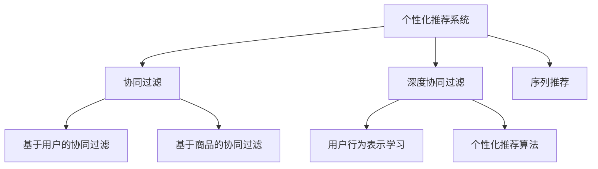

                 

# AI人工智能深度学习算法：在个性化推荐中的应用

## 1. 背景介绍

### 1.1 问题由来
在信息爆炸的时代，如何在海量数据中找到用户真正感兴趣的内容，成为各大互联网公司面临的一大挑战。传统的推荐算法依赖于统计模型，只能基于用户历史行为进行推荐，而忽视了用户的深层次心理和需求。

深度学习技术的兴起，尤其是基于神经网络的协同过滤方法，开始颠覆这一传统格局。其中，深度神经网络在个性化推荐系统中应用广泛，如深度矩阵分解、深度神经协同过滤等方法。这些方法能够学习到用户和商品之间的隐式关联，进行更为精准的推荐。

个性化推荐技术的发展不仅提升了用户的满意度，也驱动了电商、视频、社交、音乐等多个领域的商业模式创新。深度学习方法的引入，使得个性化推荐系统的精度和多样性得到大幅提升，从而实现了从商品推荐到内容推荐、从推荐效果到推荐效率的全面飞跃。

### 1.2 问题核心关键点
个性化推荐的核心在于如何高效且准确地挖掘用户行为背后的隐式语义信息，并基于这些信息生成个性化的推荐结果。

个性化推荐系统的主要挑战包括：
- 数据稀疏性：用户-商品矩阵通常稀疏，难以充分挖掘用户喜好。
- 冷启动问题：新用户和新商品缺乏足够的历史行为数据。
- 用户多样性：不同用户之间对推荐结果的偏好差异巨大，难以进行统一建模。
- 实时性要求：推荐系统需要实时更新，适应用户行为的变化。
- 可解释性需求：推荐结果需要有可解释性，提升用户的信任感。

为应对这些挑战，个性化推荐系统需要采用深度学习方法，将复杂的用户行为数据映射到低维空间，并在此基础上进行推荐。深度学习算法能够学习用户-商品之间的隐式关联，并通过模型参数优化实现推荐结果的改进。

## 2. 核心概念与联系

### 2.1 核心概念概述

为更好地理解深度学习在个性化推荐系统中的应用，本节将介绍几个密切相关的核心概念：

- **个性化推荐系统**：通过用户行为数据，预测用户可能感兴趣的潜在商品或内容，并提供相应推荐。目标是提升用户体验和平台营收。
- **协同过滤(Collaborative Filtering, CF)**：通过用户历史行为数据和商品相似度信息，预测用户可能感兴趣的商品或内容。包括基于用户的协同过滤、基于商品的协同过滤等。
- **深度协同过滤**：在协同过滤基础上，引入深度神经网络，学习用户和商品之间的隐式语义表示，实现更精准的推荐。
- **用户行为表示学习**：通过深度学习模型，将用户行为数据转换为低维向量表示，更好地捕捉用户兴趣。
- **序列推荐**：针对用户的历史行为序列，通过预测下一时刻的行为，实现个性化推荐。
- **个性化推荐算法**：结合用户特征、商品特征、用户行为等数据，设计推荐算法，生成个性化推荐结果。

这些核心概念之间的逻辑关系可以通过以下Mermaid流程图来展示：



这个流程图展示了个性化推荐系统的核心概念及其之间的关系：

1. 个性化推荐系统通过协同过滤和深度协同过滤获取用户-商品之间的关联性。
2. 用户行为表示学习将用户行为数据转换为低维向量表示，以便于模型训练。
3. 序列推荐利用用户历史行为序列进行推荐。
4. 个性化推荐算法结合多种特征进行推荐，生成个性化的推荐结果。

## 3. 核心算法原理 & 具体操作步骤

### 3.1 算法原理概述

个性化推荐系统中的深度学习算法通常采用多层神经网络结构，以捕捉用户和商品之间的隐式语义关系。其核心思想是通过学习用户行为表示和商品表示，以及两者之间的关系，实现推荐结果的优化。

具体来说，深度协同过滤算法主要分为两个部分：

1. **用户行为表示学习**：通过神经网络模型，将用户行为数据转换为低维向量表示，以捕捉用户兴趣。
2. **推荐结果生成**：利用用户和商品表示之间的相似度，预测用户可能感兴趣的商品，并按照一定的排序规则生成推荐结果。

常见的深度协同过滤算法包括深度矩阵分解(DMNN)和深度神经协同过滤(DNNCF)等。这些算法均基于多层神经网络结构，通过参数优化实现推荐结果的改进。

### 3.2 算法步骤详解

深度协同过滤算法的具体步骤包括：

1. **数据准备**：收集用户行为数据、商品信息、用户特征等数据，并进行预处理和标准化。
2. **模型训练**：使用用户行为数据和商品信息，训练神经网络模型，学习用户行为表示和商品表示。
3. **用户行为编码**：对用户行为进行编码，得到用户行为向量。
4. **商品编码**：对商品信息进行编码，得到商品向量。
5. **相似度计算**：计算用户行为向量与商品向量之间的相似度，预测用户可能感兴趣的商品。
6. **推荐结果排序**：根据相似度得分，对推荐结果进行排序，生成最终的推荐列表。

### 3.3 算法优缺点

深度协同过滤算法具有以下优点：

1. **精度高**：能够学习到用户和商品之间的隐式语义关系，实现更为精准的推荐。
2. **灵活性强**：可以处理多维特征，适应不同领域的推荐需求。
3. **可解释性好**：通过学习用户行为表示和商品表示，提供推荐的详细逻辑，增强用户信任感。

但同时，这些算法也存在一些缺点：

1. **计算复杂度高**：深度神经网络结构复杂，训练和推理的计算量较大。
2. **数据需求高**：需要大量标注数据和用户行为数据，数据获取和处理成本较高。
3. **泛化能力差**：模型容易过拟合，泛化性能较弱，对新用户和新商品的推荐效果不佳。
4. **模型复杂度高**：模型结构复杂，难以理解和调试，需要较强的技术背景。

尽管存在这些缺点，深度协同过滤算法仍是目前最先进的个性化推荐方法之一，广泛应用于电商、视频、音乐等多个领域。

### 3.4 算法应用领域

深度协同过滤算法在多个领域得到了广泛应用，具体包括：

1. **电子商务**：根据用户历史购买和浏览行为，推荐相关商品。
2. **视频平台**：根据用户历史观看记录，推荐相关视频内容。
3. **音乐应用**：根据用户历史听歌记录，推荐相关音乐作品。
4. **社交网络**：根据用户历史互动行为，推荐相关内容和好友。
5. **旅游平台**：根据用户历史出行记录，推荐相关旅游目的地。

这些应用场景展示了深度协同过滤算法在实际生活中的广泛应用，进一步验证了其有效性和实用性。

## 4. 数学模型和公式 & 详细讲解

### 4.1 数学模型构建

本节将使用数学语言对深度协同过滤算法进行更加严格的刻画。

假设用户-商品矩阵为 $M \in \mathbb{R}^{N \times K}$，其中 $N$ 为用户数，$K$ 为商品数。设用户 $i$ 对商品 $j$ 的评分（或行为）为 $m_{ij}$，用户 $i$ 的隐藏表示为 $x_i \in \mathbb{R}^d$，商品 $j$ 的隐藏表示为 $z_j \in \mathbb{R}^d$，其中 $d$ 为隐藏层的维度。

设用户行为向量与商品向量之间的相似度为 $\alpha_{ij} \in \mathbb{R}$，则推荐模型可以表示为：

$$
\alpha_{ij} = x_i^T z_j
$$

其中 $\alpha_{ij}$ 为线性相似度得分，$x_i$ 和 $z_j$ 为通过神经网络学习得到的低维向量表示。

### 4.2 公式推导过程

以下是深度协同过滤算法中常见模型的数学推导过程。

#### 4.2.1 深度矩阵分解(DMNN)

深度矩阵分解模型（DMNN）是一种基于神经网络的协同过滤方法。其主要思想是通过多层神经网络，将用户行为矩阵 $M$ 分解为用户表示矩阵 $X$ 和商品表示矩阵 $Z$，并通过相似度得分 $\alpha_{ij}$ 进行推荐。

设用户 $i$ 的隐藏表示为 $x_i$，商品 $j$ 的隐藏表示为 $z_j$，用户行为向量与商品向量之间的相似度为 $\alpha_{ij}$。则推荐模型的输出可以表示为：

$$
\hat{y}_{ij} = \sigma(\alpha_{ij} W + b)
$$

其中 $\sigma$ 为激活函数，$W$ 和 $b$ 为可训练参数。

通过反向传播算法，优化模型参数 $W$ 和 $b$，使得预测评分 $\hat{y}_{ij}$ 逼近真实评分 $m_{ij}$，从而实现推荐结果的改进。

#### 4.2.2 深度神经协同过滤(DNNCF)

深度神经协同过滤（DNNCF）模型在DMNN的基础上引入了非线性激活函数，进一步提升了模型的表达能力和推荐精度。

DNNCF模型的推荐过程可以表示为：

$$
\hat{y}_{ij} = \sigma(\alpha_{ij} W_1 + b_1)
$$

其中 $\alpha_{ij} = \sigma(x_i^T z_j W_2 + b_2)$，$W_1$ 和 $b_1$ 为输出层参数，$W_2$ 和 $b_2$ 为隐藏层参数。

通过多层神经网络结构的组合，DNNCF模型可以更好地学习用户和商品之间的隐式语义关系，提升推荐效果。

### 4.3 案例分析与讲解

以电商平台为例，假设用户 $i$ 对商品 $j$ 的评分（或购买行为）为 $m_{ij}$，电商平台希望通过深度协同过滤算法推荐相关商品。

1. **数据准备**：
   - 收集用户购买和浏览行为数据，建立用户-商品矩阵 $M$。
   - 获取用户和商品的特征数据，构建用户特征向量 $x_i$ 和商品特征向量 $z_j$。

2. **模型训练**：
   - 使用用户行为数据和商品信息，训练神经网络模型。
   - 通过反向传播算法优化模型参数，提高推荐精度。

3. **用户行为编码**：
   - 将用户行为数据转换为向量表示 $x_i$，捕捉用户兴趣。

4. **商品编码**：
   - 将商品信息转换为向量表示 $z_j$，捕捉商品特征。

5. **相似度计算**：
   - 计算用户行为向量与商品向量之间的相似度 $\alpha_{ij}$，预测用户可能感兴趣的商品。

6. **推荐结果排序**：
   - 根据相似度得分 $\alpha_{ij}$，对推荐结果进行排序，生成最终的推荐列表。

具体实现中，可以使用TensorFlow或PyTorch等深度学习框架，结合神经网络模型和优化算法，完成推荐系统的构建和优化。

## 5. 项目实践：代码实例和详细解释说明

### 5.1 开发环境搭建

在进行深度协同过滤算法实践前，我们需要准备好开发环境。以下是使用Python进行TensorFlow开发的环境配置流程：

1. 安装Anaconda：从官网下载并安装Anaconda，用于创建独立的Python环境。

2. 创建并激活虚拟环境：
```bash
conda create -n tf-env python=3.8 
conda activate tf-env
```

3. 安装TensorFlow：根据CUDA版本，从官网获取对应的安装命令。例如：
```bash
conda install tensorflow=2.7
```

4. 安装TensorFlow Addons：
```bash
conda install tensorflow-addons=0.17
```

5. 安装TensorFlow Hub：
```bash
pip install tensorflow-hub
```

6. 安装各类工具包：
```bash
pip install numpy pandas scikit-learn matplotlib tqdm jupyter notebook ipython
```

完成上述步骤后，即可在`tf-env`环境中开始深度协同过滤算法实践。

### 5.2 源代码详细实现

下面以深度矩阵分解模型（DMNN）为例，给出使用TensorFlow实现深度协同过滤算法的PyTorch代码实现。

首先，定义神经网络模型的输入和输出：

```python
import tensorflow as tf
from tensorflow.keras import layers, models

# 定义神经网络模型
class DMNNModel(tf.keras.Model):
    def __init__(self, embedding_dim, num_layers):
        super(DMNNModel, self).__init__()
        self.num_layers = num_layers
        self.embedding_dim = embedding_dim
        self.layers = []
        for i in range(num_layers):
            self.layers.append(layers.Dense(embedding_dim, activation='relu', kernel_initializer='glorot_uniform'))
        
    def call(self, inputs):
        x, z = inputs
        for layer in self.layers:
            x = layer(x)
            z = layer(z)
        return tf.reduce_sum(x * z, axis=1)

# 定义模型输入
user_embeddings = tf.keras.layers.Input(shape=(num_users, embedding_dim), name='user_embeddings')
item_embeddings = tf.keras.layers.Input(shape=(num_items, embedding_dim), name='item_embeddings')
```

然后，定义模型训练过程：

```python
# 定义损失函数
def loss_fn(y_true, y_pred):
    return tf.reduce_mean(tf.square(y_true - y_pred))

# 定义优化器
optimizer = tf.keras.optimizers.Adam(learning_rate=0.001)

# 定义训练函数
def train_epoch(model, x_train, z_train, y_train, batch_size):
    train_dataset = tf.data.Dataset.from_tensor_slices((x_train, z_train, y_train))
    train_dataset = train_dataset.shuffle(1000).batch(batch_size)
    for batch in train_dataset:
        with tf.GradientTape() as tape:
            y_pred = model(batch[0], batch[1])
            loss = loss_fn(batch[2], y_pred)
        gradients = tape.gradient(loss, model.trainable_variables)
        optimizer.apply_gradients(zip(gradients, model.trainable_variables))
```

最后，启动训练流程：

```python
epochs = 10
batch_size = 128

# 加载用户行为矩阵M
M = ...

# 加载用户特征X和商品特征Z
X = ...
Z = ...

# 初始化模型
model = DMNNModel(embedding_dim=128, num_layers=3)

# 开始训练
for epoch in range(epochs):
    train_epoch(model, X, Z, M, batch_size)
```

以上就是使用TensorFlow实现深度矩阵分解模型（DMNN）的完整代码实现。可以看到，TensorFlow提供了强大的模型构建和优化工具，使得深度协同过滤算法的实现变得简洁高效。

### 5.3 代码解读与分析

让我们再详细解读一下关键代码的实现细节：

**DMNNModel类**：
- `__init__`方法：初始化模型结构，包括隐藏层数和维度。
- `call`方法：对输入数据进行多层次的神经网络处理，最终计算用户行为向量与商品向量之间的相似度得分。

**损失函数定义**：
- `loss_fn`函数：定义均方误差损失函数，用于衡量预测评分与真实评分之间的差异。

**优化器定义**：
- `optimizer`变量：定义Adam优化器，用于更新模型参数。

**训练函数定义**：
- `train_epoch`函数：定义一个训练epoch，通过数据批处理、反向传播和梯度更新，不断优化模型参数。

**训练流程**：
- 加载用户行为矩阵M，用户特征X和商品特征Z。
- 初始化DMNN模型。
- 在每个epoch内，循环调用`train_epoch`函数进行模型训练。

在实际应用中，深度协同过滤算法还有许多变种和改进，如使用注意力机制、引入对抗训练、融合多模态数据等。这些方法在保持原有精度的基础上，进一步提升了模型的泛化能力和鲁棒性。

## 6. 实际应用场景

### 6.1 电商平台推荐

在电商平台推荐中，深度协同过滤算法可以基于用户历史购买和浏览行为，推荐相关商品。例如，用户A在浏览了商品X、Y、Z后，继续浏览了商品A、B、C。通过深度协同过滤算法，可以预测商品A、B、C与商品X、Y、Z之间的相似度，并生成推荐列表。

具体实现中，可以通过用户行为数据构建用户-商品矩阵M，并使用深度协同过滤算法训练模型。模型训练后，可以实时处理用户的浏览行为，生成个性化推荐列表。

### 6.2 视频平台推荐

在视频平台推荐中，深度协同过滤算法可以基于用户历史观看记录，推荐相关视频内容。例如，用户A观看了视频X、Y、Z后，继续观看视频A、B、C。通过深度协同过滤算法，可以预测视频A、B、C与视频X、Y、Z之间的相似度，并生成推荐列表。

具体实现中，可以通过用户观看记录构建用户-视频矩阵M，并使用深度协同过滤算法训练模型。模型训练后，可以实时处理用户的观看行为，生成个性化推荐列表。

### 6.3 音乐应用推荐

在音乐应用推荐中，深度协同过滤算法可以基于用户历史听歌记录，推荐相关音乐作品。例如，用户A听了歌曲X、Y、Z后，继续听了歌曲A、B、C。通过深度协同过滤算法，可以预测歌曲A、B、C与歌曲X、Y、Z之间的相似度，并生成推荐列表。

具体实现中，可以通过用户听歌记录构建用户-音乐矩阵M，并使用深度协同过滤算法训练模型。模型训练后，可以实时处理用户的听歌行为，生成个性化推荐列表。

### 6.4 未来应用展望

随着深度学习技术的不断发展，基于深度协同过滤的个性化推荐系统将在更多领域得到应用，为人们提供更优质的个性化服务。

在智慧城市治理中，推荐系统可以用于交通流量预测、公共服务推荐等，提升城市管理效率。

在智慧医疗中，推荐系统可以用于病患推荐、医生推荐等，提升医疗服务质量。

在智慧教育中，推荐系统可以用于学习资源推荐、教育专家推荐等，提升教育效果。

在智慧农业中，推荐系统可以用于农资推荐、技术指导等，提升农业生产效益。

## 7. 工具和资源推荐

### 7.1 学习资源推荐

为了帮助开发者系统掌握深度协同过滤算法的理论基础和实践技巧，这里推荐一些优质的学习资源：

1. 《深度学习基础》：西瓜书，由Deep Learning权威教材《Deep Learning》的作者Ian Goodfellow撰写，深入浅出地介绍了深度学习的基本概念和算法。

2. 《推荐系统实战》：由知名推荐系统专家Adob波罗撰写，详细介绍了推荐系统的理论基础和实际应用。

3. 《TensorFlow官方文档》：TensorFlow的官方文档，提供了丰富的模型构建、优化和部署样例，是学习TensorFlow的必备资源。

4. Kaggle推荐系统竞赛：Kaggle平台上有大量的推荐系统竞赛，可以通过实践积累经验，提升算法设计能力。

5. Google Scholar：Google Scholar提供了大量高质量的推荐系统论文，通过阅读前沿研究，可以获取最新的推荐算法和技术进展。

通过对这些资源的学习实践，相信你一定能够快速掌握深度协同过滤算法的精髓，并用于解决实际的推荐问题。

### 7.2 开发工具推荐

高效的开发离不开优秀的工具支持。以下是几款用于深度协同过滤算法开发的常用工具：

1. TensorFlow：由Google主导开发的深度学习框架，灵活性高，支持分布式训练和推理。

2. PyTorch：Facebook开源的深度学习框架，动态图设计，适合研究和实验。

3. Keras：高层次的深度学习框架，提供了丰富的模型构建API，适合快速原型设计。

4. Scikit-learn：基于NumPy的机器学习库，提供了多种协同过滤算法和评估指标。

5. Jupyter Notebook：基于Web的交互式编程环境，支持多种编程语言和数据可视化，适合研究和调试。

合理利用这些工具，可以显著提升深度协同过滤算法的开发效率，加快创新迭代的步伐。

### 7.3 相关论文推荐

深度协同过滤算法的发展源于学界的持续研究。以下是几篇奠基性的相关论文，推荐阅读：

1. Factorization Machines for Predictive Response to Texts in Social Media：引入了因子化机模型（FM），将文本数据转化为低维向量表示，适用于推荐系统。

2. DNNCF: A Deep Neural Network Approach for Collaborative Filtering：提出深度神经协同过滤（DNNCF）模型，引入非线性激活函数，提升推荐精度。

3. Attention-Based Deep Feature Learning for Recommender Systems：引入注意力机制，提升模型对不同特征的关注度，进一步提升推荐效果。

4. Multi-Task Learning in Collaborative Filtering：提出多任务学习（MTL）方法，在协同过滤中同时优化多个任务，提升模型泛化能力。

5. Modality-Aware Collaborative Filtering：提出多模态协同过滤方法，融合视觉、文本等多种模态数据，提升推荐效果。

这些论文代表了大深度协同过滤算法的演进过程，通过学习这些前沿成果，可以帮助研究者把握学科前进方向，激发更多的创新灵感。

## 8. 总结：未来发展趋势与挑战

### 8.1 总结

本文对深度协同过滤算法在个性化推荐系统中的应用进行了全面系统的介绍。首先阐述了深度协同过滤算法的发展背景和意义，明确了深度协同过滤算法在个性化推荐系统中的重要作用。其次，从原理到实践，详细讲解了深度协同过滤算法的数学模型和核心步骤，给出了深度协同过滤算法的完整代码实例。同时，本文还广泛探讨了深度协同过滤算法在电商、视频、音乐等多个领域的应用前景，展示了深度协同过滤算法的巨大潜力。此外，本文精选了深度协同过滤算法的各类学习资源，力求为读者提供全方位的技术指引。

通过本文的系统梳理，可以看到，深度协同过滤算法在个性化推荐系统中发挥了重要的作用，能够根据用户历史行为，精准预测用户可能感兴趣的商品或内容，实现个性化的推荐服务。未来，伴随深度协同过滤算法技术的不断演进，推荐系统的性能和应用范围将进一步提升，为人类生产生活方式带来深刻变革。

### 8.2 未来发展趋势

展望未来，深度协同过滤算法将呈现以下几个发展趋势：

1. **多模态协同过滤**：融合视觉、语音、文本等多种模态数据，提升推荐效果和用户满意度。
2. **个性化推荐算法**：结合用户特征、商品特征、行为数据等，设计更加精细化的推荐算法，提升推荐精度。
3. **自适应推荐系统**：实时获取用户行为数据，动态调整推荐策略，实现更加智能的推荐服务。
4. **跨域推荐**：在不同领域和平台之间实现推荐内容的迁移和共享，提升推荐系统的通用性和应用范围。
5. **分布式推荐系统**：通过分布式训练和推理，提升推荐系统的处理能力和扩展性。

这些趋势凸显了深度协同过滤算法的广泛应用前景，未来必将在更多领域得到深入应用，为人类生产生活方式带来更深的变革。

### 8.3 面临的挑战

尽管深度协同过滤算法在个性化推荐系统中取得了显著的成效，但在迈向更加智能化、普适化应用的过程中，它仍面临诸多挑战：

1. **数据稀疏性**：用户-商品矩阵通常稀疏，难以充分挖掘用户喜好。
2. **冷启动问题**：新用户和新商品缺乏足够的历史行为数据，推荐效果不佳。
3. **用户多样性**：不同用户之间对推荐结果的偏好差异巨大，难以进行统一建模。
4. **实时性要求**：推荐系统需要实时更新，适应用户行为的变化。
5. **可解释性需求**：推荐结果需要有可解释性，提升用户的信任感。

这些挑战需要结合多种算法和技术进行综合应对，才能实现深度协同过滤算法的全面优化。

### 8.4 研究展望

未来，深度协同过滤算法的进一步研究需要在以下几个方面寻求新的突破：

1. **多任务学习**：结合多个推荐任务，实现多任务协同优化，提升模型的泛化能力和鲁棒性。
2. **混合推荐策略**：结合传统推荐算法和深度协同过滤算法，实现优势互补，提升推荐效果。
3. **鲁棒性优化**：引入鲁棒性优化算法，提升深度协同过滤算法的鲁棒性和泛化能力，应对异常数据和恶意攻击。
4. **可解释性增强**：引入可解释性增强方法，如注意力机制、可视化技术等，提升推荐系统的可解释性和用户信任感。
5. **实时推荐系统**：结合实时数据流处理技术，实现实时推荐，提升推荐系统的实时性和用户体验。

这些研究方向的探索，必将引领深度协同过滤算法迈向更高的台阶，为构建更加智能、可靠、可解释的推荐系统提供新的技术手段。

## 9. 附录：常见问题与解答

**Q1：深度协同过滤算法如何应对数据稀疏性问题？**

A: 深度协同过滤算法可以通过多种方法应对数据稀疏性问题：

1. **矩阵分解**：将用户-商品矩阵进行分解，得到用户和商品的低维表示，从而提高模型的表达能力。
2. **低秩分解**：将矩阵分解为低秩矩阵，去除噪声和冗余，提升推荐精度。
3. **稀疏矩阵填充**：通过插值、填充等方法，对稀疏矩阵进行补全，提高数据的完整性。
4. **多模态融合**：结合用户行为数据、用户特征、商品特征等多种信息，提升推荐效果。

这些方法通过不同角度的数据处理和模型优化，能够有效应对数据稀疏性问题，提升推荐系统的精度和效果。

**Q2：如何设计深度协同过滤算法的超参数？**

A: 深度协同过滤算法的超参数设计对模型性能有重要影响，常见的超参数包括：

1. **神经网络层数**：控制神经网络结构的复杂度，通常需要结合经验进行调整。
2. **神经网络维度**：控制模型的表达能力，通常需要通过实验找到最佳值。
3. **学习率**：控制模型参数更新的速度，通常需要设置合适的学习率。
4. **正则化系数**：控制模型的复杂度和泛化能力，通常需要通过实验调整。
5. **批量大小**：控制模型训练的效率和稳定性，通常需要选择合适的批量大小。

超参数设计需要结合实际问题和数据特点，通过实验调整和优化，找到最优的超参数组合。

**Q3：如何评估深度协同过滤算法的性能？**

A: 深度协同过滤算法的性能评估通常通过以下指标进行：

1. **均方误差(MSE)**：衡量预测评分与真实评分之间的差异。
2. **平均绝对误差(MAE)**：衡量预测评分与真实评分之间的绝对值差异。
3. **准确率**：衡量预测结果的正确率。
4. **召回率**：衡量预测结果的覆盖率。
5. **F1分数**：综合准确率和召回率的综合指标。
6. **点击率**：衡量推荐系统在实际应用中的效果。

这些指标可以结合实际问题和业务需求进行综合评估，选择最适合的指标进行模型优化和改进。

**Q4：深度协同过滤算法如何避免冷启动问题？**

A: 深度协同过滤算法可以通过以下方法避免冷启动问题：

1. **新用户推荐**：利用其他用户的相似行为，为新用户推荐相关商品。
2. **物品嵌入**：将物品嵌入到低维空间，捕捉物品之间的关联性。
3. **基线推荐**：根据商品特征或热门商品，为新用户推荐相关商品。
4. **多臂老虎机**：结合多个推荐策略，为新用户推荐相关商品。

这些方法通过多种策略的结合，能够有效解决冷启动问题，提升推荐系统的覆盖率和效果。

**Q5：深度协同过滤算法如何处理用户多样性问题？**

A: 深度协同过滤算法可以通过以下方法处理用户多样性问题：

1. **个性化推荐算法**：结合用户特征、商品特征、行为数据等，设计更加精细化的推荐算法，提升推荐精度。
2. **多任务学习**：结合多个推荐任务，实现多任务协同优化，提升模型的泛化能力和鲁棒性。
3. **混合推荐策略**：结合传统推荐算法和深度协同过滤算法，实现优势互补，提升推荐效果。
4. **用户画像建模**：建立用户画像模型，捕捉用户的深层次兴趣和需求，提升推荐效果。

这些方法通过不同角度的模型设计和算法优化，能够有效处理用户多样性问题，提升推荐系统的性能和效果。

总之，深度协同过滤算法在个性化推荐系统中发挥了重要的作用，能够根据用户历史行为，精准预测用户可能感兴趣的商品或内容，实现个性化的推荐服务。未来，伴随深度协同过滤算法技术的不断演进，推荐系统的性能和应用范围将进一步提升，为人类生产生活方式带来深刻的变革。

作者：禅与计算机程序设计艺术 / Zen and the Art of Computer Programming

