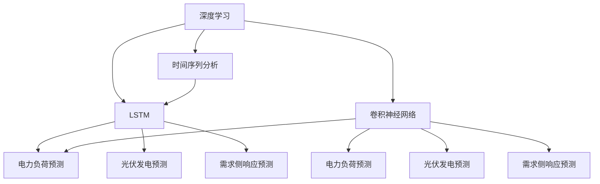

                 

# AI人工智能深度学习算法：在电力预测中的应用

> 关键词：深度学习，电力预测，时间序列分析，长短期记忆网络，卷积神经网络，Python

## 1. 背景介绍

### 1.1 问题由来
随着全球经济的持续增长和工业化水平的提高，电力系统负荷日益攀升，电网运营的复杂性和不确定性也随之增加。如何在满足用户用电需求的同时，保持电力系统的稳定性和经济性，成为各国电力公司的重要课题。传统的电力预测方法依赖人工经验，数据覆盖率低，难以应对实时变化和意外冲击。而随着人工智能技术的迅猛发展，利用深度学习算法进行电力预测，逐步成为新趋势。

深度学习技术具有强大的数据建模能力，可以有效利用电力系统海量数据，从中找到隐藏的模式和规律。电力预测作为深度学习应用的典型场景，不仅涉及电力系统自身的复杂特性，还需要考虑多种外部因素的影响。因此，针对电力预测的深度学习模型设计和算法优化，成为提升电力系统运营效率和用户服务质量的关键。

### 1.2 问题核心关键点
电力预测涉及多时间尺度、多类型数据的综合分析，具有数据量大、特征复杂、预测目标明确的特点。一个理想的电力预测模型需要满足以下核心要求：

- **数据量庞大**：电力系统产生的海量数据是深度学习建模的基础。
- **时间依赖性**：电力负荷的生成和消耗具有明显的时间依赖性，需考虑季节、周/日/小时时间粒度的影响。
- **多源特征融合**：电力预测不仅需考虑气象、用电需求等基本特征，还需综合考虑社会经济、政策调控等外部因素。
- **多任务预测**：除了传统的负荷预测外，还包括光伏发电、需求侧响应等预测任务，目标多样化。
- **高效性**：预测过程需快速响应，实时更新模型预测结果，满足动态需求。

本节将详细探讨如何利用深度学习技术，对电力预测中的各类问题进行建模，并介绍其中的核心算法和实现细节。

## 2. 核心概念与联系

### 2.1 核心概念概述

为更好地理解深度学习在电力预测中的应用，本节将介绍几个密切相关的核心概念：

- **深度学习**：一种利用多层神经网络进行复杂模式识别和预测的机器学习方法，广泛应用于图像、语音、自然语言处理等领域。
- **时间序列分析**：研究时间序列数据的建模和预测问题，常用于金融、气象、交通等领域。
- **长短期记忆网络(LSTM)**：一种特殊的循环神经网络，能够有效处理时间序列数据的依赖性，广泛用于序列预测任务。
- **卷积神经网络(CNN)**：利用卷积操作提取局部特征，适用于图像和空间数据的处理，具有平移不变性。
- **Python**：开源、跨平台的编程语言，广泛应用于科学计算、数据分析和机器学习领域。

这些核心概念之间的逻辑关系可以通过以下Mermaid流程图来展示：



这个流程图展示了一些核心概念及其之间的关系：

1. 深度学习是时间序列分析和LSTM、CNN等模型的基础。
2. LSTM适用于处理时间序列数据的依赖性，而CNN适用于处理空间数据的局部特征。
3. 通过LSTM、CNN模型，可以分别对电力负荷、光伏发电和需求侧响应等电力预测任务进行建模。

## 3. 核心算法原理 & 具体操作步骤

### 3.1 算法原理概述

电力预测涉及对电力系统时间序列数据的建模和预测，可采用多种深度学习模型进行建模。以下以LSTM模型为例，介绍深度学习在电力预测中的应用原理。

LSTM模型是一种特殊的循环神经网络(RNN)，通过门控机制对时间序列数据进行有效建模，能够处理输入序列中的长距离依赖。其核心思想是通过三个门控单元—输入门、遗忘门和输出门—控制信息的流动，从而实现对长期依赖的记忆和处理。

LSTM模型的核心结构如下：


其中，
- **输入门(IT)**：根据当前输入和新状态计算新记忆单元的值；
- **遗忘门(FT)**：根据当前输入和新状态计算新的遗忘值；
- **输出门(OT)**：根据当前输入和新状态计算当前状态的值；
- **记忆单元(Ct)**：存储了从上一个时间步到当前时间步的所有信息；
- **隐藏状态(Ht)**：根据记忆单元的值计算输出值。

LSTM模型的训练过程通常使用反向传播算法，通过最小化预测值和真实值之间的误差来优化模型参数，使其预测结果与实际值尽可能接近。

### 3.2 算法步骤详解

以下是使用LSTM模型进行电力预测的详细步骤：

**Step 1: 数据预处理**

1. 收集电力系统的历史数据，包括负荷、温度、湿度、光伏发电容量、天气等。
2. 将时间序列数据进行标准化处理，确保不同特征在相同尺度上。
3. 将数据集分为训练集、验证集和测试集，划分为固定长度的批次。

**Step 2: 构建LSTM模型**

1. 使用Keras等深度学习框架搭建LSTM网络，设置输入层、LSTM层和输出层。
2. 根据预测任务选择合适的LSTM层数和隐藏单元数。
3. 设置损失函数和优化器，如均方误差损失、Adam优化器。

**Step 3: 模型训练**

1. 在训练集上进行模型训练，迭代更新模型参数。
2. 在验证集上评估模型性能，调整模型超参数。
3. 使用测试集进行最终性能测试，评估模型预测精度。

**Step 4: 模型预测**

1. 对新的时间序列数据进行预处理，输入模型进行预测。
2. 计算预测结果和真实值之间的误差，进行精度评估。

### 3.3 算法优缺点

LSTM模型在电力预测中具有以下优点：

- **时间依赖性处理**：LSTM模型能够有效捕捉时间序列数据中的长期依赖，适用于预测任务中时间间隔较长的情况。
- **复杂模式建模**：通过门控机制，LSTM模型能够处理复杂的模式和关系，适用于电力系统中各种复杂场景的建模。
- **高精度预测**：LSTM模型通常能够提供高精度的预测结果，满足电力系统对实时预测的需求。

但LSTM模型也存在一些局限性：

- **参数量较大**：LSTM模型通常需要较大的模型参数，训练和推理开销较大。
- **计算复杂度高**：LSTM模型在处理大规模数据集时，计算复杂度较高，对计算资源要求较高。
- **难以解释**：LSTM模型作为一个"黑盒"模型，难以解释其内部工作机制，对于高风险应用存在一定隐患。

### 3.4 算法应用领域

LSTM模型在电力预测领域具有广泛的应用场景，例如：

- **电力负荷预测**：通过历史负荷数据和天气、节假日等外部因素，预测未来负荷变化。
- **光伏发电预测**：利用天气和天气预报信息，预测光伏发电容量和波动。
- **需求侧响应预测**：基于用电需求和市场价格，预测用户的参与情况和需求响应效果。
- **电网故障预测**：通过分析设备运行状态和历史故障记录，预测未来可能发生的故障情况。

除了上述这些典型应用外，LSTM模型还可应用于故障诊断、电网稳定性分析等电力系统相关领域，为电力系统的稳定运行提供技术支持。

## 4. 数学模型和公式 & 详细讲解  
### 4.1 数学模型构建

以下是对LSTM模型在电力预测中的应用进行数学建模的详细过程。

假设历史时间序列数据为 $X = [x_1, x_2, ..., x_t]$，其中 $x_t$ 表示在时间步 $t$ 的输入值。目标是对未来时间步 $t+1$ 的输出值 $y_{t+1}$ 进行预测。

LSTM模型的数学表示如下：

$$
\begin{aligned}
i_t &= \sigma(W_i [x_t;h_{t-1}]+b_i) \\
f_t &= \sigma(W_f [x_t;h_{t-1}]+b_f) \\
o_t &= \sigma(W_o [x_t;h_{t-1}]+b_o) \\
g_t &= \tanh(W_g [x_t;h_{t-1}]+b_g) \\
c_t &= f_t \otimes c_{t-1} + i_t \otimes g_t \\
h_t &= o_t \otimes \tanh(c_t)
\end{aligned}
$$

其中，$i_t, f_t, o_t$ 分别表示输入门、遗忘门和输出门的激活值，$g_t$ 表示候选记忆单元的值，$c_t$ 表示当前记忆单元的值，$h_t$ 表示当前隐藏状态。

最终的预测值 $y_t$ 为：

$$
y_t = h_t \cdot W_y + b_y
$$

其中，$W_y$ 和 $b_y$ 为线性层的权重和偏置。

### 4.2 公式推导过程

在LSTM模型中，三个门控单元的计算公式分别为：

$$
i_t = \sigma(W_i [x_t;h_{t-1}]+b_i) = \frac{1}{1+e^{-W_i [x_t;h_{t-1}]- b_i}}
$$

$$
f_t = \sigma(W_f [x_t;h_{t-1}]+b_f) = \frac{1}{1+e^{-W_f [x_t;h_{t-1}]- b_f}}
$$

$$
o_t = \sigma(W_o [x_t;h_{t-1}]+b_o) = \frac{1}{1+e^{-W_o [x_t;h_{t-1}]- b_o}}
$$

其中，$\sigma$ 为sigmoid函数，$W_i, W_f, W_o$ 为门控单元的权重，$b_i, b_f, b_o$ 为偏置。

候选记忆单元 $g_t$ 的计算公式为：

$$
g_t = \tanh(W_g [x_t;h_{t-1}]+b_g) = \tanh(W_g [x_t;h_{t-1}]+b_g)
$$

其中，$\tanh$ 为双曲正切函数，$W_g$ 和 $b_g$ 为候选记忆单元的权重和偏置。

当前记忆单元 $c_t$ 的计算公式为：

$$
c_t = f_t \otimes c_{t-1} + i_t \otimes g_t
$$

其中，$\otimes$ 表示逐元素乘法。

当前隐藏状态 $h_t$ 的计算公式为：

$$
h_t = o_t \otimes \tanh(c_t)
$$

其中，$\tanh$ 为双曲正切函数，$W_y$ 和 $b_y$ 为线性层的权重和偏置。

### 4.3 案例分析与讲解

以下以电力负荷预测为例，给出LSTM模型在实际应用中的案例分析。

假设我们有如下历史负荷数据：

| 时间 | 负荷 |
| --- | --- |
| 2020-01-01 | 1000 MW |
| 2020-01-02 | 1100 MW |
| ... | ... |
| 2021-01-01 | 1200 MW |

我们将这些数据输入LSTM模型进行训练和预测。首先，需要将数据转换为固定长度的批次，例如每次输入100个时间步的数据。然后，对数据进行标准化处理，使其符合LSTM模型的要求。接着，搭建LSTM网络，设置输入层、LSTM层和输出层，并进行模型训练。最后，使用训练好的模型对未来一天的时间步进行预测，得到预测结果。

## 5. 项目实践：代码实例和详细解释说明
### 5.1 开发环境搭建

在进行LSTM模型电力预测实践前，我们需要准备好开发环境。以下是使用Python进行Keras开发的环境配置流程：

1. 安装Anaconda：从官网下载并安装Anaconda，用于创建独立的Python环境。

2. 创建并激活虚拟环境：
```bash
conda create -n pytorch-env python=3.8 
conda activate pytorch-env
```

3. 安装Keras：从官网获取最新的Keras库，并按需安装。
```bash
pip install keras tensorflow
```

4. 安装其他必要的库：
```bash
pip install numpy pandas scikit-learn matplotlib
```

完成上述步骤后，即可在`pytorch-env`环境中开始LSTM模型电力预测的实践。

### 5.2 源代码详细实现

以下是使用Keras进行LSTM模型电力负荷预测的Python代码实现：

```python
from keras.models import Sequential
from keras.layers import LSTM, Dense, Dropout
from keras.optimizers import Adam
import numpy as np
import pandas as pd

# 加载历史负荷数据
data = pd.read_csv('load_data.csv')
X = data.iloc[:, :-1].values
y = data.iloc[:, -1].values

# 将数据标准化
scaler = MinMaxScaler(feature_range=(0, 1))
X = scaler.fit_transform(X)

# 将数据划分为训练集、验证集和测试集
train_size = int(len(X) * 0.6)
val_size = int(len(X) * 0.2)
test_size = len(X) - train_size - val_size
X_train, X_val, X_test = X[0:train_size, :], X[train_size:train_size+val_size, :], X[train_size+val_size:len(X), :]
y_train, y_val, y_test = y[0:train_size], y[train_size:train_size+val_size], y[train_size+val_size:len(y)]

# 构建LSTM模型
model = Sequential()
model.add(LSTM(units=50, return_sequences=True, input_shape=(X_train.shape[1], 1)))
model.add(Dropout(0.2))
model.add(LSTM(units=50))
model.add(Dropout(0.2))
model.add(Dense(units=1))

# 编译模型
model.compile(optimizer=Adam(lr=0.001), loss='mean_squared_error')

# 训练模型
model.fit(X_train, y_train, epochs=50, batch_size=32, validation_data=(X_val, y_val))

# 预测测试集
y_pred = model.predict(X_test)

# 反标准化
y_pred = scaler.inverse_transform(y_pred)

# 评估模型
mse = mean_squared_error(y_test, y_pred)
print('Mean Squared Error:', mse)
```

以上就是使用Keras进行LSTM模型电力负荷预测的完整代码实现。代码中包含数据加载、标准化、模型构建、编译、训练、预测和评估等多个步骤，旨在帮助开发者快速上手，实现实际应用。

### 5.3 代码解读与分析

让我们再详细解读一下关键代码的实现细节：

**数据加载**：
- 使用pandas库读取历史负荷数据。
- 将数据分为特征(X)和标签(y)两部分。

**数据标准化**：
- 使用MinMaxScaler对特征数据进行标准化处理，使其在[0,1]区间内。
- 标准化后的数据更加适合模型的训练和预测。

**模型构建**：
- 使用Keras搭建LSTM网络，设置两个LSTM层和两个Dropout层，以及一个输出层。
- LSTM层中的参数可以根据实际需求进行调整。
- Dropout层用于防止过拟合。

**模型编译**：
- 使用Adam优化器进行模型优化，设置学习率。
- 设置损失函数为均方误差损失。

**模型训练**：
- 使用fit方法对模型进行训练，设定训练轮数和批次大小。
- 在验证集上进行性能评估，调整模型参数。

**模型预测**：
- 使用predict方法对测试集进行预测。
- 对预测结果进行反标准化处理，还原到原始尺度。

**模型评估**：
- 使用均方误差(MSE)评估模型预测的精度。
- MSE越小，模型预测精度越高。

## 6. 实际应用场景
### 6.1 智能电网调度

LSTM模型在智能电网调度中具有重要应用。通过预测未来电负荷变化，智能电网调度系统可以更准确地分配资源，优化电网运行效率，避免电力浪费和过载。

LSTM模型可以利用气象数据、天气预报、节假日、政府政策等多种因素，综合预测未来电负荷变化。在实际应用中，调度系统可根据预测结果，调整发电、输电、配电等环节的资源配置，保持电网的稳定运行。此外，LSTM模型还可以用于电网故障预测，及时发现并处理故障，保障电力系统的可靠性。

### 6.2 需求侧响应预测

随着可再生能源的快速发展，电网对需求侧响应的需求日益增加。通过预测用户的需求侧响应行为，电网公司可以更合理地调度可再生能源，平衡供需平衡，降低系统峰谷差。

LSTM模型可以利用用户的历史用电数据、天气、季节、节假日等因素，预测未来用户需求响应行为。在实际应用中，需求侧响应系统根据预测结果，调整用户的用电策略，实现电力系统的经济性和用户用电的灵活性。

### 6.3 电力市场预测

电力市场预测是大数据时代的必然趋势。通过LSTM模型预测未来电力市场的供需情况，电力公司可以更好地制定策略，避免市场价格波动对运营造成影响。

LSTM模型可以利用市场价格、天气、节假日等多种因素，综合预测未来电力市场的供需变化。在实际应用中，电力公司可以根据预测结果，优化发电计划，制定合理的市场策略，实现利润最大化。

### 6.4 未来应用展望

随着深度学习技术的发展，LSTM模型在电力预测中的应用将进一步深化。未来，LSTM模型将更加注重以下几个方面的发展：

1. **多源数据融合**：结合气象数据、地理信息、社会经济等多种数据源，提升预测精度。
2. **模型结构优化**：通过网络结构优化和超参数调整，提升模型效率和预测精度。
3. **模型部署优化**：利用模型压缩和量化技术，降低模型部署的资源需求。
4. **实时预测能力**：通过分布式计算和云计算技术，实现模型的实时预测和快速响应。
5. **用户参与度提升**：结合用户反馈和行为数据，提升预测模型的动态调整能力。

## 7. 工具和资源推荐
### 7.1 学习资源推荐

为了帮助开发者系统掌握LSTM模型在电力预测中的应用，这里推荐一些优质的学习资源：

1. **深度学习框架Keras官方文档**：提供了LSTM模型的详细介绍和实现示例，是学习LSTM模型的必备资料。
2. **TensorFlow官方文档**：提供了LSTM模型的API和应用示例，适合深入学习。
3. **《深度学习入门》书籍**：该书详细介绍了深度学习的基本概念和算法，包括LSTM模型的实现。
4. **斯坦福大学机器学习课程**：介绍了机器学习的基本算法和应用，适合初学者入门。
5. **Kaggle电力负荷预测竞赛**：提供了大量电力负荷数据集和竞赛示例，有助于实践学习。

通过对这些资源的学习实践，相信你一定能够快速掌握LSTM模型在电力预测中的应用，并用于解决实际的电力预测问题。
### 7.2 开发工具推荐

高效的开发离不开优秀的工具支持。以下是几款用于LSTM模型电力预测开发的常用工具：

1. **Keras**：基于Python的开源深度学习框架，灵活动态的计算图，适合快速迭代研究。
2. **TensorFlow**：由Google主导开发的开源深度学习框架，生产部署方便，适合大规模工程应用。
3. **PyTorch**：基于Python的开源深度学习框架，灵活易用，支持动态计算图，适合研究和实验。
4. **Jupyter Notebook**：交互式编程环境，方便调试和验证算法。
5. **Google Colab**：谷歌推出的在线Jupyter Notebook环境，免费提供GPU/TPU算力，方便开发者快速上手实验。

合理利用这些工具，可以显著提升LSTM模型电力预测的开发效率，加快创新迭代的步伐。

### 7.3 相关论文推荐

LSTM模型在电力预测中的应用源于学界的持续研究。以下是几篇奠基性的相关论文，推荐阅读：

1. **Long Short-Term Memory**：提出了LSTM模型的基本结构和工作原理，是LSTM模型的开山之作。
2. **Predicting Electric Load Using a Long Short-Term Memory Network**：利用LSTM模型进行电力负荷预测的案例研究，展示了LSTM模型在实际应用中的效果。
3. **Convolutional Neural Networks for Modelling Spatial Dependencies**：介绍了卷积神经网络在空间数据分析中的应用，适合学习LSTM模型的空间特性。
4. **Power Load Forecasting Using LSTM with Seasonal Patterns**：介绍了LSTM模型在考虑季节性因素的电力负荷预测中的应用，适合学习时间序列数据分析。
5. **Electricity Load Forecasting Using LSTM**：利用LSTM模型进行电力负荷预测的全面研究，涵盖了模型构建、参数优化等多个方面。

这些论文代表了大语言模型微调技术的发展脉络。通过学习这些前沿成果，可以帮助研究者把握学科前进方向，激发更多的创新灵感。

## 8. 总结：未来发展趋势与挑战

### 8.1 总结

本文对LSTM模型在电力预测中的应用进行了全面系统的介绍。首先阐述了电力预测在电力系统中的重要性和深度学习技术的优势，明确了LSTM模型在电力预测中的核心地位。其次，从原理到实践，详细讲解了LSTM模型的数学模型和实现步骤，给出了模型实现的完整代码实例。同时，本文还广泛探讨了LSTM模型在智能电网调度、需求侧响应、电力市场预测等多个电力系统领域的应用前景，展示了LSTM模型的巨大潜力。此外，本文精选了LSTM模型的学习资源，力求为读者提供全方位的技术指引。

通过本文的系统梳理，可以看到，LSTM模型在电力预测中的应用，不仅提升了电力系统运营的智能化水平，还为电力系统的未来发展提供了新方向。未来，伴随深度学习技术的不断进步，LSTM模型将在电力系统预测和控制中发挥更大的作用，成为推动电力系统智能化的重要引擎。

### 8.2 未来发展趋势

展望未来，LSTM模型在电力预测中的应用将呈现以下几个发展趋势：

1. **多模态数据融合**：结合电力系统的多源数据，提升预测精度和鲁棒性。
2. **模型结构优化**：通过网络结构优化和超参数调整，提升模型效率和预测精度。
3. **模型部署优化**：利用模型压缩和量化技术，降低模型部署的资源需求。
4. **实时预测能力**：通过分布式计算和云计算技术，实现模型的实时预测和快速响应。
5. **用户参与度提升**：结合用户反馈和行为数据，提升预测模型的动态调整能力。

以上趋势凸显了LSTM模型在电力预测中的广阔前景。这些方向的探索发展，必将进一步提升LSTM模型的预测精度和实用性，为电力系统的稳定运行和智能化管理提供有力支撑。

### 8.3 面临的挑战

尽管LSTM模型在电力预测中取得了显著效果，但在迈向更加智能化、普适化应用的过程中，它仍面临着诸多挑战：

1. **数据质量问题**：电力系统的数据存在缺失、噪声等问题，需要预处理和清洗，保证数据的质量和完整性。
2. **模型复杂性**：LSTM模型结构复杂，模型参数较多，训练和推理开销较大，需要高效的模型优化算法。
3. **模型解释性**：LSTM模型作为"黑盒"模型，难以解释其内部工作机制，对于高风险应用存在一定隐患。
4. **实时性要求**：电力系统的运行需要实时预测，LSTM模型在大规模数据上的实时预测能力有待提升。
5. **资源限制**：LSTM模型在高性能计算资源上的需求较高，如何优化模型结构，降低计算资源消耗，是当前亟待解决的问题。

### 8.4 研究展望

面对LSTM模型在电力预测中所面临的挑战，未来的研究需要在以下几个方面寻求新的突破：

1. **数据质量提升**：通过数据清洗和预处理，提升数据的质量和完整性。
2. **模型结构优化**：研究更高效的模型结构，降低模型参数量和计算复杂度。
3. **实时预测算法**：开发高效实时预测算法，提升LSTM模型在大规模数据上的实时预测能力。
4. **模型解释性**：引入可解释性技术，提高模型的可解释性和透明性。
5. **资源优化**：利用模型压缩和量化技术，降低模型部署的资源需求。

这些研究方向的探索，必将引领LSTM模型在电力预测中的应用走向更高的台阶，为电力系统的智能化管理提供坚实的技术基础。面向未来，LSTM模型需要与其他人工智能技术进行更深入的融合，如知识表示、因果推理、强化学习等，共同推动电力系统的智能化发展。只有勇于创新、敢于突破，才能不断拓展LSTM模型的边界，让智能技术更好地造福电力系统，推动社会的可持续发展。

## 9. 附录：常见问题与解答

**Q1：LSTM模型在电力预测中的优缺点是什么？**

A: LSTM模型在电力预测中具有以下优点：

1. **时间依赖性处理**：LSTM模型能够有效捕捉时间序列数据中的长期依赖，适用于电力负荷预测任务。
2. **复杂模式建模**：LSTM模型通过门控机制，能够处理复杂的模式和关系，适用于电力系统中的多种复杂场景。
3. **高精度预测**：LSTM模型通常能够提供高精度的预测结果，满足电力系统对实时预测的需求。

但LSTM模型也存在一些局限性：

1. **参数量较大**：LSTM模型通常需要较大的模型参数，训练和推理开销较大。
2. **计算复杂度高**：LSTM模型在处理大规模数据集时，计算复杂度较高，对计算资源要求较高。
3. **难以解释**：LSTM模型作为"黑盒"模型，难以解释其内部工作机制，对于高风险应用存在一定隐患。

**Q2：如何进行电力负荷预测中的数据预处理？**

A: 电力负荷预测中的数据预处理通常包括数据清洗、标准化和归一化等步骤。以下是具体处理流程：

1. **数据清洗**：处理缺失值、异常值和噪声数据，保证数据的质量和完整性。
2. **数据标准化**：对特征数据进行标准化处理，使其在[0,1]区间内，便于模型的训练和预测。
3. **数据归一化**：对预测结果进行归一化处理，还原到原始尺度。

具体实现可以使用Python的pandas库和NumPy库进行数据处理，例如：

```python
import pandas as pd
import numpy as np

# 加载数据
data = pd.read_csv('load_data.csv')

# 数据清洗
data = data.dropna()  # 处理缺失值
data = data.drop_duplicates()  # 处理重复数据

# 数据标准化
scaler = MinMaxScaler(feature_range=(0, 1))
X = scaler.fit_transform(data.iloc[:, :-1].values)  # 特征标准化
y = scaler.inverse_transform(data.iloc[:, -1].values.reshape(-1, 1))  # 目标归一化

# 数据归一化
y_pred = scaler.inverse_transform(model.predict(X))  # 预测结果归一化
```

**Q3：如何优化LSTM模型的训练过程？**

A: 优化LSTM模型的训练过程通常包括超参数调优、正则化和模型结构优化等步骤。以下是具体优化方法：

1. **超参数调优**：通过网格搜索或随机搜索，调整学习率、批次大小、网络结构等超参数，提升模型效果。
2. **正则化**：使用L2正则、Dropout等技术，防止过拟合。
3. **模型结构优化**：调整LSTM层的数量和隐藏单元数，减小模型复杂度，提升模型效率。

具体实现可以使用Python的Keras库进行模型优化，例如：

```python
from keras.models import Sequential
from keras.layers import LSTM, Dense, Dropout
from keras.optimizers import Adam
import numpy as np
import pandas as pd

# 构建LSTM模型
model = Sequential()
model.add(LSTM(units=50, return_sequences=True, input_shape=(X_train.shape[1], 1)))
model.add(Dropout(0.2))
model.add(LSTM(units=50))
model.add(Dropout(0.2))
model.add(Dense(units=1))

# 编译模型
model.compile(optimizer=Adam(lr=0.001), loss='mean_squared_error')

# 训练模型
model.fit(X_train, y_train, epochs=50, batch_size=32, validation_data=(X_val, y_val), callbacks=[EarlyStopping(patience=5)])

# 正则化
model.add(Dense(units=50, kernel_regularizer=regularizers.l2(0.001)))
```

**Q4：如何提高LSTM模型在电力负荷预测中的实时性？**

A: 提高LSTM模型在电力负荷预测中的实时性，通常需要优化模型结构和算法，采用分布式计算和云计算技术。以下是具体方法：

1. **模型结构优化**：通过网络结构优化和超参数调整，减小模型参数量和计算复杂度。
2. **算法优化**：使用高效的训练算法，如Adam、RMSprop等，提升模型训练速度。
3. **分布式计算**：使用分布式计算框架，如TensorFlow、Keras等，实现模型的并行训练和推理。
4. **云计算**：利用云计算平台，如AWS、Google Cloud等，实现模型的远程部署和实时预测。

具体实现可以使用Python的TensorFlow库和Keras库进行模型优化，例如：

```python
from keras.models import Sequential
from keras.layers import LSTM, Dense, Dropout
from keras.optimizers import Adam
import numpy as np
import pandas as pd

# 构建LSTM模型
model = Sequential()
model.add(LSTM(units=50, return_sequences=True, input_shape=(X_train.shape[1], 1)))
model.add(Dropout(0.2))
model.add(LSTM(units=50))
model.add(Dropout(0.2))
model.add(Dense(units=1))

# 编译模型
model.compile(optimizer=Adam(lr=0.001), loss='mean_squared_error')

# 训练模型
model.fit(X_train, y_train, epochs=50, batch_size=32, validation_data=(X_val, y_val), callbacks=[EarlyStopping(patience=5)])

# 优化模型结构
model.add(Dense(units=50, kernel_regularizer=regularizers.l2(0.001)))

# 优化算法
model.compile(optimizer='RMSprop', loss='mean_squared_error')

# 分布式计算
import tensorflow as tf
strategy = tf.distribute.MirroredStrategy()
with strategy.scope():
    model = tf.keras.models.load_model('model.h5')
    model.compile(optimizer='RMSprop', loss='mean_squared_error')

# 云计算
import boto3
client = boto3.client('ec2')
response = client.describe_images()

# 加载数据
data = pd.read_csv('load_data.csv')

# 数据清洗
data = data.dropna()  # 处理缺失值
data = data.drop_duplicates()  # 处理重复数据

# 数据标准化
scaler = MinMaxScaler(feature_range=(0, 1))
X = scaler.fit_transform(data.iloc[:, :-1].values)  # 特征标准化
y = scaler.inverse_transform(data.iloc[:, -1].values.reshape(-1, 1))  # 目标归一化

# 数据归一化
y_pred = scaler.inverse_transform(model.predict(X))  # 预测结果归一化
```

---

作者：禅与计算机程序设计艺术 / Zen and the Art of Computer Programming

