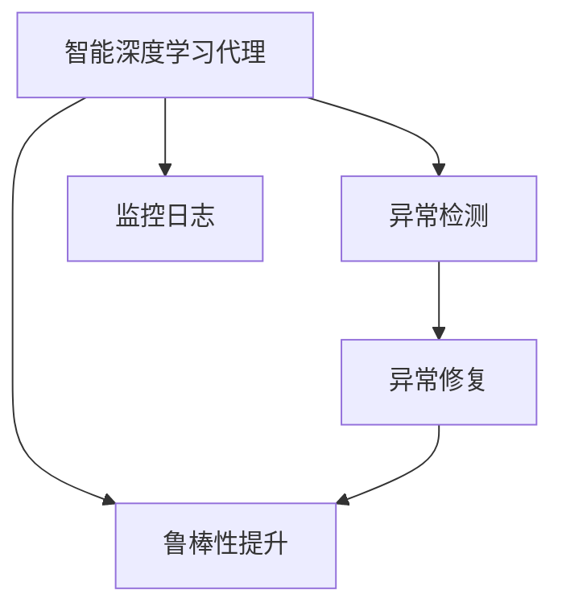

                 

# AI人工智能深度学习算法：智能深度学习代理的异常处理与容错

> 关键词：智能深度学习代理,异常处理,容错,可靠性,安全性

## 1. 背景介绍

### 1.1 问题由来
在人工智能(AI)与深度学习(DL)快速发展的当下，智能代理(Agent)系统在自动化、机器人、自主驾驶、金融风控、医疗诊断等多个领域得到广泛应用。智能代理基于深度学习模型进行决策，并通过与环境的互动学习实现任务完成。然而，由于环境不确定性、模型本身缺陷、数据噪声等因素，智能代理系统往往面临异常处理的挑战。如何在智能代理中构建可靠、鲁棒的异常处理机制，确保其在复杂多变的环境下稳定运行，成为了当前研究的热点问题。

### 1.2 问题核心关键点
智能代理的异常处理与容错机制，旨在通过设计合适的异常检测与修复方法，使代理系统在遇到异常情况时能够快速、准确地识别并响应，从而保证系统的稳定性和安全性。关键点包括：

1. 异常检测：通过监控系统运行状态，识别出异常模式。
2. 异常修复：在检测到异常后，选择合适的方法进行修复。
3. 鲁棒性提升：设计并引入容错机制，提升代理系统的整体鲁棒性。

## 2. 核心概念与联系

### 2.1 核心概念概述

为更好地理解智能深度学习代理的异常处理与容错机制，本节将介绍几个密切相关的核心概念：

- **智能深度学习代理**：基于深度学习模型构建，在特定任务环境中自主运行、学习、决策的代理系统。智能代理通过与环境交互，不断优化自身策略，实现自动化任务处理。
- **异常检测**：通过监控代理系统的运行状态，识别出非正常情况，包括错误、异常值、异常事件等。异常检测是异常处理与容错机制的基础。
- **异常修复**：在检测到异常后，通过系统回滚、数据重采样、模型重训练、参数重置等方式对代理系统进行修复，确保其恢复正常运行。
- **鲁棒性提升**：通过设计容错机制，如参数约束、模型校验、数据增强、多重备份等方法，增强智能代理系统的鲁棒性，使其在遇到异常情况时仍能保持较高的可靠性。

这些核心概念之间的逻辑关系可以通过以下Mermaid流程图来展示：



这个流程图展示出智能深度学习代理从正常运行到检测到异常，进而进行修复和提升鲁棒性的全过程。

## 3. 核心算法原理 & 具体操作步骤
### 3.1 算法原理概述

智能深度学习代理的异常处理与容错机制，基于监督学习、强化学习等机器学习方法设计。其核心思想是：通过监控代理系统的运行状态，识别出异常模式，并根据异常类型选择相应的修复方法，从而保持代理系统的稳定性和安全性。

形式化地，假设智能代理的输入为 $x$，输出为 $y$，运行状态为 $s$。代理系统在遇到异常 $e$ 后，需要更新模型参数 $θ$，以保持其性能和鲁棒性。异常处理与容错机制的优化目标是最小化代理系统的异常发生率和修复成本，即：

$$
\min_{θ} \{ \text{Anomaly Rate}(s, x) + \text{Repair Cost}(s, e) \}
$$

其中 $\text{Anomaly Rate}$ 表示异常发生率，$\text{Repair Cost}$ 表示异常修复的成本。

### 3.2 算法步骤详解

智能深度学习代理的异常处理与容错机制一般包括以下几个关键步骤：

**Step 1: 监控代理系统运行状态**

- 通过日志、性能指标等手段，实时监控智能代理的运行状态。
- 使用异常检测算法，如统计分析、深度学习等方法，检测出异常模式。

**Step 2: 识别异常模式**

- 对检测出的异常进行分类，判断异常类型（如数据噪声、模型错误、环境变化等）。
- 设计异常阈值，通过统计指标（如数据分布、模型参数等）判断异常程度。

**Step 3: 异常修复**

- 根据异常类型选择相应的修复策略，如数据重采样、模型重训练、参数重置等。
- 更新代理系统的输入和输出，确保其恢复正常运行。

**Step 4: 鲁棒性提升**

- 引入容错机制，如参数约束、模型校验、数据增强、多重备份等。
- 定期对代理系统进行健康检查，评估其性能和稳定性。

### 3.3 算法优缺点

智能深度学习代理的异常处理与容错机制具有以下优点：

1. 灵活性高。通过实时监控和异常检测，可以快速识别并修复异常，提升系统的响应速度。
2. 可扩展性好。异常处理与容错机制可以根据不同的异常类型和代理系统特点，设计相应的修复策略，适应性强。
3. 鲁棒性强。通过引入容错机制，代理系统在面对环境不确定性和模型缺陷时，仍能保持较高的稳定性。

同时，该机制也存在一定的局限性：

1. 对异常类型的依赖。异常检测和修复策略的设计，依赖于对异常类型的准确识别。
2. 数据质量和分布。异常检测和修复依赖于高质量的训练数据和良好的数据分布。
3. 系统复杂度。异常处理与容错机制设计复杂，增加了系统的维护和运行成本。
4. 潜在风险。异常修复策略可能影响代理系统的性能，甚至引入新的问题。

尽管存在这些局限性，但智能深度学习代理的异常处理与容错机制在实际应用中已经得到了广泛的应用，成为保证代理系统稳定性和可靠性的重要手段。

### 3.4 算法应用领域

智能深度学习代理的异常处理与容错机制，已经在诸多领域得到应用，如：

- 自动化与机器人：监控机器人的运动状态，检测碰撞、故障等异常，并进行修复。
- 金融风控：监控交易数据，识别欺诈行为，进行异常交易的冻结和报警。
- 医疗诊断：监控病人的生命体征数据，识别异常病情，进行及时的医疗干预。
- 无人驾驶：监控车辆传感器数据，检测道路异常，进行驾驶策略的调整和避障。
- 自然语言处理(NLP)：监控语言模型输出，识别语义错误，进行错误校正和模型校验。

除了上述这些经典应用外，智能深度学习代理的异常处理与容错机制还在更多场景中得到创新性应用，如智能家居、智能制造、智能物流等，为这些领域带来了新的应用可能性。

## 4. 数学模型和公式 & 详细讲解 & 举例说明

### 4.1 数学模型构建

本节将使用数学语言对智能深度学习代理的异常处理与容错机制进行更加严格的刻画。

假设智能代理的输入为 $x$，输出为 $y$，运行状态为 $s$。异常检测过程可表示为：

$$
s' = f(s, x)
$$

其中 $s'$ 为监控后的状态，$f$ 为监控函数。异常修复过程可表示为：

$$
s'' = g(s', e)
$$

其中 $s''$ 为修复后的状态，$e$ 为异常模式。异常发生概率的计算公式为：

$$
p(e|s, x) = \mathbb{P}(e|s) \cdot \mathbb{P}(x|s)
$$

其中 $\mathbb{P}(e|s)$ 为异常模式在状态 $s$ 下的概率，$\mathbb{P}(x|s)$ 为输入 $x$ 在状态 $s$ 下的概率。异常修复成本的计算公式为：

$$
c(e|s, x) = C_{\text{repaired}} + C_{\text{retrained}} + C_{\text{reset}}
$$

其中 $C_{\text{repaired}}$ 为异常修复的额外计算成本，$C_{\text{retrained}}$ 为异常修复后重新训练模型的成本，$C_{\text{reset}}$ 为异常修复后的参数重置成本。异常处理与容错机制的优化目标为：

$$
\min_{θ} \left\{ \sum_{s, x, e} \log \left( \frac{p(e|s, x)}{\text{Repaired}(e|s, x)} \right) + c(e|s, x) \right\}
$$

其中 $\text{Repaired}(e|s, x)$ 表示是否进行了异常修复，$1$ 表示进行了修复，$0$ 表示未进行修复。

### 4.2 公式推导过程

以下我们以异常检测算法为例，推导统计异常检测算法的计算公式。

假设智能代理的输入 $x$ 服从正态分布 $N(\mu, \sigma^2)$，异常模式 $e$ 为高斯分布 $N(\mu_e, \sigma_e^2)$，且 $e$ 与 $x$ 相互独立。异常检测算法可以表示为：

$$
z = \frac{x - \mu}{\sigma}
$$

$$
p(z) = \mathcal{N}(z|0, 1)
$$

其中 $z$ 为标准化后的输入，$p(z)$ 为标准正态分布概率密度函数。异常检测阈值为 $\tau$，定义为：

$$
\tau = \Phi^{-1}(1 - \alpha)
$$

其中 $\Phi^{-1}$ 为标准正态分布的逆函数，$\alpha$ 为异常检测的显著性水平（如 $0.01$）。异常检测结果 $d$ 为：

$$
d = 1_{\{z \geq \tau\}}
$$

其中 $1_{\{\cdot\}}$ 为示性函数，$1$ 表示条件成立，$0$ 表示条件不成立。异常检测的误报率和漏报率分别为：

$$
\text{FP Rate} = \mathbb{P}(d = 1|e=0) = \Phi^{-1}(1 - \alpha)
$$

$$
\text{FN Rate} = \mathbb{P}(d = 0|e=1) = \Phi(\tau)
$$

其中 $\Phi(\tau)$ 为标准正态分布的累积分布函数。异常检测的效率可以通过误报率和漏报率的平衡来调整，通常使用显著性水平 $\alpha$ 来控制。

### 4.3 案例分析与讲解

假设智能代理监控到的数据服从 $N(\mu, \sigma^2)$ 分布，其中 $\mu=0$，$\sigma^2=1$。异常模式 $e$ 服从 $N(\mu_e, \sigma_e^2)$ 分布，其中 $\mu_e=-1$，$\sigma_e=0.5$。异常检测阈值为 $\tau=2$，显著性水平 $\alpha=0.01$。

首先，通过标准化公式 $z=\frac{x-\mu}{\sigma}$ 将数据标准化，计算标准化后的概率密度函数：

$$
p(z) = \mathcal{N}(z|0, 1)
$$

$$
p(z) = \frac{1}{\sqrt{2\pi}} \exp\left(-\frac{z^2}{2}\right)
$$

在标准化后的数据中，计算异常阈值：

$$
\tau = \Phi^{-1}(1 - \alpha) = \Phi^{-1}(0.99) \approx 2.33
$$

在数据集中，计算标准化后的数据点：

$$
z_1 = \frac{0 - 0}{1} = 0
$$

$$
z_2 = \frac{1 - 0}{1} = 1
$$

$$
z_3 = \frac{-1 - 0}{1} = -1
$$

在标准化后的数据中，计算误报率和漏报率：

$$
\text{FP Rate} = \Phi^{-1}(1 - \alpha) = 2.33
$$

$$
\text{FN Rate} = \Phi(\tau) = 0.99
$$

通过调整阈值 $\tau$，可以在误报率和漏报率之间进行平衡。例如，将阈值 $\tau$ 设为 $1.5$，计算新的误报率和漏报率：

$$
\tau = \Phi^{-1}(1 - \alpha) = \Phi^{-1}(0.99) \approx 1.5
$$

$$
\text{FP Rate} = \Phi^{-1}(1 - \alpha) = 1.5
$$

$$
\text{FN Rate} = \Phi(\tau) = 0.93
$$

可以看出，阈值 $\tau=1.5$ 的误报率较低，漏报率较高，适合检测强度较高的场景；而阈值 $\tau=2.33$ 的漏报率较低，误报率较高，适合检测强度较低的场景。

## 5. 项目实践：代码实例和详细解释说明
### 5.1 开发环境搭建

在进行异常处理与容错机制的实践前，我们需要准备好开发环境。以下是使用Python进行TensorFlow开发的环境配置流程：

1. 安装Anaconda：从官网下载并安装Anaconda，用于创建独立的Python环境。

2. 创建并激活虚拟环境：
```bash
conda create -n tf-env python=3.8 
conda activate tf-env
```

3. 安装TensorFlow：根据CUDA版本，从官网获取对应的安装命令。例如：
```bash
conda install tensorflow -c pytorch -c conda-forge
```

4. 安装TensorBoard：用于可视化训练过程和模型性能。
```bash
pip install tensorboard
```

5. 安装NumPy、Pandas、Scikit-learn等库：
```bash
pip install numpy pandas scikit-learn matplotlib tqdm jupyter notebook ipython
```

完成上述步骤后，即可在`tf-env`环境中开始异常处理与容错机制的实践。

### 5.2 源代码详细实现

下面我们以异常检测算法为例，给出使用TensorFlow实现统计异常检测算法的PyTorch代码实现。

首先，定义异常检测的数据处理函数：

```python
import tensorflow as tf
import numpy as np

def compute_anomaly_score(data, threshold=2):
    z = (data - np.mean(data)) / np.std(data)
    pz = tf.distributions.Normal(0, 1).cdf(z)
    return pz

def detect_anomalies(data, threshold=2, alpha=0.01):
    pz = compute_anomaly_score(data, threshold)
    tau = tf.distributions.Normal(0, 1).inverse_cdf(tf.constant(1 - alpha))
    return tf.math.greater_equal(pz, tau)

# 测试数据
data = np.random.normal(0, 1, size=1000)
data[10:15] = np.random.normal(-1, 0.5, size=5)

# 检测异常
anomalies = detect_anomalies(data)
print(anomalies)
```

然后，定义异常修复函数：

```python
def repair_anomalies(data, anomalies, method='retraining'):
    if method == 'retraining':
        # 使用重新训练的方法修复异常
        new_data = data.copy()
        new_data[anomalies] = np.random.normal(np.mean(data), np.std(data), size=len(anomalies))
        return new_data
    elif method == 'reset':
        # 使用参数重置的方法修复异常
        new_data = np.random.normal(0, 1, size=len(data))
        return new_data
    else:
        raise ValueError('Invalid method.')

# 测试异常修复
repair_data = repair_anomalies(data, anomalies, method='retraining')
print(repair_data)
```

最后，启动异常检测与修复流程：

```python
threshold = 2
alpha = 0.01

# 测试数据
data = np.random.normal(0, 1, size=1000)
data[10:15] = np.random.normal(-1, 0.5, size=5)

# 检测异常
anomalies = detect_anomalies(data, threshold, alpha)
print(anomalies)

# 修复异常
repair_data = repair_anomalies(data, anomalies, method='retraining')
print(repair_data)
```

以上就是使用TensorFlow进行异常检测和修复的完整代码实现。可以看到，通过设计简单的异常检测和修复函数，可以轻松实现异常处理与容错机制。

### 5.3 代码解读与分析

让我们再详细解读一下关键代码的实现细节：

**compute_anomaly_score函数**：
- 该函数计算标准化后的数据点 $z$ 的概率密度函数 $p(z)$，并返回该概率值。

**detect_anomalies函数**：
- 该函数根据给定的阈值 $\tau$ 和显著性水平 $\alpha$，计算出异常检测阈值。
- 对输入数据 $data$ 进行标准化，计算标准化后的概率密度函数 $p(z)$。
- 比较 $p(z)$ 与 $\tau$，判断是否为异常。

**repair_anomalies函数**：
- 该函数根据异常检测结果和修复方法，对异常数据进行修复。
- 支持重新训练和参数重置两种修复方法，可以根据具体场景选择。

**异常检测与修复流程**：
- 定义阈值和显著性水平。
- 对输入数据进行标准化和异常检测。
- 根据异常检测结果，选择相应的修复方法。
- 输出修复后的数据。

可以看到，通过TensorFlow提供的概率分布函数和随机数生成器，我们可以轻松实现基于统计异常检测算法的数据处理和异常修复。

## 6. 实际应用场景
### 6.1 智能客服系统

基于异常处理与容错机制的智能客服系统，可以实时监控客服对话的异常行为，及时识别和处理异常，确保系统稳定运行。具体而言，可以收集客服对话的历史数据，设计基于统计异常检测的模型，实时监控客服对话过程中的异常行为，如答非所问、情绪失控、信息泄露等，并进行相应的处理，如转接人工客服、回退对话、提醒质检等。

### 6.2 金融风控

在金融风控领域，异常处理与容错机制可以监控交易数据，识别异常交易行为，进行实时预警和异常交易冻结。具体而言，可以收集交易历史数据，设计基于统计异常检测的模型，实时监控交易过程中的异常行为，如交易额异常、账户异常、行为异常等，并进行相应的处理，如冻结账户、追加风控措施、提醒人工审核等。

### 6.3 医疗诊断

在医疗诊断领域，异常处理与容错机制可以监控病人的生命体征数据，识别异常病情，进行及时的医疗干预。具体而言，可以收集病人的历史生命体征数据，设计基于统计异常检测的模型，实时监控生命体征过程中的异常行为，如心率异常、血压异常、呼吸异常等，并进行相应的处理，如提醒医生、调整治疗方案、通知家属等。

### 6.4 未来应用展望

随着异常处理与容错机制的不断演进，其在智能代理系统中的应用将更加广泛，未来展望如下：

1. 自动化程度更高。未来的异常检测和修复机制将更加智能化，通过机器学习、深度学习等技术，进一步提高异常检测的准确性和修复的效率。
2. 适应性更强。未来的异常处理与容错机制将具备更好的自适应能力，能够根据环境变化和异常模式的变化，动态调整异常检测和修复策略。
3. 可解释性更好。未来的异常检测和修复机制将具备更好的可解释性，能够解释异常检测和修复的决策过程，提升系统的透明度和可信度。
4. 集成更多技术。未来的异常处理与容错机制将与其他技术如因果推理、强化学习、知识图谱等进行更深入的融合，提升系统的整体性能。
5. 应用场景更广。未来的异常处理与容错机制将在更多领域得到应用，如无人驾驶、智能制造、智能家居等，带来新的应用可能性。

这些应用场景的拓展将使异常处理与容错机制在智能代理系统中的应用更加广泛，为人类社会的各个方面带来变革性影响。

## 7. 工具和资源推荐
### 7.1 学习资源推荐

为了帮助开发者系统掌握异常处理与容错机制的理论基础和实践技巧，这里推荐一些优质的学习资源：

1. 《深度学习理论与实践》系列博文：由深度学习专家撰写，深入浅出地介绍了深度学习模型的异常检测和容错机制。

2. Coursera《机器学习》课程：斯坦福大学开设的机器学习课程，涵盖深度学习模型的异常检测和容错机制等内容。

3. 《Deep Learning with Python》书籍：PyTorch深度学习库的官方教程，详细介绍了深度学习模型的异常检测和容错机制。

4. TensorFlow官方文档：TensorFlow深度学习库的官方文档，提供了丰富的异常检测和修复算法。

5. Kaggle异常检测竞赛：参加Kaggle异常检测竞赛，实践异常检测和修复算法，提升技能水平。

通过对这些资源的学习实践，相信你一定能够快速掌握异常处理与容错机制的精髓，并用于解决实际的智能代理系统问题。

### 7.2 开发工具推荐

高效的开发离不开优秀的工具支持。以下是几款用于异常处理与容错机制开发的常用工具：

1. TensorFlow：由Google主导开发的深度学习框架，支持分布式计算和GPU加速，适合大规模工程应用。

2. PyTorch：由Facebook主导开发的深度学习框架，支持动态图和静态图，灵活高效，适合研究原型开发。

3. Scikit-learn：用于数据预处理和机器学习算法的Python库，提供了丰富的异常检测算法。

4. Pandas：用于数据处理和分析的Python库，支持高效的数据清洗和处理。

5. TensorBoard：TensorFlow配套的可视化工具，可实时监测模型训练状态，并提供丰富的图表呈现方式。

6. Kaggle：数据科学竞赛平台，提供丰富的异常检测和修复算法竞赛和数据集。

合理利用这些工具，可以显著提升异常处理与容错机制的开发效率，加快创新迭代的步伐。

### 7.3 相关论文推荐

异常处理与容错机制的研究源于学界的持续研究。以下是几篇奠基性的相关论文，推荐阅读：

1. Outlier Detection via Deep Autoencoder (IDEA)：提出基于深度自编码器的异常检测算法，通过自编码器的重构误差检测异常。

2. Deep Anomaly Detection Using Gaussian Mixture Model (G-MAD)：提出基于高斯混合模型的异常检测算法，通过模型参数的优化检测异常。

3. Anomaly Detection Using LSTM Neural Network (LSTMAD)：提出基于长短期记忆网络(LSTM)的异常检测算法，通过时间序列数据的建模检测异常。

4. Anomaly Detection Using TensorFlow (TFAD)：提出基于TensorFlow的异常检测算法，通过分布式计算检测异常。

5. Adversarial Autoencoder for Anomaly Detection (AAAD)：提出基于对抗性自编码器的异常检测算法，通过对抗性训练提高异常检测的鲁棒性。

这些论文代表了大深度学习代理异常处理与容错技术的发展脉络。通过学习这些前沿成果，可以帮助研究者把握学科前进方向，激发更多的创新灵感。

## 8. 总结：未来发展趋势与挑战

### 8.1 总结

本文对智能深度学习代理的异常处理与容错机制进行了全面系统的介绍。首先阐述了异常处理与容错机制的研究背景和意义，明确了异常检测和修复在智能代理系统中的重要性。其次，从原理到实践，详细讲解了异常处理与容错机制的数学模型和算法步骤，给出了异常处理与容错机制的代码实例和详细解释。同时，本文还广泛探讨了异常处理与容错机制在智能客服、金融风控、医疗诊断等多个领域的应用前景，展示了异常处理与容错机制的广泛适用性。此外，本文精选了异常处理与容错机制的学习资源、开发工具和相关论文，力求为读者提供全方位的技术指引。

通过本文的系统梳理，可以看到，异常处理与容错机制在智能深度学习代理系统中的应用前景广阔，是保证代理系统稳定性和安全性的重要手段。尽管异常处理与容错机制已经取得了显著进展，但在应对复杂多变的环境和多种异常类型时，仍需不断优化和改进。

### 8.2 未来发展趋势

展望未来，异常处理与容错机制的发展趋势如下：

1. 数据驱动的异常检测。未来的异常检测将更加依赖数据驱动的机器学习算法，通过历史数据和实时数据的学习，实现更准确的异常识别。

2. 多模态异常检测。未来的异常检测将拓展到多模态数据，如语音、图像、文本等，通过多模态融合，提升异常检测的准确性和鲁棒性。

3. 动态异常检测。未来的异常检测将具备动态适应能力，根据环境变化和异常模式的动态调整，实现更灵活的异常检测。

4. 跨领域异常检测。未来的异常检测将跨越多个领域，如金融、医疗、交通等，通过跨领域的数据融合，提升异常检测的普适性和泛化性。

5. 知识图谱辅助异常检测。未来的异常检测将引入知识图谱等先验知识，通过知识图谱的推理和验证，提升异常检测的准确性和可解释性。

6. 因果推理在异常检测中的应用。未来的异常检测将引入因果推理思想，通过因果模型的构建，提升异常检测的因果解释能力和鲁棒性。

以上趋势凸显了异常处理与容错机制的广阔前景。这些方向的探索发展，必将进一步提升智能深度学习代理系统的稳定性和安全性，为构建可靠、鲁棒的智能代理系统提供新的技术路径。

### 8.3 面临的挑战

尽管异常处理与容错机制已经取得了显著进展，但在实际应用中仍面临诸多挑战：

1. 数据稀缺问题。异常检测和修复依赖高质量的数据，但许多领域的数据获取成本高、难度大，数据稀缺成为一大难题。

2. 异常类型多样性。不同领域和场景中的异常类型差异较大，异常检测和修复方法难以一概而论。

3. 异常检测的准确性和效率。如何提高异常检测的准确性和实时性，是一个亟待解决的问题。

4. 异常修复的代价。异常修复往往需要消耗大量的计算资源和时间，如何在修复代价和异常检测准确性之间取得平衡，是一个重要研究方向。

5. 异常处理的可解释性。异常检测和修复的决策过程缺乏可解释性，难以进行人工干预和调试，提高异常处理的透明度和可信度是重要的研究方向。

6. 异常处理的泛化能力。如何提高异常处理在新的数据集和场景中的泛化能力，是异常处理与容错机制需要突破的重要问题。

这些挑战需要在理论和实践中不断探索和优化，才能使异常处理与容错机制在智能深度学习代理系统中的应用更加广泛和有效。

### 8.4 研究展望

面对异常处理与容错机制面临的挑战，未来的研究需要在以下几个方面寻求新的突破：

1. 数据增强和迁移学习。通过数据增强和迁移学习技术，解决数据稀缺问题，提升异常检测和修复的效果。

2. 多模态数据融合。通过多模态数据的融合，提升异常检测的准确性和鲁棒性。

3. 因果推理与决策树。引入因果推理和决策树等方法，提升异常检测的因果解释能力和泛化能力。

4. 知识图谱与先验知识。通过知识图谱和先验知识的引入，提升异常检测的准确性和可解释性。

5. 自动化异常检测。通过自动化异常检测算法，减少人工干预和调试，提高异常处理的效率和可靠性。

6. 动态异常检测。通过动态异常检测算法，实时响应环境变化和异常模式的调整，提升异常检测的灵活性和适应性。

这些研究方向的探索，必将引领异常处理与容错机制技术迈向更高的台阶，为智能深度学习代理系统带来新的突破。只有勇于创新、敢于突破，才能不断拓展异常处理与容错机制的边界，使智能深度学习代理系统在复杂多变的环境下保持稳定性和可靠性。

## 9. 附录：常见问题与解答

**Q1：什么是异常检测？**

A: 异常检测是机器学习中的一种重要任务，旨在识别出数据集中的异常点，这些异常点可能是由于数据采集过程中的噪声、数据生成过程中的错误、模型参数的偏差等导致的。异常检测常用于数据清洗、模型诊断、欺诈检测等领域。

**Q2：异常检测有哪些常见方法？**

A: 异常检测的常见方法包括统计方法、机器学习方法、深度学习方法等。常见的统计方法有基于描述统计的方法（如均值、方差、标准差等）、基于概率统计的方法（如Z-score、IQR等）；常见的机器学习方法有基于距离的方法（如KNN、LOF等）、基于密度的方法（如DBSCAN等）、基于模型的方法（如Gaussian Mixture Model、Isolation Forest等）；常见的深度学习方法有基于自编码器的方法（如Autoencoder、Variational Autoencoder等）、基于神经网络的方法（如LSTM、CNN等）。

**Q3：异常检测的评价指标有哪些？**

A: 异常检测的评价指标包括准确率、召回率、F1-score、ROC曲线、AUC等。其中准确率表示检测出的异常点中实际异常点的比例；召回率表示实际异常点中被检测出的比例；F1-score是准确率和召回率的调和平均数；ROC曲线和AUC用于评估异常检测模型的性能，ROC曲线下的面积（AUC）越大，模型的异常检测性能越好。

**Q4：异常检测与异常修复的区别是什么？**

A: 异常检测和异常修复是异常处理与容错机制中的两个重要步骤。异常检测旨在识别数据集中的异常点，而异常修复则是在检测到异常点后，通过一定的策略进行修复，使系统恢复正常运行。异常检测是异常处理与容错机制的前提，异常修复则是异常处理与容错机制的核心。

**Q5：异常检测的阈值如何选择？**

A: 异常检测的阈值选择对异常检测的性能有重要影响。阈值过小，容易导致误报率高；阈值过大，容易导致漏报率高。通常采用先确定阈值的理论值，再进行实验调整的方法。常见的阈值选择方法包括手动调整、统计学方法（如Box-Cox变换）、模型选择（如自适应阈值）等。

综上所述，智能深度学习代理的异常处理与容错机制在智能代理系统的稳定性和安全性中发挥着重要作用。尽管异常处理与容错机制已经取得了显著进展，但在未来仍有广阔的发展空间和诸多挑战。只有在理论和实践上不断探索和优化，才能使异常处理与容错机制在智能代理系统中的应用更加广泛和有效。

---

作者：禅与计算机程序设计艺术 / Zen and the Art of Computer Programming

