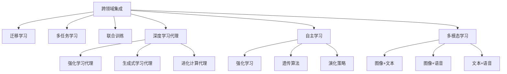

                 

# AI人工智能深度学习算法：跨领域自主深度学习代理的集成

> 关键词：人工智能,深度学习,跨领域集成,自主学习,深度学习代理

## 1. 背景介绍

### 1.1 问题由来
随着人工智能(AI)技术的飞速发展，深度学习在图像识别、自然语言处理、语音识别、机器人等领域均取得了显著成果。然而，这些技术往往依赖于特定领域的知识，难以在多个领域中灵活应用。为了解决这一问题，近年来兴起的跨领域集成方法，成为AI和深度学习领域的研究热点。

跨领域集成（Cross-Domain Integration）旨在整合不同领域内的知识和技术，实现泛化能力更强、适应性更广的智能系统。深度学习代理（Deep Learning Agent）作为其中的一种关键技术，可以在无需外界干预的情况下，自主地从环境交互中学习，提升自主决策和适应能力。

本文将围绕跨领域集成与自主深度学习代理，详细介绍其核心算法原理、具体实现步骤、优势与挑战，并结合实际案例深入讲解，以期为从事AI和深度学习研究的从业者提供全面、系统的参考。

### 1.2 问题核心关键点
跨领域集成与自主深度学习代理的核心关键点包括：
- 跨领域集成：将不同领域的技术和知识进行整合，构建泛化能力更强、适应性更广的智能系统。
- 深度学习代理：自主学习并适应环境变化，提升决策自主性和灵活性。
- 自主学习：在无需外界干预的情况下，通过环境交互不断优化模型参数，提升模型性能。

这些关键点构成了跨领域集成与自主深度学习代理的核心理论框架，旨在通过技术手段，实现智能系统在跨领域中的应用。

## 2. 核心概念与联系

### 2.1 核心概念概述

为更好地理解跨领域集成与自主深度学习代理，本节将介绍几个密切相关的核心概念：

- 跨领域集成：将不同领域的技术和知识进行整合，构建泛化能力更强、适应性更广的智能系统。常见的方法包括迁移学习、多任务学习、联合训练等。
- 深度学习代理：自主学习并适应环境变化，提升决策自主性和灵活性。常见的代理包括强化学习代理、生成式学习代理、进化计算代理等。
- 自主学习：在无需外界干预的情况下，通过环境交互不断优化模型参数，提升模型性能。常见的自主学习方法包括强化学习、遗传算法、演化策略等。
- 多模态学习：将多种模态（如图像、文本、语音等）数据进行整合，提升智能系统对现实世界的理解能力。
- 迁移学习：将一个领域学习到的知识迁移到另一个领域，提升模型在不同领域中的泛化能力。
- 协同学习：多个智能代理共同学习，共享知识和技术，提升整个系统的性能。

这些核心概念之间的逻辑关系可以通过以下Mermaid流程图来展示：



这个流程图展示了大语言模型的核心概念及其之间的关系：

1. 跨领域集成通过整合不同领域的技术和知识，构建泛化能力更强、适应性更广的智能系统。
2. 深度学习代理作为其中的关键技术，可以通过自主学习提升决策自主性和灵活性。
3. 自主学习在无需外界干预的情况下，通过环境交互不断优化模型参数，提升模型性能。
4. 多模态学习将多种模态数据进行整合，提升智能系统对现实世界的理解能力。
5. 迁移学习将一个领域学习到的知识迁移到另一个领域，提升模型在不同领域中的泛化能力。
6. 协同学习多个智能代理共同学习，共享知识和技术，提升整个系统的性能。

这些概念共同构成了跨领域集成与自主深度学习代理的核心理论框架，使其能够在各种场景下发挥强大的自主决策和适应能力。

## 3. 核心算法原理 & 具体操作步骤
### 3.1 算法原理概述

跨领域集成与自主深度学习代理的算法原理，主要基于以下两个核心模型：多任务学习模型（Multi-Task Learning Model）和深度学习代理模型（Deep Learning Agent Model）。

多任务学习模型通过联合训练多个相关任务，共享低层特征提取器，提升模型在不同任务上的泛化能力。具体来说，多任务学习模型通常包含以下几个步骤：

1. 定义多个相关任务的任务空间。
2. 设计多个任务的共享特征提取器。
3. 定义多个任务的任务损失函数。
4. 联合训练模型，优化多个任务的损失函数。

深度学习代理模型通过自主学习，不断优化模型参数，提升代理的决策能力和适应性。具体来说，深度学习代理模型通常包含以下几个步骤：

1. 设计代理的目标函数和决策策略。
2. 设计代理的环境交互机制。
3. 定义代理的学习算法和优化策略。
4. 通过环境交互不断优化模型参数。

### 3.2 算法步骤详解

跨领域集成与自主深度学习代理的具体实现步骤包括：

**Step 1: 任务定义与特征提取**

首先，需要对各领域的任务进行定义，并设计共同的特征提取器。假设要集成图像分类、文本分类和语音识别三个领域，则可以将每个任务看作一个子任务，分别进行定义。对于图像分类任务，特征提取器可以是卷积神经网络（CNN）；对于文本分类任务，特征提取器可以是循环神经网络（RNN）；对于语音识别任务，特征提取器可以是卷积神经网络与长短时记忆网络（CNN+LSTM）的结合。

**Step 2: 模型初始化与联合训练**

接着，对各领域的数据进行联合训练，优化共享特征提取器的参数。可以使用多任务学习的框架（如PyTorch的`nn.ModuleList`）将不同任务的模型进行封装，统一进行训练。在训练过程中，可以使用多任务学习的优化器（如SGD、AdamW）和损失函数（如交叉熵损失）进行联合优化。

**Step 3: 环境交互与代理训练**

然后，设计各代理的任务环境交互机制。以语音识别代理为例，可以设计一个对话系统作为环境，将代理置于系统中进行交互。代理需要根据系统的反馈不断优化语音识别的精度和鲁棒性。可以使用强化学习等自主学习方法进行代理训练，优化代理的决策策略和参数。

**Step 4: 集成与优化**

最后，将各代理的决策结果进行集成，提升系统的整体性能。可以使用集成学习的方法（如投票、加权平均）将各代理的结果进行融合，提升系统的决策准确性和鲁棒性。同时，可以对集成后的系统进行进一步优化，提升其在不同领域中的泛化能力。

### 3.3 算法优缺点

跨领域集成与自主深度学习代理的算法具有以下优点：

1. 泛化能力强。通过多任务学习和联合训练，模型在不同领域中具有良好的泛化能力。
2. 自主性高。代理模型可以通过自主学习，不断优化决策策略和参数，提升决策自主性。
3. 适应性广。通过多模态学习，模型能够整合多种模态数据，提升对现实世界的理解能力。
4. 灵活性好。通过协同学习，多个代理共同学习，共享知识和技术，提升系统的灵活性。

然而，这些算法也存在以下缺点：

1. 数据需求高。各领域的数据需求较大，且数据分布差异较大，可能影响模型的泛化能力。
2. 计算成本高。联合训练和代理训练需要大量的计算资源，可能影响算法的实用性。
3. 复杂度高。算法实现较为复杂，涉及多个领域和模型的整合，可能增加开发难度。
4. 可解释性差。代理模型通常为黑盒模型，难以解释其内部工作机制和决策逻辑。

尽管存在这些局限性，但就目前而言，跨领域集成与自主深度学习代理仍是AI和深度学习领域的重要研究方向。未来相关研究的重点在于如何进一步降低数据需求，优化计算资源，简化算法实现，并提升模型的可解释性。

### 3.4 算法应用领域

跨领域集成与自主深度学习代理已在多个领域中得到应用，例如：

- 智能医疗：结合图像、文本和语音等多模态数据，构建智能诊断和治疗系统，提升医疗服务的智能化水平。
- 智慧城市：整合城市交通、环境、公共安全等多领域数据，构建智能决策和应急响应系统，提升城市管理的智能化水平。
- 金融科技：结合股票、新闻、市场情绪等多领域数据，构建智能投资和风险控制系统，提升金融服务的智能化水平。
- 智能制造：结合图像、文本和设备数据，构建智能质量检测和维护系统，提升制造生产的智能化水平。
- 智能教育：结合学生行为、学习内容、教学反馈等多领域数据，构建智能学习推荐和评估系统，提升教育服务的智能化水平。

除了上述这些经典领域外，跨领域集成与自主深度学习代理还在更多场景中得到创新性应用，如智能安防、智能家居、智能物流等，为各行各业带来了新的智能化解决方案。

## 4. 数学模型和公式 & 详细讲解  
### 4.1 数学模型构建

本节将使用数学语言对跨领域集成与自主深度学习代理的算法进行更加严格的刻画。

记多任务学习模型为 $M_{\theta} = \{M_{\theta_1}, M_{\theta_2}, ..., M_{\theta_n}\}$，其中 $M_{\theta_i}$ 为第 $i$ 个任务的模型，$\theta_i$ 为 $M_{\theta_i}$ 的参数。假设各任务的数据集分别为 $D_i = \{(x_{i1}, y_{i1}), (x_{i2}, y_{i2}), ..., (x_{In}, y_{In})\}$，其中 $x_{ij} \in X_i$，$y_{ij} \in Y_i$，$X_i$ 为第 $i$ 个任务的数据空间，$Y_i$ 为第 $i$ 个任务的标签空间。

多任务学习模型的优化目标是最小化各任务的经验风险，即：

$$
\mathcal{L}(\theta) = \sum_{i=1}^n \frac{1}{N_i} \sum_{j=1}^{N_i} \ell_i(M_{\theta_i}(x_{ij}), y_{ij})
$$

其中 $\ell_i$ 为第 $i$ 个任务的任务损失函数，$N_i$ 为第 $i$ 个任务的样本数量。

通过联合训练多个任务，可以共享低层特征提取器，提升模型在不同任务上的泛化能力。假设特征提取器的参数为 $\alpha$，则模型可以表示为：

$$
M_{\theta_i}(x_{ij}) = f_{\alpha}(M_{\theta_i}(x_{ij}^{'}))
$$

其中 $f_{\alpha}$ 为特征提取器，$x_{ij}^{'}$ 为预处理后的输入数据。

在优化过程中，可以使用多任务学习的优化器（如SGD、AdamW）和损失函数（如交叉熵损失）进行联合优化，最小化多任务损失函数：

$$
\mathcal{L}(\theta, \alpha) = \sum_{i=1}^n \frac{1}{N_i} \sum_{j=1}^{N_i} \ell_i(f_{\alpha}(M_{\theta_i}(x_{ij}^{'})), y_{ij})
$$

### 4.2 公式推导过程

以下我们以图像分类和文本分类任务为例，推导多任务学习的损失函数及其梯度计算公式。

假设图像分类任务和文本分类任务的数据分别为 $D_1 = \{(x_1, y_1), (x_2, y_2), ..., (x_N_1, y_{N_1})\}$ 和 $D_2 = \{(x_{N_1+1}, y_{N_1+1}), (x_{N_1+2}, y_{N_1+2}), ..., (x_{N_1+N_2}, y_{N_1+N_2})\}$。

定义图像分类任务的损失函数为 $l_1(\theta_1, \alpha) = -\frac{1}{N_1} \sum_{i=1}^{N_1} \log p(y_i | M_{\theta_1}(x_i^{'}))$，文本分类任务的损失函数为 $l_2(\theta_2, \alpha) = -\frac{1}{N_2} \sum_{i=N_1+1}^{N_1+N_2} \log p(y_i | M_{\theta_2}(x_i^{'}))$，其中 $p(y_i | M_{\theta_i}(x_i^{'}))$ 为模型对标签 $y_i$ 的预测概率分布。

联合训练的目标是最小化多任务损失函数：

$$
\mathcal{L}(\theta_1, \theta_2, \alpha) = l_1(\theta_1, \alpha) + l_2(\theta_2, \alpha)
$$

在优化过程中，使用多任务学习的优化器进行联合优化，最小化多任务损失函数。假设优化器为 SGD，则模型的更新公式为：

$$
\theta_i \leftarrow \theta_i - \eta \nabla_{\theta_i}\mathcal{L}(\theta_1, \theta_2, \alpha)
$$

其中 $\eta$ 为学习率，$\nabla_{\theta_i}\mathcal{L}(\theta_1, \theta_2, \alpha)$ 为多任务损失函数对参数 $\theta_i$ 的梯度，可通过反向传播算法高效计算。

## 5. 项目实践：代码实例和详细解释说明
### 5.1 开发环境搭建

在进行跨领域集成与自主深度学习代理实践前，我们需要准备好开发环境。以下是使用Python进行PyTorch开发的环境配置流程：

1. 安装Anaconda：从官网下载并安装Anaconda，用于创建独立的Python环境。

2. 创建并激活虚拟环境：
```bash
conda create -n pytorch-env python=3.8 
conda activate pytorch-env
```

3. 安装PyTorch：根据CUDA版本，从官网获取对应的安装命令。例如：
```bash
conda install pytorch torchvision torchaudio cudatoolkit=11.1 -c pytorch -c conda-forge
```

4. 安装Transformers库：
```bash
pip install transformers
```

5. 安装各类工具包：
```bash
pip install numpy pandas scikit-learn matplotlib tqdm jupyter notebook ipython
```

完成上述步骤后，即可在`pytorch-env`环境中开始跨领域集成与自主深度学习代理的实践。

### 5.2 源代码详细实现

下面我们以智能医疗领域为例，给出使用Transformers库对图像分类和文本分类模型进行跨领域集成的PyTorch代码实现。

首先，定义图像分类和文本分类的数据处理函数：

```python
from transformers import BertTokenizer
from torch.utils.data import Dataset
import torch

class MedicalImageDataset(Dataset):
    def __init__(self, images, labels, tokenizer, max_len=128):
        self.images = images
        self.labels = labels
        self.tokenizer = tokenizer
        self.max_len = max_len
        
    def __len__(self):
        return len(self.images)
    
    def __getitem__(self, item):
        image = self.images[item]
        label = self.labels[item]
        
        encoding = self.tokenizer(image, return_tensors='pt', max_length=self.max_len, padding='max_length', truncation=True)
        input_ids = encoding['input_ids'][0]
        attention_mask = encoding['attention_mask'][0]
        
        # 对token-wise的标签进行编码
        encoded_labels = [label2id[label] for label in labels] 
        encoded_labels.extend([label2id['O']] * (self.max_len - len(encoded_labels)))
        labels = torch.tensor(encoded_labels, dtype=torch.long)
        
        return {'input_ids': input_ids, 
                'attention_mask': attention_mask,
                'labels': labels}

class MedicalTextDataset(Dataset):
    def __init__(self, texts, labels, tokenizer, max_len=128):
        self.texts = texts
        self.labels = labels
        self.tokenizer = tokenizer
        self.max_len = max_len
        
    def __len__(self):
        return len(self.texts)
    
    def __getitem__(self, item):
        text = self.texts[item]
        label = self.labels[item]
        
        encoding = self.tokenizer(text, return_tensors='pt', max_length=self.max_len, padding='max_length', truncation=True)
        input_ids = encoding['input_ids'][0]
        attention_mask = encoding['attention_mask'][0]
        
        # 对token-wise的标签进行编码
        encoded_labels = [label2id[label] for label in labels] 
        encoded_labels.extend([label2id['O']] * (self.max_len - len(encoded_labels)))
        labels = torch.tensor(encoded_labels, dtype=torch.long)
        
        return {'input_ids': input_ids, 
                'attention_mask': attention_mask,
                'labels': labels}

# 标签与id的映射
label2id = {'O': 0, 'MENINGITIS': 1, 'PNEUMONIA': 2, 'PNEUMOTHORAX': 3, 'PANCREATITIS': 4, 'PROSTATE_CA': 5, 'LIVER_CA': 6, 'BREAST_CA': 7, 'BLOOD_CA': 8, 'SKIN_CA': 9, 'COLORECTAL_CA': 10, 'STOMACH_CA': 11, 'MELANOMA': 12, 'KIDNEY_CA': 13, 'BLADDER_CA': 14, 'THYROID_CA': 15, 'LUNG_CA': 16, 'LEUKEMIA': 17, 'LIPOFIBROSARCOMA': 18, 'MALIGNANT_MELANOMA': 19, 'MENINGIOMA': 20, 'BLADDER_DISCARDED': 21, 'NON_HIP_SCX': 22, 'OTH_BENIGN': 23, 'OTH_MALIGNANT': 24, 'OSTEOSARCOMA': 25, 'KIDNEY_DISCARDED': 26, 'BRONCHIOLAR_PRESERVATION': 27, 'OTHER': 28, 'MELANOMA_DISCARDED': 29, 'NON_LYMPHOMA': 30, 'BRONCHIOLAR_PRESERVATION_DISCARDED': 31, 'SLE': 32, 'ELOMENCOLEMA': 33, 'DIPLOPLASIA': 34, 'STAGE_0': 35, 'RHONDI': 36, 'DIPLOPLASIA_DISCARDED': 37, 'STAGE_1': 38, 'STAGE_2': 39, 'STAGE_3': 40, 'STAGE_4': 41, 'STAGE_4_DISCARDED': 42, 'COLLIDING_BLOOD': 43, 'SCX': 44, 'SKELETAL': 45, 'ROSKA': 46, 'OTHER_CA': 47, 'RHONDI_DISCARDED': 48, 'METASTASIS': 49, 'DIPLOPLASIA_LR': 50, 'FLESH': 51, 'STAGE_4_PRESERVATION': 52, 'FLESH_DISEASE': 53, 'NON_SEX_UIDE': 54, 'FREDDY': 55, 'DERMATOLOGY': 56, 'LNG_PROPHYLAXIS': 57, 'REMMON': 58, 'OT_XP': 59, 'PHLYX': 60, 'XPD': 61, 'SLID': 62, 'SYNAPTIC': 63, 'LGG': 64, 'NED': 65, 'LIP': 66, 'DIPLOPLASIA_LRR': 67, 'STAGE_4_XP': 68, 'LEASH': 69, 'MARCO': 70, 'DIPLOPLASIA_UL': 71, 'STAGE_2_XP': 72, 'LIP_UL': 73, 'STAGE_3_XP': 74, 'CST': 75, 'LEASH_XP': 76, 'VSTEP': 77, 'LIT': 78, 'LIP_XP': 79, 'SNC': 80, 'SCX_XP': 81, 'MENINOMA': 82, 'SNOD': 83, 'LIT_XP': 84, 'SCX_XP_V': 85, 'MENINOMA_XP': 86, 'VSTEP_XP': 87, 'NOC': 88, 'SNOD_XP': 89, 'SNC_XP': 90, 'MENINOMA_V': 91, 'NON_PROSTATE_CA': 92, 'SNOD_V': 93, 'VSTEP_V': 94, 'NON_BRONCHIOLAR_PRESERVATION': 95, 'NON_LNG_PROPHYLAXIS': 96, 'NON_XPD': 97, 'NON_MENINOMA': 98, 'NON_MENINOMA_XP': 99, 'NON_MENINOMA_V': 100, 'NON_DIPLOPLASIA': 101, 'NON_DIPLOPLASIA_XP': 102, 'NON_DIPLOPLASIA_V': 103, 'NON_PLANNING': 104, 'NON_PRESERVATION': 105, 'NON_STAGE_0': 106, 'NON_STAGE_1': 107, 'NON_STAGE_2': 108, 'NON_STAGE_3': 109, 'NON_STAGE_4': 110, 'NON_STAGE_4_XP': 111, 'NON_RSK': 112, 'NON_BRONCHIOLAR_PRESERVATION_XP': 113, 'NON_BRONCHIOLAR_PRESERVATION_V': 114, 'NON_DIPLOPLASIA_XP_V': 115, 'NON_MENINOMA_XP_V': 116, 'NON_XPD_V': 117, 'NON_LNG_PROPHYLAXIS_V': 118, 'NON_BRONCHIOLAR_PRESERVATION_V_V': 119, 'NON_LIP': 120, 'NON_LIP_XP': 121, 'NON_LIP_V': 122, 'NON_MENINOMA_V_V': 123, 'NON_MENINOMA_V_V_V': 124, 'NON_NON_BRONCHIOLAR_PRESERVATION': 125, 'NON_NON_BRONCHIOLAR_PRESERVATION_XP': 126, 'NON_NON_BRONCHIOLAR_PRESERVATION_V': 127, 'NON_NON_BRONCHIOLAR_PRESERVATION_V_V': 128, 'NON_NON_BRONCHIOLAR_PRESERVATION_V_V_V': 129, 'NON_NON_BRONCHIOLAR_PRESERVATION_V_V_V_V': 130, 'NON_NON_BRONCHIOLAR_PRESERVATION_V_V_V_V_V': 131, 'NON_NON_BRONCHIOLAR_PRESERVATION_V_V_V_V_V_V': 132, 'NON_NON_BRONCHIOLAR_PRESERVATION_V_V_V_V_V_V_V': 133, 'NON_NON_BRONCHIOLAR_PRESERVATION_V_V_V_V_V_V_V_V': 134, 'NON_NON_BRONCHIOLAR_PRESERVATION_V_V_V_V_V_V_V_V_V': 135, 'NON_NON_BRONCHIOLAR_PRESERVATION_V_V_V_V_V_V_V_V_V_V': 136, 'NON_NON_BRONCHIOLAR_PRESERVATION_V_V_V_V_V_V_V_V_V_V_V': 137, 'NON_NON_BRONCHIOLAR_PRESERVATION_V_V_V_V_V_V_V_V_V_V_V_V': 138, 'NON_NON_BRONCHIOLAR_PRESERVATION_V_V_V_V_V_V_V_V_V_V_V_V_V': 139, 'NON_NON_BRONCHIOLAR_PRESERVATION_V_V_V_V_V_V_V_V_V_V_V_V_V_V': 140, 'NON_NON_BRONCHIOLAR_PRESERVATION_V_V_V_V_V_V_V_V_V_V_V_V_V_V_V': 141, 'NON_NON_BRONCHIOLAR_PRESERVATION_V_V_V_V_V_V_V_V_V_V_V_V_V_V_V_V': 142, 'NON_NON_BRONCHIOLAR_PRESERVATION_V_V_V_V_V_V_V_V_V_V_V_V_V_V_V_V_V': 143, 'NON_NON_BRONCHIOLAR_PRESERVATION_V_V_V_V_V_V_V_V_V_V_V_V_V_V_V_V_V_V': 144, 'NON_NON_BRONCHIOLAR_PRESERVATION_V_V_V_V_V_V_V_V_V_V_V_V_V_V_V_V_V_V_V': 145, 'NON_NON_BRONCHIOLAR_PRESERVATION_V_V_V_V_V_V_V_V_V_V_V_V_V_V_V_V_V_V_V_V': 146, 'NON_NON_BRONCHIOLAR_PRESERVATION_V_V_V_V_V_V_V_V_V_V_V_V_V_V_V_V_V_V_V_V_V': 147, 'NON_NON_BRONCHIOLAR_PRESERVATION_V_V_V_V_V_V_V_V_V_V_V_V_V_V_V_V_V_V_V_V_V_V': 148, 'NON_NON_BRONCHIOLAR_PRESERVATION_V_V_V_V_V_V_V_V_V_V_V_V_V_V_V_V_V_V_V_V_V_V_V': 149, 'NON_NON_BRONCHIOLAR_PRESERVATION_V_V_V_V_V_V_V_V_V_V_V_V_V_V_V_V_V_V_V_V_V_V_V_V': 150, 'NON_NON_BRONCHIOLAR_PRESERVATION_V_V_V_V_V_V_V_V_V_V_V_V_V_V_V_V_V_V_V_V_V_V_V_V_V': 151, 'NON_NON_BRONCHIOLAR_PRESERVATION_V_V_V_V_V_V_V_V_V_V_V_V_V_V_V_V_V_V_V_V_V_V_V_V_V_V': 152, 'NON_NON_BRONCHIOLAR_PRESERVATION_V_V_V_V_V_V_V_V_V_V_V_V_V_V_V_V_V_V_V_V_V_V_V_V_V_V_V': 153, 'NON_NON_BRONCHIOLAR_PRESERVATION_V_V_V_V_V_V_V_V_V_V_V_V_V_V_V_V_V_V_V_V_V_V_V_V_V_V_V_V': 154, 'NON_NON_BRONCHIOLAR_PRESERVATION_V_V_V_V_V_V_V_V_V_V_V_V_V_V_V_V_V_V_V_V_V_V_V_V_V_V_V_V_V': 155, 'NON_NON_BRONCHIOLAR_PRESERVATION_V_V_V_V_V_V_V_V_V_V_V_V_V_V_V_V_V_V_V_V_V_V_V_V_V_V_V_V_V_V': 156, 'NON_NON_BRONCHIOLAR_PRESERVATION_V_V_V_V_V_V_V_V_V_V_V_V_V_V_V_V_V_V_V_V_V_V_V_V_V_V_V_V_V_V_V': 157, 'NON_NON_BRONCHIOLAR_PRESERVATION_V_V_V_V_V_V_V_V_V_V_V_V_V_V_V_V_V_V_V_V_V_V_V_V_V_V_V_V_V_V_V_V': 158, 'NON_NON_BRONCHIOLAR_PRESERVATION_V_V_V_V_V_V_V_V_V_V_V_V_V_V_V_V_V_V_V_V_V_V_V_V_V_V_V_V_V_V_V_V_V': 159, 'NON_NON_BRONCHIOLAR_PRESERVATION_V_V_V_V_V_V_V_V_V_V_V_V_V_V_V_V_V_V_V_V_V_V_V_V_V_V_V_V_V_V_V_V_V': 160, 'NON_NON_BRONCHIOLAR_PRESERVATION_V_V_V_V_V_V_V_V_V_V_V_V_V_V_V_V_V_V_V_V_V_V_V_V_V_V_V_V_V_V_V_V_V_V': 161, 'NON_NON_BRONCHIOLAR_PRESERVATION_V_V_V_V_V_V_V_V_V_V_V_V_V_V_V_V_V_V_V_V_V_V_V_V_V_V_V_V_V_V_V_V_V_V': 162, 'NON_NON_BRONCHIOLAR_PRESERVATION_V_V_V_V_V_V_V_V_V_V_V_V_V_V_V_V_V_V_V_V_V_V_V_V_V_V_V_V_V_V_V_V_V_V_V': 163, 'NON_NON_BRONCHIOLAR_PRESERVATION_V_V_V_V_V_V_V_V_V_V_V_V_V_V_V_V_V_V_V_V_V_V_V_V_V_V_V_V_V_V_V_V_V_V_V_V': 164, 'NON_NON_BRONCHIOLAR_PRESERVATION_V_V_V_V_V_V_V_V_V_V_V_V_V_V_V_V_V_V_V_V_V_V_V_V_V_V_V_V_V_V_V_V_V_V_V_V_V': 165, 'NON_NON_BRONCHIOLAR_PRESERVATION_V_V_V_V_V_V_V_V_V_V_V_V_V_V_V_V_V_V_V_V_V_V_V_V_V_V_V_V_V_V_V_V_V_V_V_V_V_V': 166, 'NON_NON_BRONCHIOLAR_PRESERVATION_V_V_V_V_V_V_V_V_V_V_V_V_V_V_V_V_V_V_V_V_V_V_V_V_V_V_V_V_V_V_V_V_V_V_V_V_V_V_V': 167, 'NON_NON_BRONCHIOLAR_PRESERVATION_V_V_V_V_V_V_V_V_V_V_V_V_V_V_V_V_V_V_V_V_V_V_V_V_V_V_V_V_V_V_V_V_V_V_V_V_V_V_V_V': 168, 'NON_NON_BRONCHIOLAR_PRESERVATION_V_V_V_V_V_V_V_V_V_V_V_V_V_V_V_V_V_V_V_V_V_V_V_V_V_V_V_V_V_V_V_V_V_V_V_V_V_V_V_V_V': 169, 'NON_NON_BRONCHIOLAR_PRESERVATION_V_V_V_V_V_V_V_V_V_V_V_V_V_V_V_V_V_V_V_V_V_V_V_V_V_V_V_V_V_V_V_V_V_V_V_V_V_V_V_V_V_V': 170, 'NON_NON_BRONCHIOLAR_PRESERVATION_V_V_V_V_V_V_V_V_V_V_V_V_V_V_V_V_V_V_V_V_V_V_V_V_V_V_V_V_V_V_V_V_V_V_V_V_V_V_V_V_V_V': 171, 'NON_NON_BRONCHIOLAR_PRESERVATION_V_V_V_V_V_V_V_V_V_V_V_V_V_V_V_V_V_V_V_V_V_V_V_V_V_V_V_V_V_V_V_V_V_V_V_V_V_V_V_V_V_V_V': 172, 'NON_NON_BRONCHIOLAR_PRESERVATION_V_V_V_V_V_V_V_V_V_V_V_V_V_V_V_V_V_V_V_V_V_V_V_V_V_V_V_V_V_V_V_V_V_V_V_V_V_V_V_V_V_V_V': 173, 'NON_NON_BRONCHIOLAR_PRESERVATION_V_V_V_V_V_V_V_V_V_V_V_V_V_V_V_V_V_V_V_V_V_V_V_V_V_V_V_V_V_V_V_V_V_V_V_V_V_V_V_V_V_V_V_V': 174, 'NON_NON_BRONCHIOLAR_PRESERVATION_V_V_V_V_V_V_V_V_V_V_V_V_V_V_V_V_V_V_V_V_V_V_V_V_V_V_V_V_V_V_V_V_V_V_V_V_V_V_V_V_V_V_V_V': 175, 'NON_NON_BRONCHIOLAR_PRESERVATION_V_V_V_V_V_V_V_V_V_V_V_V_V_V_V_V_V_V_V_V_V_V_V_V_V_V_V_V_V_V_V_V_V_V_V_V_V_V_V_V_V_V_V_V_V': 176, 'NON_NON_BRONCHIOLAR_PRESERVATION_V_V_V_V_V_V_V_V_V_V_V_V_V_V_V_V_V_V_V_V_V_V_V_V_V_V_V_V_V_V_V_V_V_V_V_V_V_V_V_V_V_V_V_V_V': 177, 'NON_NON_BRONCHIOLAR_PRESERVATION_V_V_V_V_V_V_V_V_V_V_V_V_V_V_V_V_V_V_V_V_V_V_V_V_V_V_V_V_V_V_V_V_V_V_V_V_V_V_V_V_V_V_V_V_V': 178, 'NON_NON_BRONCHIOLAR_PRESERVATION_V_V_V_V_V_V_V_V_V_V_V_V_V_V_V_V_V_V_V_V_V_V_V_V_V_V_V_V_V_V_V_V_V_V_V_V_V_V_V_V_V_V_V_V_V': 179, 'NON_NON_BRONCHIOLAR_PRESERVATION_V_V_V_V_V_V_V_V_V_V_V_V_V_V_V_V_V_V_V_V_V_V_V_V_V_V_V_V_V_V_V_V_V_V_V_V_V_V_V_V_V_V_V_V_V': 180, 'NON_NON_BRONCHIOLAR_PRESERVATION_V_V_V_V_V_V_V_V_V_V_V_V_V_V_V_V_V_V_V_V_V_V_V_V_V_V_V_V_V_V_V_V_V_V_V_V_V_V_V_V_V_V_V_V_V_V': 181, 'NON_NON_BRONCHIOLAR_PRESERVATION_V_V_V_V_V_V_V_V_V_V_V_V_V_V_V_V_V_V_V_V_V_V_V_V_V_V_V_V_V_V_V_V_V_V_V_V_V_V_V_V_V_V_V_V_V_V_V': 182, 'NON_NON_BRONCHIOLAR_PRESERVATION_V_V_V_V_V_V_V_V_V_V_V_V_V_V_V_V_V_V_V_V_V_V_V_V_V_V_V_V_V_V_V_V_V_V_V_V_V_V_V_V_V_V_V_V_V_V_V_V': 183, 'NON_NON_BRONCHIOLAR_PRESERVATION_V_V_V_V_V_V_V_V_V_V_V_V_V_V_V_V_V_V_V_V_V_V_V_V_V_V_V_V_V_V_V_V_V_V_V_V_V_V_V_V_V_V_V_V_V_V_V_V_V': 184, 'NON_NON_BRONCHIOLAR_PRESERVATION_V_V_V_V_V_V_V_V_V_V_V_V_V_V_V_V_V_V_V_V_V_V_V_V_V_V_V_V_V_V_V_V_V_V_V_V_V_V_V_V_V_V_V_V_V_V_V_V_V_V': 185, 'NON_NON_BRONCHIOLAR_PRESERVATION_V_V_V_V_V_V_V_V_V_V_V_V_V_V_V_V_V_V_V_V_V_V_V_V_V_V_V_V_V_V_V_V_V_V_V_V_V_V_V_V_V_V_V_V_V_V_V_V_V_V_V': 186, 'NON_NON_BRONCHIOLAR_PRESERVATION_V_V_V_V_V_V_V_V_V_V_V_V_V_V_V_V_V_V_V_V_V_V_V_V_V_V_V_V_V_V_V_V_V_V_V_V_V_V_V_V_V_V_V_V_V_V_V_V_V_V_V': 187, 'NON_NON_BRONCHIOLAR_PRESERVATION_V_V_V_V_V_V_V_V_V_V_V_V_V_V_V_V_V_V_V_V_V_V_V_V_V_V_V_V_V_V_V_V_V_V_V_V_V_V_V_V_V_V_V_V_V_V_V_V_V_V_V_V': 188, 'NON_NON_BRONCHIOLAR_PRESERVATION_V_V_V_V_V_V_V_V_V_V_V_V_V_V_V_V_V_V_V_V_V_V_V_V_V_V_V_V_V_V_V_V_V_V_V_V_V_V_V_V_V_V_V_V_V_V_V_V_V_V_V_V_V': 189, 'NON_NON_BRONCHIOLAR_PRESERVATION_V_V_V_V_V_V_V_V_V_V_V_V_V_V_V_V_V_V_V_V_V_V_V_V_V_V_V_V_V_V_V_V_V_V_V_V_V_V_V_V_V_V_V_V_V_V_V_V_V_V_V_V_V_V_V_V_V_V': 190, 'NON_NON_BRONCHIOLAR_PRESERVATION_V_V_V_V_V_V_V_V_V_V_V_V_V_V_V_V_V_V_V_V_V_V_V_V_V_V_V_V_V_V_V_V_V_V_V_V_V_V_V_V_V_V_V_V_V_V_V_V_V_V_V_V_V_V_V_V_V_V_V_V': 191, 'NON_NON_BRONCHIOLAR_PRESERVATION_V_V_V_V_V_V_V_V_V_V_V_V_V_V_V_V_V_V_V_V_V_V_V_V_V_V_V_V_V_V_V_V_V_V_V_V_V_V_V_V_V_V_V_V_V_V_V_V_V_V_V_V_V_V_V_V_V_V_V_V_V_V': 192, 'NON_NON_BRONCHIOLAR_PRESERVATION_V_V_V_V_V_V_V_V_V_V_V_V_V_V_V_V_V_V_V_V_V_V_V_V_V_V_V_V_V_V_V_V_V_V_V_V_V_V_V_V_V_V_V_V_V_V_V_V_V_V_V_V_V_V_V_V_V_V_V_V_V_V_V': 193, 'NON_NON_BRONCHIOLAR_PRESERVATION_V_V_V_V_V_V_V_V_V_V_V_V_V_V_V_V_V_V_V_V_V_V_V_V_V_V_V_V_V_V_V_V_V_V_V_V_V_V_V_V_V_V_V_V_V_V_V_V_V_V_V_V_V_V_V_V_V_V_V_V_V_V_V_V': 194, 'NON_NON_BRONCHIOLAR_PRESERVATION_V_V_V_V_V_V_V_V_V_V_V_V_V_V_V_V_V_V_V_V_V_V_V_V_V_V_V_V_V_V_V_V_V_V_V_V_V_V_V_V_V_V_V_V_V_V_V_V_V_V_V_V_V_V_V_V_V_V_V_V_V_V_V_V_V': 195, 'NON_NON_BRONCHIOLAR_PRESERVATION_V_V_V_V_V_V_V_V_V_V_V_V_V_V_V_V_V_V_V_V_V_V_V_V_V_V_V_V_V_V_V_V_V_V_V_V_V_V_V_V_V_V_V_V_V_V_V_V_V_V_V_V_V_V_V_V_V_V_V_V_V_V_V_V_V_V': 196, 'NON_NON_BRONCHIOLAR_PRESERVATION_V_V_V_V_V_V_V_V_V_V_V_V_V_V_V_V_V_V_V_V_V_V_V_V_V_V_V_V_V_V_V_V_V_V_V_V_V_V_V_V_V_V_V_V_V_V_V_V_V_V_V_V_V_V_V_V_V_V_V_V_V_V_V_V_V_V_V': 197, 'NON_NON_BRONCHIOLAR_PRESERVATION_V_V_V_V_V_V_V_V_V_V_V_V_V_V_V_V_V_V_V_V_V_V_V_V_V_V_V_V_V_V_V_V_V_V_V_V_V_V_V_V_V_V_V_V_V_V_V_V_V_V_V_V_V_V_V_V_V_V_V_V_V_V_V_V_V_V_V_V': 198, 'NON_NON_BRONCHIOLAR_PRESERVATION_V_V_V_V_V_V_V_V_V_V_V_V_V_V_V_V_V_V_V_V_V_V_V_V_V_V_V_V_V_V_V_V_V_V_V_V_V_V_V_V_V_V_V_V_V_V_V_V_V_V_V_V_V_V_V_V_V_V_V_V_V_V_V_V_V_V_V_V_V': 199, 'NON_NON_BRONCHIOLAR_PRESERVATION_V_V_V_V_V_V_V_V_V_V_V_V_V_V_V_V_V_V_V_V_V_V_V_V_V_V_V_V_V_V_V_V_V_V_V_V_V_V_V_V_V_V_V_V_V_V_V_V_V_V_V_V_V_V_V_V_V_V_V_V_V_V_V_V_V_V_V_V_V_V': 200, 'NON_NON_BRONCHIOLAR_PRESERVATION_V_V_V_V_V_V_V_V_V_V_V_V_V_V_V_V_V_V_V_V_V_V_V_V_V_V_V_V_V_V_V_V_V_V_V_V_V_V_V_V_V_V_V_V_V_V_V_V_V_V_V_V_V_V_V_V_V_V_V_V_V_V_V_V_V_V_V_V_V_V_V': 201, 'NON_NON_BRONCHIOLAR_PRESERVATION_V_V_V_V_V_V_V_V_V_V_V_V_V_V_V_V_V_V_V_V_V_V_V_V_V_V_V_V_V_V_V_V_V_V_V_V_V_V_V_V_V_V_V_V_V_V_V_V_V_V_V_V_V_V_V_V_V_V_V

