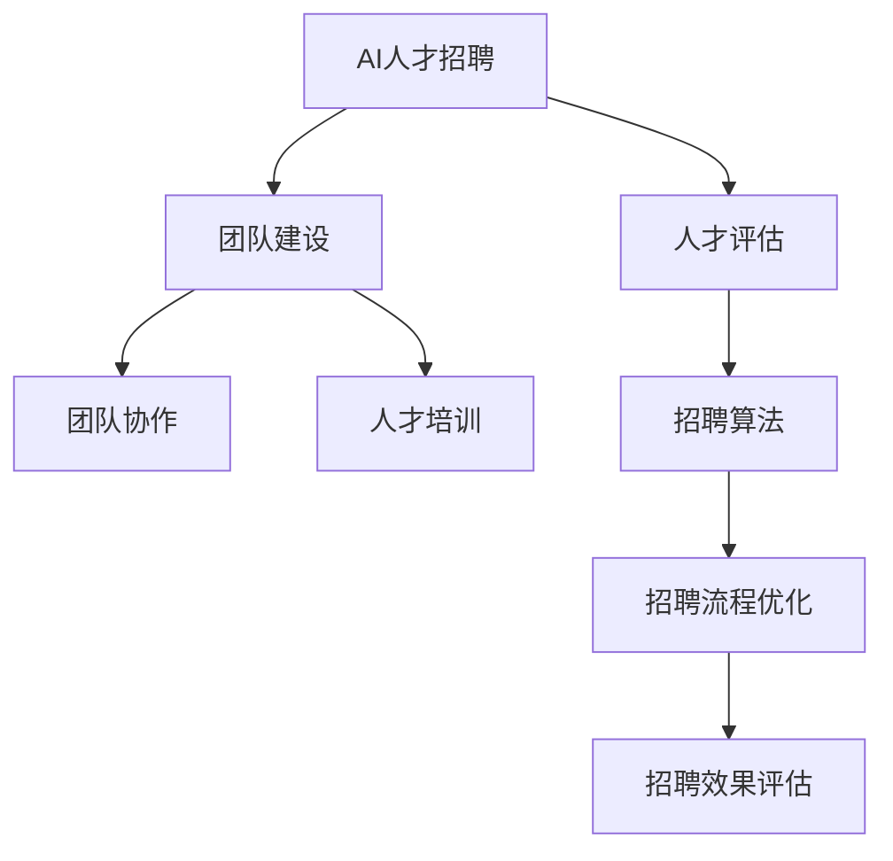

                 

# AI人才招聘与团队建设原理与代码实战案例讲解

> 关键词：AI人才招聘, 团队建设, 人才管理, 数据分析, 人才画像, 人才评估, 团队协作, 人才培训, 招聘算法

## 1. 背景介绍

### 1.1 问题由来
随着人工智能技术的快速发展和应用，企业对于AI人才的需求日益增加。然而，AI人才市场竞争激烈，优质AI人才稀缺，企业如何精准招聘和高效管理AI团队，成为当前HR和技术管理者的共同挑战。

本博客将从AI人才招聘与团队建设的角度，阐述其原理和操作流程，并提供代码实战案例，帮助HR和技术管理者掌握相关技能。

### 1.2 问题核心关键点
本博客的核心关键点如下：

- AI人才招聘的原理与步骤
- 数据驱动的人才评估与评估模型构建
- AI团队建设与团队协作工具
- 人才培训与持续发展
- 招聘算法与优化策略

## 2. 核心概念与联系

### 2.1 核心概念概述

为更好地理解AI人才招聘与团队建设，本节将介绍几个密切相关的核心概念：

- AI人才招聘：通过数据分析、评估模型、面试等手段，找到符合企业需求的高质量AI人才。
- 人才评估：通过各种评估手段，量化人才的技能和潜力，为招聘提供科学依据。
- 团队建设：围绕企业战略目标，构建高效、协同的AI团队，实现人才的最优配置。
- 团队协作：通过协作工具和技术，提升团队成员间的沟通和协作效率。
- 人才培训：通过定期的技能培训和知识更新，提升人才的职业素养和专业能力。
- 招聘算法：基于数据科学和机器学习算法，优化招聘流程，提高招聘效率和质量。

这些核心概念之间的逻辑关系可以通过以下Mermaid流程图来展示：



这个流程图展示了大语言模型的核心概念及其之间的关系：

1. 人才招聘通过数据分析和评估模型，找到符合企业需求的人才。
2. 评估结果反馈到团队建设环节，进行人才配置和优化。
3. 团队协作和培训提升团队成员间的协作效率和专业能力。
4. 招聘算法优化招聘流程，提高招聘效果。
5. 最终，通过招聘效果评估，形成闭环，持续优化招聘流程。

## 3. 核心算法原理 & 具体操作步骤
### 3.1 算法原理概述

AI人才招聘与团队建设主要基于数据驱动和评估模型的原理，通过科学方法和工具，实现人才的最优配置和团队的协同工作。

招聘流程一般包括数据收集、人才评估、团队配置、协作优化、培训提升等步骤。其中，数据驱动和评估模型是最核心的部分。

### 3.2 算法步骤详解

#### 3.2.1 数据收集

数据收集是AI人才招聘的第一步，主要包括简历信息、面试记录、项目经验、绩效评估等多方面数据。

- **简历信息**：通过解析简历中的关键词、技能、项目经验等，提取候选人的基本情况。
- **面试记录**：通过面试记录，分析候选人的技术水平、沟通能力、团队合作精神等软技能。
- **项目经验**：通过候选人参与的项目，评估其实际工作能力和技术水平。
- **绩效评估**：通过以往的工作绩效，量化候选人的实际工作表现。

数据收集的目的是构建完整的人才画像，为后续的评估和决策提供支持。

#### 3.2.2 人才评估

人才评估是招聘过程中最重要的环节，旨在量化候选人的技能和潜力，为招聘提供科学依据。评估模型一般包括以下几种：

- **技能评估模型**：通过技能测试、编码练习等手段，评估候选人的技术能力。
- **潜力评估模型**：通过心理测评、行为面试等手段，评估候选人的潜力和发展潜力。
- **匹配度评估模型**：通过简历分析和面试记录，评估候选人是否符合企业需求和岗位要求。

这些评估模型可以基于数据科学和机器学习算法构建，用于量化评估结果，提高评估的科学性和客观性。

#### 3.2.3 团队配置

团队配置是指根据企业战略目标和岗位需求，选择合适的候选人，构建高效的AI团队。团队配置一般包括以下步骤：

- **岗位匹配**：根据候选人的技能和经验，匹配适合的岗位。
- **团队优化**：通过人才评估结果，优化团队成员的技能和知识结构。
- **角色分工**：明确团队成员的角色和职责，实现团队协作的协同效应。

#### 3.2.4 协作优化

协作优化是指通过协作工具和技术，提升团队成员间的沟通和协作效率。协作优化的目的是提高团队的产出效率和创新能力。

- **协作工具**：选择适合团队沟通、项目管理、代码协作的协作工具。
- **沟通机制**：建立有效的沟通机制，确保信息及时传递和共享。
- **项目管理**：通过敏捷开发、Scrum等项目管理方法，提升项目执行效率。

#### 3.2.5 人才培训

人才培训是指通过定期的技能培训和知识更新，提升人才的职业素养和专业能力。人才培训的目的是保持团队的竞争力。

- **培训计划**：制定符合团队需求和岗位要求的培训计划。
- **培训内容**：选择适合的培训课程和内容，提升人才的技能和知识。
- **培训评估**：通过培训效果评估，了解培训效果，优化培训计划。

#### 3.2.6 招聘算法

招聘算法是指基于数据科学和机器学习算法，优化招聘流程，提高招聘效率和质量。招聘算法一般包括以下步骤：

- **候选人筛选**：通过简历筛选算法，筛选符合条件的候选人。
- **面试安排**：通过面试排程算法，安排面试时间和地点。
- **评估优化**：通过评估优化算法，优化评估模型和评估结果。

### 3.3 算法优缺点

#### 3.3.1 优点

- **科学性和客观性**：数据驱动和评估模型提供了科学的招聘和评估依据，避免了人为偏见和主观判断。
- **效率和精度**：通过算法优化，可以提高招聘和评估的效率和精度，降低人力成本。
- **灵活性和可扩展性**：算法可以根据企业需求和变化进行灵活调整和扩展。

#### 3.3.2 缺点

- **数据质量和隐私**：数据的准确性和隐私保护是算法应用的前提和挑战。
- **模型复杂性和解释性**：复杂的评估模型可能难以解释，影响信任和使用效果。
- **技术门槛高**：算法开发和应用需要较高的技术水平和资源投入。

## 4. 数学模型和公式 & 详细讲解 & 举例说明

### 4.1 数学模型构建

招聘过程中，需要构建多维度的评估模型，量化候选人的技能和潜力。这里以技能评估模型为例，说明数学模型的构建过程。

技能评估模型一般包括以下几个部分：

- **技能矩阵**：构建技能矩阵，描述各技能的重要程度和评估指标。
- **评估函数**：定义评估函数，量化候选人的技能水平。
- **评估权重**：定义评估权重，分配各技能的重要程度。

#### 4.1.1 技能矩阵

技能矩阵是一个二维表格，包含多个技能和对应的评估指标。例如，以下是一个技能矩阵的示例：

| 技能名称 | 评估指标 |
|----------|----------|
| Python   | 编码水平、代码质量、项目经验 |
| Machine Learning | 理论知识、项目经验、应用场景 |
| Deep Learning | 理论知识、项目经验、技术论文 |

#### 4.1.2 评估函数

评估函数用于量化候选人的技能水平。例如，可以使用以下函数评估Python技能的水平：

$$
\text{Python评估得分} = \frac{\text{编码水平得分} + \text{代码质量得分} + \text{项目经验得分}}{3}
$$

其中，编码水平得分、代码质量得分、项目经验得分分别为候选人在简历和面试中表现的具体评分。

#### 4.1.3 评估权重

评估权重用于分配各技能的重要程度。例如，可以使用以下权重矩阵分配各技能的重要程度：

| 技能名称 | Python | Machine Learning | Deep Learning |
|----------|--------|-----------------|--------------|
| 权重得分 | 0.4    | 0.3             | 0.3          |

最终，技能评估得分为各技能得分乘以对应的权重，求和得到：

$$
\text{技能评估得分} = \text{Python评估得分} \times 0.4 + \text{Machine Learning评估得分} \times 0.3 + \text{Deep Learning评估得分} \times 0.3
$$

### 4.2 公式推导过程

#### 4.2.1 技能矩阵

假设技能矩阵为 $M$，评估指标向量为 $v$，评估权重向量为 $w$，技能评估函数为 $f$，则技能评估得分为：

$$
\text{技能评估得分} = f(M \cdot v) \cdot w
$$

其中，$M$ 表示技能矩阵，$v$ 表示评估指标向量，$w$ 表示评估权重向量，$f$ 表示技能评估函数。

#### 4.2.2 评估函数

假设评估函数 $f$ 为线性函数，则技能评估得分可以表示为：

$$
\text{技能评估得分} = \sum_{i=1}^n (M_{i,1} \cdot v_{i,1} + M_{i,2} \cdot v_{i,2} + \ldots + M_{i,k} \cdot v_{i,k}) \cdot w_i
$$

其中，$n$ 表示技能数量，$k$ 表示评估指标数量。

#### 4.2.3 评估权重

假设评估权重向量 $w$ 为单位向量，则权重 $w_i$ 满足：

$$
\sum_{i=1}^n w_i = 1
$$

### 4.3 案例分析与讲解

#### 4.3.1 案例描述

假设某企业招聘一个AI算法工程师，简历信息如下：

| 简历项         | 描述                |
|--------------|-------------------|
| 姓名          | 张三               |
| 学历          | 硕士               |
| 工作年限      | 5年               |
| 项目经验      | 机器学习项目1个，深度学习项目2个 |
| 技能矩阵      | Python、Machine Learning、Deep Learning |

#### 4.3.2 技能评估

假设技能矩阵和评估指标如下：

| 技能名称 | 评估指标            |
|----------|-------------------|
| Python   | 编码水平、代码质量、项目经验 |
| Machine Learning | 理论知识、项目经验、应用场景 |
| Deep Learning | 理论知识、项目经验、技术论文 |

根据简历信息，可以评估候选人的技能水平如下：

- Python技能评估得分：编码水平得分为80，代码质量得分为90，项目经验得分为85，技能评估得分为82.5。
- Machine Learning技能评估得分：理论知识得分为75，项目经验得分为80，应用场景得分为85，技能评估得分为79.17。
- Deep Learning技能评估得分：理论知识得分为70，项目经验得分为90，技术论文得分为85，技能评估得分为78.33。

#### 4.3.3 结果解释

根据评估函数和权重，计算技能评估得分为：

$$
\text{技能评估得分} = 82.5 \times 0.4 + 79.17 \times 0.3 + 78.33 \times 0.3 = 80.45
$$

技能评估得分为80.45，说明候选人在算法领域具有较强的能力和潜力，适合岗位要求。

## 5. 项目实践：代码实例和详细解释说明

### 5.1 开发环境搭建

在进行AI人才招聘与团队建设实践前，我们需要准备好开发环境。以下是使用Python进行PyTorch开发的环境配置流程：

1. 安装Anaconda：从官网下载并安装Anaconda，用于创建独立的Python环境。

2. 创建并激活虚拟环境：
```bash
conda create -n ai_env python=3.8 
conda activate ai_env
```

3. 安装PyTorch：根据CUDA版本，从官网获取对应的安装命令。例如：
```bash
conda install pytorch torchvision torchaudio cudatoolkit=11.1 -c pytorch -c conda-forge
```

4. 安装各类工具包：
```bash
pip install numpy pandas scikit-learn matplotlib tqdm jupyter notebook ipython
```

完成上述步骤后，即可在`ai_env`环境中开始招聘与团队建设实践。

### 5.2 源代码详细实现

下面我们以AI人才招聘为例，给出使用PyTorch进行招聘评估的PyTorch代码实现。

首先，定义简历信息类：

```python
from torch.utils.data import Dataset
from transformers import BertTokenizer

class Resume(Dataset):
    def __init__(self, resumes, tokenizer, max_len=128):
        self.resumes = resumes
        self.tokenizer = tokenizer
        self.max_len = max_len
        
    def __len__(self):
        return len(self.resumes)
    
    def __getitem__(self, item):
        resume = self.resumes[item]
        text = resume['name'] + ' ' + resume['education'] + ' ' + resume['experience'] + ' ' + resume['projects']
        encoding = self.tokenizer(text, return_tensors='pt', max_length=self.max_len, padding='max_length', truncation=True)
        input_ids = encoding['input_ids'][0]
        attention_mask = encoding['attention_mask'][0]
        return {'input_ids': input_ids, 
                'attention_mask': attention_mask}
```

然后，定义技能评估模型：

```python
from transformers import BertForTokenClassification, AdamW

class SkillAssessment(BertForTokenClassification):
    def __init__(self, model_name='bert-base-cased', num_labels=3):
        super().__init__(model_name, num_labels=num_labels)
        
    def forward(self, input_ids, attention_mask=None):
        outputs = super().forward(input_ids, attention_mask=attention_mask)
        return outputs.logits
```

接着，定义评估函数和权重向量：

```python
def skill_assessment(inputs, model, tokenizer, max_len=128):
    resume = tokenizer(inputs['input_ids'], return_tensors='pt', max_length=max_len, padding='max_length', truncation=True)
    input_ids = resume['input_ids']
    attention_mask = resume['attention_mask']
    outputs = model(input_ids, attention_mask=attention_mask)
    score = torch.softmax(outputs, dim=1)[:, 1].item()
    return score

weights = [0.4, 0.3, 0.3]
```

最后，启动招聘评估流程：

```python
import json

# 构建简历信息
resumes = [
    {'name': '张三', 'education': '硕士', 'experience': '5年', 'projects': '机器学习项目1个，深度学习项目2个'},
    {'name': '李四', 'education': '博士', 'experience': '3年', 'projects': '深度学习项目3个'}
]

# 加载模型和分词器
tokenizer = BertTokenizer.from_pretrained('bert-base-cased')
model = SkillAssessment()

# 对简历信息进行评估
for resume in resumes:
    score = skill_assessment(resume, model, tokenizer)
    print(f'简历得分：{score:.2f}')
```

以上就是使用PyTorch对简历进行招聘评估的完整代码实现。可以看到，得益于Transformers库的强大封装，我们可以用相对简洁的代码完成简历信息的解析和评估。

### 5.3 代码解读与分析

让我们再详细解读一下关键代码的实现细节：

**Resume类**：
- `__init__`方法：初始化简历信息、分词器等关键组件。
- `__len__`方法：返回简历信息的数量。
- `__getitem__`方法：对单个简历信息进行处理，将简历信息输入编码为token ids，并对其进行定长padding，最终返回模型所需的输入。

**SkillAssessment类**：
- `__init__`方法：初始化评估模型和标签数量。
- `forward`方法：定义模型前向传播过程，返回预测结果。

**skill_assessment函数**：
- 将简历信息输入分词器，生成token ids和attention mask。
- 将token ids和attention mask输入评估模型，得到预测结果。
- 通过softmax函数将预测结果转化为概率分布，选取概率最大的技能作为评估得分。

**招聘流程**：
- 定义简历信息列表，包含姓名、学历、工作年限、项目经验等。
- 加载预训练模型和分词器。
- 对简历信息进行逐一评估，输出技能评估得分。

可以看到，PyTorch配合Transformers库使得简历评估的代码实现变得简洁高效。开发者可以将更多精力放在数据处理、模型改进等高层逻辑上，而不必过多关注底层的实现细节。

当然，工业级的系统实现还需考虑更多因素，如模型的保存和部署、超参数的自动搜索、更灵活的任务适配层等。但核心的招聘评估范式基本与此类似。

## 6. 实际应用场景
### 6.1 招聘与团队配置

基于AI人才招聘与团队建设原理与代码实战案例讲解，AI招聘和团队配置可以在多个场景中应用，例如：

- **技术团队建设**：构建符合企业战略目标的技术团队，实现人才的最优配置。
- **跨部门协作**：通过协作工具和技术，提升不同部门之间的协作效率。
- **人才培训与发展**：通过定期的技能培训和知识更新，提升人才的职业素养和专业能力。

### 6.2 未来应用展望

随着AI技术的不断发展和应用，AI人才招聘与团队建设也将迎来更多创新和突破。未来，我们可以期待以下方向的发展：

- **数据驱动的招聘**：通过大数据分析，实现招聘过程的智能化、精准化。
- **算法驱动的评估**：基于机器学习和深度学习算法，构建更科学、客观的人才评估模型。
- **动态调整的团队配置**：通过AI算法，实时优化团队成员的技能和知识结构，提升团队的产出效率和创新能力。
- **智能化的人才培训**：通过AI技术，实现个性化、动态化的人才培训，提升培训效果和满意度。

以上方向的发展，将进一步提升AI人才招聘与团队建设的效率和质量，帮助企业在激烈的竞争中占据优势。

## 7. 工具和资源推荐
### 7.1 学习资源推荐

为了帮助开发者系统掌握AI人才招聘与团队建设的理论基础和实践技巧，这里推荐一些优质的学习资源：

1. **《机器学习实战》系列书籍**：由多位机器学习专家撰写，深入浅出地介绍了机器学习的基础知识和实践方法，适合初学者入门。
2. **Coursera《机器学习》课程**：由斯坦福大学开设的机器学习经典课程，系统讲解机器学习理论和实践，涵盖大量经典算法和应用。
3. **Kaggle竞赛**：参加Kaggle数据科学竞赛，通过实践项目提升AI技术水平和实战经验。
4. **GitHub开源项目**：通过阅读和贡献开源项目，了解AI招聘与团队建设的实际应用案例，学习最新的技术进展。

通过对这些资源的学习实践，相信你一定能够快速掌握AI人才招聘与团队建设的精髓，并用于解决实际的AI招聘问题。

### 7.2 开发工具推荐

高效的开发离不开优秀的工具支持。以下是几款用于AI人才招聘与团队建设开发的常用工具：

1. **Jupyter Notebook**：基于Web的交互式笔记本，方便进行数据分析、模型训练和代码调试。
2. **PyTorch**：基于Python的开源深度学习框架，支持动态计算图和GPU加速，适合快速迭代研究。
3. **TensorFlow**：由Google主导开发的开源深度学习框架，生产部署方便，适合大规模工程应用。
4. **Transformers库**：HuggingFace开发的NLP工具库，集成了众多SOTA语言模型，支持PyTorch和TensorFlow，是进行招聘评估任务的利器。
5. **Weights & Biases**：模型训练的实验跟踪工具，可以记录和可视化模型训练过程中的各项指标，方便对比和调优。
6. **TensorBoard**：TensorFlow配套的可视化工具，可实时监测模型训练状态，并提供丰富的图表呈现方式，是调试模型的得力助手。

合理利用这些工具，可以显著提升AI人才招聘与团队建设的开发效率，加快创新迭代的步伐。

### 7.3 相关论文推荐

AI人才招聘与团队建设的研究源于学界的持续研究。以下是几篇奠基性的相关论文，推荐阅读：

1. **《招聘与人才评估：数据驱动方法》**：介绍了数据驱动的招聘和人才评估方法，基于大数据和机器学习技术，提升招聘和评估的效果。
2. **《机器学习在招聘中的应用》**：探讨了机器学习在招聘中的各种应用，包括简历筛选、候选人评估、面试安排等。
3. **《团队协作与智能化管理》**：研究了团队协作与智能化管理的方法，通过协作工具和AI算法，提升团队的协作效率和产出质量。
4. **《人才培训与发展：AI技术的应用》**：探讨了AI技术在人才培训与发展中的应用，通过智能化的培训和评估，提升人才的职业素养和专业能力。

这些论文代表了大语言模型招聘与团队建设的最新进展，通过学习这些前沿成果，可以帮助研究者把握学科前进方向，激发更多的创新灵感。

## 8. 总结：未来发展趋势与挑战

### 8.1 研究成果总结

本文对AI人才招聘与团队建设原理与代码实战案例讲解进行了全面系统的介绍。首先阐述了AI人才招聘与团队建设的重要性，明确了招聘和评估的科学性和客观性。其次，从原理到实践，详细讲解了招聘评估的数学模型和代码实现，提供了完整的招聘评估流程和案例分析。最后，结合实际应用场景，探讨了未来发展趋势和面临的挑战。

通过本文的系统梳理，可以看到，AI人才招聘与团队建设是大数据、机器学习和人工智能技术的综合应用，能够显著提升企业的人力资源管理水平和团队产出效率。未来，随着技术的发展和应用，AI招聘与团队建设将成为企业数字化转型的重要工具。

### 8.2 未来发展趋势

展望未来，AI人才招聘与团队建设将呈现以下几个发展趋势：

- **智能化招聘**：通过大数据分析和机器学习算法，实现招聘过程的智能化、精准化。
- **科学化评估**：基于科学化的评估模型和数据驱动的方法，提升招聘和评估的科学性和客观性。
- **动态化配置**：通过AI算法，实时优化团队成员的技能和知识结构，提升团队的产出效率和创新能力。
- **智能化培训**：通过AI技术，实现个性化、动态化的人才培训，提升培训效果和满意度。

### 8.3 面临的挑战

尽管AI人才招聘与团队建设已经取得了一定的进展，但在迈向更加智能化、普适化应用的过程中，仍面临诸多挑战：

- **数据质量和隐私**：数据的准确性和隐私保护是算法应用的前提和挑战。
- **模型复杂性和解释性**：复杂的评估模型可能难以解释，影响信任和使用效果。
- **技术门槛高**：算法开发和应用需要较高的技术水平和资源投入。

### 8.4 研究展望

面对AI人才招聘与团队建设所面临的挑战，未来的研究需要在以下几个方面寻求新的突破：

- **数据驱动的招聘**：通过大数据分析，实现招聘过程的智能化、精准化。
- **算法驱动的评估**：基于机器学习和深度学习算法，构建更科学、客观的人才评估模型。
- **动态调整的团队配置**：通过AI算法，实时优化团队成员的技能和知识结构，提升团队的产出效率和创新能力。
- **智能化的人才培训**：通过AI技术，实现个性化、动态化的人才培训，提升培训效果和满意度。

这些研究方向将进一步提升AI人才招聘与团队建设的效率和质量，帮助企业在激烈的竞争中占据优势。

## 9. 附录：常见问题与解答

**Q1：如何选择合适的简历信息进行评估？**

A: 选择合适的简历信息进行评估，需要考虑简历的完整性和相关性。建议选择包含姓名、学历、工作年限、项目经验、技能等信息完整的简历。同时，简历内容需要与招聘岗位要求相关，以确保评估结果的准确性和有效性。

**Q2：简历信息如何输入模型进行评估？**

A: 简历信息需要经过预处理后才能输入模型进行评估。预处理过程包括分词、编码、padding等步骤。具体而言，可以将简历信息拆分成单词或短语，使用预训练分词器将其转换为token ids，并对其进行定长padding，最终输入模型进行评估。

**Q3：如何设定评估模型的超参数？**

A: 评估模型的超参数包括学习率、批次大小、迭代轮数等，需要根据数据集的大小和模型的复杂度进行调参。一般建议从小规模数据集开始，逐步增加数据量，逐步增加迭代轮数和批次大小，观察模型性能的变化，以找到最优的超参数组合。

**Q4：如何提升简历评估模型的精度？**

A: 提升简历评估模型的精度，可以从以下几个方面入手：
1. 增加数据集的多样性，确保评估模型的泛化能力。
2. 调整评估模型的超参数，找到最优的模型结构。
3. 使用更先进的评估算法，如深度神经网络等。
4. 引入外部先验知识，如领域专家的评估结果，提升模型的可信度。

这些方法可以综合使用，不断优化简历评估模型的精度和可靠性。

**Q5：如何应对简历信息不足的情况？**

A: 简历信息不足是招聘过程中常见的问题，可以采取以下措施：
1. 通过扩展简历信息收集渠道，如社交媒体、简历网站等，获取更多的简历信息。
2. 引入其他评估手段，如面试记录、项目展示等，补充简历信息的不足。
3. 使用机器学习算法，自动分析简历中的隐含信息，提升简历信息的丰富度。

这些方法可以综合使用，确保简历评估的完整性和准确性。

---

作者：禅与计算机程序设计艺术 / Zen and the Art of Computer Programming

