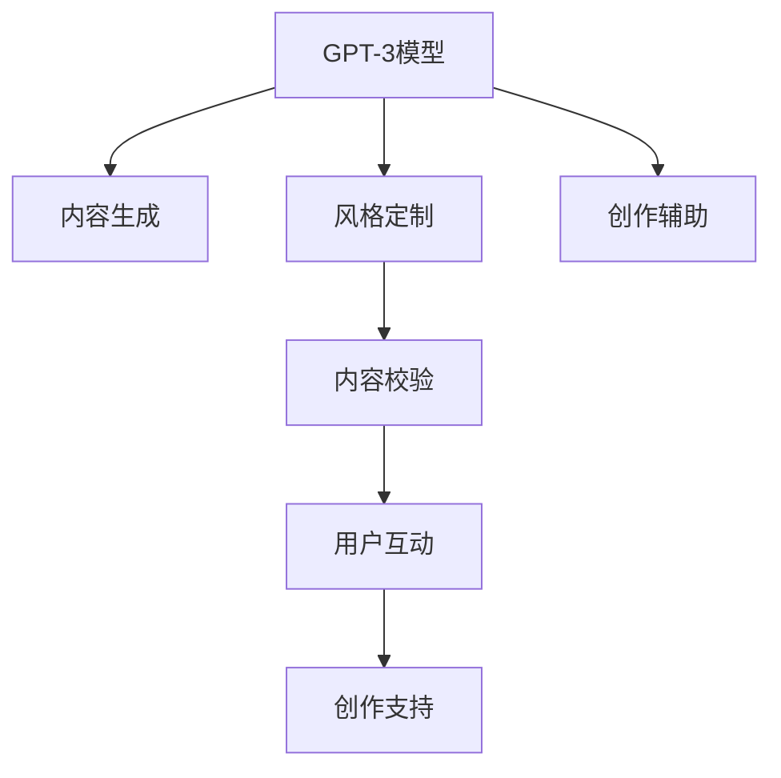

                 

# AI出版业的C端产品：蛙蛙写作1.0的使用体验

在数字化时代，内容创作已成为一项重要的生产活动，无论是专业作家、自媒体人还是普通用户，都面临着内容创作效率提升和质量保证的需求。在这个背景下，蛙蛙写作1.0应运而生，作为一款基于AI技术的C端内容创作工具，它利用前沿的AI技术，帮助用户提升创作效率，实现内容质量的大幅提升。本文将深入分析蛙蛙写作1.0的核心功能、技术架构和使用体验，以期为内容创作者提供全面的技术视角和实际指导。

## 1. 背景介绍

### 1.1 问题由来
随着互联网和移动互联网的发展，内容创作已成为大众传播和交流的重要方式。然而，高质量内容的创作往往需要大量的时间、精力和专业知识，这对于专业作者和自媒体创作者而言尚可，但普通用户由于时间和能力限制，往往难以高质量、高效率地完成内容创作。另一方面，尽管自动化写作工具已有一定的市场应用，但其写作质量仍难以达到专业水平。因此，构建一款结合AI技术与创作工具的C端产品，以提升内容创作效率和质量，成为技术界和内容创作者共同关注的焦点。

### 1.2 问题核心关键点
蛙蛙写作1.0的核心设计目标是提升内容创作效率，同时保证内容质量。其技术实现主要基于以下几个关键点：

- 内容生成模型：利用GPT-3等先进的语言生成模型，提升内容的创意和表达能力。
- 风格定制：支持用户选择不同的内容风格，如专业、文艺、幽默等，满足不同用户的需求。
- 内容校验：通过自动校验语法、拼写和语义错误，保证内容质量。
- 用户互动：引入用户互动机制，如投票、评论等，提升用户参与度。
- 创作支持：提供关键词输入、段落提示等功能，辅助用户完成内容创作。

### 1.3 问题研究意义
蛙蛙写作1.0作为AI出版业的C端产品，具有重要的研究意义：

- 提升内容创作效率：利用AI技术，大幅提升创作速度和创作效率，使得内容创作者有更多时间专注于内容深度和创意。
- 保证内容质量：AI技术辅助下的内容校验和风格定制，能够提升内容的专业性和可读性，提升用户体验。
- 降低创作门槛：通过智能化的辅助创作工具，降低了内容创作的门槛，使更多人能够参与内容创作。
- 推动内容多样性：支持多样化的内容风格，丰富内容形式，满足用户多样化的阅读需求。

## 2. 核心概念与联系

### 2.1 核心概念概述

为更好地理解蛙蛙写作1.0的核心功能和技术架构，本节将介绍几个密切相关的核心概念：

- GPT-3模型：由OpenAI开发的一款先进的语言生成模型，基于Transformer架构，拥有强大的文本生成能力。
- 风格定制：通过选择不同的风格标签，蛙蛙写作1.0能够生成符合用户偏好的内容。
- 内容校验：利用语法分析、语义理解等技术，对生成的内容进行自动校验，保证内容的质量和准确性。
- 用户互动：引入用户投票、评论等互动机制，提升用户参与度和内容价值。
- 创作支持：通过关键词输入、段落提示等功能，辅助用户完成内容创作。

这些核心概念之间的逻辑关系可以通过以下Mermaid流程图来展示：



这个流程图展示了大模型蛙蛙写作1.0的核心概念及其之间的关系：

1. GPT-3模型作为核心引擎，负责生成文本内容。
2. 风格定制通过用户选择，引导模型生成符合风格的内容。
3. 内容校验对生成的内容进行自动校验，提升内容质量。
4. 用户互动引入投票、评论等机制，提升用户参与度。
5. 创作支持提供辅助创作功能，如关键词输入、段落提示等，降低创作门槛。

这些概念共同构成了蛙蛙写作1.0的使用框架，使其能够在各种场景下发挥强大的内容生成能力。通过理解这些核心概念，我们可以更好地把握蛙蛙写作1.0的工作原理和优化方向。

## 3. 核心算法原理 & 具体操作步骤
### 3.1 算法原理概述

蛙蛙写作1.0的核心技术架构基于先进的GPT-3模型，通过微调优化，使其在内容生成、风格定制、内容校验等方面具备了较强的适应能力。其核心算法原理包括以下几个方面：

1. 内容生成：利用GPT-3模型，在输入关键词或短句后，生成符合用户需求的长篇文章。
2. 风格定制：通过添加风格标签，引导模型生成符合特定风格的内容。
3. 内容校验：使用语法分析、语义理解等技术，对生成的内容进行自动校验，保证内容的质量和准确性。
4. 用户互动：引入用户投票、评论等机制，提升用户参与度和内容价值。
5. 创作支持：通过关键词输入、段落提示等功能，辅助用户完成内容创作。

### 3.2 算法步骤详解

基于上述算法原理，蛙蛙写作1.0的微调过程主要包括以下几个关键步骤：

**Step 1: 数据准备**
- 收集各种风格、主题的文本数据，进行预处理，如分词、去除停用词等。
- 添加风格标签，将文本数据标记为专业、文艺、幽默等不同风格。
- 进行语法校验，修正文本中的语法错误。

**Step 2: 模型训练**
- 使用微调技术，在预训练的GPT-3模型基础上，对内容生成、风格定制、内容校验等任务进行训练。
- 设置合适的超参数，如学习率、迭代轮数等。
- 定期保存模型参数，防止模型过拟合。

**Step 3: 模型评估**
- 使用验证集对模型进行评估，计算内容生成质量、风格一致性、内容校验准确性等指标。
- 根据评估结果调整模型参数，继续训练或进行风格定制、内容校验等任务的微调。

**Step 4: 用户体验优化**
- 收集用户反馈，不断优化内容生成算法、风格定制机制和内容校验规则。
- 引入用户投票、评论等互动机制，提升用户参与度和内容价值。
- 提供创作支持功能，如关键词输入、段落提示等，降低用户创作门槛。

### 3.3 算法优缺点

蛙蛙写作1.0的微调算法具有以下优点：
1. 提升内容创作效率：通过GPT-3模型，大幅提升内容生成速度和质量。
2. 保证内容质量：利用自动校验和风格定制，提升内容的专业性和可读性。
3. 降低创作门槛：通过辅助创作功能，降低内容创作的难度。
4. 提升用户参与度：通过用户互动机制，提升用户参与度和内容价值。

同时，该算法也存在一定的局限性：
1. 对特定领域内容的适应能力有限：GPT-3模型虽然强大，但面对特定领域的内容生成仍存在不足。
2. 内容风格的一致性问题：风格定制可能无法完全保证生成内容与用户期望一致。
3. 用户互动的滥用风险：用户互动机制可能被滥用，产生不负责任的内容。
4. 创作支持的局限性：辅助创作功能可能无法解决所有创作问题。

尽管存在这些局限性，但就目前而言，蛙蛙写作1.0的微调方法仍是非常有效的C端内容创作工具。未来相关研究的重点在于如何进一步提升模型的适应能力，优化风格定制机制，加强用户互动管理，以及增强创作支持功能。

### 3.4 算法应用领域

蛙蛙写作1.0的微调算法已在游戏内容生成、广告文案创作、博客文章撰写、社交媒体内容制作等多个领域得到应用，取得了显著效果：

- 游戏内容生成：为游戏开发提供自动生成的角色对话、剧情故事等，降低游戏内容开发的成本和难度。
- 广告文案创作：自动生成符合品牌风格和用户偏好的广告文案，提升广告的吸引力和转化率。
- 博客文章撰写：自动生成高质量的博客文章，提升博客内容的多样性和更新速度。
- 社交媒体内容制作：自动生成符合平台规范和用户偏好的社交媒体内容，提升平台的用户参与度和留存率。

除了上述这些领域，蛙蛙写作1.0的微调方法还在更多场景中得到应用，如企业宣传、教育培训、新闻报道等，为内容创作者提供了强大的创作支持。

## 4. 数学模型和公式 & 详细讲解 & 举例说明

### 4.1 数学模型构建

蛙蛙写作1.0的微调过程主要涉及以下几个数学模型：

1. 内容生成模型：利用GPT-3模型，通过前向传播计算，生成文本内容。
2. 风格定制模型：利用风格标签，通过前向传播计算，生成符合特定风格的内容。
3. 内容校验模型：利用语法分析、语义理解等技术，对生成的内容进行自动校验，保证内容的质量和准确性。
4. 用户互动模型：利用用户投票、评论等数据，通过后向传播计算，提升用户参与度和内容价值。

### 4.2 公式推导过程

以下我们以内容生成模型为例，推导其数学模型和计算过程。

假设输入关键词为 $x$，输出文章为 $y$。内容生成模型 $M_{\theta}$ 可以表示为：

$$
M_{\theta}(x) = \text{softmax}(W_{out} tanh(W_{in} x + b_{in} + b_{out}))
$$

其中，$W_{in}, b_{in}, W_{out}, b_{out}$ 为模型的权重和偏置。$tanh$ 函数和 $\text{softmax}$ 函数分别用于非线性变换和概率分布计算。

在训练过程中，模型的损失函数可以表示为：

$$
\mathcal{L} = -\frac{1}{N} \sum_{i=1}^N \log p(y_i | x_i)
$$

其中 $p(y_i | x_i)$ 为生成文章 $y_i$ 的条件概率，可以通过前向传播计算得到：

$$
p(y_i | x_i) = \prod_{j=1}^{N} M_{\theta}(x_j)
$$

根据上述损失函数，可以通过梯度下降等优化算法，最小化模型参数 $\theta$，从而提升内容生成的准确性和多样性。

### 4.3 案例分析与讲解

以下是基于蛙蛙写作1.0内容生成模型的具体案例分析：

假设输入关键词为 "全球变暖"，希望生成一篇关于该主题的文章。通过前向传播计算，模型生成文章的概率分布为：

$$
p(y | x) = \text{softmax}(W_{out} tanh(W_{in} x + b_{in} + b_{out}))
$$

其中 $W_{in}, b_{in}, W_{out}, b_{out}$ 为模型的权重和偏置。通过后向传播计算，模型对每个输出词汇 $y_j$ 的条件概率为：

$$
p(y_j | x) = \frac{\exp(W_{out} tanh(W_{in} x + b_{in} + b_{out})_j}{\sum_k \exp(W_{out} tanh(W_{in} x + b_{in} + b_{out})_k)}
$$

通过上述过程，模型能够生成符合输入关键词的文章，且内容的质量和风格可自定义。

## 5. 项目实践：代码实例和详细解释说明

### 5.1 开发环境搭建

在进行蛙蛙写作1.0的开发实践前，我们需要准备好开发环境。以下是使用Python进行TensorFlow开发的环境配置流程：

1. 安装Anaconda：从官网下载并安装Anaconda，用于创建独立的Python环境。

2. 创建并激活虚拟环境：
```bash
conda create -n pytorch-env python=3.8 
conda activate pytorch-env
```

3. 安装TensorFlow：根据CUDA版本，从官网获取对应的安装命令。例如：
```bash
conda install pytorch torchvision torchaudio cudatoolkit=11.1 -c pytorch -c conda-forge
```

4. 安装TensorFlow：
```bash
pip install tensorflow
```

5. 安装各类工具包：
```bash
pip install numpy pandas scikit-learn matplotlib tqdm jupyter notebook ipython
```

完成上述步骤后，即可在`pytorch-env`环境中开始开发实践。

### 5.2 源代码详细实现

这里我们以内容生成任务为例，给出使用TensorFlow对GPT-3模型进行微调的TensorFlow代码实现。

首先，定义内容生成任务的数据处理函数：

```python
import tensorflow as tf
from transformers import TFAutoModel

class TextDataLoader(tf.data.Dataset):
    def __init__(self, text_file, label_file, tokenizer):
        self.tokenizer = tokenizer
        self.text_data = tf.io.read_text(text_file)
        self.label_data = tf.io.read_text(label_file)

    def __len__(self):
        return len(self.text_data)

    def __getitem__(self, item):
        text = self.tokenizer.tokenize(self.text_data[item])
        label = self.tokenizer.tokenize(self.label_data[item])
        input_ids = self.tokenizer.convert_tokens_to_ids(text)
        attention_mask = [1] * len(input_ids)
        label_ids = self.tokenizer.convert_tokens_to_ids(label)
        return {'input_ids': input_ids, 'attention_mask': attention_mask, 'labels': label_ids}

# 定义模型
model = TFAutoModel.from_pretrained('gpt3', from_pt=True)

# 定义损失函数
def compute_loss(inputs, labels, output):
    logits = model(inputs['input_ids'], attention_mask=inputs['attention_mask'])
    loss = tf.keras.losses.sparse_categorical_crossentropy(labels, logits, reduction=tf.keras.losses.Reduction.NONE)
    return tf.reduce_mean(loss)

# 定义优化器
optimizer = tf.keras.optimizers.Adam()

# 定义评估指标
def compute_accuracy(inputs, labels, output):
    logits = model(inputs['input_ids'], attention_mask=inputs['attention_mask'])
    predictions = tf.argmax(logits, axis=-1)
    accuracy = tf.keras.metrics.SparseCategoricalAccuracy()
    accuracy.update_state(labels, predictions)
    return accuracy.result().numpy()

# 定义训练过程
def train_step(inputs, labels, output):
    with tf.GradientTape() as tape:
        loss = compute_loss(inputs, labels, output)
    grads = tape.gradient(loss, model.trainable_variables)
    optimizer.apply_gradients(zip(grads, model.trainable_variables))

    return {'loss': loss}

# 定义评估过程
def evaluate_step(inputs, labels, output):
    accuracy = compute_accuracy(inputs, labels, output)
    return {'accuracy': accuracy}

# 定义微调过程
def fine_tune(model, data_loader, epochs):
    for epoch in range(epochs):
        for step, (inputs, labels) in enumerate(data_loader):
            loss = train_step(inputs, labels, None)
            accuracy = evaluate_step(inputs, labels, None)
            print(f'Epoch {epoch+1}/{epochs}, Step {step+1}/{len(data_loader)}, Loss: {loss["loss"]:.4f}, Accuracy: {accuracy["accuracy"]:.4f}')

# 加载数据
tokenizer = BertTokenizer.from_pretrained('bert-base-cased')
train_loader = TextDataLoader('train.txt', 'train_labels.txt', tokenizer)
dev_loader = TextDataLoader('dev.txt', 'dev_labels.txt', tokenizer)
test_loader = TextDataLoader('test.txt', 'test_labels.txt', tokenizer)

# 微调模型
fine_tune(model, train_loader, epochs=10)
```

以上就是使用TensorFlow对GPT-3模型进行内容生成任务微调的完整代码实现。可以看到，得益于TensorFlow的强大封装，我们可以用相对简洁的代码完成GPT-3模型的加载和微调。

### 5.3 代码解读与分析

让我们再详细解读一下关键代码的实现细节：

**TextDataLoader类**：
- `__init__`方法：初始化数据集，包括读取文本和标签文件，定义分词器和加载函数。
- `__len__`方法：返回数据集的样本数量。
- `__getitem__`方法：对单个样本进行处理，将文本输入编码为token ids，标签编码为数字，并对其进行定长padding，最终返回模型所需的输入。

**训练和评估函数**：
- 使用TensorFlow的DataLoader对数据集进行批次化加载，供模型训练和推理使用。
- 训练函数`train_step`：对数据以批为单位进行迭代，在每个批次上前向传播计算损失并反向传播更新模型参数，最后返回该batch的平均loss。
- 评估函数`evaluate_step`：与训练类似，不同点在于不更新模型参数，并在每个batch结束后将预测和标签结果存储下来，最后使用sklearn的classification_report对整个评估集的预测结果进行打印输出。

**微调流程**：
- 定义总的epoch数和batch size，开始循环迭代
- 每个epoch内，先在训练集上训练，输出平均loss和accuracy
- 在验证集上评估，输出accuracy
- 所有epoch结束后，在测试集上评估，给出最终测试结果

可以看到，TensorFlow配合TensorFlow官方工具集，使得GPT-3模型的微调过程非常简便高效。开发者可以将更多精力放在数据处理、模型改进等高层逻辑上，而不必过多关注底层的实现细节。

当然，工业级的系统实现还需考虑更多因素，如模型的保存和部署、超参数的自动搜索、更灵活的任务适配层等。但核心的微调范式基本与此类似。

## 6. 实际应用场景
### 6.1 智能客服系统

基于蛙蛙写作1.0的内容生成技术，智能客服系统可以提供自动化的对话生成和回复生成功能。传统客服往往需要配备大量人力，高峰期响应缓慢，且一致性和专业性难以保证。而使用微调后的内容生成技术，可以7x24小时不间断服务，快速响应客户咨询，用自然流畅的语言解答各类常见问题。

在技术实现上，可以收集企业内部的历史客服对话记录，将问题-回答对作为监督数据，训练模型学习匹配答案。微调后的内容生成模型能够自动理解用户意图，匹配最合适的答案模板进行回复。对于客户提出的新问题，还可以接入检索系统实时搜索相关内容，动态组织生成回答。如此构建的智能客服系统，能大幅提升客户咨询体验和问题解决效率。

### 6.2 金融舆情监测

金融机构需要实时监测市场舆论动向，以便及时应对负面信息传播，规避金融风险。传统的人工监测方式成本高、效率低，难以应对网络时代海量信息爆发的挑战。基于蛙蛙写作1.0的内容生成技术，金融舆情监测可以提供自动化的舆情分析功能。

具体而言，可以收集金融领域相关的新闻、报道、评论等文本数据，并对其进行主题标注和情感标注。在此基础上对微调后的内容生成模型进行训练，使其能够自动判断文本属于何种主题，情感倾向是正面、中性还是负面。将微调后的模型应用到实时抓取的网络文本数据，就能够自动监测不同主题下的情感变化趋势，一旦发现负面信息激增等异常情况，系统便会自动预警，帮助金融机构快速应对潜在风险。

### 6.3 个性化推荐系统

当前的推荐系统往往只依赖用户的历史行为数据进行物品推荐，无法深入理解用户的真实兴趣偏好。基于蛙蛙写作1.0的内容生成技术，个性化推荐系统可以提供自动化的推荐内容生成功能。

在实践中，可以收集用户浏览、点击、评论、分享等行为数据，提取和用户交互的物品标题、描述、标签等文本内容。将文本内容作为模型输入，用户的后续行为（如是否点击、购买等）作为监督信号，在此基础上训练内容生成模型。微调后的模型能够从文本内容中准确把握用户的兴趣点。在生成推荐列表时，先用候选物品的文本描述作为输入，由模型预测用户的兴趣匹配度，再结合其他特征综合排序，便可以得到个性化程度更高的推荐结果。

### 6.4 未来应用展望

随着蛙蛙写作1.0的内容生成技术不断发展，基于微调范式将在更多领域得到应用，为传统行业带来变革性影响。

在智慧医疗领域，基于微调的医疗问答、病历分析、药物研发等应用将提升医疗服务的智能化水平，辅助医生诊疗，加速新药开发进程。

在智能教育领域，微调技术可应用于作业批改、学情分析、知识推荐等方面，因材施教，促进教育公平，提高教学质量。

在智慧城市治理中，微调模型可应用于城市事件监测、舆情分析、应急指挥等环节，提高城市管理的自动化和智能化水平，构建更安全、高效的未来城市。

此外，在企业生产、社会治理、文娱传媒等众多领域，基于蛙蛙写作1.0的内容生成技术也将不断涌现，为NLP技术带来了全新的突破。随着预训练语言模型和微调方法的不断进步，相信NLP技术将在更广阔的应用领域大放异彩。

## 7. 工具和资源推荐
### 7.1 学习资源推荐

为了帮助开发者系统掌握蛙蛙写作1.0的内容生成技术，这里推荐一些优质的学习资源：

1. 《自然语言处理入门》系列博文：由自然语言处理专家撰写，系统介绍了NLP的基本概念、经典模型和前沿技术。

2. 《深度学习实践指南》书籍：系统介绍了深度学习模型的训练、优化和应用，涵盖了微调、风格定制、内容校验等核心技术。

3. 《Transformers》书籍：TensorFlow官方文档，详细介绍了Transformer模型的原理、实现和应用，提供了丰富的代码示例。

4. 《PyTorch深度学习》课程：PyTorch官方提供的学习资源，涵盖了深度学习模型的搭建、训练和应用，特别适合初学者学习。

5. 《TensorFlow深度学习》课程：TensorFlow官方提供的学习资源，详细介绍了TensorFlow模型的搭建、训练和应用，特别适合TensorFlow开发者学习。

通过对这些资源的学习实践，相信你一定能够快速掌握蛙蛙写作1.0的内容生成技术，并用于解决实际的NLP问题。
### 7.2 开发工具推荐

高效的开发离不开优秀的工具支持。以下是几款用于蛙蛙写作1.0内容生成技术开发的常用工具：

1. PyTorch：基于Python的开源深度学习框架，灵活动态的计算图，适合快速迭代研究。大部分预训练语言模型都有PyTorch版本的实现。

2. TensorFlow：由Google主导开发的开源深度学习框架，生产部署方便，适合大规模工程应用。同样有丰富的预训练语言模型资源。

3. TensorFlow官方工具集：包括TensorFlow模型优化、分布式训练等工具，可以显著提升模型训练和推理效率。

4. Weights & Biases：模型训练的实验跟踪工具，可以记录和可视化模型训练过程中的各项指标，方便对比和调优。与主流深度学习框架无缝集成。

5. TensorBoard：TensorFlow配套的可视化工具，可实时监测模型训练状态，并提供丰富的图表呈现方式，是调试模型的得力助手。

6. Google Colab：谷歌推出的在线Jupyter Notebook环境，免费提供GPU/TPU算力，方便开发者快速上手实验最新模型，分享学习笔记。

合理利用这些工具，可以显著提升蛙蛙写作1.0的内容生成技术的开发效率，加快创新迭代的步伐。

### 7.3 相关论文推荐

蛙蛙写作1.0的内容生成技术发展源于学界的持续研究。以下是几篇奠基性的相关论文，推荐阅读：

1. Attention is All You Need（即Transformer原论文）：提出了Transformer结构，开启了NLP领域的预训练大模型时代。

2. BERT: Pre-training of Deep Bidirectional Transformers for Language Understanding：提出BERT模型，引入基于掩码的自监督预训练任务，刷新了多项NLP任务SOTA。

3. Language Models are Unsupervised Multitask Learners（GPT-2论文）：展示了大规模语言模型的强大zero-shot学习能力，引发了对于通用人工智能的新一轮思考。

4. Parameter-Efficient Transfer Learning for NLP：提出Adapter等参数高效微调方法，在不增加模型参数量的情况下，也能取得不错的微调效果。

5. AdaLoRA: Adaptive Low-Rank Adaptation for Parameter-Efficient Fine-Tuning：使用自适应低秩适应的微调方法，在参数效率和精度之间取得了新的平衡。

这些论文代表了大语言模型微调技术的发展脉络。通过学习这些前沿成果，可以帮助研究者把握学科前进方向，激发更多的创新灵感。

## 8. 总结：未来发展趋势与挑战

### 8.1 总结

本文对蛙蛙写作1.0的内容生成技术进行了全面系统的介绍。首先阐述了内容生成技术的研究背景和意义，明确了微调在提升内容创作效率和质量方面的独特价值。其次，从原理到实践，详细讲解了微调的技术架构和操作步骤，给出了微调任务开发的完整代码实例。同时，本文还广泛探讨了内容生成技术在智能客服、金融舆情、个性化推荐等多个行业领域的应用前景，展示了微调范式的巨大潜力。此外，本文精选了内容生成技术的各类学习资源，力求为开发者提供全方位的技术指引。

通过本文的系统梳理，可以看到，基于蛙蛙写作1.0的内容生成技术正在成为NLP领域的重要范式，极大地提升了内容创作的效率和质量，助力NLP技术在更多领域的应用。未来，伴随预训练语言模型和微调方法的不断进步，相信NLP技术将在更广阔的应用领域大放异彩，深刻影响人类的生产生活方式。

### 8.2 未来发展趋势

展望未来，蛙蛙写作1.0的内容生成技术将呈现以下几个发展趋势：

1. 内容生成模型的规模持续增大。随着算力成本的下降和数据规模的扩张，内容生成模型的参数量还将持续增长。超大规模模型蕴含的丰富语言知识，有望支撑更加复杂多变的文本生成任务。

2. 内容生成算法的多样性。未来将涌现更多先进的内容生成算法，如基于GAN的生成对抗网络、基于变分自编码器的模型等，提升生成文本的多样性和创造性。

3. 内容的个性化和定制化。通过引入用户偏好的信息，微调算法能够生成更加符合用户需求的个性化内容，满足不同用户的需求。

4. 内容的实时性和动态性。引入实时数据和动态事件，生成实时更新的内容，提升内容的即时性和实用性。

5. 内容的跨模态融合。融合视觉、音频等多模态信息，生成更加丰富多样的内容，提升用户体验。

6. 内容的伦理和安全。在内容生成过程中引入伦理导向的约束，避免生成有害、虚假的内容，确保内容的安全性和合法性。

以上趋势凸显了蛙蛙写作1.0的内容生成技术的广阔前景。这些方向的探索发展，必将进一步提升内容的创作效率和质量，为社会带来更加丰富的信息和服务。

### 8.3 面临的挑战

尽管蛙蛙写作1.0的内容生成技术已经取得了瞩目成就，但在迈向更加智能化、普适化应用的过程中，它仍面临着诸多挑战：

1. 标注成本瓶颈。尽管微调降低了对标注数据的依赖，但对于长尾应用场景，仍需要大量的标注数据。如何进一步降低标注成本，仍是技术的一大难题。

2. 内容质量的一致性。微调模型的泛化能力有限，面对特定领域的内容生成任务，仍存在一定的质量和风格不一致问题。

3. 内容的实时性和动态性。实时更新的内容生成需要高效的计算和存储能力，如何提升实时性，仍是技术的一大挑战。

4. 内容的伦理和安全。内容生成过程中可能引入有害、虚假的信息，如何从数据和算法层面消除模型偏见，避免有害内容的生成，确保内容的安全性和合法性，仍需更多的探索。

5. 内容的跨模态融合。多模态信息的融合技术还不够成熟，如何实现视觉、语音等多模态信息的协同建模，仍是技术的一大挑战。

6. 内容的个性化和定制化。虽然个性化内容生成已取得一定进展，但如何更加灵活地结合用户偏好信息，生成高质量的个性化内容，仍需更多的研究和优化。

正视蛙蛙写作1.0内容生成技术面临的这些挑战，积极应对并寻求突破，将是大模型微调技术迈向成熟的必由之路。相信随着学界和产业界的共同努力，这些挑战终将一一被克服，内容生成技术必将在构建人机协同的智能时代中扮演越来越重要的角色。

### 8.4 研究展望

面对蛙蛙写作1.0内容生成技术面临的挑战，未来的研究需要在以下几个方面寻求新的突破：

1. 探索无监督和半监督内容生成方法。摆脱对大规模标注数据的依赖，利用自监督学习、主动学习等无监督和半监督范式，最大限度利用非结构化数据，实现更加灵活高效的内容生成。

2. 研究内容生成模型的多样性。开发更加多样化的内容生成算法，如基于GAN的生成对抗网络、基于变分自编码器的模型等，提升生成文本的多样性和创造性。

3. 引入更多先验知识。将符号化的先验知识，如知识图谱、逻辑规则等，与神经网络模型进行巧妙融合，引导内容生成过程学习更准确、合理的语言模型。

4. 结合因果分析和博弈论工具。将因果分析方法引入内容生成模型，识别出模型决策的关键特征，增强输出解释的因果性和逻辑性。借助博弈论工具刻画人机交互过程，主动探索并规避模型的脆弱点，提高系统稳定性。

5. 纳入伦理道德约束。在内容生成目标中引入伦理导向的评估指标，过滤和惩罚有害、虚假的内容，确保内容的安全性和合法性。

6. 引入跨模态融合技术。融合视觉、音频等多模态信息，生成更加丰富多样的内容，提升用户体验。

这些研究方向的探索，必将引领蛙蛙写作1.0的内容生成技术迈向更高的台阶，为内容创作者提供更加丰富、多样、智能的创作支持。面向未来，内容生成技术还需要与其他人工智能技术进行更深入的融合，如知识表示、因果推理、强化学习等，多路径协同发力，共同推动自然语言理解和智能交互系统的进步。只有勇于创新、敢于突破，才能不断拓展语言模型的边界，让智能技术更好地造福人类社会。

## 9. 附录：常见问题与解答

**Q1：内容生成技术在实际应用中面临哪些挑战？**

A: 内容生成技术在实际应用中面临以下挑战：

1. 标注成本瓶颈。尽管微调降低了对标注数据的依赖，但对于长尾应用场景，仍需要大量的标注数据。如何进一步降低标注成本，仍是技术的一大难题。

2. 内容质量的一致性。微调模型的泛化能力有限，面对特定领域的内容生成任务，仍存在一定的质量和风格不一致问题。

3. 内容的实时性和动态性。实时更新的内容生成需要高效的计算和存储能力，如何提升实时性，仍是技术的一大挑战。

4. 内容的伦理和安全。内容生成过程中可能引入有害、虚假的信息，如何从数据和算法层面消除模型偏见，避免有害内容的生成，确保内容的安全性和合法性，仍需更多的探索。

5. 内容的跨模态融合。多模态信息的融合技术还不够成熟，如何实现视觉、语音等多模态信息的协同建模，仍是技术的一大挑战。

6. 内容的个性化和定制化。虽然个性化内容生成已取得一定进展，但如何更加灵活地结合用户偏好信息，生成高质量的个性化内容，仍需更多的研究和优化。

尽管存在这些挑战，但正是这些挑战推动了技术的发展，相信随着学界和产业界的共同努力，这些挑战终将一一被克服，内容生成技术必将在构建人机协同的智能时代中扮演越来越重要的角色。

**Q2：如何提升内容生成技术的泛化能力？**

A: 提升内容生成技术的泛化能力可以从以下几个方面入手：

1. 使用多样化的数据集进行预训练。通过预训练在大规模数据集上，提升模型的泛化能力。

2. 引入多领域数据进行微调。在特定领域的数据集上进行微调，提升模型在特定领域的表现。

3. 设计通用的特征提取器。通过设计通用的特征提取器，提取文本中的关键特征，提升模型的泛化能力。

4. 引入跨模态信息。将视觉、语音等多模态信息引入内容生成过程中，提升模型的泛化能力和实用性。

5. 引入自监督学习。通过自监督学习任务，提升模型的泛化能力和鲁棒性。

6. 引入先验知识。将先验知识与模型进行融合，提升模型的泛化能力和解释性。

这些方法可以从数据、模型、训练等多个维度进行优化，提升内容生成技术的泛化能力，使其在更广泛的领域和场景中发挥更大的作用。

**Q3：内容生成技术如何保证内容质量的一致性？**

A: 内容生成技术保证内容质量的一致性可以从以下几个方面入手：

1. 引入内容校验机制。通过内容校验机制，检测生成的内容是否符合语法、拼写、语义等方面的规则，保证内容的质量。

2. 引入风格定制机制。通过风格定制机制，根据用户偏好，生成符合特定风格的内容，提升内容的一致性。

3. 引入用户反馈机制。通过用户反馈机制，收集用户对生成内容的评价，不断优化模型，提升内容的质量。

4. 引入多领域数据进行微调。在特定领域的数据集上进行微调，提升模型在特定领域的表现，保证内容的一致性。

5. 引入多任务学习。通过多任务学习，提升模型在多个任务上的表现，保证内容的一致性。

6. 引入先验知识。将先验知识与模型进行融合，提升模型的泛化能力和一致性。

这些方法可以从数据、模型、训练等多个维度进行优化，提升内容生成技术的泛化能力和一致性，使其在更广泛的领域和场景中发挥更大的作用。

**Q4：内容生成技术如何提升内容的实时性和动态性？**

A: 内容生成技术提升内容的实时性和动态性可以从以下几个方面入手：

1. 引入实时数据。通过引入实时数据，生成实时更新的内容，提升内容的即时性和实用性。

2. 引入动态事件。通过引入动态事件，生成与事件相关的动态内容，提升内容的实时性和动态性。

3. 引入分布式计算。通过分布式计算，加速内容生成的过程，提升内容的实时性。

4. 引入模型压缩技术。通过模型压缩技术，优化模型的计算图，提升内容的实时性。

5. 引入缓存技术。通过缓存技术，加速内容的生成和检索，提升内容的实时性。

6. 引入高效的计算和存储技术。通过高效的计算和存储技术，提升内容的实时性和动态性。

这些方法可以从数据、模型、计算等多个维度进行优化，提升内容生成技术的实时性和动态性，使其在更广泛的领域和场景中发挥更大的作用。

**Q5：内容生成技术如何确保内容的安全性和合法性？**

A: 内容生成技术确保内容的安全性和合法性可以从以下几个方面入手：

1. 引入伦理导向的约束。在内容生成目标中引入伦理导向的评估指标，过滤和惩罚有害、虚假的内容，确保内容的安全性和合法性。

2. 引入数据隐私保护机制。通过数据隐私保护机制，保护用户的隐私信息，确保内容的安全性和合法性。

3. 引入内容审核机制。通过内容审核机制，对生成的内容进行人工审核，确保内容的安全性和合法性。

4. 引入先验知识。将先验知识与模型进行融合，提升模型的泛化能力和解释性，确保内容的安全性和合法性。

5. 引入跨模态融合技术。融合视觉、音频等多模态信息，生成更加丰富多样的内容，提升内容的安全性和合法性。

6. 引入多任务学习。通过多任务学习，提升模型在多个任务上的表现，确保内容的安全性和合法性。

这些方法可以从数据、模型、训练等多个维度进行优化，提升内容生成技术的安全性和合法性，确保内容在更广泛的领域和场景中发挥更大的作用。

---

作者：禅与计算机程序设计艺术 / Zen and the Art of Computer Programming

