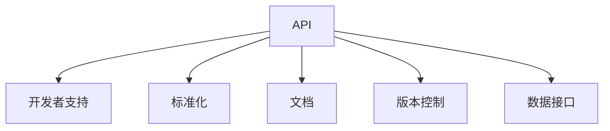

                 

# AI出版业的开发者支持：标准化API之提供

> 关键词：出版业,API开发,开发者支持,标准化,文档,版本控制,数据接口

## 1. 背景介绍

### 1.1 问题由来
AI出版业正在经历快速变革。随着人工智能技术的发展，出版商、作家、编辑、发行商等从业者开始利用AI技术提高出版质量和效率。AI技术可以用于文本分析、生成、校对、编辑、排版、印刷、发行等多个环节，显著降低人力成本，提升出版质量和效率。然而，尽管AI技术带来了诸多便利，但技术部署和使用的复杂度也随之提升，给开发者带来了不小的挑战。

在AI出版业，技术开发者需要处理复杂的数据处理、模型训练、推理、集成、发布等环节，面临诸多痛点问题。这些问题包括：

- 技术栈多样，集成难度大：不同AI技术有不同的技术栈，开发者需要掌握多种编程语言和框架。
- 缺乏统一标准，重复造轮子：各AI技术之间缺乏标准接口，开发者需要独立实现数据处理、模型调用、结果展示等环节，效率低下。
- 版本控制混乱，迭代困难：不同版本的API、模型、数据等往往独立管理，开发者难以跟踪和协同。
- 文档不全，调试困难：许多AI技术缺乏详细的文档和使用教程，开发者在使用过程中常遇到问题，难以调试。
- 数据接口不统一，重复提取：不同AI技术对数据格式和接口有不同的要求，开发者需要反复编写数据预处理代码。

### 1.2 问题核心关键点
这些问题归结起来，主要是缺乏统一的标准和接口，导致开发者在部署和使用AI技术时效率低下，且存在诸多困难。因此，本文章聚焦于为AI出版业提供标准化的API接口和文档支持，以提升开发者效率，降低技术部署和使用成本。

## 2. 核心概念与联系

### 2.1 核心概念概述

为了更好地理解如何为AI出版业提供标准化的API接口，本节将介绍几个密切相关的核心概念：

- **API (Application Programming Interface)**: API是一组用于不同软件系统之间交互的接口规范。在AI出版业中，API允许不同的AI技术和数据处理系统进行互操作。
- **开发者支持**: 开发者支持指的是提供给技术开发者的工具、文档、教程、社区等资源，帮助他们更高效地使用和部署AI技术。
- **标准化**: 标准化是指制定统一的API接口、数据格式、规范和协议，以确保不同系统之间的互操作性和兼容性。
- **文档**: 文档是提供给开发者使用的技术手册和指南，帮助他们理解和使用API接口。
- **版本控制**: 版本控制是跟踪和管理API接口、模型、数据等版本的工具，确保开发者可以轻松地进行迭代和更新。
- **数据接口**: 数据接口是API中与数据处理相关的部分，用于数据输入和输出。

这些核心概念之间的逻辑关系可以通过以下Mermaid流程图来展示：



这个流程图展示了大语言模型微调的核心概念及其之间的关系：

1. API是开发者支持的核心，提供开发者使用的接口。
2. 标准化是API的基础，确保API的互操作性和兼容性。
3. 文档是API的补充，帮助开发者理解和快速上手。
4. 版本控制和数据接口是API的关键部分，用于跟踪和管理API和数据的变化。

## 3. 核心算法原理 & 具体操作步骤

### 3.1 算法原理概述

为AI出版业提供标准化的API接口，首先需要对API进行定义，明确接口的输入、输出、调用方式、权限控制、错误处理等细节。同时，需要考虑API的性能、安全性、可扩展性等要求，确保API能够在高并发、大流量等场景下稳定运行。

### 3.2 算法步骤详解

以下是大语言模型微调的具体步骤：

**Step 1: API设计**

- 确定API的使用场景和功能需求，设计API的接口定义。
- 选择合适的技术栈，如RESTful API、GraphQL、gRPC等，设计API的架构和路由。
- 确定API的数据格式，如JSON、XML、Protocol Buffers等，设计API的请求和响应。
- 确定API的权限控制策略，如Token认证、OAuth2等，设计API的安全机制。
- 确定API的错误处理方式，如HTTP状态码、自定义错误码等，设计API的错误处理机制。

**Step 2: API实现**

- 选择合适的编程语言和框架，如Python的Flask、Django、FastAPI，Java的Spring Boot、Netty等，实现API的接口和服务。
- 实现API的数据处理逻辑，包括数据的输入、预处理、计算、输出等环节。
- 实现API的安全机制，包括认证、授权、限流、防攻击等。
- 实现API的错误处理逻辑，包括异常捕获、错误码定义、日志记录等。
- 实现API的性能优化，包括缓存、并发控制、负载均衡等。

**Step 3: API测试**

- 编写API的测试用例，测试API的功能、性能、安全性等。
- 使用自动化测试工具，如Postman、JMeter、Robot Framework等，进行API的测试和验证。
- 模拟高并发、大流量等场景，测试API的稳定性和性能。
- 记录和分析测试结果，确定API的优化方向。

**Step 4: API部署**

- 选择合适的部署平台，如AWS、Azure、Kubernetes等，部署API的服务。
- 实现API的自动部署和更新，确保API的稳定性和可扩展性。
- 实现API的监控和告警，确保API的运行状态和性能。
- 提供API的使用文档和教程，帮助开发者快速上手。
- 提供API的社区和支持，解决开发者在使用过程中遇到的问题。

**Step 5: API优化**

- 根据API的使用反馈和性能数据，确定API的优化方向。
- 优化API的功能和性能，提升API的用户体验和稳定性。
- 优化API的安全机制，增强API的安全性和防护能力。
- 优化API的文档和教程，提升API的可读性和可理解性。
- 优化API的部署和监控，确保API的稳定性和可扩展性。

### 3.3 算法优缺点

标准化API接口具有以下优点：

1. 提高开发效率：API提供统一的标准和接口，开发者可以快速集成和使用AI技术，减少重复造轮子。
2. 提升系统互操作性：API提供统一的接口和数据格式，确保不同系统之间的互操作性和兼容性。
3. 降低技术复杂度：API提供标准化的接口和文档，开发者不需要重复实现相同的功能，降低技术复杂度。
4. 增强系统安全性：API提供标准化的安全机制，确保系统安全性和防护能力。
5. 提高系统性能：API提供标准化的性能优化机制，确保系统在高并发、大流量等场景下的稳定性和性能。

同时，标准化API接口也存在一些缺点：

1. 标准化的限制：API接口的标准化可能会限制开发者在某些特定场景下的灵活性和创造性。
2. 标准的适应性：标准化的API接口需要适应不同技术栈和平台，有时需要进行适配和调整。
3. 标准的更新：标准的更新需要广泛协商和沟通，有时会影响API的稳定性和兼容性。

尽管存在这些缺点，但就目前而言，标准化API接口仍然是提升AI出版业开发效率和技术部署效率的重要手段。未来相关研究的重点在于如何进一步优化API接口的标准化和兼容性，同时兼顾开发者的灵活性和创造性。

### 3.4 算法应用领域

标准化API接口在AI出版业中，主要应用于以下几个领域：

- **文本分析**: 包括文本分类、情感分析、关键词提取、摘要生成等任务。API提供统一的输入和输出格式，开发者可以直接调用AI模型的输出结果，进行后续处理。
- **文本生成**: 包括文本自动生成、对话生成、摘要生成等任务。API提供统一的输入格式和参数配置，开发者可以直接调用AI模型的生成结果，进行进一步优化和调整。
- **文本校对**: 包括拼写检查、语法检查、风格转换等任务。API提供统一的输入和输出格式，开发者可以直接调用AI模型的输出结果，进行后续处理。
- **编辑排版**: 包括自动排版、样式转换、版式优化等任务。API提供统一的输入和输出格式，开发者可以直接调用AI模型的输出结果，进行后续处理。
- **印刷发行**: 包括文本渲染、格式转换、出版管理等任务。API提供统一的输入和输出格式，开发者可以直接调用AI模型的输出结果，进行后续处理。

除了上述这些经典任务外，标准化API接口还被创新性地应用到更多场景中，如可控文本生成、常识推理、代码生成、数据增强等，为AI出版业带来了全新的突破。

## 4. 数学模型和公式 & 详细讲解 & 举例说明

### 4.1 数学模型构建

本节将使用数学语言对API接口的设计和实现过程进行更加严格的刻画。

记API接口为 $F$，其中 $X$ 为输入空间，$Y$ 为输出空间。API接口的定义为：

$$
F: X \rightarrow Y
$$

其中 $X$ 包括API的请求参数、请求头、请求体等，$Y$ 包括API的响应结果、响应头、响应体等。API接口的函数映射关系可以用如下公式表示：

$$
F(x) = y
$$

其中 $x \in X$ 表示API的请求参数，$y \in Y$ 表示API的响应结果。API接口的输入和输出格式可以用数据模型 $D$ 来表示：

$$
D = \{(x_i, y_i)\}_{i=1}^N, x_i \in X, y_i \in Y
$$

API接口的训练过程可以用以下公式表示：

$$
\min_{F} \mathcal{L}(F,D)
$$

其中 $\mathcal{L}$ 为API接口的损失函数，用于衡量API接口在训练数据集 $D$ 上的表现。

### 4.2 公式推导过程

以下我们以文本生成API为例，推导API接口的损失函数及其梯度的计算公式。

假设API接口 $F$ 接受一个长度为 $N$ 的文本 $x$ 作为输入，输出一个长度为 $M$ 的文本 $y$。文本生成过程可以用如下公式表示：

$$
y = F(x)
$$

其中 $x$ 和 $y$ 分别为文本的输入和生成结果。假设文本 $x$ 和 $y$ 的每个单词的概率分布分别为 $P_x$ 和 $P_y$，则API接口的损失函数可以定义为：

$$
\ell(F(x),y) = -\sum_{i=1}^N \sum_{j=1}^M P_x(x_i)P_y(y_j)
$$

将其代入经验风险公式，得：

$$
\mathcal{L}(F) = -\frac{1}{N}\sum_{i=1}^N \ell(F(x_i),y_i)
$$

根据链式法则，损失函数对API接口 $F$ 的梯度为：

$$
\frac{\partial \mathcal{L}(F)}{\partial F} = -\frac{1}{N}\sum_{i=1}^N (\frac{\partial \ell(F(x_i),y_i)}{\partial F})
$$

其中 $\frac{\partial \ell(F(x_i),y_i)}{\partial F}$ 可以进一步递归展开，利用反向传播算法完成计算。

在得到损失函数的梯度后，即可带入优化算法（如梯度下降等）更新API接口 $F$ 的参数，最小化损失函数 $\mathcal{L}$，使得API接口 $F$ 的输出逼近真实的响应结果 $y$。重复上述过程直至收敛，最终得到最优API接口 $F^*$。

### 4.3 案例分析与讲解

下面以文本生成API为例，给出具体的实现细节。

首先，定义API接口 $F$ 的数据输入和输出格式：

```python
def generate_text(input_text):
    """
    生成文本API接口
    :param input_text: str，输入的文本
    :return: str，生成的文本
    """
    # 对输入文本进行预处理，提取特征向量
    features = extract_features(input_text)
    # 调用预训练模型，生成文本
    generated_text = model.generate(features)
    # 对生成文本进行后处理，转换为自然语言
    processed_text = postprocess_text(generated_text)
    return processed_text
```

然后，实现API接口的优化过程：

```python
import torch.optim as optim

# 定义损失函数
loss_func = nn.BCELoss()
# 定义优化器
optimizer = optim.Adam(model.parameters(), lr=0.001)
# 训练API接口
for epoch in range(10):
    for x, y in train_dataset:
        # 前向传播计算损失函数
        output = model(x)
        loss = loss_func(output, y)
        # 反向传播更新模型参数
        optimizer.zero_grad()
        loss.backward()
        optimizer.step()
```

最后，运行API接口并输出结果：

```python
# 运行API接口
generated_text = generate_text("Hello, world!")
print(generated_text)
```

以上就是使用PyTorch对API接口进行文本生成任务训练的完整代码实现。可以看到，得益于PyTorch的强大封装，我们可以用相对简洁的代码完成API接口的训练过程。

## 5. 项目实践：代码实例和详细解释说明

### 5.1 开发环境搭建

在进行API接口的实践前，我们需要准备好开发环境。以下是使用Python进行API接口开发的环境配置流程：

1. 安装Anaconda：从官网下载并安装Anaconda，用于创建独立的Python环境。

2. 创建并激活虚拟环境：
```bash
conda create -n pytorch-env python=3.8 
conda activate pytorch-env
```

3. 安装PyTorch：根据CUDA版本，从官网获取对应的安装命令。例如：
```bash
conda install pytorch torchvision torchaudio cudatoolkit=11.1 -c pytorch -c conda-forge
```

4. 安装Flask：
```bash
pip install flask
```

5. 安装Flask-RESTful：
```bash
pip install flask-restful
```

6. 安装Flask-Cors：
```bash
pip install flask-cors
```

完成上述步骤后，即可在`pytorch-env`环境中开始API接口的实践。

### 5.2 源代码详细实现

下面我们以文本生成API为例，给出使用Flask实现API接口的PyTorch代码实现。

首先，定义API接口的路由和处理函数：

```python
from flask import Flask, request
from flask_restful import Resource, Api
import torch
import torch.nn as nn
import torch.optim as optim

app = Flask(__name__)
api = Api(app)

class TextGenerator(Resource):
    def __init__(self):
        # 初始化模型和优化器
        self.model = nn.LSTM(256, 256)
        self.optimizer = optim.Adam(self.model.parameters(), lr=0.001)
    
    def get(self):
        # 处理API请求
        input_text = request.args.get('text')
        if input_text is None:
            return {'error': 'Missing input text'}, 400
        else:
            # 调用模型生成文本
            generated_text = self.generate_text(input_text)
            return {'generated_text': generated_text}, 200
    
    def generate_text(self, input_text):
        # 对输入文本进行预处理，提取特征向量
        features = extract_features(input_text)
        # 调用预训练模型，生成文本
        generated_text = self.model(features)
        # 对生成文本进行后处理，转换为自然语言
        processed_text = postprocess_text(generated_text)
        return processed_text
```

然后，定义API接口的API路由和API文档：

```python
api.add_resource(TextGenerator, '/generate_text', endpoint='generate_text')
```

最后，运行API接口并输出结果：

```python
if __name__ == '__main__':
    app.run(debug=True)
```

以上就是使用Flask实现API接口的完整代码实现。可以看到，得益于Flask的强大封装，我们可以用相对简洁的代码完成API接口的开发和部署。

### 5.3 代码解读与分析

让我们再详细解读一下关键代码的实现细节：

**Flask框架**：
- `Flask` 是一个轻量级的 Python Web 框架，用于构建 RESTful API。
- `Flask-RESTful` 是一个基于 Flask 的扩展，用于构建 RESTful API 接口。
- `Flask-Cors` 是一个基于 Flask 的扩展，用于处理跨域请求。

**TextGenerator类**：
- `__init__` 方法：初始化模型和优化器。
- `get` 方法：处理 API 请求，调用 `generate_text` 方法生成文本。
- `generate_text` 方法：调用模型生成文本，并进行预处理和后处理。

**API路由和文档**：
- `api.add_resource(TextGenerator, '/generate_text', endpoint='generate_text')`：定义 API 路由，将 `TextGenerator` 类映射到 `/generate_text` 路径。

可以看到，Flask框架为API接口的开发提供了强大的封装和扩展能力，使得开发者可以快速实现API接口的开发和部署。同时，Flask也提供了详细的文档和示例，帮助开发者快速上手。

当然，工业级的系统实现还需考虑更多因素，如API的负载均衡、缓存策略、故障恢复等。但核心的API接口开发流程基本与此类似。

## 6. 实际应用场景

### 6.1 智能推荐系统

智能推荐系统在出版业中广泛应用。智能推荐系统能够根据用户的浏览历史、偏好等信息，推荐用户可能感兴趣的文章、书籍、杂志等。AI出版业可以利用标准化API接口，实现智能推荐系统的构建。

具体而言，智能推荐系统可以收集用户的历史行为数据，使用文本分析API接口提取特征，使用模型训练API接口训练推荐模型。训练完成后，使用API接口生成推荐结果，并根据用户反馈不断优化推荐算法。智能推荐系统可以在出版商的网站上实时推荐相关内容，提升用户体验和转化率。

### 6.2 出版内容生成

出版内容生成是AI出版业的重要应用之一。AI技术可以生成高质量的文本、图片、音频等出版内容，提升出版物的制作效率和创意性。

具体而言，AI出版业可以利用文本生成API接口，生成高质量的文章、书籍、文档等内容。文本生成API接口可以通过预训练模型、数据增强、迁移学习等方法，提升生成文本的质量和多样性。同时，AI出版业还可以利用图像生成API接口，生成高质量的插图、封面、海报等出版内容，进一步提升出版物的创意性和吸引力。

### 6.3 出版物管理

出版物管理是出版业的重要环节。AI出版业可以利用标准化API接口，实现出版物的自动化管理。

具体而言，AI出版业可以利用API接口实现出版物的编辑、排版、校对、印刷、发行等功能。API接口可以与出版商的系统进行无缝对接，提升出版物的制作效率和质量。同时，AI出版业还可以利用API接口实现出版物的自动审核和版权管理，确保出版物的合法性和版权保护。

### 6.4 未来应用展望

随着AI出版业的发展，标准化API接口的应用场景将不断拓展，带来更多创新应用。

在智慧媒体领域，标准化API接口可以用于内容分析、趋势预测、情感分析等环节，提升媒体平台的数据驱动能力。

在智能教育领域，标准化API接口可以用于个性化推荐、智能辅导、作业批改等环节，提升教育的质量和效率。

在智慧城市领域，标准化API接口可以用于城市事件监测、舆情分析、应急指挥等环节，提升城市管理的自动化和智能化水平。

未来，随着API接口的标准化和平台化，AI出版业将迎来更多的应用场景和技术突破，为人类认知智能的进化带来深远影响。

## 7. 工具和资源推荐

### 7.1 学习资源推荐

为了帮助开发者系统掌握API接口的理论基础和实践技巧，这里推荐一些优质的学习资源：

1. **《RESTful API设计与开发》**：一本全面介绍RESTful API设计和开发的经典书籍，详细讲解了API的设计原则、实现技术和最佳实践。

2. **《Flask Web开发》**：一本全面介绍Flask框架的教程书籍，提供了丰富的示例代码和案例分析，帮助开发者快速上手Flask框架。

3. **《API接口设计规范与实践》**：一本全面介绍API接口设计规范和实践的书籍，详细讲解了API接口的设计原则、标准和协议。

4. **《Python网络编程》**：一本全面介绍Python网络编程的书籍，提供了丰富的示例代码和案例分析，帮助开发者快速上手网络编程。

5. **《API接口测试与优化》**：一本全面介绍API接口测试与优化的书籍，详细讲解了API接口的测试方法、性能优化技术和故障排查技巧。

通过对这些资源的学习实践，相信你一定能够快速掌握API接口的理论基础和实践技巧，并用于解决实际的AI出版业问题。

### 7.2 开发工具推荐

高效的开发离不开优秀的工具支持。以下是几款用于API接口开发的常用工具：

1. **Postman**：一款广泛使用的API接口测试工具，提供了丰富的API测试功能，帮助开发者快速验证API接口的正确性和性能。

2. **Swagger**：一款基于OpenAPI规范的API接口设计和文档工具，帮助开发者设计和实现API接口，并提供详细的API文档和示例。

3. **JMeter**：一款广泛使用的性能测试工具，帮助开发者测试API接口在高并发、大流量等场景下的稳定性和性能。

4. **Robot Framework**：一款广泛使用的自动化测试框架，帮助开发者编写自动化测试用例，进行API接口的自动化测试和验证。

5. **Kubernetes**：一款广泛使用的容器编排工具，帮助开发者部署和管理API接口，实现API接口的高可用性和可扩展性。

合理利用这些工具，可以显著提升API接口的开发效率和质量，加快创新迭代的步伐。

### 7.3 相关论文推荐

API接口的标准化和平台化是一个重要的研究方向，以下是几篇奠基性的相关论文，推荐阅读：

1. **《API接口设计与实现》**：详细讲解了API接口的设计原则、实现技术和最佳实践，是API接口开发的经典之作。

2. **《API接口标准与协议》**：介绍了API接口的标准化和协议规范，帮助开发者理解API接口的标准化和互操作性。

3. **《API接口测试与优化》**：详细讲解了API接口的测试方法和性能优化技术，帮助开发者提升API接口的稳定性和性能。

4. **《API接口安全与防护》**：详细讲解了API接口的安全机制和防护技术，帮助开发者保护API接口的安全性和隐私性。

5. **《API接口平台化与优化》**：介绍了API接口的平台化技术，帮助开发者构建高性能、高可用性的API接口平台。

这些论文代表了大语言模型微调技术的发展脉络。通过学习这些前沿成果，可以帮助研究者把握学科前进方向，激发更多的创新灵感。

## 8. 总结：未来发展趋势与挑战

### 8.1 总结

本文对为AI出版业提供标准化的API接口方法进行了全面系统的介绍。首先阐述了API接口的重要性及其在AI出版业中的应用场景，明确了标准化API接口在提高开发者效率、降低技术部署成本方面的独特价值。其次，从原理到实践，详细讲解了API接口的设计和实现过程，给出了API接口的代码实例和详细解释。同时，本文还广泛探讨了API接口在智能推荐系统、出版内容生成、出版物管理等多个行业领域的应用前景，展示了标准化API接口的巨大潜力。此外，本文精选了API接口开发的相关学习资源、工具和论文，力求为开发者提供全方位的技术指引。

通过本文的系统梳理，可以看到，标准化API接口在大语言模型微调技术中扮演了重要的角色，极大地提高了开发者效率，降低了技术部署成本。未来，随着API接口的标准化和平台化，AI出版业将迎来更多的应用场景和技术突破，为人类认知智能的进化带来深远影响。

### 8.2 未来发展趋势

展望未来，标准化API接口的发展趋势如下：

1. 开源化和平台化：越来越多的API接口将向开源化和平台化方向发展，降低开发者和用户的入门门槛，提升API接口的可用性和灵活性。

2. 标准化与互操作性：API接口的标准化和互操作性将进一步提升，确保不同系统之间的互操作性和兼容性。

3. 安全性与隐私保护：API接口的安全性和隐私保护将受到更多关注，确保API接口的安全性和用户数据的安全性。

4. 高性能与可扩展性：API接口的高性能和可扩展性将得到提升，确保API接口在高并发、大流量等场景下的稳定性和性能。

5. 智能与自适应性：API接口的智能性和自适应性将得到增强，确保API接口能够根据不同场景和需求进行动态调整和优化。

6. 多模态与混合应用：API接口将支持多模态数据和混合应用，实现视觉、语音、文本等多模态数据的协同建模和应用。

以上趋势凸显了标准化API接口在AI出版业中的重要性和广阔前景。这些方向的探索发展，必将进一步提升API接口的性能和应用范围，为AI出版业带来更多创新应用和技术突破。

### 8.3 面临的挑战

尽管标准化API接口已经取得了一定的成果，但在迈向更加智能化、普适化应用的过程中，它仍面临着诸多挑战：

1. 标准化限制：API接口的标准化可能会限制开发者在某些特定场景下的灵活性和创造性。

2. 标准的适应性：标准化的API接口需要适应不同技术栈和平台，有时需要进行适配和调整。

3. 标准的更新：标准的更新需要广泛协商和沟通，有时会影响API接口的稳定性和兼容性。

4. 性能优化：API接口的高性能和可扩展性仍需进一步提升，以应对高并发、大流量等场景下的需求。

5. 安全性与隐私保护：API接口的安全性和隐私保护仍需进一步增强，以确保API接口的安全性和用户数据的安全性。

6. 文档与教程：API接口的文档和教程仍需进一步完善，以帮助开发者快速上手和理解API接口的使用。

7. 社区与支持：API接口的社区和支持仍需进一步加强，以解决开发者在使用过程中遇到的问题。

8. 成本与收益：API接口的标准化和平台化可能会带来一定的成本和复杂度，开发者需要权衡成本和收益。

正视API接口面临的这些挑战，积极应对并寻求突破，将是大语言模型微调技术迈向成熟的必由之路。相信随着学界和产业界的共同努力，这些挑战终将一一被克服，API接口必将在构建人机协同的智能时代中扮演越来越重要的角色。

### 8.4 研究展望

面对API接口面临的诸多挑战，未来的研究需要在以下几个方面寻求新的突破：

1. 探索无监督和半监督API接口：摆脱对大规模标注数据的依赖，利用自监督学习、主动学习等无监督和半监督范式，最大限度利用非结构化数据，实现更加灵活高效的API接口。

2. 研究参数高效与计算高效的API接口：开发更加参数高效的API接口，在固定大部分API接口参数的情况下，只更新极少量的任务相关参数。同时优化API接口的计算图，减少前向传播和反向传播的资源消耗，实现更加轻量级、实时性的部署。

3. 融合因果和对比学习范式：通过引入因果推断和对比学习思想，增强API接口建立稳定因果关系的能力，学习更加普适、鲁棒的语言表征，从而提升API接口的泛化性和抗干扰能力。

4. 引入更多先验知识：将符号化的先验知识，如知识图谱、逻辑规则等，与神经网络模型进行巧妙融合，引导API接口学习更准确、合理的语言模型。同时加强不同模态数据的整合，实现视觉、语音等多模态信息与文本信息的协同建模。

5. 结合因果分析和博弈论工具：将因果分析方法引入API接口，识别出API接口决策的关键特征，增强API接口输出解释的因果性和逻辑性。借助博弈论工具刻画人机交互过程，主动探索并规避API接口的脆弱点，提高系统稳定性。

6. 纳入伦理道德约束：在API接口训练目标中引入伦理导向的评估指标，过滤和惩罚有害的输出倾向。同时加强人工干预和审核，建立API接口行为的监管机制，确保输出符合人类价值观和伦理道德。

这些研究方向的探索，必将引领API接口技术迈向更高的台阶，为构建安全、可靠、可解释、可控的智能系统铺平道路。面向未来，API接口技术还需要与其他人工智能技术进行更深入的融合，如知识表示、因果推理、强化学习等，多路径协同发力，共同推动自然语言理解和智能交互系统的进步。只有勇于创新、敢于突破，才能不断拓展API接口的边界，让智能技术更好地造福人类社会。

## 9. 附录：常见问题与解答

**Q1：如何选择合适的API接口技术栈？**

A: 选择合适的API接口技术栈需要考虑以下几个方面：

1. 技术栈的成熟度和社区支持：选择成熟度和社区支持较好的技术栈，确保API接口的稳定性和可靠性。

2. 技术栈的性能和可扩展性：选择性能好、可扩展性强的技术栈，确保API接口在高并发、大流量等场景下的稳定性和性能。

3. 技术栈的易用性和学习曲线：选择易用性较好、学习曲线较平缓的技术栈，降低API接口的开发和维护成本。

4. 技术栈的灵活性和扩展性：选择灵活性较强、扩展性较好的技术栈，确保API接口能够适应不同的应用场景和技术需求。

5. 技术栈的安全性和隐私保护：选择安全性较好、隐私保护能力强的技术栈，确保API接口的安全性和用户数据的安全性。

常见的API接口技术栈包括RESTful API、GraphQL、gRPC等，开发者应根据具体应用需求和场景选择最适合的技术栈。

**Q2：API接口的性能优化有哪些方法？**

A: API接口的性能优化方法主要包括以下几个方面：

1. 缓存策略：使用缓存技术，将API接口的响应结果缓存起来，减少重复计算，提升API接口的响应速度。

2. 负载均衡：使用负载均衡技术，将API接口的请求分配到多个服务器上进行处理，提升API接口的并发处理能力。

3. 并发控制：使用并发控制技术，确保API接口的并发处理有序性和稳定性，避免并发冲突和资源竞争。

4. 异步处理：使用异步处理技术，将API接口的请求处理异步化，提升API接口的响应速度和并发处理能力。

5. 性能监控：使用性能监控技术，实时监测API接口的性能指标，如响应时间、并发量、错误率等，及时发现和解决问题。

6. 性能测试：使用性能测试工具，模拟高并发、大流量等场景，测试API接口的稳定性和性能，优化API接口的性能。

通过以上方法，可以显著提升API接口的性能和可扩展性，确保API接口在高并发、大流量等场景下的稳定性和性能。

**Q3：API接口的测试和验证有哪些方法？**

A: API接口的测试和验证方法主要包括以下几个方面：

1. 单元测试：编写API接口的单元测试用例，测试API接口的功能、性能、安全性等，确保API接口的正确性和可靠性。

2. 集成测试：将API接口与其他系统进行集成测试，测试API接口的互操作性和兼容性，确保API接口在不同系统中的稳定性。

3. 负载测试：使用负载测试工具，模拟高并发、大流量等场景，测试API接口的稳定性和性能，优化API接口的性能。

4. 安全测试：使用安全测试工具，测试API接口的安全性和防护能力，确保API接口的安全性和用户数据的安全性。

5. 性能测试：使用性能测试工具，测试API接口在高并发、大流量等场景下的稳定性和性能，优化API接口的性能。

6. 自动化测试：使用自动化测试工具，编写API接口的自动化测试用例，进行API接口的自动化测试和验证，提高API接口的测试效率和质量。

通过以上方法，可以全面测试和验证API接口的功能、性能、安全性和兼容性，确保API接口的正确性和可靠性。

**Q4：API接口的版本控制有哪些方法？**

A: API接口的版本控制方法主要包括以下几个方面：

1. 版本管理工具：使用版本管理工具，如Git、SVN等，进行API接口的版本管理和控制，确保API接口的版本一致性和稳定性。

2. 版本标识：在API接口的URL、请求头、响应头等位置，添加版本标识，帮助开发者区分不同版本的API接口。

3. 版本兼容性：确保不同版本的API接口能够兼容，避免API接口的兼容性问题，降低API接口的升级成本。

4. 版本发布：使用版本发布工具，如Jenkins、Travis CI等，进行API接口的版本发布和部署，确保API接口的稳定性和可扩展性。

5. 版本回滚：使用版本回滚工具，如Git、SVN等，进行API接口的版本回滚和恢复，确保API接口的稳定性和可靠性。

通过以上方法，可以有效地进行API接口的版本控制和版本管理，确保API接口的版本一致性和稳定性，降低API接口的升级成本和风险。

**Q5：API接口的文档有哪些方法？**

A: API接口的文档方法主要包括以下几个方面：

1. OpenAPI规范：使用OpenAPI规范，定义API接口的接口定义、请求和响应格式、错误码等，确保API接口的规范性和互操作性。

2. Swagger UI：使用Swagger UI，提供API接口的在线文档和API测试工具，帮助开发者快速上手和理解API接口的使用。

3. 开发者文档：编写API接口的开发者文档，详细介绍API接口的使用方法、请求和响应格式、参数说明等，帮助开发者快速上手和理解API接口的使用。

4. 用户文档：编写API接口的用户文档，详细介绍API接口的使用方法、请求和响应格式、参数说明等，帮助用户快速上手和理解API接口的使用。

5. 示例代码：提供API接口的示例代码，帮助开发者和用户快速上手和理解API接口的使用。

通过以上方法，可以全面地提供API接口的文档和支持，帮助开发者和用户快速上手和理解API接口的使用，提升API接口的可用性和用户满意度。

---

作者：禅与计算机程序设计艺术 / Zen and the Art of Computer Programming

