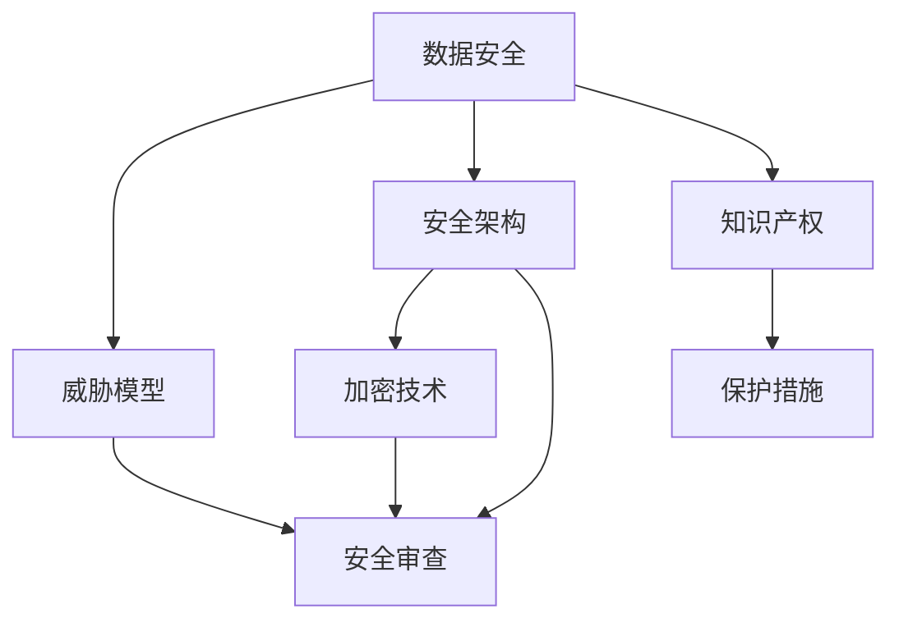

                 

# AI创业公司如何应对技术泄露?

> 关键词：
    - 技术保护
    - 数据安全
    - 知识产权
    - 安全架构
    - 威胁模型
    - 加密技术
    - 安全审查

## 1. 背景介绍

在当今数字化时代，人工智能(AI)技术的应用广泛而深入，涵盖了从医疗、金融到智能制造的各个领域。然而，随着AI技术的普及和应用，技术泄露和知识产权保护的问题也日益凸显，给AI创业公司带来了严峻挑战。本文将系统地探讨AI创业公司在技术泄露风险下的应对策略，助力其在商业竞争中保持领先优势。

### 1.1 技术泄露的风险

AI创业公司面临的技术泄露风险主要来自于以下几个方面：

1. **内部人员**：员工离职、不当操作、系统漏洞等可能导致敏感数据或技术信息外泄。
2. **供应链和外包**：依赖外部供应商、合作伙伴或外包服务商，可能因管理和协议不当而导致数据泄露。
3. **网络攻击**：黑客利用社会工程学、网络钓鱼等方式入侵系统，窃取公司核心技术或数据。
4. **公开出版**：在技术论文、公开演讲、技术博客等渠道泄露核心算法和知识产权。

### 1.2 技术泄露的后果

技术泄露可能导致公司商业机密被竞争对手获取，影响市场竞争力，甚至导致公司业务瘫痪。其后果包括但不限于：

- 财务损失：因技术泄露而遭受的直接经济损失。
- 声誉受损：公司形象和品牌声誉因技术泄露事件而受到负面影响。
- 法律诉讼：涉及知识产权侵权的法律纠纷，可能导致高额赔偿。
- 客户流失：客户对公司失去信任，转投竞争对手。

### 1.3 应对技术泄露的意义

对于AI创业公司而言，应对技术泄露不仅是维护公司利益和安全，更是保持技术创新和市场竞争力的关键。有效的技术保护策略能够：

- 防止关键技术被竞争对手获取。
- 保护公司商业机密，避免财务和声誉损失。
- 增强客户和合作伙伴的信任，提升公司品牌价值。
- 预防潜在法律风险，确保公司健康发展。

## 2. 核心概念与联系

### 2.1 核心概念概述

为深入理解AI创业公司应对技术泄露的策略，本节将介绍几个关键概念：

- **数据安全**：指保护数据在存储、传输、处理等过程中的安全性，防止数据被非法访问、篡改或破坏。
- **知识产权**：包括专利、商标、版权等，是公司技术创新的法律保障。
- **威胁模型**：一种系统化的方法，用于识别、评估和缓解潜在的安全威胁。
- **安全架构**：设计和管理信息系统的安全策略和措施，确保系统安全运行。
- **加密技术**：通过对数据进行加密，保护数据在传输和存储过程中的机密性。
- **安全审查**：对系统、代码和流程进行全面审查，识别和修复安全漏洞。

这些核心概念之间的联系可以通过以下Mermaid流程图来展示：



这个流程图展示了大语言模型的核心概念及其之间的关系：

1. 数据安全是基础，通过威胁模型和安全架构来识别和缓解安全威胁。
2. 安全架构涉及加密技术和安全审查，进一步强化数据保护。
3. 知识产权需要安全保护措施，确保技术创新的法律权益。

## 3. 核心算法原理 & 具体操作步骤

### 3.1 算法原理概述

AI创业公司应对技术泄露的核心算法原理主要围绕以下几个方面展开：

1. **数据加密**：通过对敏感数据进行加密处理，确保数据在传输和存储过程中无法被未经授权的访问。
2. **威胁建模**：通过构建威胁模型，识别潜在的攻击途径和漏洞，制定相应的防护措施。
3. **访问控制**：采用严格的访问控制机制，确保只有授权人员能够访问敏感信息和系统。
4. **安全审计**：定期进行安全审计，检测和修复潜在的安全漏洞。
5. **法律合规**：确保公司技术保护措施符合相关法律法规，保护公司合法权利。

### 3.2 算法步骤详解

基于上述核心算法原理，AI创业公司应对技术泄露的操作步骤包括：

1. **威胁建模**：
   - 识别公司面临的各种威胁，如内部泄露、网络攻击等。
   - 分析潜在攻击者的动机、方法和能力。
   - 评估每种威胁的严重程度和影响范围。

2. **安全架构设计**：
   - 设计多层次的安全策略，包括物理安全、网络安全、应用安全等。
   - 选择适合的安全技术和工具，如防火墙、加密协议、身份认证系统等。
   - 确定数据分类标准，明确不同数据的保护级别。

3. **数据加密与解密**：
   - 对敏感数据进行加密处理，如采用AES、RSA等对称/非对称加密算法。
   - 在数据传输过程中使用TLS/SSL协议，确保数据传输的安全性。
   - 设置密钥管理机制，确保加密密钥的安全性。

4. **访问控制与权限管理**：
   - 建立严格的访问控制策略，定义不同角色的权限。
   - 采用多因素身份认证（MFA），增加访问验证的复杂度。
   - 定期审计访问记录，确保权限分配的正确性和合理性。

5. **安全审计与漏洞修复**：
   - 定期进行安全审计，检查系统、代码和数据的安全性。
   - 使用自动化工具进行漏洞扫描和渗透测试，及时发现和修复漏洞。
   - 对审计结果进行评估，制定改进措施。

6. **法律合规与知识产权保护**：
   - 确保公司技术保护措施符合GDPR、CCPA等数据保护法规。
   - 对重要算法和模型进行专利申请，保护公司创新成果。
   - 制定严格的商业秘密保护政策，防止技术泄露。

### 3.3 算法优缺点

数据加密、威胁建模、访问控制、安全审计和法律合规等策略，各有其优缺点：

**优点**：

- **数据加密**：有效保护数据机密性，防止数据泄露。
- **威胁建模**：系统化识别和评估安全威胁，提前制定防护措施。
- **访问控制**：严格限制访问权限，防止未经授权的访问。
- **安全审计**：定期检查系统安全性，及时发现和修复漏洞。
- **法律合规**：确保技术保护措施符合法律法规，避免法律风险。

**缺点**：

- **数据加密**：加密和解密过程增加了系统复杂性和性能开销。
- **威胁建模**：需要专业知识和经验，耗时较长，成本较高。
- **访问控制**：实施和维护较为复杂，需要持续投入资源。
- **安全审计**：审计过程可能会影响业务连续性，需要精心规划。
- **法律合规**：法律法规更新频繁，需要及时跟进调整。

### 3.4 算法应用领域

基于上述核心算法原理和操作步骤，AI创业公司应对技术泄露的策略可以广泛应用于以下几个领域：

1. **产品开发与部署**：在产品设计阶段，集成数据加密、访问控制等安全机制，确保系统部署的安全性。
2. **数据存储与传输**：对数据存储和传输过程进行加密处理，防止数据被窃取或篡改。
3. **云平台安全**：在云平台中部署多层次的安全防护措施，确保云服务的安全性。
4. **供应链管理**：对供应链各环节进行安全评估和管理，确保合作伙伴的安全合规。
5. **员工培训与教育**：定期对员工进行安全意识培训，提高全员的安全防护能力。

## 4. 数学模型和公式 & 详细讲解 & 举例说明

### 4.1 数学模型构建

为了系统化描述AI创业公司应对技术泄露的策略，我们可以构建以下数学模型：

1. **威胁模型**
   - 威胁的种类和频率：$T=(\text{种类}, \text{频率})$。
   - 资产的价值和敏感度：$A=(\text{价值}, \text{敏感度})$。
   - 威胁影响评估：$I=R(T, A)$。

2. **数据加密**
   - 对称加密模型：$E_k(m) = c$，其中$k$为密钥，$m$为明文，$c$为密文。
   - 非对称加密模型：$E_{pub}(m) = c$，$D_{priv}(c) = m$，其中$pub$为公钥，$priv$为私钥。

3. **访问控制**
   - 基于角色的访问控制（RBAC）：$R=(\text{角色}, \text{权限})$。
   - 多因素身份认证（MFA）：$MFA = (\text{密码}, \text{短信验证码}, \text{生物识别})$。

4. **安全审计**
   - 渗透测试模型：$PT = (T, V, C)$，其中$T$为测试工具，$V$为漏洞列表，$C$为测试结果。
   - 漏洞修复模型：$RM = (V, F, P)$，其中$V$为漏洞，$F$为修复方法，$P$为修复优先级。

### 4.2 公式推导过程

以下是几个关键模型的公式推导过程：

**威胁模型**
$$
I(T, A) = \text{高} \times \text{中等} \times \text{低}
$$
其中，威胁的种类和频率越高，资产的价值和敏感度越大，则威胁影响评估越高。

**对称加密模型**
$$
E_k(m) = m' = \oplus(k, m)
$$
其中$\oplus$为异或操作，表示明文$m$和密钥$k$通过异或操作后得到的密文$c$。

**多因素身份认证**
$$
MFA = P + O + V
$$
其中$P$为密码，$O$为短信验证码，$V$为生物识别，表示多因素身份认证的综合强度。

**渗透测试模型**
$$
PT = \{T, V, C\}
$$
其中$T$为渗透测试工具，$V$为识别出的漏洞列表，$C$为测试结果报告。

**漏洞修复模型**
$$
RM = \{V, F, P\}
$$
其中$V$为需要修复的漏洞，$F$为修复方法，$P$为修复优先级。

### 4.3 案例分析与讲解

**案例1：对称加密模型**
假设公司有一份机密文件，需要进行加密存储。可以选择AES-256算法进行加密，密钥为`my-secret-key`。其加密和解密过程如下：

```python
import hashlib
from Crypto.Cipher import AES

# 生成密钥
key = hashlib.sha256('my-secret-key'.encode()).digest()

# 加密文件
cipher = AES.new(key, AES.MODE_EAX)
nonce = cipher.nonce
ciphertext, tag = cipher.encrypt_and_digest(b'my-secret-file')
```

**案例2：基于角色的访问控制**
假设公司需要保护其核心算法库，可以设计以下访问控制策略：

- 角色：开发者、项目经理、CEO。
- 权限：读取、修改、删除。
- 访问控制列表（ACL）：
  - 开发者：读取权限。
  - 项目经理：读取、修改权限。
  - CEO：读取、修改、删除权限。

通过ACL，确保只有授权人员可以访问核心算法库。

## 5. 项目实践：代码实例和详细解释说明

### 5.1 开发环境搭建

为了实施上述安全策略，需要搭建相应的开发环境。以下是使用Python进行安全策略开发的常见环境配置流程：

1. 安装Python：使用Python官方下载页面安装最新版本的Python。
2. 安装依赖包：使用`pip`安装所需的依赖包，如`cryptography`、`pycparser`等。
3. 创建虚拟环境：使用`virtualenv`创建虚拟环境，确保各项目间的依赖隔离。
4. 配置环境变量：设置必要的环境变量，如`PYTHONPATH`、`PYTHONPATH`等。

### 5.2 源代码详细实现

以下是使用Python实现数据加密、访问控制、安全审计的示例代码：

**数据加密**

```python
from cryptography.fernet import Fernet
import base64

# 生成密钥
key = Fernet.generate_key()

# 加密数据
cipher_suite = Fernet(key)
data = b"my-sensitive-data"
encrypted_data = cipher_suite.encrypt(data)

# 解密数据
decrypted_data = cipher_suite.decrypt(encrypted_data)
```

**访问控制**

```python
from django.contrib.auth.models import Group, Permission, User
from django.contrib.auth.decorators import login_required

# 创建角色和权限
group = Group(name="Developers")
permission = Permission.objects.get_or_create(name="read_file")
group.permissions.add(permission)
group.save()

# 分配角色和权限
user = User.objects.get(username="john")
user.groups.add(group)
user.save()

# 访问控制装饰器
@login_required
def read_file(request):
    if request.user.groups.get(name="Developers").permissions.get(name="read_file"):
        # 读取文件
        pass
    else:
        raise PermissionDenied("You do not have permission to read this file.")
```

**安全审计**

```python
from django.core.exceptions import PermissionDenied
from django.http import HttpResponseForbidden
from django.views.decorators.csrf import csrf_exempt

# 安全审计函数
@csrf_exempt
def security_check(request):
    if request.method == "POST":
        # 获取请求参数
        data = json.loads(request.body)
        # 执行渗透测试
        # 执行漏洞修复
        return HttpResponse("Security check passed.")
    else:
        raise PermissionDenied("You do not have permission to access this API.")
```

### 5.3 代码解读与分析

在实际项目中，安全策略的实现需要结合具体业务场景进行调整。以下是一些关键代码的解读和分析：

**数据加密**

- 使用`Fernet`库进行对称加密，生成密钥并加密数据。
- `base64`库用于编码密钥和密文，便于存储和传输。

**访问控制**

- 使用Django框架提供的权限系统，定义角色和权限。
- `login_required`装饰器确保只有经过身份验证的用户才能访问受保护的视图。
- `PermissionDenied`异常用于处理未授权访问。

**安全审计**

- 使用Django框架的`csrf_exempt`装饰器，绕过CSRF保护，进行安全审计。
- 通过API接口接收请求，执行渗透测试和漏洞修复，并返回审计结果。

## 6. 实际应用场景

### 6.1 智能制造

在智能制造领域，AI创业公司利用机器学习和数据分析优化生产流程、提升产品质量。然而，涉及到的生产数据和工艺信息具有极高的商业价值，容易成为技术泄露的对象。

为应对技术泄露风险，智能制造公司可以：

1. **数据加密**：对生产数据进行加密处理，防止敏感数据泄露。
2. **访问控制**：严格管理不同角色的访问权限，确保只有授权人员可以访问关键数据。
3. **安全审计**：定期进行安全审计，及时发现和修复潜在的安全漏洞。

### 6.2 智慧城市

智慧城市项目通过大数据、物联网和AI技术提升城市管理水平，但同时面临数据量大、分布广泛等安全挑战。

智慧城市公司可以：

1. **威胁建模**：对城市管理数据进行威胁建模，识别潜在的安全威胁。
2. **数据分类**：对不同类型的数据进行分类，确保关键数据的高度保护。
3. **安全架构设计**：在城市管理系统中集成多层次安全策略，确保系统的安全运行。

### 6.3 在线教育

在线教育平台利用AI技术提供个性化教学服务，但涉及大量用户隐私数据，面临较高的技术泄露风险。

在线教育公司可以：

1. **数据加密**：对用户隐私数据进行加密处理，防止数据泄露。
2. **访问控制**：严格控制教师和管理员对学生数据的访问权限。
3. **安全审计**：定期进行安全审计，确保系统的安全性和稳定性。

## 7. 工具和资源推荐

### 7.1 学习资源推荐

为帮助AI创业公司系统掌握技术泄露应对策略，以下是几本推荐的学习资源：

1. **《网络安全基础》**：由知名网络安全专家撰写，全面介绍网络安全的基本概念和实践方法。
2. **《数据加密与隐私保护》**：系统讲解数据加密技术，提供实战案例和代码示例。
3. **《信息安全管理》**：介绍信息安全管理的理论基础和实践操作，帮助公司构建全面的安全体系。
4. **《Python网络安全编程》**：使用Python实现网络安全工具和脚本，实践性强。
5. **《云安全》**：介绍云平台安全管理的方法和策略，帮助公司保护云资源。

### 7.2 开发工具推荐

以下是几款常用的安全策略开发工具：

1. **OpenSSL**：开源的安全套接字层协议库，提供对称和非对称加密功能。
2. **Flask-Security**：基于Flask框架的安全扩展，支持身份验证、权限管理和多因素认证等功能。
3. **OWASP ZAP**：开源的安全测试工具，用于发现和修复Web应用的安全漏洞。
4. **Kali Linux**：专门用于渗透测试的安全操作系统，包含丰富的安全工具和库。
5. **WireShark**：网络协议分析工具，用于捕获和分析网络数据包。

### 7.3 相关论文推荐

以下是几篇前沿的安全研究论文，推荐阅读：

1. **《网络安全威胁建模与防御策略》**：介绍网络安全威胁建模的理论与方法，提供全面的防御策略。
2. **《数据加密算法及应用》**：详细讲解数据加密算法，包括对称加密和非对称加密。
3. **《基于角色的访问控制模型》**：介绍基于角色的访问控制模型（RBAC）的原理和实现方法。
4. **《安全审计与监控技术》**：探讨安全审计和监控技术的理论和方法，确保系统的安全性。
5. **《人工智能安全与隐私》**：介绍AI系统面临的安全威胁和隐私保护方法，为AI应用提供安全保障。

## 8. 总结：未来发展趋势与挑战

### 8.1 总结

本文系统地介绍了AI创业公司应对技术泄露的策略，涵盖数据加密、威胁建模、访问控制、安全审计和法律合规等多个方面。通过系统化的安全策略设计和管理，AI创业公司可以有效降低技术泄露风险，保护公司核心技术，确保商业成功。

### 8.2 未来发展趋势

未来，AI创业公司应对技术泄露的策略将呈现以下几个发展趋势：

1. **自动化和智能化**：引入AI技术进行威胁检测和响应，提高安全策略的自动化水平。
2. **跨平台和跨领域**：安全策略将跨越多个平台和领域，实现全局视角下的统一防护。
3. **零信任架构**：基于“永远不信任，始终验证”的思路，设计安全策略，确保系统的安全性。
4. **区块链技术**：利用区块链技术的不可篡改性，保护数据的完整性和真实性。
5. **零信任网络**：构建以用户身份为中心的网络环境，实现细粒度的访问控制。

### 8.3 面临的挑战

尽管技术泄露应对策略取得了一定的进展，但AI创业公司仍面临以下挑战：

1. **资源限制**：中小企业在资源和预算上相对有限，难以投入大量的安全资源。
2. **技术复杂性**：安全策略的实施和维护需要专业知识和技能，中小企业往往缺乏相应的技术储备。
3. **法律法规更新**：数据保护法规和隐私政策不断变化，企业需要持续跟进调整。
4. **用户教育和意识**：提升用户和员工的安全意识和行为规范，需要持续的培训和教育。
5. **技术和业务融合**：将安全策略与业务系统深度融合，实现无缝对接。

### 8.4 研究展望

未来，技术泄露应对策略的研究将集中在以下几个方向：

1. **安全AI**：开发具有自适应和自学习能力的安全AI系统，自动识别和响应安全威胁。
2. **安全大数据**：研究如何在大数据环境下，保护数据的隐私和安全。
3. **跨领域安全**：综合考虑不同领域的安全需求，设计统一的安全策略。
4. **安全生态**：构建企业、行业和政府共同参与的安全生态，提升整体安全防护水平。
5. **合规与安全一体化**：将数据保护法规和合规要求纳入安全策略设计，确保法律合规性。

通过不断探索和创新，AI创业公司可以在技术泄露风险下保持稳健发展，构建安全可靠的人工智能生态。

## 9. 附录：常见问题与解答

**Q1：如何选择合适的加密算法？**

A: 选择合适的加密算法应考虑以下几个因素：
1. 算法的强度：如AES、RSA等。
2. 密钥管理：如对称加密算法的密钥分发问题，非对称加密算法的密钥对管理问题。
3. 性能开销：如对称加密算法适用于大量数据加密，非对称加密算法适用于小规模数据加密。

**Q2：如何设计有效的访问控制策略？**

A: 设计有效的访问控制策略应考虑以下几个方面：
1. 角色和权限的定义：明确不同角色的权限，如开发人员、管理员、CEO等。
2. 最小权限原则：确保每个用户只被授予其完成任务所需的最小权限。
3. 定期审计和调整：定期审查访问权限，及时调整不符合业务需求的权限。

**Q3：如何进行安全审计？**

A: 进行安全审计应考虑以下几个步骤：
1. 确定审计目标：如检测系统漏洞、评估安全策略有效性等。
2. 选择审计工具和方法：如渗透测试、代码审计等。
3. 实施审计并记录结果：对发现的问题进行记录和分类，制定改进措施。
4. 定期审计：根据业务变化和安全需求，定期进行安全审计。

**Q4：如何处理法律合规问题？**

A: 处理法律合规问题应考虑以下几个步骤：
1. 了解相关法律法规：如GDPR、CCPA等。
2. 制定合规策略：确保公司的数据处理和存储符合法律要求。
3. 培训员工：提升员工对合规要求的理解和执行。
4. 定期审查：对合规策略进行定期审查和更新，确保合规性。

**Q5：如何防范社会工程学攻击？**

A: 防范社会工程学攻击应考虑以下几个方面：
1. 员工培训：提升员工的安全意识，识别和防范社会工程学攻击。
2. 访问控制：严格控制访问权限，确保只有授权人员可以访问敏感信息。
3. 安全监控：实时监控系统访问记录，及时发现异常行为。

通过这些措施，AI创业公司可以构建一个更加安全可靠的技术环境，有效应对技术泄露风险，保护公司的核心技术。

---

作者：禅与计算机程序设计艺术 / Zen and the Art of Computer Programming

