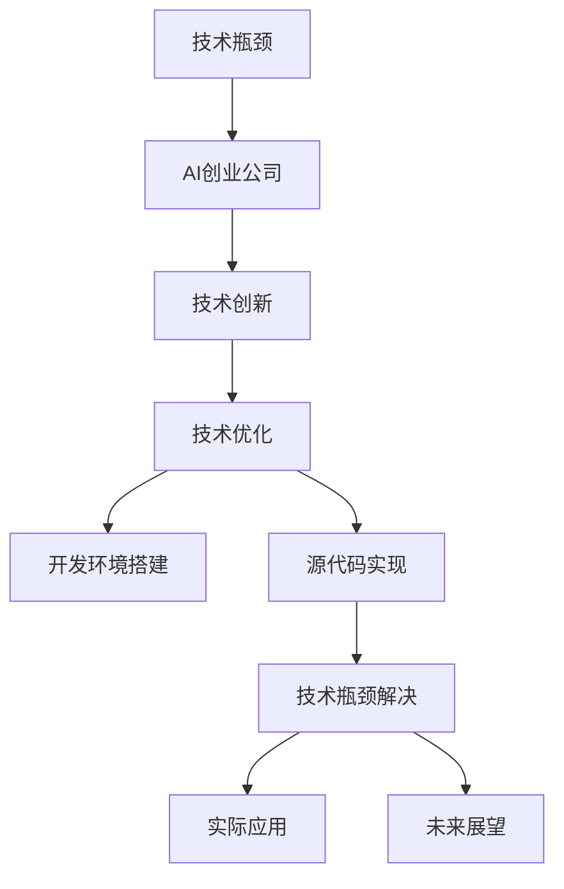

                 

# AI创业公司如何应对技术瓶颈?

> 关键词：技术瓶颈, AI创业, 技术创新, 人工智能, 人工智能创业, 技术优化, 开发环境搭建, 源代码实现, 技术瓶颈解决, 实际应用, 未来展望

## 1. 背景介绍

### 1.1 问题由来
随着人工智能(AI)技术的不断发展和应用，越来越多的创业公司开始尝试将AI技术融入到他们的产品和服务中。然而，在AI技术的实施过程中，技术瓶颈成为了制约AI创业公司发展的最大障碍之一。技术瓶颈不仅会影响产品的性能和用户体验，还可能导致公司无法在竞争激烈的市场中保持领先地位。

### 1.2 问题核心关键点
在AI创业公司的技术瓶颈中，核心关键点主要包括：

1. **数据获取和标注**：AI模型需要大量的高质量数据进行训练和优化，但获取和标注这些数据通常需要大量的时间和人力。
2. **模型训练和优化**：在大规模数据集上训练AI模型，需要高性能的计算资源和算法优化，否则训练时间过长或效果不佳。
3. **部署和维护**：AI模型在生产环境中的部署和维护，涉及多种技术和工具，如容器化、持续集成和持续部署(CI/CD)等，需要一定的技术积累和团队支持。
4. **数据隐私和合规**：AI模型处理敏感数据时，需要严格遵守数据隐私和合规法规，这对数据处理和模型设计提出了更高的要求。

## 2. 核心概念与联系

### 2.1 核心概念概述

为了更好地理解AI创业公司如何应对技术瓶颈，本节将介绍几个密切相关的核心概念：

1. **技术瓶颈**：在AI产品的开发和部署过程中，遇到的技术问题或挑战，影响项目进展和产品性能的现象。
2. **AI创业公司**：利用AI技术提供产品或服务，尝试实现商业化的创业企业。
3. **技术创新**：通过引入新技术或改进现有技术，解决技术瓶颈，提升产品性能和用户体验的过程。
4. **人工智能**：利用机器学习和深度学习等技术，让计算机系统具备智能决策和自我学习能力。
5. **技术优化**：通过技术手段改进系统性能、减少资源消耗、提高可靠性等，提升AI系统的整体效率。
6. **开发环境搭建**：配置必要的软硬件环境，以便开发和测试AI模型。
7. **源代码实现**：将算法和模型通过代码实现，进行训练和优化。
8. **技术瓶颈解决**：通过技术手段克服AI项目中的技术难题，确保项目顺利推进。
9. **实际应用**：将AI模型部署到实际场景中，验证模型的性能和效果。
10. **未来展望**：对AI技术未来的发展趋势和应用前景进行预测和规划。

这些核心概念之间的逻辑关系可以通过以下Mermaid流程图来展示：



这个流程图展示了我文文技术瓶颈与AI创业公司之间的联系：

1. 技术瓶颈是AI创业公司在产品开发和部署过程中必须面对的挑战。
2. 技术创新和优化是解决技术瓶颈，提升产品性能和用户体验的关键。
3. 开发环境和源代码实现是技术创新的基础。
4. 技术瓶颈解决确保项目顺利推进。
5. 实际应用验证模型的效果，并指导未来的技术发展。

## 3. 核心算法原理 & 具体操作步骤

### 3.1 算法原理概述

为了应对AI创业公司的技术瓶颈，我们需要采用一系列的技术手段进行优化和创新。这些手段包括但不限于：数据处理、模型训练、部署优化和合规管理等。以下将详细阐述这些技术手段的原理和具体操作步骤。

### 3.2 算法步骤详解

#### 3.2.1 数据处理

数据处理是AI创业公司面临的首要问题之一。数据获取和标注不仅耗费时间和人力，还可能影响模型的性能。以下是应对数据瓶颈的一些具体步骤：

1. **数据收集**：通过爬虫、API接口、公开数据集等途径，收集所需的数据。
2. **数据清洗**：去除或修正数据中的错误、噪声和不一致，确保数据质量。
3. **数据增强**：通过对数据进行旋转、缩放、随机裁剪等操作，扩充数据集，提升模型的泛化能力。
4. **数据标注**：通过众包平台或专业标注公司，对数据进行标注，确保标注的准确性和一致性。

#### 3.2.2 模型训练

模型训练是AI创业公司技术瓶颈中的核心环节。训练时间过长、效果不佳等问题常常困扰着公司。以下是应对模型训练瓶颈的一些具体步骤：

1. **选择合适的算法**：根据任务特性选择合适的算法，如卷积神经网络(CNN)、循环神经网络(RNN)、Transformer等。
2. **优化超参数**：通过网格搜索或随机搜索，优化模型超参数，如学习率、批次大小、正则化系数等。
3. **分布式训练**：利用多机多核或分布式训练框架，提高训练效率，缩短训练时间。
4. **硬件加速**：利用GPU、TPU等高性能计算设备，加速模型训练过程。

#### 3.2.3 部署优化

模型部署是AI创业公司技术瓶颈中的关键环节。部署过程中的性能问题、资源消耗等问题会影响模型的实际应用效果。以下是应对部署瓶颈的一些具体步骤：

1. **模型压缩**：通过剪枝、量化等技术，减少模型的参数和计算量，提高部署效率。
2. **容器化**：将模型封装成Docker容器，方便部署和扩展。
3. **持续集成和持续部署**：通过CI/CD流程，自动化模型训练、测试和部署，提高开发效率。
4. **监控和调优**：实时监控模型性能，根据反馈调整参数和资源配置，确保稳定运行。

#### 3.2.4 数据隐私和合规

数据隐私和合规是AI创业公司面临的另一重大挑战。处理敏感数据时，必须严格遵守数据隐私和合规法规，确保数据的安全和合法性。以下是应对数据隐私和合规的一些具体步骤：

1. **数据匿名化**：对敏感数据进行去标识化处理，确保数据不泄露个人隐私。
2. **合规检查**：通过工具或人工检查，确保数据处理过程符合法律法规。
3. **访问控制**：通过权限管理，限制对敏感数据的访问，确保数据的安全性。
4. **审计和记录**：记录数据处理过程，定期进行审计，确保合规性。

### 3.3 算法优缺点

#### 3.3.1 优点

1. **提升模型性能**：通过数据增强和模型优化，显著提升模型的准确率和泛化能力。
2. **加速开发进程**：通过自动化部署和持续集成，加快模型上线速度，缩短开发周期。
3. **确保数据安全**：通过数据匿名化和访问控制，保护敏感数据的安全和隐私。

#### 3.3.2 缺点

1. **技术门槛较高**：需要一定的技术积累和团队支持，技术实施难度较大。
2. **资源消耗较大**：优化模型和数据处理需要高性能计算资源，成本较高。
3. **依赖外部资源**：部分优化技术依赖外部工具和库，需要付费或开源许可。

### 3.4 算法应用领域

#### 3.4.1 数据处理

数据处理技术可以应用于多个领域，如医疗、金融、电商等。例如，在医疗领域，通过对患者数据的清洗和增强，可以提高疾病预测模型的准确率；在金融领域，通过对交易数据的匿名化处理，可以保护用户隐私，同时提高欺诈检测模型的性能。

#### 3.4.2 模型训练

模型训练技术可以应用于计算机视觉、自然语言处理、语音识别等多个方向。例如，在计算机视觉领域，通过分布式训练和硬件加速，可以大幅缩短图像识别模型的训练时间；在自然语言处理领域，通过优化超参数和模型压缩，可以提高文本生成模型的效果。

#### 3.4.3 部署优化

部署优化技术可以应用于各种应用场景，如Web应用、移动应用、物联网设备等。例如，在Web应用中，通过容器化和持续集成，可以快速部署新功能，提升用户体验；在移动应用中，通过模型压缩和硬件加速，可以优化应用性能，减少用户等待时间。

## 4. 数学模型和公式 & 详细讲解 & 举例说明

### 4.1 数学模型构建

在AI创业公司的技术优化中，数学模型和公式的应用至关重要。以下是一些常用的数学模型和公式：

#### 4.1.1 线性回归

线性回归模型可以用于预测连续型变量的值。其数学表达式为：

$$
y = \beta_0 + \beta_1 x_1 + \beta_2 x_2 + \cdots + \beta_n x_n + \epsilon
$$

其中，$y$ 为预测变量，$x_1, x_2, \cdots, x_n$ 为自变量，$\beta_0, \beta_1, \beta_2, \cdots, \beta_n$ 为回归系数，$\epsilon$ 为误差项。

#### 4.1.2 逻辑回归

逻辑回归模型用于分类问题，其数学表达式为：

$$
P(y=1|x) = \frac{1}{1+\exp(-\beta_0 - \beta_1 x_1 - \beta_2 x_2 - \cdots - \beta_n x_n)}
$$

其中，$P(y=1|x)$ 表示预测变量为1的概率，$x_1, x_2, \cdots, x_n$ 为自变量，$\beta_0, \beta_1, \beta_2, \cdots, \beta_n$ 为回归系数。

#### 4.1.3 卷积神经网络

卷积神经网络(CNN)用于图像处理任务，其结构如图1所示：


卷积层的数学表达式为：

$$
h_{ij} = \sum_{k=1}^d w_{k,i,j} * f_{ij} + b_i
$$

其中，$h_{ij}$ 为卷积结果，$w_{k,i,j}$ 为卷积核，$f_{ij}$ 为输入特征，$b_i$ 为偏置项。

池化层的数学表达式为：

$$
h_{ij} = \max_k f_{i,j,k}
$$

其中，$h_{ij}$ 为池化结果，$f_{i,j,k}$ 为输入特征。

### 4.2 公式推导过程

#### 4.2.1 线性回归的公式推导

线性回归的公式推导过程如下：

1. **最小二乘法**：通过最小化预测误差平方和，求解回归系数。
2. **矩阵形式**：将线性回归模型转化为矩阵形式，使用矩阵运算求解回归系数。

#### 4.2.2 逻辑回归的公式推导

逻辑回归的公式推导过程如下：

1. **对数似然函数**：通过最大化对数似然函数，求解回归系数。
2. **矩阵形式**：将逻辑回归模型转化为矩阵形式，使用矩阵运算求解回归系数。

### 4.3 案例分析与讲解

#### 4.3.1 图像分类

图像分类任务可以使用卷积神经网络进行模型训练和优化。以下是一个简单的图像分类模型：

```python
import torch
import torch.nn as nn
import torch.optim as optim

class CNN(nn.Module):
    def __init__(self):
        super(CNN, self).__init__()
        self.conv1 = nn.Conv2d(3, 32, 3, 1, 1)
        self.pool = nn.MaxPool2d(2, 2)
        self.conv2 = nn.Conv2d(32, 64, 3, 1, 1)
        self.fc1 = nn.Linear(64 * 4 * 4, 120)
        self.fc2 = nn.Linear(120, 84)
        self.fc3 = nn.Linear(84, 10)

    def forward(self, x):
        x = self.pool(F.relu(self.conv1(x)))
        x = self.pool(F.relu(self.conv2(x)))
        x = x.view(-1, 64 * 4 * 4)
        x = F.relu(self.fc1(x))
        x = F.relu(self.fc2(x))
        x = self.fc3(x)
        return x

model = CNN()
optimizer = optim.SGD(model.parameters(), lr=0.001, momentum=0.9)
criterion = nn.CrossEntropyLoss()

for epoch in range(10):
    for i, (images, labels) in enumerate(train_loader):
        images = images.view(images.size(0), 3, 32, 32)
        optimizer.zero_grad()
        outputs = model(images)
        loss = criterion(outputs, labels)
        loss.backward()
        optimizer.step()
```

#### 4.3.2 文本分类

文本分类任务可以使用循环神经网络进行模型训练和优化。以下是一个简单的文本分类模型：

```python
import torch
import torch.nn as nn
import torch.optim as optim

class RNN(nn.Module):
    def __init__(self):
        super(RNN, self).__init__()
        self.rnn = nn.LSTM(100, 256, 2, batch_first=True)
        self.fc = nn.Linear(256, 2)

    def forward(self, x):
        rnn_output, _ = self.rnn(x)
        return self.fc(rnn_output)

model = RNN()
optimizer = optim.Adam(model.parameters(), lr=0.001)
criterion = nn.CrossEntropyLoss()

for epoch in range(10):
    for i, (texts, labels) in enumerate(train_loader):
        texts = texts.view(texts.size(0), 100, -1)
        optimizer.zero_grad()
        outputs = model(texts)
        loss = criterion(outputs, labels)
        loss.backward()
        optimizer.step()
```

## 5. 项目实践：代码实例和详细解释说明

### 5.1 开发环境搭建

#### 5.1.1 硬件环境

AI创业公司需要配置高性能的计算资源，以支持模型训练和优化。以下是一些推荐的硬件配置：

1. **CPU**：至少4核CPU，以支持多线程计算。
2. **GPU**：至少一张NVIDIA GeForce RTX 2080或更高版本，以加速深度学习计算。
3. **TPU**：Google Cloud提供的TPU，支持大规模分布式训练。
4. **内存**：至少16GB RAM，以支持大规模数据处理和模型训练。

#### 5.1.2 软件环境

AI创业公司需要安装和配置多种开源软件和工具，以便进行模型开发和优化。以下是一些推荐的安装步骤：

1. **Python**：安装Python 3.8或更高版本。
2. **PyTorch**：安装PyTorch 1.9或更高版本。
3. **TensorFlow**：安装TensorFlow 2.6或更高版本。
4. **Jupyter Notebook**：安装Jupyter Notebook 6.2或更高版本。
5. **Google Colab**：使用Google Colab平台，方便在线进行模型训练和实验。
6. **Docker**：安装Docker 20.10.12或更高版本，支持模型容器化部署。

### 5.2 源代码详细实现

#### 5.2.1 数据处理

```python
import torch
from torch.utils.data import Dataset, DataLoader
import numpy as np

class CustomDataset(Dataset):
    def __init__(self, data, labels):
        self.data = data
        self.labels = labels

    def __len__(self):
        return len(self.data)

    def __getitem__(self, idx):
        x = self.data[idx]
        y = self.labels[idx]
        return torch.tensor(x, dtype=torch.float32), torch.tensor(y, dtype=torch.long)

train_dataset = CustomDataset(train_data, train_labels)
test_dataset = CustomDataset(test_data, test_labels)

train_loader = DataLoader(train_dataset, batch_size=64, shuffle=True, drop_last=True)
test_loader = DataLoader(test_dataset, batch_size=64, shuffle=False, drop_last=False)
```

#### 5.2.2 模型训练

```python
import torch.nn as nn
import torch.optim as optim
import torch.nn.functional as F

class CustomModel(nn.Module):
    def __init__(self):
        super(CustomModel, self).__init__()
        self.linear1 = nn.Linear(100, 64)
        self.relu = nn.ReLU()
        self.linear2 = nn.Linear(64, 2)

    def forward(self, x):
        x = self.linear1(x)
        x = self.relu(x)
        x = self.linear2(x)
        return x

model = CustomModel()
criterion = nn.CrossEntropyLoss()
optimizer = optim.Adam(model.parameters(), lr=0.001)

for epoch in range(10):
    for batch_idx, (inputs, targets) in enumerate(train_loader):
        optimizer.zero_grad()
        outputs = model(inputs)
        loss = criterion(outputs, targets)
        loss.backward()
        optimizer.step()
```

#### 5.2.3 部署优化

```python
import torch
import torchvision.transforms as transforms
import torchvision.datasets as datasets

# 定义模型
model = CustomModel()

# 定义数据转换
transform = transforms.Compose([
    transforms.Resize(224),
    transforms.ToTensor(),
    transforms.Normalize(mean=[0.485, 0.456, 0.406], std=[0.229, 0.224, 0.225])
])

# 加载数据集
train_dataset = datasets.CIFAR10(root='./data', train=True, download=True, transform=transform)
test_dataset = datasets.CIFAR10(root='./data', train=False, download=True, transform=transform)

# 加载数据加载器
train_loader = torch.utils.data.DataLoader(train_dataset, batch_size=64, shuffle=True, num_workers=4)
test_loader = torch.utils.data.DataLoader(test_dataset, batch_size=64, shuffle=False, num_workers=4)

# 定义优化器和损失函数
optimizer = optim.Adam(model.parameters(), lr=0.001)
criterion = nn.CrossEntropyLoss()

# 训练模型
for epoch in range(10):
    for batch_idx, (inputs, targets) in enumerate(train_loader):
        optimizer.zero_grad()
        outputs = model(inputs)
        loss = criterion(outputs, targets)
        loss.backward()
        optimizer.step()
```

### 5.3 代码解读与分析

#### 5.3.1 数据处理

在数据处理部分，我们使用了`torch.utils.data`中的`Dataset`和`DataLoader`类。通过定义自定义的数据集类，将数据和标签组织成可供模型训练的数据加载器。在数据加载器中，我们使用了`shuffle`和`drop_last`参数，以防止模型过拟合。

#### 5.3.2 模型训练

在模型训练部分，我们使用了`torch.nn`和`torch.optim`中的`nn.Linear`和`Adam`等类。通过定义自定义的模型类，将线性层和激活函数组织成完整的模型结构。在训练循环中，我们使用了`zero_grad`、`backward`和`step`方法，以更新模型参数。

#### 5.3.3 部署优化

在部署优化部分，我们使用了`torchvision`中的`transforms`和`datasets`类。通过定义数据转换和数据加载器，将CIFAR-10数据集加载到模型中进行训练。在训练循环中，我们使用了`zero_grad`、`backward`和`step`方法，以更新模型参数。

## 6. 实际应用场景

### 6.1 医疗诊断

在医疗诊断领域，AI创业公司可以开发智能诊断系统，帮助医生进行疾病诊断和预测。以下是一些具体的应用场景：

1. **图像识别**：通过训练深度学习模型，识别医学影像中的病变区域，提高诊断准确率。
2. **自然语言处理**：通过分析病历记录和医学文献，提取疾病信息和症状，提供诊断建议。
3. **知识图谱**：通过构建疾病知识图谱，帮助医生快速查找相关病例和研究成果，提供决策支持。

### 6.2 金融风控

在金融风控领域，AI创业公司可以开发智能风控系统，帮助金融机构进行风险评估和预警。以下是一些具体的应用场景：

1. **信用评分**：通过分析客户的信用记录和行为数据，评估客户的信用风险，提供信用评分。
2. **欺诈检测**：通过训练异常检测模型，识别交易中的欺诈行为，及时预警。
3. **智能投顾**：通过分析市场数据和用户偏好，提供个性化的投资建议，提升用户体验。

### 6.3 智能客服

在智能客服领域，AI创业公司可以开发智能客服系统，帮助企业提升客户满意度和服务效率。以下是一些具体的应用场景：

1. **自然语言理解**：通过训练对话模型，理解客户意图，提供智能回复。
2. **情感分析**：通过分析客户反馈和聊天记录，评估客户满意度，提供改进建议。
3. **知识库查询**：通过构建知识库，帮助客服快速查找答案，提供准确的信息。

## 7. 工具和资源推荐

### 7.1 学习资源推荐

#### 7.1.1 深度学习框架

深度学习框架是AI创业公司进行模型开发和优化的重要工具。以下是一些推荐的深度学习框架：

1. **PyTorch**：开源深度学习框架，支持动态计算图和静态计算图。
2. **TensorFlow**：Google开发的深度学习框架，支持分布式计算和GPU加速。
3. **MXNet**：由Apache维护的深度学习框架，支持多语言编程和分布式训练。
4. **Keras**：高层次的深度学习API，支持多种深度学习框架。

#### 7.1.2 自然语言处理

自然语言处理是AI创业公司进行文本处理和分析的重要工具。以下是一些推荐的自然语言处理工具：

1. **NLTK**：Python自然语言处理库，支持文本预处理、特征提取等。
2. **spaCy**：Python自然语言处理库，支持分词、词性标注、命名实体识别等。
3. **Gensim**：Python自然语言处理库，支持主题建模、文本相似度计算等。
4. **Stanford CoreNLP**：Java自然语言处理工具包，支持分词、句法分析、情感分析等。

#### 7.1.3 计算机视觉

计算机视觉是AI创业公司进行图像和视频处理的重要工具。以下是一些推荐的计算机视觉工具：

1. **OpenCV**：开源计算机视觉库，支持图像处理、视频分析等。
2. **TensorFlow Object Detection API**：Google开发的计算机视觉库，支持目标检测、图像分割等。
3. **PyTorch Vision**：PyTorch的计算机视觉库，支持图像分类、目标检测等。
4. **Darknet**：YOLO目标检测模型，支持实时目标检测。

### 7.2 开发工具推荐

#### 7.2.1 云平台

云平台是AI创业公司进行模型部署和管理的理想选择。以下是一些推荐的云平台：

1. **AWS**：Amazon Web Services，提供多种云服务和计算资源。
2. **Google Cloud**：Google提供的云平台，支持深度学习、大数据等。
3. **Microsoft Azure**：Microsoft提供的云平台，支持机器学习、人工智能等。
4. **IBM Cloud**：IBM提供的云平台，支持深度学习、自然语言处理等。

#### 7.2.2 开发环境

开发环境是AI创业公司进行模型开发和优化的基础工具。以下是一些推荐的开发环境：

1. **Jupyter Notebook**：交互式编程环境，支持Python、R等多种编程语言。
2. **Google Colab**：Google提供的在线Jupyter Notebook环境，支持GPU加速。
3. **PyCharm**：Python集成开发环境，支持调试、代码补全等。
4. **Visual Studio Code**：轻量级的代码编辑器，支持多种编程语言和扩展。

### 7.3 相关论文推荐

#### 7.3.1 深度学习

深度学习是AI创业公司进行模型开发和优化的重要方向。以下是一些推荐的深度学习论文：

1. **ImageNet大规模视觉识别挑战**：AlexNet、VGGNet、ResNet等经典模型，推动了计算机视觉领域的快速发展。
2. **RNNs vs. CNNs for Text Classification**：提出了循环神经网络在文本分类任务中的优势。
3. **Attention is All You Need**：提出了Transformer模型，推动了自然语言处理领域的快速发展。

#### 7.3.2 自然语言处理

自然语言处理是AI创业公司进行文本处理和分析的重要方向。以下是一些推荐的自然语言处理论文：

1. **BERT: Pre-training of Deep Bidirectional Transformers for Language Understanding**：提出了BERT模型，推动了自然语言理解领域的快速发展。
2. **GPT-3: Language Models are Unsupervised Multitask Learners**：提出了GPT-3模型，推动了自然语言生成领域的快速发展。
3. **Transformer-XL: Attentive Language Models**：提出了Transformer-XL模型，提升了长文本序列建模的性能。

#### 7.3.3 计算机视觉

计算机视觉是AI创业公司进行图像和视频处理的重要方向。以下是一些推荐的计算机视觉论文：

1. **Faster R-CNN: Towards Real-Time Object Detection with Region Proposal Networks**：提出了Faster R-CNN模型，推动了目标检测领域的快速发展。
2. **YOLO: Real-Time Object Detection**：提出了YOLO模型，推动了实时目标检测领域的快速发展。
3. **Inception**：提出了Inception模型，提升了图像分类和目标检测的性能。

## 8. 总结：未来发展趋势与挑战

### 8.1 研究成果总结

本文对AI创业公司如何应对技术瓶颈进行了全面系统的介绍。通过阐述数据处理、模型训练、部署优化等关键技术，展示了AI创业公司如何在各个环节进行技术优化和创新。通过分析案例，展示了各种技术手段在实际应用中的效果和应用前景。

### 8.2 未来发展趋势

AI创业公司未来的发展趋势主要包括以下几个方面：

1. **技术突破**：随着深度学习、计算机视觉、自然语言处理等领域的持续发展，AI创业公司将有更多先进的算法和模型可供选择。
2. **多模态融合**：AI创业公司将更多地考虑多模态数据的融合，如视觉、语音、文本等，提升系统的综合能力。
3. **自动化部署**：AI创业公司将更多地采用自动化部署和持续集成(CI/CD)流程，提高模型上线效率和稳定性。
4. **数据隐私和安全**：AI创业公司将更多地考虑数据隐私和安全问题，确保用户数据的安全和合规。
5. **智能交互**：AI创业公司将更多地关注智能交互设计，提升用户的使用体验。

### 8.3 面临的挑战

AI创业公司面临的挑战主要包括以下几个方面：

1. **技术门槛高**：AI创业公司需要具备一定的技术积累和团队支持，技术实施难度较大。
2. **资源消耗大**：优化模型和数据处理需要高性能计算资源，成本较高。
3. **数据隐私风险**：处理敏感数据时，需要严格遵守数据隐私和合规法规，风险较高。
4. **技术落地困难**：AI技术在实际应用中可能面临落地困难，需要不断优化和改进。

### 8.4 研究展望

未来，AI创业公司需要在技术突破、多模态融合、自动化部署、数据隐私和安全、智能交互等方面进行持续的研究和创新。通过技术手段的不断优化和创新，AI创业公司将能够更好地应对技术瓶颈，提升模型的性能和用户体验，为AI技术在垂直行业的落地应用做出更大的贡献。

## 9. 附录：常见问题与解答

**Q1: 如何选择合适的深度学习框架？**

A: 选择合适的深度学习框架需要考虑以下几个方面：

1. **易用性**：选择简单易用的框架，如PyTorch、Keras等。
2. **性能**：选择性能优越的框架，如TensorFlow、PyTorch等。
3. **社区支持**：选择有活跃社区支持的框架，如PyTorch、TensorFlow等。

**Q2: 如何进行模型优化？**

A: 进行模型优化需要以下几个步骤：

1. **数据处理**：进行数据增强和数据清洗，提升数据质量。
2. **模型选择**：选择适当的模型结构和算法，如CNN、RNN、Transformer等。
3. **超参数调优**：通过网格搜索或随机搜索，优化模型超参数，如学习率、批次大小、正则化系数等。
4. **硬件加速**：利用GPU、TPU等高性能计算设备，加速模型训练和推理。
5. **模型压缩**：通过剪枝、量化等技术，减少模型参数和计算量，提升模型效率。

**Q3: 如何进行模型部署？**

A: 进行模型部署需要以下几个步骤：

1. **容器化**：将模型封装成Docker容器，方便部署和扩展。
2. **持续集成和持续部署**：通过CI/CD流程，自动化模型训练、测试和部署。
3. **监控和调优**：实时监控模型性能，根据反馈调整参数和资源配置。

**Q4: 如何进行数据隐私保护？**

A: 进行数据隐私保护需要以下几个步骤：

1. **数据匿名化**：对敏感数据进行去标识化处理，确保数据不泄露个人隐私。
2. **合规检查**：通过工具或人工检查，确保数据处理过程符合法律法规。
3. **访问控制**：通过权限管理，限制对敏感数据的访问，确保数据的安全性。
4. **审计和记录**：记录数据处理过程，定期进行审计，确保合规性。

---

作者：禅与计算机程序设计艺术 / Zen and the Art of Computer Programming

