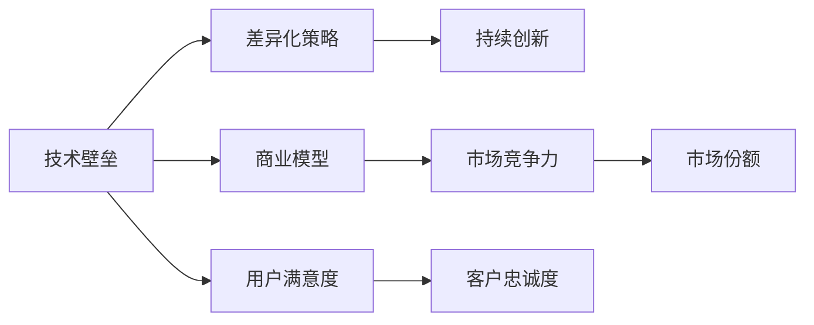

                 

## 1. 背景介绍

AI创业公司在当今科技飞速发展的时代面临着激烈的竞争环境，如何在市场中构建并维护技术壁垒是每个公司的核心任务。构建壁垒的关键在于挖掘并利用独特的技术优势和差异化策略，实现产品和服务的持续创新，从而在市场中保持领先地位。本文将从技术原理、应用场景、实施策略等多个维度，详细探讨AI创业公司如何构建强大的技术壁垒。

## 2. 核心概念与联系

### 2.1 核心概念概述

1. **技术壁垒（Technological Barrier）**：指一个企业或产品在技术层面相对于其他竞争者所具有的独特优势，形成难以复制或超越的技术优势，从而在市场中占据有利地位。
   
2. **差异化策略（Differentiation Strategy）**：通过独特的产品设计、技术创新或服务模式，使其在目标市场或用户群体中形成与竞争对手的明显区别，以提高市场竞争力和用户满意度。
   
3. **持续创新（Continuous Innovation）**：不断进行技术研发和产品改进，保持技术的领先性和产品的前瞻性，确保企业始终处于行业前沿。

4. **商业模型（Business Model）**：企业通过独特的价值主张、产品或服务、客户关系、成本结构等要素，实现市场价值的最大化，形成独特的商业模式，与竞争对手区分开来。

### 2.2 核心概念原理和架构的 Mermaid 流程图



此图展示了技术壁垒与差异化策略、持续创新、商业模型之间的联系。技术壁垒是差异化策略的基础，差异化策略则推动持续创新，持续创新又支撑着商业模型，而商业模型又直接影响市场竞争力和用户满意度。

## 3. 核心算法原理 & 具体操作步骤

### 3.1 算法原理概述

构建AI创业公司的技术壁垒，核心在于利用先进的技术算法和架构，形成独特的技术解决方案。本文将详细探讨以下算法原理：

- **深度学习算法**：通过深度学习模型训练，实现对大规模数据的复杂模式识别和决策优化。
- **自然语言处理（NLP）**：利用自然语言处理技术，提高文本数据的处理效率和准确性。
- **计算机视觉**：应用计算机视觉算法，实现图像和视频的自动化分析和识别。
- **强化学习**：通过强化学习算法，优化决策过程，提升智能系统的主动性和适应性。
- **联邦学习**：在分布式环境中共享模型更新，保护数据隐私的同时，提升模型泛化能力。

### 3.2 算法步骤详解

以深度学习算法为例，其构建技术壁垒的步骤如下：

1. **数据收集**：收集并标注大规模数据集，为模型训练提供充分的数据支撑。
2. **模型选择与设计**：选择合适的深度学习模型架构，并进行设计优化，以适应具体任务。
3. **模型训练**：利用GPU或TPU等高性能设备，进行模型的训练和优化，提升模型精度和效率。
4. **模型评估与验证**：通过交叉验证等方法，评估模型性能，调整超参数和训练策略。
5. **模型部署与应用**：将训练好的模型部署到实际应用中，进行实时推理和预测。

### 3.3 算法优缺点

#### 优点

- **高效性**：深度学习算法能够处理大规模数据，识别复杂模式，提供高效的解决方案。
- **可扩展性**：模型架构和训练方法的可扩展性强，能够适应不同规模和复杂度的任务。
- **自适应性**：模型能够不断学习和优化，提升在特定任务上的表现。

#### 缺点

- **计算资源需求高**：深度学习模型训练和推理需要大量计算资源，对硬件要求较高。
- **数据质量要求高**：模型效果依赖于高质量标注数据，数据噪声和偏差会影响性能。
- **模型复杂度高**：复杂的模型结构可能导致过拟合，需要精心调参和验证。

### 3.4 算法应用领域

深度学习算法广泛应用于图像识别、语音识别、自然语言处理、推荐系统等领域，助力AI创业公司构建技术壁垒。具体应用场景包括：

- **智能推荐系统**：通过深度学习算法，分析用户行为数据，提供个性化的产品推荐。
- **智能客服**：利用NLP技术，构建自然语言理解的智能客服系统，提升客户服务效率。
- **医疗影像分析**：应用计算机视觉技术，自动分析医学影像，辅助医生诊断。
- **金融风险管理**：通过强化学习算法，优化风险评估和决策流程，提高金融稳定性。
- **自动驾驶**：采用计算机视觉和深度学习技术，实现环境感知和行为决策。

## 4. 数学模型和公式 & 详细讲解

### 4.1 数学模型构建

以图像分类任务为例，构建深度学习模型的数学模型。假设输入为图像 $x \in \mathbb{R}^{h\times w \times c}$，输出为类别概率分布 $y \in \mathbb{R}^C$，其中 $C$ 为类别数。模型的目标是最小化分类误差，即：

$$
\min_{\theta} L(y,\hat{y}) = -\frac{1}{N}\sum_{i=1}^N \sum_{j=1}^C y_i^j \log \hat{y}_i^j
$$

其中，$y_i^j$ 表示样本 $i$ 属于类别 $j$ 的概率，$\hat{y}_i^j$ 表示模型预测的类别概率。

### 4.2 公式推导过程

通过链式法则，模型的梯度为：

$$
\nabla_{\theta} L(y,\hat{y}) = -\frac{1}{N}\sum_{i=1}^N \nabla_{\theta} \log \hat{y}_i
$$

其中，$\nabla_{\theta} \log \hat{y}_i$ 表示模型对输入 $x_i$ 的梯度。具体推导过程如下：

1. 对 $\log \hat{y}_i$ 求导，得到：

$$
\nabla_{\theta} \log \hat{y}_i = \nabla_{\theta} \sum_{j=1}^C y_i^j \log \hat{y}_i^j = \sum_{j=1}^C y_i^j \nabla_{\theta} \log \hat{y}_i^j
$$

2. 根据softmax函数定义，$\hat{y}_i^j = \frac{\exp(x_i^j \cdot w)}{\sum_k \exp(x_i^k \cdot w)}$，求导得到：

$$
\nabla_{\theta} \log \hat{y}_i^j = \frac{x_i^j \cdot w}{\sum_k \exp(x_i^k \cdot w)}
$$

3. 代入公式，得到：

$$
\nabla_{\theta} L(y,\hat{y}) = -\frac{1}{N}\sum_{i=1}^N \sum_{j=1}^C y_i^j \cdot \frac{x_i^j \cdot w}{\sum_k \exp(x_i^k \cdot w)}
$$

通过上述推导，可以看到模型的梯度计算需要涉及矩阵乘法和softmax函数的导数，这在大规模模型训练中是一个重要的计算瓶颈。

### 4.3 案例分析与讲解

以ImageNet图像分类任务为例，探讨深度学习模型的应用。ImageNet数据集包含1000个类别，1000万张高分辨率图像。模型使用AlexNet作为基础架构，通过8层卷积、3层全连接层和softmax输出层，实现对图像的分类。模型在ImageNet数据集上进行了大规模的随机梯度下降训练，最终取得了1.4%的错误率，刷新了当时的最佳成绩。

## 5. 项目实践：代码实例和详细解释说明

### 5.1 开发环境搭建

在开始项目实践之前，需要先搭建开发环境，包括：

- **Python环境**：使用Anaconda或Miniconda创建虚拟环境，安装必要的依赖库。
- **深度学习框架**：安装TensorFlow、PyTorch等深度学习框架及其GPU版本。
- **数据处理库**：安装Pandas、NumPy、Scikit-learn等数据处理和分析库。
- **模型训练库**：安装Keras、TensorFlow、PyTorch等模型训练和优化库。
- **可视化工具**：安装Matplotlib、Seaborn等数据可视化库。

### 5.2 源代码详细实现

以下是一个基于PyTorch框架的图像分类模型代码实现：

```python
import torch
import torch.nn as nn
import torch.optim as optim
import torchvision
import torchvision.transforms as transforms

# 定义模型架构
class Net(nn.Module):
    def __init__(self):
        super(Net, self).__init__()
        self.conv1 = nn.Conv2d(3, 64, kernel_size=3, padding=1)
        self.conv2 = nn.Conv2d(64, 128, kernel_size=3, padding=1)
        self.conv3 = nn.Conv2d(128, 256, kernel_size=3, padding=1)
        self.conv4 = nn.Conv2d(256, 512, kernel_size=3, padding=1)
        self.fc1 = nn.Linear(512, 1000)
        self.fc2 = nn.Linear(1000, 1000)
        self.fc3 = nn.Linear(1000, 1000)

    def forward(self, x):
        x = nn.functional.relu(nn.functional.max_pool2d(self.conv1(x), 2))
        x = nn.functional.relu(nn.functional.max_pool2d(self.conv2(x), 2))
        x = nn.functional.relu(nn.functional.max_pool2d(self.conv3(x), 2))
        x = nn.functional.relu(nn.functional.max_pool2d(self.conv4(x), 2))
        x = x.view(-1, 512)
        x = nn.functional.relu(self.fc1(x))
        x = nn.functional.dropout(x, 0.5)
        x = nn.functional.relu(self.fc2(x))
        x = nn.functional.dropout(x, 0.5)
        x = self.fc3(x)
        return x

# 加载数据集
train_dataset = torchvision.datasets.ImageFolder(root='data/train', transform=transforms.ToTensor())
test_dataset = torchvision.datasets.ImageFolder(root='data/test', transform=transforms.ToTensor())

# 定义数据加载器
train_loader = torch.utils.data.DataLoader(train_dataset, batch_size=64, shuffle=True)
test_loader = torch.utils.data.DataLoader(test_dataset, batch_size=64, shuffle=False)

# 定义模型、损失函数和优化器
model = Net()
criterion = nn.CrossEntropyLoss()
optimizer = optim.SGD(model.parameters(), lr=0.01, momentum=0.9)

# 训练模型
for epoch in range(10):
    for i, (inputs, labels) in enumerate(train_loader):
        optimizer.zero_grad()
        outputs = model(inputs)
        loss = criterion(outputs, labels)
        loss.backward()
        optimizer.step()

    print(f'Epoch {epoch+1}, loss: {loss:.4f}')
```

### 5.3 代码解读与分析

- **模型定义**：定义了一个包含4个卷积层和3个全连接层的神经网络模型。
- **数据加载器**：使用`torch.utils.data.DataLoader`加载训练和测试数据集，并设置批次大小和随机抽样。
- **损失函数**：使用交叉熵损失函数，计算模型输出与真实标签的差异。
- **优化器**：使用随机梯度下降优化器，设置学习率和动量。
- **训练循环**：对每个epoch内的所有批次进行前向传播和反向传播，更新模型参数。

## 6. 实际应用场景

### 6.1 智能推荐系统

智能推荐系统是AI创业公司常用的应用场景，利用深度学习算法，对用户行为数据进行分析和建模，实现个性化推荐。具体实现包括：

- **用户画像构建**：通过深度学习模型，对用户的历史行为数据进行聚类和特征提取，构建用户画像。
- **物品特征提取**：对物品的属性、描述、标签等特征进行编码，生成物品向量。
- **相似度计算**：利用相似度算法（如余弦相似度、欧式距离等）计算用户画像和物品向量的相似度。
- **推荐生成**：根据相似度排序，生成个性化推荐列表。

### 6.2 智能客服

智能客服系统通过自然语言处理技术，构建自然语言理解的智能客服系统，提升客户服务效率。具体实现包括：

- **语义理解**：利用BERT等预训练语言模型，理解客户输入的自然语言问题。
- **意图识别**：通过意图分类器，识别客户问题所属的意图类型。
- **知识库查询**：从知识库中检索相关答案，提供给客服机器人。
- **上下文理解**：利用对话管理模块，保持上下文一致性，提供连贯的客户服务。

### 6.3 医疗影像分析

医疗影像分析利用计算机视觉技术，实现对医学影像的自动化分析和诊断。具体实现包括：

- **影像分割**：对医学影像进行分割，提取感兴趣区域。
- **特征提取**：利用卷积神经网络提取影像特征。
- **分类识别**：对提取的特征进行分类，识别病变区域。
- **预测诊断**：根据分类结果，预测病变类型和严重程度。

### 6.4 金融风险管理

金融风险管理通过强化学习算法，优化风险评估和决策流程，提高金融稳定性。具体实现包括：

- **数据收集**：收集历史交易数据、市场波动数据等，构建风险评估模型。
- **模型训练**：利用强化学习算法，对模型进行训练和优化，提升风险评估精度。
- **实时预测**：在实时交易过程中，根据当前市场情况，进行风险评估和决策。
- **异常检测**：利用异常检测算法，识别潜在的金融风险。

## 7. 工具和资源推荐

### 7.1 学习资源推荐

1. **Coursera深度学习课程**：由斯坦福大学和Coursera联合推出的深度学习课程，涵盖深度学习基础和应用。
2. **Deep Learning Specialization**：由Andrew Ng教授主持的深度学习专项课程，内容全面深入。
3. **NLP Specialization**：由Stanford University推出的自然语言处理专项课程，涵盖文本处理、语言模型等前沿技术。
4. **Arxiv.org**：深度学习和NLP领域的顶级研究论文数据库，及时获取最新研究进展。
5. **Kaggle数据科学竞赛平台**：通过参与实际竞赛，学习和实践深度学习和NLP技术。

### 7.2 开发工具推荐

1. **TensorFlow**：Google开发的深度学习框架，适用于大规模模型训练和部署。
2. **PyTorch**：Facebook开源的深度学习框架，易于使用和扩展。
3. **Jupyter Notebook**：交互式开发环境，支持Python和R语言，便于快速原型开发。
4. **GitHub**：代码托管平台，方便版本控制和团队协作。
5. **Google Colab**：Google提供的免费Jupyter Notebook环境，支持GPU和TPU计算资源。

### 7.3 相关论文推荐

1. **D CNN: A Fast Alternative to Deep CNNs**：提出了一种轻量级的深度学习模型，加速模型训练和推理。
2. **BERT: Pre-training of Deep Bidirectional Transformers for Language Understanding**：提出BERT模型，利用自监督预训练任务，提升语言理解能力。
3. **Attention is All You Need**：提出Transformer结构，实现高效的序列建模。
4. **ImageNet Classification with Deep Convolutional Neural Networks**：提出AlexNet模型，解决大规模图像分类问题。
5. **Super-resolution Learning**：提出深度学习模型，实现图像超分辨率。

## 8. 总结：未来发展趋势与挑战

### 8.1 研究成果总结

本文系统地探讨了AI创业公司如何构建技术壁垒，主要包括以下几个方面：

1. **深度学习算法**：通过深度学习模型，实现对大规模数据的复杂模式识别和决策优化。
2. **自然语言处理（NLP）**：利用NLP技术，提升文本数据的处理效率和准确性。
3. **计算机视觉**：应用计算机视觉算法，实现图像和视频的自动化分析和识别。
4. **强化学习**：通过强化学习算法，优化决策过程，提升智能系统的主动性和适应性。
5. **联邦学习**：在分布式环境中共享模型更新，保护数据隐私的同时，提升模型泛化能力。

### 8.2 未来发展趋势

1. **模型规模持续增大**：随着算力成本的下降和数据规模的扩张，预训练语言模型的参数量还将持续增长。
2. **微调技术发展**：微调方法将更加灵活高效，能够在少量标注数据下取得较好性能。
3. **跨领域融合**：更多跨领域融合技术，如多模态学习、迁移学习等，将提升模型的泛化能力和应用范围。
4. **模型可解释性增强**：未来的模型将更加注重可解释性，提高系统的透明性和可信度。
5. **AI伦理与安全**：AI技术的发展将更加注重伦理和安全性，避免对社会造成负面影响。

### 8.3 面临的挑战

1. **数据隐私和安全**：大规模数据处理和模型训练需要关注数据隐私和安全问题，避免数据泄露和滥用。
2. **计算资源限制**：深度学习模型训练和推理需要大量计算资源，对硬件要求较高。
3. **模型复杂性**：复杂的模型结构可能导致过拟合，需要精心调参和验证。
4. **跨领域泛化能力**：模型在不同领域中的泛化能力有待提高，避免领域特定偏差。
5. **实时性要求**：部分应用场景要求模型具备实时性，现有模型可能需要进一步优化。

### 8.4 研究展望

未来，AI创业公司需要在以下几个方面进行深入研究：

1. **无监督学习**：探索无监督学习方法和自监督预训练任务，减少对标注数据的依赖。
2. **多模态学习**：研究多模态学习技术，提升模型的跨模态融合能力。
3. **联邦学习**：进一步优化联邦学习算法，提升模型泛化能力，保护数据隐私。
4. **知识图谱**：利用知识图谱构建先验知识库，提升模型的知识整合能力。
5. **模型压缩**：研究模型压缩和稀疏化技术，提升模型的推理速度和存储效率。

## 9. 附录：常见问题与解答

**Q1：AI创业公司构建技术壁垒的关键是什么？**

A: AI创业公司构建技术壁垒的关键在于独特技术优势的挖掘和利用，包括深度学习算法、自然语言处理、计算机视觉、强化学习等先进技术。通过构建独特的产品或服务，实现与竞争对手的差异化，并不断进行技术创新，保持领先地位。

**Q2：如何选择适合公司的深度学习框架？**

A: 选择适合的深度学习框架应考虑以下几个因素：

1. **易用性**：框架的API和文档是否易于理解和使用。
2. **性能**：框架的计算速度和内存占用是否满足项目需求。
3. **生态系统**：框架的社区支持和第三方库是否丰富。
4. **可扩展性**：框架是否支持大规模模型训练和分布式计算。

**Q3：如何处理大规模数据集？**

A: 处理大规模数据集的关键在于数据预处理和优化。

1. **数据预处理**：对数据进行清洗、去重、标注等预处理，减少噪声和冗余。
2. **分布式计算**：利用分布式计算框架（如Hadoop、Spark等），加速数据处理和模型训练。
3. **数据压缩**：对数据进行压缩和编码，减少存储和传输成本。

**Q4：如何提高模型的泛化能力？**

A: 提高模型的泛化能力可以从以下几个方面入手：

1. **数据增强**：通过数据增强技术，扩充训练集的多样性，减少过拟合。
2. **正则化**：使用L2正则、Dropout等正则化方法，控制模型复杂度。
3. **迁移学习**：利用预训练模型或迁移学习方法，提升模型的泛化能力。
4. **模型集成**：通过集成多个模型，提高系统的鲁棒性和泛化能力。

**Q5：如何在实际应用中保护用户隐私？**

A: 保护用户隐私应采取以下措施：

1. **数据脱敏**：对敏感数据进行脱敏处理，减少隐私泄露风险。
2. **数据加密**：对数据进行加密处理，保护数据传输和存储安全。
3. **访问控制**：设置严格的访问控制策略，限制对敏感数据的访问权限。
4. **隐私计算**：利用隐私计算技术，在不共享原始数据的情况下进行模型训练和推理。

---

作者：禅与计算机程序设计艺术 / Zen and the Art of Computer Programming

