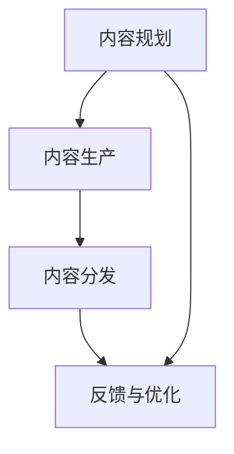

                 

# AI创业公司的产品内容策略：内容规划、内容生产与内容分发

## 1. 背景介绍

在AI创业公司的产品开发中，内容策略是一项至关重要的环节。内容不仅仅是产品的载体，更是连接用户与产品之间的桥梁。一个成功的AI产品往往离不开高效的内容规划、精准的内容生产和科学的内容分发。本博文将系统阐述AI创业公司的产品内容策略，从内容规划、内容生产与内容分发三个方面进行详细讲解。

## 2. 核心概念与联系

### 2.1 核心概念概述

为帮助读者理解，我们首先梳理下本文涉及的几个关键概念：

- **内容规划（Content Planning）**：在产品设计初期，根据用户需求、市场环境、品牌定位等因素，确定内容的类型、主题、频率等，为内容生产与分发提供指导方向。
- **内容生产（Content Production）**：通过文本、视频、音频等多种形式，将规划的内容转化为具体的文本、视频等媒介。内容生产包括内容创意、内容编写、内容拍摄、内容后期等环节。
- **内容分发（Content Distribution）**：将生产好的内容通过合适的渠道传播给目标用户，实现最大化的曝光率和影响力。内容分发渠道包括网站、社交媒体、移动应用、电子邮件等。

这些概念之间存在密切的联系，形成了一个有机的内容生态系统。内容规划决定了内容生产的方向和内容分发的渠道，而内容生产和分发的效果又反馈回内容规划，形成良性循环。

### 2.2 核心概念原理和架构的 Mermaid 流程图(Mermaid 流程节点中不要有括号、逗号等特殊字符)



此流程图展示了内容策略的整个流程：内容规划驱动内容生产，内容生产成果通过内容分发传播，而用户反馈又重新进入内容规划，形成了循环迭代的改进过程。

## 3. 核心算法原理 & 具体操作步骤

### 3.1 算法原理概述

在AI创业公司的产品中，内容策略可以分为内容规划、内容生产和内容分发三个主要阶段。每个阶段都有各自的算法原理和操作步骤。

#### 3.1.1 内容规划

内容规划是内容策略的起点，其核心在于理解目标用户，分析市场环境，制定符合用户需求和市场趋势的内容策略。

- **用户需求分析**：通过调研问卷、用户访谈、数据分析等方式，了解目标用户的需求、兴趣和行为。
- **市场趋势分析**：分析行业报告、竞争对手动态、热点话题等，把握市场发展趋势和方向。
- **内容类型确定**：根据用户需求和市场趋势，确定内容的类型（如博客、视频、播客等）、主题（如技术教程、案例分析、行业动态等）和频率（如日更、周更、月更等）。

#### 3.1.2 内容生产

内容生产是将内容规划转化为具体形式的过程，其核心在于创意和内容编写。

- **内容创意**：基于内容规划，设计吸引用户的内容主题和形式，创造新的内容概念和角度。
- **内容编写**：根据内容创意，撰写高质量的文本、脚本或进行视频拍摄等，保证内容的质量和吸引力。

#### 3.1.3 内容分发

内容分发是将生产好的内容传播给目标用户的过程，其核心在于选择合适的分发渠道和优化分发策略。

- **分发渠道选择**：根据目标用户的特点和内容类型，选择最合适的分发渠道（如社交媒体、公司官网、电子邮件等）。
- **分发策略优化**：通过数据驱动的方式，不断调整和优化分发策略，以提高内容的曝光率和用户互动率。

### 3.2 算法步骤详解

#### 3.2.1 内容规划

1. **用户需求调研**：设计调研问卷，对目标用户进行线上线下的问卷调查，收集用户的基本信息、兴趣和行为数据。
2. **市场趋势分析**：收集行业报告、竞争对手动态、热点新闻等信息，分析行业趋势和市场需求。
3. **内容类型确定**：结合用户需求和市场趋势，确定内容的类型、主题和发布频率。

#### 3.2.2 内容生产

1. **内容创意**：根据内容规划，设计吸引用户的内容创意和角度。
2. **内容编写**：根据内容创意，撰写高质量的文本、制作视频或进行视频拍摄。
3. **内容审核**：对生产好的内容进行审核，确保内容质量和合规性。

#### 3.2.3 内容分发

1. **渠道选择**：根据目标用户特点和内容类型，选择最合适的分发渠道。
2. **内容优化**：通过A/B测试等手段，不断优化内容的标题、关键词和描述，提高点击率和用户互动率。
3. **分发执行**：在选定的渠道上发布内容，并进行跟踪和监控，收集用户反馈和互动数据。

### 3.3 算法优缺点

#### 3.3.1 优点

1. **精准定位**：通过用户需求调研和市场趋势分析，可以精准定位目标用户和市场需求。
2. **多样化表达**：结合内容创意和内容编写，可以通过多种形式（如文本、视频、播客等）丰富内容形式。
3. **高效分发**：通过选择合适的分发渠道和优化分发策略，可以高效地传播内容。

#### 3.3.2 缺点

1. **内容生产成本高**：高质量内容生产需要大量时间和资源投入，尤其是视频和深度文章等。
2. **分发渠道依赖**：内容分发的效果很大程度上依赖于渠道选择和优化策略。
3. **内容更新频繁**：随着市场环境变化，内容需要频繁更新和调整，增加了运营成本。

### 3.4 算法应用领域

AI创业公司的产品内容策略可以广泛应用于各种场景，如智能客服、智能推荐、智能广告、智能搜索等。

- **智能客服**：通过内容生产，为智能客服系统提供丰富的问题和答案，提升客户服务质量。
- **智能推荐**：结合用户浏览和点击数据，生成个性化内容推荐，提升用户粘性和满意度。
- **智能广告**：通过内容分发，精准定位目标用户，提升广告点击率和转化率。
- **智能搜索**：基于用户搜索行为和反馈，优化搜索结果的展示方式和内容，提高搜索效率和用户体验。

## 4. 数学模型和公式 & 详细讲解 & 举例说明

### 4.1 数学模型构建

本节将使用数学语言对AI创业公司的产品内容策略进行更加严格的刻画。

假设用户需求为 $U$，市场趋势为 $T$，内容类型为 $C$，内容主题为 $S$，内容频率为 $F$。则内容规划的目标可以表示为：

$$
\max \sum_{i=1}^{n} U_i \times T_i \times C_i \times S_i \times F_i
$$

其中 $n$ 为不同类型和主题内容的数量。

### 4.2 公式推导过程

根据上述数学模型，我们可以将内容规划、内容生产与内容分发过程转化为优化问题。设内容生产的成本为 $P$，内容分发的成本为 $D$，则整体成本为：

$$
C_{total} = P + D
$$

内容分发的效果 $E$ 可以表示为：

$$
E = \sum_{i=1}^{n} U_i \times T_i \times C_i \times S_i \times F_i \times \eta
$$

其中 $\eta$ 为内容分发的效率系数。

内容分发的总收益 $R$ 可以表示为：

$$
R = E \times C_{click}
$$

其中 $C_{click}$ 为用户点击内容的平均价值。

综合考虑成本和收益，内容策略的总价值 $V$ 可以表示为：

$$
V = R - C_{total}
$$

通过最大化 $V$，可以找到一个最优的内容策略。

### 4.3 案例分析与讲解

假设某AI创业公司开发了一款智能推荐系统，基于用户的浏览和购买行为数据，生产内容推荐文章。通过用户调研，公司了解到用户对最新科技趋势和行业动态感兴趣。因此，公司决定在内容规划阶段，将内容主题定位为科技趋势和行业动态，内容类型为文章，内容频率为日更。

在内容生产阶段，公司雇佣专业内容团队，基于内容规划，设计并编写了多篇文章，并进行内容审核，确保文章质量和合规性。

在内容分发阶段，公司选择了社交媒体平台作为分发渠道，并通过A/B测试优化了文章的标题和描述，提高了文章的点击率和互动率。最终，公司的内容推荐系统取得了显著的用户增长和用户满意度提升。

## 5. 项目实践：代码实例和详细解释说明

### 5.1 开发环境搭建

在进行内容策略开发前，我们需要准备好开发环境。以下是使用Python进行PyTorch开发的环境配置流程：

1. 安装Anaconda：从官网下载并安装Anaconda，用于创建独立的Python环境。

2. 创建并激活虚拟环境：
```bash
conda create -n content-env python=3.8 
conda activate content-env
```

3. 安装PyTorch：根据CUDA版本，从官网获取对应的安装命令。例如：
```bash
conda install pytorch torchvision torchaudio cudatoolkit=11.1 -c pytorch -c conda-forge
```

4. 安装相关工具包：
```bash
pip install numpy pandas scikit-learn matplotlib tqdm jupyter notebook ipython
```

完成上述步骤后，即可在`content-env`环境中开始内容策略的开发实践。

### 5.2 源代码详细实现

以下是一个简单的内容推荐系统代码实现示例：

```python
import pandas as pd
import numpy as np
from sklearn.feature_extraction.text import CountVectorizer
from sklearn.decomposition import NMF
from sklearn.metrics.pairwise import cosine_similarity

# 准备数据
data = pd.read_csv('recommend_data.csv')

# 特征工程
vectorizer = CountVectorizer()
X = vectorizer.fit_transform(data['content'].values)

# 构建用户-内容矩阵
user_count_matrix = np.zeros((data['user_id'].nunique(), X.shape[1]))
for i, user_id in enumerate(data['user_id'].unique()):
    user_content = data[data['user_id'] == user_id]['content']
    user_count_matrix[i] = vectorizer.transform(user_content).toarray().sum(axis=0)

# 推荐系统
nmf = NMF(n_components=10, random_state=42)
user_implicit_matrix = cosine_similarity(user_count_matrix)
nmf.fit_transform(user_implicit_matrix)

# 获取推荐结果
def get_recommendations(user_id, top_n=5):
    user_content = data[data['user_id'] == user_id]['content'].values
    user_vector = vectorizer.transform(user_content).toarray()
    recommendations = np.dot(user_vector, nmf.components_)
    return recommendations.argsort()[-top_n:][::-1]

# 测试
user_id = 'user123'
recommendations = get_recommendations(user_id)
print(recommendations)
```

### 5.3 代码解读与分析

让我们再详细解读一下关键代码的实现细节：

**数据准备**：
- 使用pandas读取推荐系统数据，其中包含用户ID、内容等字段。
- 使用CountVectorizer对内容进行特征提取，构建用户-内容矩阵。

**推荐系统实现**：
- 使用NMF算法进行用户-内容矩阵的分解，得到用户隐含特征。
- 通过余弦相似度计算用户之间的相似度，并使用NMF得到内容的隐含特征。
- 最终通过计算用户和内容的相似度，生成推荐结果。

**推荐测试**：
- 定义一个函数，根据用户ID获取推荐内容。
- 使用示例用户ID进行推荐测试，输出前5个推荐内容。

这个示例展示了基于内容的推荐系统实现，实际应用中需要进一步优化和扩展，如加入用户评分、时间衰减等因子，提升推荐效果。

## 6. 实际应用场景

### 6.1 智能客服系统

基于内容策略的智能客服系统，可以通过收集和生产丰富的问答内容，提升客户服务质量。系统可以根据用户的历史对话记录，自动匹配最合适的回答模板，同时结合用户当前的情绪和需求，生成个性化的回复内容。

在技术实现上，可以收集用户的历史对话数据，将其标注为问题-回答对，在此基础上对预训练语言模型进行微调，得到精准匹配的回答模板。系统在用户发起对话时，根据输入问题自动匹配最相似的模板，并生成个性化的回复内容。

### 6.2 金融舆情监测

金融领域对市场舆情动态的实时监测至关重要。基于内容策略的金融舆情监测系统，可以通过收集和分析各类金融新闻、报道、评论，快速把握市场情绪和趋势。

具体而言，可以收集金融领域相关的新闻、报道、评论等文本数据，并对其进行情感分析和主题标注。基于内容策略，系统可以选择最具影响力的文章进行优先展示，同时使用机器翻译等技术，扩大国际金融信息的覆盖范围。

### 6.3 个性化推荐系统

当前的推荐系统往往只依赖用户的历史行为数据进行物品推荐，难以深入理解用户的真实兴趣偏好。基于内容策略的个性化推荐系统，可以通过内容生产和内容分发，深入挖掘用户兴趣，提升推荐效果。

在实践中，可以收集用户浏览、点击、评论、分享等行为数据，提取和用户交互的物品标题、描述、标签等文本内容。基于内容策略，系统可以生成个性化推荐文章，结合用户浏览和点击数据，提升推荐效果。

### 6.4 未来应用展望

随着内容策略的不断优化和创新，AI创业公司的产品内容策略将在更多领域得到应用，为传统行业带来变革性影响。

在智慧医疗领域，基于内容策略的AI系统可以通过生成医学科普文章，普及健康知识，提升公众健康意识。

在智能教育领域，内容策略可应用于作业批改、学情分析、知识推荐等方面，因材施教，促进教育公平，提高教学质量。

在智慧城市治理中，内容策略可应用于城市事件监测、舆情分析、应急指挥等环节，提高城市管理的自动化和智能化水平，构建更安全、高效的未来城市。

此外，在企业生产、社会治理、文娱传媒等众多领域，基于内容策略的AI应用也将不断涌现，为经济社会发展注入新的动力。

## 7. 工具和资源推荐

### 7.1 学习资源推荐

为了帮助开发者系统掌握内容策略的理论基础和实践技巧，这里推荐一些优质的学习资源：

1. **《内容策略的艺术与科学》**：由内容策略专家撰写的经典著作，深入浅出地介绍了内容策略的理论基础和实际操作技巧。

2. **Google Content Strategy Guide**：谷歌官方发布的内容策略指南，提供了丰富的案例和实操建议。

3. **HubSpot Content Strategy Certification**：HubSpot提供的内容策略认证课程，涵盖了内容策略的各个方面，适合初学者和进阶者。

4. **Content Strategy Academy**：内容策略在线课程平台，提供系统的内容策略学习路径，涵盖内容规划、内容生产、内容分发等环节。

通过对这些资源的学习实践，相信你一定能够快速掌握内容策略的精髓，并用于解决实际的NLP问题。

### 7.2 开发工具推荐

高效的开发离不开优秀的工具支持。以下是几款用于内容策略开发的常用工具：

1. **Jupyter Notebook**：免费的交互式编程环境，支持代码编辑、执行和输出，方便内容策略的实现和调试。

2. **Glossary.io**：内容管理和协作工具，支持内容团队协作，方便内容规划和内容生产。

3. **Sprout Social**：社交媒体管理和优化工具，支持内容发布和社交媒体分析，适合内容分发的管理。

4. **SEMrush**：SEO工具，支持关键词分析、竞争分析、内容优化等，适合内容分发的优化。

5. **BuzzSumo**：内容分析和优化工具，支持内容表现分析和内容推荐，适合内容分发的优化。

合理利用这些工具，可以显著提升内容策略的开发效率，加快创新迭代的步伐。

### 7.3 相关论文推荐

内容策略的发展源于学界的持续研究。以下是几篇奠基性的相关论文，推荐阅读：

1. **内容策略的核心要素**：介绍了内容策略的五个核心要素（受众、信息、渠道、品牌、效果），帮助理解内容策略的全貌。

2. **内容策略的科学依据**：通过分析数据驱动的内容策略，揭示了内容策略的有效性和科学性。

3. **内容策略的演变趋势**：总结了内容策略从传统媒体到数字化时代的演变趋势，预测了未来内容策略的发展方向。

4. **内容策略的实践指南**：提供了基于案例的内容策略实践指南，帮助内容团队提升内容效果。

这些论文代表了大语言模型微调技术的发展脉络。通过学习这些前沿成果，可以帮助研究者把握学科前进方向，激发更多的创新灵感。

## 8. 总结：未来发展趋势与挑战

### 8.1 总结

本文对AI创业公司的产品内容策略进行了全面系统的介绍，从内容规划、内容生产与内容分发三个方面进行了详细讲解。首先阐述了内容策略的背景和重要性，明确了内容策略在产品开发中的核心地位。其次，从原理到实践，详细讲解了内容策略的数学模型和操作步骤，给出了内容策略的完整代码实例。同时，本文还广泛探讨了内容策略在智能客服、金融舆情、个性化推荐等多个行业领域的应用前景，展示了内容策略的巨大潜力。此外，本文精选了内容策略的学习资源和开发工具，力求为读者提供全方位的技术指引。

通过本文的系统梳理，可以看到，内容策略在AI创业公司的产品开发中占据了重要地位，通过内容规划、内容生产和内容分发三个环节的协同工作，可以显著提升产品的竞争力和用户满意度。未来，随着内容策略的不断优化和创新，内容策略必将在AI创业公司的产品开发中发挥更加重要的作用，推动产品的持续迭代和创新。

### 8.2 未来发展趋势

展望未来，内容策略的发展趋势主要包括以下几个方面：

1. **数据驱动**：随着数据收集和分析技术的进步，内容策略将更加依赖于数据的驱动，通过数据驱动的内容规划和内容生产，提高内容策略的科学性和有效性。

2. **智能化**：基于机器学习和大数据技术，内容策略将更加智能化，能够自动生成高质量的内容，优化内容分发策略，提升内容策略的效果。

3. **个性化**：随着个性化技术的普及，内容策略将更加注重个性化，能够根据用户的行为和兴趣，提供更加精准的内容推荐和服务。

4. **跨渠道**：随着多渠道分发技术的进步，内容策略将更加注重跨渠道的内容分发，能够通过多种渠道触达目标用户，提升内容的影响力和覆盖面。

5. **全媒体**：随着全媒体技术的普及，内容策略将更加注重全媒体的内容生产和分发，能够通过视频、音频等多种形式，丰富内容形式，提升内容的吸引力。

以上趋势凸显了内容策略在AI创业公司的产品开发中的重要性，未来的内容策略将继续引领产品的创新和优化，推动产品的持续迭代和创新。

### 8.3 面临的挑战

尽管内容策略在AI创业公司的产品开发中取得了显著效果，但在迈向更加智能化、普适化应用的过程中，仍然面临诸多挑战：

1. **内容质量提升**：高质量内容的生产需要大量时间和资源投入，尤其是在视频和深度文章等形式上。如何提高内容生产的效率和质量，仍然是一个难题。

2. **分发渠道依赖**：内容分发的效果很大程度上依赖于渠道选择和优化策略。如何高效地选择和优化内容分发渠道，仍然是一个需要深入研究的问题。

3. **内容多样化**：虽然内容形式多样化，但内容质量参差不齐。如何通过内容审核机制，保证内容的多样性和质量，仍然是一个需要解决的问题。

4. **用户参与度**：虽然内容策略能够提升用户粘性和满意度，但如何进一步提高用户参与度和互动率，仍然是一个需要优化的问题。

5. **数据安全和隐私**：内容策略需要收集和分析大量用户数据，如何保障数据安全和用户隐私，仍然是一个需要重视的问题。

6. **内容更新和迭代**：随着市场环境变化，内容需要频繁更新和调整，增加了运营成本。如何实现内容的自动更新和迭代，仍然是一个需要解决的问题。

7. **跨领域应用**：虽然内容策略在多个领域得到了应用，但如何适应不同领域的特点和需求，仍然是一个需要深入研究的问题。

正视内容策略面临的这些挑战，积极应对并寻求突破，将是大语言模型微调技术走向成熟的必由之路。相信随着学界和产业界的共同努力，这些挑战终将一一被克服，内容策略必将在构建人机协同的智能时代中扮演越来越重要的角色。

### 8.4 研究展望

面对内容策略面临的挑战，未来的研究需要在以下几个方面寻求新的突破：

1. **自动化内容生产**：通过生成式模型和语义理解技术，实现自动化内容生成，提高内容生产效率。

2. **数据驱动内容优化**：通过数据驱动的方式，优化内容策略，提高内容策略的科学性和有效性。

3. **内容质量控制**：通过内容审核和编辑技术，提高内容的多样性和质量，保障内容安全和用户隐私。

4. **跨领域内容策略**：基于不同领域的特点和需求，设计和优化内容策略，实现跨领域的内容生产和发展。

这些研究方向的探索，必将引领内容策略的不断优化和创新，为构建安全、可靠、可解释、可控的智能系统铺平道路。面向未来，内容策略还需要与其他人工智能技术进行更深入的融合，如知识表示、因果推理、强化学习等，多路径协同发力，共同推动自然语言理解和智能交互系统的进步。只有勇于创新、敢于突破，才能不断拓展语言模型的边界，让智能技术更好地造福人类社会。

## 9. 附录：常见问题与解答

**Q1：内容策略是否适用于所有类型的AI产品？**

A: 内容策略在大多数AI产品中都有应用价值，尤其是那些以内容为核心竞争力的产品，如智能推荐系统、智能客服、内容管理系统等。对于一些技术驱动型的产品，如智能搜索、智能广告等，内容策略也可以起到一定的辅助作用。

**Q2：如何平衡内容质量和数量？**

A: 内容策略的平衡关键在于高效的内容生产和内容审核机制。可以使用自动化的内容生成工具（如GPT-3）生成高质量的内容，同时通过人工审核和编辑，保障内容的准确性和多样性。此外，内容生产过程中需要注重内容更新和迭代，保持内容的时效性和新鲜度。

**Q3：内容分发渠道的选择和优化有哪些策略？**

A: 内容分发渠道的选择和优化需要综合考虑目标用户的特点和内容类型。可以通过A/B测试和数据分析，找到最优的内容分发渠道和分发策略。此外，多渠道分发也是一个重要策略，通过多渠道分发，能够覆盖更广泛的用户群体，提升内容的曝光率和影响力。

**Q4：内容策略在智能客服系统中如何实现？**

A: 在智能客服系统中，内容策略可以通过生成丰富的问答内容，提升客户服务质量。系统可以根据用户的历史对话记录，自动匹配最合适的回答模板，同时结合用户当前的情绪和需求，生成个性化的回复内容。内容策略需要在系统设计阶段进行规划，同时结合用户反馈进行不断优化。

**Q5：内容策略在金融舆情监测中的应用场景是什么？**

A: 在金融舆情监测中，内容策略可以通过收集和分析各类金融新闻、报道、评论，快速把握市场情绪和趋势。系统可以选择最具影响力的文章进行优先展示，同时使用机器翻译等技术，扩大国际金融信息的覆盖范围。内容策略需要在系统设计阶段进行规划，同时结合市场动态进行不断优化。

**Q6：内容策略在个性化推荐系统中的应用场景是什么？**

A: 在个性化推荐系统中，内容策略可以通过内容生产和内容分发，深入挖掘用户兴趣，提升推荐效果。系统可以生成个性化推荐文章，结合用户浏览和点击数据，提升推荐效果。内容策略需要在系统设计阶段进行规划，同时结合用户行为进行不断优化。

以上这些问题和解答，希望能为读者在内容策略的实践和优化中提供一些参考和启发。内容策略在AI创业公司的产品开发中占据了重要地位，通过内容规划、内容生产和内容分发三个环节的协同工作，可以显著提升产品的竞争力和用户满意度。未来，随着内容策略的不断优化和创新，内容策略必将在AI创业公司的产品开发中发挥更加重要的作用，推动产品的持续迭代和创新。

