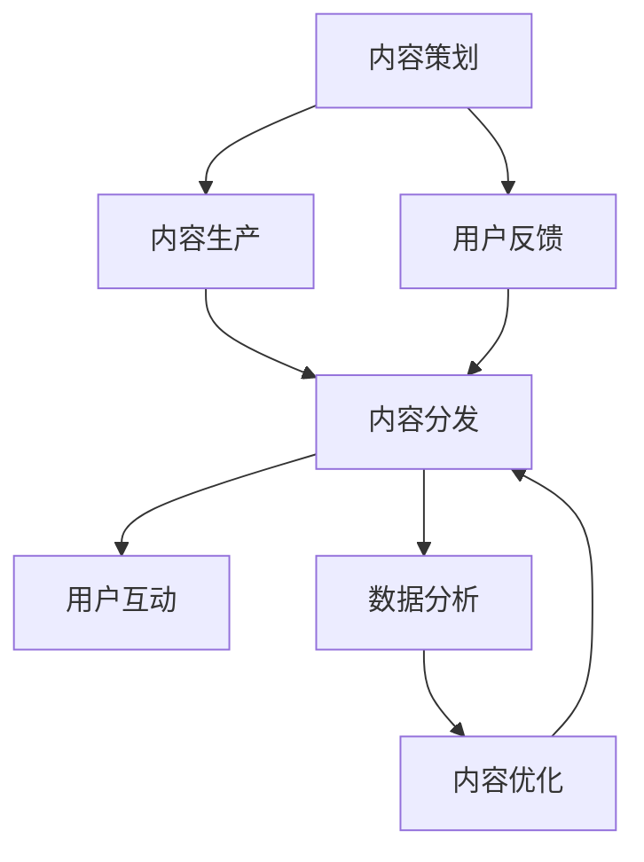

                 

# AI创业公司的产品内容运营：内容策划、生产与分发

## 1. 背景介绍

### 1.1 问题由来

在当今数字时代，内容运营已成为企业获取流量和用户粘性的重要手段。对于AI创业公司而言，内容运营不仅仅是吸引用户，更是在市场竞争中建立品牌认知、展现技术实力、驱动业务增长的关键因素。内容运营不仅涉及文字、图片、视频等传统媒介，更结合了人工智能技术，形成全新的内容生成与分发策略，为产品带来更大的商业价值。

### 1.2 问题核心关键点

AI创业公司的内容运营主要涉及以下几个核心问题：
1. **内容策划**：如何选择主题、构建结构，设计有效的用户体验路径。
2. **内容生产**：如何快速生成高质量的内容，如何借助AI技术提高内容生产的效率和质量。
3. **内容分发**：如何将内容高效地触达目标用户，提升用户参与度和留存率。

这些问题交织在一起，构成了AI创业公司产品内容运营的核心挑战。本文将围绕这些问题，探讨内容策划、生产与分发的关键技术和最佳实践，为AI创业公司提供可行的策略和方法。

## 2. 核心概念与联系

### 2.1 核心概念概述

为更好地理解AI创业公司内容运营的技术架构和方法论，本节将介绍几个核心概念：

- **内容策划(Content Planning)**：指根据目标用户群体、市场趋势、公司定位等因素，规划内容的类型、主题、发布频率等策略，确保内容符合用户需求和商业目标。
- **内容生产(Content Creation)**：指通过编写、编辑、制作等手段，将策划好的内容转化为可传播的形式，如文章、视频、图表等。
- **内容分发(Content Distribution)**：指将生成好的内容通过多种渠道传播给目标用户，确保内容被用户发现和消费。

这些核心概念通过以下Mermaid流程图来展示：



这个流程图展示了内容运营的核心流程：内容策划决定生产方向，内容生产提供实际内容，内容分发将内容传达到用户，用户互动和反馈再回传到内容策划和生产环节，形成一个循环优化的过程。

## 3. 核心算法原理 & 具体操作步骤

### 3.1 算法原理概述

AI创业公司的产品内容运营，在本质上是将人工智能技术与传统内容运营策略相结合，形成一套高效的内容生成与分发系统。其核心算法原理主要包括以下几个方面：

- **自然语言处理(NLP)**：用于理解用户需求、自动生成内容、情感分析等。
- **机器学习与深度学习**：用于内容推荐、用户画像分析、内容相似度计算等。
- **计算机视觉(CV)**：用于图像识别、视频分析、内容可视化等。
- **数据挖掘**：用于用户行为分析、内容关联度分析、热点趋势预测等。

这些算法原理构成了AI内容运营的技术基础，通过深度学习模型，可以自动生成和推荐内容，提升运营效率和效果。

### 3.2 算法步骤详解

AI创业公司的产品内容运营通常包括以下几个关键步骤：

1. **内容策划**：
   - **用户需求分析**：使用NLP和数据分析技术，了解目标用户的需求和兴趣。
   - **市场趋势跟踪**：通过NLP和数据挖掘技术，监测行业热点和趋势。
   - **内容策略制定**：根据需求分析和市场趋势，制定内容主题、发布频率、渠道选择等策略。

2. **内容生产**：
   - **自动化内容生成**：使用NLP技术自动生成文章、报告、摘要等文本内容。
   - **多媒体内容制作**：结合CV技术，制作图像、视频、动画等多媒体内容。
   - **内容质量审核**：引入人工审核与AI辅助审核相结合，确保内容质量。

3. **内容分发**：
   - **渠道选择**：根据用户画像和内容属性，选择最合适的分发渠道，如社交媒体、博客、视频平台等。
   - **内容推荐系统**：使用机器学习算法，推荐符合用户兴趣的内容，提升用户互动和留存率。
   - **效果监测与优化**：通过数据分析，监测内容表现，优化分发策略和内容质量。

### 3.3 算法优缺点

AI创业公司内容运营的主要优点包括：
1. **高效性**：通过自动化内容生成和推荐，显著提高内容生产和分发效率。
2. **精准性**：结合用户画像和内容分析，精准触达目标用户，提升用户参与度和留存率。
3. **灵活性**：可以根据用户反馈和市场变化，快速调整内容策略和分发渠道。

然而，这一过程也存在一些局限性：
1. **成本高**：AI技术的高成本投入，对资源和资金提出了较高要求。
2. **内容质量难以完全自动化**：尽管自动化技术可以大幅提高内容生产效率，但在某些内容类型上，仍然需要人工干预。
3. **算法偏见**：机器学习和深度学习模型可能存在数据偏见，导致内容推荐和内容生成结果不平衡。
4. **用户隐私保护**：内容运营过程中，用户数据的收集和分析需要严格遵守隐私保护法规。

### 3.4 算法应用领域

AI创业公司内容运营技术在多个领域都有广泛应用，例如：

- **教育领域**：通过自动化生成和推荐学习资料，提升教育资源的可及性和学习效率。
- **电商领域**：结合用户行为分析和内容推荐，提升商品曝光率和用户转化率。
- **媒体与出版**：自动化生成新闻报道、文章摘要，提升内容生成效率，减少人工成本。
- **健康与医疗**：通过NLP和CV技术，自动化生成健康资讯和诊疗指导，提升公众健康知识普及度。
- **金融科技**：生成投资分析报告、市场新闻，帮助用户做出明智的投资决策。

## 4. 数学模型和公式 & 详细讲解  
### 4.1 数学模型构建

在内容运营中，常用的数学模型包括：

- **协同过滤(Collaborative Filtering)**：用于推荐系统，基于用户行为数据推荐内容。
- **情感分析(Sentiment Analysis)**：用于分析用户评论和反馈的情感倾向，优化内容策略。
- **文本分类(Text Classification)**：用于自动分类内容，确保内容主题符合用户需求。
- **用户画像(User Profiling)**：用于描述用户特征，指导内容策划和分发。

这些模型在内容运营中的主要作用是：

1. **推荐内容**：通过协同过滤和文本分类，根据用户历史行为和内容属性，推荐符合用户兴趣的内容。
2. **优化内容策略**：通过情感分析和用户画像，了解用户反馈和兴趣点，调整内容主题和形式。
3. **提升用户体验**：通过文本分类和情感分析，确保内容质量，提升用户阅读体验。

### 4.2 公式推导过程

以协同过滤模型为例，假设用户集合为 $U$，物品集合为 $I$，用户对物品的评分矩阵为 $R \in \mathbb{R}^{U \times I}$，协同过滤的目标是预测用户 $u$ 对物品 $i$ 的评分 $r_{ui}$。

常见的协同过滤方法包括基于用户的协同过滤和基于物品的协同过滤，以下分别介绍这两种方法的公式推导过程：

**基于用户的协同过滤**：

$$
\hat{r}_{ui} = \alpha r_u + (1-\alpha) \sum_{v \in N_u} \frac{\overline{r}_{vi} r_{uv}}{\overline{r}_{v.}}
$$

其中，$N_u$ 是用户 $u$ 的邻居集合，$\overline{r}_{v.}$ 是用户 $v$ 的平均评分。

**基于物品的协同过滤**：

$$
\hat{r}_{ui} = \alpha r_i + (1-\alpha) \sum_{j \in I} \frac{r_{uj} r_{ji}}{\sqrt{\sum_{i \in I} r_{ji}^2}} \cdot \frac{1}{\sqrt{\sum_{i \in I} r_i^2}}
$$

其中，$r_i$ 是物品 $i$ 的平均评分，$j$ 是物品 $i$ 的邻居物品。

这些公式展示了协同过滤的基本思路，即通过用户行为或物品属性的相似度，预测未见过的评分。

### 4.3 案例分析与讲解

以电商平台内容推荐为例，假设用户 $u$ 购买了商品 $i$ 和 $j$，对商品 $i$ 的评分为 $r_{ui}$，对商品 $j$ 的评分为 $r_{uj}$。

基于用户的协同过滤公式如下：

$$
\hat{r}_{u'i} = \alpha r_u + (1-\alpha) \sum_{v \in N_u} \frac{\overline{r}_{vi} r_{uv}}{\overline{r}_{v.}}
$$

其中，$\alpha$ 为超参数，$N_u$ 是用户 $u$ 的邻居集合，$\overline{r}_{v.}$ 是用户 $v$ 的平均评分。

例如，假设用户 $u$ 购买了商品 $i$ 和 $j$，对商品 $i$ 的评分为 4，对商品 $j$ 的评分为 5。邻居用户 $v$ 购买了商品 $k$ 和 $m$，对商品 $k$ 的评分为 3，对商品 $m$ 的评分为 4。

代入公式：

$$
\hat{r}_{u'i} = 0.5 \times 4 + (1-0.5) \times (\frac{3 \times 4}{5 + 3} \times \frac{4}{4 + 3}) = 3.5
$$

因此，系统预测用户 $u'$ 对商品 $i$ 的评分为 3.5。

## 5. 项目实践：代码实例和详细解释说明

### 5.1 开发环境搭建

在进行内容运营开发前，我们需要准备好开发环境。以下是使用Python进行PyTorch开发的环境配置流程：

1. 安装Anaconda：从官网下载并安装Anaconda，用于创建独立的Python环境。

2. 创建并激活虚拟环境：
```bash
conda create -n content-env python=3.8 
conda activate content-env
```

3. 安装PyTorch：根据CUDA版本，从官网获取对应的安装命令。例如：
```bash
conda install pytorch torchvision torchaudio cudatoolkit=11.1 -c pytorch -c conda-forge
```

4. 安装PyTorch-lightning：用于构建可扩展的内容运营应用，支持分布式训练和模型部署。
```bash
pip install pytorch-lightning
```

5. 安装各类工具包：
```bash
pip install numpy pandas scikit-learn matplotlib tqdm jupyter notebook ipython
```

完成上述步骤后，即可在`content-env`环境中开始内容运营实践。

### 5.2 源代码详细实现

以下以推荐系统为例，给出使用PyTorch进行协同过滤的代码实现。

首先，定义协同过滤的模型类：

```python
import torch.nn as nn
import torch.nn.functional as F

class CollaborativeFiltering(nn.Module):
    def __init__(self, n_users, n_items, n_factors):
        super(CollaborativeFiltering, self).__init__()
        self.user_factors = nn.Embedding(n_users, n_factors)
        self.item_factors = nn.Embedding(n_items, n_factors)
        self.hidden = nn.Linear(n_factors * 2, 1)
    
    def forward(self, user_idx, item_idx):
        user_factors = self.user_factors(user_idx)
        item_factors = self.item_factors(item_idx)
        hidden = torch.cat([user_factors, item_factors], dim=1)
        return self.hidden(hidden).squeeze(1)
```

然后，定义优化器和损失函数：

```python
from torch.optim import Adam

optimizer = Adam(params=model.parameters(), lr=0.001)
loss_fn = nn.MSELoss()

# 训练数据准备
train_data = {'meta': {'user_idx': [1, 2, 3, 4, 5], 'item_idx': [1, 2, 3, 4, 5], 'rating': [3.5, 4.0, 3.8, 4.2, 4.5]}

# 训练函数
def train_epoch(model, optimizer, loss_fn, train_data):
    for user_idx, item_idx, rating in train_data['meta']:
        optimizer.zero_grad()
        pred = model(user_idx, item_idx)
        loss = loss_fn(pred, rating)
        loss.backward()
        optimizer.step()
    return loss.item()
```

接着，启动训练流程：

```python
epochs = 10
for epoch in range(epochs):
    loss = train_epoch(model, optimizer, loss_fn, train_data)
    print(f"Epoch {epoch+1}, loss: {loss:.4f}")
```

以上就是使用PyTorch进行协同过滤的完整代码实现。可以看到，通过简单的TensorFlow和nn.Module组合，我们可以快速搭建一个基本的协同过滤模型，并进行训练优化。

### 5.3 代码解读与分析

让我们再详细解读一下关键代码的实现细节：

**CollaborativeFiltering类**：
- `__init__方法`：初始化用户、物品的因子向量，以及一个线性隐层。
- `forward方法`：将用户和物品的因子向量拼接，通过隐层进行预测，返回预测评分。

**训练函数train_epoch**：
- 使用Adam优化器和MSE损失函数，对每个训练样本进行前向传播、计算损失、反向传播和参数更新。
- 最终返回该epoch的平均损失。

**训练流程**：
- 定义总的epoch数，开始循环迭代
- 每个epoch内，对每个训练样本进行前向传播和反向传播，更新模型参数
- 重复上述过程直至收敛

可以看到，PyTorch使得协同过滤模型的搭建和训练变得简单高效。开发者可以将更多精力放在模型改进和优化上，而不必过多关注底层的实现细节。

## 6. 实际应用场景

### 6.1 智能客服系统

基于AI内容运营技术的智能客服系统，可以大大提升客户服务的效率和质量。传统的客服系统往往依赖人工客服，高峰期响应慢、人员成本高。而智能客服系统通过自动生成FAQ和常见问题回答，结合用户历史数据和情感分析，能够提供精准的客户服务。

例如，某电商平台智能客服系统，通过自动生成和推荐常见问题解答，极大提高了用户咨询响应速度和满意度。同时，系统还能根据用户反馈，动态更新FAQ库，不断优化服务质量。

### 6.2 个性化推荐系统

内容运营在个性化推荐系统中具有重要应用。通过用户行为数据分析和内容相似度计算，推荐系统能够为用户推荐符合其兴趣和需求的商品或内容。

例如，某在线视频平台通过用户行为数据，结合协同过滤和内容推荐算法，为用户推荐个性化的视频内容。系统不仅根据用户的历史观看记录推荐相关视频，还能根据视频标题、标签等信息，跨视频推荐相关内容，提升用户体验和平台留存率。

### 6.3 新闻内容平台

新闻内容平台通过内容运营技术，可以实现精准的新闻内容推送和个性化新闻订阅。平台通过分析用户阅读历史和兴趣点，自动生成个性化新闻推荐，同时结合时事热点和趋势，为不同用户推荐最适合的新闻内容。

例如，某新闻内容平台通过用户行为分析，结合协同过滤和情感分析技术，为用户推荐个性化新闻订阅。系统不仅推荐用户感兴趣的深度报道，还能根据时事热点，自动推送最新新闻，提升用户粘性和平台流量。

## 7. 工具和资源推荐

### 7.1 学习资源推荐

为了帮助开发者系统掌握内容运营的理论基础和实践技巧，这里推荐一些优质的学习资源：

1. 《深度学习实战》：介绍了深度学习在内容推荐、图像识别、自然语言处理等方面的应用。
2. 《机器学习实战》：涵盖机器学习算法在推荐系统、广告推荐、用户画像等方面的实现。
3. 《内容运营：从策划到分发》：详细介绍了内容运营的全流程，包括内容策划、内容生产、内容分发等各个环节。
4. HuggingFace官方文档：提供了丰富的NLP库和预训练模型，用于内容生成和推荐系统的开发。
5. TensorFlow官方文档：详细介绍了TensorFlow在推荐系统、协同过滤、文本分类等方面的应用。

通过对这些资源的学习实践，相信你一定能够快速掌握内容运营的精髓，并用于解决实际的NLP问题。

### 7.2 开发工具推荐

高效的开发离不开优秀的工具支持。以下是几款用于内容运营开发的常用工具：

1. PyTorch：基于Python的开源深度学习框架，灵活动态的计算图，适合快速迭代研究。大部分内容推荐模型都有PyTorch版本的实现。
2. TensorFlow：由Google主导开发的开源深度学习框架，生产部署方便，适合大规模工程应用。同样有丰富的内容推荐模型资源。
3. PyTorch-lightning：用于构建可扩展的内容运营应用，支持分布式训练和模型部署。
4. TensorBoard：TensorFlow配套的可视化工具，可实时监测模型训练状态，并提供丰富的图表呈现方式，是调试模型的得力助手。
5. Weights & Biases：模型训练的实验跟踪工具，可以记录和可视化模型训练过程中的各项指标，方便对比和调优。

合理利用这些工具，可以显著提升内容运营任务的开发效率，加快创新迭代的步伐。

### 7.3 相关论文推荐

内容运营技术的发展源于学界的持续研究。以下是几篇奠基性的相关论文，推荐阅读：

1. "Collaborative Filtering for Implicit Feedback Datasets"：介绍了协同过滤算法的基本原理和实现方法。
2. "Deep Neural Networks for Content and Collaborative Filtering"：探讨了深度神经网络在协同过滤中的应用。
3. "A Survey on Recommendation Algorithms"：综述了推荐系统中的各类算法和技术。
4. "Harnessing the Power of Social Media: A Review of Recommendation Algorithms and Applications"：介绍了社交媒体在推荐系统中的应用。
5. "Contextual Recommendations"：探讨了上下文感知推荐技术，提高了推荐系统的精准性和个性化程度。

这些论文代表了大语言模型微调技术的发展脉络。通过学习这些前沿成果，可以帮助研究者把握学科前进方向，激发更多的创新灵感。

## 8. 总结：未来发展趋势与挑战

### 8.1 总结

本文对AI创业公司产品内容运营的技术架构和方法论进行了全面系统的介绍。首先阐述了内容运营的背景和核心问题，明确了内容策划、生产与分发之间的联系。其次，从原理到实践，详细讲解了协同过滤等核心算法原理和操作步骤，给出了内容运营任务开发的完整代码实例。同时，本文还广泛探讨了内容运营技术在智能客服、个性化推荐、新闻内容平台等多个行业领域的应用前景，展示了内容运营技术的巨大潜力。最后，本文精选了内容运营技术的各类学习资源，力求为开发者提供全方位的技术指引。

通过本文的系统梳理，可以看到，AI创业公司内容运营技术已经在多个领域展现出巨大价值，正逐步成为数字化转型的重要驱动力。未来，伴随技术的不断演进和应用场景的拓展，内容运营技术必将迎来更多创新和突破，为AI创业公司带来更大的商业机会和市场空间。

### 8.2 未来发展趋势

展望未来，内容运营技术将呈现以下几个发展趋势：

1. **个性化推荐系统**：内容运营技术将更加注重个性化推荐，通过深度学习和协同过滤，实现精准内容推荐，提升用户体验和留存率。
2. **多模态内容运营**：结合文本、图像、视频等多模态数据，形成更丰富、多样化的内容生态，提升内容的吸引力和传播效果。
3. **实时内容运营**：通过实时数据分析和推荐系统，实现内容运营的动态调整，提升内容的时效性和互动性。
4. **用户参与度分析**：通过情感分析和行为追踪，理解用户对内容的真实反馈，优化内容策略和分发渠道。
5. **内容运营自动化**：通过自动化工具和流程优化，实现内容运营的高效管理和持续创新。

这些趋势凸显了内容运营技术的广阔前景。这些方向的探索发展，必将进一步提升内容运营的效果和效率，为AI创业公司带来更大的商业价值。

### 8.3 面临的挑战

尽管内容运营技术已经取得了瞩目成就，但在迈向更加智能化、普适化应用的过程中，它仍面临着诸多挑战：

1. **数据质量与隐私保护**：内容运营依赖大量用户数据，数据质量的好坏直接影响内容推荐的精准性和用户隐私保护。如何有效获取、清洗和保护数据，是内容运营的首要挑战。
2. **算法偏见与公平性**：内容推荐算法可能存在数据偏见，导致推荐结果不平衡。如何消除算法偏见，提升内容的公平性和多样性，还需要更多理论和实践的积累。
3. **技术复杂性与可解释性**：内容运营技术复杂度高，模型的决策过程难以解释。如何增强模型的可解释性，确保推荐结果透明可控，将是重要的研究方向。
4. **内容创作的版权问题**：自动化生成内容可能引发版权争议。如何在保护版权的同时，实现内容的高效生产和分发，还需要明确的法规支持和伦理指导。
5. **用户反馈与行为预测**：内容运营技术依赖用户反馈来优化推荐结果，但用户行为预测的准确性直接影响推荐效果。如何更准确地预测用户行为，提升推荐系统的效果，还需要进一步的研究。

这些挑战凸显了内容运营技术的复杂性和多样性，需要从多个维度进行全面优化和创新。只有勇于创新、敢于突破，才能不断提升内容运营的效果和效率，实现技术的全面应用。

### 8.4 未来突破

面对内容运营技术所面临的种种挑战，未来的研究需要在以下几个方面寻求新的突破：

1. **引入因果推理**：通过因果分析方法，增强推荐系统建立稳定因果关系的能力，学习更加普适、鲁棒的内容推荐模型。
2. **结合知识图谱**：将符号化的先验知识与神经网络模型进行融合，引导推荐过程学习更全面、准确的内容。
3. **引入对比学习**：通过对比学习思想，提升内容推荐模型的泛化能力和抗干扰能力。
4. **优化用户画像**：通过深度学习技术，构建更加精准的用户画像，指导内容策划和分发。
5. **结合时序分析**：通过时间序列分析，预测内容消费趋势，优化内容运营策略。

这些研究方向的探索，必将引领内容运营技术的不断进步，为AI创业公司带来更大的商业价值。相信随着技术的日益成熟，内容运营技术必将实现更大规模的应用和落地，推动数字化转型的进程。

## 9. 附录：常见问题与解答

**Q1：内容运营需要哪些核心技术？**

A: 内容运营的核心技术包括自然语言处理、机器学习与深度学习、计算机视觉、数据挖掘等。这些技术通过协同工作，可以实现内容策划、生产与分发的全流程自动化，提升运营效率和效果。

**Q2：如何衡量内容运营的效果？**

A: 衡量内容运营效果的主要指标包括用户参与度、内容曝光率、用户留存率、转化率等。通过分析这些指标，可以评估内容运营的效果，并进行优化和改进。

**Q3：如何处理数据偏见问题？**

A: 数据偏见是内容运营中常见的问题，可以通过数据清洗、特征选择、算法优化等手段来处理。同时，引入因果推理和公平性约束，确保推荐系统的公平性和多样性。

**Q4：如何提高内容运营的实时性？**

A: 提高内容运营实时性，可以通过数据流处理、实时推荐系统、实时分析工具等手段来实现。同时，优化内容生成和分发的流程，减少延迟和滞后。

**Q5：如何平衡内容质量和推荐效率？**

A: 平衡内容质量和推荐效率，需要优化内容生成和推荐算法的模型，引入用户反馈和动态调整机制。同时，通过数据驱动和人工干预相结合，确保推荐系统的精准性和效果。

---

作者：禅与计算机程序设计艺术 / Zen and the Art of Computer Programming

