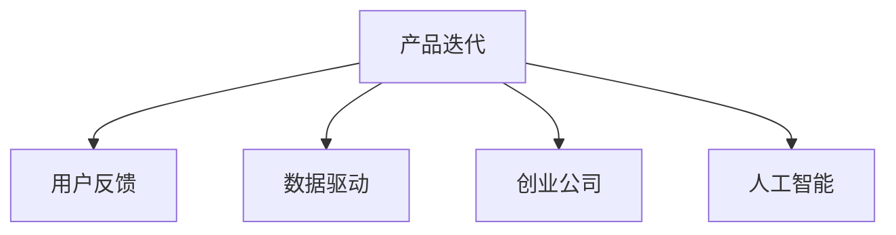

                 

# AI创业公司的产品迭代与升级策略：用户反馈与数据驱动

> 关键词：产品迭代, 用户反馈, 数据驱动, 创业公司, 人工智能

## 1. 背景介绍

### 1.1 问题由来
随着人工智能技术的迅猛发展，越来越多的AI创业公司涌现出来，致力于将前沿的AI技术转化为实际的应用产品。然而，如何在激烈的市场竞争中生存并取得成功，却是一个严峻的问题。产品迭代与升级是公司生存的关键，也是创新发展的必要手段。但如何在产品迭代与升级过程中充分利用数据驱动和用户反馈，提升产品质量和用户体验，是一个值得深入探讨的问题。

### 1.2 问题核心关键点
AI创业公司的产品迭代与升级策略，需要建立在数据驱动和用户反馈的基础上。只有通过科学的策略和高效的方法，才能确保产品持续改进，满足市场和用户需求，获得商业成功。

### 1.3 问题研究意义
深入研究AI创业公司的产品迭代与升级策略，对于提升产品竞争力、促进AI技术的落地应用具有重要意义：

1. **增强用户体验**：通过用户反馈和数据分析，可以更准确地把握用户需求和行为，提升产品的使用体验和满意度。
2. **优化产品性能**：数据驱动的产品迭代可以基于客观数据分析结果，优化产品功能和性能，解决实际问题。
3. **降低开发成本**：科学的产品迭代策略可以减少盲目开发和反复调整，降低开发成本和周期。
4. **提升市场竞争力**：通过持续的产品优化和创新，可以更好地适应市场变化，保持竞争优势。
5. **推动技术创新**：基于数据和用户反馈的迭代过程，可以不断探索新的技术方向，推动AI技术的进步。

## 2. 核心概念与联系

### 2.1 核心概念概述

为更好地理解AI创业公司的产品迭代与升级策略，本节将介绍几个密切相关的核心概念：

- **产品迭代**：指在产品开发和部署过程中，根据用户反馈和市场变化，不断改进和优化产品的过程。
- **用户反馈**：指用户在使用产品过程中，对于产品功能、性能、界面等各方面提出的意见和建议。
- **数据驱动**：指在产品迭代过程中，基于数据和统计分析结果，指导产品决策和优化的方法。
- **创业公司**：指以创新为核心，致力于将前沿技术转化为实际应用，推动社会发展的企业。
- **人工智能**：指利用计算机模拟人脑智能行为，包括机器学习、深度学习等技术，实现自动感知、决策和控制等功能的学科。

这些概念之间的逻辑关系可以通过以下Mermaid流程图来展示：



这个流程图展示产品迭代与升级的关键概念及其之间的关系：

1. 产品迭代是整个过程的核心，依据用户反馈和数据驱动进行。
2. 用户反馈是迭代过程中重要的输入来源，帮助企业理解用户需求和行为。
3. 数据驱动提供科学的决策依据，确保产品迭代有据可依。
4. 创业公司是产品迭代的主体，需要灵活应用各种技术和方法。
5. 人工智能是技术基础，支持产品迭代和用户反馈的科学分析。

## 3. 核心算法原理 & 具体操作步骤
### 3.1 算法原理概述

AI创业公司的产品迭代与升级策略，本质上是一种基于数据和用户反馈的产品优化方法。其核心思想是：通过收集用户反馈和市场数据，利用数据驱动和人工智能技术，指导产品的不断改进和升级，提升用户体验和市场竞争力。

形式化地，假设产品为 $P$，用户反馈为 $F$，市场数据为 $D$，优化目标为 $O$，则产品迭代的过程可以表示为：

$$
P' = \mathop{\arg\min}_{P} \| P - P' \|_{D,F}
$$

其中，$\| P - P' \|_{D,F}$ 表示产品 $P'$ 与产品 $P$ 在数据 $D$ 和用户反馈 $F$ 下的差异度。

通过最小化差异度，产品 $P'$ 可以不断逼近最优状态，提升用户体验和市场竞争力。

### 3.2 算法步骤详解

AI创业公司的产品迭代与升级策略，一般包括以下几个关键步骤：

**Step 1: 收集用户反馈和市场数据**
- 通过用户调研、在线反馈、社交媒体等渠道，收集用户对于产品的评价和建议。
- 收集市场数据，包括用户增长数据、收入数据、市场竞争数据等。

**Step 2: 数据预处理和清洗**
- 对收集到的用户反馈和市场数据进行预处理，如去除重复数据、处理缺失值、数据归一化等。
- 清洗数据，去除噪声和异常值，确保数据的准确性和完整性。

**Step 3: 数据分析与建模**
- 利用数据驱动方法，对用户反馈和市场数据进行分析，建立模型，如回归模型、分类模型、聚类模型等。
- 结合人工智能技术，使用机器学习算法进行模型训练，如随机森林、深度学习等。

**Step 4: 产品优化与升级**
- 基于数据分析结果，对产品进行优化和升级，如调整功能、改进界面、提高性能等。
- 测试优化后的产品，确保其满足用户需求和市场变化。

**Step 5: 迭代测试与反馈**
- 将优化后的产品发布到市场，收集新的用户反馈和市场数据。
- 根据新的反馈和数据，重新进行数据分析与建模，进行下一轮迭代。

### 3.3 算法优缺点

基于数据驱动和用户反馈的产品迭代方法，具有以下优点：

1. **数据驱动**：基于客观数据和统计分析，减少主观偏见，提升决策的科学性和准确性。
2. **用户中心**：充分考虑用户需求和反馈，提升用户体验和满意度。
3. **快速迭代**：通过快速收集和分析数据，可以及时响应市场变化，保持产品竞争力。
4. **持续改进**：通过不断迭代和优化，产品能够逐步提升性能和功能，满足用户长期需求。

同时，该方法也存在一定的局限性：

1. **数据质量问题**：用户反馈和市场数据的质量往往难以保证，可能存在噪声和偏差。
2. **隐私保护**：在收集和分析用户数据时，需要严格遵守隐私保护法规，避免数据泄露风险。
3. **模型复杂性**：复杂的数据分析模型可能带来较高的计算成本和算法复杂度。
4. **市场复杂性**：市场环境和用户需求变化复杂，单一数据驱动方法可能无法全面覆盖。

尽管存在这些局限性，但就目前而言，基于数据驱动和用户反馈的产品迭代方法，仍是AI创业公司优化产品的重要手段。未来相关研究的重点在于如何进一步提升数据质量，简化模型，兼顾隐私保护和用户反馈。

### 3.4 算法应用领域

基于数据驱动和用户反馈的产品迭代方法，已经在AI创业公司的多个领域得到了广泛应用，例如：

- **智能客服系统**：通过用户反馈和市场数据，不断优化客服系统的回答准确性和用户满意度。
- **智能推荐系统**：根据用户行为数据和反馈，调整推荐算法，提升推荐效果和用户粘性。
- **金融科技应用**：利用用户交易数据和市场趋势，优化金融产品的设计和功能，降低金融风险。
- **健康医疗服务**：通过患者反馈和医疗数据，改进诊疗工具和流程，提升医疗服务质量。
- **智能家居设备**：基于用户使用数据和反馈，调整设备功能和界面，提升用户体验。
- **教育技术应用**：根据学生反馈和学习数据，优化教育内容和学习路径，提升教育效果。

除了上述这些经典应用外，AI创业公司在更多领域中也正在探索和实践基于数据驱动和用户反馈的产品迭代策略，为各行各业提供智能化解决方案。

## 4. 数学模型和公式 & 详细讲解 & 举例说明

### 4.1 数学模型构建

本节将使用数学语言对基于数据驱动和用户反馈的产品迭代过程进行更加严格的刻画。

记产品为 $P$，用户反馈为 $F$，市场数据为 $D$，优化目标为 $O$。

假设用户反馈 $F$ 包含 $n$ 个用户的评价，每个评价由 $m$ 个指标 $x_{ij}$ 组成，记为 $F = [(x_{i1},x_{i2},...,x_{im})]_{i=1}^n$。市场数据 $D$ 包含 $k$ 个指标 $y_i$，记为 $D = [y_1,y_2,...,y_k]$。

定义产品优化指标为 $O = [o_1,o_2,...,o_m]$，其中 $o_i$ 表示产品在第 $i$ 个指标上的性能，可以包括用户满意度、交易量、增长率等。

### 4.2 公式推导过程

假设 $P$ 与 $P'$ 之间的差异度可以通过如下公式计算：

$$
\| P - P' \|_{D,F} = \sum_{i=1}^n \sum_{j=1}^m (x_{ij} - o_i)^2 + \sum_{i=1}^k (y_i - p_i)^2
$$

其中，$o_i$ 表示理想产品性能，$p_i$ 表示实际产品性能。

通过最小化差异度，优化后的产品 $P'$ 可以满足用户需求和市场变化。

### 4.3 案例分析与讲解

以智能推荐系统为例，分析基于用户反馈和市场数据的产品迭代过程。

**Step 1: 收集数据**

- 收集用户对推荐内容的使用反馈，如浏览时间、点击率等。
- 收集市场数据，如用户增长、推荐内容点击量等。

**Step 2: 数据预处理**

- 将用户反馈和市场数据进行预处理，去除重复数据和异常值。
- 对数据进行归一化处理，确保不同指标之间的可比性。

**Step 3: 数据分析与建模**

- 使用回归模型分析用户反馈和市场数据之间的关系。
- 利用深度学习算法，如神经网络，建立推荐模型，优化推荐算法。

**Step 4: 产品优化**

- 根据回归分析结果，调整推荐算法中的参数。
- 使用深度学习模型，训练新的推荐系统，提升推荐效果。

**Step 5: 迭代测试**

- 将优化后的推荐系统发布到市场，收集新的用户反馈和市场数据。
- 根据新的反馈和数据，重新进行数据分析与建模，进行下一轮迭代。

通过上述步骤，智能推荐系统可以不断优化推荐效果，提升用户体验和满意度。

## 5. 项目实践：代码实例和详细解释说明
### 5.1 开发环境搭建

在进行产品迭代与升级实践前，我们需要准备好开发环境。以下是使用Python进行Scikit-Learn和TensorFlow开发的环境配置流程：

1. 安装Anaconda：从官网下载并安装Anaconda，用于创建独立的Python环境。

2. 创建并激活虚拟环境：
```bash
conda create -n my_env python=3.8 
conda activate my_env
```

3. 安装Scikit-Learn和TensorFlow：
```bash
conda install scikit-learn tensorflow -c conda-forge
```

4. 安装其他工具包：
```bash
pip install pandas numpy matplotlib seaborn jupyter notebook
```

完成上述步骤后，即可在`my_env`环境中开始项目实践。

### 5.2 源代码详细实现

下面我们以智能推荐系统为例，给出使用Scikit-Learn和TensorFlow进行产品迭代与升级的PyTorch代码实现。

首先，定义推荐系统的数据处理函数：

```python
import pandas as pd
from sklearn.model_selection import train_test_split
from sklearn.metrics import mean_squared_error, r2_score
import tensorflow as tf

# 读取数据
data = pd.read_csv('recommendation_data.csv')

# 数据预处理
# 将用户反馈和市场数据进行预处理
# 去除重复数据和异常值
# 对数据进行归一化处理
```

然后，定义推荐模型的训练函数：

```python
def train_model(model, data, target, test_size=0.2, epochs=100, batch_size=32):
    # 划分训练集和测试集
    train_data, test_data = train_test_split(data, test_size=test_size)
    
    # 定义模型损失函数和优化器
    model.compile(optimizer='adam', loss='mse')
    
    # 训练模型
    history = model.fit(train_data, epochs=epochs, batch_size=batch_size, validation_data=test_data)
    
    # 评估模型性能
    y_pred = model.predict(test_data)
    mse = mean_squared_error(test_data, y_pred)
    r2 = r2_score(test_data, y_pred)
    
    return history, mse, r2
```

接着，定义推荐系统的评估函数：

```python
def evaluate_model(model, data):
    # 评估模型性能
    y_pred = model.predict(data)
    mse = mean_squared_error(data, y_pred)
    r2 = r2_score(data, y_pred)
    
    return mse, r2
```

最后，启动训练流程并在测试集上评估：

```python
# 加载模型
model = tf.keras.models.load_model('recommendation_model.h5')

# 训练模型
history, mse, r2 = train_model(model, train_data, 'target')

# 评估模型
mse_test, r2_test = evaluate_model(model, test_data)

print(f'训练集的MSE: {mse:.2f}')
print(f'训练集的R^2: {r2:.2f}')
print(f'测试集的MSE: {mse_test:.2f}')
print(f'测试集的R^2: {r2_test:.2f}')
```

以上就是使用Scikit-Learn和TensorFlow进行智能推荐系统产品迭代与升级的完整代码实现。可以看到，借助Scikit-Learn和TensorFlow，产品迭代与升级过程可以高效地进行，并且可以随时调整模型参数和算法，进行迭代优化。

### 5.3 代码解读与分析

让我们再详细解读一下关键代码的实现细节：

**数据处理函数**：
- 使用Pandas库读取数据集，并进行预处理，去除重复数据和异常值，对数据进行归一化处理。

**训练函数**：
- 使用train_test_split函数划分训练集和测试集。
- 定义模型损失函数和优化器，使用Scikit-Learn的模型训练方法进行模型训练。
- 在训练过程中，使用Validation数据集进行模型性能评估，避免过拟合。

**评估函数**：
- 使用模型在测试集上进行评估，计算MSE和R^2等指标，评估模型性能。

**训练流程**：
- 加载已经训练好的模型，并进行新一轮的训练和评估。

可以看到，基于Scikit-Learn和TensorFlow的产品迭代与升级，可以大大简化代码实现，提升开发效率。开发者可以将更多精力放在数据处理、模型优化等高层次逻辑上，而不必过多关注底层的实现细节。

当然，工业级的系统实现还需考虑更多因素，如模型的保存和部署、超参数的自动搜索、更加灵活的任务适配层等。但核心的产品迭代与升级范式基本与此类似。

## 6. 实际应用场景
### 6.1 智能客服系统

基于用户反馈和市场数据的产品迭代策略，可以广泛应用于智能客服系统的构建。传统客服往往需要配备大量人力，高峰期响应缓慢，且一致性和专业性难以保证。使用基于数据驱动和用户反馈的产品迭代策略，可以大幅提升客服系统的智能化水平，改善用户体验。

在技术实现上，可以收集企业内部的历史客服对话记录，将问题和最佳答复构建成监督数据，在此基础上对预训练模型进行微调。微调后的模型能够自动理解用户意图，匹配最合适的答案模板进行回复。对于客户提出的新问题，还可以接入检索系统实时搜索相关内容，动态组织生成回答。如此构建的智能客服系统，能大幅提升客户咨询体验和问题解决效率。

### 6.2 金融科技应用

金融科技公司利用用户交易数据和市场趋势，优化金融产品的设计和功能，降低金融风险。基于数据驱动和用户反馈的产品迭代策略，可以在金融产品迭代过程中，不断优化产品功能和性能，满足用户需求，提升金融服务的质量和安全性。

具体而言，可以收集金融领域相关的新闻、报道、评论等文本数据，进行情感分析和主题识别，实时监测市场动态，根据用户交易行为，优化金融产品推荐和风险控制算法，实现精准营销和风险管理。

### 6.3 健康医疗服务

健康医疗服务公司基于患者反馈和医疗数据，改进诊疗工具和流程，提升医疗服务质量。通过产品迭代与升级，可以不断优化医疗服务系统，提升诊疗效率和患者满意度。

例如，基于患者的健康数据和反馈，优化智能诊断系统，实现快速准确的疾病诊断，提高医疗服务的精准性和可靠性。同时，根据患者的反馈，调整医疗服务的流程和界面，提升用户体验和满意度。

### 6.4 未来应用展望

随着数据驱动和用户反馈的深度应用，基于产品迭代与升级的AI创业公司必将在更多领域得到应用，为各行各业带来变革性影响。

在智慧医疗领域，基于数据驱动和用户反馈的产品迭代策略，可以构建更加智能、高效的医疗服务系统，实现精准医疗和个性化治疗。

在智能教育领域，通过产品迭代与升级，可以实现更加智能、个性化的教育服务，提升学生的学习效果和教师的教学质量。

在智能家居领域，基于用户反馈和市场数据的产品迭代策略，可以构建更加智能化、便捷的家居系统，提升用户的生活质量和舒适度。

此外，在企业生产、社会治理、文娱传媒等众多领域，基于数据驱动和用户反馈的产品迭代策略，也将不断涌现，为社会治理和经济发展注入新的动力。相信随着技术的日益成熟，产品迭代与升级策略将成为AI创业公司的重要手段，推动人工智能技术向更广泛的应用领域加速渗透。

## 7. 工具和资源推荐
### 7.1 学习资源推荐

为了帮助开发者系统掌握基于数据驱动和用户反馈的产品迭代理论基础和实践技巧，这里推荐一些优质的学习资源：

1. 《数据驱动的产品迭代》系列博文：由产品管理专家撰写，深入浅出地介绍了数据驱动和用户反馈在产品迭代中的应用。

2. Udacity《数据分析与机器学习》课程：斯坦福大学教授开设的在线课程，涵盖数据分析、机器学习、产品迭代等前沿知识。

3. 《数据驱动的产品迭代》书籍：系统介绍了数据驱动和用户反馈在产品迭代中的应用案例，提供了丰富的实践方法和工具。

4. Google Data Analytics官方文档：详细介绍了Google Analytics等数据驱动工具的使用方法，帮助开发者科学地分析用户数据。

5. Databricks官方文档：提供了一套完整的数据驱动和用户反馈分析流程，适用于各种规模的企业。

通过对这些资源的学习实践，相信你一定能够快速掌握基于数据驱动和用户反馈的产品迭代精髓，并用于解决实际的AI产品问题。

### 7.2 开发工具推荐

高效的开发离不开优秀的工具支持。以下是几款用于产品迭代与升级开发的常用工具：

1. Jupyter Notebook：免费的开源交互式笔记本，支持Python、Scikit-Learn、TensorFlow等工具，适合数据驱动和用户反馈的科学计算和数据分析。

2. Tableau：强大的数据可视化工具，支持多种数据源，帮助开发者直观地分析用户反馈和市场数据。

3. Apache Kafka：实时流数据处理平台，支持数据收集和清洗，适用于大规模数据驱动的产品迭代。

4. Apache Hadoop：大数据处理框架，支持海量数据存储和处理，适用于企业级数据驱动的产品迭代。

5. Jenkins：开源的持续集成工具，支持自动化构建、测试和部署，适用于快速迭代和持续交付的产品开发。

6. Google Cloud Platform：云端数据驱动和用户反馈分析平台，支持多种数据分析工具和API，适用于云端产品迭代。

合理利用这些工具，可以显著提升产品迭代与升级的开发效率，加快创新迭代的步伐。

### 7.3 相关论文推荐

数据驱动和用户反馈的产品迭代策略，源于学界的持续研究。以下是几篇奠基性的相关论文，推荐阅读：

1. "How Good Are User Feedback Metrics?"（用户反馈指标评估）：探讨了如何科学地评估用户反馈在产品迭代中的作用，提供了多种评估方法和工具。

2. "Product Innovation in Data-Driven Digital Businesses"（数据驱动的数字企业创新）：介绍了数据驱动在企业创新中的应用案例，强调了数据驱动在产品迭代中的重要性。

3. "A Survey on Product Line Evolution in Software Engineering"（软件工程中的产品线演化）：系统综述了产品线演化的理论和方法，提供了多种产品迭代策略和工具。

4. "A Machine Learning Approach to Customer Feedback Sentiment Analysis"（机器学习方法在用户反馈情感分析中的应用）：介绍了机器学习在用户反馈情感分析中的应用，帮助企业更好地理解用户反馈。

5. "Designing and Deploying Data-Driven Products"（设计与部署数据驱动的产品）：系统介绍了数据驱动在产品设计和部署中的应用，提供了多种方法论和工具。

这些论文代表了大数据驱动和用户反馈的产品迭代技术的发展脉络。通过学习这些前沿成果，可以帮助研究者把握学科前进方向，激发更多的创新灵感。

## 8. 总结：未来发展趋势与挑战

### 8.1 总结

本文对基于数据驱动和用户反馈的AI创业公司产品迭代与升级策略进行了全面系统的介绍。首先阐述了数据驱动和用户反馈在产品迭代与升级中的重要作用，明确了产品迭代在提升用户体验、优化产品性能等方面的独特价值。其次，从原理到实践，详细讲解了数据驱动和用户反馈的产品迭代数学模型和具体步骤，给出了产品迭代任务开发的完整代码实例。同时，本文还广泛探讨了产品迭代策略在智能客服、金融科技、健康医疗等多个行业领域的应用前景，展示了数据驱动和用户反馈的巨大潜力。此外，本文精选了产品迭代策略的相关学习资源，力求为读者提供全方位的技术指引。

通过本文的系统梳理，可以看到，基于数据驱动和用户反馈的产品迭代策略，已经成为AI创业公司优化产品的关键手段。该方法通过科学的决策依据和灵活的迭代过程，不断提升产品的质量和服务水平，为AI技术的落地应用提供了重要保障。未来，随着数据驱动和用户反馈技术的进一步发展，产品迭代策略必将迎来新的突破，为AI创业公司带来更多的创新机遇和市场价值。

### 8.2 未来发展趋势

展望未来，数据驱动和用户反馈的产品迭代策略将呈现以下几个发展趋势：

1. **数据质量的提升**：随着数据收集和清洗技术的进步，数据质量将进一步提升，有助于更准确地把握用户需求和市场变化。

2. **实时分析的普及**：基于大数据技术和实时分析工具，产品迭代过程可以实时进行，快速响应市场变化，提升产品竞争力。

3. **智能化的用户反馈**：引入人工智能技术，如自然语言处理、情感分析等，更智能地处理和分析用户反馈，提升产品迭代的科学性和准确性。

4. **多渠道的融合**：结合社交媒体、移动应用、电商平台等多种渠道的用户反馈，实现多渠道数据的融合，提升产品迭代的效果和覆盖范围。

5. **数据隐私的保护**：在数据驱动的产品迭代过程中，严格遵守数据隐私保护法规，确保用户数据的保密性和安全性。

6. **自动化迭代工具**：开发自动化、智能化的产品迭代工具，降低人工成本，提高迭代效率。

以上趋势凸显了数据驱动和用户反馈产品迭代技术的广阔前景。这些方向的探索发展，必将进一步提升AI创业公司产品的性能和市场竞争力，为技术创新和商业成功提供坚实的基础。

### 8.3 面临的挑战

尽管数据驱动和用户反馈的产品迭代策略已经取得了显著成果，但在迈向更加智能化、普适化应用的过程中，它仍面临着诸多挑战：

1. **数据质量瓶颈**：用户反馈和市场数据的质量往往难以保证，可能存在噪声和偏差。如何进一步提升数据质量，优化数据收集和清洗方法，将是一大难题。

2. **模型复杂性**：复杂的数据分析模型可能带来较高的计算成本和算法复杂度。如何简化模型，提高数据驱动和用户反馈的效率，需要更多研究和实践。

3. **隐私保护**：在数据驱动的产品迭代过程中，严格遵守数据隐私保护法规，确保用户数据的保密性和安全性，是一个重要的挑战。

4. **市场复杂性**：市场环境和用户需求变化复杂，单一数据驱动方法可能无法全面覆盖。如何构建更加全面、高效的数据驱动和用户反馈模型，是一个重要的研究方向。

5. **反馈多样性**：用户反馈的形式多样，包含文字、语音、图像等多种类型。如何有效处理和分析多样化的用户反馈，提取有价值的信息，是一个技术挑战。

6. **实时反馈的采集和处理**：在实时分析和迭代过程中，如何快速采集和处理用户反馈和市场数据，是一个需要解决的问题。

正视产品迭代与升级面临的这些挑战，积极应对并寻求突破，将是大数据驱动和用户反馈技术走向成熟的必由之路。相信随着技术进步和实践积累，这些挑战终将一一被克服，数据驱动和用户反馈的产品迭代策略必将带来更多创新机遇和市场价值。

### 8.4 研究展望

面对数据驱动和用户反馈产品迭代策略所面临的挑战，未来的研究需要在以下几个方面寻求新的突破：

1. **多模态数据融合**：结合文本、图像、语音等多模态数据，进行综合分析，提升产品迭代的全面性和准确性。

2. **智能化用户反馈**：引入人工智能技术，如自然语言处理、情感分析等，更智能地处理和分析用户反馈，提升产品迭代的科学性和准确性。

3. **自动化工具开发**：开发自动化、智能化的产品迭代工具，降低人工成本，提高迭代效率。

4. **数据隐私保护**：在数据驱动的产品迭代过程中，严格遵守数据隐私保护法规，确保用户数据的保密性和安全性。

5. **实时分析技术**：开发实时数据处理和分析技术，支持数据驱动的产品迭代过程，快速响应市场变化。

6. **多渠道反馈整合**：结合社交媒体、移动应用、电商平台等多种渠道的用户反馈，实现多渠道数据的融合，提升产品迭代的效果和覆盖范围。

这些研究方向的探索，必将引领数据驱动和用户反馈产品迭代技术迈向更高的台阶，为AI创业公司带来更多的创新机遇和市场价值。面向未来，数据驱动和用户反馈的产品迭代策略需要与其他人工智能技术进行更深入的融合，如知识表示、因果推理、强化学习等，多路径协同发力，共同推动自然语言理解和智能交互系统的进步。只有勇于创新、敢于突破，才能不断拓展产品迭代与升级的边界，让智能技术更好地造福人类社会。

## 9. 附录：常见问题与解答

**Q1：数据驱动和用户反馈在产品迭代中的应用是否适用于所有企业？**

A: 数据驱动和用户反馈在产品迭代中的应用，主要适用于产品复杂、市场变化频繁的企业。对于产品功能简单、市场变化较小的企业，可以考虑传统的产品迭代方法。

**Q2：如何选择合适的数据驱动和用户反馈模型？**

A: 选择合适的数据驱动和用户反馈模型，需要考虑数据的类型、规模、质量和用户需求等方面。一般来说，可以采用回归模型、分类模型、聚类模型等进行初步选择，并根据实际应用情况进行调整和优化。

**Q3：数据驱动和用户反馈在产品迭代中是否会导致过拟合？**

A: 数据驱动和用户反馈在产品迭代中，如果数据质量不高或者模型复杂度过高，可能导致过拟合。为了避免过拟合，可以采用正则化技术、交叉验证等方法，提高模型的泛化能力。

**Q4：如何确保数据驱动和用户反馈的产品迭代安全？**

A: 数据驱动和用户反馈的产品迭代过程中，需要严格遵守数据隐私保护法规，确保用户数据的安全和隐私。同时，可以通过加密、匿名化等手段，保护用户隐私，避免数据泄露。

**Q5：数据驱动和用户反馈的产品迭代是否需要持续进行？**

A: 数据驱动和用户反馈的产品迭代是一个持续的过程，需要定期收集和分析用户反馈，及时调整和优化产品。持续的产品迭代，可以不断提升产品的质量和市场竞争力，满足用户长期需求。

通过本文的系统梳理，可以看到，基于数据驱动和用户反馈的产品迭代策略，已经成为AI创业公司优化产品的关键手段。该方法通过科学的决策依据和灵活的迭代过程，不断提升产品的质量和服务水平，为AI技术的落地应用提供了重要保障。未来，随着数据驱动和用户反馈技术的进一步发展，产品迭代策略必将迎来新的突破，为AI创业公司带来更多的创新机遇和市场价值。

