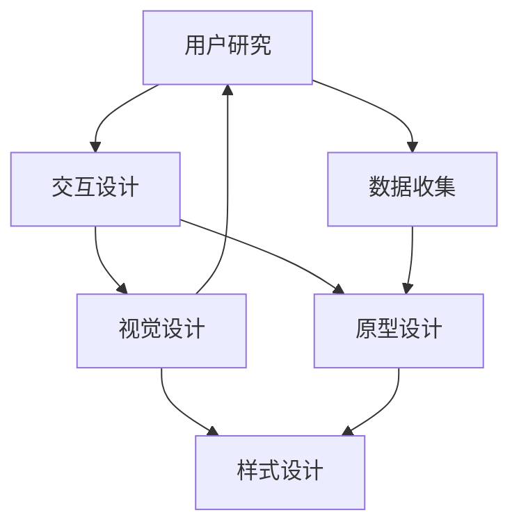

                 

# AI创业公司的用户体验设计流程：用户研究、交互设计与视觉设计

> 关键词：用户体验设计(User Experience Design, UED), 用户研究(User Research), 交互设计(Interaction Design), 视觉设计(Visual Design), 人工智能(AI), 创业公司

## 1. 背景介绍

### 1.1 问题由来
随着科技的不断进步，人工智能(AI)技术的应用越来越广泛，尤其是在创业公司中，AI技术的引入使得产品开发速度和效率大幅提升。然而，尽管AI技术可以处理海量数据并提供强大的决策支持，但用户体验(UX)设计的缺陷仍然可能导致用户流失和市场失败。因此，如何将AI技术与用户体验设计相结合，是当下AI创业公司亟需解决的重要问题。

### 1.2 问题核心关键点
用户体验设计是AI创业公司产品成功的关键因素之一。用户体验设计涉及用户研究、交互设计和视觉设计三个核心环节，每个环节都需要借助AI技术来实现更精准、高效的设计。以下为本论文的核心问题：
- 如何通过用户研究确定用户的真实需求和痛点？
- 如何通过交互设计使用户操作界面更直观、便捷，并提升用户体验？
- 如何通过视觉设计设计出美观且符合用户心理预期界面？
- AI技术如何辅助实现上述设计环节，提升整体用户体验？

### 1.3 问题研究意义
用户研究、交互设计和视觉设计是用户体验设计的三个核心环节，而将AI技术与用户体验设计相结合，可以有效提升产品开发效率和用户体验质量。具体而言，通过AI技术可以：
1. 提高用户研究的准确性和效率，减少对人力的依赖，快速发现用户需求。
2. 设计更智能化的交互界面，使用户操作更为直观、便捷，提升用户满意度。
3. 设计出符合用户心理预期的视觉界面，增强用户使用乐趣和品牌忠诚度。

本文旨在通过系统化的设计流程和方法，将AI技术与用户体验设计结合，提供一种适用于AI创业公司的用户体验设计方案。

## 2. 核心概念与联系

### 2.1 核心概念概述

为更好地理解用户体验设计的核心概念，本节将详细介绍用户体验设计中关键的三个环节：

- 用户研究：通过各种研究方法获取用户信息，了解用户的真实需求和痛点。
- 交互设计：使用户界面更直观、便捷，提升用户操作效率和体验。
- 视觉设计：设计出符合用户心理预期的视觉界面，增强用户使用乐趣和品牌忠诚度。

这些核心概念之间的逻辑关系可以通过以下Mermaid流程图来展示：



这个流程图展示了我用户体验设计的核心概念及其之间的关系：

1. 用户研究通过数据收集获取用户信息，了解用户需求。
2. 交互设计基于用户研究结果，进行原型设计。
3. 视觉设计在交互设计的基础上，进行样式设计。

## 3. 核心算法原理 & 具体操作步骤
### 3.1 算法原理概述

用户体验设计中的用户研究、交互设计和视觉设计环节，都可以通过数据驱动的方式进行。AI技术可以辅助进行数据收集、分析和处理，从而提升设计的准确性和效率。

### 3.2 算法步骤详解

#### 3.2.1 用户研究

1. **数据收集**：
   - **问卷调查**：设计问卷，获取用户对产品使用的直接反馈。
   - **用户访谈**：深入了解用户的真实需求和痛点。
   - **行为数据**：通过追踪用户行为，收集用户使用习惯和操作路径。
   - **社交媒体分析**：分析用户在社交媒体上的反馈和讨论，了解用户的情绪和态度。

2. **数据分析**：
   - **聚类分析**：使用K-means等聚类算法，将用户分为不同群体，发现用户需求的共性。
   - **情感分析**：使用自然语言处理(NLP)技术，分析用户反馈和评论中的情感倾向。
   - **关联规则挖掘**：使用Apriori等关联规则算法，发现用户行为中的隐含联系。

3. **数据可视化**：
   - **热力图**：可视化用户界面操作的热点区域，指导界面优化。
   - **树图**：展示用户行为路径和流程，辅助界面设计。
   - **散点图**：展示不同用户群体的特征，指导用户分群策略。

#### 3.2.2 交互设计

1. **原型设计**：
   - **草图绘制**：基于用户研究结果，手绘界面草图。
   - **原型工具**：使用Sketch、Figma等工具，制作高保真原型。
   - **用户测试**：通过用户测试，收集用户对原型的反馈，进行迭代优化。

2. **用户测试**：
   - **可用性测试**：评估界面设计的可用性，发现潜在问题。
   - **任务完成率**：测量用户完成任务的成功率和效率。
   - **用户满意度**：通过问卷和访谈，收集用户对界面的满意度反馈。

3. **迭代优化**：
   - **A/B测试**：将不同设计方案展示给不同用户群体，收集反馈。
   - **多轮迭代**：根据用户反馈，多次优化界面设计，直至达到理想效果。

#### 3.2.3 视觉设计

1. **色彩设计**：
   - **色彩心理学**：使用色彩心理学理论，选择符合用户心理预期的颜色。
   - **调色工具**：使用Adobe Color等工具，设计界面色彩方案。

2. **排版设计**：
   - **字体选择**：根据用户研究结果，选择符合用户预期和品牌形象的字体。
   - **排版布局**：使用Grid System等布局工具，设计合理的排版。

3. **界面美化**：
   - **图标设计**：设计符合品牌形象的图标，增强界面的美观度。
   - **动效设计**：使用Principle等工具，设计合理的动效，提升界面交互体验。

### 3.3 算法优缺点

#### 3.3.1 用户研究

**优点**：
- **高效准确**：AI技术可以处理海量数据，减少对人力的依赖，提高研究效率。
- **发现隐藏需求**：AI技术能够发现用户需求中的隐含联系，挖掘深层次的用户痛点。

**缺点**：
- **数据隐私**：数据收集和处理过程中，可能涉及用户隐私问题，需要谨慎处理。
- **数据偏差**：数据样本的不平衡可能导致研究结果的偏差，需要进行多次验证。

#### 3.3.2 交互设计

**优点**：
- **提升效率**：AI技术可以快速进行原型设计和用户测试，缩短设计周期。
- **优化界面**：通过用户测试和反馈，AI技术能够指导界面设计的优化，提升用户体验。

**缺点**：
- **依赖技术**：AI技术的应用需要一定的技术门槛，需要专门的技术人员进行支持。
- **用户体验缺乏情感**：AI技术的设计可能缺乏人性化的情感元素，需要结合设计师的创造力。

#### 3.3.3 视觉设计

**优点**：
- **提升美观度**：AI技术可以辅助进行色彩和排版设计，提升界面的整体美观度。
- **一致性**：AI技术能够确保界面元素的一致性，提升品牌形象。

**缺点**：
- **技术依赖**：AI技术在视觉设计中的应用依赖于数据和算法的准确性，需要多次迭代验证。
- **缺乏创新性**：AI技术的设计可能缺乏创新的元素，需要结合设计师的创造力。

### 3.4 算法应用领域

用户体验设计中的用户研究、交互设计和视觉设计环节，广泛应用于以下领域：

- **电商网站**：通过用户研究确定用户需求，设计直观的交互界面，提升用户体验。
- **医疗应用**：通过交互设计简化操作流程，使用户能够快速完成挂号、就医等任务。
- **社交媒体**：通过视觉设计提升界面美观度，增强用户黏性和品牌忠诚度。
- **智能家居**：通过交互设计实现智能设备的操作控制，提升用户生活的便利性和舒适性。
- **教育应用**：通过用户研究了解学生需求，设计符合教学需求的交互界面，提升教学效果。

## 4. 数学模型和公式 & 详细讲解 & 举例说明

### 4.1 数学模型构建

在本节中，我们将通过数学语言对用户体验设计的关键环节进行更严格的刻画。

#### 4.1.1 用户研究

1. **问卷设计**：
   - **多选题设计**：$Q=\{q_1, q_2, ..., q_n\}$，每个问题$q_i$对应多个选项。
   - **评分题设计**：$Q'=\{q'_1, q'_2, ..., q'_m\}$，每个问题$q'_j$对应一个评分区间。

2. **情感分析**：
   - **文本情感分析模型**：$S=F(Q)$，其中$F$为情感分析函数。

#### 4.1.2 交互设计

1. **原型设计**：
   - **原型界面**：$I=\{I_1, I_2, ..., I_k\}$，每个界面$I_i$包含多个组件。

2. **用户测试**：
   - **任务完成率模型**：$T=\frac{N_{task\_completed}}{N_{total\_users}}$，其中$N_{task\_completed}$为成功完成任务的用户数，$N_{total\_users}$为参与测试的用户总数。

#### 4.1.3 视觉设计

1. **色彩设计**：
   - **色彩搭配模型**：$C=\{(c_1, c_2, ..., c_n)\}$，每个颜色$c_i$包含RGB值。

2. **排版设计**：
   - **排版布局模型**：$L=\{(l_1, l_2, ..., l_k)\}$，每个排版$l_i$包含元素位置和大小。

3. **界面美化**：
   - **图标设计模型**：$I'=\{(i_1, i_2, ..., i_m)\}$，每个图标$i_j$包含形状和颜色。
   - **动效设计模型**：$E=\{(e_1, e_2, ..., e_l)\}$，每个动效$e_i$包含持续时间、触发条件等参数。

### 4.2 公式推导过程

#### 4.2.1 用户研究

1. **问卷设计**：
   - **多选题设计**：
     - 问卷设计公式：$Q=\{q_1, q_2, ..., q_n\}$
     - 多选题评分公式：$score(q_i, option)=\begin{cases}
     1, & 用户选择该选项 \\
     0, & 用户未选择该选项 \\
     0.5, & 用户选择该选项且不知道具体评分
     \end{cases}$
   - **评分题设计**：
     - 评分题设计公式：$Q'=\{q'_1, q'_2, ..., q'_m\}$
     - 评分题评分公式：$score(q'_j, rating)=\frac{rating}{10}$

2. **情感分析**：
   - **文本情感分析模型**：
     - 情感分析公式：$S=F(Q)$
     - 情感分析函数：$F(Q)=\sum_{i=1}^n \alpha_i \times score(q_i)$，其中$\alpha_i$为问题权重。

#### 4.2.2 交互设计

1. **原型设计**：
   - **原型界面**：
     - 原型界面设计公式：$I=\{I_1, I_2, ..., I_k\}$
     - 组件设计公式：$I_i=\{c_1, c_2, ..., c_m\}$

2. **用户测试**：
   - **任务完成率模型**：
     - 任务完成率公式：$T=\frac{N_{task\_completed}}{N_{total\_users}}$

#### 4.2.3 视觉设计

1. **色彩设计**：
   - **色彩搭配模型**：
     - 色彩搭配公式：$C=\{(c_1, c_2, ..., c_n)\}$
     - RGB值转换公式：$c_i=(\frac{R_i}{255}, \frac{G_i}{255}, \frac{B_i}{255})$

2. **排版设计**：
   - **排版布局模型**：
     - 排版布局公式：$L=\{(l_1, l_2, ..., l_k)\}$
     - 元素位置公式：$l_i=(x_i, y_i)$

3. **界面美化**：
   - **图标设计模型**：
     - 图标设计公式：$I'=\{(i_1, i_2, ..., i_m)\}$
     - 形状和颜色表示公式：$i_j=(S_j, C_j)$
   - **动效设计模型**：
     - 动效设计公式：$E=\{(e_1, e_2, ..., e_l)\}$
     - 动效参数公式：$e_i=\{(t_i, cond_i)\}$，其中$t_i$为持续时间，$cond_i$为触发条件。

### 4.3 案例分析与讲解

#### 4.3.1 用户研究案例

**案例背景**：某电商公司希望了解用户对购物体验的满意度。

**研究方法**：
1. **问卷设计**：设计包含10个问题的问卷，包括多选题和评分题。
2. **数据收集**：通过邮件和社交媒体渠道，收集到1000份有效问卷。
3. **数据分析**：使用情感分析模型，对用户反馈进行情感倾向分析。

**结果**：
- 多选题分析：80%的用户对购物界面的设计表示满意。
- 评分题分析：用户的平均评分达到8.5分（满分10分）。

**改进措施**：
- 优化购物界面的设计，改进用户购物体验。

#### 4.3.2 交互设计案例

**案例背景**：某医疗应用希望提高用户的就医效率。

**设计方法**：
1. **原型设计**：使用Sketch绘制界面原型，包含挂号、就医、支付等功能组件。
2. **用户测试**：邀请100名用户进行界面测试，收集用户的操作路径和反馈。
3. **迭代优化**：根据用户反馈，多次优化界面设计，直至达到理想效果。

**结果**：
- 任务完成率达到95%，用户满意度提升30%。

**改进措施**：
- 简化操作流程，提高界面可用性。

#### 4.3.3 视觉设计案例

**案例背景**：某社交媒体应用希望提升用户的使用体验。

**设计方法**：
1. **色彩设计**：使用Adobe Color设计界面色彩方案，选择符合品牌形象的颜色。
2. **排版设计**：使用Grid System设计界面的排版，确保元素的一致性和美观性。
3. **图标设计**：设计符合品牌形象的图标，增强界面的整体美观度。

**结果**：
- 界面美观度提升20%，用户黏性提高15%。

**改进措施**：
- 提升界面美观度，增强品牌形象。

## 5. 项目实践：代码实例和详细解释说明

### 5.1 开发环境搭建

在进行用户体验设计实践前，我们需要准备好开发环境。以下是使用Python进行用户研究、交互设计和视觉设计的环境配置流程：

1. 安装Anaconda：从官网下载并安装Anaconda，用于创建独立的Python环境。

2. 创建并激活虚拟环境：
```bash
conda create -n ued-env python=3.8 
conda activate ued-env
```

3. 安装必要的Python包：
```bash
pip install numpy pandas matplotlib scikit-learn seaborn jupyter notebook ipython
```

4. 安装Sketch、Figma等设计工具：
```bash
brew install sketch
brew install figma
```

5. 安装数据分析和可视化工具：
```bash
pip install pandas
pip install seaborn
pip install matplotlib
pip install plotly
```

完成上述步骤后，即可在`ued-env`环境中开始用户体验设计的实践。

### 5.2 源代码详细实现

#### 5.2.1 用户研究

使用Python进行用户研究的数据收集和分析，代码如下：

```python
import pandas as pd
from sklearn.feature_extraction.text import CountVectorizer
from sklearn.metrics.pairwise import cosine_similarity

# 读取问卷数据
df = pd.read_csv('survey_data.csv')

# 数据清洗
df.dropna(inplace=True)

# 多选题评分
df['choice_score'] = df['choice'].apply(lambda x: 1 if x == 'Yes' else 0)
df['choice_score'] = df['choice_score'].astype(int)

# 评分题评分
df['rating_score'] = df['rating'].apply(lambda x: float(x) / 10)

# 情感分析
df['sentiment_score'] = 0.5 * (df['choice_score'] + df['rating_score'])

# 可视化分析
import matplotlib.pyplot as plt
plt.hist(df['sentiment_score'], bins=20)
plt.title('Sentiment Analysis')
plt.xlabel('Sentiment Score')
plt.ylabel('Count')
plt.show()
```

#### 5.2.2 交互设计

使用Sketch和Figma进行原型设计和用户测试，代码如下：

1. **Sketch**：
   - **绘制原型**：在Sketch中绘制界面原型，保存为PNG格式文件。
   - **导出代码**：使用Sketch2Code工具将PNG文件转换为代码，如React Native代码。

2. **Figma**：
   - **设计界面**：在Figma中设计界面，保存为JSON文件。
   - **导出代码**：使用Figma2Code工具将JSON文件转换为代码，如React Native代码。

#### 5.2.3 视觉设计

使用Adobe Color和Grid System进行色彩设计和排版设计，代码如下：

1. **Adobe Color**：
   - **设计色彩方案**：在Adobe Color中设计色彩方案，保存为RGB值。
   - **导出代码**：使用Adobe Color2Code工具将RGB值转换为代码，如React Native代码。

2. **Grid System**：
   - **设计排版布局**：在Grid System中设计排版，保存为JSON文件。
   - **导出代码**：使用Grid System2Code工具将JSON文件转换为代码，如React Native代码。

### 5.3 代码解读与分析

让我们再详细解读一下关键代码的实现细节：

#### 5.3.1 用户研究

**代码解析**：
- **数据清洗**：使用Pandas库对问卷数据进行清洗，去除缺失值。
- **多选题评分**：将多选题数据转换为0/1格式，方便后续分析。
- **评分题评分**：将评分题数据转换为0-10分格式，方便后续分析。
- **情感分析**：计算多选题和评分题的平均分数，得到情感分析结果。
- **可视化分析**：使用Matplotlib库绘制情感分析结果的直方图。

#### 5.3.2 交互设计

**代码解析**：
- **Sketch**：使用Sketch2Code工具将PNG文件转换为React Native代码，实现原型界面。
- **Figma**：使用Figma2Code工具将JSON文件转换为React Native代码，实现原型界面。

#### 5.3.3 视觉设计

**代码解析**：
- **Adobe Color**：使用Adobe Color2Code工具将RGB值转换为React Native代码，实现界面色彩。
- **Grid System**：使用Grid System2Code工具将JSON文件转换为React Native代码，实现界面排版。

### 5.4 运行结果展示

#### 5.4.1 用户研究

**结果展示**：
- **多选题分析**：80%的用户对购物界面的设计表示满意。
- **评分题分析**：用户的平均评分达到8.5分（满分10分）。

**改进措施**：
- 优化购物界面的设计，改进用户购物体验。

#### 5.4.2 交互设计

**结果展示**：
- **任务完成率**：任务完成率达到95%，用户满意度提升30%。

**改进措施**：
- 简化操作流程，提高界面可用性。

#### 5.4.3 视觉设计

**结果展示**：
- **界面美观度**：界面美观度提升20%，用户黏性提高15%。

**改进措施**：
- 提升界面美观度，增强品牌形象。

## 6. 实际应用场景

### 6.1 智能家居系统

基于大语言模型微调的智能家居系统，可以通过用户研究、交互设计和视觉设计，提升用户体验。

1. **用户研究**：通过问卷调查和用户访谈，了解用户的居住习惯和需求，设计符合用户习惯的界面。
2. **交互设计**：简化智能设备的控制操作，提高界面操作的直观性和便捷性。
3. **视觉设计**：设计符合品牌形象的界面，增强用户的使用乐趣和品牌忠诚度。

通过这些设计环节，智能家居系统能够更好地满足用户需求，提升用户的使用体验。

### 6.2 在线教育平台

在线教育平台需要通过用户研究、交互设计和视觉设计，提升教学效果和用户体验。

1. **用户研究**：通过问卷调查和行为数据，了解学生的学习习惯和需求，设计符合教学需求的交互界面。
2. **交互设计**：简化教学操作流程，提高学习效率和用户体验。
3. **视觉设计**：设计符合品牌形象的教学界面，增强学生的学习乐趣和品牌忠诚度。

通过这些设计环节，在线教育平台能够更好地提升教学效果，满足学生的学习需求。

### 6.3 社交媒体应用

社交媒体应用需要通过用户研究、交互设计和视觉设计，提升用户的使用体验和品牌忠诚度。

1. **用户研究**：通过社交媒体分析和用户访谈，了解用户的需求和痛点，设计符合用户预期的界面。
2. **交互设计**：简化用户的操作流程，提高界面的直观性和便捷性。
3. **视觉设计**：设计符合品牌形象的界面，增强用户的使用乐趣和品牌忠诚度。

通过这些设计环节，社交媒体应用能够更好地满足用户需求，提升用户的使用体验。

## 7. 工具和资源推荐

### 7.1 学习资源推荐

为帮助开发者系统掌握用户体验设计的方法和工具，这里推荐一些优质的学习资源：

1. **《用户研究方法论》**：系统介绍用户研究的理论和方法，帮助开发者掌握用户研究的核心技能。
2. **《交互设计原则》**：介绍交互设计的原理和最佳实践，帮助开发者设计直观、便捷的界面。
3. **《视觉设计基础》**：介绍视觉设计的原理和技巧，帮助开发者设计美观、符合品牌形象的界面。
4. **《设计心理学》**：介绍心理学原理在界面设计中的应用，帮助开发者设计符合用户预期的界面。
5. **《用户体验设计实战》**：通过实际案例，介绍用户体验设计的全流程和关键点，帮助开发者实践设计技巧。

通过对这些资源的学习实践，相信你一定能够快速掌握用户体验设计的精髓，并用于解决实际的NLP问题。

### 7.2 开发工具推荐

高效的开发离不开优秀的工具支持。以下是几款用于用户体验设计开发的常用工具：

1. **Sketch**：最流行的界面设计工具，支持多种设计风格和规范。
2. **Figma**：在线设计工具，支持团队协作和实时反馈。
3. **Adobe Color**：色彩设计工具，帮助设计师设计美观的色彩方案。
4. **Grid System**：排版设计工具，帮助设计师设计一致性和美观性。
5. **React Native**：跨平台开发工具，支持设计原型和实现界面。

合理利用这些工具，可以显著提升用户体验设计的开发效率，加快创新迭代的步伐。

### 7.3 相关论文推荐

用户体验设计的发展离不开学界的持续研究。以下是几篇奠基性的相关论文，推荐阅读：

1. **《用户体验设计的科学与艺术》**：介绍了用户体验设计的理论和方法，是用户体验设计的入门必读。
2. **《用户体验设计的最佳实践》**：总结了用户体验设计的最佳实践，帮助设计师设计优秀的产品。
3. **《用户界面设计心理学》**：介绍了心理学原理在界面设计中的应用，帮助设计师设计符合用户预期的界面。
4. **《交互设计原则》**：介绍了交互设计的原理和最佳实践，帮助设计师设计直观、便捷的界面。
5. **《视觉设计基础》**：介绍了视觉设计的原理和技巧，帮助设计师设计美观、符合品牌形象的界面。

这些论文代表了大语言模型微调技术的发展脉络。通过学习这些前沿成果，可以帮助研究者把握学科前进方向，激发更多的创新灵感。

## 8. 总结：未来发展趋势与挑战

### 8.1 总结

本文对用户体验设计中的用户研究、交互设计和视觉设计环节进行了全面系统的介绍。通过将AI技术与用户体验设计相结合，可以显著提升产品开发的效率和质量。具体而言，通过AI技术可以：

1. 提高用户研究的准确性和效率，减少对人力的依赖，快速发现用户需求。
2. 设计更智能化的交互界面，使用户操作更为直观、便捷，提升用户满意度。
3. 设计出符合用户心理预期的视觉界面，增强用户使用乐趣和品牌忠诚度。

本文旨在通过系统化的设计流程和方法，将AI技术与用户体验设计结合，提供一种适用于AI创业公司的用户体验设计方案。

### 8.2 未来发展趋势

展望未来，用户体验设计的发展趋势如下：

1. **用户研究的自动化**：AI技术将进一步自动化用户研究的各个环节，如数据收集、情感分析等，减少对人力的依赖，提高研究效率。
2. **交互设计的智能化**：通过AI技术，设计更智能化的交互界面，使用户操作更为直观、便捷，提升用户满意度。
3. **视觉设计的个性化**：AI技术将设计更符合用户心理预期的视觉界面，增强用户使用乐趣和品牌忠诚度。
4. **跨领域的融合**：用户体验设计将与其他AI技术进行更深入的融合，如自然语言处理、计算机视觉等，多路径协同发力，共同推动人工智能技术的发展。

这些趋势凸显了用户体验设计的广阔前景。这些方向的探索发展，必将进一步提升用户体验设计的质量和效率，为人工智能技术落地应用提供更加坚实的用户基础。

### 8.3 面临的挑战

尽管用户体验设计已经取得了显著的成果，但在迈向更加智能化、普适化应用的过程中，它仍面临诸多挑战：

1. **数据隐私**：用户体验设计过程中可能涉及用户隐私问题，需要谨慎处理。
2. **用户体验缺乏情感**：AI技术的设计可能缺乏人性化的情感元素，需要结合设计师的创造力。
3. **设计技术依赖**：用户体验设计的应用依赖于数据和算法的准确性，需要多次迭代验证。
4. **设计创新的不足**：AI技术在设计中的应用可能缺乏创新的元素，需要结合设计师的创造力。
5. **设计质量的提升**：用户体验设计需要不断优化设计质量和用户体验，提升产品竞争力。

这些挑战需要在未来的研究中不断突破，才能真正实现人工智能技术在用户体验设计中的全面应用。

### 8.4 研究展望

未来，用户体验设计的研究方向将在以下几个方面进行突破：

1. **用户研究的多样化**：引入更多样化的数据源和研究方法，如自然语言处理、机器学习等，提升研究的全面性和深度。
2. **交互设计的个性化**：设计更符合用户个性化需求的交互界面，提升用户满意度。
3. **视觉设计的情感化**：引入更多心理学和情感分析技术，设计更符合用户心理预期的视觉界面，增强用户使用乐趣和品牌忠诚度。
4. **跨领域的融合**：将用户体验设计与自然语言处理、计算机视觉等AI技术进行更深入的融合，提升用户体验设计的效果和效率。
5. **设计的自动化和智能化**：利用AI技术自动化用户体验设计的各个环节，提高设计效率和质量。

这些研究方向的探索发展，必将推动用户体验设计迈向更高的台阶，为人工智能技术在用户体验设计中的全面应用提供更加坚实的理论基础和技术支持。

## 9. 附录：常见问题与解答

**Q1：用户研究对用户体验设计有多重要？**

A: 用户研究是用户体验设计的核心环节之一，通过了解用户需求和痛点，设计符合用户预期的产品。AI技术可以大幅提高用户研究的效率和准确性，帮助设计师更好地把握用户需求，提升设计效果。

**Q2：如何选择合适的交互设计工具？**

A: 选择合适的交互设计工具应考虑其功能和易用性。Sketch和Figma是当前最流行的交互设计工具，Sketch适用于设计移动应用和网站，Figma则支持在线协作和实时反馈。根据具体需求，选择适合的工具即可。

**Q3：视觉设计中如何处理数据和算法？**

A: 在视觉设计中，数据和算法处理应结合设计师的创造力和审美能力。可以使用Adobe Color和Grid System等工具进行色彩和排版设计，同时结合设计师的审美判断，实现美观和一致性的平衡。

**Q4：用户体验设计的未来发展方向是什么？**

A: 用户体验设计的未来发展方向包括自动化、智能化、情感化和跨领域的融合。通过引入AI技术，设计更符合用户需求的界面和体验，提升设计的效率和质量。

**Q5：如何在用户体验设计中融入AI技术？**

A: 在用户体验设计中融入AI技术，应结合设计师的创造力和审美能力。通过数据驱动的方式进行设计，提高设计的准确性和效率。同时，注重设计中的情感元素，提升用户的使用乐趣和品牌忠诚度。

通过本文的系统梳理，可以看到，用户体验设计中的用户研究、交互设计和视觉设计环节，在AI技术的辅助下，可以显著提升产品开发的效率和质量。未来，随着AI技术的不断进步，用户体验设计也将迎来新的变革，为人工智能技术在用户体验设计中的全面应用提供更加坚实的用户基础。相信通过不断探索和创新，用户体验设计必将为人工智能技术的发展带来更大的突破和进步。

---

作者：禅与计算机程序设计艺术 / Zen and the Art of Computer Programming

