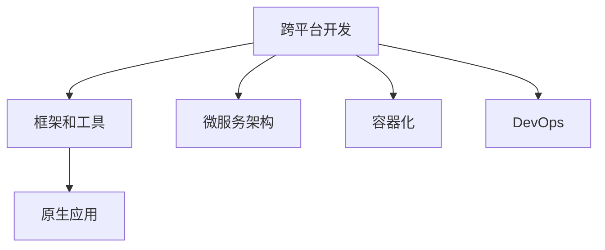

                 

# AI创业公司的跨平台开发策略

## 1. 背景介绍

### 1.1 问题由来

在当今快速变化的科技市场中，AI创业公司面临众多挑战。其中最核心的挑战之一是如何高效、低成本地开发并部署跨平台应用。跨平台开发涉及到多操作系统、多语言环境、多硬件平台等复杂因素，需要在设计阶段就考虑其可扩展性和兼容性。本博客旨在通过全面分析跨平台开发的关键技术点，提供一套系统性的跨平台开发策略。

### 1.2 问题核心关键点

跨平台开发的成功与否，很大程度上取决于以下几方面：

- **可扩展性**：跨平台开发框架和工具需要支持多种操作系统和硬件平台，以便在保持一致性的同时，还能灵活应对不同的用户需求。
- **兼容性**：应用需要在不同设备和环境上稳定运行，避免因环境差异引起的错误。
- **性能优化**：跨平台应用需具备良好的性能表现，尤其是在资源有限的移动设备上。
- **用户体验**：跨平台应用需要提供一致的、符合用户预期的使用体验，尤其是在不同设备上的交互设计。
- **跨语言支持**：开发人员需要使用多种编程语言进行开发，需要确保不同语言的互操作性和代码移植性。
- **开发效率**：高效的工具和自动化测试手段能够大幅提升开发效率，缩短产品上市时间。

## 2. 核心概念与联系

### 2.1 核心概念概述

为了更好地理解跨平台开发策略，我们首先需要了解一些核心概念：

- **跨平台开发**：指开发一个应用程序，使其能够运行在多个操作系统或硬件平台上的过程。常见的跨平台开发工具包括React Native、Flutter、Xamarin等。
- **框架和工具**：跨平台开发框架和工具是实现跨平台开发的基础设施，如React Native使用JavaScript进行开发，提供跨iOS和Android的组件库。
- **原生应用**：指针对特定操作系统和设备平台，使用平台原生编程语言进行开发的应用。原生应用性能通常更好，但在多平台部署成本较高。
- **微服务架构**：微服务架构是将应用程序拆分为多个独立运行的服务，每个服务独立部署、更新，以便提高系统的可扩展性和稳定性。
- **容器化**：容器化是将应用及其依赖打包在容器镜像中，容器在不同环境中保持一致性，便于跨平台部署。
- **DevOps**：DevOps是一种软件开发与运维协作的方法论，通过持续集成和持续交付，加速软件开发流程。

这些概念之间的逻辑关系可以通过以下Mermaid流程图来展示：



这个流程图展示了跨平台开发中不同技术间的联系：

1. 跨平台开发依赖框架和工具进行实现。
2. 原生应用为跨平台开发提供补充，确保部分功能可以在特定平台下发挥最佳性能。
3. 微服务架构和容器化是跨平台开发的重要补充，增强了系统的灵活性和可扩展性。
4. DevOps贯穿整个开发和运维流程，确保跨平台应用的持续集成和快速交付。

## 3. 核心算法原理 & 具体操作步骤

### 3.1 算法原理概述

跨平台开发的核心在于通过抽象和封装不同平台间的差异，实现应用的跨平台兼容性。算法原理包括以下几个关键点：

- **接口定义**：定义一套统一的API接口，屏蔽不同平台间的具体实现差异。
- **组件封装**：将平台特异性的组件进行封装，通过动态加载实现跨平台使用。
- **状态管理**：跨平台应用需要统一管理不同设备上的状态，确保数据同步和一致性。
- **性能优化**：通过编译时和运行时的优化手段，提升跨平台应用的性能表现。
- **资源管理**：合理管理跨平台应用在多个设备上的资源使用，避免资源冲突和浪费。

### 3.2 算法步骤详解

1. **需求分析**：明确跨平台应用的需求和目标，确定支持的平台和设备。
2. **技术选型**：选择合适的跨平台开发框架和工具，评估其性能和兼容性。
3. **架构设计**：设计跨平台应用的架构，确定各模块的职责和接口。
4. **组件开发**：开发平台特异性的组件，进行统一API接口的封装。
5. **状态管理**：实现跨平台状态管理机制，确保数据同步和一致性。
6. **性能优化**：进行性能分析和优化，提升跨平台应用的性能表现。
7. **测试部署**：进行跨平台应用的测试和部署，确保在不同平台上的稳定运行。
8. **迭代改进**：根据用户反馈和需求变化，持续改进跨平台应用。

### 3.3 算法优缺点

跨平台开发方法的优势在于：

- **成本降低**：一次开发可以在多个平台上使用，节省了多平台独立开发的时间和经济成本。
- **用户体验一致**：统一的API和组件，使得应用在不同平台上的使用体验一致。
- **灵活性高**：支持多种操作系统和硬件平台，满足不同用户需求。
- **快速迭代**：跨平台开发工具提供了自动化的测试和部署功能，加速开发迭代。

然而，跨平台开发也存在一些缺点：

- **性能损耗**：跨平台应用在运行时可能需要额外的时间和内存消耗，影响性能。
- **开发难度大**：跨平台开发需要考虑多个平台的具体实现差异，开发难度较大。
- **复杂度高**：跨平台应用的设计和实现复杂度较高，需要具备丰富的开发经验。
- **兼容性问题**：不同平台的特性和限制可能会影响应用的功能实现。

### 3.4 算法应用领域

跨平台开发方法广泛应用于多个领域：

- **移动应用**：如React Native、Flutter等框架，使得开发者可以使用JavaScript、Kotlin等语言开发跨iOS和Android的应用。
- **Web应用**：通过HTML5、CSS3、JavaScript等技术，开发可在多个浏览器上运行的Web应用。
- **桌面应用**：如Electron框架，使得开发者可以使用Web技术开发跨Windows、macOS和Linux的桌面应用。
- **游戏开发**：如Unity引擎，支持多平台游戏开发，包括iOS、Android、PC等。
- **物联网应用**：通过跨平台开发框架，开发适用于不同设备和系统的物联网应用。

## 4. 数学模型和公式 & 详细讲解 & 举例说明

### 4.1 数学模型构建

跨平台开发的数学模型构建主要涉及系统性能优化和资源管理两个方面。以一个跨平台应用的性能优化为例：

假设一个跨平台应用在iOS和Android上运行，其性能目标为每秒处理的请求数（TPS），即：

$$
\text{TPS}_i = \frac{N_i}{T_i}
$$

其中 $N_i$ 为iOS或Android平台上的请求数，$T_i$ 为请求响应时间。优化目标是最大化跨平台应用的TPS，公式可以表示为：

$$
\max\limits_{\theta} \frac{N_i}{T_i} \quad \text{subject to} \quad N_i + N_a = N, T_i + T_a = T
$$

其中 $N_a$ 和 $T_a$ 分别表示Android平台上的请求数和响应时间，$N$ 和 $T$ 为整个系统的请求数和响应时间。

### 4.2 公式推导过程

根据上述模型，我们可以通过优化算法（如遗传算法、模拟退火等）寻找最优的请求数和响应时间分配策略，使得跨平台应用的整体性能最大化。

- **请求数分配**：通过遗传算法寻找最优的请求数分配比例，使得系统在两个平台上的性能差异最小化。
- **响应时间优化**：采用模拟退火算法优化各平台的响应时间，减少瓶颈效应。
- **负载均衡**：通过动态调整各平台上的请求分配，实现负载均衡，避免资源浪费和性能瓶颈。

### 4.3 案例分析与讲解

以一个跨平台电商应用的性能优化为例，分析其跨平台性能提升策略：

假设电商应用在iOS和Android上的请求数和响应时间分别为 $N_i$ 和 $T_i$，$N_a$ 和 $T_a$。通过性能监控和分析，发现iOS平台的响应时间比Android平台长，需采取优化措施：

- **请求数重新分配**：通过优化算法，将部分请求重新分配到响应时间较短的Android平台，提升整体TPS。
- **响应时间优化**：针对iOS平台，优化前端代码，减少内存泄漏和资源争用，降低响应时间。
- **负载均衡**：采用负载均衡策略，动态调整请求分配，确保系统稳定性。

通过以上优化措施，实现跨平台应用的性能提升，提高用户满意度。

## 5. 项目实践：代码实例和详细解释说明

### 5.1 开发环境搭建

为了进行跨平台开发实践，我们需要搭建适合的环境：

1. **安装开发工具**：如Visual Studio Code、Android Studio、Xcode等，确保支持多种平台开发。
2. **安装跨平台框架**：如React Native、Flutter、Xamarin等，确保安装最新版本的框架和工具。
3. **配置开发环境**：确保开发环境支持多平台开发，如设置模拟器和调试工具。

### 5.2 源代码详细实现

以下是一个使用React Native进行跨平台开发的代码实例：

```javascript
// React Native代码示例
import React, { Component } from 'react';
import { StyleSheet, Text, View } from 'react-native';

export default class App extends Component {
  render() {
    return (
      <View style={styles.container}>
        <Text>Hello, World!</Text>
      </View>
    );
  }
}

const styles = StyleSheet.create({
  container: {
    flex: 1,
    backgroundColor: '#fff',
    alignItems: 'center',
    justifyContent: 'center',
  },
});
```

### 5.3 代码解读与分析

1. **组件开发**：React Native提供了一套完整的UI组件库，开发者可以通过声明式方式定义用户界面。
2. **状态管理**：React Native使用状态管理机制，确保数据在不同组件间的同步和一致性。
3. **性能优化**：React Native提供了一套性能优化工具，如Image、Animated组件，加速图像和动画的渲染。

### 5.4 运行结果展示

通过上述代码实例，可以搭建一个简单的跨平台应用，展示“Hello, World!”。该应用可以在iOS和Android设备上运行，展示跨平台开发的优势。

## 6. 实际应用场景

### 6.1 企业应用

企业应用中，跨平台开发广泛应用于内部管理、客户服务等场景。通过跨平台开发，企业可以构建统一的内部管理平台，方便员工随时随地进行协作。

### 6.2 金融服务

金融服务领域，跨平台应用可以提供多渠道的客户服务，如移动银行、在线理财等。通过跨平台开发，金融服务机构可以实现多个平台间的无缝衔接，提升用户体验。

### 6.3 医疗健康

医疗健康领域，跨平台应用可以提供远程医疗、健康管理等服务。通过跨平台开发，医疗健康机构可以构建统一的医疗健康平台，提高服务效率。

### 6.4 游戏娱乐

游戏娱乐领域，跨平台应用可以提供跨设备、跨平台的游戏体验。通过跨平台开发，游戏开发商可以实现多平台的游戏互通，提升用户粘性。

## 7. 工具和资源推荐

### 7.1 学习资源推荐

为了全面掌握跨平台开发技术，以下是一些推荐的学习资源：

1. **《跨平台开发实战指南》**：本书系统介绍了跨平台开发的理论基础和实践技巧，涵盖React Native、Flutter、Xamarin等多种技术。
2. **Coursera《移动应用开发》课程**：由业内知名专家授课，涵盖跨平台开发的基础知识和实践技能。
3. **Udacity《移动应用开发》纳米学位**：提供系统化的跨平台开发课程，包含React Native、Flutter等技术。
4. **YouTube《跨平台开发教程》系列视频**：提供丰富的跨平台开发实战教学视频，适合自学。

### 7.2 开发工具推荐

跨平台开发需要多种工具的支持，以下是一些推荐的工具：

1. **React Native**：提供跨平台UI开发框架，支持iOS和Android平台。
2. **Flutter**：提供跨平台UI开发框架，支持iOS、Android、Web等多种平台。
3. **Xamarin**：提供跨平台开发框架，支持iOS、Android、Windows等多种平台。
4. **Visual Studio Code**：轻量级代码编辑器，支持多种编程语言和跨平台开发。
5. **Android Studio**：Android平台开发工具，支持Kotlin和Java语言。
6. **Xcode**：iOS平台开发工具，支持Swift和Objective-C语言。

### 7.3 相关论文推荐

为了深入理解跨平台开发的技术原理，以下是一些推荐的相关论文：

1. **《Cross-Platform Development with React Native》**：介绍React Native的技术实现和应用场景。
2. **《Cross-Platform Development with Flutter》**：介绍Flutter的技术实现和应用场景。
3. **《Cross-Platform Development with Xamarin》**：介绍Xamarin的技术实现和应用场景。
4. **《Mobile App Development with Native Code》**：介绍原生应用开发的基础知识和实践技能。
5. **《Cross-Platform Mobile Development》**：介绍跨平台移动应用开发的系统方法和实践经验。

## 8. 总结：未来发展趋势与挑战

### 8.1 研究成果总结

本文详细介绍了跨平台开发的理论基础和实践技巧，系统梳理了跨平台开发的核心概念和算法原理。通过系统性分析跨平台开发的优势和挑战，提供了全面的跨平台开发策略。

### 8.2 未来发展趋势

跨平台开发技术在未来将呈现以下几个发展趋势：

1. **多模态开发**：跨平台开发将支持更多设备和平台，如智能家居、智能穿戴设备等。
2. **AI技术融合**：跨平台应用将更多融入AI技术，如机器学习、自然语言处理等，提升用户体验。
3. **云服务支持**：跨平台应用将更多集成云服务，实现数据同步和实时更新。
4. **边缘计算**：跨平台应用将更多利用边缘计算，提升应用响应速度和稳定性。
5. **区块链集成**：跨平台应用将更多集成区块链技术，实现数据安全和透明。

### 8.3 面临的挑战

跨平台开发在实际应用中仍面临诸多挑战：

1. **性能瓶颈**：跨平台应用在不同平台上的性能表现差异较大，需进一步优化。
2. **兼容性问题**：跨平台应用在不同设备上的兼容性需进一步提升。
3. **开发难度大**：跨平台开发需要考虑多个平台的具体实现差异，开发难度较大。
4. **安全风险**：跨平台应用需加强安全防护，防止数据泄露和攻击。
5. **用户接受度**：用户对跨平台应用的接受度需进一步提高。

### 8.4 研究展望

未来跨平台开发需从以下几个方向进行深入研究：

1. **自动化开发**：通过自动化的工具和框架，降低跨平台开发的难度。
2. **标准化规范**：制定跨平台开发的行业标准，提升开发和部署的规范性。
3. **跨平台测试**：开发多平台测试工具和框架，提高应用的质量和稳定性。
4. **跨平台优化**：优化跨平台应用的性能表现，提升用户体验。
5. **跨平台管理**：开发跨平台管理系统，实现应用的统一管理和维护。

## 9. 附录：常见问题与解答

**Q1: 跨平台开发和原生开发有什么区别？**

A: 原生开发针对特定平台进行开发，通常使用平台原生编程语言，性能表现较好。跨平台开发通过框架和工具实现多平台支持，开发成本较低，但性能可能有所损失。

**Q2: 跨平台开发的常见框架有哪些？**

A: 常见的跨平台开发框架包括React Native、Flutter、Xamarin等。React Native使用JavaScript进行开发，支持iOS和Android平台；Flutter使用Dart语言，支持iOS、Android、Web等多种平台；Xamarin使用C#语言，支持iOS、Android、Windows等多种平台。

**Q3: 跨平台开发会降低应用性能吗？**

A: 跨平台应用在运行时可能需要额外的时间和内存消耗，影响性能。但通过优化和适配，可以提升跨平台应用的性能表现。

**Q4: 跨平台开发有哪些优势？**

A: 跨平台开发的优势包括成本降低、用户体验一致、灵活性高、开发效率高等。但同时，也需要考虑性能损耗、开发难度大、复杂度高、兼容性问题等缺点。

**Q5: 跨平台开发需要考虑哪些因素？**

A: 跨平台开发需要考虑需求分析、技术选型、架构设计、组件开发、状态管理、性能优化、测试部署、迭代改进等多个因素。

---

作者：禅与计算机程序设计艺术 / Zen and the Art of Computer Programming

