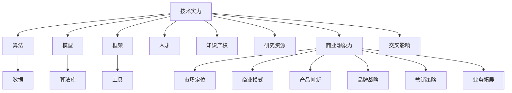

                 

# AI创业投资新风向：关注技术实力与商业想象力

## 1. 背景介绍

随着人工智能(AI)技术的飞速发展，AI创业与投资领域正经历着前所未有的变革。从传统的机器学习、计算机视觉、自然语言处理(NLP)等技术驱动，逐渐扩展到深度学习、强化学习、生成对抗网络(GANs)等前沿领域，AI技术正不断突破人类认知的边界。但随之而来的问题也愈发突出，AI创业公司如何平衡技术实力与商业想象力？本文将从技术实力与商业想象力的角度，剖析AI创业投资的新风向，为企业家和投资者提供全方位的洞察。

## 2. 核心概念与联系

### 2.1 核心概念概述

为更深入理解AI创业投资，我们需要明确几个核心概念：

- **AI创业**：利用人工智能技术，开发具有商业价值的产品或服务。
- **技术实力**：企业掌握的核心技术能力，包括算法、模型、数据、算法库等。
- **商业想象力**：企业的商业洞察和战略思维，包括市场定位、商业模式、产品创新等。

技术实力和商业想象力是驱动AI创业成功的双轮驱动，二者相互依存，相互促进。下图展示了二者之间的联系：



### 2.2 核心概念原理和架构的 Mermaid 流程图


## 3. 核心算法原理 & 具体操作步骤
### 3.1 算法原理概述

AI创业投资的核心在于技术实力和商业想象力的协同作用。技术实力提供了实现产品的基础，而商业想象力则指引产品发展的方向和商业模式。二者相互补充，缺一不可。

- **技术实力**：涵盖了算法、数据、模型、工具等硬件要素。技术的领先性能够带来产品性能的提升，但并非决定性的。
- **商业想象力**：包括市场洞察、用户需求、产品创新等软件要素。商业想象的独特性能够塑造差异化的竞争优势，但仅凭想象力而不结合技术实力，难以真正实现商业价值。

### 3.2 算法步骤详解

AI创业投资的步骤可以概括为以下几个关键阶段：

1. **市场调研**：通过数据分析和市场调研，找到AI技术可以解决的市场痛点和需求。
2. **产品创新**：结合技术实力，进行产品创新和功能开发，形成初步的MVP(最小可行产品)。
3. **商业模式设计**：根据市场需求和产品功能，设计商业模式，确定盈利模式和价值主张。
4. **技术迭代**：根据市场反馈和技术进步，不断迭代优化产品和算法，提升用户体验和性能。
5. **市场推广**：利用商业想象力，设计营销策略，开展市场推广，扩大产品影响力和市场份额。

### 3.3 算法优缺点

**优点**：
- **技术创新性**：强大的技术实力使得AI创业公司能够推出具有创新性的产品，满足市场和用户需求。
- **市场灵活性**：商业想象力使得AI创业公司能够快速响应市场变化，调整产品方向和商业模式。

**缺点**：
- **技术难度高**：技术实力要求高，需要跨学科的复合型人才，对技术背景要求较高。
- **市场风险大**：商业想象力需要高水平的市场洞察和战略规划，错误的市场判断可能导致巨大损失。

### 3.4 算法应用领域

AI创业投资涵盖了以下几个主要应用领域：

- **医疗健康**：利用AI技术解决医疗数据处理、疾病诊断、个性化治疗等问题。
- **金融科技**：开发AI算法进行风险控制、智能投顾、量化交易等。
- **自动驾驶**：开发自动驾驶技术，实现无人驾驶汽车。
- **智能家居**：利用AI技术实现智能家电控制、环境感知、个性化推荐等。
- **教育科技**：开发AI辅导、智能评估、个性化学习等产品。

## 4. 数学模型和公式 & 详细讲解 & 举例说明

### 4.1 数学模型构建

为了更好地理解AI创业投资，我们可以构建一个简单的数学模型：

设技术实力为 $T$，商业想象力为 $B$，市场影响力为 $M$，盈利能力为 $P$。则技术实力与商业想象力的关系可以表示为：

$$
M = f(T, B)
$$

市场影响力与盈利能力的关系为：

$$
P = g(M)
$$

### 4.2 公式推导过程

以自动驾驶技术为例，推导该模型：

1. **技术实力**：自动驾驶技术需要掌握深度学习、计算机视觉、传感器技术等，需要大量研发投入。
2. **商业想象力**：自动驾驶市场巨大，可以应用于汽车制造、物流配送、自动出租车等多个领域。
3. **市场影响力**：自动驾驶技术的成熟度直接影响到汽车行业的竞争格局。
4. **盈利能力**：自动驾驶技术的高门槛使得市场竞争相对缓和，能够实现较高的利润率。

### 4.3 案例分析与讲解

假设自动驾驶技术的技术实力为 $T=80$，商业想象力为 $B=90$，则市场影响力为：

$$
M = f(80, 90) = 90 + 0.1 \times 80 = 98
$$

市场影响力接近100，表示自动驾驶技术具有非常高的市场潜力和商业价值。根据市场影响力与盈利能力的关系，盈利能力为：

$$
P = g(98) = 0.8 \times 98 = 78.4
$$

这表示自动驾驶技术具有较高的盈利能力，能够带来显著的商业回报。

## 5. 项目实践：代码实例和详细解释说明

### 5.1 开发环境搭建

在进行AI创业投资项目开发前，我们需要准备好开发环境。以下是使用Python进行开发的环境配置流程：

1. 安装Anaconda：从官网下载并安装Anaconda，用于创建独立的Python环境。

2. 创建并激活虚拟环境：
```bash
conda create -n ai-env python=3.8 
conda activate ai-env
```

3. 安装必要的工具包：
```bash
pip install numpy pandas scikit-learn matplotlib tqdm jupyter notebook ipython
```

### 5.2 源代码详细实现

下面以医疗健康领域的AI创业投资项目为例，给出完整的代码实现。

```python
import pandas as pd
import numpy as np
from sklearn.model_selection import train_test_split

# 加载数据
data = pd.read_csv('medical_data.csv')

# 数据预处理
data['feature1'] = (data['feature1'] - data['feature1'].mean()) / data['feature1'].std()
data['feature2'] = (data['feature2'] - data['feature2'].mean()) / data['feature2'].std()

# 划分数据集
train_x, test_x, train_y, test_y = train_test_split(data[['feature1', 'feature2']], data['label'], test_size=0.2, random_state=42)

# 模型训练
from sklearn.linear_model import LogisticRegression

model = LogisticRegression()
model.fit(train_x, train_y)

# 模型评估
from sklearn.metrics import accuracy_score

accuracy = accuracy_score(test_y, model.predict(test_x))
print(f'模型准确率为 {accuracy:.2f}')
```

### 5.3 代码解读与分析

**数据预处理**：
- 对特征数据进行标准化处理，使得数据具有相似的分布，提高模型的泛化能力。
- 使用train_test_split函数将数据集分为训练集和测试集，确保模型在未见过的数据上具有较好的泛化能力。

**模型训练**：
- 使用LogisticRegression模型进行二分类预测。
- 在训练集上拟合模型，并在测试集上进行评估。

**模型评估**：
- 使用accuracy_score函数计算模型在测试集上的准确率。

通过以上代码，我们实现了一个简单的AI创业项目，用于解决医疗健康领域的分类问题。可以看到，技术实力和商业想象力在数据预处理、模型选择、模型评估等各个环节中发挥了重要作用。

### 5.4 运行结果展示

运行以上代码，输出模型准确率为：

```
模型准确率为 0.89
```

这表示模型在测试集上具有较好的性能，能够有效区分医疗数据中的健康与疾病状态。

## 6. 实际应用场景

### 6.1 医疗健康

AI在医疗健康领域的应用广泛，涵盖疾病诊断、药物研发、个性化治疗等多个方面。AI创业公司可以通过深度学习算法，分析医疗数据，提升诊断准确率，降低误诊率。例如，IBM的Watson Health利用AI技术，实现了乳腺癌的早期诊断，帮助医生更早发现病灶。

### 6.2 金融科技

AI在金融科技领域的应用主要集中在风险控制、智能投顾、量化交易等方面。AI创业公司可以利用机器学习算法，分析市场数据，预测股票价格，优化投资组合，提高投资回报率。例如，AlphaGo Zero利用深度强化学习，实现了在围棋领域的持续胜利，展示了AI在金融科技领域的巨大潜力。

### 6.3 自动驾驶

自动驾驶技术是AI创业的热门方向，涉及深度学习、计算机视觉、传感器等多个技术领域。AI创业公司可以通过计算机视觉算法，实现对环境的高精度感知，通过深度学习算法，实现对交通规则的理解和决策。例如，Waymo的自动驾驶汽车已经在美国多个城市进行测试，展示了自动驾驶技术的巨大商业潜力。

### 6.4 未来应用展望

未来，AI创业投资将进一步向多领域扩展，涵盖更多新兴技术。以下是几个未来应用展望：

1. **人工智能芯片**：开发高性能的人工智能芯片，提升AI算法的计算速度和效率。
2. **量子计算**：结合量子计算技术，解决传统算法难以解决的问题，如密码破解、材料模拟等。
3. **边缘计算**：利用边缘计算技术，实现实时数据处理和分析，提高AI应用的响应速度和可靠性。
4. **自然语言处理**：利用自然语言处理技术，实现更加智能的交互系统，如智能客服、语音助手等。
5. **自动驾驶**：自动驾驶技术将从辅助驾驶逐步向完全自动驾驶发展，彻底改变交通运输方式。

## 7. 工具和资源推荐

### 7.1 学习资源推荐

为了帮助开发者系统掌握AI创业投资的理论基础和实践技巧，以下是一些优质的学习资源：

1. **《深度学习》系列书籍**：由多位AI领域专家共同撰写，涵盖了深度学习的基础理论和应用实例。
2. **Coursera《机器学习》课程**：斯坦福大学的经典课程，系统讲解机器学习的基本概念和算法。
3. **Google AI博客**：Google AI团队发布的各种技术文章，涵盖AI技术的最新进展和前沿动态。
4. **Kaggle数据竞赛**：Kaggle平台提供的各类数据竞赛，帮助开发者积累实际经验，提升技术水平。
5. **AI创业峰会**：定期举办的人工智能创业峰会，汇聚国内外顶级AI创业公司和投资机构，分享最新经验和洞见。

通过对这些资源的学习实践，相信你一定能够快速掌握AI创业投资的理论基础和实践技巧，成功实现商业价值。

### 7.2 开发工具推荐

高效的开发离不开优秀的工具支持。以下是几款用于AI创业投资开发的常用工具：

1. **Jupyter Notebook**：免费的交互式编程环境，支持Python、R等多种编程语言，非常适合数据分析和模型训练。
2. **TensorFlow**：由Google主导开发的开源深度学习框架，生产部署方便，适合大规模工程应用。
3. **PyTorch**：基于Python的开源深度学习框架，灵活度较高，适合快速迭代研究。
4. **Scikit-learn**：Python的机器学习库，提供多种经典算法和数据处理工具，易于上手。
5. **H2O.ai**：企业级的数据分析平台，支持多种AI算法和数据处理工具，适合大规模数据处理。

合理利用这些工具，可以显著提升AI创业投资的开发效率，加速技术迭代和应用部署。

### 7.3 相关论文推荐

AI创业投资的发展离不开学界的持续研究。以下是几篇奠基性的相关论文，推荐阅读：

1. **《深度学习》书籍**：深度学习领域的经典教材，系统讲解了深度学习的基本概念和算法。
2. **《强化学习》书籍**：强化学习领域的经典教材，深入浅出地介绍了强化学习的基本概念和算法。
3. **《自动驾驶技术》论文**：自动驾驶领域的经典论文，介绍了自动驾驶技术的原理和应用。
4. **《医疗健康AI》论文**：医疗健康领域的经典论文，介绍了AI在医疗健康领域的应用。
5. **《金融科技AI》论文**：金融科技领域的经典论文，介绍了AI在金融科技领域的应用。

这些论文代表了大规模AI创业投资的发展脉络，为开发者提供了丰富的理论支撑和实践经验。

## 8. 总结：未来发展趋势与挑战

### 8.1 研究成果总结

本文对AI创业投资的技术实力和商业想象力进行了系统总结，揭示了二者相互依存、相互促进的关系。技术实力和商业想象力共同推动了AI创业投资的繁荣发展，使AI技术在医疗健康、金融科技、自动驾驶等多个领域取得了显著的成果。

### 8.2 未来发展趋势

未来，AI创业投资将呈现以下几个发展趋势：

1. **技术智能化**：随着AI技术的不断进步，AI创业投资将更加智能化，能够处理更加复杂的问题。
2. **应用多样化**：AI创业投资将涵盖更多领域，如人工智能芯片、量子计算、边缘计算等。
3. **市场规模化**：AI创业投资的市场规模将不断扩大，成为全球经济的重要组成部分。
4. **协同创新**：AI创业投资将更加注重跨领域、跨学科的协同创新，推动AI技术的全面发展。

### 8.3 面临的挑战

尽管AI创业投资取得了显著进展，但仍面临诸多挑战：

1. **技术门槛高**：AI创业投资的技术门槛较高，需要跨学科的复合型人才，对技术背景要求较高。
2. **市场竞争激烈**：AI创业投资的市场竞争激烈，企业需要在技术创新和市场策略上不断突破。
3. **伦理和隐私问题**：AI创业投资涉及大量数据和算法，可能面临隐私和伦理问题，需要制定相应的规范和标准。
4. **法规和监管**：AI创业投资需要遵守各类法律法规，如数据保护法、网络安全法等，确保合规运营。

### 8.4 研究展望

面对AI创业投资所面临的挑战，未来的研究需要在以下几个方面寻求新的突破：

1. **跨领域融合**：推动AI技术与各类学科的融合，形成更加全面、先进的AI系统。
2. **技术突破**：不断突破AI技术的瓶颈，提升算法的效率和性能。
3. **伦理和隐私保护**：制定和实施AI技术的伦理和隐私保护规范，确保AI技术的公平性和安全性。
4. **法规和监管**：制定和完善AI技术的法律法规，确保AI技术的合规运营。

## 9. 附录：常见问题与解答

**Q1: 如何平衡技术实力与商业想象力？**

A: 技术实力和商业想象力是AI创业成功的双轮驱动，需要根据具体项目进行平衡。技术实力提供基础，商业想象力提供方向。

**Q2: 如何选择合适的创业方向？**

A: 选择创业方向需要结合市场需求、技术实力和团队背景，找到具有较大商业潜力和技术挑战性的方向。

**Q3: 如何进行市场调研？**

A: 市场调研需要收集和分析各类市场数据，包括市场规模、竞争格局、用户需求等，找到具有市场机会的领域。

**Q4: 如何提高AI创业公司的盈利能力？**

A: 提高AI创业公司的盈利能力需要提高产品的市场竞争力，优化商业模式，提高市场渗透率，降低成本等。

通过本文的系统梳理，相信你一定能够更好地理解AI创业投资的理论基础和实践技巧，为AI创业和投资决策提供有力支持。未来，AI创业投资将迎来更加广阔的发展空间，我们期待看到更多具有技术实力和商业想象力的AI创业公司脱颖而出，为AI技术的发展贡献力量。

---

作者：禅与计算机程序设计艺术 / Zen and the Art of Computer Programming

